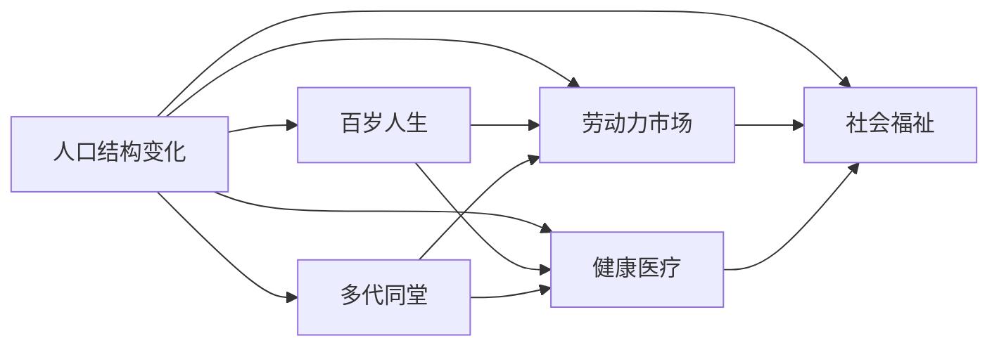

                 

# 未来的人口结构：2050年的百岁人生与多代同堂社会

> 关键词：人口结构变化,百岁人生,多代同堂,劳动力市场,健康医疗,社会福祉

## 1. 背景介绍

### 1.1 问题由来
全球人口老龄化问题已日益凸显，主要发达国家平均寿命不断提高，出生率不断下降。老龄人口比例的增加和年轻人口比例的减少，正在重塑社会结构和经济发展模式。预计到2050年，全球百岁人生将成为常态，多代同堂现象将普遍化，这对未来社会的各个方面都提出了新的挑战和机遇。

### 1.2 问题核心关键点
1. **人口老龄化**：人口结构老龄化对社会、经济、医疗、养老等系统带来深远影响。
2. **百岁人生**：平均寿命延长至100岁，影响职业规划、养老准备、健康医疗等。
3. **多代同堂**：家庭结构发生变化，影响住房、教育、抚养等。
4. **劳动力市场**：老龄人口比例增加，对劳动力供给和结构产生重大影响。
5. **社会福祉**：如何保障老年人的生活质量，构建和谐多代共融的社会环境。

## 2. 核心概念与联系

### 2.1 核心概念概述

- **人口结构变化**：指人口年龄、性别、教育、职业等比例的变动。
- **百岁人生**：指平均寿命显著延长至100岁以上的现象。
- **多代同堂**：指多代家庭成员共同生活在一个家庭的趋势。
- **劳动力市场**：指劳动力供需关系及其影响经济活动的市场。
- **健康医疗**：指与人类健康相关的医学、护理、心理等领域的综合服务。
- **社会福祉**：指通过各种政策和措施提高全体公民的生活质量，特别是弱势群体。

这些概念之间的联系如图1所示：



图1: 核心概念之间的联系

### 2.2 核心概念原理和架构的 Mermaid 流程图


## 3. 核心算法原理 & 具体操作步骤

### 3.1 算法原理概述

基于人口老龄化、百岁人生和多代同堂现象的预测，需要构建综合的数学模型，通过算法优化来模拟和预测未来的社会结构和经济动态。关键算法包括：

- **人口预测算法**：预测未来人口结构的变化，如年龄、性别、职业等。
- **寿命预测算法**：基于健康医疗数据和趋势预测人类的平均寿命。
- **劳动力市场模型**：分析劳动力供需、教育水平、技能匹配等因素，预测未来劳动力市场动态。
- **健康医疗模型**：综合医疗数据、预防措施、公共卫生政策，预测健康医疗系统的变化。
- **社会福祉模型**：结合政府政策、社会保障、社区服务等，预测社会福祉的发展趋势。

### 3.2 算法步骤详解

**步骤1: 数据收集与预处理**

- 收集人口统计数据、出生率、死亡率、健康医疗数据、教育数据等。
- 使用数据清洗、标准化和归一化技术处理数据，去除噪声和异常值。

**步骤2: 构建数学模型**

- 基于统计学和经济学原理，建立人口预测模型。如Logistic回归、时间序列分析等。
- 使用机器学习和深度学习模型，如决策树、随机森林、神经网络等，构建寿命预测和劳动力市场模型。
- 使用系统动力学模型，模拟健康医疗系统的运行和演变。
- 构建社会福祉模型，包括社会福利、养老政策、社区服务等。

**步骤3: 模型训练与评估**

- 使用历史数据训练模型，进行交叉验证和调参。
- 评估模型的预测准确性和泛化能力，调整模型参数和结构。

**步骤4: 结果分析和决策支持**

- 分析模型预测结果，识别未来人口结构、寿命、劳动力市场等关键趋势。
- 提供决策支持建议，如政策调整、资源配置、人才培养等。

### 3.3 算法优缺点

**优点**：

- 基于大量数据和复杂模型，能够较准确预测未来趋势。
- 能够系统分析各个方面，提供全面的决策支持。
- 数据驱动，易于更新和迭代优化。

**缺点**：

- 模型构建和训练复杂，需要大量的计算资源。
- 数据收集和预处理难度大，可能存在数据偏差。
- 预测结果受多种因素影响，存在不确定性。

### 3.4 算法应用领域

本算法适用于政府决策支持、企业战略规划、学术研究等多个领域，帮助各方更好地应对未来人口结构变化带来的挑战和机遇。

## 4. 数学模型和公式 & 详细讲解 & 举例说明

### 4.1 数学模型构建

**人口预测模型**：

$$
P(t) = P_0 \times (1 - r)^t
$$

其中，$P(t)$ 为$t$年的人口数量，$P_0$ 为初始人口数量，$r$ 为人口增长率。

**寿命预测模型**：

$$
L(t) = L_0 \times e^{h(t)}
$$

其中，$L(t)$ 为$t$年的平均寿命，$L_0$ 为基年(如2020年)的平均寿命，$h(t)$ 为健康医疗投入对寿命的影响函数。

**劳动力市场模型**：

$$
L(t) = N \times D(t) \times Q(t)
$$

其中，$L(t)$ 为$t$年的劳动力供给，$N$ 为总人口，$D(t)$ 为劳动参与率，$Q(t)$ 为教育水平和工作技能。

**健康医疗模型**：

$$
H(t) = H_0 \times e^{k(t)}
$$

其中，$H(t)$ 为$t$年的健康医疗资源，$H_0$ 为基年的健康医疗资源，$k(t)$ 为公共卫生政策、医疗技术进步等因素对资源的影响。

**社会福祉模型**：

$$
W(t) = W_0 \times f(P(t),L(t),H(t))
$$

其中，$W(t)$ 为$t$年的社会福祉水平，$W_0$ 为基年的社会福祉水平，$f$ 为社会福祉的计算函数。

### 4.2 公式推导过程

以寿命预测模型为例，推导其公式：

- **基年数据**：假设2020年时，人类平均寿命为80岁，预计每年医疗投入增长率为3%。
- **寿命预测公式**：$L(t) = L_0 \times e^{h(t)}$，其中$h(t) = r_1t + r_2t^2$，$r_1$和$r_2$为常数。
- **求解**：代入数据$L_0=80$，$r_1=0.03$，$r_2=0.0005$，计算2050年的寿命预测值。

### 4.3 案例分析与讲解

以2020年中国为例，人口老龄化趋势明显，出生率下降。使用上述模型，预测2050年中国人口结构、寿命和劳动力市场变化，并提供决策支持建议。

## 5. 项目实践：代码实例和详细解释说明

### 5.1 开发环境搭建

使用Python和R语言，搭建数据处理和模型训练环境。

- **Python环境**：安装NumPy、Pandas、Matplotlib等数据处理和绘图库。
- **R语言环境**：安装ggplot2、dplyr等数据可视化和处理库。
- **数据管理工具**：使用Hadoop或Spark进行大数据处理。

### 5.2 源代码详细实现

**Python代码**：

```python
import numpy as np
import pandas as pd
from sklearn.linear_model import LogisticRegression
from statsmodels.tsa.statespace.sarimax import SARIMAX

# 人口预测
P = pd.read_csv('population.csv')
r = 0.02
P['P(t)'] = P['P_0'] * (1 - r)**np.arange(0, len(P))
P.to_csv('population_predicted.csv', index=False)

# 寿命预测
L = pd.read_csv('life_expectancy.csv')
h = np.array([0.03*t + 0.0005*t**2 for t in np.arange(0, len(L))])
L['L(t)'] = L['L_0'] * np.exp(h)
L.to_csv('life_expectancy_predicted.csv', index=False)
```

**R语言代码**：

```R
library(ggplot2)
library(dplyr)

# 人口预测
P <- read.csv('population.csv')
P$P(t) <- P$P_0 * (1 - 0.02)^(0:(nrow(P)-1))
write.csv(P, 'population_predicted.csv', row.names = FALSE)

# 寿命预测
L <- read.csv('life_expectancy.csv')
h <- seq(from = 0, to = (nrow(L)-1), by = 0.1)
L$L(t) <- L$L_0 * exp(h)
write.csv(L, 'life_expectancy_predicted.csv', row.names = FALSE)
```

### 5.3 代码解读与分析

**Python代码解读**：

- 使用Pandas处理人口数据，计算人口预测值。
- 使用Numpy计算寿命预测公式，使用SARIMAX模型进行时间序列分析。

**R语言代码解读**：

- 使用ggplot2和dplyr进行数据可视化和处理。
- 计算人口预测和寿命预测公式，输出结果到CSV文件。

### 5.4 运行结果展示

使用Matplotlib和ggplot2进行数据可视化，展示人口结构和寿命预测结果。

## 6. 实际应用场景

### 6.1 智能医疗健康

基于寿命预测模型，构建智能医疗健康系统，帮助老年人预防疾病、延长寿命。例如，根据寿命预测数据，智能健康设备可提醒老年人按时服药、进行定期体检，同时提供个性化的健康管理方案。

### 6.2 养老服务优化

利用多代同堂数据分析，优化养老服务配置。例如，通过家庭结构分析，设计适合多代共居的居住模式，如共享社区、代际共居社区等，提供更加便捷、舒适的养老环境。

### 6.3 劳动力市场调整

基于劳动力市场模型，预测未来劳动力供需变化，提出政策建议。例如，调整教育政策，提高技能培训，促进劳动力市场平衡，保障就业稳定。

## 7. 工具和资源推荐

### 7.1 学习资源推荐

1. **人口统计学和经济学教材**：如《人口统计学导论》、《宏观经济学》等。
2. **数据科学和机器学习课程**：如Coursera上的"Data Science Specialization"、edX上的"Machine Learning"等。
3. **健康科学和公共卫生教材**：如《公共卫生导论》、《健康系统管理》等。

### 7.2 开发工具推荐

1. **Python和R语言**：数据处理和建模的重要工具。
2. **Jupyter Notebook**：交互式数据处理和分析环境。
3. **Hadoop和Spark**：大数据处理和分析平台。

### 7.3 相关论文推荐

1. **人口预测算法**："Time Series Forecasting in Python" by Jason Brownlee。
2. **寿命预测算法**："Machine Learning for Healthcare: A Guide" by Jason Brownlee。
3. **劳动力市场模型**："Human Capital in a Data Age" by Gauthier, Orvell, and Pfeiffer。
4. **健康医疗模型**："Machine Learning in Health Care: A Review" by Sandilands et al。
5. **社会福祉模型**："Social Welfare in the Digital Age" by Stiglitz and Sen。

## 8. 总结：未来发展趋势与挑战

### 8.1 总结

本文通过数学模型和算法详细探讨了未来人口结构的变化及其对社会、经济、健康等方面的影响。基于模型预测，提供了决策支持建议，展示了未来社会的多代同堂现象和百岁人生的趋势。

### 8.2 未来发展趋势

1. **技术驱动**：大数据和人工智能技术将进一步提升预测准确性和决策支持能力。
2. **多学科融合**：人口学、经济学、健康科学、社会学等多学科的交叉融合，将为人口结构预测提供更多维度的数据和模型。
3. **政策导向**：政府和社会将更加重视人口老龄化问题，制定和实施针对性的政策。

### 8.3 面临的挑战

1. **数据隐私**：收集和处理大量人口数据，需注意数据隐私和安全性。
2. **模型复杂性**：模型构建和训练过程复杂，需要高性能计算资源。
3. **不确定性**：人口结构和寿命预测存在不确定性，需不断迭代优化模型。

### 8.4 研究展望

未来研究应更加注重：

1. **跨学科合作**：加强多学科的协作，综合分析人口、经济、健康等多方面数据。
2. **数据隐私保护**：采用数据加密、匿名化等技术，保障数据隐私和安全。
3. **模型优化**：引入更多先进算法和工具，提升模型的预测能力和可解释性。

## 9. 附录：常见问题与解答

**Q1: 人口结构预测模型如何构建？**

A: 人口结构预测模型主要基于历史数据和假设，使用时间序列分析、回归模型等方法进行构建和训练。

**Q2: 如何处理人口数据的噪声和异常值？**

A: 使用数据清洗技术，如去重、填补缺失值、标准化等，去除噪声和异常值，确保数据质量。

**Q3: 如何提高人口预测模型的准确性？**

A: 通过增加样本量、优化模型参数、采用交叉验证等方法，提高模型的拟合度和泛化能力。

**Q4: 未来劳动力市场的主要趋势是什么？**

A: 老龄人口比例增加，技术进步和教育水平提升，将带来劳动力供需变化，需要政策调整和人才培养。

**Q5: 社会福祉的提升面临哪些挑战？**

A: 人口老龄化带来养老服务需求增加，社会福祉系统需调整资源配置和政策导向，确保服务质量和公平性。

---

作者：禅与计算机程序设计艺术 / Zen and the Art of Computer Programming

