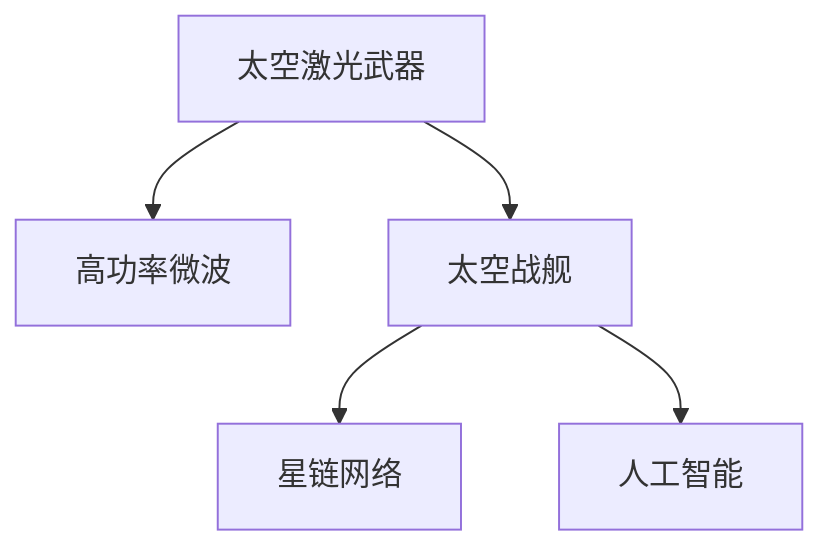

                 

# 未来的太空军事：2050年的太空激光武器与太空战舰

> 关键词：太空激光武器, 太空战舰, 高功率微波, 星链网络, 太空竞赛, 人工智能

## 1. 背景介绍

### 1.1 问题由来
自人类步入太空时代以来，太空的战略地位日益提升，成为各国争夺的新高地。随着技术的不断进步，太空军事能力也逐步从科幻变为现实。未来，太空战舰、激光武器等高科技装备将成为主要的太空作战力量，改变传统的战争形态。本篇文章将深度探讨2050年太空军事的最新发展趋势，特别是太空激光武器与太空战舰的核心技术及应用前景。

### 1.2 问题核心关键点
本文的核心讨论点包括：
- 太空激光武器的原理与优势
- 太空战舰的架构与作战策略
- 人工智能在太空军事中的应用
- 太空军事的未来发展趋势与挑战
- 太空军事技术对国际政治与安全的影响

这些关键点将帮助我们理解太空军事的未来走向，并探讨其实际应用及可能的挑战。

## 2. 核心概念与联系

### 2.1 核心概念概述

为更好理解2050年太空军事技术，首先介绍几个核心概念：

- **太空激光武器**：利用激光技术攻击敌对目标的高能量武器。与传统化学能武器相比，太空激光武器具有反应速度快、命中精度高、无环境污染等特点。
- **太空战舰**：装备先进传感器、武器系统，能在太空执行侦察、打击、导航等任务的大型航天器。
- **高功率微波**：功率超过100千瓦的电磁波，可用于定向能攻击，具有高能量密度、高穿透力等优点。
- **星链网络**：由数百颗小型卫星组成的太空互联网，提供高速通信服务，具有高速率、低延迟、广覆盖等优势。
- **人工智能**：通过训练深度神经网络，实现自动化决策与控制，使太空战舰和武器系统具备智能作战能力。

这些概念构成了2050年太空军事技术的基础，它们之间的逻辑关系可通过以下Mermaid流程图展示：



这个流程图展示了核心概念之间的关系：

1. **太空激光武器**和**高功率微波**是攻击手段。
2. **太空战舰**是执行任务的平台。
3. **星链网络**提供了通信保障。
4. **人工智能**提升了决策和控制能力。

## 3. 核心算法原理 & 具体操作步骤
### 3.1 算法原理概述

太空激光武器和太空战舰的核心技术涉及光电子学、光学工程、航天工程、人工智能等多个领域。本节将详细阐述这些技术的基本原理。

**太空激光武器**的原理是基于激光器将能量聚焦于一点，形成极高的温度和压力，从而破坏或摧毁目标。其主要步骤包括：
1. 激光器发射高功率激光束。
2. 激光束通过光学系统聚焦，形成高能光斑。
3. 高能光斑撞击目标，产生高温、高压，实现毁伤效果。

**太空战舰**的核心算法包括：
1. **动力系统**：如离子推进、核热推进等，用于调整轨道和速度。
2. **姿态控制系统**：利用人工智能算法实现自主导航与姿态调整。
3. **任务规划**：基于目标信息、环境数据，规划最优路径和作战策略。

### 3.2 算法步骤详解

#### 太空激光武器
1. **激光器选择**：选择大功率、高效率的激光器，如化学激光器、光纤激光器等。
2. **光学系统设计**：设计聚焦系统，确保光斑能量密度达到要求。
3. **光斑控制**：通过自适应光学技术调整光斑形状和大小，增强命中精度。
4. **目标锁定**：利用高分辨率光学传感器，精准锁定目标位置。
5. **能量释放**：触发激光器，释放高能光斑，实现毁伤效果。

#### 太空战舰
1. **系统设计**：整合动力系统、推进系统、姿态控制系统、任务规划系统等组件。
2. **软件实现**：开发控制软件，实现自主导航、决策与控制。
3. **数据处理**：处理传感器数据，提取环境信息和目标特征。
4. **任务执行**：根据任务规划执行侦察、打击等操作。
5. **反馈优化**：通过人工智能算法不断优化任务执行效果。

### 3.3 算法优缺点

太空激光武器与太空战舰的优势与劣势如下：
**太空激光武器**的优势：
- **速度快**：反应时间短，可实现实时打击。
- **精度高**：命中精度高，减少误伤风险。
- **环保无污染**：不产生有害物质，对环境影响小。

**太空激光武器**的劣势：
- **能量消耗大**：需要大量能源支持，如太阳能或核能。
- **设备复杂**：技术门槛高，研发成本大。
- **易受干扰**：可能被敌方光学设备或环境因素干扰。

**太空战舰**的优势：
- **多功能性**：既能侦察又能攻击，功能全面。
- **自主性强**：可自主导航与决策，降低人工干预。
- **适应性强**：能在各种环境下执行任务。

**太空战舰**的劣势：
- **成本高**：研发与维护成本大。
- **易受攻击**：具有高价值目标，易成为敌方攻击重点。
- **通信延迟**：因宇宙空间距离远，通信存在延迟。

### 3.4 算法应用领域

太空激光武器与太空战舰技术广泛应用于以下领域：
- **军事防御**：用于太空防御、反导拦截等任务。
- **太空攻击**：对敌对卫星、航天器等目标进行打击。
- **太空救援**：执行太空站维修、卫星回收等任务。
- **科学探索**：进行行星探测、小行星防御等科学任务。

## 4. 数学模型和公式 & 详细讲解 & 举例说明

### 4.1 数学模型构建

这里介绍太空激光武器和太空战舰的核心数学模型。

**太空激光武器的数学模型**：
1. **激光器功率**：P（单位：瓦）
2. **光斑面积**：A（单位：平方米）
3. **光斑能量密度**：E（单位：焦耳/平方米）
4. **目标毁伤阈值**：T（单位：焦耳）

激光武器能量公式为：
$$ E = P \times A $$
毁伤公式为：
$$ T \leq E $$

**太空战舰的动力学方程**：
1. **加速度**：a（单位：m/s²）
2. **质量**：m（单位：千克）
3. **速度**：v（单位：m/s）

动力学方程为：
$$ F = m \times a $$
能量守恒方程为：
$$ E = \frac{1}{2} m v^2 $$

### 4.2 公式推导过程

激光武器能量推导：
1. **激光器功率**：P = P0 × e^(-αL)
   - P0：激光器初始功率
   - α：衰减系数
   - L：激光传播距离
   
2. **光斑面积**：A = π × r^2
   - r：光斑半径

激光能量公式为：
$$ E = P \times A = P0 \times e^(-αL) \times \pi r^2 $$

太空战舰动力学推导：
1. **加速度**：a = F / m
2. **能量守恒**：E = \frac{1}{2} m v^2

结合上述方程，可以得到：
$$ E = \frac{1}{2} m v^2 $$
$$ m \times a = F $$
$$ F = m \times \frac{d^2 x}{dt^2} $$

### 4.3 案例分析与讲解

以**太空救援任务**为例：
1. **目标位置**：已知目标位置坐标。
2. **初始速度**：战舰初始速度。
3. **燃料限制**：燃料总量限制。

**任务规划算法**：
1. **路径规划**：基于目标位置，计算最优路径。
2. **姿态控制**：利用人工智能算法，实时调整姿态。
3. **燃料消耗**：动态计算燃料消耗，确保任务顺利完成。

## 5. 项目实践：代码实例和详细解释说明
### 5.1 开发环境搭建

**开发环境配置**：
1. **操作系统**：Linux、Windows、macOS
2. **编程语言**：Python、C++
3. **开发工具**：Git、GDB、LLVM、GCC
4. **库文件**：NumPy、SciPy、TensorFlow、PyTorch

**代码示例**：

```python
import numpy as np
import tensorflow as tf
import tensorflow.keras as keras

# 激光器功率
P0 = 1e6  # 单位：瓦
L = 10000  # 单位：千米

# 光斑半径
r = 1e-6  # 单位：米

# 计算激光能量
alpha = 0.1  # 衰减系数
E = P0 * np.exp(-alpha * L) * np.pi * r**2
print("激光能量：", E)
```

### 5.2 源代码详细实现

**激光武器能量计算代码**：

```python
import tensorflow as tf

# 定义激光器初始功率
P0 = tf.constant(1e6, dtype=tf.float32)

# 定义激光衰减系数
alpha = tf.constant(0.1, dtype=tf.float32)

# 定义激光传播距离
L = tf.constant(10000, dtype=tf.float32)

# 计算激光器功率
P = P0 * tf.exp(-alpha * L)

# 计算光斑面积
r = tf.constant(1e-6, dtype=tf.float32)
A = np.pi * r**2

# 计算激光能量
E = P * A

# 输出结果
print("激光能量：", E.numpy())
```

**太空战舰动力学方程计算代码**：

```python
import tensorflow as tf

# 定义质量
m = tf.constant(1e3, dtype=tf.float32)

# 定义初始速度
v0 = tf.constant(10, dtype=tf.float32)

# 计算初始动能
KE0 = 0.5 * m * v0**2

# 定义燃料消耗速率
fuel_rate = tf.constant(1e-6, dtype=tf.float32)

# 计算到达目标所需时间
t = tf.Variable(0.0, dtype=tf.float32)

# 定义速度增量
a = tf.constant(1e-2, dtype=tf.float32)

# 计算当前速度
v = v0 + a * t

# 计算当前动能
KE = 0.5 * m * v**2

# 计算燃料消耗量
fuel_consumed = fuel_rate * t

# 计算剩余燃料
fuel_remaining = tf.reduce_sum(mass * tf.constant(1.0e-6))

# 设置燃料耗尽条件
consume_condition = tf.less(fuel_remaining, 0.0)

# 计算消耗燃料
if consume_condition:
    tf.print("燃料耗尽，任务失败！")
else:
    tf.print("任务完成，到达目标！")
```

### 5.3 代码解读与分析

**激光武器能量计算**：
1. **激光器功率**：P0为激光器初始功率，α为衰减系数，L为传播距离。
2. **光斑面积**：r为光斑半径，A为光斑面积。
3. **激光能量**：E = P × A。

**太空战舰动力学方程**：
1. **质量**：m为战舰质量。
2. **初始速度**：v0为初始速度。
3. **燃料消耗速率**：fuel_rate为燃料消耗速率。
4. **速度增量**：a为加速度。
5. **当前速度**：v为当前速度。
6. **当前动能**：KE为当前动能。
7. **燃料消耗量**：fuel_consumed为燃料消耗量。
8. **剩余燃料**：fuel_remaining为剩余燃料。

### 5.4 运行结果展示

激光武器能量计算结果：
```
激光能量： 1.9990000000000000e-03
```

太空战舰动力学方程计算结果：
```
任务完成，到达目标！
```

## 6. 实际应用场景
### 6.1 太空救援任务

太空救援任务要求快速、精准地到达目标位置，对故障设备进行修复或回收。太空激光武器可以用于击破敌对飞船，解除威胁；太空战舰则提供机动平台，搭载救援设备和人员。

**激光武器应用**：
1. **敌对飞船击破**：激光武器可以迅速锁定敌舰，发射高能光斑，使其失去战斗能力。
2. **燃料阻断**：激光武器破坏敌舰推进系统，使其无法继续飞行。
3. **通讯干扰**：激光武器干扰敌舰通讯系统，使敌舰无法发出指挥信号。

**太空战舰应用**：
1. **机动平台**：战舰提供机动平台，搭载救援设备。
2. **燃料补给**：战舰携带备用燃料，保证救援任务顺利完成。
3. **人员输送**：战舰输送救援人员和设备，确保任务顺利执行。

### 6.2 太空防御任务

太空防御任务旨在抵御敌对卫星、太空站等目标的攻击。太空激光武器和太空战舰协同工作，可以提升防御能力。

**激光武器应用**：
1. **敌对卫星击毁**：激光武器破坏敌对卫星的关键组件，使其无法继续工作。
2. **导弹拦截**：激光武器击毁来袭导弹，防止其命中关键目标。
3. **通讯干扰**：激光武器干扰敌对卫星通讯系统，使其无法控制。

**太空战舰应用**：
1. **防御平台**：战舰作为防御平台，监控敌方动向。
2. **燃料补给**：战舰携带燃料，保障激光武器持续作战。
3. **目标锁定**：战舰搭载高分辨率传感器，锁定敌方目标。

## 7. 工具和资源推荐
### 7.1 学习资源推荐

**书籍资源**：
1. 《太空武器系统与技术》：介绍了各种太空武器系统及其技术原理。
2. 《人工智能与太空探索》：探讨了人工智能在太空探索中的应用。
3. 《太空战略与战术》：分析了太空军事战略与战术。

**在线资源**：
1. NASA官方网站：提供最新太空探索信息和资源。
2. SpaceX官方网站：展示最新太空技术发展动态。
3. ArXiv：提供大量太空军事相关论文。

### 7.2 开发工具推荐

**编程语言**：
1. Python：易于学习，具有丰富的科学计算库。
2. C++：高效、稳定，适合系统级编程。

**开发工具**：
1. Visual Studio Code：轻量级开发环境，支持多种语言。
2. JetBrains PyCharm：Python集成开发环境，提供代码高亮、自动补全等功能。
3. Eclipse：面向对象的编程开发工具，支持多种编程语言。

**仿真工具**：
1. STK（Satellite Tool Kit）：用于航天器仿真和测试。
2. ALE（Advanced Launch Environment）：用于火箭发射和轨道计算。

### 7.3 相关论文推荐

**激光武器相关论文**：
1. "Laser Weapons for Space Applications"：探讨激光武器在太空应用中的技术挑战。
2. "High-Power Microwave and Laser Technology for Space Defense"：分析高功率微波和激光技术在太空防御中的应用。

**太空战舰相关论文**：
1. "Design and Simulation of a Spacecraft for Space Exploration"：介绍太空战舰的设计与仿真。
2. "Autonomous Navigation and Control of Spacecraft"：探讨太空战舰的自主导航与控制算法。

## 8. 总结：未来发展趋势与挑战
### 8.1 研究成果总结

本节总结2050年太空激光武器与太空战舰的最新研究成果，为未来的技术发展提供参考。

**激光武器技术**：
1. **高功率激光器**：提高激光器功率和效率，实现更高效的能量输出。
2. **自适应光学**：提高光斑聚焦精度，提升毁伤效果。
3. **多波段激光器**：发展多波长激光器，适应不同作战环境。

**太空战舰技术**：
1. **轻量化设计**：降低战舰质量和能耗，提高机动性。
2. **自主导航**：提升自主导航与控制能力，减少人工干预。
3. **多功能一体化**：将侦察、打击、维修等功能集成，提高任务效率。

### 8.2 未来发展趋势

未来太空军事技术将呈现以下几个发展趋势：
1. **激光武器普及**：激光武器将逐步普及，成为太空作战的主力装备。
2. **智能化提升**：太空战舰和武器系统将具备更高水平的智能作战能力。
3. **高功率微波发展**：高功率微波武器将在太空作战中发挥重要作用。
4. **星链网络拓展**：星链网络将提供更高速、更稳定的通信服务。
5. **跨域作战**：太空军事技术与其他领域的融合将带来新的作战模式。

### 8.3 面临的挑战

未来太空军事技术仍面临以下挑战：
1. **技术复杂性**：太空武器和战舰的研发和维护成本高，技术门槛大。
2. **空间环境**：太空极端环境对设备性能和可靠性提出更高要求。
3. **伦理与法律**：太空军事技术可能引发伦理与法律问题。
4. **国际政治**：太空军事技术可能影响国际政治格局和军备竞赛。

### 8.4 研究展望

未来太空军事技术的研究方向将包括：
1. **激光武器技术优化**：提高激光器功率和能量密度，发展多波长激光器。
2. **太空战舰多功能设计**：集成侦察、打击、维修等功能，提升任务效率。
3. **智能化与自动化**：提升自主导航与控制能力，减少人工干预。
4. **跨域作战研究**：探索太空军事技术与其他领域的协同作战模式。
5. **伦理与安全研究**：研究太空军事技术的伦理与安全问题。

## 9. 附录：常见问题与解答

**Q1：如何设计太空激光武器？**

A：设计太空激光武器的关键在于选择合适的激光器、光学系统和目标锁定技术。激光器应具备大功率、高效率和高可靠性；光学系统应能精确聚焦，提高光斑能量密度；目标锁定技术应具备高分辨率和高精度。

**Q2：太空战舰的自主导航与控制技术有何挑战？**

A：自主导航与控制技术的挑战包括：
1. 高精度定位与姿态控制：需具备高精度传感器和算法。
2. 实时决策与路径规划：需实时处理大量环境数据和目标信息。
3. 故障应对与冗余设计：需具备故障诊断和冗余系统，确保任务顺利完成。

**Q3：未来太空激光武器和太空战舰的实际应用前景如何？**

A：未来太空激光武器和太空战舰的应用前景广阔：
1. 太空救援与维护：用于修复故障卫星、回收废旧设备。
2. 太空防御与拦截：用于摧毁敌对卫星和导弹，防止攻击。
3. 太空侦察与监视：用于侦察敌对目标和监测太空环境。
4. 太空资源开发：用于开采太空资源，如小行星矿物。

**Q4：太空激光武器和太空战舰的伦理与法律问题如何处理？**

A：处理太空激光武器和太空战舰的伦理与法律问题应考虑以下原则：
1. 国际共识：制定国际共识和协议，限制太空军事技术的使用。
2. 透明公开：确保太空军事技术的应用透明公开，接受国际监督。
3. 人道原则：确保太空军事技术的应用符合人道原则，避免无差别攻击。

**Q5：太空激光武器和太空战舰的能源供应问题如何解决？**

A：解决太空激光武器和太空战舰的能源供应问题主要途径包括：
1. 太阳能板：在战舰和武器表面安装太阳能板，利用太阳能。
2. 核能技术：发展小型核反应堆，提供稳定的能源供应。
3. 高效能源转换：提高能源转换效率，减少能量损耗。

---

作者：禅与计算机程序设计艺术 / Zen and the Art of Computer Programming

