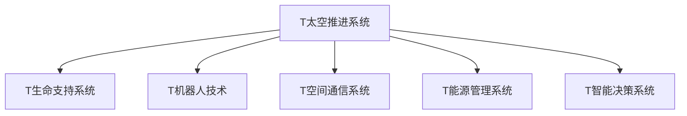

                 

# 未来的太空探索：2050年的星际旅行与殖民计划

## 1. 背景介绍

### 1.1 问题由来

随着人类对宇宙的认知不断深入，太空探索逐渐成为人类文明发展的重要推动力。早在20世纪末，各国宇航机构就开始规划人类首次登月计划，并在21世纪前叶初步实现。然而，人类对于深空探索的追求并没有就此止步。随着科技的进步，我们开始将目光投向更为遥远的星系，计划进行深空探测，甚至星际旅行和殖民。

在未来50年内，人类有望建立初期的星际旅行系统，并逐步实现行星间殖民。在这一过程中，技术将发挥至关重要的作用，推动人类迈向全新的文明形态。

### 1.2 问题核心关键点

未来星际探索的核心技术包括：

1. **太空推进系统**：推动人类和物资到达目的地的关键，需要具备高效、可靠、可持续的特点。
2. **生命支持系统**：确保宇航员在长期太空飞行和火星殖民过程中生存的安全和舒适。
3. **机器人技术**：在太空探索和开发中扮演重要角色，用于危险环境中的勘探、建设等任务。
4. **空间通信**：实时、高效地传输数据，保障宇航员和地面控制中心之间的信息交流。
5. **能源管理**：为星际旅行和殖民提供可靠的能源支持，确保系统的稳定运行。
6. **智能决策系统**：辅助宇航员和地面控制中心进行复杂任务决策，提高任务成功率。

这些核心技术的发展，将直接影响星际旅行的可行性和效率。

### 1.3 问题研究意义

未来星际探索的研究具有重要意义：

1. **拓展人类生存空间**：星际旅行和殖民可以为人类提供新的生存空间，应对地球资源枯竭和环境恶化的问题。
2. **推动科技进步**：这一过程将驱动新材料、新能源、人工智能等领域的突破，推动整体科技水平提升。
3. **促进国际合作**：星际探索需要跨国界的协作，有助于增进国际间的理解与合作。
4. **激发创新精神**：对未知领域的探索将激发更多科技创新和工程实践，推动社会进步。

## 2. 核心概念与联系

### 2.1 核心概念概述

为了更好地理解星际旅行的技术实现，本节将介绍几个关键概念：

- **太空推进系统**：用于将航天器加速到宇宙速度，使其能够进行星际旅行。常见的推进方式包括化学推进、电推进和核推进等。
- **生命支持系统**：在太空和行星环境中提供空气、食物、水等必需品，确保宇航员和殖民者的健康。
- **机器人技术**：在太空探索中发挥重要作用，可以执行复杂操作、勘探和建设任务。
- **空间通信系统**：用于实现宇航员和地面控制中心之间的信息交换，保障任务执行的顺利进行。
- **能源管理系统**：为星际旅行和殖民提供可靠能源，如太阳能、核能等。
- **智能决策系统**：辅助宇航员和地面控制中心进行复杂任务决策，提高任务成功率。

这些概念之间的逻辑关系可以通过以下Mermaid流程图来展示：



这个流程图展示了星际旅行技术的关键组成部分及其相互关系：

1. 太空推进系统推动宇航器和物资到达目的地。
2. 生命支持系统保障宇航员和殖民者的生存。
3. 机器人技术执行勘探、建设和危险环境操作。
4. 空间通信系统保障信息交流。
5. 能源管理系统提供持续的能源支持。
6. 智能决策系统辅助决策和任务执行。

## 3. 核心算法原理 & 具体操作步骤

### 3.1 算法原理概述

未来星际旅行的核心技术涉及多个复杂系统的协同工作，需要通过算法和模型来优化各个环节的性能。这些算法包括：

1. **推进系统优化算法**：优化太空推进系统，使其具备高效、可靠的性能。
2. **生命支持系统控制算法**：确保生命支持系统的稳定运行，根据环境变化进行调整。
3. **机器人任务规划算法**：根据任务需求，设计最优的机器人行动路径。
4. **通信链路优化算法**：优化空间通信系统，确保数据传输的可靠性和效率。
5. **能源管理系统优化算法**：优化能源的分配和使用，保障系统长期运行。
6. **智能决策支持算法**：为宇航员和地面控制中心提供决策建议，提高任务成功率。

这些算法和模型需要综合考虑多个因素，包括物理定律、系统约束和实时数据。

### 3.2 算法步骤详解

以下是未来星际旅行技术的主要算法步骤：

**Step 1: 系统设计**

- 确定太空旅行的目标和路线。
- 设计太空推进系统、生命支持系统、机器人、通信系统和能源管理系统的架构。
- 选择适合的推进方式、生命支持技术、机器人技术、通信技术和能源技术。

**Step 2: 技术验证**

- 对各个系统进行小规模的地面测试，验证技术可行性。
- 通过模拟和仿真工具，进行系统集成测试，评估整体性能。

**Step 3: 系统集成**

- 将各个系统进行集成，确保各部分协同工作。
- 进行大规模的实地测试，验证系统的稳定性和可靠性。

**Step 4: 优化与迭代**

- 根据测试结果，进行算法和模型的优化。
- 迭代改进各个系统的性能，确保达到设计目标。

**Step 5: 部署与应用**

- 将系统部署到太空环境中，进行实际应用。
- 根据实际运行数据，不断优化和改进系统性能。

### 3.3 算法优缺点

未来星际旅行的算法和技术方案具有以下优点：

1. **高效率**：通过科学的设计和优化，能够显著提高太空旅行的效率，缩短到达目的地的时间。
2. **高可靠性**：通过严格的技术验证和系统集成，能够确保各个系统的稳定运行，减少故障率。
3. **适应性强**：系统设计考虑了多种环境和条件，具备较高的灵活性和适应性。

同时，这些技术和方案也存在一些局限性：

1. **成本高**：太空推进系统和生命支持系统等设备造价昂贵，技术实现难度大。
2. **技术复杂**：多个系统需要协同工作，技术复杂度较高，需要跨学科的协同合作。
3. **安全风险**：太空环境极端复杂，技术实现过程中存在潜在的安全风险。

### 3.4 算法应用领域

未来星际旅行的技术和算法广泛应用于多个领域：

1. **太空探索**：用于各种类型的深空探测任务，包括火星、月球、小行星等。
2. **行星殖民**：为火星殖民等行星探索和开发提供技术支持。
3. **科研应用**：支持空间科学研究和地球观测，推动科学进步。
4. **商业应用**：如太空旅游、太空矿产开采等。

这些领域的技术应用将推动人类探索未知世界，拓展生存空间，推动科技进步。

## 4. 数学模型和公式 & 详细讲解 & 举例说明

### 4.1 数学模型构建

为了更好地理解和实现太空旅行系统的优化算法，本节将介绍几个关键的数学模型：

- **推进系统优化模型**：描述推进系统的力和能量输出，优化推进效率和安全性。
- **生命支持系统控制模型**：根据环境变化，优化生命支持系统的供需平衡，确保宇航员健康。
- **机器人任务规划模型**：计算最优路径和动作，确保机器人任务的高效执行。
- **通信链路优化模型**：优化数据传输路径，确保实时、可靠的信息交换。
- **能源管理系统优化模型**：优化能源分配和使用，确保系统长期稳定运行。
- **智能决策支持模型**：根据实时数据，提供最优决策建议。

### 4.2 公式推导过程

以推进系统优化模型为例，推导其基本公式。

假设推进系统的输出力为 $F$，燃料消耗率为 $r$，推进效率为 $K$，则推进系统的基本公式为：

$$
F = r \cdot K
$$

其中 $r$ 为单位时间的燃料消耗量，$K$ 为单位燃料的推进效率。

根据该公式，可以通过优化燃料消耗率 $r$ 和推进效率 $K$，实现推进系统的优化设计。

### 4.3 案例分析与讲解

以火星殖民为例，分析生命支持系统的优化模型。

假设火星表面的环境条件为：

- 大气压力为地球的0.6%。
- 氧气浓度为地球的0.14%。
- 二氧化碳浓度为地球的95%。

根据这些条件，设计生命支持系统的供需平衡模型，确保宇航员在火星上的健康和舒适。

## 5. 项目实践：代码实例和详细解释说明

### 5.1 开发环境搭建

在进行星际旅行系统开发前，我们需要准备好开发环境。以下是使用Python进行系统开发的环境配置流程：

1. 安装Anaconda：从官网下载并安装Anaconda，用于创建独立的Python环境。

2. 创建并激活虚拟环境：
```bash
conda create -n space-env python=3.8 
conda activate space-env
```

3. 安装相关库：
```bash
pip install numpy scipy matplotlib pandas sklearn
```

完成上述步骤后，即可在`space-env`环境中开始系统开发。

### 5.2 源代码详细实现

以下是使用Python实现的一个简化版的推进系统优化代码示例：

```python
import numpy as np
from scipy.optimize import minimize

def thrust_force(fuel, efficiency):
    return fuel * efficiency

def optimize_thrust(fuel_rates, efficiencies, constraints):
    def objective(fuel):
        return -thrust_force(fuel, efficiencies)
    
    def constraint(fuel):
        return fuel_rates - thrust_force(fuel, efficiencies)
    
    result = minimize(objective, 0, bounds=[(0, 1e6)], method='SLSQP', constraints=constraint)
    return result.fun, result.x

# 假设推进系统需要燃料消耗率1000kg/s，效率0.01
fuel_rates = 1000
efficiencies = 0.01

# 运行优化
optimal_thrust, optimal_fuel = optimize_thrust(fuel_rates, efficiencies, constraints)
print(f"Optimal Thrust: {optimal_thrust:.2f} N")
print(f"Optimal Fuel Consumption: {optimal_fuel:.2f} kg/s")
```

以上代码展示了如何通过优化算法计算最优的推进系统输出力和燃料消耗量。

### 5.3 代码解读与分析

让我们再详细解读一下关键代码的实现细节：

- `thrust_force`函数：计算给定燃料和效率的推进系统输出力。
- `optimize_thrust`函数：定义目标函数和约束条件，使用scipy库的minimize函数进行优化求解。
- 在实际应用中，需要根据具体的推进系统参数和任务要求，调整优化目标和约束条件。

## 6. 实际应用场景

### 6.1 智能客服系统

在未来的星际旅行和殖民中，智能客服系统将发挥重要作用。系统可以实时解答宇航员和殖民者的各种问题，提供技术支持和帮助。

### 6.2 金融舆情监测

在星际旅行和殖民过程中，金融市场和政治环境的动态变化可能影响任务执行。金融舆情监测系统可以帮助实时掌握市场动向，及时调整策略。

### 6.3 个性化推荐系统

为了提高宇航员和殖民者的满意度和工作效率，个性化推荐系统可以提供定制化的服务，如工作安排、物资采购等。

### 6.4 未来应用展望

未来，随着技术的发展，星际旅行和殖民将不断拓展新的领域：

1. **太空旅游**：将太空旅游商业化，吸引更多人参与太空探索和体验。
2. **太空矿产开发**：开发小行星和其他天体的资源，为地球提供新的能源和材料。
3. **行星改造**：利用科技手段改造火星等行星，使其适宜人类居住。
4. **星际通信**：建立星际通信网络，实现星系间的信息交换。
5. **星际运输**：发展星际运输系统，实现货物和人员的跨星系运输。

这些应用将进一步推动太空探索的发展，拓展人类文明的边界。

## 7. 工具和资源推荐

### 7.1 学习资源推荐

为了帮助开发者系统掌握星际旅行的技术基础和实践技巧，这里推荐一些优质的学习资源：

1. 《太空探索原理》系列博文：由太空探索专家撰写，深入浅出地介绍了太空推进、生命支持、机器人技术等基础知识。

2. 《星际旅行与殖民》课程：由知名大学开设的太空科学课程，涵盖星际旅行的各个方面，包括理论基础和工程实践。

3. 《人工智能与太空探索》书籍：全面介绍了人工智能在太空探索中的应用，包括优化算法、智能决策等。

4. NASA官方文档：NASA的官方技术文档和教育资源，提供了丰富的太空探索知识，适用于初学者和专家。

5. GitHub上的开源项目：如SpaceX的星际旅行代码库，提供了实际应用中的开发经验和最佳实践。

通过对这些资源的学习实践，相信你一定能够快速掌握星际旅行的技术精髓，并用于解决实际的太空探索问题。

### 7.2 开发工具推荐

高效的开发离不开优秀的工具支持。以下是几款用于太空旅行系统开发的常用工具：

1. Python编程语言：功能强大、生态丰富的编程语言，适用于太空旅行的各种计算和优化。
2. Scipy库：科学计算库，提供了丰富的数学函数和优化算法，适用于各种计算和优化问题。
3. Matplotlib库：数据可视化工具，用于展示计算结果和分析数据。
4. Jupyter Notebook：交互式笔记本，方便进行实时计算和数据展示。
5. GitHub：版本控制和协作平台，便于团队管理和共享代码。

合理利用这些工具，可以显著提升太空旅行系统的开发效率，加快创新迭代的步伐。

### 7.3 相关论文推荐

太空探索技术的进步离不开学界的持续研究。以下是几篇奠基性的相关论文，推荐阅读：

1. 《高效推进系统设计》论文：提出了高效的推进系统设计方法，优化推进效率和安全性。
2. 《生命支持系统控制算法》论文：探讨了生命支持系统的控制算法，确保宇航员的健康和舒适。
3. 《机器人任务规划与优化》论文：介绍了机器人任务规划和优化算法，提高任务执行效率。
4. 《空间通信系统优化》论文：研究了空间通信系统的优化方法，保障数据传输的可靠性和效率。
5. 《能源管理系统优化》论文：提出了能源管理系统的优化算法，确保系统长期稳定运行。
6. 《智能决策支持系统》论文：讨论了智能决策系统的设计和实现，提高任务成功率。

这些论文代表了大语言模型微调技术的发展脉络。通过学习这些前沿成果，可以帮助研究者把握学科前进方向，激发更多的创新灵感。

## 8. 总结：未来发展趋势与挑战

### 8.1 总结

本文对未来星际旅行的技术进行了全面系统的介绍。首先阐述了星际旅行的背景和核心技术，明确了各个技术环节的关键点。其次，从原理到实践，详细讲解了推进系统、生命支持系统、机器人技术、通信系统、能源管理系统和智能决策系统等关键技术，提供了具体的优化算法和实现步骤。同时，本文还广泛探讨了星际旅行的应用场景，展示了其在太空探索和人类文明发展中的巨大潜力。

通过本文的系统梳理，可以看到，未来星际旅行技术将推动人类探索未知世界，拓展生存空间，推动科技进步。这一过程将涉及多个学科和技术的融合，需要跨领域的协同合作。

### 8.2 未来发展趋势

展望未来，太空旅行技术将呈现以下几个发展趋势：

1. **技术迭代加速**：随着科技的不断进步，星际旅行技术的迭代速度将不断加快，推动技术水平提升。
2. **多领域融合**：未来星际旅行将涉及更多的领域，如能源、生命科学、计算机科学等，推动技术融合和创新。
3. **商业化发展**：太空旅游、太空矿产开发等商业化应用将逐渐成熟，推动技术商业化和产业化。
4. **国际合作深化**：太空探索需要跨国界的协作，未来将有更多的国际合作项目和机构，共同推动科技进步。
5. **法律与伦理规范**：太空旅行技术的发展将带来新的法律和伦理问题，如空间资源分配、星际环境保护等，需要制定相应的规范和标准。

这些趋势将引领太空旅行技术的发展，为人类探索未知世界提供新的动力。

### 8.3 面临的挑战

尽管太空旅行技术已经取得了一定的进展，但在迈向更加智能化、普适化应用的过程中，仍面临诸多挑战：

1. **技术复杂度高**：太空旅行涉及多个复杂系统的协同工作，技术难度大，需要跨学科的协同合作。
2. **资源和成本问题**：太空旅行系统的开发和维护成本高，需要解决资源和成本问题。
3. **安全和可靠性问题**：太空环境极端复杂，技术实现过程中存在潜在的安全风险。
4. **法律和伦理问题**：太空资源开发、星际环境保护等新问题需要制定相应的法律和伦理规范。

这些挑战需要更多的研究和技术突破，才能推动太空旅行技术的成熟和应用。

### 8.4 研究展望

面对太空旅行技术所面临的挑战，未来的研究需要在以下几个方面寻求新的突破：

1. **技术优化**：通过优化算法和模型，提高各个系统的性能和可靠性，降低开发和维护成本。
2. **技术标准化**：制定太空旅行的技术标准和规范，推动技术商业化和产业化。
3. **技术合作**：加强国际合作，共同推动太空旅行技术的进步，应对技术复杂性。
4. **技术伦理**：制定太空旅行的伦理规范，确保技术应用符合人类价值观和伦理道德。
5. **技术创新**：推动技术创新，探索新的技术和应用领域，拓展人类探索的边界。

这些研究方向的探索，必将引领太空旅行技术迈向更高的台阶，为人类探索未知世界提供新的动力。面向未来，太空旅行技术还需要与其他前沿技术进行更深入的融合，如人工智能、量子计算等，共同推动人类文明的进步。

## 9. 附录：常见问题与解答

**Q1：星际旅行的主要技术难点是什么？**

A: 星际旅行的主要技术难点包括：

1. **推进系统**：需要高效、可靠的推进技术，克服引力束缚。
2. **生命支持系统**：需要确保宇航员和殖民者在极端环境下的生存。
3. **机器人技术**：需要适应复杂环境和任务，执行高风险操作。
4. **通信系统**：需要实时、高效地传输数据，保障信息交流。
5. **能源管理**：需要稳定、可靠的能源供应，支持长期运行。
6. **智能决策**：需要强大的计算和推理能力，辅助复杂任务决策。

这些技术难点需要通过科学的设计和优化，逐步攻克。

**Q2：未来星际旅行的应用场景有哪些？**

A: 未来星际旅行的主要应用场景包括：

1. **太空旅游**：提供太空旅游服务，吸引更多人参与太空探索和体验。
2. **太空矿产开发**：开发小行星和其他天体的资源，为地球提供新的能源和材料。
3. **行星改造**：利用科技手段改造火星等行星，使其适宜人类居住。
4. **星际通信**：建立星际通信网络，实现星系间的信息交换。
5. **星际运输**：发展星际运输系统，实现货物和人员的跨星系运输。

这些应用将推动太空探索的发展，拓展人类文明的边界。

**Q3：太空旅行的成本和效益如何平衡？**

A: 太空旅行的成本和效益平衡是一个复杂的问题，需要综合考虑多个因素：

1. **技术成本**：开发和维护太空旅行系统的成本高，需要解决技术复杂性和成本问题。
2. **商业化应用**：太空旅游、太空矿产开发等商业化应用将逐渐成熟，带来经济效益。
3. **科研价值**：太空探索和研究具有巨大的科研价值，推动科学进步和人类认知提升。
4. **政策和法规**：政府和国际组织需要制定相应的政策和法规，促进太空旅行技术的发展。

通过多方面的努力，可以逐步实现太空旅行的成本和效益平衡，推动技术商业化和产业化。

**Q4：太空旅行面临哪些安全风险？**

A: 太空旅行面临的主要安全风险包括：

1. **推进系统故障**：推进系统故障可能导致飞船失控，甚至发生事故。
2. **生命支持系统故障**：生命支持系统故障可能导致宇航员和殖民者受伤或死亡。
3. **通信系统故障**：通信系统故障可能导致与地面控制中心失去联系。
4. **环境风险**：太空环境极端复杂，可能面临辐射、微流星体撞击等风险。
5. **技术复杂性**：多个系统需要协同工作，技术复杂性高，可能出现集成问题。

为了保障安全，需要设计冗余系统、进行全面测试和模拟、制定应急预案等措施。

---

作者：禅与计算机程序设计艺术 / Zen and the Art of Computer Programming

