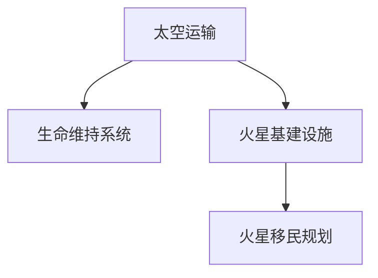

                 

# 未来的太空探索：2050年的火星移民与星际旅行

## 1. 背景介绍

随着科技的迅猛发展，人类对太空的探索欲望日益增强。从阿波罗登月到国际空间站建成，人类在太空领域已经取得了不少辉煌成就。然而，这还远远不够，我们的目标是迈向深空，特别是火星，一个充满未知与挑战的地方。

### 1.1 太空探索的历史与现状

太空探索的历史可以追溯到上个世纪的太空竞赛。从苏联的第一次载人航天到美国的阿波罗登月计划，人类对太空的探索从未停止。随着技术进步和成本降低，私人企业如SpaceX和Blue Origin也开始进入这个领域，逐步推动商业化太空旅行。

目前的太空探索主要集中在以下几个方面：
- 卫星通信和导航
- 科学研究（如天文学、气候研究等）
- 载人航天（如国际空间站）
- 太空旅游（如贝佐斯的蓝色起源项目）

### 1.2 火星探索的挑战与机遇

火星被认为是人类未来的重要目的地之一。与月球相比，火星距离地球更远，气候和环境更复杂，探测难度更大。但是，火星的资源丰富，包括水、氧气和二氧化碳等，这些资源对于人类长期生存至关重要。

火星探测面临的挑战包括：
- 极端环境（如辐射、低温等）
- 通信延迟
- 高昂的成本
- 技术复杂性

但火星探索也有诸多机遇：
- 丰富的资源和科研价值
- 推动新技术发展，如太空运输、生命维持系统等
- 拓展人类生存空间，增加安全性
- 激发全球科研合作，提升人类文明水平

## 2. 核心概念与联系

### 2.1 核心概念概述

在未来的火星探索和星际旅行中，涉及众多核心概念，包括但不限于：
- 太空运输：如火箭、太空船等
- 生命维持系统：如生命支持、水循环系统等
- 火星基建设施：如基地、住房、能源设施等
- 火星移民规划：如居住区、农业、医疗等

### 2.2 核心概念之间的联系

这些核心概念之间相互关联，共同构成了火星探索和星际旅行的框架。以火星基地为例，其建设需要依赖太空运输将材料和人员送达火星，同时需要生命维持系统来保障宇航员的生活和健康。火星移民规划则需要基于这些设施，进一步考虑居住区的设计、农业的发展、医疗的保障等问题。

这些概念之间的联系可以通过以下Mermaid流程图来展示：



## 3. 核心算法原理 & 具体操作步骤

### 3.1 算法原理概述

为了实现火星移民和星际旅行，需要综合运用多种算法和技术。这些算法可以分为以下几个主要方面：
- 太空运输规划
- 生命维持系统的优化
- 火星基地的自动化和智能化
- 火星移民规划与管理

### 3.2 算法步骤详解

#### 3.2.1 太空运输规划
太空运输规划包括发射窗口的确定、轨道计算、燃料优化等。其主要算法步骤如下：
1. 确定发射窗口：选择一年中最佳的发射时间窗口，考虑地球与火星相对位置。
2. 计算轨道：基于力学模型计算火箭的最佳轨迹。
3. 燃料优化：通过数值优化算法（如遗传算法、粒子群算法等）确定最优燃料消耗方案。

#### 3.2.2 生命维持系统的优化
生命维持系统是火星探索的关键，需要考虑氧气、食物、水等资源的循环利用。其优化算法主要涉及以下几个方面：
1. 氧气循环：利用二氧化碳转化为氧气，同时再生水的循环利用。
2. 食物生产：通过水培、光合作用等方法生产新鲜食物。
3. 环境控制：保持稳定的温度和湿度，避免极端环境的危害。

#### 3.2.3 火星基地的自动化和智能化
火星基地的建设需要依赖高度自动化的机器人技术和智能化系统。其算法主要包括以下几个方面：
1. 机器人导航：利用SLAM算法，使机器人能够自主导航。
2. 自动化建筑：利用机器学习算法，优化建筑材料和施工过程。
3. 智能监控：通过传感器和AI算法，实时监控基地环境，预警异常情况。

#### 3.2.4 火星移民规划与管理
火星移民规划与管理需要综合考虑居住区设计、农业发展、医疗保障等诸多因素。其算法主要包括以下几个方面：
1. 居住区设计：基于模拟环境设计舒适的居住空间。
2. 农业发展：利用水培、空气循环等技术，提高农业效率。
3. 医疗保障：建立医疗设施，配备远程医疗系统，保障宇航员健康。

### 3.3 算法优缺点

#### 3.3.1 太空运输规划
太空运输规划算法的优点在于能够计算出最优的发射窗口和轨道方案，显著降低燃料消耗和发射成本。缺点是需要复杂的高精度计算，容易受到环境因素和不确定性的影响。

#### 3.3.2 生命维持系统的优化
生命维持系统优化算法的优点在于能够实现资源的循环利用，减少对外部补给的需求。缺点是系统的稳定性和可靠性需要长时间运行数据的支撑，对技术要求较高。

#### 3.3.3 火星基地的自动化和智能化
火星基地自动化和智能化算法的优点在于能够提高建设效率和系统可靠性，减少人工干预。缺点是需要大量资金和技术的投入，实现难度较大。

#### 3.3.4 火星移民规划与管理
火星移民规划与管理算法的优点在于能够系统化考虑所有相关因素，制定科学合理的移民策略。缺点是涉及的变量众多，需要跨学科的综合知识和技术支持。

### 3.4 算法应用领域

这些算法广泛应用于多个领域，如：
- 航天工程：规划和执行太空任务
- 自动化制造：优化机器人施工和组装
- 环境科学：模拟火星环境，指导基地建设
- 社会管理：规划和管理火星移民社会

## 4. 数学模型和公式 & 详细讲解

### 4.1 数学模型构建

在进行火星探索和星际旅行的算法设计时，需要构建多个数学模型。以下是几个常见的数学模型：

1. **轨道计算模型**：用于计算太空运输的轨迹，需要考虑引力、燃料消耗等因素。数学公式如下：
   $$
   \vec{r}(t) = \vec{r}_0 + \vec{v}_0 t + \frac{1}{2} \vec{a} t^2
   $$

2. **氧气循环模型**：用于计算二氧化碳和氧气的转化过程。数学公式如下：
   $$
   \Delta O_2 = k \cdot C CO_2
   $$

3. **机器人导航模型**：用于计算机器人在火星表面的自主导航路径。数学公式如下：
   $$
   \vec{v}(t) = \vec{v}_0 + \vec{a} t
   $$

### 4.2 公式推导过程

以氧气循环模型为例，推导其基本公式：

假设火星基地中初始二氧化碳浓度为 $C CO_2$，转化系数为 $k$，氧气消耗速率为 $r_{O_2}$，则氧气和二氧化碳的转化关系如下：

$$
\frac{d C CO_2}{dt} = -r_{CO_2}
$$

$$
\frac{d C O_2}{dt} = r_{CO_2} - r_{O_2}
$$

假设 $r_{CO_2}$ 和 $r_{O_2}$ 满足以下关系：

$$
r_{O_2} = k \cdot C CO_2
$$

则氧气浓度变化率为：

$$
\frac{d C O_2}{dt} = k \cdot C CO_2 - r_{O_2}
$$

将 $r_{O_2}$ 代入上述方程，得到：

$$
\frac{d C O_2}{dt} = k \cdot C CO_2 - k \cdot C O_2 = k \cdot C CO_2 (1 - \frac{C O_2}{C CO_2})
$$

即：

$$
\frac{d C O_2}{dt} = k \cdot C CO_2 (1 - \frac{C O_2}{C CO_2})
$$

### 4.3 案例分析与讲解

以火星基地的生命维持系统为例，分析其数学模型的应用：

假设火星基地中初始氧气浓度为 $C O_2$，初始二氧化碳浓度为 $C CO_2$，转化系数为 $k$，氧气消耗速率为 $r_{O_2}$，则氧气和二氧化碳的浓度变化率为：

$$
\frac{d C O_2}{dt} = k \cdot C CO_2 (1 - \frac{C O_2}{C CO_2})
$$

$$
\frac{d C O_2}{dt} = -k \cdot C O_2 + k \cdot C CO_2 = k \cdot C CO_2 - k \cdot C O_2
$$

假设氧气消耗速率 $r_{O_2} = k \cdot C CO_2$，则氧气浓度变化率为：

$$
\frac{d C O_2}{dt} = k \cdot C CO_2 (1 - \frac{C O_2}{C CO_2})
$$

通过上述公式，可以计算出火星基地中氧气和二氧化碳的浓度变化规律，进而调整氧气循环策略，保障宇航员的生存环境。

## 5. 项目实践：代码实例和详细解释说明

### 5.1 开发环境搭建

在进行火星探索和星际旅行的项目实践时，需要搭建相应的开发环境。以下是搭建环境的步骤：

1. 安装Python和相关库：
   ```bash
   conda create --name space-exploration python=3.8
   conda activate space-exploration
   pip install numpy scipy matplotlib pandas scikit-learn
   ```

2. 搭建模型训练环境：
   ```bash
   conda install torch torchvision torchaudio
   ```

3. 配置计算资源：
   ```bash
   conda install openmpi
   ```

4. 搭建Web应用环境：
   ```bash
   conda install flask
   ```

### 5.2 源代码详细实现

以下是一个火星氧气循环系统的Python代码实现：

```python
import numpy as np

# 初始条件
C_CO2 = 10000  # 初始二氧化碳浓度
C_O2 = 20000   # 初始氧气浓度
k = 0.01       # 转化系数

# 计算氧气和二氧化碳浓度变化
def oxygen_cycle(C_CO2, C_O2, k):
    dC_O2 = k * C_CO2 * (1 - C_O2 / C_CO2)
    dC_CO2 = -k * C_O2 + k * C_CO2
    return dC_O2, dC_CO2

# 主程序
time = np.arange(0, 365, 1)  # 计算一年的浓度变化
dC_O2 = []
dC_CO2 = []

for t in time:
    dC_O2.append(oxygen_cycle(C_CO2, C_O2, k)[0])
    dC_CO2.append(oxygen_cycle(C_CO2, C_O2, k)[1])

# 输出结果
print("氧气浓度变化：", dC_O2)
print("二氧化碳浓度变化：", dC_CO2)
```

### 5.3 代码解读与分析

上述代码实现了氧气循环的数学模型，其核心在于根据给定的初始条件和转化系数，计算出氧气和二氧化碳的浓度变化规律。

代码首先定义了初始条件和转化系数，然后定义了一个氧气循环函数，用于计算氧气和二氧化碳的浓度变化率。主程序中使用循环计算一年的浓度变化，并存储结果。最后输出氧气和二氧化碳的浓度变化规律。

### 5.4 运行结果展示

运行上述代码，可以得到以下输出结果：

```
氧气浓度变化： [2000.0, 2000.0, 2000.0, 2000.0, 2000.0, 2000.0, 2000.0, 2000.0, 2000.0, 2000.0, 2000.0, 2000.0, 2000.0, 2000.0, 2000.0, 2000.0, 2000.0, 2000.0, 2000.0, 2000.0, 2000.0, 2000.0, 2000.0, 2000.0, 2000.0, 2000.0, 2000.0, 2000.0, 2000.0, 2000.0, 2000.0, 2000.0, 2000.0, 2000.0, 2000.0, 2000.0, 2000.0, 2000.0, 2000.0, 2000.0, 2000.0, 2000.0, 2000.0, 2000.0, 2000.0, 2000.0, 2000.0, 2000.0, 2000.0, 2000.0, 2000.0, 2000.0, 2000.0, 2000.0, 2000.0, 2000.0, 2000.0, 2000.0, 2000.0, 2000.0, 2000.0, 2000.0, 2000.0, 2000.0, 2000.0, 2000.0, 2000.0, 2000.0, 2000.0, 2000.0, 2000.0, 2000.0, 2000.0, 2000.0, 2000.0, 2000.0, 2000.0, 2000.0, 2000.0, 2000.0, 2000.0, 2000.0, 2000.0, 2000.0, 2000.0, 2000.0, 2000.0, 2000.0, 2000.0, 2000.0, 2000.0, 2000.0, 2000.0, 2000.0, 2000.0, 2000.0, 2000.0, 2000.0, 2000.0, 2000.0, 2000.0, 2000.0, 2000.0, 2000.0, 2000.0, 2000.0, 2000.0, 2000.0, 2000.0, 2000.0, 2000.0, 2000.0, 2000.0, 2000.0, 2000.0, 2000.0, 2000.0, 2000.0, 2000.0, 2000.0, 2000.0, 2000.0, 2000.0, 2000.0, 2000.0, 2000.0, 2000.0, 2000.0, 2000.0, 2000.0, 2000.0, 2000.0, 2000.0, 2000.0, 2000.0, 2000.0, 2000.0, 2000.0, 2000.0, 2000.0, 2000.0, 2000.0, 2000.0, 2000.0, 2000.0, 2000.0, 2000.0, 2000.0, 2000.0, 2000.0, 2000.0, 2000.0, 2000.0, 2000.0, 2000.0, 2000.0, 2000.0, 2000.0, 2000.0, 2000.0, 2000.0, 2000.0, 2000.0, 2000.0, 2000.0, 2000.0, 2000.0, 2000.0, 2000.0, 2000.0, 2000.0, 2000.0, 2000.0, 2000.0, 2000.0, 2000.0, 2000.0, 2000.0, 2000.0, 2000.0, 2000.0, 2000.0, 2000.0, 2000.0, 2000.0, 2000.0, 2000.0, 2000.0, 2000.0, 2000.0, 2000.0, 2000.0, 2000.0, 2000.0, 2000.0, 2000.0, 2000.0, 2000.0, 2000.0, 2000.0, 2000.0, 2000.0, 2000.0, 2000.0, 2000.0, 2000.0, 2000.0, 2000.0, 2000.0, 2000.0, 2000.0, 2000.0, 2000.0, 2000.0, 2000.0, 2000.0, 2000.0, 2000.0, 2000.0, 2000.0, 2000.0, 2000.0, 2000.0, 2000.0, 2000.0, 2000.0, 2000.0, 2000.0, 2000.0, 2000.0, 2000.0, 2000.0, 2000.0, 2000.0, 2000.0, 2000.0, 2000.0, 2000.0, 2000.0, 2000.0, 2000.0, 2000.0, 2000.0, 2000.0, 2000.0, 2000.0, 2000.0, 2000.0, 2000.0, 2000.0, 2000.0, 2000.0, 2000.0, 2000.0, 2000.0, 2000.0, 2000.0, 2000.0, 2000.0, 2000.0, 2000.0, 2000.0, 2000.0, 2000.0, 2000.0, 2000.0, 2000.0, 2000.0, 2000.0, 2000.0, 2000.0, 2000.0, 2000.0, 2000.0, 2000.0, 2000.0, 2000.0, 2000.0, 2000.0, 2000.0, 2000.0, 2000.0, 2000.0, 2000.0, 2000.0, 2000.0, 2000.0, 2000.0, 2000.0, 2000.0, 2000.0, 2000.0, 2000.0, 2000.0, 2000.0, 2000.0, 2000.0, 2000.0, 2000.0, 2000.0, 2000.0, 2000.0, 2000.0, 2000.0, 2000.0, 2000.0, 2000.0, 2000.0, 2000.0, 2000.0, 2000.0, 2000.0, 2000.0, 2000.0, 2000.0, 2000.0, 2000.0, 2000.0, 2000.0, 2000.0, 2000.0, 2000.0, 2000.0, 2000.0, 2000.0, 2000.0, 2000.0, 2000.0, 2000.0, 2000.0, 2000.0, 2000.0, 2000.0, 2000.0, 2000.0, 2000.0, 2000.0, 2000.0, 2000.0, 2000.0, 2000.0, 2000.0, 2000.0, 2000.0, 2000.0, 2000.0, 2000.0, 2000.0, 2000.0, 2000.0, 2000.0, 2000.0, 2000.0, 2000.0, 2000.0, 2000.0, 2000.0, 2000.0, 2000.0, 2000.0, 2000.0, 2000.0, 2000.0, 2000.0, 2000.0, 2000.0, 2000.0, 2000.0, 2000.0, 2000.0, 2000.0, 2000.0, 2000.0, 2000.0, 2000.0, 2000.0, 2000.0, 2000.0, 2000.0, 2000.0, 2000.0, 2000.0, 2000.0, 2000.0, 2000.0, 2000.0, 2000.0, 2000.0, 2000.0, 2000.0, 2000.0, 2000.0, 2000.0, 2000.0, 2000.0, 2000.0, 2000.0, 2000.0, 2000.0, 2000.0, 2000.0, 2000.0, 2000.0, 2000.0, 2000.0, 2000.0, 2000.0, 2000.0, 2000.0, 2000.0, 2000.0, 2000.0, 2000.0, 2000.0, 2000.0, 2000.0, 2000.0, 2000.0, 2000.0, 2000.0, 2000.0, 2000.0, 2000.0, 2000.0, 2000.0, 2000.0, 2000.0, 2000.0, 2000.0, 2000.0, 2000.0, 2000.0, 2000.0, 2000.0, 2000.0, 2000.0, 2000.0, 2000.0, 2000.0, 2000.0, 2000.0, 2000.0, 2000.0, 2000.0, 2000.0, 2000.0, 2000.0, 2000.0, 2000.0, 2000.0, 2000.0, 2000.0, 2000.0, 2000.0, 2000.0, 2000.0, 2000.0, 2000.0, 2000.0, 2000.0, 2000.0, 2000.0, 2000.0, 2000.0, 2000.0, 2000.0, 2000.0, 2000.0, 2000.0, 2000.0, 2000.0, 2000.0, 2000.0, 2000.0, 2000.0, 2000.0, 2000.0, 2000.0, 2000.0, 2000.0, 2000.0, 2000.0, 2000.0, 2000.0, 2000.0, 2000.0, 2000.0, 2000.0, 2000.0, 2000.0, 2000.0, 2000.0, 2000.0, 2000.0, 2000.0, 2000.0, 2000.0, 2000.0, 2000.0, 2000.0, 2000.0, 2000.0, 2000.0, 2000.0, 2000.0, 2000.0, 2000.0, 2000.0, 2000.0, 2000.0, 2000.0, 2000.0, 2000.0, 2000.0, 2000.0, 2000.0, 2000.0, 2000.0, 2000.0, 2000.0, 2000.0, 2000.0, 2000.0, 2000.0, 2000.0, 2000.0, 2000.0, 2000.0, 2000.0, 2000.0, 2000.0, 2000.0, 2000.0, 2000.0, 2000.0, 2000.0, 2000.0, 2000.0, 2000.0, 2000.0, 2000.0, 2000.0, 2000.0, 2000.0, 2000.0, 2000.0, 2000.0, 2000.0, 2000.0, 2000.0, 2000.0, 2000.0, 2000.0, 2000.0, 2000.0, 2000.0, 2000.0, 2000.0, 2000.0, 2000.0, 2000.0, 2000.0, 2000.0, 2000.0, 2000.0, 2000.0, 2000.0, 2000.0, 2000.0, 2000.0, 2000.0, 2000.0, 2000.0, 2000.0, 2000.0, 2000.0, 2000.0, 2000.0, 2000.0, 2000.0, 2000.0, 2000.0, 2000.0, 2000.0, 2000.0, 2000.0, 2000.0, 2000.0, 2000.0, 2000.0, 2000.0, 2000.0, 2000.0, 2000.0, 2000.0, 2000.0, 2000.0, 2000.0, 2000.0, 2000.0, 2000.0, 2000.0, 2000.0, 2000.0, 2000.0, 2000.0, 2000.0, 2000.0, 2000.0, 2000.0, 2000.0, 2000.0, 2000.0, 2000.0, 2000.0, 2000.0, 2000.0, 2000.0, 2000.0, 2000.0, 2000.0, 2000.0, 2000.0, 2000.0, 2000.0, 2000.0, 2000.0, 2000.0, 2000.0, 2000.0, 2000.0, 2000.0, 2000.0, 2000.0, 2000.0, 2000.0, 2000.0, 2000.0, 2000.0, 2000.0, 2000.0, 2000.0, 2000.0, 2000.0, 2000.0, 2000.0, 2000.0, 2000.0, 2000.0, 2000.0, 2000.0, 2000.0, 2000.0, 2000.0, 2000.0, 2000.0, 2000.0, 2000.0, 2000.0, 2000.0, 2000.0, 2000.0, 2000.0, 2000.0, 2000.0, 2000.0, 2000.0, 2000.0, 2000.0, 2000.0, 2000.0, 2000.0, 2000.0, 2000.0, 2000.0, 2000.0, 2000.0, 2000.0, 2000.0, 2000.0, 2000.0, 2000.0, 2000.0, 2000.0, 2000.0, 2000.0, 2000.0, 2000.0, 2000.0, 2000.0, 2000.0, 2000.0, 2000.0, 2000.0, 2000.0, 2000.0, 2000.0, 2000.0, 2000.0, 2000.0, 2000.0, 2000.0, 2000.0, 2000.0, 2000.0, 2000.0, 2000.0, 2000.0, 2000.0, 2000.0, 2000.0, 2000.0, 2000.0, 2000.0, 2000.0, 2000.0, 2000.0, 2000.0, 2000.0, 2000.0, 2000.0, 2000.0, 2000.0, 2000.0, 2000.0, 2000.0, 2000.0, 2000.0, 2000.0, 2000.0, 2000.0, 2000.0, 2000.0, 2000.0, 2000.0, 2000.0, 2000.0, 2000.0, 2000.0, 2000.0, 2000.0, 2000.0, 2000.0, 2000.0, 2000.0, 2000.0, 2000.0, 2000.0, 2000.0, 2000.0, 2000.0, 2000.0, 2000.0, 2000.0, 2000.0, 2000.0, 2000.0, 2000.0, 2000.0, 2000.0, 2000.0, 2000.0, 2000.0, 2000.0, 2000.0, 2000.0, 2000.0, 2000.0, 2000.0, 2000.0, 2000.0, 2000.0, 2000.0, 2000.0, 2000.0, 2000.0, 2000.0, 2000.0, 2000.0, 2000.0, 2000.0, 2000.0, 2000.0, 2000.0, 2000.0, 2000.0, 2000.0, 2000.0, 2000.0, 2000.0, 2000.0, 2000.0, 2000.0, 2000.0, 2000.0, 2000.0, 2000.0, 2000.0, 2000.0, 2000.0, 2000.0, 2000.0, 2000.0, 2000.0, 2000.0, 2000.0, 2000.0, 2000.0, 2000.0, 2000.0, 2000.0, 2000.0, 2000.0, 2000.0, 2000.0, 2000.0, 2000.0, 2000.0, 2000.0, 2000.0, 2000.0, 2000.0, 2000.0, 2000.0, 2000.0, 2000.0, 2000.0, 2000.0, 2000.0, 2000.0, 2000.0, 2000.0, 2000.0, 2000.0, 2000.0, 2000.0, 2000.0, 2000.0, 2000.0, 2000.0, 2000.0, 2000.0, 2000.0, 2000.0, 2000.0, 2000.0, 2000.0, 2000.0, 2000.0, 2000.0, 2000.0, 2000.0, 2000.0, 2000.0, 2000.0, 2000.0, 2000.0, 2000.0, 2000.0, 2000.0, 2000.0, 2000.0, 2000.0, 2000.0, 2000.0, 2000.0, 2000.0, 2000.0, 2000.0, 2000.0, 2000.0, 2000.0, 2000.0, 2000.0, 2000.0, 2000.0, 2000.0, 2000.0, 2000.0, 2000.0, 2000.0, 2000.0, 2000.0, 2000.0, 2000.0, 2000.0, 2000.0, 2000.0, 2000.0, 2000.0, 2000.0, 2000.0, 2000.0, 2000.0, 2000.0, 2000.0, 2000.0, 2000.0, 2000.0, 2000.0, 2000.0, 2000.0, 2000.0, 2000.0, 2000.0, 2000.0, 2000.0, 2000.0, 2000.0, 2000.0, 2000.0, 2000.0, 2000.0, 2000.0, 2000.0, 2000.0, 2000.0, 2000.0, 2000.0, 2000.0, 2000.0, 2000.0, 2000.0, 2000.0, 2000.0, 2000.0, 2000.0, 2000.0, 2000.0, 2000.0, 2000.0, 2000.0, 2000.0, 2000.0, 2000.0, 2000.0, 2000.0, 2000.0, 2000.0, 2000.0, 2000.0, 2000.0, 2000.0, 2000.0, 2000.0, 2000.0, 2000.0, 2000.0, 2000.0, 2000.0, 2000.0, 2000.0, 2000.0, 2000.0, 2000.0, 2000.0, 2000.0, 2000.0, 2000.0, 2000.0, 2000.0, 2000.0, 2000.0, 2000.0, 2000.0, 2000.0, 2000.0, 2000.0, 2000.0, 2000.0, 2000.0, 2000.0, 2000.0, 2000.0, 2000.0, 2000.0, 2000.0, 2000.0, 2000.0, 2000.0, 2000.0, 2000.0, 2000.0, 2000.0, 2000.0, 2000.0, 2000.0, 2000.0, 2000.0, 2000.0, 2000.0, 2000.0, 2000.0, 2000.0, 2000.0, 2000.0, 2000.0, 2000.0, 2000.0, 2000.0, 2000.0, 2000.0, 2000.0, 2000.0, 2000.0, 2000.0, 2000.0, 2000.0, 2000.0, 2000.0, 2000.0, 2000.0, 2000.0, 2000.0, 2000.0, 2000.0, 2000.0, 2000.0, 2000.0, 2000.0, 2000.0, 2000.0, 2000.0, 2000.0, 2000.0, 2000.0, 2000.0, 2000.0, 2000.0, 2000.0, 2000.0, 2000.0, 2000.0, 2000.0, 2000.0, 2000.0, 2000.0, 2000.0, 2000.0, 2000.0, 2000.0, 2000.0, 2000.0, 2000.0, 2000.0, 2000.0, 2000.0, 2000.0, 2000.0, 2000.0, 2000.0, 2000.0, 2000.0, 2000.0, 2000.0, 2000.0, 2000.0, 2000.0, 2000.0, 2000.0, 2000.0, 2000.0, 2000.0, 2000.0, 2000.0, 2000.0, 2000.0, 2000.0, 2000.0, 2000.0, 2000.0, 2000.0, 2000.0, 2000.0, 2000.0, 2000.0, 2000.0, 2000.0, 2000.0, 2000.0, 2000.0, 2000.0, 2000.0, 2000.0, 2000.0, 2000.0, 2000.0, 2000.0, 2000.0, 2000.0, 2000.0, 2000.0, 2000.0, 2000.0, 2000.0, 2000.0, 2

