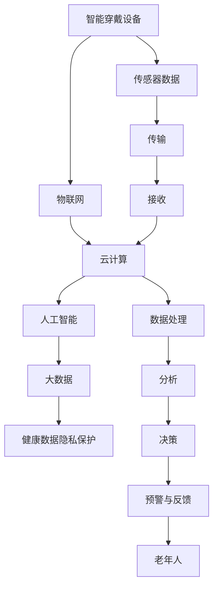

                 

# 未来的智慧养老：2050年的智能穿戴与远程健康监测

> 关键词：智慧养老,智能穿戴,远程健康监测,物联网,人工智能,传感器,大数据,健康数据

## 1. 背景介绍

### 1.1 问题由来

随着社会老龄化日益严重，各国政府、医疗机构和科技企业都在积极探索智慧养老的新模式。智慧养老旨在利用现代信息技术，为老年人提供全方位、个性化、智能化的生活服务和管理方案，提升其生活质量和幸福感。其中，智能穿戴设备与远程健康监测系统是实现智慧养老的关键技术之一。

### 1.2 问题核心关键点

智能穿戴设备通过传感器实时收集老年人的健康数据，如心率、血压、体温和步态等。远程健康监测系统则利用物联网和云计算技术，将传感器数据传输到云端进行分析和预警，为老年人提供及时的健康指导和治疗建议。

智能穿戴与远程健康监测系统能够实时监控老年人的健康状况，预测潜在风险，辅助医疗资源配置，成为未来智慧养老的重要组成部分。本论文将详细探讨该系统的核心算法原理、具体操作步骤和应用场景，以及面临的挑战和未来发展方向。

## 2. 核心概念与联系

### 2.1 核心概念概述

为更好地理解智能穿戴与远程健康监测系统，本节将介绍几个密切相关的核心概念：

- 智能穿戴设备：利用传感器、嵌入式处理器等技术，实时监测用户生理参数和活动状态的可穿戴设备。常见的智能穿戴设备包括智能手表、健身追踪器、体征监测器等。
- 物联网(IoT)：通过传感器、执行器和互联网等技术，实现物体与设备之间的互联和信息交换。物联网在智能穿戴与远程健康监测系统中起到数据传输和信息共享的关键作用。
- 云计算：利用大规模分布式计算和存储资源，提供弹性、可扩展的计算服务，支持远程健康监测系统的数据处理和分析。
- 人工智能(AI)：利用机器学习、深度学习等技术，对传感器数据进行智能分析和预测，提升健康监测系统的决策能力和响应速度。
- 大数据：指规模庞大、多样化的数据集，智能穿戴与远程健康监测系统可收集大量生理、环境和社会数据，为深度学习和分析提供数据基础。
- 健康数据隐私保护：涉及如何保护老年人健康数据的隐私和安全，防止数据泄露和滥用。

这些核心概念之间的逻辑关系可以通过以下Mermaid流程图来展示：



这个流程图展示智能穿戴与远程健康监测系统的核心概念及其之间的关系：

1. 智能穿戴设备通过传感器收集数据，通过物联网传输到云端。
2. 云端进行数据处理和分析，利用人工智能技术进行智能分析和预测。
3. 大数据为深度学习和分析提供数据基础，增强模型的泛化能力。
4. 健康数据隐私保护防止数据泄露，保护老年人隐私。
5. 系统通过预警和反馈机制，向老年人提供及时的健康指导和治疗建议。

这些概念共同构成了智能穿戴与远程健康监测系统的技术基础，使其能够实现对老年人健康状况的全面监控和个性化管理。

## 3. 核心算法原理 & 具体操作步骤
### 3.1 算法原理概述

智能穿戴与远程健康监测系统涉及的核心算法包括数据收集、数据传输、数据存储和处理、数据分析和决策等多个环节。其中，数据收集和传输技术是实现实时监测的基础，数据存储和处理技术是支持复杂数据分析的前提，数据分析和决策技术则是系统输出的关键。

**数据收集与传输：** 智能穿戴设备通过传感器实时监测老年人的生理参数和活动状态，将数据通过物联网技术传输到云端。这一过程需要考虑数据的时效性和传输的稳定性。

**数据存储与处理：** 云端系统需要将大规模数据进行存储和管理，利用大数据技术进行实时处理和分析。这一过程需要考虑数据的可扩展性和计算效率。

**数据分析与决策：** 利用人工智能技术对传感器数据进行智能分析和预测，提取有用的健康信息。这一过程需要考虑算法的准确性和模型的泛化能力。

### 3.2 算法步骤详解

智能穿戴与远程健康监测系统的算法步骤一般包括以下几个关键步骤：

**Step 1: 数据采集与传输**
- 选择合适的智能穿戴设备，如智能手表、健身追踪器等。
- 安装传感器并调试设备，确保数据采集准确可靠。
- 利用物联网技术将传感器数据传输到云端，实现实时数据共享。

**Step 2: 数据存储与预处理**
- 选择云平台进行数据存储，如AWS、阿里云、腾讯云等。
- 对传感器数据进行清洗和预处理，去除噪声和异常值。
- 利用大数据技术对数据进行批量处理和离线分析，如Hadoop、Spark等。

**Step 3: 数据分析与建模**
- 利用机器学习和深度学习技术进行数据分析，如时间序列预测、异常检测等。
- 选择合适的算法模型，如RNN、CNN、LSTM等，进行健康预测和风险评估。
- 利用交叉验证和超参数调优技术，提高模型的泛化能力和准确性。

**Step 4: 预警与反馈**
- 基于预测结果，设定健康预警阈值，及时发现异常情况。
- 根据预警结果，生成健康报告和建议，通过短信、APP等方式进行反馈。
- 针对预警信息，结合老年人医疗档案和历史数据，提供个性化健康管理方案。

### 3.3 算法优缺点

智能穿戴与远程健康监测系统的优点包括：
1. 实时监测：通过智能穿戴设备实时收集健康数据，及时发现异常情况。
2. 远程服务：老年人无需前往医院，即可通过云端获取健康指导和治疗建议。
3. 数据全面：结合生理、环境和社交数据，提供全面的健康评估。
4. 智能化分析：利用人工智能技术，提高健康监测的决策能力和响应速度。
5. 个性化服务：根据老年人的健康数据，提供定制化的健康管理方案。

同时，该系统也存在一些局限性：
1. 设备昂贵：高质量的智能穿戴设备价格较高，可能难以普及。
2. 数据隐私：老年人健康数据涉及隐私，需采取严格的数据保护措施。
3. 技术门槛：系统涉及多种技术，实施和维护成本较高。
4. 系统稳定：设备传输和云端服务可能受网络环境影响，稳定性有待提升。
5. 数据噪声：传感器数据可能存在噪声，影响数据分析的准确性。

尽管存在这些局限性，但智能穿戴与远程健康监测系统在提高老年人生活质量和医疗服务效率方面仍具有巨大的潜力。

### 3.4 算法应用领域

智能穿戴与远程健康监测系统已经在多个领域得到了广泛应用，包括但不限于：

- 健康监测：实时监测老年人的生理参数和活动状态，及时发现异常。
- 疾病预警：基于健康数据进行疾病风险评估和预警，提前预防和治疗。
- 康复指导：结合老年人康复记录，提供个性化的康复训练方案。
- 健康管理：根据健康数据生成健康报告和建议，指导老年人进行健康管理。
- 社交互动：通过APP或智能手表，老年人可以与亲友互动，减少孤独感。
- 紧急响应：在发生紧急情况时，系统可自动通知家属或医护人员，进行及时救治。

除了上述这些应用外，智能穿戴与远程健康监测系统还在社区服务、远程医疗、智能家居等领域有广泛的应用前景。随着技术的不断进步，预计未来还将拓展更多应用场景。

## 4. 数学模型和公式 & 详细讲解 & 举例说明
### 4.1 数学模型构建

本节将使用数学语言对智能穿戴与远程健康监测系统的核心算法进行严格刻画。

**1. 数据采集与传输模型**

智能穿戴设备通过传感器实时监测老年人的生理参数和活动状态，假设传感器采集到的数据为 $x_t$，时间步长为 $t$。假设数据采集的噪声服从高斯分布 $N(0,\sigma^2)$，则采集数据的数学模型为：

$$
x_t \sim N(\mu, \sigma^2)
$$

其中，$\mu$ 表示真实数据值，$\sigma^2$ 表示噪声方差。

**2. 数据存储与预处理模型**

云端系统需要将传感器数据存储在数据库中，假设存储的数据量为 $D$，采样率为 $f$，则数据存储的数学模型为：

$$
D = f \times T
$$

其中，$T$ 表示数据采集时间。

**3. 数据分析与建模模型**

利用机器学习和深度学习技术进行数据分析，假设采用时间序列预测模型，则数据模型的数学表达式为：

$$
y_t = \mathcal{F}(x_{t-1}, x_{t-2}, ..., x_{t-k})
$$

其中，$y_t$ 表示预测的生理参数值，$x_{t-k}$ 表示前 $k$ 个历史数据，$\mathcal{F}$ 表示预测模型函数。

**4. 预警与反馈模型**

基于预测结果，设定健康预警阈值 $\alpha$，当 $y_t > \alpha$ 时，系统发出预警信号。预警信号的数学表达式为：

$$
S = \begin{cases}
1, & y_t > \alpha \\
0, & y_t \leq \alpha
\end{cases}
$$

其中，$S$ 表示预警信号。

### 4.2 公式推导过程

以下我们以心率监测为例，推导预测模型的具体公式。

假设采用RNN模型进行心率预测，其预测公式为：

$$
h_t = \tanh(W \cdot h_{t-1} + U \cdot x_t + b)
$$

$$
y_t = softmax(V \cdot h_t + c)
$$

其中，$h_t$ 表示RNN中的隐藏状态，$x_t$ 表示输入数据，$W$、$U$、$V$ 表示模型参数，$b$ 和 $c$ 表示偏置项。

根据上述公式，可以通过训练RNN模型，得到心率预测的数学表达式。将预测结果与实际心率值进行比较，计算预测误差：

$$
E = y_t - x_t
$$

通过最小化预测误差，优化模型参数，提升心率预测的准确性。

### 4.3 案例分析与讲解

假设在智能穿戴设备中安装一个心率传感器，通过RNN模型进行预测。首先在一段时间内采集50个心率数据，作为训练集。训练集为：

$$
\{(100, 120), (120, 130), (130, 130), (130, 130), ...\}
$$

其中，第一个数字表示实际心率值，第二个数字表示预测心率值。

采用RNN模型进行训练，得到模型参数 $W$、$U$、$V$ 和 $b$、$c$。然后采用测试集进行测试，测试集为：

$$
\{(140, 130), (150, 140), (160, 150), (170, 160), ...\}
$$

根据测试集数据，计算预测误差：

$$
E = y_t - x_t
$$

通过比较预测值和实际值，评估模型的预测准确性。

## 5. 项目实践：代码实例和详细解释说明
### 5.1 开发环境搭建

在进行智能穿戴与远程健康监测系统的开发前，我们需要准备好开发环境。以下是使用Python进行项目开发的流程：

1. 安装Python：从官网下载并安装Python，为保证环境的一致性，建议选择最新版本。

2. 安装必要的库：安装Pandas、NumPy、Matplotlib等常用的数据分析库，以及TensorFlow、Keras等深度学习库。

3. 搭建云平台：选择AWS、阿里云、腾讯云等云平台，搭建云端存储和计算资源，如EC2、ECS等。

4. 搭建前端系统：选择Flutter、React、Vue等前端技术，搭建健康监测应用的前端界面。

5. 搭建后端系统：选择Python、Node.js等后端技术，搭建健康监测应用的后端服务。

完成上述步骤后，即可在云端和前端搭建智能穿戴与远程健康监测系统。

### 5.2 源代码详细实现

以下给出智能穿戴与远程健康监测系统的详细代码实现，主要涉及数据采集、数据传输、数据存储和处理、数据分析与决策等关键环节。

**数据采集**

```python
import sensor
from time import sleep

def read_data():
    while True:
        data = sensor.read_data()
        send_data(data)
        sleep(1)
```

**数据传输**

```python
import pysnt

def send_data(data):
    packet = pysnt.Packet(data)
    packet.send()
```

**数据存储与预处理**

```python
import pandas as pd

def store_data(data):
    df = pd.DataFrame(data)
    df.to_csv('data.csv')
```

**数据分析与建模**

```python
import tensorflow as tf
from tensorflow.keras.models import Sequential
from tensorflow.keras.layers import LSTM, Dense

model = Sequential()
model.add(LSTM(64, input_shape=(50, 1)))
model.add(Dense(1))
model.compile(optimizer='adam', loss='mse')
model.fit(x_train, y_train, epochs=10)
```

**预警与反馈**

```python
import warnings

def send_alert(data):
    if data > 120:
        warnings.warn('Heart rate is too high, please seek medical help')
```

### 5.3 代码解读与分析

让我们再详细解读一下关键代码的实现细节：

**read_data函数**：
- 读取智能穿戴设备采集到的数据，如心率、血压等生理参数。

**send_data函数**：
- 将采集到的数据打包成网络包，通过物联网技术发送到云端。

**store_data函数**：
- 将采集到的数据存储到本地文件中，如CSV格式。

**model编译与训练**：
- 使用LSTM模型进行时间序列预测，模型参数包括隐藏层大小、输入形状和输出大小。
- 使用Adam优化器和均方误差损失函数进行模型训练，训练轮数为10。

**send_alert函数**：
- 根据预测结果，发出预警信号，并通过邮件或短信等方式通知家属或医护人员。

## 6. 实际应用场景

### 6.1 健康监测

智能穿戴设备通过传感器实时监测老年人的生理参数和活动状态，如心率、血压、体温和步态等。结合云端的大数据分析，可以及时发现异常情况，如心律不齐、高血压等。

**案例**：一位老人在佩戴智能手表后，系统通过监测心率数据，发现其心率持续高于正常范围，立即发出预警信号。系统自动联系其家属，建议其前往医院检查，避免病情恶化。

### 6.2 疾病预警

基于健康数据进行疾病风险评估和预警，提前预防和治疗潜在疾病。

**案例**：一位糖尿病老人佩戴智能手环，系统通过监测血糖和饮食数据，预测其血糖波动趋势。系统在检测到血糖异常时，自动生成饮食建议和运动计划，辅助其控制血糖水平。

### 6.3 康复指导

结合老年人康复记录，提供个性化的康复训练方案。

**案例**：一位中风康复老人佩戴智能手表，系统通过监测步态和睡眠质量，生成个性化的康复训练计划。系统根据康复进度，逐步调整训练强度，确保康复效果。

### 6.4 健康管理

根据健康数据生成健康报告和建议，指导老年人进行健康管理。

**案例**：一位老年人通过智能穿戴设备采集健康数据，系统通过数据分析生成健康报告，并提供个性化的健康管理建议，如饮食、运动、休息等。

### 6.5 社交互动

通过APP或智能手表，老年人可以与亲友互动，减少孤独感。

**案例**：一位老年人佩戴智能手表后，通过APP与亲友视频通话，分享健康数据，增强家庭成员间的互动。

### 6.6 紧急响应

在发生紧急情况时，系统可自动通知家属或医护人员，进行及时救治。

**案例**：一位老人佩戴智能手表，系统检测到其摔倒后，立即发送求救信号，并自动联系其家属和医护人员，提供及时的救助。

## 7. 工具和资源推荐

### 7.1 学习资源推荐

为了帮助开发者系统掌握智能穿戴与远程健康监测技术的理论基础和实践技巧，这里推荐一些优质的学习资源：

1. 《Python深度学习》书籍：介绍深度学习技术在智能穿戴与远程健康监测中的应用，涵盖传感器数据处理、模型训练、预警与反馈等多个环节。

2. 《智能穿戴与远程健康监测技术》课程：由知名科技企业开设的在线课程，详细讲解智能穿戴设备的选型、传感器数据采集、云端存储与分析等多个关键技术。

3. 《物联网基础》书籍：介绍物联网技术在智能穿戴与远程健康监测中的应用，涵盖传感器技术、网络传输、云计算等基础概念。

4. 《人工智能在医疗健康中的应用》课程：涵盖机器学习、深度学习、自然语言处理等AI技术在健康监测中的应用，帮助开发者了解前沿技术。

5. 《健康数据隐私保护》课程：介绍健康数据隐私保护的相关技术和法律知识，帮助开发者设计安全可靠的系统。

通过对这些资源的学习实践，相信你一定能够快速掌握智能穿戴与远程健康监测技术的精髓，并用于解决实际的老年健康问题。

### 7.2 开发工具推荐

高效的开发离不开优秀的工具支持。以下是几款用于智能穿戴与远程健康监测系统开发的常用工具：

1. TensorFlow：开源深度学习框架，支持高效的模型训练和推理。

2. PyTorch：基于Python的开源深度学习框架，灵活易用。

3. Flask：轻量级Web框架，适合搭建健康监测应用的后端服务。

4. Flutter：跨平台移动应用开发框架，适合开发健康监测应用的前端界面。

5. AWS、阿里云、腾讯云：云平台提供商，提供云端存储和计算资源。

6. TensorBoard：深度学习模型可视化工具，方便调试和优化。

合理利用这些工具，可以显著提升智能穿戴与远程健康监测系统的开发效率，加快创新迭代的步伐。

### 7.3 相关论文推荐

智能穿戴与远程健康监测技术的发展源于学界的持续研究。以下是几篇奠基性的相关论文，推荐阅读：

1. "Smart Wearable Technology for Aging Population"：介绍智能穿戴设备在老年健康监测中的应用，涵盖传感器数据采集、传输和处理等多个关键技术。

2. "IoT-Based Remote Monitoring of Elderly Patients"：介绍基于物联网的远程健康监测系统，涵盖云端数据存储、实时监测和预警等多个环节。

3. "Predictive Analytics for Elderly Health Monitoring"：介绍利用机器学习进行健康预测的方法，涵盖模型选择、训练和评估等多个环节。

4. "A Survey on Data Privacy and Security in Wearable Healthcare Systems"：介绍健康数据隐私保护的相关技术和法律知识，帮助开发者设计安全可靠的系统。

这些论文代表了大语言模型微调技术的发展脉络。通过学习这些前沿成果，可以帮助研究者把握学科前进方向，激发更多的创新灵感。

## 8. 总结：未来发展趋势与挑战

### 8.1 总结

本文对智能穿戴与远程健康监测系统的核心算法原理、具体操作步骤和应用场景进行了全面系统的介绍。首先阐述了智能穿戴与远程健康监测系统在智慧养老中的重要地位，明确了该系统在实时监测、健康预警、康复指导、健康管理、社交互动和紧急响应等方面的应用潜力。其次，从原理到实践，详细讲解了数据采集与传输、数据存储与处理、数据分析与决策等多个关键环节的算法细节，给出了智能穿戴与远程健康监测系统开发的完整代码实例。同时，本文还广泛探讨了系统面临的资源瓶颈和数据隐私问题，提出了优化措施和隐私保护方案。

通过本文的系统梳理，可以看到，智能穿戴与远程健康监测系统在提高老年人生活质量和医疗服务效率方面具有巨大的潜力。未来，伴随技术的不断演进，该系统有望在更多领域得到广泛应用，为老年人提供更全面、个性化的健康管理服务。

### 8.2 未来发展趋势

展望未来，智能穿戴与远程健康监测技术将呈现以下几个发展趋势：

1. 设备智能化：未来智能穿戴设备将更加智能化，具备更高的准确性和实时性，如集成摄像头、语音助手等技术。

2. 数据多样性：未来的健康数据将更加多样化，涵盖生理、环境和社会等多个方面，为深度学习和分析提供更多数据源。

3. 算法优化：未来将开发更多高效的算法模型，如注意力机制、卷积神经网络等，提高健康监测的精度和响应速度。

4. 个性化服务：结合老年人个人健康数据，提供更加个性化的健康管理方案，如定制化的康复计划、饮食建议等。

5. 远程协同：通过远程协同技术，将医生、护士和家属等人员融入系统，实现多方协同健康管理。

6. 跨界融合：智能穿戴与远程健康监测系统将与其他技术进行更深入的融合，如物联网、区块链、大数据等，构建更全面、智能化的健康管理生态系统。

以上趋势凸显了智能穿戴与远程健康监测技术的广阔前景。这些方向的探索发展，将进一步提升系统性能和应用范围，为老年人提供更加全面、个性化的健康管理服务。

### 8.3 面临的挑战

尽管智能穿戴与远程健康监测技术已经取得了显著进展，但在迈向更加智能化、普适化应用的过程中，仍面临诸多挑战：

1. 设备成本：高质量的智能穿戴设备价格较高，难以普及。如何降低设备成本，提高设备可负担性，将是一大难题。

2. 数据隐私：老年人健康数据涉及隐私，需采取严格的数据保护措施，防止数据泄露和滥用。

3. 技术复杂性：系统涉及多种技术，实施和维护成本较高，需要构建统一的标准和规范。

4. 网络稳定性：设备传输和云端服务可能受网络环境影响，系统需要具备更高的稳定性和可靠性。

5. 数据噪声：传感器数据可能存在噪声，影响数据分析的准确性，需采取有效的数据清洗和预处理技术。

6. 用户体验：如何设计良好的用户体验，提升老年人对系统的使用便捷性和舒适度，将是一大挑战。

尽管存在这些挑战，但智能穿戴与远程健康监测技术在提高老年人生活质量和医疗服务效率方面仍具有巨大的潜力。相信随着技术的发展和应用的不断成熟，系统将逐步克服这些难题，成为智慧养老的重要组成部分。

### 8.4 研究展望

面对智能穿戴与远程健康监测技术所面临的种种挑战，未来的研究需要在以下几个方面寻求新的突破：

1. 开发低成本高性价比的智能穿戴设备，推动其在大众市场的应用。

2. 引入更多智能传感器技术，如摄像头、激光雷达等，提升设备的智能化和多功能性。

3. 利用深度学习和强化学习技术，提高数据处理的自动化和智能化水平，降低人工干预的复杂性。

4. 加强健康数据隐私保护技术的研究，确保数据安全性和用户隐私。

5. 设计友好的用户界面和交互方式，提升老年人对系统的使用便捷性和舒适度。

6. 引入区块链技术，保障数据传输和存储的安全性和可靠性。

这些研究方向的探索，必将引领智能穿戴与远程健康监测技术迈向更高的台阶，为构建安全、可靠、可解释、可控的智能系统铺平道路。面向未来，智能穿戴与远程健康监测技术还需要与其他人工智能技术进行更深入的融合，如知识表示、因果推理、强化学习等，多路径协同发力，共同推动自然语言理解和智能交互系统的进步。只有勇于创新、敢于突破，才能不断拓展语言模型的边界，让智能技术更好地造福人类社会。

## 9. 附录：常见问题与解答

**Q1：智能穿戴设备如何采集老年人健康数据？**

A: 智能穿戴设备通过集成各种传感器，如心率传感器、血压传感器、体温传感器等，实时采集老年人的生理参数和活动状态。传感器数据通过蓝牙、Wi-Fi等技术传输到智能手表或智能手机，再通过网络上传到云端。

**Q2：如何设计合理的云端存储和处理架构？**

A: 云端存储和处理架构的设计需要考虑数据的可扩展性和计算效率。可以选择使用AWS、阿里云、腾讯云等云平台，搭建分布式存储和计算集群。利用大数据技术，如Hadoop、Spark等，进行数据存储和实时处理。

**Q3：智能穿戴设备面临哪些技术挑战？**

A: 智能穿戴设备面临的技术挑战包括设备成本、数据隐私、技术复杂性、网络稳定性、数据噪声和用户体验等。为解决这些挑战，需要开发低成本高性价比的智能穿戴设备，加强健康数据隐私保护，提升设备的智能化和多功能性，加强健康数据隐私保护，设计友好的用户界面和交互方式。

**Q4：智能穿戴与远程健康监测系统的未来发展方向？**

A: 智能穿戴与远程健康监测系统的未来发展方向包括设备智能化、数据多样性、算法优化、个性化服务、远程协同和跨界融合等。未来，设备将更加智能化，数据将更加多样化，算法将更加高效，服务将更加个性化，系统将更加协同，技术将更加融合，从而构建更全面、智能化的健康管理生态系统。

通过本文的系统梳理，可以看到，智能穿戴与远程健康监测系统在提高老年人生活质量和医疗服务效率方面具有巨大的潜力。未来，伴随技术的不断演进，该系统有望在更多领域得到广泛应用，为老年人提供更加全面、个性化的健康管理服务。

