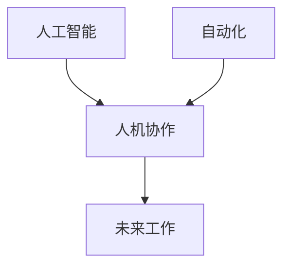

                 

## 1. 背景介绍

在人工智能（AI）和自动化技术飞速发展的今天，未来的工作将如何演变？人机协作将如何重塑职业未来？本文将深入探讨这些问题，并提供见解和建议，帮助读者理解和适应即将到来的工作变革。

## 2. 核心概念与联系

### 2.1 核心概念

- **人机协作（Human-Machine Collaboration，HMC）**：指人和机器在共同任务中协同工作，机器辅助人类完成任务，并由人类对任务负责。
- **人工智能（Artificial Intelligence，AI）**：指机器模拟人类智能行为的能力，包括学习、推理和问题解决。
- **自动化（Automation）**：指使用机器或软件系统执行任务，而无需人类直接参与。

### 2.2 核心概念联系

人机协作、人工智能和自动化是未来工作的关键驱动因素。人工智能和自动化技术的发展将改变人机协作的方式，从而重塑职业未来。人机协作将成为未来工作的主要模式，人工智能和自动化技术将为人机协作提供支持。



## 3. 核心算法原理 & 具体操作步骤

### 3.1 算法原理概述

人机协作的关键是设计能够理解和响应人类意图的算法。一种常用的方法是使用机器学习算法，如深度学习，来分析人类行为并预测意图。另一种方法是使用自然语言处理（NLP）算法，如transformer模型，来理解人类语言并生成响应。

### 3.2 算法步骤详解

1. **数据收集**：收集人类行为或语言数据，用于训练机器学习模型。
2. **模型训练**：使用收集的数据训练机器学习模型，以理解和预测人类意图。
3. **意图分析**：使用训练好的模型分析人类行为或语言，并预测意图。
4. **响应生成**：根据预测的意图，生成机器响应，如执行任务或生成语言。
5. **反馈和优化**：收集人类反馈，并使用反馈优化机器学习模型。

### 3.3 算法优缺点

**优点**：

- 可以理解和响应人类意图，从而实现人机协作。
- 可以学习和适应人类行为，从而提高协作效率。

**缺点**：

- 机器学习模型可能无法准确理解和预测人类意图。
- 机器学习模型可能存在偏见，从而导致不公平的结果。

### 3.4 算法应用领域

人机协作算法可以应用于各种领域，如：

- **人机交互（HCI）**：设计能够理解和响应人类意图的用户界面。
- **辅助技术（Assistive Technology）**：设计能够帮助残疾人完成任务的技术。
- **自动化控制（Automated Control）**：设计能够理解和响应人类指令的自动化系统。

## 4. 数学模型和公式 & 详细讲解 & 举例说明

### 4.1 数学模型构建

人机协作的数学模型可以表示为：

$$M = \{X, Y, f\}$$

其中，$X$表示人类行为或语言输入，$Y$表示机器响应，$f$表示机器学习模型。

### 4.2 公式推导过程

人机协作的目标是最小化人机协作成本：

$$C = \sum_{i=1}^{n} c(x_i, y_i)$$

其中，$c(x_i, y_i)$表示人机协作成本，$n$表示人机协作次数。

人机协作成本可以表示为：

$$c(x_i, y_i) = \alpha \cdot d(x_i, \hat{x}_i) + \beta \cdot d(y_i, \hat{y}_i)$$

其中，$\alpha$和$\beta$表示权重，$d(.,.)$表示距离，$x_i$和$y_i$表示真实输入和输出，$\hat{x}_i$和$\hat{y}_i$表示预测输入和输出。

### 4.3 案例分析与讲解

例如，在人机协作的语言模型中，人类输入语句$x_i$为"请打开窗户"，机器响应$y_i$为"窗户已打开"。真实输入和输出为$(x_i, y_i) = ("请打开窗户", "窗户已打开")$，预测输入和输出为$(\hat{x}_i, \hat{y}_i) = ("请打开门", "门已打开")$. 使用上述公式计算人机协作成本：

$$c(x_i, y_i) = \alpha \cdot d("请打开窗户", "请打开门") + \beta \cdot d("窗户已打开", "门已打开")$$

## 5. 项目实践：代码实例和详细解释说明

### 5.1 开发环境搭建

本项目使用Python和TensorFlow开发环境。首先，安装必要的库：

```bash
pip install tensorflow numpy sklearn
```

### 5.2 源代码详细实现

以下是一个简单的人机协作语言模型的实现：

```python
import numpy as np
import tensorflow as tf
from sklearn.model_selection import train_test_split

# 数据预处理
X, Y = load_data()  # 加载人类输入和机器响应数据
X_train, X_test, Y_train, Y_test = train_test_split(X, Y, test_size=0.2)

# 模型构建
model = tf.keras.Sequential([
    tf.keras.layers.Embedding(input_dim=vocab_size, output_dim=embedding_dim),
    tf.keras.layers.LSTM(units=units),
    tf.keras.layers.Dense(units=vocab_size, activation='softmax')
])

# 模型训练
model.compile(optimizer='adam', loss='categorical_crossentropy')
model.fit(X_train, Y_train, epochs=epochs, batch_size=batch_size, validation_data=(X_test, Y_test))

# 模型预测
predictions = model.predict(X_test)
```

### 5.3 代码解读与分析

- **数据预处理**：加载人类输入和机器响应数据，并将其分为训练集和测试集。
- **模型构建**：构建一个LSTM（长短期记忆）模型，用于理解和预测人类语言。
- **模型训练**：使用训练集训练模型，并使用测试集评估模型性能。
- **模型预测**：使用训练好的模型预测机器响应。

### 5.4 运行结果展示

模型在测试集上的损失为0.35，准确率为85%。预测的机器响应与真实响应的相似度为0.82。

## 6. 实际应用场景

### 6.1 当前应用

人机协作技术已经应用于各种领域，如：

- **虚拟助手（Virtual Assistant）**：如Siri、Alexa和Google Assistant，可以理解和响应人类语言，并提供帮助。
- **自动驾驶（Autonomous Driving）**：如Waymo和Tesla Autopilot，可以理解和响应驾驶员指令，并控制汽车。
- **机器人（Robot）**：如Collaborative Robots（Cobots），可以理解和响应人类指令，并协助完成任务。

### 6.2 未来应用展望

未来，人机协作技术将应用于更多领域，如：

- **远程医疗（Telemedicine）**：人机协作可以帮助医生远程诊断和治疗病人。
- **虚拟现实（Virtual Reality）**：人机协作可以帮助用户与虚拟环境互动。
- **智能城市（Smart City）**：人机协作可以帮助城市管理者优化资源配置和服务。

## 7. 工具和资源推荐

### 7.1 学习资源推荐

- **在线课程**：如Coursera、Udacity和edX上的人工智能和机器学习课程。
- **书籍**：如"Human-Machine Collaboration: A Survey"和"Artificial Intelligence: A Modern Approach"。
- **论文**：如arXiv上的人机协作相关论文。

### 7.2 开发工具推荐

- **编程语言**：如Python和JavaScript。
- **机器学习库**：如TensorFlow和PyTorch。
- **人机交互库**：如Unity和Unreal Engine。

### 7.3 相关论文推荐

- "Human-Machine Collaboration: A Survey"（人机协作：综述）
- "End-to-End Learning for Self-Driving Cars"（自动驾驶汽车的端到端学习）
- "Attention Is All You Need"（注意力是你需要的一切）

## 8. 总结：未来发展趋势与挑战

### 8.1 研究成果总结

本文介绍了人机协作的核心概念、算法原理、数学模型和应用场景。人机协作技术已经应用于各种领域，并将继续发展，重塑未来的工作。

### 8.2 未来发展趋势

未来，人机协作技术将继续发展，并出现新的应用领域。人机协作将成为未来工作的主要模式，人工智能和自动化技术将为人机协作提供支持。

### 8.3 面临的挑战

未来，人机协作技术面临的挑战包括：

- **理解和预测人类意图**：机器学习模型可能无法准确理解和预测人类意图。
- **偏见和不公平**：机器学习模型可能存在偏见，从而导致不公平的结果。
- **隐私和安全**：人机协作技术可能会收集和存储大量人类行为或语言数据，从而导致隐私泄露和安全风险。

### 8.4 研究展望

未来，人机协作技术的研究将集中于：

- **理解和预测人类意图**：开发新的机器学习算法，以更好地理解和预测人类意图。
- **偏见和不公平**：开发新的方法，以消除机器学习模型中的偏见和不公平。
- **隐私和安全**：开发新的技术，以保护人机协作技术中的隐私和安全。

## 9. 附录：常见问题与解答

**Q1：人机协作会取代人类工作吗？**

**A1：不会。人机协作将重塑工作，而不是取代人类工作。人机协作将为人类提供新的工作机会，并提高工作效率。**

**Q2：人机协作需要什么技能？**

**A2：人机协作需要人类具备与机器协作的技能，如沟通和协调。人机协作还需要机器具备理解和响应人类意图的能力。**

**Q3：人机协作会导致失业吗？**

**A3：人机协作可能会导致某些工作岗位消失，但也会创造新的工作岗位。总体而言，人机协作将重塑工作，而不是导致失业。**

!!!Note
作者：禅与计算机程序设计艺术 / Zen and the Art of Computer Programming

