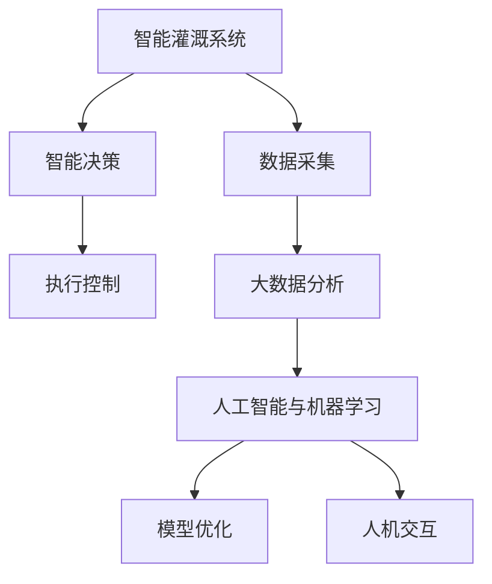

                 

# 未来的智慧农业：2050年的智能灌溉与农业机器人

## 1. 背景介绍

### 1.1 问题由来

随着全球人口的不断增长，对食品的需求量也在急剧上升。然而，由于气候变化、资源短缺和环境退化等因素，传统农业生产方式已难以满足可持续发展的要求。为此，智慧农业（Smart Agriculture）成为了应对这一挑战的重要解决方案。智慧农业利用信息技术和传感器等手段，对农业生产进行精准管理，提高生产效率，降低资源消耗，实现农业生产的智能化和可持续化。

在众多智慧农业技术中，智能灌溉和农业机器人是两大关键支撑。智能灌溉系统可以精确控制灌溉量，减少水资源的浪费。农业机器人则可以自动化地完成种植、施肥、喷洒等农业操作，提高农业生产效率。这些技术不仅能够提高农业产量，还能降低环境污染，提升农业的可持续性。

### 1.2 问题核心关键点

智能灌溉与农业机器人涉及的核心问题包括：

1. **数据采集与处理**：通过传感器等设备采集田间环境数据，如土壤湿度、温度、光照等，并使用数据处理技术进行分析和预处理。
2. **智能决策**：基于采集的数据和预设的规则，智能灌溉系统能够自动决定灌溉时间和水量，农业机器人能够自主执行田间操作。
3. **模型优化**：构建合适的数学模型，描述农业生产过程中各要素之间的关系，通过模型优化实现高效生产。
4. **人机交互**：设计友好的人机交互界面，方便农民操作和监控，提升农业生产管理的便捷性。

这些核心问题相互关联，共同构成了智能灌溉和农业机器人技术的完整框架。通过解决这些关键问题，可以大幅提升农业生产的智能化水平。

### 1.3 问题研究意义

研究智能灌溉与农业机器人技术，对于推动农业现代化、实现农业可持续发展和提高全球粮食安全具有重要意义：

1. **提高生产效率**：通过智能化管理，可以减少人力和时间成本，提高农业生产效率。
2. **节约资源**：精准灌溉和智能施肥能够有效减少水、化肥等资源的浪费，保护生态环境。
3. **提升产量**：智能决策和自动化操作能够优化农业生产流程，提高作物产量和品质。
4. **支持精准农业**：利用大数据和云计算技术，实现对农业生产的精准管理，为农业生产提供决策支持。
5. **促进农业产业升级**：智能农业技术的推广应用，将推动传统农业向智慧农业转型，提升农业产业的竞争力和创新力。

## 2. 核心概念与联系

### 2.1 核心概念概述

为了更好地理解智能灌溉与农业机器人技术的原理和应用，本节将介绍几个核心概念及其相互联系：

1. **智能灌溉系统**：通过传感器和自动化设备，实时监测田间环境数据，根据预设规则自动调整灌溉方案，实现精准灌溉。
2. **农业机器人**：自动化执行田间种植、施肥、喷洒等操作，减少人工干预，提高生产效率和作物品质。
3. **物联网技术**：将传感器、控制器和计算机等设备互联互通，实现农业生产数据的实时采集与传输。
4. **大数据分析**：对农业生产过程中的海量数据进行分析和挖掘，提供科学决策支持。
5. **人工智能与机器学习**：基于机器学习算法，构建农业生产模型，实现智能决策和优化。

这些核心概念之间相互联系，共同构成了智能灌溉与农业机器人技术的整体框架。通过理解这些概念，可以更好地把握技术发展的方向和应用场景。

### 2.2 核心概念原理和架构的 Mermaid 流程图



这个流程图展示了智能灌溉与农业机器人技术的核心概念及其相互联系：

1. **数据采集**：通过传感器等设备，实时监测田间环境数据。
2. **智能决策**：基于采集的数据和预设规则，自动调整灌溉方案或执行田间操作。
3. **执行控制**：将决策结果转化为具体的灌溉或操作指令，实现自动化执行。
4. **大数据分析**：对历史数据进行分析和挖掘，提供科学决策支持。
5. **人工智能与机器学习**：基于机器学习算法，构建优化模型，实现智能决策和优化。
6. **模型优化**：对模型进行优化，提升决策精度和效率。
7. **人机交互**：设计友好的人机交互界面，方便农民操作和监控。

## 3. 核心算法原理 & 具体操作步骤

### 3.1 算法原理概述

智能灌溉与农业机器人技术的核心算法原理主要涉及以下几个方面：

1. **数据采集与处理**：通过传感器采集田间环境数据，并使用数据处理技术进行清洗和预处理，得到可用于分析的数据。
2. **智能决策**：基于采集的数据和预设规则，构建优化模型，实现智能决策和控制。
3. **模型优化**：通过机器学习算法，对模型进行优化，提升决策精度和效率。

这些算法原理相互关联，共同构成了智能灌溉与农业机器人技术的核心技术框架。

### 3.2 算法步骤详解

#### 3.2.1 数据采集与处理

智能灌溉与农业机器人技术的首要步骤是数据采集与处理。具体步骤如下：

1. **设备部署**：在田间部署各类传感器，如土壤湿度传感器、温度传感器、光照传感器等，实时监测田间环境数据。
2. **数据采集**：传感器采集的数据通过无线通信模块传输到中央控制器或云端平台。
3. **数据预处理**：对采集的数据进行清洗、去噪和归一化处理，得到可用于分析的原始数据。

#### 3.2.2 智能决策

智能决策是智能灌溉与农业机器人技术的核心环节，具体步骤如下：

1. **规则设置**：根据农业生产的实际情况，设定灌溉和施肥等操作的规则。例如，当土壤湿度低于预设阈值时，自动开启灌溉。
2. **模型训练**：基于历史数据，训练机器学习模型，预测田间环境变化趋势。例如，使用回归模型预测未来土壤湿度。
3. **决策生成**：将采集的数据输入模型，生成智能决策。例如，根据模型预测结果，自动调整灌溉量。

#### 3.2.3 模型优化

模型优化是提升智能灌溉与农业机器人技术效果的重要步骤，具体步骤如下：

1. **特征选择**：选择对模型预测有重要影响的特征，例如土壤湿度、气温等。
2. **模型构建**：根据农业生产实际情况，选择适合的机器学习算法，例如回归模型、分类模型等。
3. **参数调优**：通过交叉验证等方法，对模型参数进行调优，提升模型预测精度。

### 3.3 算法优缺点

智能灌溉与农业机器人技术在实际应用中具有以下优点：

1. **高效便捷**：通过自动化设备和智能决策，大幅提高农业生产效率，减少人工干预。
2. **精准管理**：智能灌溉和施肥等操作能够根据田间环境数据进行精准调整，减少资源浪费。
3. **实时响应**：通过实时数据采集和处理，能够及时响应田间环境变化，优化农业生产。

同时，该技术也存在一些局限性：

1. **初始投资高**：部署传感器和自动化设备需要较高的初始投资成本。
2. **技术复杂**：设备部署和系统维护需要专业知识和技能。
3. **数据质量依赖**：系统的性能很大程度上依赖于传感器数据的准确性和稳定性。
4. **环境适应性**：在某些极端气候条件下，设备可能无法正常工作。

尽管存在这些局限性，但智能灌溉与农业机器人技术在提高农业生产效率和可持续性方面的潜力巨大，是未来智慧农业的重要方向。

### 3.4 算法应用领域

智能灌溉与农业机器人技术在多个领域具有广泛的应用前景：

1. **精准农业**：通过传感器和自动化设备，实现对农业生产的精准管理。
2. **智慧农场**：通过物联网和云计算技术，实现农业生产的远程监控和管理。
3. **农业机器人**：自动化执行种植、施肥、喷洒等田间操作，提高生产效率。
4. **水资源管理**：通过智能灌溉系统，实现水资源的合理利用和优化配置。
5. **环境保护**：减少水资源和化肥的浪费，保护生态环境，实现农业生产的可持续性。

这些应用领域充分展示了智能灌溉与农业机器人技术的广阔前景。通过合理应用这些技术，可以大幅提升农业生产的智能化水平。

## 4. 数学模型和公式 & 详细讲解 & 举例说明

### 4.1 数学模型构建

为了更好地理解智能灌溉与农业机器人技术的数学模型，本节将构建一个简单的回归模型，用于预测土壤湿度。假设传感器数据为 $X=\{x_1,x_2,...,x_n\}$，土壤湿度为 $Y$，则回归模型的目标是最小化预测误差：

$$
\min_{\theta} \frac{1}{N} \sum_{i=1}^N (y_i - \theta_0 - \sum_{j=1}^p \theta_j x_{ij})^2
$$

其中，$N$ 为样本数量，$\theta = (\theta_0, \theta_1,...,\theta_p)^T$ 为模型参数。

### 4.2 公式推导过程

回归模型的最小化目标函数可以通过梯度下降等优化算法求解。假设 $\theta$ 的梯度为 $\nabla_{\theta}\mathcal{L}(\theta)$，则优化算法可表示为：

$$
\theta \leftarrow \theta - \eta \nabla_{\theta}\mathcal{L}(\theta)
$$

其中，$\eta$ 为学习率。通过多次迭代，可以逐步调整模型参数，最小化预测误差。

### 4.3 案例分析与讲解

以土壤湿度预测为例，假设我们收集了多天的土壤湿度数据 $Y=\{y_1,y_2,...,y_n\}$，同时获取了相应的气象数据 $X=\{x_1,x_2,...,x_n\}$，其中 $x_1$ 表示日期，$x_2$ 表示温度，$x_3$ 表示湿度等。我们可以构建一个线性回归模型，预测未来的土壤湿度。通过数据处理和特征选择，我们选择了温度和湿度作为预测特征，即 $X=\{x_2,x_3\}$。

构建回归模型后，我们可以通过梯度下降等优化算法进行模型训练。在训练过程中，需要根据实际问题选择合适的优化算法、学习率和迭代次数等参数，以得到最佳的预测模型。

## 5. 项目实践：代码实例和详细解释说明

### 5.1 开发环境搭建

在进行智能灌溉与农业机器人项目开发前，我们需要准备好开发环境。以下是使用Python进行开发的常见环境配置流程：

1. **安装Anaconda**：从官网下载并安装Anaconda，用于创建独立的Python环境。

2. **创建并激活虚拟环境**：
   ```bash
   conda create -n agri_env python=3.8 
   conda activate agri_env
   ```

3. **安装所需的Python库**：
   ```bash
   pip install numpy pandas scikit-learn matplotlib seaborn
   ```

4. **安装物联网设备驱动程序和接口库**：
   ```bash
   pip install pyserial
   ```

5. **安装农业机器人控制器库**：
   ```bash
   pip install robolearn
   ```

### 5.2 源代码详细实现

这里我们以土壤湿度预测为例，使用Python和Scikit-learn库实现回归模型。

```python
import pandas as pd
from sklearn.linear_model import LinearRegression
import matplotlib.pyplot as plt

# 读取数据
data = pd.read_csv('soil_humidity.csv')

# 划分训练集和测试集
train_data = data.iloc[:800]
test_data = data.iloc[800:]

# 特征选择
X = train_data[['temperature', 'humidity']]
y = train_data['soil_humidity']

# 构建线性回归模型
model = LinearRegression()
model.fit(X, y)

# 预测测试集
X_test = test_data[['temperature', 'humidity']]
y_pred = model.predict(X_test)

# 可视化结果
plt.scatter(X_test['temperature'], y_test, label='Actual')
plt.plot(X_test['temperature'], y_pred, color='red', label='Predicted')
plt.legend()
plt.show()
```

### 5.3 代码解读与分析

**读取数据**：使用pandas库读取土壤湿度数据，并将数据划分为训练集和测试集。

**特征选择**：选择温度和湿度作为预测特征，并构建线性回归模型。

**模型训练**：使用梯度下降等优化算法，训练线性回归模型。

**预测测试集**：将测试集输入模型，得到预测结果。

**可视化结果**：使用matplotlib库绘制实际数据和预测结果的散点图，可视化模型效果。

## 6. 实际应用场景

### 6.1 智能灌溉系统

智能灌溉系统通过实时监测田间环境数据，自动调整灌溉方案，实现精准灌溉。具体应用场景包括：

1. **智能灌溉控制器**：部署在田间，实时采集土壤湿度、气温等数据，根据预设规则自动控制灌溉量。
2. **云端平台**：将采集的数据传输到云端，进行实时监控和分析，生成灌溉方案。
3. **手机应用**：农民可以通过手机应用实时查看田间环境数据，调整灌溉策略。

### 6.2 农业机器人

农业机器人可以自动化执行田间操作，如种植、施肥、喷洒等。具体应用场景包括：

1. **种植机器人**：自动化播种、移栽等操作，提高种植效率。
2. **施肥机器人**：根据土壤数据自动施肥，优化施肥量和时间。
3. **喷洒机器人**：自动化喷洒农药、水等，提高喷洒精度和效率。

### 6.3 智慧农场

智慧农场通过物联网和云计算技术，实现农业生产的远程监控和管理。具体应用场景包括：

1. **传感器部署**：在田间部署各类传感器，实时监测环境数据。
2. **远程监控**：将采集的数据上传到云端平台，进行远程监控和管理。
3. **智能决策**：基于采集的数据和预设规则，自动生成决策方案，优化农业生产。

### 6.4 未来应用展望

随着智能灌溉与农业机器人技术的不断发展，未来的应用场景将更加广阔：

1. **无人农场**：完全自动化管理农田，实现农业生产的智能化和规模化。
2. **智能温室**：利用传感器和机器人，实现对温室环境的精准控制。
3. **精准农业**：通过大数据分析和机器学习技术，实现对农业生产的精准管理。
4. **环境监测**：实时监测农田环境，预测气候变化，提供科学决策支持。
5. **资源优化**：优化水、化肥等资源的利用，实现农业生产的可持续性。

这些应用场景展示了智能灌溉与农业机器人技术的巨大潜力，未来必将在智慧农业中发挥重要作用。

## 7. 工具和资源推荐

### 7.1 学习资源推荐

为了帮助开发者系统掌握智能灌溉与农业机器人技术的理论基础和实践技巧，以下是一些优质的学习资源：

1. **《智能农业技术》课程**：由农业领域专家开设的在线课程，系统介绍智能灌溉、农业机器人等技术。
2. **《物联网技术与应用》书籍**：详细讲解物联网技术的基本原理和应用场景，为农业物联网项目的开发提供参考。
3. **《人工智能与机器学习》课程**：介绍人工智能和机器学习的基本概念和常用算法，为智能决策和模型优化提供理论基础。
4. **《农业机器人技术》书籍**：系统介绍农业机器人的设计和应用，为农业机器人项目开发提供指导。
5. **《智慧农业实践》系列博文**：由智慧农业领域的专家撰写，分享智能灌溉、农业机器人等技术在实际应用中的经验和教训。

通过这些学习资源，开发者可以系统掌握智能灌溉与农业机器人技术的基本原理和应用方法。

### 7.2 开发工具推荐

高效的开发离不开优秀的工具支持。以下是几款用于智能灌溉与农业机器人项目开发的常用工具：

1. **Python**：作为人工智能和物联网开发的主流语言，Python具有丰富的库和框架，支持快速迭代研究。
2. **TensorFlow**：由Google主导开发的深度学习框架，支持大规模工程应用，广泛应用于智能决策和模型优化。
3. **PyTorch**：由Facebook开发的深度学习框架，支持动态图计算，适合研究性项目开发。
4. **IoT平台**：如ThingWorx、AWS IoT等，提供云端的物联网设备管理和服务，支持智能灌溉与农业机器人项目的云端部署。
5. **农业机器人控制器**：如Robot Operating System (ROS)，支持农业机器人的编程和调试。
6. **数据可视化工具**：如Tableau、Power BI等，支持实时数据分析和可视化，方便农业生产管理。

合理利用这些工具，可以显著提升智能灌溉与农业机器人项目的开发效率，加快创新迭代的步伐。

### 7.3 相关论文推荐

智能灌溉与农业机器人技术的发展源于学界的持续研究。以下是几篇奠基性的相关论文，推荐阅读：

1. **《基于物联网的智能灌溉系统》**：介绍了一种基于物联网技术的智能灌溉系统，实现了田间环境的实时监测和精准灌溉。
2. **《农业机器人的设计与应用》**：详细介绍了农业机器人的设计和实现方法，展示了其在田间操作中的应用效果。
3. **《智能决策与优化算法在农业中的应用》**：探讨了智能决策和优化算法在农业生产中的作用，提供了科学决策支持。
4. **《大数据与云计算在智慧农业中的应用》**：介绍了大数据和云计算技术在智慧农业中的应用，展示了其在农业生产管理和资源优化方面的潜力。

这些论文代表了大规模农业机器人技术的发展脉络。通过学习这些前沿成果，可以帮助研究者把握学科前进方向，激发更多的创新灵感。

## 8. 总结：未来发展趋势与挑战

### 8.1 研究成果总结

智能灌溉与农业机器人技术在智慧农业中具有重要应用价值，已经成为当前研究的热点。其主要研究方向包括：

1. **数据采集与处理**：通过传感器和设备，实时采集田间环境数据，并进行数据清洗和预处理。
2. **智能决策**：基于采集的数据和预设规则，构建优化模型，实现智能决策和控制。
3. **模型优化**：通过机器学习算法，对模型进行优化，提升决策精度和效率。

这些研究方向相互关联，共同构成了智能灌溉与农业机器人技术的核心技术框架。通过不断的研究和创新，可以实现农业生产的智能化和可持续化。

### 8.2 未来发展趋势

展望未来，智能灌溉与农业机器人技术将呈现以下几个发展趋势：

1. **智能化水平提升**：通过深度学习等技术，提升农业生产决策的智能化水平，实现精准管理。
2. **自动化程度提高**：自动化执行田间操作，减少人工干预，提高生产效率。
3. **数据融合与集成**：融合多种数据源，实现多模态信息的协同建模，提供更全面的决策支持。
4. **跨领域应用拓展**：智能灌溉与农业机器人技术将在智慧农业之外的领域，如智慧城市、智慧医疗等，得到更广泛的应用。
5. **环境适应性增强**：研发适应极端气候条件的环境监测和控制系统，提高系统的稳定性和鲁棒性。

这些趋势展示了智能灌溉与农业机器人技术的广阔前景，未来必将在智慧农业中发挥重要作用。

### 8.3 面临的挑战

尽管智能灌溉与农业机器人技术已经取得了一定的进展，但在实际应用中仍面临一些挑战：

1. **数据质量问题**：田间环境数据的不稳定性，传感器设备的老化和损坏，都可能导致数据质量下降，影响模型的准确性。
2. **设备部署与维护**：大规模部署传感器和设备需要较高的初始投资和维护成本。
3. **技术复杂性**：智能灌溉与农业机器人技术涉及多种学科知识，系统设计和管理需要专业技能。
4. **环境适应性**：极端气候条件下的设备稳定性和鲁棒性问题，需要在设计和算法上进行优化。
5. **数据隐私与安全**：农业数据的采集和存储涉及隐私保护和安全问题，需要制定相应的数据管理和安全策略。

这些挑战需要研究者不断探索和创新，以实现技术的进步和应用的普及。

### 8.4 研究展望

面对智能灌溉与农业机器人技术所面临的挑战，未来的研究方向包括：

1. **数据质量提升**：研究先进的数据采集和处理技术，提高数据质量和稳定性。
2. **自动化设备优化**：设计更加可靠和高效的设备，降低初始投资和维护成本。
3. **跨学科融合**：推动智能灌溉与农业机器人技术与物联网、大数据、云计算等技术的融合，实现多模态信息的协同建模。
4. **环境适应性增强**：研发适应极端气候条件的环境监测和控制系统，提高系统的稳定性和鲁棒性。
5. **数据隐私与安全**：研究数据管理和安全策略，保障数据隐私和系统安全。

这些研究方向将推动智能灌溉与农业机器人技术的不断进步，为农业生产的智能化和可持续化提供有力支持。

## 9. 附录：常见问题与解答

**Q1：智能灌溉与农业机器人技术在实际应用中需要注意哪些问题？**

A: 智能灌溉与农业机器人技术在实际应用中需要注意以下问题：

1. **数据质量**：保证数据采集的准确性和稳定性，避免因数据质量问题影响系统性能。
2. **设备部署**：考虑设备的安装位置和环境适应性，确保设备正常工作。
3. **技术复杂性**：需要专业知识和技能进行设备部署和系统维护。
4. **环境适应性**：在极端气候条件下，设备需要具备一定的鲁棒性和稳定性。
5. **数据隐私与安全**：需要制定相应的数据管理和安全策略，保障数据隐私和系统安全。

**Q2：如何提高智能灌溉与农业机器人技术的可靠性？**

A: 提高智能灌溉与农业机器人技术的可靠性需要从多个方面进行优化：

1. **数据质量**：选择高精度的传感器和设备，保证数据的准确性和稳定性。
2. **设备设计**：设计适应极端气候条件的环境监测和控制系统，提高设备的稳定性和鲁棒性。
3. **算法优化**：优化模型的参数和算法，提高预测精度和决策效率。
4. **维护管理**：定期维护设备，及时发现和修复故障，确保系统正常运行。

**Q3：智能灌溉与农业机器人技术在智慧农业中的应用前景如何？**

A: 智能灌溉与农业机器人技术在智慧农业中的应用前景非常广阔，主要体现在以下几个方面：

1. **精准农业**：通过智能决策和自动化操作，实现对农业生产的精准管理。
2. **资源优化**：优化水、化肥等资源的利用，实现农业生产的可持续性。
3. **环境监测**：实时监测农田环境，预测气候变化，提供科学决策支持。
4. **无人农场**：实现完全自动化管理农田，提高农业生产效率。
5. **智能温室**：利用传感器和机器人，实现对温室环境的精准控制。

通过合理应用智能灌溉与农业机器人技术，可以实现农业生产的智能化和可持续化，提升农业生产效率和产量。

---

作者：禅与计算机程序设计艺术 / Zen and the Art of Computer Programming

