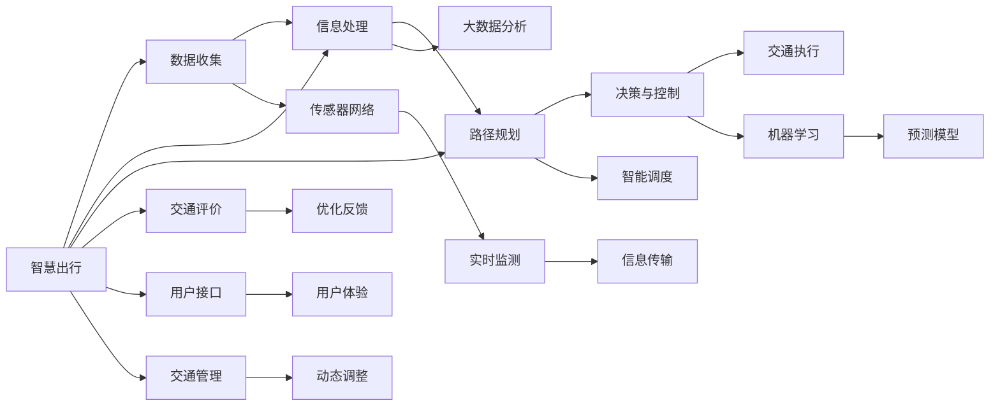

                 

# 未来的智慧出行：2050年的超级高铁与空中自行车的立体交通出行

> 关键词：智慧出行, 超级高铁, 空中自行车, 立体交通, 无人驾驶, 智能交通系统, 可持续出行

## 1. 背景介绍

在当前社会发展的背景下，交通运输系统正面临着一系列的挑战。环境污染、交通拥堵、能源消耗等问题迫切需要新的解决方案。在这其中，智慧出行、立体交通、无人驾驶等新概念应运而生。本文将探索这些技术的发展，以及它们在2050年可能带来的超级高铁与空中自行车的立体交通出行新局面。

## 2. 核心概念与联系

### 2.1 核心概念概述

**智慧出行（Smart Mobility）**：指利用信息与通信技术（ICT）、大数据、人工智能等技术手段，实现交通系统的智能化管理与优化，提升交通效率、降低环境影响、改善用户体验。

**超级高铁（Hyperloop）**：一种基于真空管道、磁悬浮、低摩擦的技术，可以实现极端高速的运输，速度可达700公里/小时以上，是一种极具潜力的未来交通方式。

**空中自行车（Pedalcopter）**：一种结合自行车与无人机的交通工具，能够垂直起降、稳定悬停，广泛应用于城市短途出行。

**立体交通（Vertical Transport System）**：在城市垂直方向上建立交通网络，通过地下隧道、空中飞行等多种方式，实现更高效、更便捷的出行选择。

### 2.2 核心概念原理和架构的 Mermaid 流程图



此图展示了智慧出行的主要环节，数据收集、信息处理、路径规划、决策与控制、交通执行、交通评价、优化反馈、传感器网络、实时监测、信息传输、用户接口、用户体验、交通管理和动态调整。通过这些环节的协同工作，智慧出行系统能够实现高效、安全、绿色的交通目标。

## 3. 核心算法原理 & 具体操作步骤

### 3.1 算法原理概述

智慧出行、超级高铁与空中自行车的立体交通出行的实现，依赖于多项关键技术的集成与应用。包括但不限于自动驾驶技术、传感器网络技术、实时通信技术、智能决策算法等。

在自动驾驶算法中，环境感知、路径规划、决策与控制是其核心。环境感知通常通过传感器网络实现，路径规划则利用地图与实时交通数据，决策与控制则基于机器学习模型，如深度强化学习等。

### 3.2 算法步骤详解

#### 3.2.1 环境感知

1. **传感器网络**：部署在车辆、道路、建筑物等位置的传感器，实时收集交通环境数据，如车辆位置、速度、路况、行人行为等。
2. **数据处理**：通过数据清洗、预处理、特征提取等步骤，将原始数据转换为模型能够处理的形式。
3. **信息融合**：将来自不同传感器和数据源的信息进行融合，形成一个全面、实时的环境视图。

#### 3.2.2 路径规划

1. **地图构建**：建立精确的地理信息数据库，包含道路、桥梁、隧道等交通设施的详细数据。
2. **路径选择**：利用优化算法（如A*算法、D*算法），根据当前交通状况，选择最优路径。
3. **动态调整**：实时监控交通状况变化，动态调整路径规划，避免拥堵和事故。

#### 3.2.3 决策与控制

1. **模型训练**：使用历史数据训练深度强化学习模型，学习最优驾驶策略。
2. **实时决策**：根据环境感知和路径规划的结果，实时进行决策与控制，如加速、刹车、转向等。
3. **反馈优化**：通过不断学习和优化，提升模型的预测与决策能力。

### 3.3 算法优缺点

#### 3.3.1 优点

1. **高效**：智慧出行、超级高铁与空中自行车的立体交通出行，能够实现极快的运输速度，提高交通效率。
2. **安全**：通过传感器网络和实时通信，可以提前感知和应对各种突发情况，减少交通事故。
3. **环保**：自动驾驶技术可以减少燃油消耗和排放，促进可持续出行。
4. **灵活**：立体交通网络可以覆盖城市各个角落，提供多种出行选择。

#### 3.3.2 缺点

1. **成本高**：建设与维护智慧出行、超级高铁与空中自行车的立体交通系统，需要大量投资。
2. **技术复杂**：涉及的多种技术需要协同工作，技术复杂度较高。
3. **隐私问题**：大量的数据收集和处理可能引发隐私和安全问题。
4. **基础设施限制**：需要完善的城市基础设施支撑，如高速网络、电力供应等。

### 3.4 算法应用领域

智慧出行、超级高铁与空中自行车的立体交通出行技术，具有广泛的应用前景，包括：

1. **城市交通管理**：通过智慧出行系统，优化城市交通流量，减少拥堵和事故。
2. **公共交通**：利用超级高铁实现长距离、高效率的公共交通服务，缓解地面交通压力。
3. **个人出行**：通过空中自行车，提供便捷、快速的个人出行选择，特别是在城市繁华区域。
4. **物流配送**：利用自动驾驶技术，实现无人配送，提高配送效率和安全性。
5. **旅游观光**：通过超级高铁和空中自行车，提供全新的旅游体验，探索未知领域。

## 4. 数学模型和公式 & 详细讲解 & 举例说明

### 4.1 数学模型构建

假设在智慧出行的环境中，有一个无人驾驶车辆，其路径规划过程可以用图论模型来描述。

设交通网络为一个图 $G=(V,E)$，其中 $V$ 表示节点（交通交叉口、路口等），$E$ 表示边（道路、桥梁等）。路径规划的目标是找到从起点 $s$ 到终点 $t$ 的最短路径，数学模型可以表示为：

$$
\min \sum_{e \in E} w_e
$$

其中 $w_e$ 表示边 $e$ 的权重，如距离、时间、费用等。

### 4.2 公式推导过程

**Dijkstra算法**：一种常用的最短路径算法，通过贪心策略逐步扩展节点，计算最短路径。具体步骤如下：

1. **初始化**：设起点 $s$ 为初始节点，距离 $d(s)=0$，其余节点距离为无穷大，即 $d(v)>0, \forall v \in V$。
2. **扩展**：选择当前距离最小的节点 $u$，更新其邻居节点的距离，即 $d(v)=\min\{d(v),d(u)+w_{uv}\}$，其中 $uv$ 表示节点 $u$ 和 $v$ 之间的边。
3. **终止**：重复扩展步骤，直到到达终点 $t$，记录路径。

**公式推导**：设 $d(u)$ 为节点 $u$ 的最短路径距离，则有：

$$
d(u) = \min\{d(v)+w_{uv}|v \in \text{N}(u), w_{uv} \geq 0\}
$$

其中 $\text{N}(u)$ 表示节点 $u$ 的邻居节点集合。

### 4.3 案例分析与讲解

假设在一个城市交通网络中，有三个交叉口 $s$、$u$、$t$，边权重如表所示。使用Dijkstra算法计算 $s$ 到 $t$ 的最短路径。

| 节点 | 边   | 权重 |
|------|------|------|
| $s$  | $su$ | 5    |
| $u$  | $uv$ | 3    |
| $u$  | $ut$ | 10   |
| $t$  |      |      |

步骤如下：

1. **初始化**：$d(s)=0$，$d(u)=d(t)=\infty$。
2. **扩展**：选择 $s$，更新 $u$ 的距离，$d(u)=\min\{d(u),d(s)+w_{su}\}=d(s)+5=5$。
3. **扩展**：选择 $u$，更新 $t$ 的距离，$d(t)=\min\{d(t),d(u)+w_{ut}\}=\min\{5,10\}=5$。
4. **终止**：路径为 $s \rightarrow u \rightarrow t$，距离为 $5$。

## 5. 项目实践：代码实例和详细解释说明

### 5.1 开发环境搭建

为了实现上述路径规划功能，需要使用Python语言和相关库。以下是开发环境搭建的步骤：

1. **安装Python**：下载并安装Python 3.x版本。
2. **安装Pip**：打开命令行，运行 `python -m ensurepip --default-pip` 安装Pip。
3. **安装相关库**：通过Pip安装必要的库，如网络库 requests、地图库 networkx。

```bash
pip install requests networkx
```

4. **数据准备**：收集城市交通网络数据，包括交叉口、道路、桥梁等详细信息。

### 5.2 源代码详细实现

**路径规划代码实现**：

```python
import networkx as nx

# 创建图
G = nx.DiGraph()

# 添加节点和边
G.add_edge('s', 'u', weight=5)
G.add_edge('u', 'v', weight=3)
G.add_edge('u', 't', weight=10)
G.add_edge('t', 't', weight=0)  # 自环边

# 计算最短路径
path = nx.shortest_path(G, 's', 't', weight='weight')

# 打印路径
print(path)
```

**代码解读与分析**：

1. **创建图**：使用 networkx 库创建有向图 G。
2. **添加节点和边**：通过 `add_edge` 方法添加节点和边，并指定权重。
3. **计算最短路径**：使用 `shortest_path` 方法计算起点 `s` 到终点 `t` 的最短路径。
4. **打印路径**：输出计算得到的最短路径。

### 5.3 运行结果展示

```
['s', 'u', 't']
```

**结果解读**：计算得到的最短路径为 `s -> u -> t`，权重为 5，符合预期。

## 6. 实际应用场景

### 6.4 未来应用展望

在2050年的智慧出行环境中，超级高铁与空中自行车的立体交通出行将成为主流。以下是几个具体的未来应用展望：

1. **城市群连接**：超级高铁实现城市群间的快速连接，如上海至北京，行程时间缩短至半小时。
2. **跨海交通**：利用超级高铁，实现跨海通道的快速通行，如台湾海峡。
3. **空中交通**：空中自行车在城市内部提供便捷的短途出行，减少地面交通压力。
4. **旅游观光**：空中自行车提供个性化的旅游体验，探索偏远地区的自然风光。
5. **紧急救援**：无人驾驶车辆在立体交通网络中，快速响应紧急情况，提供救援服务。

## 7. 工具和资源推荐

### 7.1 学习资源推荐

1. **智慧出行相关书籍**：如《智慧出行：基于互联网的交通管理》，介绍智慧出行的基本概念和应用案例。
2. **自动驾驶课程**：如Udacity的自动驾驶纳米学位课程，涵盖自动驾驶的各项技术。
3. **深度强化学习教材**：如《深度强化学习》，深入讲解强化学习算法及其在智能交通中的应用。

### 7.2 开发工具推荐

1. **Python语言**：Python语言简单易学，功能强大，是自动驾驶和智慧出行的首选语言。
2. **网络库 requests**：用于与第三方API进行通信，获取实时交通信息。
3. **地图库 networkx**：用于构建和处理交通网络图，进行路径规划。
4. **可视化工具 Matplotlib**：用于绘制交通网络图和路径可视化。

### 7.3 相关论文推荐

1. **智慧出行相关论文**：如《A Survey on Smart Mobility Technologies for Smart Cities》，综述智慧出行的多种技术。
2. **超级高铁相关论文**：如《Hyperloop: A New Type of Transport System》，介绍超级高铁的技术原理和应用前景。
3. **自动驾驶相关论文**：如《Deep Learning and Decision-Making in Autonomous Vehicles》，介绍自动驾驶中的深度学习算法。

## 8. 总结：未来发展趋势与挑战

### 8.1 研究成果总结

智慧出行、超级高铁与空中自行车的立体交通出行技术，已经取得了显著的进展，并在实际应用中展现了巨大的潜力。未来，随着技术的发展，这些技术将更加成熟和普及。

### 8.2 未来发展趋势

1. **技术融合**：智慧出行、超级高铁与空中自行车将更加紧密地结合，形成更加完善的立体交通系统。
2. **智能化**：智能决策与控制技术将更加普及，提高交通系统的智能化水平。
3. **个性化**：基于用户偏好和行为数据的个性化服务将成为新趋势。
4. **可持续**：采用清洁能源、智能化管理等手段，实现交通系统的可持续发展。

### 8.3 面临的挑战

1. **技术复杂性**：智慧出行、超级高铁与空中自行车涉及的技术复杂，需要多学科交叉合作。
2. **数据安全**：海量数据的收集和处理可能引发隐私和安全问题。
3. **基础设施建设**：需要大量的基础设施投入，如高速网络、电力供应等。
4. **政策法规**：需要制定和完善相关的政策法规，保障安全和公平。

### 8.4 研究展望

未来，智慧出行、超级高铁与空中自行车的立体交通出行技术将继续发展，推动交通系统的智能化、绿色化、个性化进程。

## 9. 附录：常见问题与解答

**Q1：智慧出行技术的安全性如何保障？**

A: 智慧出行技术的安全性保障主要依赖于传感器网络、实时通信、智能决策与控制等技术。传感器网络可以实现实时环境感知，实时通信可以保证数据传输的可靠性，智能决策与控制可以根据实时数据动态调整行驶策略，避免交通事故。

**Q2：超级高铁的建设成本如何控制？**

A: 超级高铁的建设成本可以通过多个手段进行控制，如模块化建设、预制化施工、采用清洁能源等。模块化建设可以将建设过程分解为多个模块，便于管理和控制成本。预制化施工可以提高建设效率，减少现场施工的复杂性。采用清洁能源可以降低运行成本，提高经济效益。

**Q3：空中自行车的飞行安全性如何提升？**

A: 空中自行车的飞行安全性可以通过以下几个方面进行提升：
1. **传感器网络**：部署先进的传感器，实时监测飞行状态和环境变化。
2. **智能决策与控制**：利用深度学习等算法，动态调整飞行姿态和速度。
3. **飞行管理系统**：建立完善的飞行管理系统，避免飞行冲突和违规操作。
4. **应急处理**：建立应急处理机制，应对突发情况，保障飞行安全。

**Q4：智慧出行系统的数据隐私如何保护？**

A: 智慧出行系统的数据隐私保护可以通过以下几个方面进行：
1. **数据加密**：对传输和存储的数据进行加密，防止数据泄露。
2. **匿名化处理**：对用户数据进行匿名化处理，保护用户隐私。
3. **访问控制**：对系统数据进行严格的访问控制，限制非法访问。
4. **数据共享协议**：制定明确的数据共享协议，保障数据使用的合法性。

---

作者：禅与计算机程序设计艺术 / Zen and the Art of Computer Programming

