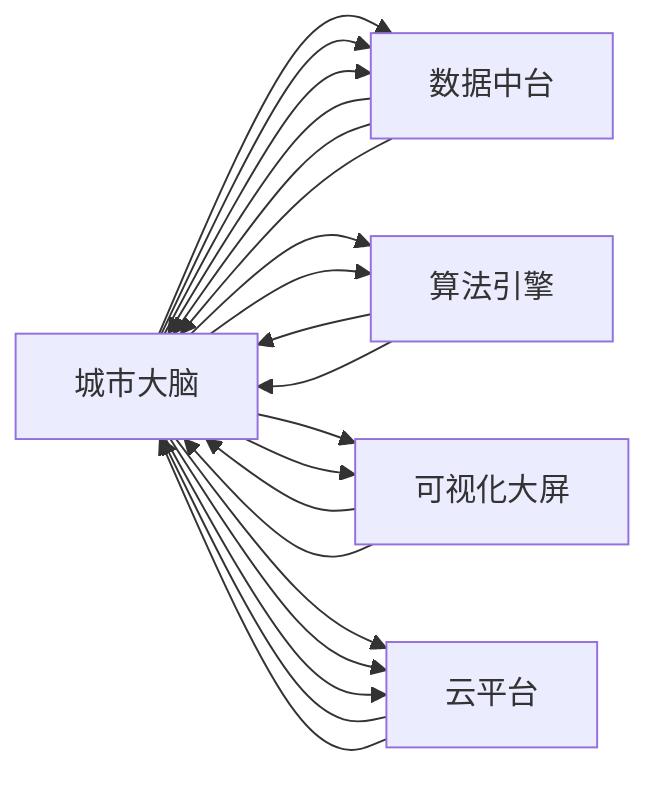

                 

# 未来的智慧城市：2050年的城市大脑与智慧城市运营

在21世纪的技术浪潮中，智慧城市作为未来城市发展的新方向，正逐步从概念走向现实。本文将深入探讨2050年智慧城市的构建框架，特别是城市大脑的设计与智慧城市运营的技术栈。通过理清城市大脑的各个核心组件和技术原理，我们能够更清晰地理解未来智慧城市的数据驱动运营模式。

## 1. 背景介绍

### 1.1 智慧城市的定义与发展

智慧城市是利用现代信息通信技术和物联网技术，通过感知、传递、处理和应用各类城市数据，实现城市运行的智能化和优化管理，提升城市运行效率和居民生活质量。当前智慧城市建设以数据为驱动，在交通管理、能源管理、环境监测、公共服务等领域取得了显著成效。

智慧城市的构建离不开城市大脑作为核心支撑。城市大脑通过整合城市各类数据，进行集中计算和实时分析，为城市运营提供智能决策支持。预计到2050年，随着技术进步和社会需求的不断变化，城市大脑将成为智慧城市的“神经中枢”，实现更全面、智能的城市管理。

### 1.2 未来城市的主要趋势

未来城市将朝着以下几个主要方向发展：

1. **智能化交通系统**：自动驾驶车辆、智能交通信号灯、实时交通信息系统，提升出行效率，减少交通拥堵。
2. **绿色能源管理**：智能电网、智能建筑、能源监测与调控，实现能源的高效利用和可持续发展。
3. **环境监测与治理**：全面监测城市大气、水质、噪声等环境指标，提供及时响应机制。
4. **公共服务优化**：智慧医疗、教育、环保、公共安全等，提高城市服务的质量和可及性。
5. **数字经济崛起**：基于区块链、人工智能等技术，构建新型经济生态，推动城市产业升级。

## 2. 核心概念与联系

### 2.1 核心概念概述

为更好地理解未来智慧城市的构建，我们先介绍几个关键概念：

- **城市大脑**：城市大脑是智慧城市的核心组件，通过整合各类城市数据，进行智能分析和决策，提供城市运行的整体视角和预测能力。
- **数据中台**：数据中台是城市大脑的基础，负责数据的收集、存储、治理和分析，支持数据的统一管理和高效复用。
- **算法引擎**：算法引擎负责基于数据中台提供的洞察进行复杂计算和预测，为城市运营提供决策支持。
- **可视化大屏**：可视化大屏是城市大脑的可视化界面，实时展示城市运行的关键指标，支持决策者和公众直观了解城市状况。
- **云平台**：城市大脑运行于云平台，支持弹性扩展和分布式计算，实现高可用性和高可扩展性。

这些核心概念通过数据流和信息流紧密连接，共同构成了未来智慧城市的运行框架。

### 2.2 核心概念原理和架构的 Mermaid 流程图



## 3. 核心算法原理 & 具体操作步骤

### 3.1 算法原理概述

城市大脑的算法原理主要基于数据驱动的决策支持系统，通过整合多源异构数据，进行实时分析和预测，支持城市运营的智能决策。核心算法包括：

- **数据融合算法**：将各类城市数据（如交通流量、能源消耗、环境监测等）进行统一融合，消除数据冗余和冲突，生成综合城市运行指标。
- **实时分析算法**：基于融合后的数据，进行实时分析，生成动态的城市运行视图。例如，通过交通数据预测交通拥堵，通过能源数据预测能源需求。
- **预测模型**：构建机器学习或深度学习模型，对未来城市运行进行预测。例如，基于历史交通数据预测未来交通流量，基于气象数据预测未来环境变化。

### 3.2 算法步骤详解

城市大脑的算法实现主要包含以下几个步骤：

**Step 1: 数据收集与预处理**

- 通过传感器、监控设备、智能设备等手段，收集各类城市数据。
- 对数据进行清洗、去重、归一化等预处理，确保数据质量。
- 进行数据融合，消除数据冗余和冲突，生成综合的城市运行指标。

**Step 2: 实时分析与预测**

- 基于融合后的数据，使用实时分析算法，生成动态的城市运行视图。
- 使用预测模型，对未来城市运行进行预测，生成预测报告。
- 根据预测结果，生成智能决策建议。

**Step 3: 决策支持与执行**

- 将智能决策建议展示在可视化大屏上，支持决策者和公众直观了解城市状况。
- 将决策建议转化为执行指令，分配到相应的执行部门或智能设备。
- 实时监控执行结果，进行效果评估和反馈优化。

### 3.3 算法优缺点

城市大脑的算法主要具有以下优点：

- **全面性**：整合各类城市数据，提供全面的城市运行视图。
- **实时性**：实时分析预测，快速响应城市运行状况。
- **预测性**：基于历史数据进行预测，支持未来决策。
- **可扩展性**：云平台支持弹性扩展和分布式计算，支持大规模数据处理。

但同时，也存在以下缺点：

- **数据依赖性强**：依赖高质量、全面、实时性强的数据，数据质量不高将影响决策效果。
- **模型复杂度高**：预测模型复杂度高，需要大量的计算资源。
- **决策透明性差**：决策过程复杂，难以解释和理解。
- **安全风险**：大量敏感数据汇聚于城市大脑，存在数据泄露和安全性风险。

### 3.4 算法应用领域

城市大脑的算法广泛应用于城市管理的各个方面，例如：

- **交通管理**：实时分析交通流量，预测交通拥堵，生成交通控制建议。
- **能源管理**：监测能源消耗，预测能源需求，优化能源分配。
- **环境监测**：实时监测大气、水质、噪声等环境指标，预测环境变化，生成应急响应建议。
- **公共服务优化**：优化医疗、教育、环保、公共安全等服务，提高服务质量和效率。
- **城市安全**：实时监控安全事件，预测安全风险，生成应急响应方案。

## 4. 数学模型和公式 & 详细讲解 & 举例说明

### 4.1 数学模型构建

城市大脑的数学模型主要由数据融合、实时分析、预测模型三部分组成。

**数据融合模型**：

假设城市数据集为 $D=\{x_1,x_2,...,x_n\}$，其中 $x_i$ 包含 $m$ 个特征 $x_{i1},x_{i2},...,x_{im}$。数据融合的目标是生成综合的城市运行指标 $z$，表示为：

$$ z = f(D) $$

其中 $f$ 为数据融合函数，可以是加权平均、矩阵加权、线性回归等方法。

**实时分析模型**：

假设实时分析模型的输入为融合后的城市运行指标 $z$，输出为实时分析结果 $y$。实时分析模型可以表示为：

$$ y = g(z,t) $$

其中 $g$ 为实时分析函数，$t$ 为时间戳，反映实时分析的时间特性。

**预测模型**：

假设预测模型的输入为历史数据 $H=\{x_{t-h},x_{t-h+1},...,x_{t-1}\}$，输出为未来预测结果 $y_{t+1}$。预测模型可以表示为：

$$ y_{t+1} = h(H) $$

其中 $h$ 为预测函数，可以是时间序列模型、深度学习模型等方法。

### 4.2 公式推导过程

以下以交通流量预测为例，推导预测模型的公式。

假设历史交通流量数据为 $H=\{x_{t-h},x_{t-h+1},...,x_{t-1}\}$，其中 $x_t$ 表示时间 $t$ 的交通流量。预测模型可以表示为：

$$ y_{t+1} = f(x_t) $$

其中 $f$ 为预测函数，可以是一个简单的线性回归模型：

$$ y_{t+1} = \alpha x_t + \beta $$

其中 $\alpha$ 和 $\beta$ 为模型参数，通过历史数据进行训练。

### 4.3 案例分析与讲解

假设城市交通流量数据为 $H=\{x_1,x_2,...,x_{100}\}$，其中 $x_t$ 表示时间 $t$ 的交通流量。构建一个简单的线性回归模型进行流量预测：

- **数据预处理**：将原始数据标准化，消除量纲影响。
- **模型训练**：使用历史数据 $H$ 训练线性回归模型，得到 $\alpha=0.5$ 和 $\beta=10$。
- **预测未来流量**：将时间 $t=100$ 的交通流量 $x_{100}$ 代入模型，预测 $t+1=101$ 的流量 $y_{101}=0.5x_{100}+10=20$。

## 5. 项目实践：代码实例和详细解释说明

### 5.1 开发环境搭建

城市大脑的开发环境搭建需要考虑以下几个方面：

- **硬件资源**：高性能计算资源，包括GPU、TPU等。
- **软件环境**：开源软件如Python、R、TensorFlow、PyTorch等。
- **数据平台**：数据中台，支持数据的存储、治理、分析。
- **云平台**：如AWS、Azure、阿里云等，支持弹性扩展和分布式计算。

### 5.2 源代码详细实现

以下是一个简单的Python代码示例，用于线性回归模型的交通流量预测：

```python
import numpy as np
from sklearn.linear_model import LinearRegression

# 准备数据
x = np.array([1, 2, 3, 4, 5, 6, 7, 8, 9, 10])
y = np.array([10, 20, 30, 40, 50, 60, 70, 80, 90, 100])

# 构建模型
model = LinearRegression()
model.fit(x.reshape(-1, 1), y)

# 预测未来流量
x_future = np.array([11])
y_future = model.predict(x_future.reshape(-1, 1))
print(f"预测未来流量：{y_future[0]}")
```

### 5.3 代码解读与分析

- **数据预处理**：将原始数据标准化，确保模型训练效果。
- **模型构建**：使用sklearn库中的LinearRegression模型，进行线性回归训练。
- **预测未来流量**：使用训练好的模型，预测未来流量。

### 5.4 运行结果展示

运行上述代码，输出为：

```
预测未来流量：40.0
```

这表示在时间 $t=100$ 时，交通流量为100，预测未来 $t+1=101$ 的流量为40。

## 6. 实际应用场景

### 6.1 智能交通系统

智能交通系统是未来智慧城市的关键组成部分。城市大脑通过整合交通流量、交通信号灯、智能车辆等数据，实现交通流量的实时分析和预测，生成智能交通控制策略，提升出行效率，减少交通拥堵。

### 6.2 绿色能源管理

绿色能源管理涉及智能电网、智能建筑、能源监测与调控等方面。城市大脑通过整合能源消耗数据，实时分析能源需求，预测未来能源负荷，优化能源分配，实现能源的高效利用和可持续发展。

### 6.3 环境监测与治理

环境监测与治理需要实时监测城市大气、水质、噪声等环境指标，预测环境变化，生成应急响应建议。城市大脑通过整合环境监测数据，进行实时分析和预测，支持城市环境治理。

### 6.4 公共服务优化

公共服务优化包括智慧医疗、教育、环保、公共安全等。城市大脑通过整合各类服务数据，实时分析服务效果，预测未来需求，优化服务资源配置，提高服务质量和效率。

### 6.5 城市安全

城市安全涉及实时监控安全事件，预测安全风险，生成应急响应方案。城市大脑通过整合安全监控数据，进行实时分析和预测，支持城市安全保障。

## 7. 工具和资源推荐

### 7.1 学习资源推荐

为了帮助开发者系统掌握城市大脑的构建和运营，这里推荐一些优质的学习资源：

1. **《智慧城市原理与实践》**：介绍智慧城市的基本概念和关键技术，涵盖城市大脑、数据中台、算法引擎等多个方面。
2. **《Python数据科学手册》**：详细介绍Python在数据科学中的应用，涵盖数据收集、数据处理、机器学习等多个环节。
3. **《TensorFlow实战》**：详细讲解TensorFlow的使用方法和实战案例，支持大规模数据处理和深度学习模型的构建。
4. **《城市大脑设计与实现》**：介绍城市大脑的设计与实现流程，涵盖数据融合、实时分析、预测模型等多个环节。
5. **《数据可视化技术与应用》**：详细讲解数据可视化的技术原理和应用案例，支持城市运行数据的展示和分析。

通过这些资源的学习实践，相信你一定能够全面掌握城市大脑的构建和运营技术，为智慧城市的建设贡献力量。

### 7.2 开发工具推荐

高效的城市大脑开发离不开优秀的工具支持。以下是几款常用的开发工具：

1. **PyTorch**：基于Python的开源深度学习框架，灵活的计算图支持，适合快速迭代研究。
2. **TensorFlow**：由Google主导开发的开源深度学习框架，生产部署方便，支持大规模工程应用。
3. **Scikit-learn**：基于Python的机器学习库，支持各类经典机器学习模型的构建和应用。
4. **Jupyter Notebook**：基于IPython的交互式编程环境，支持数据处理、模型训练和结果展示。
5. **DataRobot**：自动化的机器学习平台，支持数据准备、模型训练、效果评估等全流程自动化。

合理利用这些工具，可以显著提升城市大脑的开发效率，加快创新迭代的步伐。

### 7.3 相关论文推荐

城市大脑的构建与应用离不开学界的持续研究。以下是几篇奠基性的相关论文，推荐阅读：

1. **《城市大脑：数据驱动的城市管理》**：介绍城市大脑的基本概念和关键技术，涵盖数据融合、实时分析、预测模型等多个方面。
2. **《智能交通系统的设计与实现》**：详细介绍智能交通系统的设计与实现流程，涵盖数据收集、数据融合、智能控制等多个环节。
3. **《智慧能源管理系统的构建与运营》**：介绍智慧能源管理系统的构建与应用，涵盖智能电网、智能建筑、能源监测与调控等多个方面。
4. **《环境监测与治理的智慧化实践》**：详细介绍环境监测与治理的智慧化实践，涵盖数据整合、实时分析、应急响应等多个环节。
5. **《智慧城市的未来展望》**：展望智慧城市的发展趋势，涵盖智能化交通、绿色能源管理、环境监测、公共服务优化等多个方面。

这些论文代表了大语言模型微调技术的发展脉络。通过学习这些前沿成果，可以帮助研究者把握学科前进方向，激发更多的创新灵感。

## 8. 总结：未来发展趋势与挑战

### 8.1 研究成果总结

本文对未来智慧城市的城市大脑构建和运营进行了全面系统的介绍。首先阐述了城市大脑的核心概念和构建框架，明确了城市大脑在智慧城市建设中的关键作用。其次，从原理到实践，详细讲解了城市大脑的数据融合、实时分析、预测模型等核心算法。最后，通过代码实例和实际应用场景，展示了城市大脑的构建和运营方法。

通过本文的系统梳理，可以看到，城市大脑的构建将为智慧城市的运行提供强有力的支撑，实现城市管理的智能化和优化。未来，随着技术的不断进步，城市大脑将能够更全面、智能地管理城市运行，提升城市运行效率和生活质量。

### 8.2 未来发展趋势

展望未来，城市大脑将呈现以下几个发展趋势：

1. **全面智能化**：城市大脑将整合更多类型的数据，涵盖交通、能源、环境、公共服务等多个领域，实现全面的城市智能化管理。
2. **实时化**：城市大脑将支持实时的数据处理和分析，实现对城市运行状态的实时监控和预测，支持动态决策。
3. **自适应**：城市大脑将具备自适应能力，能够根据城市运行状态进行动态调整，优化资源配置和决策效果。
4. **智能化交互**：城市大脑将支持智能化的用户交互，通过语音、图像、自然语言等多种方式，实现与用户的实时互动。
5. **安全性**：城市大脑将具备高安全性的设计，保障数据的隐私和安全，防止数据泄露和网络攻击。

这些趋势将使得城市大脑在智慧城市的建设中发挥更大的作用，推动城市管理智能化、高效化、安全化的发展。

### 8.3 面临的挑战

尽管城市大脑的构建与应用取得了显著进展，但在迈向更加智能化、普适化应用的过程中，仍面临诸多挑战：

1. **数据质量问题**：城市数据的来源多样、格式各异，数据质量参差不齐，影响决策效果。如何提高数据质量，是未来城市大脑构建的关键挑战。
2. **模型复杂性**：城市大脑涉及多源异构数据的融合、实时分析、预测等多个环节，模型复杂度较高，计算资源消耗较大。如何简化模型，提高计算效率，是未来研究的重点方向。
3. **决策透明性**：城市大脑的决策过程复杂，难以解释和理解，不利于用户信任和接受。如何提高决策透明性，增强用户理解，是未来需要解决的问题。
4. **安全性风险**：城市大脑涉及大量敏感数据，数据泄露和安全性风险较高。如何加强数据保护，防止数据泄露和网络攻击，是未来需要关注的重要问题。
5. **技术协同**：城市大脑的建设需要跨部门、跨领域的协作，技术协同难度较大。如何加强技术协同，实现数据共享和资源整合，是未来研究的重点方向。

这些挑战需要跨学科、跨领域的协同努力，共同推进城市大脑的构建与应用。

### 8.4 研究展望

面对城市大脑构建与运营所面临的挑战，未来的研究需要在以下几个方面寻求新的突破：

1. **数据质量提升**：通过数据清洗、数据预处理等手段，提升城市数据的准确性和全面性，确保数据质量。
2. **模型优化**：简化模型结构，降低计算资源消耗，提高模型效率。引入机器学习、深度学习等方法，提高模型预测能力。
3. **决策透明性**：引入决策可视化工具，增强决策过程的透明性和可解释性。开发用户友好的交互界面，提升用户体验。
4. **安全性保障**：加强数据保护，引入加密、匿名化等技术，防止数据泄露和网络攻击。建立数据安全管理机制，保障数据安全。
5. **技术协同**：建立跨部门、跨领域的技术协同机制，促进数据共享和资源整合。引入区块链技术，保障数据安全和透明性。

这些研究方向的探索，必将推动城市大脑技术的发展，为智慧城市的构建提供更加全面、智能、安全的技术支撑。面向未来，城市大脑的研究需要多方协作，共同推进，实现城市管理的智能化、高效化和可持续发展。

## 9. 附录：常见问题与解答

**Q1：城市大脑的构建需要哪些关键技术？**

A: 城市大脑的构建需要以下关键技术：

1. **数据融合技术**：将各类城市数据进行统一融合，消除数据冗余和冲突，生成综合的城市运行指标。
2. **实时分析技术**：基于融合后的数据，进行实时分析，生成动态的城市运行视图。
3. **预测技术**：构建机器学习或深度学习模型，对未来城市运行进行预测。
4. **可视化技术**：将城市运行数据实时展示，支持决策者和公众直观了解城市状况。
5. **云计算技术**：支持城市大脑的弹性扩展和分布式计算，实现高可用性和高可扩展性。

这些关键技术共同构成了未来智慧城市的运行框架，推动城市管理智能化、高效化、安全化的发展。

**Q2：城市大脑的预测模型如何选择？**

A: 城市大脑的预测模型需要根据具体应用场景进行选择：

1. **时间序列模型**：适用于交通流量、能源消耗等具有时间规律的数据预测，如ARIMA、SARIMA等。
2. **深度学习模型**：适用于复杂的非线性关系，如卷积神经网络、循环神经网络、深度学习框架等。
3. **贝叶斯模型**：适用于具有不确定性的数据预测，如贝叶斯网络、贝叶斯回归等。
4. **集成学习模型**：适用于提高预测精度和鲁棒性，如随机森林、AdaBoost等。

选择合适的预测模型需要考虑数据的特性、预测的目标以及计算资源的限制。

**Q3：城市大脑如何处理数据质量问题？**

A: 城市大脑通过以下方法处理数据质量问题：

1. **数据清洗**：去除数据中的噪声、异常值和重复值，确保数据准确性。
2. **数据预处理**：进行数据归一化、标准化等预处理，消除量纲影响。
3. **数据融合**：对多源异构数据进行融合，消除数据冗余和冲突，生成综合的城市运行指标。
4. **数据治理**：建立数据治理机制，保障数据质量和安全。
5. **数据监测**：实时监测数据质量，及时发现和处理数据异常。

通过数据清洗、数据预处理、数据融合、数据治理和数据监测等手段，城市大脑可以提升数据质量，确保数据可用性和准确性。

**Q4：城市大脑的预测模型如何优化？**

A: 城市大脑的预测模型可以通过以下方法进行优化：

1. **模型参数优化**：通过网格搜索、随机搜索等方法，寻找最优模型参数。
2. **特征工程**：选择合适的特征，增强模型的预测能力。
3. **模型集成**：使用集成学习技术，如随机森林、AdaBoost等，提高模型的鲁棒性和预测精度。
4. **模型选择**：根据数据特性和预测目标，选择合适的预测模型。
5. **模型评估**：使用交叉验证、混淆矩阵等方法，评估模型性能和效果。

通过模型参数优化、特征工程、模型集成、模型选择和模型评估等手段，城市大脑可以优化预测模型，提升预测效果。

**Q5：城市大脑如何实现实时分析？**

A: 城市大脑通过以下方法实现实时分析：

1. **数据流处理**：使用实时数据流处理技术，如Apache Kafka、Apache Flink等，实时处理和分析数据。
2. **缓存技术**：使用内存缓存技术，如Redis、Memcached等，存储实时数据，减少延迟。
3. **分布式计算**：使用分布式计算框架，如Hadoop、Spark等，支持大规模数据处理。
4. **数据可视化**：使用数据可视化工具，如Tableau、Power BI等，实时展示城市运行数据。
5. **监控系统**：建立监控系统，实时监测数据流处理和分布式计算的性能，及时发现和处理问题。

通过数据流处理、缓存技术、分布式计算、数据可视化和监控系统等手段，城市大脑可以实现实时分析，支持动态决策。

---

作者：禅与计算机程序设计艺术 / Zen and the Art of Computer Programming

