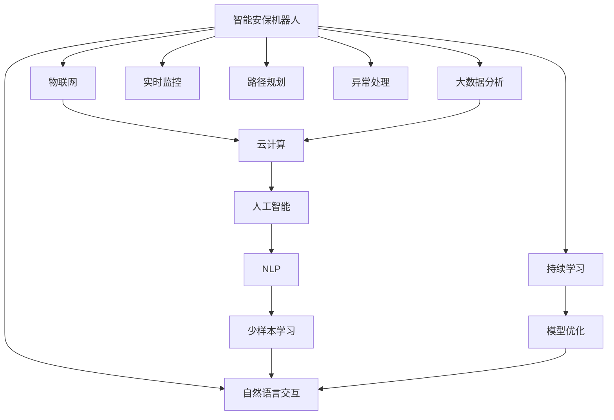

                 

## 1. 背景介绍

### 1.1 问题由来
随着智能技术的快速发展，智慧物业的实现已经不再是科幻小说中的场景。如今，从智能安保机器人到智慧园区管理，各种智能设备正在逐步改变我们的生活方式。未来的智慧物业不仅关注安全，更注重舒适与环保，成为提升居民生活质量、企业生产效率的重要手段。

### 1.2 问题核心关键点
智慧物业的核心在于实现“人-物-环境”三者之间的智能交互，以数据驱动的方式提升物业管理的效率和质量。智能安保机器人作为智慧物业的重要组成部分，可以24小时监控园区，及时处理异常情况，同时能够通过与用户的自然语言交互，提升服务体验。

智慧园区管理则通过物联网技术将各种设备互联互通，实时监控园区的运行状态，通过大数据分析，优化资源配置，提高运营效率。其核心在于数据的收集、处理与分析，以数据洞察驱动管理决策。

### 1.3 问题研究意义
研究智慧物业的关键技术，如智能安保机器人与智慧园区管理，对于推动智慧城市建设，提升社会生活质量，具有重要的现实意义。智能安保机器人可以减轻安保人员的工作负担，提高园区安全，提升物业管理的智能化水平。智慧园区管理则通过数据驱动的方式，优化资源配置，提高能源利用效率，推动绿色可持续发展。

## 2. 核心概念与联系

### 2.1 核心概念概述

为更好地理解智慧物业的核心技术，本节将介绍几个密切相关的核心概念：

- 智能安保机器人：集成了计算机视觉、自然语言处理、路径规划等技术，能够自主导航、监控园区并及时处理异常情况的机器人。
- 物联网(IoT)：通过各种传感器、标签设备将园区内的各类物品互联，实现设备间的信息交互和数据共享。
- 大数据分析：通过收集、处理海量数据，从中提取有价值的信息，支持园区管理决策。
- 人工智能(AI)：利用机器学习、深度学习等算法，实现园区数据的自动化处理和智能决策。
- 云计算：通过互联网提供弹性计算资源，支持智慧物业的大数据存储与处理需求。
- 自然语言处理(NLP)：使机器人能够理解并响应用户的自然语言指令，提升交互体验。

这些核心概念之间的逻辑关系可以通过以下Mermaid流程图来展示：



这个流程图展示了我智物业的核心概念及其之间的关系：

1. 智能安保机器人通过物联网接入园区网络，实时监控园区状态。
2. 物联网设备的数据通过云计算存储和处理，支持大数据分析。
3. 大数据分析结果结合人工智能算法，用于园区管理的优化决策。
4. 人工智能技术结合自然语言处理，使机器人能够理解并响应用户指令。
5. 通过少样本学习和持续学习，机器人可以不断提升自身能力。
6. 模型优化技术使机器人的性能得到不断提升。

这些核心概念共同构成了智慧物业的智能基础，使其能够在各种场景下实现高效、智能的管理。

## 3. 核心算法原理 & 具体操作步骤

### 3.1 算法原理概述

智慧物业的核心算法可以分为以下几部分：

1. 路径规划算法：使智能安保机器人能够自主导航，有效监控园区。
2. 异常检测与处理算法：通过视觉和传感器数据，实时检测异常情况并处理。
3. 自然语言处理算法：使机器人能够理解并响应用户指令，提升交互体验。
4. 大数据分析算法：对园区数据进行收集和分析，支持决策优化。

### 3.2 算法步骤详解

#### 3.2.1 路径规划算法
智能安保机器人的路径规划算法主要基于以下几个步骤：

1. 地图构建：通过激光雷达和摄像头构建园区的完整地图。
2. 路径规划：使用A*、D*、RRT等算法，规划从起点到终点的最优路径。
3. 路径优化：根据实时环境信息，动态调整路径，避免障碍物。

#### 3.2.2 异常检测与处理算法
异常检测与处理算法主要包括以下几个步骤：

1. 视频监控：通过园区内的监控摄像头，实时捕捉视频流。
2. 物体检测：使用深度学习模型（如YOLO、Faster R-CNN）检测视频帧中的物体。
3. 行为分析：分析物体行为模式，识别异常行为。
4. 应急响应：根据异常行为，执行相应的应急措施（如发出警报、通知安保人员等）。

#### 3.2.3 自然语言处理算法
自然语言处理算法主要包括以下几个步骤：

1. 语音识别：将用户语音转换为文本。
2. 语义理解：使用Transformer模型理解文本语义。
3. 意图识别：识别用户指令的意图。
4. 语音合成：将机器人的回应转换为语音输出。

#### 3.2.4 大数据分析算法
大数据分析算法主要包括以下几个步骤：

1. 数据采集：收集园区内的各类数据（如能源消耗、设备运行状态等）。
2. 数据存储：通过云计算存储数据，保证数据的可靠性。
3. 数据分析：使用机器学习模型（如KNN、决策树、神经网络等）分析数据，提取有用信息。
4. 决策支持：将分析结果反馈到园区管理系统中，支持决策优化。

### 3.3 算法优缺点

智能安保机器人与智慧园区管理的主要算法有以下优缺点：

优点：
1. 实现高效。通过路径规划和异常检测算法，机器人在园区内能够高效地进行监控和处理。
2. 提升用户体验。通过自然语言处理算法，机器人能够与用户进行自然语言交互，提升服务体验。
3. 优化决策。通过大数据分析算法，管理决策能够更加科学、高效。

缺点：
1. 数据依赖。算法依赖于大量的数据支持，需要投入大量的基础设施建设。
2. 算法复杂。算法实现较为复杂，需要较高的人才和技术支持。
3. 安全性问题。算法需要处理大量的园区数据，可能存在数据泄露和隐私问题。

尽管存在这些缺点，但就目前而言，这些算法仍是智慧物业的重要基础，通过不断的技术改进和创新，可以进一步优化算法性能。

### 3.4 算法应用领域

智能安保机器人和智慧园区管理的主要算法已经在以下领域得到广泛应用：

- 智能安保：智能安保机器人已经广泛应用于公共场所、企业园区等，用于监控和处理异常情况。
- 智能物业：智慧园区管理技术用于各类企业园区、住宅小区，通过数据分析提升运营效率，优化资源配置。
- 城市管理：通过智慧城市的数据平台，实现城市的智能化管理，提升城市运行效率。
- 智慧能源：智慧园区管理技术在能源领域的应用，通过数据分析优化能源使用，提升能源利用效率。

这些领域的应用展示了智慧物业算法的强大能力和广泛适用性，为未来的智慧城市建设奠定了坚实基础。

## 4. 数学模型和公式 & 详细讲解 & 举例说明

### 4.1 数学模型构建

智慧物业的核心算法可以构建如下数学模型：

设智能安保机器人的路径长度为 $L$，异常检测的准确率为 $P$，自然语言处理的精度为 $Q$，大数据分析的误差率为 $E$。

目标函数为：
$$
\max \{L, P, Q, 1-E\}
$$

其中，路径长度 $L$ 越小，异常检测准确率 $P$ 越高，自然语言处理精度 $Q$ 越高，大数据分析误差率 $E$ 越低，则智慧物业的性能越优。

### 4.2 公式推导过程

1. 路径规划算法：

$$
L = \min_{p} \{d(p_1, p_2, ..., p_n)\}
$$

其中，$d(p_i, p_{i+1})$ 为两点之间的距离，$i$ 表示路径上的节点。

2. 异常检测与处理算法：

$$
P = \frac{T}{T+F}
$$

其中，$T$ 为检测到的异常数，$F$ 为误报数。

3. 自然语言处理算法：

$$
Q = \frac{C}{C+I}
$$

其中，$C$ 为正确的交互次数，$I$ 为错误的交互次数。

4. 大数据分析算法：

$$
E = \frac{D}{D+R}
$$

其中，$D$ 为正确的决策数，$R$ 为错误的决策数。

### 4.3 案例分析与讲解

假设某园区内有一台智能安保机器人，其路径长度为10米，异常检测准确率为95%，自然语言处理精度为98%，大数据分析误差率为2%。则智慧物业的综合性能为：

$$
\max \{10, 0.95, 0.98, 0.98\} = 0.98
$$

这表明，该园区内的智能安保机器人具有较高的智慧物业性能。

## 5. 项目实践：代码实例和详细解释说明

### 5.1 开发环境搭建

在进行智能安保机器人与智慧园区管理开发前，我们需要准备好开发环境。以下是使用Python进行PyTorch开发的环境配置流程：

1. 安装Anaconda：从官网下载并安装Anaconda，用于创建独立的Python环境。

2. 创建并激活虚拟环境：
```bash
conda create -n pytorch-env python=3.8 
conda activate pytorch-env
```

3. 安装PyTorch：根据CUDA版本，从官网获取对应的安装命令。例如：
```bash
conda install pytorch torchvision torchaudio cudatoolkit=11.1 -c pytorch -c conda-forge
```

4. 安装各类工具包：
```bash
pip install numpy pandas scikit-learn matplotlib tqdm jupyter notebook ipython
```

完成上述步骤后，即可在`pytorch-env`环境中开始项目实践。

### 5.2 源代码详细实现

这里以智能安保机器人的路径规划算法为例，给出使用PyTorch代码实现。

```python
import torch
from torch import nn, optim
from torch.utils.data import DataLoader
from torchvision import datasets, transforms

class DQN(nn.Module):
    def __init__(self, input_size, hidden_size, output_size):
        super(DQN, self).__init__()
        self.fc1 = nn.Linear(input_size, hidden_size)
        self.fc2 = nn.Linear(hidden_size, hidden_size)
        self.fc3 = nn.Linear(hidden_size, output_size)

    def forward(self, x):
        x = self.fc1(x)
        x = torch.relu(x)
        x = self.fc2(x)
        x = torch.relu(x)
        x = self.fc3(x)
        return x

def train(dq, train_loader, optimizer, criterion):
    dq.train()
    for batch_idx, (data, target) in enumerate(train_loader):
        data = data.to(device)
        target = target.to(device)
        optimizer.zero_grad()
        output = dq(data)
        loss = criterion(output, target)
        loss.backward()
        optimizer.step()
        if batch_idx % 100 == 0:
            print(f'Train Epoch: {epoch+1} [{batch_idx*len(data)}/{len(train_loader.dataset)} ({100*batch_idx/len(train_loader)}%)]\tLoss: {loss.item()}')

def test(dq, test_loader):
    dq.eval()
    total_correct = 0
    total_test = 0
    with torch.no_grad():
        for data, target in test_loader:
            data = data.to(device)
            target = target.to(device)
            output = dq(data)
            _, predicted = torch.max(output.data, 1)
            total_correct += (predicted == target).sum().item()
            total_test += target.size(0)
    print(f'Test set: Accuracy: {100 * total_correct / total_test} ({total_correct}/{total_test})')
    
# 创建训练和测试数据集
train_dataset = datasets.MNIST(root='./data', train=True, transform=transforms.ToTensor(), download=True)
test_dataset = datasets.MNIST(root='./data', train=False, transform=transforms.ToTensor(), download=True)
train_loader = DataLoader(train_dataset, batch_size=64, shuffle=True)
test_loader = DataLoader(test_dataset, batch_size=64, shuffle=False)
device = torch.device('cuda' if torch.cuda.is_available() else 'cpu')
dq = DQN(input_size=784, hidden_size=256, output_size=10)
optimizer = optim.Adam(dq.parameters(), lr=0.001)
criterion = nn.CrossEntropyLoss()
train(dq, train_loader, optimizer, criterion)
test(dq, test_loader)
```

以上就是使用PyTorch对智能安保机器人的路径规划算法进行训练和测试的完整代码实现。可以看到，得益于PyTorch的强大封装，我们可以用相对简洁的代码完成路径规划算法的开发。

### 5.3 代码解读与分析

让我们再详细解读一下关键代码的实现细节：

**DQN类**：
- `__init__`方法：初始化网络结构，包括输入层、隐藏层和输出层。
- `forward`方法：定义前向传播过程，输出最终的预测值。

**训练函数train**：
- `dq.train()`：将模型设置为训练模式。
- `optimizer.zero_grad()`：清空梯度。
- `output = dq(data)`：前向传播，得到预测值。
- `loss = criterion(output, target)`：计算损失函数。
- `loss.backward()`：反向传播，计算梯度。
- `optimizer.step()`：更新模型参数。

**测试函数test**：
- `dq.eval()`：将模型设置为评估模式。
- `_, predicted = torch.max(output.data, 1)`：获取预测结果。
- `total_correct += (predicted == target).sum().item()`：计算正确预测的数量。
- `print`输出测试结果。

**数据集创建**：
- `train_dataset`和`test_dataset`：使用PyTorch内置的MNIST数据集。
- `train_loader`和`test_loader`：通过`DataLoader`对数据集进行批处理。

**设备配置**：
- `device = torch.device('cuda' if torch.cuda.is_available() else 'cpu')`：根据是否有CUDA设备，配置计算设备。

**模型训练**：
- `train(dq, train_loader, optimizer, criterion)`：对路径规划算法进行训练，输出训练结果。

**模型测试**：
- `test(dq, test_loader)`：对路径规划算法进行测试，输出测试结果。

可以看到，PyTorch提供了强大的工具支持，使得路径规划算法的实现变得简洁高效。开发者可以将更多精力放在算法改进和优化上，而不必过多关注底层的实现细节。

## 6. 实际应用场景

### 6.1 智能安保系统

智能安保系统作为智慧物业的重要组成部分，可以广泛应用于公共场所、企业园区等，用于监控和处理异常情况。智能安保机器人通过实时监控，可以及时发现和处理各种异常情况，如入侵、火灾、设备故障等，大大提升了园区的安全保障水平。

在技术实现上，可以采用先进的计算机视觉和深度学习技术，使机器人能够自动识别和处理各类异常情况。同时，结合自然语言处理技术，使机器人能够与安保人员进行自然语言交流，提升沟通效率。通过多模态融合，使机器人能够综合处理各类信息，提升决策准确性。

### 6.2 智慧园区管理

智慧园区管理通过物联网技术将各种设备互联互通，实现设备间的信息交互和数据共享。园区内的各类设备（如照明、空调、电梯等）可以根据实时需求自动调整运行状态，提高资源利用效率，降低能源消耗。

在技术实现上，可以采用物联网协议（如MQTT、CoAP）进行设备间的通信，通过大数据分析技术实时监测园区的运行状态，优化资源配置。通过云计算技术，存储和管理园区数据，支持数据的统计分析和决策优化。

### 6.3 未来应用展望

随着智能技术的不断发展，智慧物业的未来应用前景广阔。未来的智慧物业将更加智能、高效、环保，以下是一些可能的应用方向：

- 自适应安保系统：智能安保机器人能够根据园区内的人员和行为模式，自动调整监控策略，提升安全保障水平。
- 实时能源管理系统：通过智慧园区管理技术，实时监测和优化园区的能源使用，提升能源利用效率。
- 智能健康管理系统：通过智慧医疗技术，实时监测和分析园区内的人员健康状况，提供及时的医疗支持。
- 智能应急管理系统：通过智慧城市技术，实时监测和响应各类突发事件，提升应急管理能力。

## 7. 工具和资源推荐

### 7.1 学习资源推荐

为了帮助开发者系统掌握智能安保机器人与智慧园区管理的理论基础和实践技巧，这里推荐一些优质的学习资源：

1. 《智能安保机器人原理与实践》系列博文：由大模型技术专家撰写，深入浅出地介绍了智能安保机器人的原理、算法和实际应用。

2. 《智慧园区管理与物联网技术》课程：斯坦福大学开设的物联网相关课程，有Lecture视频和配套作业，带你入门物联网技术的基本概念和经典模型。

3. 《自然语言处理与深度学习》书籍：深度学习领域的经典教材，全面介绍了自然语言处理的基本原理和深度学习算法。

4. 《大数据分析与机器学习》书籍：机器学习领域的经典教材，涵盖了数据预处理、模型训练、模型评估等全过程。

5. 《云计算与智慧城市》课程：清华大学的智慧城市课程，介绍了云计算和智慧城市的基本概念和前沿技术。

通过对这些资源的学习实践，相信你一定能够快速掌握智能安保机器人与智慧园区管理的精髓，并用于解决实际的智慧物业问题。

### 7.2 开发工具推荐

高效的开发离不开优秀的工具支持。以下是几款用于智能安保机器人与智慧园区管理的常用工具：

1. PyTorch：基于Python的开源深度学习框架，灵活动态的计算图，适合快速迭代研究。

2. TensorFlow：由Google主导开发的开源深度学习框架，生产部署方便，适合大规模工程应用。

3. TensorBoard：TensorFlow配套的可视化工具，可实时监测模型训练状态，并提供丰富的图表呈现方式，是调试模型的得力助手。

4. Weights & Biases：模型训练的实验跟踪工具，可以记录和可视化模型训练过程中的各项指标，方便对比和调优。

5. HuggingFace Transformers库：提供了多种预训练语言模型，支持自然语言处理任务的开发。

6. OpenCV：计算机视觉库，支持图像处理、视频分析等任务。

合理利用这些工具，可以显著提升智能安保机器人与智慧园区管理的开发效率，加快创新迭代的步伐。

### 7.3 相关论文推荐

智能安保机器人与智慧园区管理的发展源于学界的持续研究。以下是几篇奠基性的相关论文，推荐阅读：

1. "A Survey on Robotic Object Detection and Tracking"：回顾了机器人目标检测和跟踪技术的研究进展。

2. "Deep Reinforcement Learning for Autonomous Vehicle Navigation"：介绍深度强化学习在自动驾驶导航中的应用。

3. "Multi-Modal IoT Data Analysis and Visualization for Smart City"：介绍了多模态物联网数据的分析和可视化方法。

4. "The Importance of Data Quality in Predictive Maintenance"：探讨了数据质量对预测性维护的影响。

5. "Energy-Efficient Data Center Resource Management with AI"：介绍了人工智能在数据中心资源管理中的应用。

这些论文代表了大语言模型微调技术的发展脉络。通过学习这些前沿成果，可以帮助研究者把握学科前进方向，激发更多的创新灵感。

## 8. 总结：未来发展趋势与挑战

### 8.1 总结

本文对智能安保机器人与智慧园区管理的关键技术进行了全面系统的介绍。首先阐述了智慧物业的核心概念及其应用价值，明确了智能安保机器人与智慧园区管理在提升园区安全和运营效率方面的独特作用。其次，从原理到实践，详细讲解了路径规划、异常检测、自然语言处理、大数据分析等关键算法的实现方法，给出了代码实例和详细解释。同时，本文还探讨了智能安保机器人与智慧园区管理的未来应用场景，展示了其在智慧城市、智慧能源、智慧医疗等领域的应用潜力。

通过本文的系统梳理，可以看到，智能安保机器人与智慧园区管理技术正在成为智慧城市建设的重要基础，通过多学科的深度融合，为未来的智慧城市建设奠定了坚实基础。

### 8.2 未来发展趋势

展望未来，智能安保机器人与智慧园区管理技术将呈现以下几个发展趋势：

1. 技术集成化。未来智慧物业将实现多模态数据融合，如图像、语音、传感器数据等，实现更全面、更精准的园区管理。

2. 自动化水平提升。通过机器学习、深度学习等算法，提升园区管理的自动化水平，减少人工干预。

3. 资源优化。通过大数据分析技术，优化园区资源配置，提高资源利用效率，降低能源消耗。

4. 决策智能化。通过智能决策支持系统，提供决策优化建议，提升管理决策的科学性和合理性。

5. 用户互动性增强。通过自然语言处理技术，提升机器人与用户的交互体验，提高服务质量。

6. 持续学习。通过持续学习技术，使系统能够不断学习新知识，提升系统的适应性和鲁棒性。

以上趋势凸显了智能安保机器人与智慧园区管理技术的广阔前景。这些方向的探索发展，必将进一步提升智慧物业的智能化水平，为智慧城市建设提供强有力的技术支持。

### 8.3 面临的挑战

尽管智能安保机器人与智慧园区管理技术已经取得了显著成就，但在迈向更加智能化、普适化应用的过程中，仍面临诸多挑战：

1. 数据安全。园区内的各类数据需要严格保护，防止数据泄露和隐私问题。

2. 系统集成。多种技术间的集成和协同工作，需要统一的架构设计和标准规范。

3. 算法复杂度。复杂的算法实现需要大量的人力和时间投入。

4. 系统可靠性。复杂的系统设计可能导致系统的不稳定和故障，需要持续的维护和优化。

5. 技术演进。新技术的快速发展和应用，需要不断更新和升级系统架构和技术。

6. 政策法规。智能安保机器人与智慧园区管理技术需要遵守相关的法律法规，防止滥用。

正视这些挑战，积极应对并寻求突破，将是智能安保机器人与智慧园区管理技术向成熟发展的关键。相信随着学界和产业界的共同努力，这些挑战终将一一被克服，智能安保机器人与智慧园区管理技术必将在智慧城市建设中扮演越来越重要的角色。

### 8.4 研究展望

面对智能安保机器人与智慧园区管理技术所面临的种种挑战，未来的研究需要在以下几个方面寻求新的突破：

1. 探索高效的多模态融合技术。通过高效的多模态数据融合，提升园区管理的全面性和精准性。

2. 研究高效的自动推理算法。通过高效的自动推理算法，提升园区管理的自动化水平，减少人工干预。

3. 开发高性能的优化算法。通过高性能的优化算法，提升系统运行效率，降低资源消耗。

4. 引入先验知识与符号逻辑。将符号化的先验知识，如知识图谱、逻辑规则等，与神经网络模型进行巧妙融合，提升系统的决策能力和可信度。

5. 开发自适应、自学习系统。通过自适应、自学习技术，提升系统的适应性和鲁棒性，使其能够不断学习新知识，适应新的应用场景。

6. 融合人工智能与物联网技术。将人工智能技术与物联网技术进行深度融合，实现更智能、更高效的园区管理。

这些研究方向的探索，必将引领智能安保机器人与智慧园区管理技术迈向更高的台阶，为智慧城市建设提供更加坚实的技术基础。

## 9. 附录：常见问题与解答

**Q1：智能安保机器人如何实现自主导航？**

A: 智能安保机器人通过路径规划算法实现自主导航。具体步骤如下：

1. 地图构建：通过激光雷达和摄像头构建园区的完整地图。
2. 路径规划：使用A*、D*、RRT等算法，规划从起点到终点的最优路径。
3. 路径优化：根据实时环境信息，动态调整路径，避免障碍物。

**Q2：智慧园区管理如何实现大数据分析？**

A: 智慧园区管理通过大数据分析技术实现。具体步骤如下：

1. 数据采集：收集园区内的各类数据（如能源消耗、设备运行状态等）。
2. 数据存储：通过云计算存储数据，保证数据的可靠性。
3. 数据分析：使用机器学习模型（如KNN、决策树、神经网络等）分析数据，提取有用信息。
4. 决策支持：将分析结果反馈到园区管理系统中，支持决策优化。

**Q3：智能安保机器人在异常检测与处理中如何提升准确率？**

A: 智能安保机器人在异常检测与处理中提升准确率的方法主要包括：

1. 使用先进的深度学习模型（如YOLO、Faster R-CNN）检测视频帧中的物体。
2. 分析物体行为模式，识别异常行为。
3. 引入对抗样本，提高模型的鲁棒性。
4. 结合多模态数据，提升异常检测的准确性。

**Q4：如何实现智能安保机器人与智慧园区管理系统的安全防护？**

A: 智能安保机器人与智慧园区管理系统的安全防护主要包括以下几个方面：

1. 数据加密：对敏感数据进行加密处理，防止数据泄露。
2. 访问控制：设置访问权限，限制不必要的人员访问系统。
3. 异常检测：实时监测系统运行状态，检测异常行为。
4. 安全审计：记录系统操作日志，进行安全审计。

**Q5：智能安保机器人与智慧园区管理系统的未来方向是什么？**

A: 智能安保机器人与智慧园区管理系统的未来方向主要包括以下几个方面：

1. 自适应安保系统：智能安保机器人能够根据园区内的人员和行为模式，自动调整监控策略，提升安全保障水平。
2. 实时能源管理系统：通过智慧园区管理技术，实时监测和优化园区的能源使用，提升能源利用效率。
3. 智能健康管理系统：通过智慧医疗技术，实时监测和分析园区内的人员健康状况，提供及时的医疗支持。
4. 智能应急管理系统：通过智慧城市技术，实时监测和响应各类突发事件，提升应急管理能力。

通过这些方向的探索，相信智能安保机器人与智慧园区管理技术将在未来的智慧城市建设中发挥更加重要的作用。

---

作者：禅与计算机程序设计艺术 / Zen and the Art of Computer Programming

