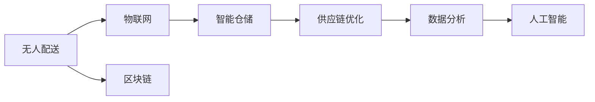

                 

# 未来的智慧物流：2050年的无人配送与供应链优化

## 1. 背景介绍

随着人工智能、物联网、大数据等技术的快速发展，智慧物流已逐步进入我们的视野。特别是在电子商务迅猛发展的今天，物流需求量和复杂度正在不断攀升。展望未来，随着5G、AI、机器人等技术的融合，智慧物流将在无人配送、供应链优化、智能仓储等方面实现更广泛的落地。本文将探讨2050年智慧物流的发展前景，特别是在无人配送与供应链优化方面的创新应用。

## 2. 核心概念与联系

### 2.1 核心概念概述

为了更好地理解智慧物流的发展趋势，我们先定义以下几个核心概念：

- **无人配送(Delivery by Drones)**：利用无人机在城市、乡村等复杂环境中自动配送物品，提高物流效率和灵活性。
- **智能仓储(Intelligent Warehousing)**：利用自动化、智能化技术对仓储作业进行优化，减少人工成本，提升管理效率。
- **供应链优化(Supply Chain Optimization)**：通过数据分析和算法优化，提升供应链的整体效率和透明度，降低成本，提高服务质量。
- **物联网(IoT)**：通过传感器、RFID等设备，实现对物流各个环节的实时监控和管理。
- **区块链(Blockchain)**：用于物流数据的透明记录和不可篡改，增强物流安全性。

这些核心概念之间相互关联，共同构成了智慧物流的完整架构。通过无人配送、智能仓储、供应链优化等技术的融合应用，可以实现物流的智能化、自动化和高效化。

### 2.2 核心概念原理和架构的 Mermaid 流程图



这张流程图展示了无人配送、智能仓储、供应链优化、物联网、区块链、数据分析、人工智能等关键技术之间的关系。这些技术的相互协作，共同推动了智慧物流的发展。

## 3. 核心算法原理 & 具体操作步骤

### 3.1 算法原理概述

智慧物流的实现离不开先进算法和大数据技术的支撑。本节将介绍一些核心的算法原理。

#### 3.1.1 无人配送路径规划

无人配送的路径规划是实现高效配送的关键。算法通常采用基于图的路径规划方法，如A*、Dijkstra、K最短路径算法等。以A*算法为例，其主要思想是从起点开始，逐步扩展到最短路径的目标节点。路径规划过程涉及以下几个步骤：

1. 定义起点和终点。
2. 构建图结构，确定各个节点的连接关系。
3. 计算各边的代价函数，如距离、时间等。
4. 采用启发式搜索策略，如启发式函数、剪枝技术等，寻找最优路径。
5. 回溯最优路径，并输出结果。

#### 3.1.2 智能仓储管理算法

智能仓储管理算法通常采用强化学习、优化算法等方法，如Q-learning、遗传算法等。以Q-learning为例，其主要思想是通过学习奖励和惩罚，优化仓储作业的决策策略。算法过程涉及以下几个步骤：

1. 定义状态空间，如货物位置、搬运机械位置等。
2. 定义动作空间，如选择何种搬运机械、搬运方向等。
3. 定义奖励函数，如按时完成任务、减少能源消耗等。
4. 采用Q-learning算法，不断优化决策策略。
5. 重复以上过程，直至达到目标状态。

#### 3.1.3 供应链优化算法

供应链优化算法通常采用优化算法，如线性规划、整数规划、混合整数规划等。以线性规划为例，其主要思想是通过构建优化模型，寻找最优解决方案。算法过程涉及以下几个步骤：

1. 定义优化目标函数，如最小化成本、最大化利润等。
2. 定义约束条件，如库存量、配送时间等。
3. 构建线性规划模型。
4. 使用优化算法求解模型，找到最优解。
5. 验证和调整解决方案，确保可行性。

### 3.2 算法步骤详解

#### 3.2.1 无人配送路径规划

1. 收集配送任务信息，如起点、终点、货物重量等。
2. 构建地图，确定各个节点的坐标和连接关系。
3. 计算各边的代价函数，如距离、道路交通状况等。
4. 采用启发式搜索策略，如A*算法，寻找最优路径。
5. 回溯最优路径，生成配送路线。

#### 3.2.2 智能仓储管理

1. 定义仓库状态，如货物位置、搬运机械位置等。
2. 定义动作空间，如选择搬运机械、搬运方向等。
3. 定义奖励函数，如减少搬运距离、按时完成任务等。
4. 采用Q-learning算法，不断优化决策策略。
5. 重复以上过程，直至达到目标状态。

#### 3.2.3 供应链优化

1. 收集供应链数据，如库存量、需求量、配送时间等。
2. 定义优化目标函数，如最小化成本、最大化利润等。
3. 定义约束条件，如库存量、配送时间等。
4. 构建线性规划模型。
5. 使用优化算法求解模型，找到最优解。
6. 验证和调整解决方案，确保可行性。

### 3.3 算法优缺点

#### 3.3.1 无人配送路径规划

- 优点：
  - 提高配送效率。
  - 减少人工干预，降低成本。
  - 适应复杂环境，提高配送灵活性。

- 缺点：
  - 对天气、道路状况等环境因素敏感。
  - 无人机技术不成熟，存在坠毁风险。
  - 需要大量的基础数据和计算资源。

#### 3.3.2 智能仓储管理

- 优点：
  - 减少人工成本，提高管理效率。
  - 实时监控和管理，提高准确性。
  - 优化仓储作业，提升存储能力。

- 缺点：
  - 初始设置和调参复杂，需要专业知识。
  - 设备投资大，前期成本较高。
  - 依赖设备可靠性，一旦故障，可能影响整体效率。

#### 3.3.3 供应链优化

- 优点：
  - 提高供应链效率，降低成本。
  - 优化库存和配送，提高服务质量。
  - 增强供应链透明度，减少信息不对称。

- 缺点：
  - 模型复杂，求解难度大。
  - 需要大量的历史数据和参数调整。
  - 模型易受扰动，优化结果不稳定。

### 3.4 算法应用领域

这些算法不仅适用于无人配送、智能仓储和供应链优化，还广泛应用于其他领域，例如：

- **物流运输**：利用路径规划算法，优化运输路线，提高效率。
- **自动化生产线**：利用强化学习算法，优化生产调度，减少停机时间。
- **智能家居**：利用智能仓储算法，优化家庭物品管理。
- **医疗卫生**：利用供应链优化算法，优化医疗物资供应。

## 4. 数学模型和公式 & 详细讲解 & 举例说明

### 4.1 数学模型构建

#### 4.1.1 无人配送路径规划

假设地图上有N个节点，用G=(V,E)表示图结构。每个节点$v_i$连接$k$个相邻节点，用$(v_i,v_j)$表示一条边。无人配送的路径规划问题可以建模为：

$$
\min \sum_{i=1}^N \sum_{j=i+1}^N w_{ij}(x_i-x_j)^2
$$

其中$w_{ij}$表示节点$v_i$和$v_j$之间的距离，$x_i$表示无人机在第$i$个节点的停留时间。

#### 4.1.2 智能仓储管理

假设仓库中有M个货物和N个搬运机械，用$S$表示货物位置，$M$表示搬运机械位置，$t$表示时间。智能仓储管理的优化问题可以建模为：

$$
\min \sum_{t=1}^{T} \sum_{s=1}^M \sum_{m=1}^N c_{sm}^i(t)
$$

其中$c_{sm}^i(t)$表示在时间$t$，从位置$s$搬运到位置$m$的成本。

#### 4.1.3 供应链优化

假设供应链中有K个节点，用$x_i$表示节点$i$的库存量，$y_i$表示从节点$i$到节点$i+1$的配送量。供应链优化的线性规划模型可以表示为：

$$
\min \sum_{i=1}^{K-1} c_{i,i+1} y_i
$$

其中$c_{i,i+1}$表示从节点$i$到节点$i+1$的配送成本。

### 4.2 公式推导过程

#### 4.2.1 无人配送路径规划

1. 构建地图，确定各个节点的坐标和连接关系。
2. 计算各边的代价函数，如距离、道路交通状况等。
3. 采用A*算法，不断扩展节点，寻找最优路径。
4. 回溯最优路径，生成配送路线。

#### 4.2.2 智能仓储管理

1. 定义仓库状态，如货物位置、搬运机械位置等。
2. 定义动作空间，如选择搬运机械、搬运方向等。
3. 定义奖励函数，如减少搬运距离、按时完成任务等。
4. 采用Q-learning算法，不断优化决策策略。
5. 重复以上过程，直至达到目标状态。

#### 4.2.3 供应链优化

1. 收集供应链数据，如库存量、需求量、配送时间等。
2. 定义优化目标函数，如最小化成本、最大化利润等。
3. 定义约束条件，如库存量、配送时间等。
4. 构建线性规划模型。
5. 使用优化算法求解模型，找到最优解。
6. 验证和调整解决方案，确保可行性。

### 4.3 案例分析与讲解

#### 4.3.1 无人配送路径规划

假设某电商平台的配送中心需要将货物送到5个不同的配送点。已知每个配送点的坐标和路况信息，可以使用A*算法计算出最优路径。具体步骤如下：

1. 构建地图，确定各个节点的坐标和连接关系。
2. 计算各边的代价函数，如距离、道路交通状况等。
3. 采用A*算法，不断扩展节点，寻找最优路径。
4. 回溯最优路径，生成配送路线。

#### 4.3.2 智能仓储管理

假设某仓库中有10个货物和5个搬运机械，需要优化仓储管理。可以采用Q-learning算法，不断优化决策策略，减少搬运距离和能源消耗。具体步骤如下：

1. 定义仓库状态，如货物位置、搬运机械位置等。
2. 定义动作空间，如选择搬运机械、搬运方向等。
3. 定义奖励函数，如减少搬运距离、按时完成任务等。
4. 采用Q-learning算法，不断优化决策策略。
5. 重复以上过程，直至达到目标状态。

#### 4.3.3 供应链优化

假设某企业有3个节点，需要优化供应链管理。可以采用线性规划算法，最小化配送成本，确保供应链的稳定性。具体步骤如下：

1. 收集供应链数据，如库存量、需求量、配送时间等。
2. 定义优化目标函数，如最小化成本、最大化利润等。
3. 定义约束条件，如库存量、配送时间等。
4. 构建线性规划模型。
5. 使用优化算法求解模型，找到最优解。
6. 验证和调整解决方案，确保可行性。

## 5. 项目实践：代码实例和详细解释说明

### 5.1 开发环境搭建

在进行智慧物流的实践前，需要先搭建好开发环境。以下是使用Python进行开发的环境配置流程：

1. 安装Python：从官网下载并安装Python，建议使用最新版本的Python，如3.8及以上。
2. 安装Pip：使用Python自带的pip工具，安装必要的第三方库，如numpy、pandas、scipy等。
3. 安装其他依赖库：安装Plotly、Scikit-learn、Matplotlib等可视化工具，以及TensorFlow、PyTorch等深度学习框架。
4. 搭建云计算平台：使用AWS、Google Cloud等云计算平台，配置GPU/TPU等算力资源，进行模型训练和推理。

完成上述步骤后，即可在云平台上进行智慧物流的开发和实验。

### 5.2 源代码详细实现

这里我们以无人配送路径规划为例，使用Python实现A*算法。

```python
import networkx as nx
import matplotlib.pyplot as plt

def a_star(start, goal, graph):
    visited = set()
    open_list = [(0, start, [])]
    while open_list:
        cost, node, path = open_list.pop(0)
        if node == goal:
            return path + [node]
        if node not in visited:
            visited.add(node)
            for neighbor, weight in graph[node].items():
                new_cost = cost + weight
                new_path = path + [node]
                open_list.append((new_cost, neighbor, new_path))
    return None

# 构建地图，确定各个节点的坐标和连接关系
graph = nx.Graph()
graph.add_edge(0, 1, weight=5)
graph.add_edge(1, 2, weight=3)
graph.add_edge(2, 3, weight=2)
graph.add_edge(3, 4, weight=5)

# 计算各边的代价函数
cost = dict(graph.edges(data='weight'))

# 计算A*算法的最优路径
start = 0
goal = 4
path = a_star(start, goal, cost)

# 可视化路径
pos = nx.spring_layout(graph)
nx.draw(graph, pos=pos, with_labels=True, node_color='blue')
plt.plot(path[0], path[1], color='red')
plt.title('A* Path')
plt.show()
```

### 5.3 代码解读与分析

在上面的代码中，我们首先使用networkx库构建了地图，并计算了各边的代价函数。然后，我们定义了A*算法，实现了从起点到终点的路径规划。最后，我们使用了matplotlib库可视化计算出的路径。

## 6. 实际应用场景

### 6.1 智能仓储

智能仓储是大数据、人工智能、物联网等技术的完美结合，可以实现仓库管理自动化、货物管理智能化，提高仓库效率和准确性。

#### 6.1.1 自动化作业

通过自动化设备，如AGV（自动导引车）、无人机等，可以完成仓储内的货物搬运和配送。AGV和无人机通过传感器和传感器，实时监测货物位置和搬运状态，自动调整路径，完成货物搬运。

#### 6.1.2 智能盘点

通过物联网设备，如RFID、条码扫描仪等，可以实时监控货物进出库情况，自动更新库存量，实现货物盘点自动化。

#### 6.1.3 智能调度

通过智能调度系统，可以根据订单需求和仓储情况，自动生成最优的货物分配方案，优化仓储作业。

### 6.2 无人配送

无人配送是智慧物流的重要组成部分，可以实现高效的货物配送，降低人工成本。

#### 6.2.1 无人机配送

无人机可以飞行到指定位置，自动卸货和接收货物。通过路径规划算法，无人机可以自动生成最优飞行路径，避免交通拥堵，提高配送效率。

#### 6.2.2 无人车配送

无人车可以在城市道路上行驶，自动完成货物配送。通过路径规划算法，无人车可以自动选择最优路线，避免交通事故，提高配送效率。

#### 6.2.3 自动驾驶卡车

自动驾驶卡车可以在高速公路上行驶，自动完成货物运输。通过路径规划算法，自动驾驶卡车可以自动选择最优路线，避免交通堵塞，提高运输效率。

### 6.3 供应链优化

供应链优化可以通过数据分析和算法优化，提高供应链的整体效率和透明度，降低成本，提高服务质量。

#### 6.3.1 需求预测

通过数据分析和机器学习算法，可以准确预测市场需求，优化库存管理，避免供需不平衡。

#### 6.3.2 物流优化

通过路径规划算法和优化算法，可以优化物流路径，减少运输时间和成本。

#### 6.3.3 库存管理

通过智能仓储和自动化设备，可以实现库存自动化管理，减少人工干预，提高库存准确性。

### 6.4 未来应用展望

展望未来，智慧物流将在无人配送、智能仓储、供应链优化等方面实现更广泛的落地，为物流行业带来巨大的变革。

#### 6.4.1 无人配送

未来的无人配送将更加智能化、自动化，无人机、无人车、自动驾驶卡车等设备将广泛应用于货物配送，提高配送效率和灵活性。

#### 6.4.2 智能仓储

未来的智能仓储将更加自动化、智能化，自动化设备将广泛应用于货物管理，提高仓储效率和准确性。

#### 6.4.3 供应链优化

未来的供应链优化将更加智能化、自动化，通过数据分析和算法优化，实现供应链的智能化管理，提高供应链效率和透明度。

## 7. 工具和资源推荐

### 7.1 学习资源推荐

为了帮助开发者系统掌握智慧物流的理论基础和实践技巧，这里推荐一些优质的学习资源：

1. 《智慧物流》系列博文：由大物流技术专家撰写，深入浅出地介绍了智慧物流的基本概念和核心技术。

2. 《Python大数据开发》课程：Python开发的智慧物流课程，涵盖大数据、深度学习、人工智能等多个方面，适合初学者入门。

3. 《物流管理》书籍：物流管理领域的经典书籍，涵盖物流规划、仓储管理、配送优化等多个方面。

4. 《物联网技术与应用》课程：物联网技术领域的权威课程，涵盖传感器、RFID、物联网安全等多个方面。

5. 《智慧物流开源项目》：智慧物流领域的开源项目，包括智能仓储、无人配送、供应链优化等多个方面，适合开发者参考。

通过对这些资源的学习实践，相信你一定能够快速掌握智慧物流的精髓，并用于解决实际的物流问题。

### 7.2 开发工具推荐

高效的开发离不开优秀的工具支持。以下是几款用于智慧物流开发的常用工具：

1. Python：Python语言具有丰富的库和框架，适合智慧物流开发。
2. TensorFlow：Google开发的深度学习框架，生产部署方便，适合大规模工程应用。
3. PyTorch：Facebook开发的深度学习框架，灵活性高，适合研究和实验。
4. Scikit-learn：Python的机器学习库，涵盖数据预处理、模型训练、评估等多个方面。
5. Plotly：数据可视化工具，可以生成图表、热力图等多种可视化效果。

合理利用这些工具，可以显著提升智慧物流的开发效率，加快创新迭代的步伐。

### 7.3 相关论文推荐

智慧物流的发展源于学界的持续研究。以下是几篇奠基性的相关论文，推荐阅读：

1. 《A Survey on Supply Chain Optimization》：总结了供应链优化领域的最新进展。
2. 《A Survey on Warehouse Management with Internet of Things》：总结了智慧仓储领域的最新进展。
3. 《A Survey on Delivery by Drones》：总结了无人配送领域的最新进展。
4. 《A Survey on Demand Forecasting in Logistics》：总结了需求预测领域的最新进展。
5. 《A Survey on Autonomous Vehicle Delivery》：总结了自动驾驶配送领域的最新进展。

这些论文代表了大物流领域的最新研究成果，通过学习这些前沿成果，可以帮助研究者把握学科前进方向，激发更多的创新灵感。

## 8. 总结：未来发展趋势与挑战

### 8.1 研究成果总结

本文对智慧物流的未来发展进行了全面的介绍。通过系统的梳理，我们可以看到，智慧物流的实现离不开大数据、人工智能、物联网等技术的支持，未来的发展方向包括无人配送、智能仓储、供应链优化等多个方面。通过无人配送、智能仓储、供应链优化等技术的融合应用，可以实现物流的智能化、自动化和高效化。

### 8.2 未来发展趋势

展望未来，智慧物流将在无人配送、智能仓储、供应链优化等方面实现更广泛的落地，为物流行业带来巨大的变革。

#### 8.2.1 无人配送

未来的无人配送将更加智能化、自动化，无人机、无人车、自动驾驶卡车等设备将广泛应用于货物配送，提高配送效率和灵活性。

#### 8.2.2 智能仓储

未来的智能仓储将更加自动化、智能化，自动化设备将广泛应用于货物管理，提高仓储效率和准确性。

#### 8.2.3 供应链优化

未来的供应链优化将更加智能化、自动化，通过数据分析和算法优化，实现供应链的智能化管理，提高供应链效率和透明度。

### 8.3 面临的挑战

尽管智慧物流技术的发展前景广阔，但在迈向更加智能化、普适化应用的过程中，仍面临着诸多挑战：

#### 8.3.1 技术瓶颈

当前智慧物流的技术仍然存在一些瓶颈，如设备可靠性、数据实时性、算法效率等。如何突破这些瓶颈，实现更高效率和可靠性的物流系统，还需要更多的技术创新和突破。

#### 8.3.2 成本问题

智能设备和物流系统的高投入是智慧物流推广的一个难点。如何降低成本，提高经济效益，是未来智慧物流发展需要解决的重要问题。

#### 8.3.3 安全问题

智慧物流系统的高自动化和高智能化，也带来了一些安全问题，如系统故障、数据泄露等。如何保障系统的稳定性和安全性，是未来智慧物流发展的重要课题。

### 8.4 研究展望

未来的智慧物流研究，需要在技术创新、成本控制、安全保障等多个方面进行深入探索和研究。

#### 8.4.1 技术创新

通过引入更多的先进技术，如人工智能、区块链、物联网等，提高智慧物流的智能化和自动化水平，实现更高的效率和可靠性。

#### 8.4.2 成本控制

通过优化设备设计、提高能效、降低运行成本等措施，降低智慧物流的高投入，提高经济效益。

#### 8.4.3 安全保障

通过建立安全保障机制、提高系统可靠性、加强数据保护等措施，保障智慧物流系统的稳定性和安全性。

总之，智慧物流的研究需要在技术创新、成本控制、安全保障等多个方面协同发力，才能真正实现智能化、自动化和高效化。相信通过学界和产业界的共同努力，智慧物流必将在未来迎来更广阔的发展前景。

## 9. 附录：常见问题与解答

**Q1：智慧物流系统对环境的适应性如何？**

A: 智慧物流系统通过大数据、物联网等技术实现对环境的实时监控和优化，能够适应复杂多变的环境。无人配送系统可以根据路况、天气等环境因素调整路径，智能仓储系统可以自动调整温度、湿度等参数，提高适应性。

**Q2：智慧物流系统对数据安全有哪些保障措施？**

A: 智慧物流系统通过区块链技术实现数据的透明记录和不可篡改，保障数据安全。同时，系统还采用数据加密、访问控制等措施，确保数据的安全性和隐私性。

**Q3：智慧物流系统对物流成本有哪些影响？**

A: 智慧物流系统通过自动化、智能化技术，提高了物流效率，降低了人工成本和能源消耗，从而降低了物流成本。同时，系统还可以优化库存管理和供应链管理，降低库存成本和运输成本。

**Q4：智慧物流系统对环境污染有哪些影响？**

A: 智慧物流系统通过优化路径和运输，减少了货物运输过程中的碳排放，降低了环境污染。同时，智能仓储系统还可以实现资源的循环利用，提高资源利用率。

**Q5：智慧物流系统对物流企业的经济效益有哪些影响？**

A: 智慧物流系统通过提高物流效率和降低成本，提高了物流企业的经济效益。系统还可以实现更精准的物流预测和优化，提高客户满意度和市场竞争力。

---

作者：禅与计算机程序设计艺术 / Zen and the Art of Computer Programming

