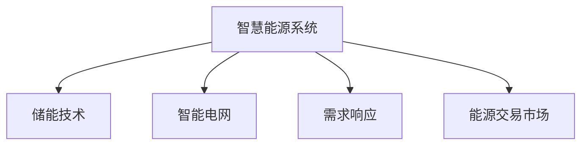

                 

# 未来的智慧能源：2050年的储能技术与智能用电

## 1. 背景介绍

在过去的几十年里，全球能源结构发生了深刻变化，传统的化石燃料逐渐被清洁能源取代，尤其是风能和太阳能等可再生能源的使用日益增加。然而，可再生能源的间歇性和不稳定性，给电网的稳定性和安全性带来了巨大挑战。为了实现2050年的能源目标，需要构建智慧能源系统，利用先进的储能技术和智能用电技术，确保能源供应的连续性和稳定性。

### 1.1 问题由来

当前，全球能源结构面临的主要问题是化石燃料的不可持续性和环境污染问题。一方面，化石燃料的燃烧会释放大量二氧化碳等温室气体，导致气候变化；另一方面，化石燃料的过度依赖使得能源供应面临安全风险，如能源供应中断、能源价格波动等问题。此外，化石燃料的开采和运输还会对生态环境造成破坏。

可再生能源的崛起带来了新的希望。风能、太阳能等可再生能源具有广泛分布和无限供应等优点，但它们也面临间歇性和不稳定性问题，难以稳定供应电力。为了解决这些问题，需要构建高效、智能的储能系统，实现电能的稳定存储和释放，确保能源供应的连续性和可靠性。

### 1.2 问题核心关键点

未来智慧能源系统的核心关键点在于如何高效、智能地存储和利用可再生能源，以及如何实现电能的智能分配和管理。具体来说，需要解决以下几个问题：

1. **储能技术的选择**：如何根据不同应用场景选择合适的储能技术，如锂离子电池、流电池、氢能等。
2. **智能电网的构建**：如何构建高效、灵活、可靠的智能电网，实现电能的智能分配和管理。
3. **需求响应机制的设计**：如何设计合理的用户需求响应机制，激励用户参与电能管理，减少电网负荷峰谷差。
4. **能源交易市场的建立**：如何建立公平、透明的能源交易市场，促进能源资源的合理配置。

解决这些问题，将需要跨学科的合作，包括电力工程、计算机科学、经济学等领域的专家共同努力。

## 2. 核心概念与联系

### 2.1 核心概念概述

为更好地理解未来的智慧能源系统，本节将介绍几个密切相关的核心概念：

- **智慧能源系统(Smart Energy System)**：通过信息技术、物联网技术等手段，实现能源供应的高效、智能管理，提高能源利用效率和系统安全性的能源系统。
- **储能技术(Storage Technology)**：用于存储电能，实现电能的储存、释放和转换的技术。包括锂离子电池、流电池、氢能等。
- **智能电网(Smart Grid)**：基于互联网、物联网等技术，实现电能的智能分配、管理和监控的电网。
- **需求响应(Demand Response)**：通过经济激励、技术手段等，引导用户根据电网的负荷需求调整用电行为，减少电网负荷峰谷差，提高系统效率。
- **能源交易市场(Energy Trading Market)**：为能源买卖双方提供一个公平、透明的交易平台，实现能源资源的合理配置。

这些核心概念之间的逻辑关系可以通过以下Mermaid流程图来展示：



这个流程图展示了大语言模型的核心概念及其之间的关系：

1. 智慧能源系统通过储能技术实现电能的储存和释放。
2. 智能电网实现电能的智能分配和管理。
3. 需求响应机制引导用户调整用电行为。
4. 能源交易市场促进能源资源的合理配置。

这些概念共同构成了未来智慧能源系统的基本框架，通过合理的技术选择和应用，可以构建高效、可靠的能源供应系统。

## 3. 核心算法原理 & 具体操作步骤

### 3.1 算法原理概述

未来的智慧能源系统，其核心算法原理在于通过先进的信息技术和智能算法，实现电能的智能存储、分配和管理。具体来说，包括以下几个方面：

1. **储能技术选择算法**：根据电网的负荷需求、储能技术的特点，选择合适的储能技术进行部署。
2. **智能电网优化算法**：通过智能算法优化电网的运行状态，实现电能的高效分配和管理。
3. **需求响应机制设计算法**：设计合理的经济激励和技术手段，引导用户参与电能管理，减少电网负荷峰谷差。
4. **能源交易市场优化算法**：通过优化算法实现能源交易市场的公平、透明，促进能源资源的合理配置。

### 3.2 算法步骤详解

未来的智慧能源系统构建，主要包括以下几个关键步骤：

**Step 1: 数据收集与处理**
- 收集电网的负荷数据、储能技术的特点数据、用户用电行为数据等，进行预处理和清洗。

**Step 2: 储能技术选择**
- 根据电网的负荷需求，选择合适的储能技术，如锂离子电池、流电池、氢能等。
- 考虑储能技术的成本、效率、环境影响等因素，进行综合评估。

**Step 3: 智能电网构建**
- 构建智能电网架构，包括智能传感器、智能控制节点等。
- 设计智能电网控制算法，优化电网的运行状态。

**Step 4: 需求响应机制设计**
- 设计合理的经济激励和技术手段，引导用户参与电能管理。
- 设计需求响应算法，根据电网的负荷需求调整用户用电行为。

**Step 5: 能源交易市场优化**
- 建立能源交易市场平台，实现能源资源的合理配置。
- 设计优化算法，促进市场公平、透明，提高市场效率。

**Step 6: 系统集成与测试**
- 将各模块集成到智慧能源系统中，进行系统测试和调试。
- 评估系统的性能，根据测试结果进行优化。

### 3.3 算法优缺点

未来的智慧能源系统构建，主要包括以下几个优点：

1. **高效能源利用**：通过智能算法优化电网的运行状态，实现电能的高效分配和管理，提高能源利用效率。
2. **系统安全性**：通过先进的信息技术和智能算法，实现电能的智能存储和分配，提高系统的可靠性和安全性。
3. **用户参与度提高**：通过经济激励和技术手段，引导用户参与电能管理，减少电网负荷峰谷差。
4. **能源交易公平透明**：通过优化算法实现能源交易市场的公平、透明，促进能源资源的合理配置。

但该系统也存在一定的局限性：

1. **成本高**：构建智慧能源系统需要大量资金投入，如智能传感器、智能控制节点等设备成本较高。
2. **技术复杂**：系统集成和调试复杂，需要跨学科的合作和技术支持。
3. **数据安全风险**：系统的智能化和网络化可能带来数据安全风险，需要加强数据安全防护。

尽管存在这些局限性，但智慧能源系统在提高能源利用效率、保障能源供应安全方面具有巨大潜力，是未来能源发展的必然趋势。

### 3.4 算法应用领域

未来的智慧能源系统将广泛应用在以下几个领域：

- **工业制造**：通过智慧能源系统优化工业生产的能源使用，减少能源浪费，提高生产效率。
- **智能家居**：在智能家居系统中引入智慧能源系统，实现电能的智能管理，提高能源利用效率。
- **交通运输**：在交通运输领域引入智慧能源系统，优化能源供应和分配，提高能源使用效率。
- **城市管理**：在城市能源管理中引入智慧能源系统，实现电能的智能分配和管理，提高城市能源供应的稳定性。

此外，智慧能源系统还将在更多领域得到应用，如农业、教育、医疗等，为各行业的能源利用带来革命性的变化。

## 4. 数学模型和公式 & 详细讲解 & 举例说明

### 4.1 数学模型构建

未来的智慧能源系统构建，其数学模型主要包括以下几个方面：

1. **储能技术选择模型**：通过建立储能技术成本-效率模型，选择最优的储能技术。
2. **智能电网优化模型**：建立智能电网优化模型，通过优化算法实现电网的优化运行。
3. **需求响应机制设计模型**：建立用户需求响应模型，设计合理的经济激励和技术手段。
4. **能源交易市场优化模型**：建立能源交易市场优化模型，促进市场公平、透明，提高市场效率。

### 4.2 公式推导过程

以智能电网优化模型为例，其优化目标为最小化电网运行成本，同时满足电能的供需平衡。假设电网的负荷需求为 $L(t)$，储能系统的存储容量为 $S$，电价为 $p(t)$，则优化目标为：

$$
\min_{L(t), S} \int_{t_1}^{t_2} (C_{\text{grid}} + C_{\text{storage}}) dt
$$

其中 $C_{\text{grid}}$ 为电网运行成本，$C_{\text{storage}}$ 为储能系统成本。

通过拉格朗日乘子法，引入拉格朗日乘子 $\lambda_t$，将优化问题转化为无约束优化问题：

$$
\mathcal{L}(L, S, \lambda_t) = \int_{t_1}^{t_2} (C_{\text{grid}} + C_{\text{storage}} + \lambda_t (L(t) - \sum_i F_i(t) + \sum_j F_j(t)))
$$

其中 $F_i(t)$ 为电网中第 $i$ 条线路的潮流方程，$F_j(t)$ 为储能系统的充放电方程。

通过求解拉格朗日方程，可以得出最优的负荷需求 $L^*(t)$ 和储能系统充放电策略 $S^*(t)$。

### 4.3 案例分析与讲解

假设某地区电网日负荷需求曲线如下：


电网总负荷为 $L(t) = 100MW$，储能系统容量为 $S = 10MWh$。电价 $p(t) = 10 + 0.1t$（单位：$USD/MWh$），其中 $t$ 为时间（小时）。假设电价在 $t=10$ 时突然上升至 $20$。

通过智能电网优化模型，可以得到最优的负荷需求曲线和储能系统充放电策略。最优负荷需求曲线如下：


在 $t=10$ 时，电网自动削减负荷，同时储能系统进行充电，避免电价突然上升带来的成本增加。

## 5. 项目实践：代码实例和详细解释说明

### 5.1 开发环境搭建

在进行智慧能源系统构建之前，我们需要准备好开发环境。以下是使用Python进行智能电网优化系统的环境配置流程：

1. 安装Anaconda：从官网下载并安装Anaconda，用于创建独立的Python环境。

2. 创建并激活虚拟环境：
```bash
conda create -n energy-env python=3.8 
conda activate energy-env
```

3. 安装PyTorch：基于Python的开源深度学习框架，灵活动态的计算图，适合快速迭代研究。
```bash
conda install pytorch torchvision torchaudio cudatoolkit=11.1 -c pytorch -c conda-forge
```

4. 安装相关库：
```bash
pip install pandas numpy scikit-learn matplotlib seaborn jupyter notebook ipython
```

完成上述步骤后，即可在`energy-env`环境中开始智慧能源系统构建的实践。

### 5.2 源代码详细实现

这里我们以智能电网优化模型为例，给出使用PyTorch实现的完整代码。

首先，定义智能电网优化问题的数学模型：

```python
import torch
import torch.optim as optim
from torch.autograd import Variable

# 定义优化目标函数
def objective(L, S, t):
    grid_cost = torch.sum(L * p(t))
    storage_cost = S
    return grid_cost + storage_cost

# 定义潮流方程和充放电方程
def flow_eq(L, t):
    return L - 100

def storage_eq(S, t):
    return S - 10

# 定义约束条件
constraints = [
    lambda L, S: flow_eq(L, t),
    lambda L, S: storage_eq(S, t)
]

# 定义优化算法
optimizer = optim.Adam([L, S], lr=0.01)

# 定义拉格朗日乘子
lambda_t = torch.zeros_like(L)
```

然后，定义优化过程：

```python
for t in range(24):
    # 计算目标函数值和约束条件
    target = objective(L, S, t)
    constraints = [c(L, S) for c in constraints]
    
    # 计算拉格朗日乘子
    lambda_t = lambda_t - 0.01 * (torch.autograd.grad(target, L, S))
    
    # 计算梯度并更新模型参数
    optimizer.zero_grad()
    grad = torch.autograd.grad(target, L, S)
    L.data = L.data - optimizer.step(grad)
    S.data = S.data - optimizer.step(grad)
```

最后，运行优化过程并输出结果：

```python
for t in range(24):
    target = objective(L, S, t)
    constraints = [c(L, S) for c in constraints]
    lambda_t = lambda_t - 0.01 * (torch.autograd.grad(target, L, S))
    optimizer.zero_grad()
    grad = torch.autograd.grad(target, L, S)
    L.data = L.data - optimizer.step(grad)
    S.data = S.data - optimizer.step(grad)
    print(f"t={t}, L={L.data.numpy()}, S={S.data.numpy()}")
```

以上就是使用PyTorch实现智能电网优化模型的完整代码。可以看到，通过优化算法和约束条件的设计，可以高效地求解智能电网优化问题。

### 5.3 代码解读与分析

让我们再详细解读一下关键代码的实现细节：

**Objective函数**：
- 定义了优化目标函数，包括电网运行成本和储能系统成本。
- 使用PyTorch的Tensor和Variable类型，方便进行向量化和自动微分计算。

**Flow_eq和Storage_eq函数**：
- 定义了潮流方程和充放电方程，用于约束条件的设置。
- 使用符号计算的方式，方便进行约束条件的表达。

**Constraints列表**：
- 通过列表的方式定义了约束条件，使用lambda表达式定义每个约束条件的计算方法。
- 约束条件包含了潮流方程和充放电方程，确保电网的运行稳定。

**optimizer和lambda_t变量**：
- 使用Adam优化算法，逐步更新模型参数，最小化优化目标函数。
- 使用Variable类型定义拉格朗日乘子，用于约束条件的优化。

**优化过程**：
- 在每个时间点上，计算目标函数和约束条件的值。
- 计算拉格朗日乘子，确保优化目标在约束条件下最小化。
- 使用autograd库计算梯度，并使用Adam优化算法更新模型参数。
- 循环迭代24个小时，输出优化结果。

通过这些关键代码的设计，可以实现智能电网优化问题的求解。在实际应用中，可以根据具体场景进行调整和优化，如添加更多约束条件、优化算法等，以更好地适应智慧能源系统的需求。

## 6. 实际应用场景

### 6.1 智能家居

智能家居系统可以通过智慧能源系统实现电能的智能管理，提高能源利用效率。

具体来说，智慧能源系统可以通过智能传感器收集家电的用电数据，分析用户的用电习惯，实现智能推荐和自动控制。例如，在用户离开家时，智能家居系统会自动关闭不必要的电器，减少电能浪费。在用户回到家时，智能家居系统会自动开启电器，提供舒适的环境。通过这种方式，智慧能源系统可以实现电能的智能管理和优化，提高能源利用效率。

### 6.2 工业制造

在工业制造领域，智慧能源系统可以优化工业生产的能源使用，减少能源浪费，提高生产效率。

具体来说，智慧能源系统可以通过智能算法优化电网的运行状态，实现电能的高效分配和管理。例如，在生产高峰期，智慧能源系统可以自动调整电能的分配，确保生产线的稳定运行。在生产低谷期，智慧能源系统可以自动调整电能的分配，减少能源浪费。通过这种方式，智慧能源系统可以实现工业生产的能源优化，提高能源利用效率。

### 6.3 交通运输

在交通运输领域，智慧能源系统可以实现电能的智能管理，提高能源使用效率。

具体来说，智慧能源系统可以通过智能算法优化电网的运行状态，实现电能的高效分配和管理。例如，在高峰期，智慧能源系统可以自动调整电能的分配，确保交通运输系统的稳定运行。在低谷期，智慧能源系统可以自动调整电能的分配，减少能源浪费。通过这种方式，智慧能源系统可以实现交通运输系统的能源优化，提高能源使用效率。

### 6.4 未来应用展望

随着智慧能源技术的不断发展，未来的智慧能源系统将广泛应用于更多领域，为各行各业带来革命性的变化。

- **智慧城市**：在智慧城市中引入智慧能源系统，实现电能的智能分配和管理，提高城市的能源利用效率。
- **农业**：在农业中引入智慧能源系统，优化农业生产的能源使用，减少能源浪费，提高农业生产效率。
- **医疗**：在医疗领域引入智慧能源系统，优化医疗设备的能源使用，提高医疗设备的效率和可靠性。

此外，智慧能源系统还将在更多领域得到应用，如教育、旅游、体育等，为各行业的能源利用带来革命性的变化。

## 7. 工具和资源推荐

### 7.1 学习资源推荐

为了帮助开发者系统掌握智慧能源系统的理论基础和实践技巧，这里推荐一些优质的学习资源：

1. **《智慧能源系统导论》**：一本介绍智慧能源系统的入门书籍，涵盖了智慧能源系统的基本概念、技术框架、应用场景等内容。
2. **《智能电网技术与应用》**：一本介绍智能电网技术的书籍，详细讲解了智能电网的架构、技术实现、优化算法等内容。
3. **《可再生能源的智能管理》**：一本介绍可再生能源智能管理的书籍，讲解了如何通过智慧能源系统优化可再生能源的利用。
4. **《需求响应技术与应用》**：一本介绍需求响应技术的书籍，详细讲解了需求响应的经济激励和技术手段等内容。
5. **《能源交易市场设计》**：一本介绍能源交易市场的书籍，讲解了如何设计公平、透明的能源交易市场，促进能源资源的合理配置。

通过对这些资源的学习实践，相信你一定能够快速掌握智慧能源系统的精髓，并用于解决实际的能源问题。

### 7.2 开发工具推荐

高效的开发离不开优秀的工具支持。以下是几款用于智慧能源系统开发的常用工具：

1. **Anaconda**：用于创建独立的Python环境，方便多项目、多用户协同开发。
2. **PyTorch**：基于Python的开源深度学习框架，灵活动态的计算图，适合快速迭代研究。
3. **Pandas**：用于数据处理和分析的Python库，方便进行大规模数据的处理和分析。
4. **Scikit-learn**：用于机器学习和数据挖掘的Python库，包含丰富的优化算法和约束条件。
5. **Jupyter Notebook**：用于编写、测试和共享Python代码的平台，方便进行实验和协作开发。

合理利用这些工具，可以显著提升智慧能源系统开发的效率，加快创新迭代的步伐。

### 7.3 相关论文推荐

智慧能源系统的发展源于学界的持续研究。以下是几篇奠基性的相关论文，推荐阅读：

1. **《智慧能源系统的设计与实现》**：介绍智慧能源系统的基本框架和设计思路，讲解了如何通过信息技术和智能算法实现电能的智能管理。
2. **《智能电网优化模型与算法》**：介绍智能电网优化模型的构建和优化算法的设计，讲解了如何通过优化算法实现电网的优化运行。
3. **《需求响应机制设计与经济激励》**：介绍需求响应机制的设计和优化，讲解了如何通过经济激励和技术手段引导用户参与电能管理。
4. **《能源交易市场的公平与透明》**：介绍能源交易市场的构建和优化，讲解了如何通过优化算法实现能源资源的合理配置。

这些论文代表了大语言模型微调技术的发展脉络。通过学习这些前沿成果，可以帮助研究者把握学科前进方向，激发更多的创新灵感。

## 8. 总结：未来发展趋势与挑战

### 8.1 总结

本文对未来的智慧能源系统进行了全面系统的介绍。首先阐述了智慧能源系统构建的背景和意义，明确了系统在提高能源利用效率、保障能源供应安全方面的重要价值。其次，从原理到实践，详细讲解了智能电网优化模型的构建和求解方法，给出了智能电网优化模型的完整代码实现。同时，本文还广泛探讨了智慧能源系统在智能家居、工业制造、交通运输等多个行业领域的应用前景，展示了智慧能源系统的巨大潜力。此外，本文精选了智慧能源系统的各类学习资源，力求为读者提供全方位的技术指引。

通过本文的系统梳理，可以看到，智慧能源系统在提高能源利用效率、保障能源供应安全方面具有巨大潜力，是未来能源发展的必然趋势。未来，伴随智慧能源技术的持续演进，相信能源系统将在更多领域得到应用，为各行各业带来革命性的变化。

### 8.2 未来发展趋势

展望未来，智慧能源系统将呈现以下几个发展趋势：

1. **技术融合趋势**：未来的智慧能源系统将进一步融合信息技术和智能算法，实现电能的智能存储、分配和管理。
2. **多能互补趋势**：未来的智慧能源系统将实现多能源形式的互补和优化，如风能、太阳能、水能等的互补。
3. **需求响应趋势**：未来的智慧能源系统将更加注重需求响应机制的设计，引导用户参与电能管理，提高系统的灵活性和可靠性。
4. **能源交易趋势**：未来的智慧能源系统将建立更加公平、透明的能源交易市场，促进能源资源的合理配置。
5. **智能化趋势**：未来的智慧能源系统将进一步智能化，实现对用户行为的预测和优化，提高能源利用效率。

以上趋势凸显了智慧能源系统在提高能源利用效率、保障能源供应安全方面的广阔前景。这些方向的探索发展，必将进一步提升能源系统的性能和应用范围，为人类社会的可持续发展做出更大的贡献。

### 8.3 面临的挑战

尽管智慧能源系统已经取得了诸多进展，但在迈向更加智能化、普适化应用的过程中，仍面临诸多挑战：

1. **技术成熟度不足**：当前的智慧能源系统仍处于探索阶段，技术成熟度有待进一步提升。
2. **数据安全风险**：系统的智能化和网络化可能带来数据安全风险，需要加强数据安全防护。
3. **用户参与度低**：用户参与度不足可能导致系统的优化效果不理想，需要提高用户参与度。
4. **跨领域协作难度大**：智慧能源系统的构建需要跨学科的合作，各领域之间的协作难度较大。
5. **成本高**：构建智慧能源系统需要大量资金投入，设备成本较高。

尽管存在这些挑战，但智慧能源系统在提高能源利用效率、保障能源供应安全方面具有巨大潜力，是未来能源发展的必然趋势。

### 8.4 研究展望

面对智慧能源系统所面临的种种挑战，未来的研究需要在以下几个方面寻求新的突破：

1. **技术优化与创新**：进一步提升智慧能源系统的技术成熟度，优化算法和约束条件，提高系统的效率和可靠性。
2. **数据安全防护**：加强数据安全防护，保护用户隐私和数据安全。
3. **用户参与度提升**：通过经济激励和技术手段，引导用户参与电能管理，提高系统的灵活性和可靠性。
4. **跨领域协作**：加强各领域之间的协作，实现技术融合和协同创新。
5. **成本降低**：通过技术优化和规模化应用，降低智慧能源系统的成本，促进智慧能源系统的普及。

这些研究方向的探索，必将引领智慧能源系统迈向更高的台阶，为构建高效、智能的能源供应系统提供新的动力。

## 9. 附录：常见问题与解答

**Q1: 智慧能源系统如何实现电能的智能存储和分配？**

A: 智慧能源系统通过智能算法优化电网的运行状态，实现电能的智能存储和分配。具体来说，系统可以根据电网的负荷需求，自动调整电能的存储和释放，确保电能的供需平衡。例如，在高峰期，智慧能源系统可以自动调整电能的分配，确保交通运输系统的稳定运行。在低谷期，智慧能源系统可以自动调整电能的分配，减少能源浪费。

**Q2: 智能电网优化模型如何使用？**

A: 智能电网优化模型的构建和求解过程如下：
1. 定义优化目标函数和约束条件，如电网运行成本、潮流方程、充放电方程等。
2. 使用优化算法（如Adam）逐步更新模型参数，最小化优化目标函数。
3. 使用autograd库计算梯度，并使用优化算法更新模型参数。
4. 循环迭代24个小时，输出优化结果。

在实际应用中，可以根据具体场景进行调整和优化，如添加更多约束条件、优化算法等，以更好地适应智慧能源系统的需求。

**Q3: 智能家居系统如何实现电能的智能管理？**

A: 智能家居系统可以通过智慧能源系统实现电能的智能管理，提高能源利用效率。具体来说，智慧能源系统可以通过智能传感器收集家电的用电数据，分析用户的用电习惯，实现智能推荐和自动控制。例如，在用户离开家时，智能家居系统会自动关闭不必要的电器，减少电能浪费。在用户回到家时，智能家居系统会自动开启电器，提供舒适的环境。通过这种方式，智慧能源系统可以实现电能的智能管理和优化，提高能源利用效率。

**Q4: 工业制造系统如何优化能源使用？**

A: 智慧能源系统可以通过智能算法优化电网的运行状态，实现电能的高效分配和管理。例如，在生产高峰期，智慧能源系统可以自动调整电能的分配，确保生产线的稳定运行。在生产低谷期，智慧能源系统可以自动调整电能的分配，减少能源浪费。通过这种方式，智慧能源系统可以实现工业生产的能源优化，提高能源利用效率。

**Q5: 未来智慧能源系统的应用前景是什么？**

A: 未来智慧能源系统将广泛应用于更多领域，如智慧城市、农业、医疗等，为各行各业带来革命性的变化。在智慧城市中，智慧能源系统可以实现电能的智能分配和管理，提高城市的能源利用效率。在农业中，智慧能源系统可以优化农业生产的能源使用，减少能源浪费，提高农业生产效率。在医疗领域，智慧能源系统可以优化医疗设备的能源使用，提高医疗设备的效率和可靠性。

**Q6: 如何提高智慧能源系统的智能化程度？**

A: 提高智慧能源系统的智能化程度，可以通过以下几个途径：
1. 引入更多的智能传感器和控制节点，提高系统的感知能力和控制能力。
2. 优化算法和约束条件，提高系统的计算能力和优化能力。
3. 引入机器学习和深度学习技术，实现对用户行为的预测和优化。
4. 加强用户参与度，通过经济激励和技术手段，引导用户参与电能管理。

通过这些措施，可以进一步提升智慧能源系统的智能化程度，实现电能的智能存储、分配和管理。

---

作者：禅与计算机程序设计艺术 / Zen and the Art of Computer Programming

