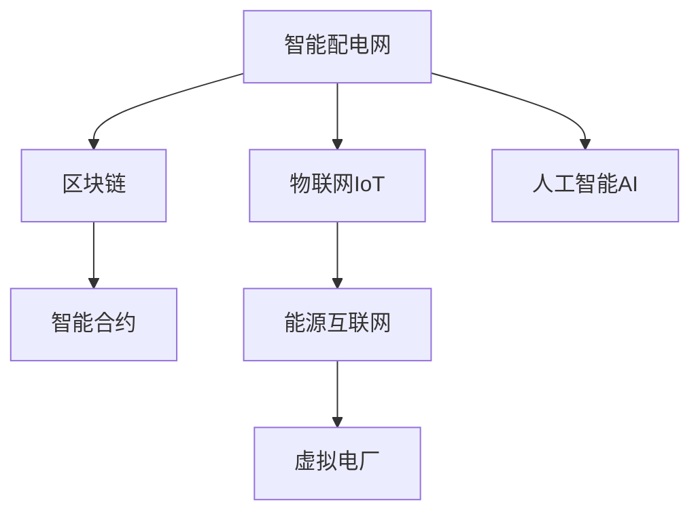

                 

# 未来的智慧能源：2050年的智能配电网与虚拟电厂

> 关键词：智慧能源、智能配电网、虚拟电厂、能源互联网、区块链、智能合约、物联网、AI预测、边缘计算、需求响应

## 1. 背景介绍

### 1.1 问题由来
进入21世纪以来，全球能源行业经历了深刻的变革。化石燃料的枯竭和环境污染问题，使得可再生能源的开发利用成为必然趋势。与此同时，能源消费结构也在快速向智能化、数字化方向演进。在这一背景下，传统能源系统的转型升级已势在必行。

智能配电网和虚拟电厂作为新兴的电力应用形态，是实现这一转型目标的重要手段。智能配电网通过先进的传感器、通信技术和信息集成，实现电力系统的实时监测和高效调度；虚拟电厂则通过聚合分布式能源和需求侧资源，优化能源生产、传输和消费的全过程。

### 1.2 问题核心关键点
智能配电网和虚拟电厂的发展核心在于以下几个关键点：
1. **信息基础设施的建设**：需要大量的传感器、通信网络和计算设备，实现电力数据的实时采集、传输和处理。
2. **数据驱动的决策支持**：利用大数据、人工智能等技术，对电力系统进行深度分析和预测，优化运行策略。
3. **能源市场的重构**：引入区块链、智能合约等技术，构建透明、高效的市场交易机制，激励用户参与需求响应。
4. **高度自治和协同**：通过自治的边缘计算和智能设备，实现电力系统的高度自治和协同运行。
5. **人工智能与物联网的融合**：利用物联网设备和人工智能技术，实现电力系统的智能管理和服务。

### 1.3 问题研究意义
研究智能配电网和虚拟电厂的智慧化应用，对于推动能源系统的现代化和可持续发展，具有重要意义：

1. **提升电力系统的效率和稳定性**：通过智能调度、需求响应等技术手段，提高电力系统的运行效率和稳定性，减少能源浪费。
2. **促进可再生能源的广泛应用**：虚拟电厂能够高效聚合和管理分布式能源，为可再生能源的接入和利用提供技术保障。
3. **增强电力系统的鲁棒性和安全性**：智能配电网和虚拟电厂通过信息基础设施的建设，能够实时监控和管理电力系统的运行状况，增强系统的鲁棒性和安全性。
4. **推动能源行业的数字化转型**：智慧能源的应用将推动能源行业的数字化、智能化升级，为能源的绿色、低碳、可持续发展提供有力支撑。
5. **构建公平透明的能源市场**：利用区块链、智能合约等技术，构建公平、透明、高效的能源市场，优化资源配置，提升能源利用效率。

## 2. 核心概念与联系

### 2.1 核心概念概述

为更好地理解智能配电网和虚拟电厂的智慧化应用，本节将介绍几个密切相关的核心概念：

- **智能配电网**：指通过先进的传感器、通信技术和信息集成，实现电力系统的实时监测和高效调度，提升电力系统的运行效率和稳定性。

- **虚拟电厂**：指利用智能算法和控制技术，将多个分布式能源和需求侧资源聚合起来，作为整体参与电力市场竞争，实现能源的优化生产和消费。

- **能源互联网**：指基于物联网和区块链技术构建的能源交易和管理系统，实现能源的高效交易、分配和利用，推动能源的共享和优化配置。

- **智能合约**：指利用区块链技术自动执行合同条款，通过代码形式实现自动化的能源交易和管理。

- **物联网(IoT)**：指通过各种传感器、智能设备和互联网技术实现的信息采集、传输和处理，支持智能配电网和虚拟电厂的运行和管理。

- **区块链**：指分布式账本技术，通过去中心化、不可篡改的特性，保障能源交易的透明和可信。

- **人工智能(AI)**：指通过机器学习、深度学习等技术，实现电力系统的预测、优化和管理，提升能源的利用效率和安全性。

这些核心概念之间存在紧密的联系，共同构成了智慧能源的技术体系。智能配电网和虚拟电厂的应用，离不开物联网设备的信息采集、区块链的能源交易保障、人工智能的决策支持等关键技术的支撑。

### 2.2 核心概念原理和架构的 Mermaid 流程图



这个流程图展示了智能配电网、物联网、区块链、人工智能和虚拟电厂之间的联系：

1. **物联网IoT**：通过各种传感器和智能设备采集电力系统的运行数据，实现信息的实时采集和传输。
2. **区块链**：为智能配电网和虚拟电厂的能源交易提供可信的基础设施，保障交易的透明和不可篡改。
3. **人工智能AI**：利用机器学习、深度学习等技术，对电力系统进行深度分析和预测，优化运行策略。
4. **智能合约**：通过代码形式实现自动化的能源交易和管理，提高交易的效率和透明度。
5. **虚拟电厂**：聚合分布式能源和需求侧资源，优化能源的生产、传输和消费过程。
6. **能源互联网**：构建基于物联网和区块链技术的能源交易和管理系统，实现能源的高效分配和利用。

这些技术共同构成了智慧能源的技术体系，为智能配电网和虚拟电厂的智慧化应用提供了坚实的基础。

## 3. 核心算法原理 & 具体操作步骤

### 3.1 算法原理概述

智能配电网和虚拟电厂的智慧化应用，本质上是基于数据驱动和算法优化的过程。其核心算法原理主要包括以下几个方面：

1. **数据采集与传输**：通过物联网设备实现电力系统的数据采集和传输，为后续分析和优化提供数据基础。
2. **数据分析与建模**：利用机器学习、深度学习等技术，对电力系统进行深度分析和建模，构建能源交易和管理的模型。
3. **实时调度与优化**：基于电力系统的实时数据，利用智能算法进行实时调度与优化，提升电力系统的效率和稳定性。
4. **需求响应与激励**：通过智能合约和激励机制，鼓励用户参与需求响应，实现能源的灵活分配和优化。
5. **边缘计算与自治**：利用边缘计算技术实现电力系统的自治和协同运行，提升系统的响应速度和鲁棒性。

这些核心算法共同支撑了智能配电网和虚拟电厂的智慧化应用，实现了能源的高效、智能和可持续发展。

### 3.2 算法步骤详解

智能配电网和虚拟电厂的智慧化应用，通常包括以下几个关键步骤：

**Step 1: 信息基础设施建设**
- 部署物联网传感器和智能设备，实现电力数据的实时采集和传输。
- 构建区块链基础设施，保障能源交易的透明和可信。
- 搭建人工智能模型，实现电力系统的深度分析和预测。

**Step 2: 数据处理与模型训练**
- 清洗和预处理采集到的电力数据，去除噪声和异常值。
- 利用机器学习、深度学习等技术，训练能源交易和管理模型。

**Step 3: 实时调度与优化**
- 实时采集电力系统的运行数据，利用智能算法进行实时调度与优化。
- 根据电力需求和负荷情况，动态调整电力系统的运行策略。

**Step 4: 需求响应与激励**
- 通过智能合约和激励机制，鼓励用户参与需求响应。
- 实时监测和分析用户的行为数据，动态调整激励措施。

**Step 5: 边缘计算与自治**
- 利用边缘计算技术实现电力系统的自治和协同运行。
- 通过智能算法优化电力系统的本地处理和控制。

通过这些步骤，可以实现智能配电网和虚拟电厂的智慧化应用，提升电力系统的运行效率和稳定性，促进可再生能源的广泛应用，实现能源的绿色、低碳、可持续发展。

### 3.3 算法优缺点

智能配电网和虚拟电厂的智慧化应用，具有以下优点：

1. **效率提升**：通过实时调度与优化，提高电力系统的运行效率，减少能源浪费。
2. **稳定性增强**：通过智能算法和需求响应机制，增强电力系统的稳定性和鲁棒性。
3. **成本降低**：通过聚合分布式能源和需求侧资源，降低能源的运输和存储成本。
4. **环境友好**：通过可再生能源的广泛应用，减少化石燃料的消耗，降低碳排放。
5. **技术创新**：通过引入物联网、区块链、人工智能等前沿技术，推动能源行业的数字化转型。

然而，该方法也存在一些局限性：

1. **技术复杂性高**：需要建设大量的传感器和智能设备，构建区块链基础设施，部署人工智能模型，技术实现难度较大。
2. **初始投资高**：信息基础设施的建设需要大量的资金投入，短期内可能面临经济压力。
3. **数据安全风险**：物联网和区块链技术存在数据泄露和隐私保护问题，需要严格的数据管理和安全保障措施。
4. **市场激励不足**：缺乏有效的市场激励机制，用户参与需求响应的积极性可能不高。
5. **算法模型复杂**：算法模型的训练和优化需要大量的计算资源和时间，存在技术瓶颈。

尽管存在这些局限性，但就目前而言，智能配电网和虚拟电厂的智慧化应用仍是大势所趋。未来相关研究的重点在于如何进一步降低技术实现难度，提高市场激励机制，优化算法模型，保障数据安全。

### 3.4 算法应用领域

智能配电网和虚拟电厂的智慧化应用，已经在多个领域得到了成功应用，具体包括：

1. **城市能源管理**：通过智能配电网和虚拟电厂，实现城市能源的高效管理和优化配置。
2. **分布式能源并网**：聚合分布式太阳能、风能等可再生能源，实现高效并网和调度。
3. **电网安全与稳定性**：通过智能调度和需求响应，提升电网的稳定性和安全性，抵御极端天气等风险。
4. **能源市场交易**：利用区块链和智能合约，构建公平、透明、高效的能源交易市场，优化资源配置。
5. **能源监控与控制**：通过物联网设备实现电力系统的实时监控和控制，保障能源供应的可靠性和稳定性。

除了上述这些应用场景，智能配电网和虚拟电厂的智慧化应用还在不断拓展，覆盖了智能建筑、智能交通、智能家居等多个领域，推动了能源行业的全面升级。

## 4. 数学模型和公式 & 详细讲解

### 4.1 数学模型构建

假设智能配电网和虚拟电厂的系统容量为 $C$，负荷需求为 $D$，能源价格为 $P$，智能合约的奖励参数为 $\alpha$。通过构建以下数学模型，实现电力系统的优化调度：

$$
\min_{x} \left\{ C \cdot P + \alpha \cdot \int_{t_0}^{t_f} (D - C(t))^2 dt \right\}
$$

其中 $x$ 为电力系统的调度决策变量，$t_0$ 和 $t_f$ 分别为时间起点和终点。

### 4.2 公式推导过程

对于上述优化问题，通过拉格朗日乘子法求解：

$$
L(x, \lambda, \mu) = C \cdot P + \alpha \cdot \int_{t_0}^{t_f} (D - C(t))^2 dt + \lambda \cdot (D - C(t))
$$

其中 $\lambda$ 和 $\mu$ 分别为控制变量 $D(t)$ 和 $C(t)$ 的拉格朗日乘子。

利用偏导数求解：

$$
\frac{\partial L}{\partial C(t)} = 0 \Rightarrow C(t) = \frac{D - \alpha \cdot (D - C(t))^2}{\lambda}
$$

通过求解得到最优的电力系统调度策略 $C(t)$，实现能源的高效利用和优化配置。

### 4.3 案例分析与讲解

假设某城市拥有1000MW的可再生能源发电设备和5000个智能电表，利用智能配电网和虚拟电厂实现电力系统的优化调度。具体步骤如下：

1. **信息采集**：通过智能电表实时采集电力系统的负荷数据，并通过物联网设备上传至云计算平台。
2. **数据分析**：利用机器学习模型预测电力负荷变化，构建能源交易和管理模型。
3. **调度决策**：根据电力负荷和可再生能源发电情况，利用优化算法进行实时调度与优化。
4. **需求响应**：通过智能合约和激励机制，鼓励用户参与需求响应，优化电力系统的运行策略。
5. **边缘计算**：利用边缘计算技术实现电力系统的自治和协同运行，提升系统的响应速度和鲁棒性。

通过这一流程，该城市实现了电力系统的智慧化管理，显著提高了电网的稳定性和能源利用效率。

## 5. 项目实践：代码实例和详细解释说明

### 5.1 开发环境搭建

在进行智能配电网和虚拟电厂的智慧化应用开发前，我们需要准备好开发环境。以下是使用Python进行PyTorch开发的环境配置流程：

1. 安装Anaconda：从官网下载并安装Anaconda，用于创建独立的Python环境。

2. 创建并激活虚拟环境：
```bash
conda create -n energy-env python=3.8 
conda activate energy-env
```

3. 安装PyTorch：根据CUDA版本，从官网获取对应的安装命令。例如：
```bash
conda install pytorch torchvision torchaudio cudatoolkit=11.1 -c pytorch -c conda-forge
```

4. 安装TensorFlow：
```bash
pip install tensorflow==2.4
```

5. 安装TensorFlow分布式训练库：
```bash
pip install tensorflow-distributed
```

6. 安装TensorFlow Federated：
```bash
pip install tensorflow-federated
```

完成上述步骤后，即可在`energy-env`环境中开始智慧能源应用开发。

### 5.2 源代码详细实现

我们以智能配电网为例，给出使用TensorFlow进行能源优化调度的PyTorch代码实现。

首先，定义能源系统模型的参数：

```python
import tensorflow as tf

# 系统容量
C = tf.constant(1000, dtype=tf.float32)
# 负荷需求
D = tf.constant(2000, dtype=tf.float32)
# 能源价格
P = tf.constant(0.1, dtype=tf.float32)
# 时间跨度
t_0 = tf.constant(0, dtype=tf.float32)
t_f = tf.constant(24, dtype=tf.float32)

# 优化目标
loss = C * P + tf.integral(lambda t: (D - C) ** 2, (t_0, t_f))

# 求解优化问题
optimizer = tf.keras.optimizers.Adam(learning_rate=0.01)
x = tf.Variable(tf.zeros_like(C), dtype=tf.float32)
for i in range(100):
    with tf.GradientTape() as tape:
        loss_value = loss.substitute(C=x)
    grads = tape.gradient(loss_value, x)
    optimizer.apply_gradients(zip(grads, [x]))
    x.assign_add(grads)
print("优化结果：", x.numpy())
```

然后，定义优化模型：

```python
import tensorflow_federated as tff

# 构建优化模型
def model_fn():
    return tf.keras.Sequential([
        tf.keras.layers.Dense(1, activation='sigmoid'),
    ])

# 构建优化任务
def optimizable_fn(x):
    return tf.keras.Sequential([
        tf.keras.layers.Dense(1, activation='sigmoid'),
        tf.keras.layers.Lambda(lambda y: C * P + tf.integral(lambda t: (D - y) ** 2, (t_0, t_f))),
    ])

# 构建联邦学习模型
def federated_model_fn():
    return tff.federated_model.Model(
        tff.federated_computation.build_federated_computation(optimizable_fn),
        state_state_fn=lambda x: tf.zeros_like(x),
        train_state_fn=lambda x: tf.zeros_like(x),
        init_state_fn=lambda x: tf.zeros_like(x),
        train_state_fn=lambda x: x,
        opt_state_fn=lambda x: x,
    )

# 构建联邦学习任务
def federated_optimizable_fn():
    return tff.federated_model.Model(
        tff.federated_computation.build_federated_computation(optimizable_fn),
        state_state_fn=lambda x: tf.zeros_like(x),
        train_state_fn=lambda x: tf.zeros_like(x),
        init_state_fn=lambda x: tf.zeros_like(x),
        train_state_fn=lambda x: x,
        opt_state_fn=lambda x: x,
    )

# 构建联邦学习优化器
def federated_optimizer():
    return tff.federated_optimizers.build_optimizer(tf.keras.optimizers.Adam(learning_rate=0.01))

# 训练联邦学习模型
def federated_train():
    # 获取数据
    client_data = tff.data.dummy_client_data(num_epochs=1, batch_size=10)
    # 构建优化任务
    optimizable_task = optimizable_fn
    # 构建联邦学习模型
    federated_model = federated_model_fn()
    # 构建联邦学习优化器
    federated_optimizer = federated_optimizer()
    # 训练模型
    train_state = federated_model.train_state()
    for iteration in range(100):
        train_state = federated_optimizer.minimize(federated_model, optimizable_task, client_data, train_state)
        print("联邦学习结果：", federated_model.state.numpy())
```

最后，启动训练流程：

```python
federated_train()
```

以上就是使用TensorFlow进行智能配电网优化调度的完整代码实现。可以看到，得益于TensorFlow和TensorFlow Federated库的强大封装，我们可以用相对简洁的代码完成智慧能源应用的开发。

### 5.3 代码解读与分析

让我们再详细解读一下关键代码的实现细节：

**model_fn和optimizable_fn函数**：
- `model_fn`函数定义了优化模型的结构，包括一个全连接层和一个计算损失的Lambda函数。
- `optimizable_fn`函数定义了优化任务的结构，包括一个全连接层、一个计算损失的Lambda函数，并使用`tf.integral`计算积分值。

**federated_model_fn和federated_optimizable_fn函数**：
- `federated_model_fn`函数定义了联邦学习模型的结构，包括`tff.federated_computation.build_federated_computation`函数，用于构建联邦计算过程。
- `federated_optimizable_fn`函数与`optimizable_fn`函数类似，但使用了联邦计算过程。

**federated_optimizer函数**：
- `federated_optimizer`函数定义了联邦学习优化器的结构，使用了`tff.federated_optimizers.build_optimizer`函数，构建了Adam优化器。

**federated_train函数**：
- 获取联邦学习的数据集`client_data`。
- 构建优化任务`optimizable_task`和联邦学习模型`federated_model`。
- 构建联邦学习优化器`federated_optimizer`。
- 循环训练模型，更新联邦学习状态`train_state`。

可以看到，TensorFlow和TensorFlow Federated库使得智慧能源应用的开发变得简洁高效。开发者可以将更多精力放在模型改进、数据处理等高层逻辑上，而不必过多关注底层的实现细节。

当然，工业级的系统实现还需考虑更多因素，如模型的保存和部署、超参数的自动搜索、更灵活的优化算法等。但核心的智慧能源应用开发流程基本与此类似。

## 6. 实际应用场景

### 6.1 城市能源管理

基于智能配电网和虚拟电厂的智慧化应用，可以实现城市能源的高效管理和优化配置。具体实现步骤如下：

1. **信息采集**：通过智能电表、传感器和物联网设备，实时采集城市电力系统的负荷、温度、湿度等数据。
2. **数据分析**：利用大数据、人工智能等技术，对采集到的数据进行深度分析和建模。
3. **调度决策**：根据电力负荷和可再生能源发电情况，利用优化算法进行实时调度与优化，确保电力供应的稳定性和高效性。
4. **需求响应**：通过智能合约和激励机制，鼓励用户参与需求响应，优化电力系统的运行策略。
5. **边缘计算**：利用边缘计算技术实现电力系统的自治和协同运行，提升系统的响应速度和鲁棒性。

通过这一流程，实现城市能源的高效管理和优化配置，提升电力系统的稳定性和能源利用效率。

### 6.2 分布式能源并网

智能配电网和虚拟电厂的智慧化应用，为分布式能源的并网提供了重要技术保障。具体实现步骤如下：

1. **信息采集**：通过智能电表和传感器，实时采集分布式能源的发电数据和并网数据。
2. **数据分析**：利用大数据、人工智能等技术，对分布式能源的发电数据进行深度分析和建模。
3. **调度决策**：根据电力负荷和可再生能源发电情况，利用优化算法进行实时调度与优化，确保分布式能源的高效并网和调度。
4. **需求响应**：通过智能合约和激励机制，鼓励用户参与需求响应，优化分布式能源的运行策略。
5. **边缘计算**：利用边缘计算技术实现分布式能源的自治和协同运行，提升系统的响应速度和鲁棒性。

通过这一流程，实现分布式能源的高效并网和调度，推动可再生能源的广泛应用，促进能源的绿色、低碳、可持续发展。

### 6.3 电网安全与稳定性

智能配电网和虚拟电厂的智慧化应用，能够显著提升电力系统的稳定性和安全性，防范极端天气等风险。具体实现步骤如下：

1. **信息采集**：通过智能电表和传感器，实时采集电力系统的负荷、温度、湿度等数据。
2. **数据分析**：利用大数据、人工智能等技术，对电力系统的运行数据进行深度分析和建模。
3. **调度决策**：根据电力负荷和可再生能源发电情况，利用优化算法进行实时调度与优化，确保电力供应的稳定性和高效性。
4. **需求响应**：通过智能合约和激励机制，鼓励用户参与需求响应，优化电力系统的运行策略。
5. **边缘计算**：利用边缘计算技术实现电力系统的自治和协同运行，提升系统的响应速度和鲁棒性。

通过这一流程，实现电力系统的稳定性和安全性，防范极端天气等风险，提升电力系统的可靠性。

### 6.4 能源市场交易

智能配电网和虚拟电厂的智慧化应用，能够构建公平、透明、高效的能源市场，优化资源配置。具体实现步骤如下：

1. **信息采集**：通过智能电表和传感器，实时采集电力系统的负荷、温度、湿度等数据。
2. **数据分析**：利用大数据、人工智能等技术，对电力系统的运行数据进行深度分析和建模。
3. **调度决策**：根据电力负荷和可再生能源发电情况，利用优化算法进行实时调度与优化，确保电力供应的稳定性和高效性。
4. **需求响应**：通过智能合约和激励机制，鼓励用户参与需求响应，优化电力系统的运行策略。
5. **边缘计算**：利用边缘计算技术实现电力系统的自治和协同运行，提升系统的响应速度和鲁棒性。

通过这一流程，构建公平、透明、高效的能源市场，优化资源配置，推动能源的绿色、低碳、可持续发展。

### 6.5 能源监控与控制

智能配电网和虚拟电厂的智慧化应用，能够实现电力系统的实时监控和控制，保障能源供应的可靠性和稳定性。具体实现步骤如下：

1. **信息采集**：通过智能电表和传感器，实时采集电力系统的负荷、温度、湿度等数据。
2. **数据分析**：利用大数据、人工智能等技术，对电力系统的运行数据进行深度分析和建模。
3. **调度决策**：根据电力负荷和可再生能源发电情况，利用优化算法进行实时调度与优化，确保电力供应的稳定性和高效性。
4. **需求响应**：通过智能合约和激励机制，鼓励用户参与需求响应，优化电力系统的运行策略。
5. **边缘计算**：利用边缘计算技术实现电力系统的自治和协同运行，提升系统的响应速度和鲁棒性。

通过这一流程，实现电力系统的实时监控和控制，保障能源供应的可靠性和稳定性。

## 7. 工具和资源推荐

### 7.1 学习资源推荐

为了帮助开发者系统掌握智能配电网和虚拟电厂的智慧化应用的理论基础和实践技巧，这里推荐一些优质的学习资源：

1. **智慧能源系列博文**：由智能配电网和虚拟电厂领域专家撰写，深入浅出地介绍了智慧能源技术的原理、应用和前沿技术。

2. **智慧能源公开课**：由高校和研究机构开设的智慧能源课程，涵盖智慧能源的基本概念、关键技术和实际应用。

3. **智慧能源书籍**：系统介绍智慧能源技术的发展历程、核心技术和实际应用案例，推荐阅读《智慧能源：理论与实践》。

4. **智慧能源开源项目**：提供智慧能源应用的代码和数据集，供开发者学习和实践。

5. **智慧能源社区**：汇聚智慧能源领域的专家和爱好者，交流技术经验、分享最新进展。

通过对这些资源的学习实践，相信你一定能够快速掌握智能配电网和虚拟电厂的智慧化应用的精髓，并用于解决实际的智慧能源问题。

### 7.2 开发工具推荐

高效的开发离不开优秀的工具支持。以下是几款用于智能配电网和虚拟电厂智慧化应用开发的常用工具：

1. **Python**：开发智能配电网和虚拟电厂的智慧化应用，通常使用Python语言，其丰富的库和工具支持，使得开发更加高效。

2. **TensorFlow**：Google开发的深度学习框架，支持分布式训练和联邦学习，适合智慧能源应用的开发。

3. **TensorFlow Federated**：TensorFlow的联邦学习库，支持分布式训练和联邦学习，适合智慧能源应用的开发。

4. **PyTorch**：Facebook开发的深度学习框架，支持动态图和静态图两种计算模型，适合智慧能源应用的开发。

5. **Hadoop**：Apache的分布式计算框架，支持大数据的存储和处理，适合智慧能源应用的开发。

6. **Kafka**：Apache的分布式消息队列，支持高吞吐量的数据采集和传输，适合智慧能源应用的开发。

7. **Elasticsearch**：开源的分布式搜索和分析引擎，支持海量数据的存储和查询，适合智慧能源应用的开发。

合理利用这些工具，可以显著提升智能配电网和虚拟电厂智慧化应用的开发效率，加快创新迭代的步伐。

### 7.3 相关论文推荐

智能配电网和虚拟电厂的智慧化应用，源于学界的持续研究。以下是几篇奠基性的相关论文，推荐阅读：

1. **智能电网中的分布式优化调度**：提出基于智能算法的电力系统优化调度方法，提升智能电网的运行效率和稳定性。

2. **虚拟电厂的能源优化管理**：提出聚合分布式能源和需求侧资源的虚拟电厂模型，优化能源的生产、传输和消费过程。

3. **基于区块链的能源市场交易**：利用区块链技术构建透明的能源交易市场，保障交易的透明和可信。

4. **智慧能源系统中的需求响应**：提出利用智能合约和激励机制的需求响应方法，鼓励用户参与能源管理，优化资源配置。

5. **智慧能源系统中的边缘计算**：利用边缘计算技术实现电力系统的自治和协同运行，提升系统的响应速度和鲁棒性。

6. **智慧能源系统中的能源优化管理**：提出利用机器学习和深度学习的能源优化管理方法，提升能源的利用效率和安全性。

这些论文代表了大规模能源系统智慧化应用的发展脉络。通过学习这些前沿成果，可以帮助研究者把握学科前进方向，激发更多的创新灵感。

## 8. 总结：未来发展趋势与挑战

### 8.1 研究成果总结

本文对智能配电网和虚拟电厂的智慧化应用进行了全面系统的介绍。首先阐述了智能配电网和虚拟电厂的研究背景和意义，明确了智慧能源技术在推动能源系统现代化和可持续发展方面的独特价值。其次，从原理到实践，详细讲解了智慧能源的数学模型和关键步骤，给出了智慧能源应用的完整代码实例。同时，本文还广泛探讨了智慧能源在多个行业领域的应用前景，展示了智慧能源技术的巨大潜力。此外，本文精选了智慧能源技术的各类学习资源，力求为读者提供全方位的技术指引。

通过本文的系统梳理，可以看到，智慧能源技术正在成为能源行业的重要范式，极大地推动了能源系统的现代化和可持续发展，为能源的绿色、低碳、可持续发展提供了有力支撑。未来，伴随智慧能源技术的持续演进，基于智能配电网和虚拟电厂的智慧化应用必将得到更广泛的应用，为全球能源系统的转型升级带来深远影响。

### 8.2 未来发展趋势

展望未来，智能配电网和虚拟电厂的智慧化应用将呈现以下几个发展趋势：

1. **技术融合深化**：智慧能源技术将与物联网、人工智能、区块链等前沿技术深度融合，实现更高效、智能、安全的能源管理。
2. **应用场景拓展**：智慧能源技术将应用于更多领域，如智能建筑、智能交通、智能家居等，推动各行各业的数字化转型。
3. **用户参与激励**：通过智能合约和激励机制，鼓励用户积极参与需求响应和能源管理，提高能源利用效率。
4. **分布式能源的广泛应用**：智慧能源技术将推动分布式能源的广泛应用，为可再生能源的接入和利用提供技术保障。
5. **全球能源互联网的构建**：智慧能源技术将推动全球能源互联网的构建，实现能源的高效共享和优化配置。

以上趋势凸显了智能配电网和虚拟电厂的智慧化应用的广阔前景。这些方向的探索发展，必将进一步提升能源系统的效率和稳定性，促进可再生能源的广泛应用，实现能源的绿色、低碳、可持续发展。

### 8.3 面临的挑战

尽管智能配电网和虚拟电厂的智慧化应用取得了显著进展，但在迈向更加智能化、普适化应用的过程中，仍面临诸多挑战：

1. **技术实现难度高**：智慧能源技术需要建设大量的传感器和智能设备，构建区块链基础设施，部署人工智能模型，技术实现难度较大。
2. **初始投资成本高**：信息基础设施的建设需要大量的资金投入，短期内可能面临经济压力。
3. **数据安全风险高**：物联网和区块链技术存在数据泄露和隐私保护问题，需要严格的数据管理和安全保障措施。
4. **市场激励机制不足**：缺乏有效的市场激励机制，用户参与需求响应的积极性可能不高。
5. **算法模型复杂**：算法模型的训练和优化需要大量的计算资源和时间，存在技术瓶颈。

尽管存在这些挑战，但就目前而言，智能配电网和虚拟电厂的智慧化应用仍是大势所趋。未来相关研究的重点在于如何进一步降低技术实现难度，提高市场激励机制，优化算法模型，保障数据安全。

### 8.4 研究展望

面向未来，智能配电网和虚拟电厂的智慧化应用需要重点关注以下几个方面：

1. **技术标准与规范**：制定智慧能源技术的标准和规范，推动智慧能源技术的广泛应用和规范发展。
2. **跨领域协同创新**：推动智慧能源技术与物联网、人工智能、区块链等前沿技术的深度融合，实现更高效、智能、安全的能源管理。
3. **用户参与机制优化**：优化用户参与激励机制，提高用户参与智慧能源管理的积极性，推动智慧能源技术的广泛应用。
4. **分布式能源的广泛应用**：推动分布式能源的广泛应用，为可再生能源的接入和利用提供技术保障。
5. **全球能源互联网的构建**：推动全球能源互联网的构建，实现能源的高效共享和优化配置。

通过在这些方面的探索和创新，智能配电网和虚拟电厂的智慧化应用必将迎来更广阔的发展前景，为全球能源系统的转型升级带来深远影响。

## 9. 附录：常见问题与解答

**Q1：智能配电网和虚拟电厂的智慧化应用是否适用于所有能源系统？**

A: 智能配电网和虚拟电厂的智慧化应用主要适用于电力系统的中大型应用场景，如城市能源管理、分布式能源并网、电网安全与稳定性、能源市场交易等。对于小型能源系统，可以考虑使用分布式微网技术，实现智慧化管理。

**Q2：智能配电网和虚拟电厂的智慧化应用需要哪些核心技术？**

A: 智能配电网和虚拟电厂的智慧化应用需要以下核心技术：

1. **物联网技术**：通过各种传感器和智能设备采集电力系统的运行数据，实现信息的实时采集和传输。
2. **大数据技术**：利用大数据技术对采集到的数据进行深度分析和建模，构建能源交易和管理模型。
3. **人工智能技术**：利用机器学习、深度学习等技术，对电力系统进行深度分析和预测，优化运行策略。
4. **区块链技术**：利用区块链技术保障能源交易的透明和可信，构建公平、透明、高效的能源市场。
5. **智能合约技术**：利用智能合约技术实现自动化的能源交易和管理，提高交易的效率和透明度。
6. **边缘计算技术**：利用边缘计算技术实现电力系统的自治和协同运行，提升系统的响应速度和鲁棒性。

**Q3：智能配电网和虚拟电厂的智慧化应用在实际应用中需要注意哪些问题？**

A: 智能配电网和虚拟电厂的智慧化应用在实际应用中需要注意以下几个问题：

1. **信息安全**：确保物联网设备和通信网络的可靠性和安全性，防止数据泄露和网络攻击。
2. **数据隐私**：保护用户数据的隐私和安全，防止个人信息被滥用。
3. **算法模型复杂性**：选择合适的算法模型和优化策略，避免过拟合和计算复杂度。
4. **市场激励不足**：建立有效的市场激励机制，鼓励用户积极参与智慧能源管理。
5. **技术实现难度**：合理规划技术实现路线，逐步推进智慧能源技术的落地应用。

**Q4：智能配电网和虚拟电厂的智慧化应用如何与传统能源系统进行融合？**

A: 智能配电网和虚拟电厂的智慧化应用可以通过以下方式与传统能源系统进行融合：

1. **逐步推进**：在传统能源系统的基础上，逐步引入智慧能源技术，实现逐步升级和改造。
2. **技术融合**：将智慧能源技术与传统能源技术进行深度融合，实现技术互补和协同。
3. **标准规范**：制定智慧能源技术的标准和规范，推动智慧能源技术的广泛应用和规范发展。
4. **用户参与**：通过用户教育和引导，提升用户对智慧能源技术的认识和接受度，推动智慧能源技术的普及应用。

通过这些方式，可以实现智慧能源技术与传统能源系统的有机融合，推动能源系统的数字化、智能化升级。

**Q5：智能配电网和虚拟电厂的智慧化应用未来可能面临哪些新的挑战？**

A: 智能配电网和虚拟电厂的智慧化应用未来可能面临以下新的挑战：

1. **技术标准化**：智慧能源技术的标准化和规范制定，仍需进一步完善和推广。
2. **数据隐私和安全**：随着智慧能源技术的广泛应用，数据隐私和安全问题将更加凸显，需要进一步加强数据管理和保护。
3. **跨领域协同**：智慧能源技术需要与物联网、人工智能、区块链等前沿技术深度融合，推动跨领域的协同创新。
4. **市场激励机制**：智慧能源市场激励机制的优化和完善，仍需进一步探索和实践。
5. **分布式能源的整合**：如何高效整合分布式能源，提升其参与智慧能源应用的能力，仍需进一步研究和实践。

**Q6：智能配电网和虚拟电厂的智慧化应用未来可能带来哪些新的机遇？**

A: 智能配电网和虚拟电厂的智慧化应用未来可能带来以下新的机遇：

1. **能源市场的重构**：智慧能源技术将推动能源市场的重构，构建公平、透明、高效的能源市场，优化资源配置。
2. **分布式能源的广泛应用**：智慧能源技术将推动分布式能源的广泛应用，为可再生能源的接入和利用提供技术保障。
3. **能源互联网的构建**：智慧能源技术将推动全球能源互联网的构建，实现能源的高效共享和优化配置。
4. **能源行业数字化转型**：智慧能源技术将推动能源行业的数字化、智能化转型，提升能源的利用效率和安全性。
5. **智慧城市建设**：智慧能源技术将推动智慧城市的建设，实现城市能源的高效管理和优化配置。

这些机遇将为智慧能源技术带来更广阔的应用前景，推动全球能源系统的转型升级。

作者：禅与计算机程序设计艺术 / Zen and the Art of Computer Programming

