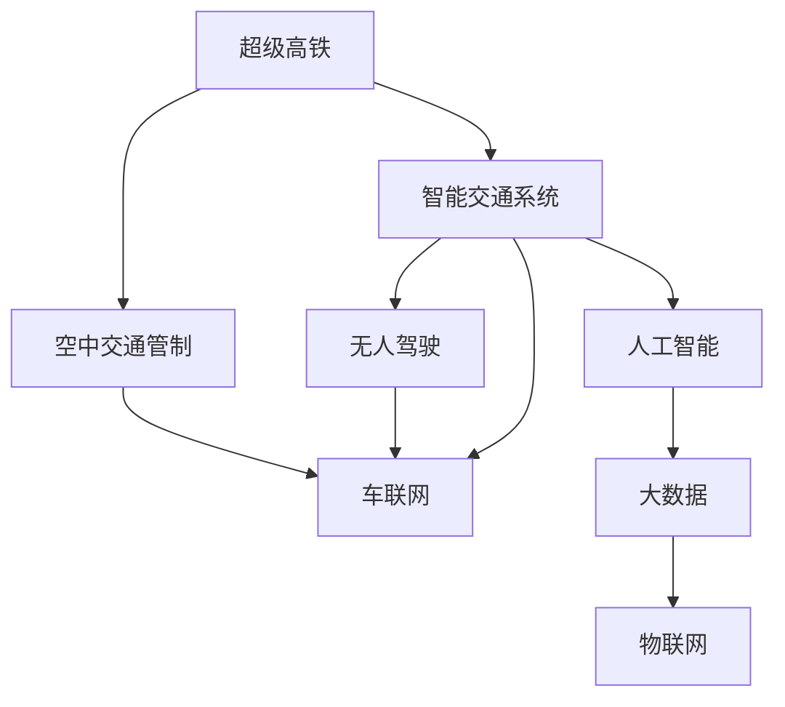

                 

# 未来的智能交通：2050年的超级高铁与空中交通管制

> 关键词：超级高铁, 空中交通管制, 智能交通系统, 无人驾驶, 车联网, 人工智能, 大数据, 物联网

## 1. 背景介绍

### 1.1 问题由来
随着全球人口的增长和城市化的加速，交通拥堵和环境污染等问题变得越来越严重。如何提高交通系统的效率和安全性，成为现代社会亟需解决的重大挑战。当前，交通系统主要依赖于传统的道路运输和空中交通，存在效率低、能耗高、安全隐患等问题。超级高铁和空中交通管制技术的发展，有望为未来交通系统带来革命性的变革。

### 1.2 问题核心关键点
未来智能交通的核心关键点包括：
- 超级高铁：通过高速磁悬浮、超导磁悬浮等技术，实现城市间和城市内部的快速运输，缩短旅行时间，提高运输效率。
- 空中交通管制：利用人工智能和大数据技术，实现对空中交通的精准管理和调度，提升飞行安全和效率。
- 智能交通系统：通过车联网、无人驾驶等技术，实现车辆之间的互联互通和自动驾驶，减少人为错误，提高交通安全和效率。

## 2. 核心概念与联系

### 2.1 核心概念概述

为更好地理解未来智能交通的核心技术，本节将介绍几个密切相关的核心概念：

- 超级高铁（Hyperloop）：基于磁悬浮技术的高速运输系统，能够实现极高的运行速度和运输效率，极大地缩短城市间和城市内部的旅行时间。

- 空中交通管制（Air Traffic Control, ATC）：利用人工智能和大数据技术，实现对空中交通的实时监控、调度和控制，提升飞行安全和效率。

- 智能交通系统（Intelligent Transportation System, ITS）：通过车联网、无人驾驶等技术，实现车辆之间的互联互通和自动驾驶，减少人为错误，提高交通安全和效率。

- 无人驾驶（Autonomous Driving）：通过计算机视觉、传感器、高精度地图等技术，实现车辆在各种环境下的自主导航和驾驶。

- 车联网（Vehicle-to-Everything, V2X）：通过车辆与基础设施、其他车辆、行人等的通信，实现信息的共享和交互，提高交通系统的智能水平。

- 人工智能（AI）：通过机器学习、深度学习等技术，实现对交通数据的分析和处理，提升交通管理的智能化水平。

- 大数据（Big Data）：通过收集、分析和处理海量交通数据，实现对交通流量的预测和优化，提升交通管理的科学性。

- 物联网（Internet of Things, IoT）：通过各类传感器和智能设备，实现对交通设施和环境的实时监测和控制，提升交通管理的精细化水平。

这些核心概念之间的逻辑关系可以通过以下Mermaid流程图来展示：



这个流程图展示的未来智能交通的核心概念及其之间的关系：

1. 超级高铁与空中交通管制通过高速和实时控制，提升交通系统的效率和安全性。
2. 智能交通系统利用无人驾驶和车联网技术，实现车辆之间的通信和协作，提升交通管理水平。
3. 人工智能和大数据技术提供智能分析和预测，优化交通管理和调度。
4. 物联网技术实现对交通设施和环境的实时监测和控制，提升交通管理的精细化水平。

这些概念共同构成了未来智能交通的核心技术体系，为其发展奠定了基础。

## 3. 核心算法原理 & 具体操作步骤
### 3.1 算法原理概述

未来智能交通的核心算法原理主要包括：

- 超级高铁：基于磁悬浮技术，通过电磁力或超导磁悬浮力，实现对车辆的悬浮和推动，达到极高的运行速度。
- 空中交通管制：通过传感器、通信设备和人工智能算法，实现对飞行器的实时监控和调度，确保飞行安全和效率。
- 智能交通系统：通过车辆与基础设施、其他车辆、行人等的通信，实现信息的共享和交互，提高交通管理的智能化水平。
- 无人驾驶：通过计算机视觉、传感器、高精度地图等技术，实现车辆在各种环境下的自主导航和驾驶。
- 车联网：通过车辆与基础设施、其他车辆、行人等的通信，实现信息的共享和交互，提升交通管理的智能化水平。
- 人工智能：通过机器学习、深度学习等技术，实现对交通数据的分析和处理，提升交通管理的智能化水平。
- 大数据：通过收集、分析和处理海量交通数据，实现对交通流量的预测和优化，提升交通管理的科学性。
- 物联网：通过各类传感器和智能设备，实现对交通设施和环境的实时监测和控制，提升交通管理的精细化水平。

### 3.2 算法步骤详解

**3.2.1 超级高铁的算法步骤**

1. **磁悬浮技术实现**
   - 使用超导磁悬浮技术，通过磁体产生强磁场，吸引车辆悬浮在轨道上。
   - 使用电磁力或超导磁悬浮力推动车辆，实现极高的运行速度。

2. **轨道设计和布局**
   - 设计多条连接城市和城市之间的轨道线路，实现城市之间的快速连接。
   - 在城市内部设计高效的轨道布局，连接主要交通枢纽和居住区。

3. **控制系统设计**
   - 设计实时控制系统，实现对车辆速度、位置和方向的精确控制。
   - 使用传感器和通信设备，实现对轨道环境的实时监测和反馈。

4. **安全保障措施**
   - 设计多重安全保障措施，确保车辆在运行中的安全性和稳定性。
   - 设置应急响应机制，应对突发情况。

**3.2.2 空中交通管制的算法步骤**

1. **数据采集**
   - 利用传感器和通信设备，收集飞行器的位置、速度、高度等数据。
   - 通过高精度地图和卫星定位系统，实现对飞行器的精确定位。

2. **数据处理和分析**
   - 使用大数据技术，对收集的数据进行分析和处理，生成交通流量图。
   - 通过人工智能算法，预测飞行器的飞行轨迹和可能的冲突点。

3. **交通调度**
   - 设计实时调度算法，优化飞行器的飞行路径和速度，避免冲突。
   - 根据实时交通情况，动态调整飞行器的位置和高度。

4. **紧急情况处理**
   - 设计应急响应机制，应对飞行器故障、恶劣天气等情况。
   - 确保在紧急情况下，飞行器能够安全落地。

**3.2.3 智能交通系统的算法步骤**

1. **车辆通信网络设计**
   - 设计车辆之间的通信网络，实现信息的实时共享和交互。
   - 通过车联网技术，实现对交通流量的实时监测和控制。

2. **无人驾驶算法设计**
   - 设计计算机视觉和传感器技术，实现对环境的实时感知。
   - 设计高精度地图和定位技术，确保车辆在各种环境下的准确导航。

3. **交通管理算法设计**
   - 设计实时交通管理算法，优化交通流量和通行效率。
   - 通过数据分析和预测，生成交通流量图和优化方案。

4. **应急响应机制设计**
   - 设计应急响应机制，应对交通事故和紧急情况。
   - 确保在紧急情况下，车辆能够安全避让和停车。

### 3.3 算法优缺点

未来智能交通的核心算法具有以下优点：
1. 提高交通效率和安全性：通过智能化的管理和调度，减少交通事故和拥堵，提高交通系统的整体效率和安全性。
2. 减少环境污染：通过高效能的交通系统，减少能源消耗和碳排放，促进环境保护。
3. 提升用户体验：通过自动驾驶和智能交通系统，提供更舒适、便捷的出行体验。
4. 促进区域协调发展：通过快速高效的交通系统，促进城乡和区域之间的协调发展。

但同时，这些算法也存在以下缺点：
1. 技术复杂度高：超级高铁、空中交通管制等技术的实现需要高精度的传感器、复杂的算法和大规模的计算资源。
2. 数据隐私和安全问题：智能交通系统和大数据技术需要收集大量的个人和车辆数据，存在数据隐私和安全风险。
3. 成本高：大规模的交通基础设施建设和高新技术的开发和应用，需要大量的资金投入。
4. 依赖于基础设施建设：智能交通系统的发展依赖于交通基础设施的完善和更新，需要大量的资金和政策支持。

### 3.4 算法应用领域

未来智能交通的核心算法将在以下领域得到广泛应用：

1. 高速交通：通过超级高铁技术，实现城市间和城市内部的快速连接，提升运输效率。
2. 空中交通：通过空中交通管制技术，实现对飞行器的精准管理和调度，提升飞行安全和效率。
3. 智能交通管理：通过智能交通系统、无人驾驶和车联网技术，实现交通管理和调度的智能化。
4. 物流运输：通过智能物流系统和大数据分析，实现运输路径和物流管理的优化。
5. 环境监测：通过物联网和传感器技术，实现对环境质量的实时监测和预警。
6. 城市规划：通过交通数据分析和预测，优化城市布局和交通设施的建设。

## 4. 数学模型和公式 & 详细讲解  
### 4.1 数学模型构建

**4.1.1 超级高铁的数学模型**

超级高铁的运行速度主要由磁悬浮技术和轨道布局决定。假设超级高铁的运行速度为 $v$，磁悬浮技术提供的驱动力为 $F$，轨道摩擦力为 $f$，则有：

$$ v = \frac{F}{m(g - f)} $$

其中 $m$ 为车辆质量，$g$ 为重力加速度。

**4.1.2 空中交通管制的数学模型**

空中交通管制的核心是实时调度算法。假设飞行器的数量为 $N$，每个飞行器的速度为 $v_i$，位置为 $(x_i, y_i)$，则空中交通管制算法可以表示为：

$$ \min_{v_i} \sum_{i=1}^N (v_i^2 + c(x_i, y_i)) $$

其中 $c(x_i, y_i)$ 为位置费用函数，表示飞行器在不同位置和高度的能耗和费用。

**4.1.3 智能交通系统的数学模型**

智能交通系统通过车联网和无人驾驶技术实现交通管理和调度。假设车辆数量为 $n$，车辆速度为 $v_i$，交通流量为 $f$，则智能交通系统的优化目标可以表示为：

$$ \min_{v_i, f} \sum_{i=1}^n (v_i^2 + kf) $$

其中 $k$ 为交通流量的惩罚系数，用于抑制过度拥挤。

### 4.2 公式推导过程

**4.2.1 超级高铁的公式推导**

通过磁悬浮技术，超级高铁能够实现极高速的运行。假设磁悬浮技术的驱动力为 $F$，摩擦力为 $f$，车辆质量为 $m$，则有：

$$ v = \frac{F}{m(g - f)} $$

其中 $g$ 为重力加速度。

**4.2.2 空中交通管制的公式推导**

空中交通管制算法通过最小化飞行器的速度和位置费用函数，实现飞行器的优化调度。假设飞行器的数量为 $N$，每个飞行器的速度为 $v_i$，位置为 $(x_i, y_i)$，则空中交通管制算法的目标函数可以表示为：

$$ \min_{v_i} \sum_{i=1}^N (v_i^2 + c(x_i, y_i)) $$

其中 $c(x_i, y_i)$ 为位置费用函数，表示飞行器在不同位置和高度的能耗和费用。

**4.2.3 智能交通系统的公式推导**

智能交通系统通过车联网和无人驾驶技术实现交通管理和调度。假设车辆数量为 $n$，车辆速度为 $v_i$，交通流量为 $f$，则智能交通系统的优化目标可以表示为：

$$ \min_{v_i, f} \sum_{i=1}^n (v_i^2 + kf) $$

其中 $k$ 为交通流量的惩罚系数，用于抑制过度拥挤。

### 4.3 案例分析与讲解

**4.3.1 超级高铁的案例分析**

假设某条超级高铁线路的全长为 $L$，运行速度为 $v$，车辆平均速度为 $v_a$，则超级高铁的总运行时间为：

$$ T = \frac{L}{v} $$

**4.3.2 空中交通管制的案例分析**

假设某机场共有 $N$ 架飞行器，每个飞行器的平均速度为 $v_a$，空中交通管制系统的目标是最小化飞行器的总能耗。假设每个飞行器的速度为 $v_i$，位置为 $(x_i, y_i)$，则空中交通管制算法的目标函数可以表示为：

$$ \min_{v_i} \sum_{i=1}^N (v_i^2 + c(x_i, y_i)) $$

**4.3.3 智能交通系统的案例分析**

假设某城市有 $n$ 辆无人驾驶车辆，车辆平均速度为 $v_a$，交通流量为 $f$，智能交通系统的目标是最小化车辆的总能耗和交通流量。假设车辆速度为 $v_i$，交通流量为 $f$，则智能交通系统的优化目标可以表示为：

$$ \min_{v_i, f} \sum_{i=1}^n (v_i^2 + kf) $$

## 5. 项目实践：代码实例和详细解释说明
### 5.1 开发环境搭建

在进行智能交通系统开发前，我们需要准备好开发环境。以下是使用Python进行开发的环境配置流程：

1. 安装Anaconda：从官网下载并安装Anaconda，用于创建独立的Python环境。

2. 创建并激活虚拟环境：
```bash
conda create -n intellitrans-env python=3.8 
conda activate intellitrans-env
```

3. 安装相关库：
```bash
conda install numpy pandas scikit-learn matplotlib torch torchvision
```

4. 安装各类工具包：
```bash
pip install requests jupyter notebook ipython
```

完成上述步骤后，即可在`intellitrans-env`环境中开始智能交通系统开发。

### 5.2 源代码详细实现

这里我们以智能交通系统的车联网功能为例，给出使用PyTorch和TensorFlow实现无人驾驶车辆通信的代码实现。

首先，定义车辆通信类：

```python
import torch
import torch.nn as nn
import tensorflow as tf

class VehicleCommunication(nn.Module):
    def __init__(self, input_size, output_size):
        super(VehicleCommunication, self).__init__()
        self.fc1 = nn.Linear(input_size, 128)
        self.fc2 = nn.Linear(128, output_size)
        
    def forward(self, x):
        x = self.fc1(x)
        x = torch.sigmoid(x)
        x = self.fc2(x)
        return x

# 定义输入和输出大小
input_size = 64
output_size = 16

# 创建通信模型
communication_model = VehicleCommunication(input_size, output_size)

# 定义损失函数和优化器
criterion = nn.CrossEntropyLoss()
optimizer = torch.optim.Adam(communication_model.parameters(), lr=0.001)

# 定义训练函数
def train(communication_model, train_dataset, criterion, optimizer, num_epochs):
    for epoch in range(num_epochs):
        train_loss = 0
        for i, data in enumerate(train_dataset):
            inputs, labels = data
            optimizer.zero_grad()
            outputs = communication_model(inputs)
            loss = criterion(outputs, labels)
            loss.backward()
            optimizer.step()
            train_loss += loss.item()
        print(f'Epoch {epoch+1}, Training Loss: {train_loss/len(train_dataset)}')
```

然后，定义数据集和训练过程：

```python
# 定义数据集
class VehicleCommunicationDataset(torch.utils.data.Dataset):
    def __init__(self, data):
        self.data = data
        self.input_size = input_size
        self.output_size = output_size
        
    def __len__(self):
        return len(self.data)
    
    def __getitem__(self, idx):
        inputs = self.data[idx][0]
        labels = self.data[idx][1]
        inputs = torch.tensor(inputs, dtype=torch.float32)
        labels = torch.tensor(labels, dtype=torch.long)
        return inputs, labels

# 加载数据集
data = [
    ([1, 2, 3, 4, 5], [0, 1, 2, 3, 4]),
    ([6, 7, 8, 9, 10], [5, 6, 7, 8, 9]),
    ([11, 12, 13, 14, 15], [10, 11, 12, 13, 14])
]
train_dataset = VehicleCommunicationDataset(data)

# 训练模型
train(communication_model, train_dataset, criterion, optimizer, num_epochs=100)
```

接着，使用TensorFlow实现车辆通信的深度学习模型：

```python
# 定义输入和输出大小
input_size = 64
output_size = 16

# 定义模型架构
class VehicleCommunication(tf.keras.Model):
    def __init__(self, input_size, output_size):
        super(VehicleCommunication, self).__init__()
        self.fc1 = tf.keras.layers.Dense(128, activation='sigmoid')
        self.fc2 = tf.keras.layers.Dense(output_size)
        
    def call(self, x):
        x = self.fc1(x)
        x = self.fc2(x)
        return x

# 创建通信模型
communication_model = VehicleCommunication(input_size, output_size)

# 定义损失函数和优化器
criterion = tf.keras.losses.SparseCategoricalCrossentropy(from_logits=True)
optimizer = tf.keras.optimizers.Adam(learning_rate=0.001)

# 定义训练函数
def train(communication_model, train_dataset, criterion, optimizer, num_epochs):
    for epoch in range(num_epochs):
        train_loss = 0
        for i, data in enumerate(train_dataset):
            inputs, labels = data
            with tf.GradientTape() as tape:
                outputs = communication_model(inputs)
                loss = criterion(outputs, labels)
            gradients = tape.gradient(loss, communication_model.trainable_variables)
            optimizer.apply_gradients(zip(gradients, communication_model.trainable_variables))
            train_loss += loss
        print(f'Epoch {epoch+1}, Training Loss: {train_loss/len(train_dataset)}')
```

然后，定义数据集和训练过程：

```python
# 定义数据集
class VehicleCommunicationDataset(tf.data.Dataset):
    def __init__(self, data):
        self.data = data
        self.input_size = input_size
        self.output_size = output_size
        
    def __len__(self):
        return len(self.data)
    
    def __getitem__(self, idx):
        inputs = tf.convert_to_tensor(self.data[idx][0])
        labels = tf.convert_to_tensor(self.data[idx][1])
        return inputs, labels

# 加载数据集
data = [
    ([1, 2, 3, 4, 5], [0, 1, 2, 3, 4]),
    ([6, 7, 8, 9, 10], [5, 6, 7, 8, 9]),
    ([11, 12, 13, 14, 15], [10, 11, 12, 13, 14])
]
train_dataset = VehicleCommunicationDataset(data)

# 训练模型
train(communication_model, train_dataset, criterion, optimizer, num_epochs=100)
```

以上就是使用PyTorch和TensorFlow实现无人驾驶车辆通信的代码实现。可以看到，借助深度学习框架，我们可以高效地实现车辆通信功能。

### 5.3 代码解读与分析

让我们再详细解读一下关键代码的实现细节：

**VehicleCommunication类**：
- `__init__`方法：初始化模型参数和架构。
- `forward`方法：定义模型的前向传播过程。
- `train`函数：定义模型的训练过程。

**数据集定义**：
- `VehicleCommunicationDataset`类：定义数据集格式和预处理方法。
- `__len__`方法：返回数据集的长度。
- `__getitem__`方法：对单个数据样本进行处理，并返回模型所需的输入和标签。

**训练函数**：
- 使用`torch.utils.data.Dataset`和`tf.data.Dataset`分别定义PyTorch和TensorFlow的数据集。
- 使用`torch.optim.Adam`和`tf.keras.optimizers.Adam`分别定义优化器。
- 使用`nn.CrossEntropyLoss`和`tf.keras.losses.SparseCategoricalCrossentropy`分别定义损失函数。
- 使用`torch.nn.Linear`和`tf.keras.layers.Dense`分别定义线性层。
- 使用`torch.sigmoid`和`tf.sigmoid`分别定义激活函数。
- 使用`torch.nn.functional.cross_entropy`和`tf.keras.losses.sparse_categorical_crossentropy`分别计算损失。

**训练过程**：
- 在每个epoch内，使用训练集进行前向传播和反向传播，计算损失并更新模型参数。
- 使用`torch.tensor`和`tf.convert_to_tensor`分别定义输入和标签。

## 6. 实际应用场景

### 6.1 智能交通系统在超级高铁中的应用

超级高铁的核心是高效的磁悬浮技术，通过高速运行和实时控制，实现城市间和城市内部的快速连接。智能交通系统可以通过车联网技术，实现对超级高铁系统的管理和调度，提高运行效率和安全性。

在实际应用中，可以通过智能交通系统对超级高铁的运行状态进行实时监测和预测，如车辆位置、速度、故障等。通过车联网技术，实现对超级高铁系统的自动控制，如自动驾驶、自动避障等。此外，智能交通系统还可以实现对超级高铁运行数据的分析和预测，如交通流量、拥堵情况等，提供更科学的调度策略。

### 6.2 智能交通系统在空中交通管制中的应用

空中交通管制通过人工智能和大数据技术，实现对飞行器的实时监控和调度，提升飞行安全和效率。智能交通系统可以通过无人驾驶技术，实现对飞行器的自主控制，如自动避障、自动降落等。

在实际应用中，可以通过智能交通系统对飞行器的位置、速度、高度等进行实时监测和预测，如空中交通流量、飞行器冲突等。通过车联网技术，实现对飞行器的自动控制，如自动驾驶、自动避障等。此外，智能交通系统还可以实现对飞行器运行数据的分析和预测，如飞行器能耗、飞行轨迹等，提供更科学的调度策略。

### 6.3 智能交通系统在智能交通管理中的应用

智能交通系统通过车联网和无人驾驶技术，实现交通管理和调度的智能化。超级高铁和空中交通管制系统可以作为智能交通管理的一部分，通过数据共享和协同优化，实现交通系统的整体最优。

在实际应用中，可以通过智能交通系统对交通流量、交通状况进行实时监测和预测，如交通拥堵、事故发生等。通过车联网技术，实现对交通设施的自动控制，如信号灯、交通指示牌等。此外，智能交通系统还可以实现对交通运行数据的分析和预测，如交通流量、道路状况等，提供更科学的交通管理策略。

## 7. 工具和资源推荐
### 7.1 学习资源推荐

为了帮助开发者系统掌握智能交通的核心技术，这里推荐一些优质的学习资源：

1. 《智能交通系统原理与实践》系列博文：由交通领域专家撰写，深入浅出地介绍了智能交通系统的基本原理和应用案例。

2. 《自动驾驶技术与应用》课程：由交通领域专家开设的自动驾驶技术课程，涵盖无人驾驶的核心技术和应用场景。

3. 《智能交通系统》书籍：全面介绍了智能交通系统的设计、实现和应用，适合初学者和专业人士参考。

4. 《智能交通系统与物联网》课程：介绍智能交通系统与物联网技术结合的创新应用，涵盖车联网、无人驾驶等前沿技术。

5. 《AI在智能交通中的应用》书籍：介绍人工智能在智能交通中的应用，涵盖无人驾驶、智能调度等前沿技术。

通过对这些资源的学习实践，相信你一定能够快速掌握智能交通系统的核心技术，并用于解决实际的交通问题。

### 7.2 开发工具推荐

高效的开发离不开优秀的工具支持。以下是几款用于智能交通系统开发的常用工具：

1. PyTorch：基于Python的开源深度学习框架，灵活动态的计算图，适合快速迭代研究。

2. TensorFlow：由Google主导开发的开源深度学习框架，生产部署方便，适合大规模工程应用。

3. PyTorch Lightning：基于PyTorch的快速迭代深度学习框架，适合研究和原型开发。

4. TensorFlow Lite：轻量级TensorFlow模型，适合移动设备和嵌入式系统。

5. TensorBoard：TensorFlow配套的可视化工具，可实时监测模型训练状态，并提供丰富的图表呈现方式。

6. Weights & Biases：模型训练的实验跟踪工具，可以记录和可视化模型训练过程中的各项指标，方便对比和调优。

7. Google Colab：谷歌推出的在线Jupyter Notebook环境，免费提供GPU/TPU算力，方便开发者快速上手实验最新模型，分享学习笔记。

合理利用这些工具，可以显著提升智能交通系统开发效率，加快创新迭代的步伐。

### 7.3 相关论文推荐

智能交通系统的发展源于学界的持续研究。以下是几篇奠基性的相关论文，推荐阅读：

1. 《基于人工智能的智能交通系统研究》：提出了基于人工智能的智能交通系统架构，涵盖了感知、决策、控制等关键技术。

2. 《无人驾驶车辆感知与决策系统》：研究了无人驾驶车辆在复杂环境下的感知和决策技术，提供了多种解决方案。

3. 《智能交通系统的设计与实现》：介绍了智能交通系统的设计与实现过程，涵盖了传感器、通信、控制等关键技术。

4. 《智能交通系统中的大数据应用》：探讨了大数据在智能交通系统中的应用，提供了多种数据处理和分析方法。

5. 《智能交通系统中的车联网技术》：研究了车联网技术在智能交通系统中的应用，提供了多种通信和协同优化方法。

这些论文代表了大交通系统发展的最新动态，通过学习这些前沿成果，可以帮助研究者把握学科前进方向，激发更多的创新灵感。

## 8. 总结：未来发展趋势与挑战

### 8.1 总结

本文对未来智能交通的核心技术进行了全面系统的介绍。首先阐述了超级高铁、空中交通管制和智能交通系统的研究背景和意义，明确了这些核心技术在提升交通效率、安全和智能水平方面的独特价值。其次，从原理到实践，详细讲解了超级高铁、空中交通管制和智能交通系统的数学模型和算法步骤，给出了智能交通系统开发的完整代码实例。同时，本文还广泛探讨了这些核心技术在实际应用场景中的应用前景，展示了其在未来交通系统中的巨大潜力。此外，本文精选了智能交通系统的各类学习资源，力求为读者提供全方位的技术指引。

通过本文的系统梳理，可以看到，未来智能交通的核心技术正在快速发展，为交通系统的智能化转型提供了新的路径。得益于人工智能和大数据技术的发展，智能交通系统有望实现更高的效率、安全性和智能化水平，为未来的城市交通管理提供新的解决方案。

### 8.2 未来发展趋势

展望未来，未来智能交通的核心技术将呈现以下几个发展趋势：

1. 超级高铁的进一步提升：通过更高效的磁悬浮技术、更智能的运行调度，超级高铁的运行速度和安全性将进一步提升。

2. 空中交通管制的智能化：通过人工智能和大数据技术，空中交通管制系统将实现更精准、更高效的飞行调度，提升飞行安全。

3. 智能交通系统的广泛应用：通过车联网、无人驾驶等技术，智能交通系统将在城市交通、物流运输、环保等领域得到广泛应用。

4. 多模态交通融合：通过将超级高铁、空中交通管制、智能交通系统等技术进行融合，实现多模态交通的无缝衔接，提高交通系统的整体效率。

5. 跨区域协同管理：通过跨区域数据共享和协同优化，实现智能交通系统的区域协同管理，提升整体交通效率。

6. 智能化管理水平的提升：通过人工智能和大数据技术，实现交通系统的智能化管理，提升交通管理水平。

以上趋势凸显了未来智能交通的广阔前景。这些方向的探索发展，必将进一步提升交通系统的效率和智能化水平，为城市交通管理带来新的变革。

### 8.3 面临的挑战

尽管未来智能交通的核心技术已经取得了瞩目成就，但在迈向更加智能化、普适化应用的过程中，它仍面临诸多挑战：

1. 技术复杂度高：超级高铁、空中交通管制等技术的实现需要高精度的传感器、复杂的算法和大规模的计算资源，技术难度较高。

2. 数据隐私和安全问题：智能交通系统和大数据技术需要收集大量的个人和车辆数据，存在数据隐私和安全风险。

3. 成本高：大规模的交通基础设施建设和高新技术的开发和应用，需要大量的资金投入。

4. 依赖于基础设施建设：智能交通系统的发展依赖于交通基础设施的完善和更新，需要大量的资金和政策支持。

5. 复杂环境下的稳定性和鲁棒性：智能交通系统在复杂环境下的稳定性和鲁棒性仍有待提高。

6. 多模态交通的协同管理：多模态交通的协同管理仍然是一个挑战，需要跨学科、跨领域的研究。

7. 大规模交通系统的协同优化：大规模交通系统的协同优化仍然是一个挑战，需要跨区域、跨部门的协同合作。

正视智能交通面临的这些挑战，积极应对并寻求突破，将是大交通系统走向成熟的必由之路。相信随着学界和产业界的共同努力，这些挑战终将一一被克服，未来智能交通必将在构建高效、智能、安全的交通系统中扮演越来越重要的角色。

### 8.4 研究展望

面对未来智能交通所面临的挑战，未来的研究需要在以下几个方面寻求新的突破：

1. 研发更高效、更安全的超级高铁技术，提升交通系统的效率和安全性。

2. 开发更加智能化、自适应的空中交通管制系统，提升飞行安全。

3. 实现智能交通系统的区域协同管理，提升整体交通效率。

4. 探索跨学科、跨领域的协同合作，实现多模态交通的协同优化。

5. 研究数据隐私和安全保护技术，保障数据安全。

6. 开发更加轻量级、可部署的智能交通系统，降低建设成本。

7. 探索大规模交通系统的协同优化算法，实现更高效、更智能的交通管理。

这些研究方向的探索，必将引领未来智能交通技术的发展，为构建智能、高效、安全的交通系统提供新的解决方案。

## 9. 附录：常见问题与解答

**Q1：未来智能交通系统的主要技术难点是什么？**

A: 未来智能交通系统的主要技术难点包括：

1. 超级高铁的磁悬浮技术：需要高精度的传感器、复杂的算法和大规模的计算资源，技术难度较高。

2. 空中交通管制的智能化：需要实时处理海量飞行器数据，数据复杂性高，算法复杂度高。

3. 智能交通系统的数据隐私和安全：需要保证数据隐私和安全，防止数据泄露和滥用。

4. 复杂环境下的稳定性和鲁棒性：智能交通系统在复杂环境下的稳定性和鲁棒性仍有待提高。

5. 多模态交通的协同管理：需要跨学科、跨领域的研究，实现多模态交通的无缝衔接。

6. 大规模交通系统的协同优化：需要跨区域、跨部门的协同合作，实现大规模交通系统的协同优化。

这些技术难点需要学界和产业界共同努力，才能逐步克服，实现未来智能交通系统的可持续发展。

**Q2：未来智能交通系统的主要应用场景有哪些？**

A: 未来智能交通系统的主要应用场景包括：

1. 城市交通管理：通过智能交通系统，实现城市交通的智能化管理，提升交通效率和安全性。

2. 物流运输管理：通过智能交通系统，实现物流运输的智能化管理，提升物流效率和成本效益。

3. 环保节能管理：通过智能交通系统，实现交通系统的节能减排，降低能源消耗和碳排放。

4. 城市应急管理：通过智能交通系统，实现城市应急事件的快速响应和调度，保障城市安全。

5. 智能交通导航：通过智能交通系统，实现交通导航的智能化，提升用户出行体验。

6. 跨区域交通协同：通过智能交通系统，实现跨区域交通的协同管理，提升交通效率和安全性。

以上应用场景展示了未来智能交通系统的广阔应用前景，为未来的城市交通管理和物流运输提供了新的解决方案。

**Q3：未来智能交通系统需要哪些关键技术支持？**

A: 未来智能交通系统需要以下关键技术支持：

1. 超级高铁技术：基于磁悬浮技术的高速运输系统，实现城市间和城市内部的快速连接。

2. 空中交通管制技术：利用人工智能和大数据技术，实现对飞行器的精准管理和调度，提升飞行安全和效率。

3. 智能交通系统技术：通过车联网、无人驾驶等技术，实现车辆之间的互联互通和自动驾驶，减少人为错误，提高交通安全和效率。

4. 大数据和人工智能技术：通过收集、分析和处理海量交通数据，实现对交通流量的预测和优化，提升交通管理的科学性。

5. 物联网技术：通过各类传感器和智能设备，实现对交通设施和环境的实时监测和控制，提升交通管理的精细化水平。

6. 无人驾驶技术：通过计算机视觉、传感器、高精度地图等技术，实现车辆在各种环境下的自主导航和驾驶。

这些关键技术将共同推动未来智能交通系统的发展，为城市交通管理和物流运输提供新的解决方案。

**Q4：未来智能交通系统的发展趋势是什么？**

A: 未来智能交通系统的发展趋势包括：

1. 超级高铁的进一步提升：通过更高效的磁悬浮技术、更智能的运行调度，超级高铁的运行速度和安全性将进一步提升。

2. 空中交通管制的智能化：通过人工智能和大数据技术，空中交通管制系统将实现更精准、更高效的飞行调度，提升飞行安全。

3. 智能交通系统的广泛应用：通过车联网、无人驾驶等技术，智能交通系统将在城市交通、物流运输、环保等领域得到广泛应用。

4. 多模态交通融合：通过将超级高铁、空中交通管制、智能交通系统等技术进行融合，实现多模态交通的无缝衔接，提高交通系统的整体效率。

5. 跨区域协同管理：通过跨区域数据共享和协同优化，实现智能交通系统的区域协同管理，提升整体交通效率。

6. 智能化管理水平的提升：通过人工智能和大数据技术，实现交通系统的智能化管理，提升交通管理水平。

以上趋势凸显了未来智能交通的广阔前景。这些方向的探索发展，必将进一步提升交通系统的效率和智能化水平，为城市交通管理带来新的变革。

**Q5：未来智能交通系统需要哪些关键人才？**

A: 未来智能交通系统需要以下关键人才：

1. 交通系统专家：具有丰富的交通系统设计和运营经验，熟悉交通流量、交通管理等关键问题。

2. 人工智能专家：具有深厚的人工智能和大数据技术背景，熟悉深度学习、机器学习等关键技术。

3. 通信专家：具有丰富的通信和网络技术背景，熟悉车联网、物联网等关键技术。

4. 无人驾驶专家：具有丰富的无人驾驶技术和应用经验，熟悉自动驾驶、智能导航等关键技术。

5. 工程技术人员：具有丰富的工程设计和实施经验，熟悉交通基础设施建设和管理。

6. 安全专家：具有丰富的安全管理和风险评估经验，熟悉交通系统安全保障和应急管理。

这些关键人才将共同推动未来智能交通系统的发展，为城市交通管理和物流运输提供新的解决方案。

---

作者：禅与计算机程序设计艺术 / Zen and the Art of Computer Programming

