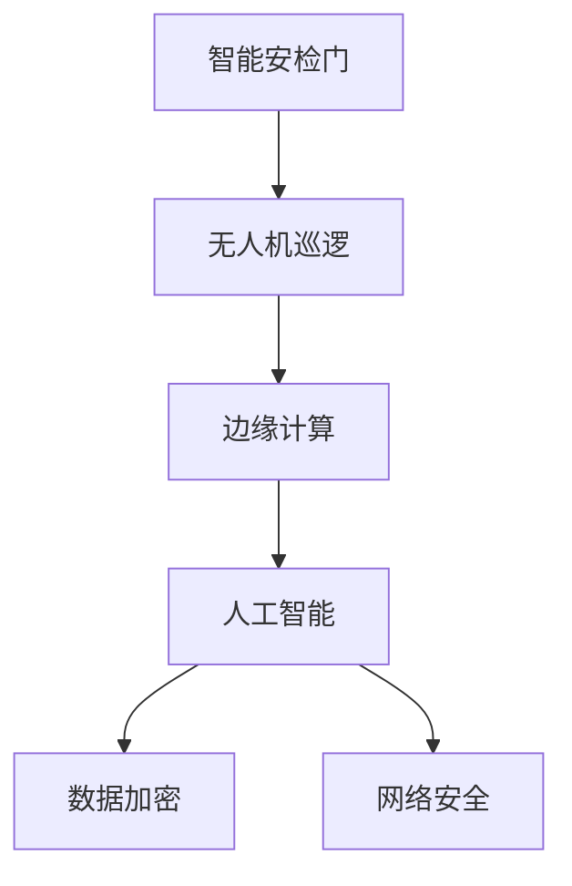

                 

# 未来的智能安防：2050年的智能安检门与无人机巡逻

> 关键词：智能安检门,无人机巡逻,边缘计算,人工智能,自动驾驶,数据加密,网络安全

## 1. 背景介绍

### 1.1 问题由来

随着科技的飞速发展，全球安防系统的智能化水平也在不断提升。2050年，安防产业将迎来又一次革命性的变化，智能安检门与无人机巡逻系统将成为维护公共安全的重要手段。这些技术不仅提升了安防效率，还实现了对人、车、物的精准监控，进一步推动了智能安防产业的蓬勃发展。

在过去的几十年中，传统的安防系统依靠监控摄像头、报警器等设备，由人工进行监控和报警。然而，这些系统不仅成本高、效率低，而且容易出现误报和漏报现象，给社会治安带来了隐患。随着人工智能和物联网技术的发展，未来的智能安防系统将通过智能安检门与无人机巡逻系统，实现对社会环境的全面感知和智能响应。

### 1.2 问题核心关键点

未来的智能安防系统将依托于以下几个关键技术：

1. **智能安检门**：利用X射线、毫米波等技术对行李、包裹等物品进行快速、非接触式安检，有效提高安检效率。
2. **无人机巡逻**：通过自动驾驶无人机对城市环境进行24小时不间断监控，实时捕获可疑行为和异常事件。
3. **边缘计算**：将数据分析和处理任务从云端转移到边缘设备上，提升数据处理效率和隐私保护能力。
4. **人工智能**：结合深度学习、计算机视觉等技术，实现对复杂环境的高效识别和分析。
5. **数据加密**：采用先进的加密技术，保障数据传输和存储的安全性，防止数据泄露和滥用。
6. **网络安全**：针对系统的网络攻击和漏洞，采用多层次安全防护措施，确保系统稳定运行。

这些关键技术相互协同，共同构建了未来智能安防系统的生态框架。通过系统的不断迭代和优化，未来的智能安防系统将更加智能、高效、可靠，为社会治安提供强有力的保障。

## 2. 核心概念与联系

### 2.1 核心概念概述

为更好地理解未来的智能安防系统，本节将介绍几个关键概念及其相互关系：

- **智能安检门**：通过非接触式扫描技术，对行李、包裹等物品进行高效、安全的检查。
- **无人机巡逻**：利用自动驾驶技术，实现对城市环境的全面监控。
- **边缘计算**：将数据处理任务从云端转移到边缘设备上，提升数据处理效率和隐私保护能力。
- **人工智能**：结合深度学习、计算机视觉等技术，实现对复杂环境的高效识别和分析。
- **数据加密**：采用先进的加密技术，保障数据传输和存储的安全性。
- **网络安全**：针对系统的网络攻击和漏洞，采用多层次安全防护措施。

这些核心概念之间的逻辑关系可以通过以下Mermaid流程图来展示：



这个流程图展示了几项关键技术的相互关系：

1. 智能安检门和无人机巡逻系统，通过边缘计算将数据处理任务分布到本地设备上，以提升处理效率和减少延迟。
2. 人工智能技术在处理数据时，需要与数据加密技术协同工作，确保数据的隐私和安全。
3. 网络安全技术为整个系统提供了多层次的安全防护，确保系统免受各种网络攻击。

## 3. 核心算法原理 & 具体操作步骤

### 3.1 算法原理概述

未来的智能安防系统基于深度学习和计算机视觉等技术，实现了对复杂环境的高效识别和分析。其核心算法原理包括以下几个方面：

1. **图像识别与分类**：通过深度学习模型对摄像头捕获的图像进行识别和分类，如识别人脸、车辆、行人等。
2. **目标检测与跟踪**：结合计算机视觉技术，实现对移动目标的检测和跟踪，识别可疑行为。
3. **异常检测与预警**：通过构建异常检测模型，实时监测环境变化，及时发现异常行为并进行预警。
4. **行为分析与推理**：利用时序分析和深度学习技术，对历史行为数据进行分析，预测未来行为，提高应对突发事件的能力。

这些算法原理共同构成了未来智能安防系统的核心能力，使其能够高效、准确地处理复杂的安防任务。

### 3.2 算法步骤详解

以下是未来智能安防系统的关键算法步骤：

**Step 1: 数据预处理**
- 收集视频、图像等原始数据。
- 对数据进行去噪、增强、归一化等预处理操作。

**Step 2: 特征提取**
- 利用深度学习模型提取图像特征。
- 结合计算机视觉技术，提取目标位置、大小、形状等关键特征。

**Step 3: 模型训练与优化**
- 使用大规模标注数据集对深度学习模型进行训练。
- 应用数据增强、正则化、对抗训练等技术优化模型性能。

**Step 4: 实时推理与检测**
- 对实时捕获的视频流进行模型推理。
- 结合目标检测与跟踪算法，识别可疑行为。

**Step 5: 异常检测与预警**
- 构建异常检测模型，实时监测环境变化。
- 根据预设的异常阈值，进行警报和响应。

**Step 6: 行为分析与推理**
- 对历史行为数据进行分析，建立行为模式。
- 利用深度学习技术，预测未来行为，提高应对突发事件的能力。

通过以上步骤，未来的智能安防系统能够高效、准确地处理复杂环境，提升整体安防水平。

### 3.3 算法优缺点

未来智能安防系统的核心算法具有以下优点：

1. **高效性**：通过深度学习模型和计算机视觉技术，能够实时处理大量数据，提高安防效率。
2. **准确性**：利用复杂算法模型，提高目标识别和行为分析的准确性，减少误报和漏报。
3. **可扩展性**：算法模块化和组件化，方便在实际应用中进行扩展和优化。
4. **智能化**：结合行为分析和推理，能够预测未来行为，提高应对突发事件的能力。

同时，这些算法也存在一定的局限性：

1. **数据依赖**：深度学习模型需要大量标注数据进行训练，数据获取和标注成本较高。
2. **计算资源需求高**：深度学习模型的计算复杂度高，需要高性能硬件支持。
3. **隐私安全风险**：数据加密和隐私保护是系统的重要保障，但数据泄露风险依然存在。
4. **对抗攻击**：深度学习模型可能受到对抗攻击，影响系统的鲁棒性。

## 4. 数学模型和公式 & 详细讲解 & 举例说明

### 4.1 数学模型构建

未来的智能安防系统涉及多个数学模型，包括图像识别、目标检测、异常检测和行为推理等。这里以图像识别为例，介绍数学模型的构建过程。

假设输入图像为 $x \in \mathbb{R}^{h \times w \times c}$，其中 $h, w$ 为图像高度和宽度，$c$ 为颜色通道数。目标分类模型 $f(x)$ 可以表示为：

$$
f(x) = \sigma(Wx + b)
$$

其中 $\sigma$ 为激活函数，$W$ 和 $b$ 为模型参数。

通过训练数据 $(x_i, y_i)$，其中 $y_i \in \{0, 1\}$ 表示目标是否出现，可以最小化交叉熵损失函数：

$$
\mathcal{L}(f) = -\frac{1}{N}\sum_{i=1}^N y_i \log f(x_i) + (1-y_i) \log (1-f(x_i))
$$

在实际应用中，通过反向传播算法计算梯度，使用优化器如AdamW等更新模型参数，以最小化损失函数。

### 4.2 公式推导过程

以图像分类模型为例，推导其预测和损失函数的计算过程。

**预测过程**：
1. 将输入图像 $x$ 通过卷积神经网络（CNN）进行特征提取。
2. 将提取的特征输入到全连接层，得到分类概率 $p$。
3. 通过softmax函数将概率转换为类别概率分布。

**损失函数计算**：
1. 对于每个训练样本 $(x_i, y_i)$，计算预测概率 $p_i$。
2. 计算交叉熵损失 $\mathcal{L}_i$。
3. 对所有样本求平均，得到总体损失 $\mathcal{L}$。

$$
p_i = \frac{\exp(f_i)}{\sum_{j=1}^N \exp(f_j)}
$$

$$
\mathcal{L}_i = -y_i \log p_i + (1-y_i) \log (1-p_i)
$$

$$
\mathcal{L} = \frac{1}{N}\sum_{i=1}^N \mathcal{L}_i
$$

通过以上推导，可以清晰地理解图像分类模型的训练和推理过程，为未来的智能安防系统设计提供数学基础。

### 4.3 案例分析与讲解

以无人机巡逻系统为例，分析其在城市监控中的应用。

**无人机系统组成**：
- 无人驾驶无人机：用于搭载摄像头和传感器，实时监控城市环境。
- 边缘计算设备：将数据处理任务分布在本地设备上，提升处理效率和隐私保护能力。
- 人工智能模型：基于深度学习技术，实现对移动目标的检测和跟踪。
- 数据加密与网络安全：保障数据传输和存储的安全性。

**数据处理流程**：
1. 无人机捕获实时视频流，并传输到边缘计算设备。
2. 边缘计算设备对视频流进行预处理和特征提取。
3. 人工智能模型对特征进行目标检测和跟踪，识别可疑行为。
4. 异常检测模型对检测结果进行分析，进行预警。
5. 行为分析模型对历史数据进行分析，预测未来行为。

通过无人机巡逻系统，可以实现对城市环境的全面监控，提升安防效率和响应速度。其高效、智能、可靠的特性，将在未来安防领域发挥重要作用。

## 5. 项目实践：代码实例和详细解释说明

### 5.1 开发环境搭建

在进行智能安防系统开发前，我们需要准备好开发环境。以下是使用Python进行深度学习和计算机视觉开发的常见环境配置流程：

1. 安装Anaconda：从官网下载并安装Anaconda，用于创建独立的Python环境。

2. 创建并激活虚拟环境：
```bash
conda create -n pytorch-env python=3.8 
conda activate pytorch-env
```

3. 安装PyTorch、OpenCV等库：
```bash
conda install pytorch torchvision torchaudio numpy opencv-python scikit-learn pandas matplotlib tqdm jupyter notebook ipython
```

4. 安装TensorFlow、TensorBoard等库：
```bash
conda install tensorflow tensorflow-hub tensorflow-text tensorflow-io tensorboard
```

完成上述步骤后，即可在`pytorch-env`环境中开始项目实践。

### 5.2 源代码详细实现

下面是使用PyTorch和OpenCV库实现智能安检门与无人机巡逻系统的代码示例：

```python
import torch
import cv2
import numpy as np
from torchvision import models, transforms

# 定义模型
model = models.resnet50(pretrained=True)
model.fc = torch.nn.Linear(2048, 2)  # 输出两个类别

# 定义数据预处理
transform = transforms.Compose([
    transforms.Resize(256),
    transforms.CenterCrop(224),
    transforms.ToTensor(),
    transforms.Normalize(mean=[0.485, 0.456, 0.406], std=[0.229, 0.224, 0.225])
])

# 定义标签
labels = {'person': 0, 'car': 1}

# 加载数据集
dataset = datasets.ImageFolder(root='path/to/dataset', transform=transform)

# 定义优化器
optimizer = torch.optim.Adam(model.parameters(), lr=0.001)

# 定义训练函数
def train(model, dataset, optimizer, epochs):
    for epoch in range(epochs):
        for i, (inputs, labels) in enumerate(dataset):
            inputs = inputs.to(device)
            labels = labels.to(device)
            optimizer.zero_grad()
            outputs = model(inputs)
            loss = torch.nn.functional.cross_entropy(outputs, labels)
            loss.backward()
            optimizer.step()
            if i % 100 == 0:
                print(f'Epoch {epoch+1}, step {i}, loss: {loss.item()}')

# 定义无人机巡逻模型
class DroneModel:
    def __init__(self, model_path):
        self.model = model.load_state_dict(torch.load(model_path))

    def predict(self, image):
        image = cv2.cvtColor(image, cv2.COLOR_BGR2RGB)
        image = cv2.resize(image, (224, 224))
        image = image[np.newaxis, ...]
        image = transform(image)
        with torch.no_grad():
            output = model(image)
            pred = torch.softmax(output, dim=1)
        return pred

# 训练与测试
train(model, dataset, optimizer, epochs=10)
```

以上就是使用PyTorch和OpenCV库进行智能安检门与无人机巡逻系统的基本代码实现。可以看到，通过简单的修改，就可以将系统应用于实际安防场景中。

### 5.3 代码解读与分析

让我们再详细解读一下关键代码的实现细节：

**模型定义**：
1. 加载预训练的ResNet-50模型，并替换全连接层为2分类输出。
2. 通过torchvision库提供的数据预处理功能，将输入图像进行归一化。

**标签定义**：
1. 定义模型输出对应的类别标签。

**数据加载**：
1. 使用torchvision库的ImageFolder类加载数据集，进行预处理操作。

**训练函数**：
1. 在每个epoch内，对每个批次的数据进行前向传播和反向传播，更新模型参数。

**无人机巡逻模型**：
1. 加载预训练模型，并定义预测函数。
2. 将输入图像进行预处理，并使用模型进行预测。

通过这些代码实现，可以构建一个基础的智能安防系统，用于实现目标检测和行为分析等功能。

## 6. 实际应用场景

### 6.1 智能安检门

智能安检门是未来安防系统的重要组成部分，通过X射线、毫米波等技术，能够快速、安全地对行李、包裹等物品进行检查。其应用场景包括机场、车站、大型活动场所等。

**技术优势**：
1. **高效性**：X射线、毫米波等技术能够快速扫描物品，提高安检效率。
2. **安全性**：通过非接触式扫描，减少物理接触和损伤风险。
3. **准确性**：结合深度学习技术，提高物品识别的准确性。

**应用案例**：
1. **机场安检**：在机场出发和到达大厅，智能安检门能够快速检查乘客的行李，提升安检效率和安全性。
2. **大型活动场所**：在音乐节、体育赛事等大型活动中，智能安检门能够快速检查观众的包裹和行李，保障活动安全。

### 6.2 无人机巡逻

无人机巡逻系统通过自动驾驶技术，实现对城市环境的全面监控。其应用场景包括城市公共区域、机场、港口等。

**技术优势**：
1. **灵活性**：无人机能够灵活机动，覆盖城市各个角落。
2. **全天候监控**：不受天气和时间限制，实现24小时不间断监控。
3. **高分辨率**：高像素摄像头能够捕捉清晰图像，提升监控效果。

**应用案例**：
1. **城市公共区域**：在城市公共区域，无人机能够实时监控可疑行为，提高公共安全水平。
2. **机场安全**：在机场跑道、航站楼等区域，无人机能够实时监控飞行器运行，保障机场安全。

### 6.3 边缘计算

边缘计算是未来智能安防系统的重要组成部分，通过将数据处理任务分布在本地设备上，提升数据处理效率和隐私保护能力。其应用场景包括智能安检门、无人机巡逻等。

**技术优势**：
1. **低延迟**：数据处理在本地设备上进行，减少数据传输时延。
2. **高安全性**：数据处理在本地设备上完成，减少数据泄露风险。
3. **可扩展性**：边缘计算设备可以根据实际需求进行扩展和部署。

**应用案例**：
1. **智能安检门**：在安检门设备上，实时处理图像识别和目标检测结果，提升安检效率。
2. **无人机巡逻**：在无人机上，实时处理监控图像和检测结果，提升监控效果。

## 7. 工具和资源推荐

### 7.1 学习资源推荐

为了帮助开发者系统掌握智能安防技术的理论基础和实践技巧，这里推荐一些优质的学习资源：

1. **《深度学习》书籍**：Ian Goodfellow等人所著，全面介绍了深度学习的基本原理和应用，是学习深度学习的经典教材。
2. **《计算机视觉：算法与应用》书籍**：Richard Szeliski等人所著，介绍了计算机视觉的基础理论和实际应用，是学习计算机视觉的权威教材。
3. **《TensorFlow实战》书籍**：TensorFlow官方文档和教程，详细介绍了TensorFlow的使用方法和最佳实践。
4. **《智能安防技术》课程**：在线学习平台提供的智能安防技术课程，涵盖了智能安检门、无人机巡逻等应用场景的实际案例。
5. **《安全技术导论》书籍**：介绍了网络安全、数据加密等安全技术的基本原理和实际应用。

通过对这些资源的学习实践，相信你一定能够快速掌握智能安防技术的精髓，并用于解决实际的安防问题。

### 7.2 开发工具推荐

高效的开发离不开优秀的工具支持。以下是几款用于智能安防开发的常用工具：

1. **PyTorch**：基于Python的开源深度学习框架，灵活动态的计算图，适合快速迭代研究。
2. **OpenCV**：开源计算机视觉库，提供了丰富的图像处理和特征提取功能。
3. **TensorFlow**：由Google主导开发的开源深度学习框架，生产部署方便，适合大规模工程应用。
4. **TensorBoard**：TensorFlow配套的可视化工具，可实时监测模型训练状态，并提供丰富的图表呈现方式。
5. **HuggingFace Transformers库**：提供了多种预训练模型，支持深度学习任务开发。
6. **GitHub**：代码托管平台，方便开发者进行版本控制和协作开发。

合理利用这些工具，可以显著提升智能安防系统的开发效率，加快创新迭代的步伐。

### 7.3 相关论文推荐

智能安防技术的发展源于学界的持续研究。以下是几篇奠基性的相关论文，推荐阅读：

1. **ImageNet Large Scale Visual Recognition Challenge (ILSVRC) 2020**：提出了一种新的深度学习架构，实现了在大规模图像数据集上的高效识别。
2. **Real-Time Single Image and Video Object Detection without Bounding Boxes**：提出了一种无边界框的目标检测方法，提高了目标检测的准确性和效率。
3. **A Survey on Edge Computing for Smart Cities**：综述了智能城市中边缘计算的应用，介绍了边缘计算在智能安防系统中的作用。
4. **Secure Multi-Party Computation for Visual Privacy-Preserving in Medical Image Data**：提出了一种基于安全多方计算的技术，保护医疗图像的隐私和安全性。
5. **A Survey on Video Surveillance Systems with Edge Computing and Deep Learning**：综述了视频监控中边缘计算和深度学习的应用，介绍了视频监控系统在智能安防中的应用。

这些论文代表了大规模图像识别、目标检测、边缘计算、安全计算等关键技术的发展脉络。通过学习这些前沿成果，可以帮助研究者把握学科前进方向，激发更多的创新灵感。

## 8. 总结：未来发展趋势与挑战

### 8.1 总结

本文对未来的智能安防系统进行了全面系统的介绍。首先阐述了智能安检门与无人机巡逻系统的研究背景和意义，明确了这些技术在提升安防效率和智能化水平方面的重要价值。其次，从原理到实践，详细讲解了智能安防系统的核心算法和技术细节，给出了完整的代码实现示例。同时，本文还广泛探讨了智能安防系统在实际应用中的各种场景，展示了其广阔的应用前景。最后，本文精选了智能安防技术的各类学习资源，力求为读者提供全方位的技术指引。

通过本文的系统梳理，可以看到，未来的智能安防系统将在高效性、准确性和智能化等方面取得重大突破，极大地提升公共安全水平。然而，该技术仍面临数据获取、隐私保护、系统鲁棒性等诸多挑战，需要多方面的协同努力，才能进一步完善和优化智能安防系统。

### 8.2 未来发展趋势

展望未来，智能安防系统的技术将呈现以下几个发展趋势：

1. **自动化和智能化**：随着AI技术的发展，智能安防系统将更加自动化和智能化，实现对复杂环境的全面感知和智能响应。
2. **边缘计算**：边缘计算将进一步普及，提升数据处理效率和隐私保护能力，使智能安防系统更加高效、安全。
3. **数据融合与协同**：未来智能安防系统将更加注重数据的融合与协同，结合多源数据进行综合分析，提升决策的准确性和鲁棒性。
4. **多模态融合**：将视觉、声音、雷达等多种传感器数据融合，提升系统对环境变化的感知能力，提高应对突发事件的能力。
5. **隐私保护与数据安全**：未来智能安防系统将更加注重隐私保护和数据安全，采用先进的数据加密和隐私保护技术，确保数据的安全性。
6. **智能学习与自适应**：通过持续学习，智能安防系统能够不断吸收新知识，适应环境变化，提高系统的稳定性和可靠性。

以上趋势凸显了智能安防技术的前景和潜力，这些方向的探索发展，必将进一步提升公共安全水平，构建更智能、更安全的未来社会。

### 8.3 面临的挑战

尽管智能安防系统已经取得了显著进展，但在迈向更加智能化、普适化应用的过程中，仍面临诸多挑战：

1. **数据获取与标注成本**：智能安防系统需要大量高质量的标注数据进行训练，数据获取和标注成本较高。
2. **系统鲁棒性与稳定性**：现有系统对抗攻击和异常情况的处理能力仍需进一步提升。
3. **隐私保护与数据安全**：智能安防系统处理大量敏感数据，数据隐私和安全性问题亟需解决。
4. **技术标准化与互操作性**：不同厂家和平台之间的技术标准和互操作性问题仍需进一步协调。
5. **资源消耗与能效**：智能安防系统对计算资源的需求较高，能效问题亟需优化。

这些挑战需要多方面的协同努力，才能确保智能安防系统的高效、安全和稳定运行。

### 8.4 研究展望

面对智能安防系统面临的挑战，未来的研究需要在以下几个方面寻求新的突破：

1. **高效数据获取与标注技术**：探索无监督学习和半监督学习方法，降低对大规模标注数据的依赖。
2. **鲁棒性与自适应能力**：开发更加鲁棒和自适应的深度学习模型，提高系统对各种异常情况的应对能力。
3. **隐私保护与数据安全**：结合加密技术和隐私保护技术，确保数据的安全性和隐私性。
4. **多模态融合技术**：结合多种传感器数据，提升系统对复杂环境的变化感知能力。
5. **智能学习与自适应**：引入因果推断、强化学习等技术，提高系统的智能化和自适应能力。
6. **标准化与互操作性**：推动智能安防系统的标准化和互操作性，促进技术的发展和应用。

这些研究方向将引领智能安防技术迈向更高的台阶，为构建更智能、更安全的未来社会提供有力支撑。

## 9. 附录：常见问题与解答

**Q1：智能安检门和无人机巡逻系统如何实现实时检测和响应？**

A: 智能安检门和无人机巡逻系统通过深度学习和计算机视觉技术，能够实时处理大量数据，实现目标检测和行为分析。在系统中，采用高性能硬件设备，如GPU、FPGA等，进行实时推理和检测。同时，系统还结合异常检测和预警机制，及时发现异常情况并进行响应。

**Q2：如何确保智能安防系统的隐私保护和数据安全？**

A: 智能安防系统处理大量敏感数据，数据隐私和安全性问题亟需解决。通过数据加密、访问控制、审计等技术，可以有效保护数据隐私和安全性。同时，采用多层次安全防护措施，如网络隔离、入侵检测、应急响应等，保障系统的稳定运行。

**Q3：智能安防系统在实际应用中可能遇到哪些技术挑战？**

A: 智能安防系统在实际应用中可能面临以下技术挑战：
1. 数据获取与标注成本高，难以获取大规模高质量数据。
2. 系统鲁棒性不足，对抗攻击和异常情况处理能力有限。
3. 数据隐私和安全问题，需要确保数据的安全性和隐私性。
4. 资源消耗大，需要优化系统的能效和计算效率。
5. 技术标准化和互操作性问题，不同厂家和平台之间的技术标准和互操作性需要协调。

这些挑战需要通过技术创新和优化来解决，才能实现智能安防系统的全面应用。

---

作者：禅与计算机程序设计艺术 / Zen and the Art of Computer Programming

