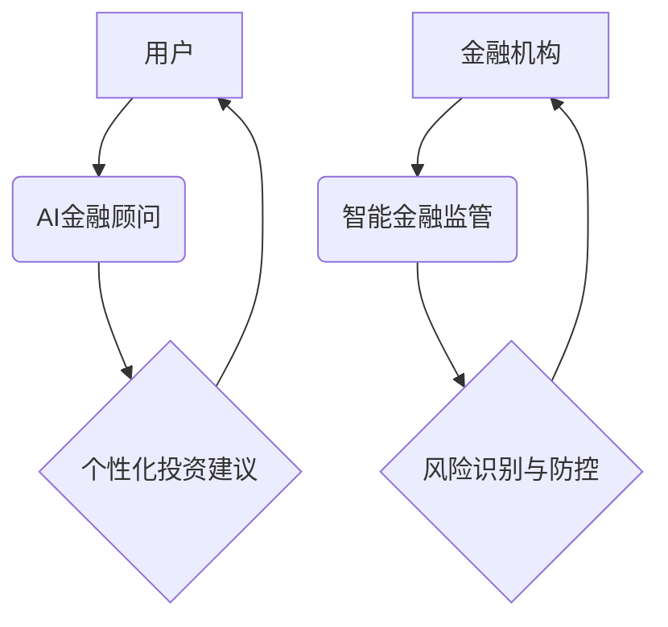

> AI金融顾问,智能金融监管,机器学习,深度学习,自然语言处理,风险管理,金融科技,区块链

## 1. 背景介绍

金融行业正在经历一场由人工智能（AI）驱动的变革。从传统的银行业务到复杂的投资策略，AI技术正在改变着金融服务的面貌。随着技术的不断发展，我们预计到2050年，AI将彻底改变金融行业，为个人和企业提供更加智能、个性化和高效的金融服务。

**1.1. AI在金融行业的应用现状**

目前，AI在金融行业已得到广泛应用，例如：

* **风险管理:** AI算法可以分析海量数据，识别潜在的风险，并帮助金融机构制定更有效的风险管理策略。
* **欺诈检测:** AI可以识别异常交易模式，帮助金融机构预防和打击欺诈行为。
* **客户服务:** AI驱动的聊天机器人可以提供24/7的客户服务，解答客户疑问，处理简单的交易请求。
* **投资管理:** AI算法可以分析市场数据，识别投资机会，并帮助投资者制定个性化的投资组合。

**1.2. AI金融的未来趋势**

未来，AI在金融行业的应用将更加深入和广泛，主要趋势包括：

* **更智能的金融顾问:** AI金融顾问将能够提供更加个性化、精准的理财建议，并根据用户的风险偏好和财务目标动态调整投资策略。
* **更强大的智能监管:** AI将帮助监管机构更加高效地识别和应对金融风险，并提高监管的透明度和效率。
* **更便捷的金融服务:** AI将推动金融服务的数字化转型，提供更加便捷、高效的金融体验。

## 2. 核心概念与联系

**2.1. AI金融顾问**

AI金融顾问是一种利用人工智能技术为个人和企业提供理财建议的智能系统。它可以分析用户的财务状况、风险偏好、投资目标等信息，并根据这些信息提供个性化的投资建议。

**2.2. 智能金融监管**

智能金融监管是指利用人工智能技术加强金融监管，识别和应对金融风险。它可以分析海量金融数据，识别异常交易模式，预测潜在的金融风险，并帮助监管机构制定更有效的监管策略。

**2.3. 核心概念联系**

AI金融顾问和智能金融监管是两个相互关联的概念。AI金融顾问可以帮助个人和企业更好地管理自己的财务，而智能金融监管可以确保金融市场运行的稳定和安全。两者共同作用，可以促进金融行业的健康发展。

**2.4. 核心概念架构**



## 3. 核心算法原理 & 具体操作步骤

**3.1. 算法原理概述**

AI金融顾问和智能金融监管的核心算法原理主要包括：

* **机器学习:** 机器学习算法可以从数据中学习，识别模式，并做出预测。
* **深度学习:** 深度学习算法是一种更高级的机器学习算法，它可以处理更加复杂的数据，并获得更准确的预测结果。
* **自然语言处理:** 自然语言处理算法可以理解和处理人类语言，例如文本和语音。

**3.2. 算法步骤详解**

**3.2.1. 数据收集与预处理**

首先，需要收集大量的金融数据，例如用户财务状况、市场数据、交易记录等。然后，需要对这些数据进行预处理，例如清洗、转换、归一化等，以便于算法训练。

**3.2.2. 模型训练**

使用机器学习或深度学习算法对预处理后的数据进行训练，训练出一个能够预测用户投资需求或识别金融风险的模型。

**3.2.3. 模型评估与优化**

对训练好的模型进行评估，例如使用准确率、召回率等指标来衡量模型的性能。根据评估结果，对模型进行优化，例如调整算法参数、增加训练数据等。

**3.2.4. 模型部署与应用**

将训练好的模型部署到生产环境中，并将其应用于实际的金融服务中，例如为用户提供个性化的投资建议或帮助监管机构识别金融风险。

**3.3. 算法优缺点**

**优点:**

* **自动化:** AI算法可以自动化许多金融任务，例如风险评估、欺诈检测、客户服务等，提高效率和准确性。
* **个性化:** AI算法可以根据用户的个人情况提供个性化的服务，例如定制化的投资建议。
* **数据驱动:** AI算法基于数据分析，可以帮助金融机构做出更明智的决策。

**缺点:**

* **数据依赖:** AI算法需要大量的训练数据，如果数据质量不高，算法性能将受到影响。
* **解释性:** 一些AI算法的决策过程难以解释，这可能会导致用户缺乏信任。
* **伦理风险:** AI算法可能存在偏见或歧视，需要谨慎使用，并制定相应的伦理规范。

**3.4. 算法应用领域**

AI算法在金融行业的应用领域非常广泛，例如：

* **风险管理:** 识别和评估金融风险，例如信用风险、市场风险、操作风险等。
* **欺诈检测:** 检测和预防金融欺诈行为，例如信用卡欺诈、网络钓鱼等。
* **客户服务:** 提供24/7的客户服务，解答客户疑问，处理简单的交易请求。
* **投资管理:** 分析市场数据，识别投资机会，并帮助投资者制定个性化的投资组合。
* **贷款审批:** 自动化贷款审批流程，提高审批效率和准确性。

## 4. 数学模型和公式 & 详细讲解 & 举例说明

**4.1. 数学模型构建**

在AI金融顾问中，常用的数学模型包括：

* **线性回归模型:** 用于预测连续变量，例如用户的投资收益。
* **逻辑回归模型:** 用于预测分类变量，例如用户的投资风险等级。
* **支持向量机模型:** 用于分类和回归问题，可以处理高维数据。
* **决策树模型:** 用于分类和回归问题，可以解释模型决策过程。

**4.2. 公式推导过程**

例如，线性回归模型的公式如下：

$$y = \beta_0 + \beta_1x_1 + \beta_2x_2 + ... + \beta_nx_n + \epsilon$$

其中：

* $y$ 是预测变量
* $x_1, x_2, ..., x_n$ 是自变量
* $\beta_0, \beta_1, \beta_2, ..., \beta_n$ 是模型参数
* $\epsilon$ 是误差项

模型参数可以通过最小二乘法估计。

**4.3. 案例分析与讲解**

假设我们想要预测用户的投资收益，我们可以使用线性回归模型。

* 自变量包括用户的年龄、收入、投资经验等。
* 预测变量是用户的投资收益。

通过训练模型，我们可以得到模型参数，并使用这些参数预测用户的投资收益。

## 5. 项目实践：代码实例和详细解释说明

**5.1. 开发环境搭建**

* 操作系统: Ubuntu 20.04
* Python 版本: 3.8
* 必要的库: pandas, numpy, scikit-learn, matplotlib

**5.2. 源代码详细实现**

```python
import pandas as pd
from sklearn.linear_model import LinearRegression
from sklearn.model_selection import train_test_split
from sklearn.metrics import mean_squared_error

# 加载数据
data = pd.read_csv('investment_data.csv')

# 选择特征和目标变量
X = data[['age', 'income', 'experience']]
y = data['return']

# 将数据分成训练集和测试集
X_train, X_test, y_train, y_test = train_test_split(X, y, test_size=0.2, random_state=42)

# 创建线性回归模型
model = LinearRegression()

# 训练模型
model.fit(X_train, y_train)

# 预测测试集数据
y_pred = model.predict(X_test)

# 计算模型性能
mse = mean_squared_error(y_test, y_pred)
print(f'Mean Squared Error: {mse}')

# 可视化预测结果
import matplotlib.pyplot as plt
plt.scatter(y_test, y_pred)
plt.xlabel('Actual Return')
plt.ylabel('Predicted Return')
plt.title('Actual vs Predicted Return')
plt.show()
```

**5.3. 代码解读与分析**

* 首先，我们加载数据，选择特征和目标变量。
* 然后，我们将数据分成训练集和测试集。
* 接下来，我们创建线性回归模型，并使用训练集训练模型。
* 然后，我们使用训练好的模型预测测试集数据。
* 最后，我们计算模型性能，并可视化预测结果。

**5.4. 运行结果展示**

运行代码后，会输出模型的均方误差值，以及实际值与预测值的散点图。

## 6. 实际应用场景

**6.1. 个人理财顾问**

AI金融顾问可以帮助个人用户制定个性化的理财计划，根据用户的风险偏好、投资目标和财务状况，提供定制化的投资建议。

**6.2. 企业投资决策**

AI金融顾问可以帮助企业分析市场数据，识别投资机会，并制定更加科学、高效的投资决策。

**6.3. 智能风险管理**

AI可以帮助金融机构识别和评估各种金融风险，例如信用风险、市场风险、操作风险等，并制定相应的风险管理策略。

**6.4. 未来应用展望**

未来，AI金融顾问和智能金融监管将更加智能化、个性化和高效化。例如：

* **更深入的个性化服务:** AI金融顾问将能够更加深入地了解用户的需求和偏好，提供更加精准的理财建议。
* **更强大的风险管理能力:** AI将能够识别更加复杂的金融风险，并帮助金融机构制定更加有效的风险管理策略。
* **更便捷的金融服务体验:** AI将推动金融服务的数字化转型，提供更加便捷、高效的金融体验。

## 7. 工具和资源推荐

**7.1. 学习资源推荐**

* **在线课程:** Coursera, edX, Udacity 等平台提供许多关于AI和金融的在线课程。
* **书籍:** 《深度学习》、《机器学习实战》等书籍可以帮助你深入了解AI技术。
* **博客和论坛:** 许多AI和金融领域的博客和论坛可以提供最新的技术资讯和讨论。

**7.2. 开发工具推荐**

* **Python:** Python 是AI开发最常用的编程语言。
* **TensorFlow:** TensorFlow 是一个开源的机器学习框架。
* **PyTorch:** PyTorch 是另一个流行的机器学习框架。
* **Scikit-learn:** Scikit-learn 是一个用于机器学习的Python库。

**7.3. 相关论文推荐**

* **Attention Is All You Need:** https://arxiv.org/abs/1706.03762
* **BERT: Pre-training of Deep Bidirectional Transformers for Language Understanding:** https://arxiv.org/abs/1810.04805
* **Generative Adversarial Networks:** https://arxiv.org/abs/1406.2661

## 8. 总结：未来发展趋势与挑战

**8.1. 研究成果总结**

近年来，AI在金融领域的应用取得了显著进展，例如：

* **风险管理:** AI算法可以识别和评估各种金融风险，帮助金融机构制定更加有效的风险管理策略。
* **欺诈检测:** AI算法可以检测和预防金融欺诈行为，例如信用卡欺诈、网络钓鱼等。
* **客户服务:** AI驱动的聊天机器人可以提供24/7的客户服务，解答客户疑问，处理简单的交易请求。

**8.2. 未来发展趋势**

未来，AI在金融领域的应用将更加深入和广泛，主要趋势包括：