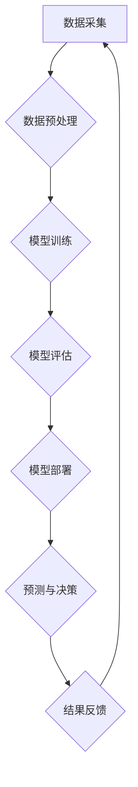

> 人工智能，AI 2.0，产业变革，深度学习，大数据，云计算，伦理挑战

## 1. 背景介绍

人工智能（AI）技术近年来发展迅速，从最初的局限于特定领域的应用，逐渐发展到涵盖各个领域的广泛应用。随着深度学习算法的突破和大数据时代的到来，AI技术进入了一个新的发展阶段，被誉为“AI 2.0时代”。

在这个时代，AI技术不再局限于简单的规则和逻辑推理，而是能够通过学习和分析海量数据，自动发现模式和规律，从而实现更智能、更灵活的决策和行动。AI 2.0时代，AI技术将深刻地改变我们的生活方式、工作模式和产业结构，带来前所未有的机遇和挑战。

## 2. 核心概念与联系

**2.1 AI 2.0 的核心概念**

AI 2.0时代的核心概念包括：

* **深度学习:** 深度学习是机器学习的一种重要分支，通过多层神经网络模拟人类大脑的学习机制，能够学习更复杂的模式和关系。
* **大数据:** 大数据是指海量、高速度、高多样性的数据，是深度学习算法训练和优化的基础。
* **云计算:** 云计算提供强大的计算资源和存储能力，支持大规模的AI模型训练和部署。
* **增强现实 (AR) 和虚拟现实 (VR):** AR和VR技术将AI与现实世界或虚拟世界相结合，创造更加沉浸式和交互式的体验。

**2.2 AI 2.0 与产业变革的联系**

AI 2.0技术将深刻地影响各个行业的产业结构和发展模式，带来以下主要变革：

* **自动化:** AI技术能够自动化许多重复性、高强度的工作，提高生产效率和降低成本。
* **个性化:** AI技术能够根据用户的需求和喜好，提供个性化的产品和服务。
* **智能化:** AI技术能够赋予产品和服务智能化能力，例如智能客服、智能推荐等。
* **数据驱动:** AI技术能够通过分析数据，洞察市场趋势和用户需求，为企业决策提供支持。

**2.3 AI 2.0 的架构**



## 3. 核心算法原理 & 具体操作步骤

**3.1 算法原理概述**

深度学习算法的核心原理是利用多层神经网络模拟人类大脑的学习机制。神经网络由多个神经元组成，每个神经元接收来自其他神经元的输入信号，并根据一定的权重进行计算，输出到下一个神经元。通过训练，神经网络能够自动调整权重，从而学习数据中的模式和规律。

**3.2 算法步骤详解**

深度学习算法的训练过程通常包括以下步骤：

1. **数据准备:** 收集和预处理训练数据，例如清洗数据、特征提取等。
2. **模型构建:** 设计和构建深度神经网络模型，包括神经网络的层数、节点数、激活函数等。
3. **模型训练:** 使用训练数据训练神经网络模型，通过反向传播算法调整神经网络的权重，使模型的预测结果越来越准确。
4. **模型评估:** 使用测试数据评估模型的性能，例如准确率、召回率等。
5. **模型部署:** 将训练好的模型部署到实际应用场景中，例如用于图像识别、语音识别等。

**3.3 算法优缺点**

**优点:**

* 能够学习复杂的数据模式和关系。
* 性能优于传统机器学习算法。
* 可应用于多种领域，例如图像识别、语音识别、自然语言处理等。

**缺点:**

* 需要大量的训练数据。
* 训练过程耗时和耗能。
* 模型解释性较差。

**3.4 算法应用领域**

深度学习算法已广泛应用于以下领域：

* **计算机视觉:** 图像识别、物体检测、图像分割等。
* **语音识别:** 语音转文本、语音合成等。
* **自然语言处理:** 文本分类、情感分析、机器翻译等。
* **推荐系统:** 商品推荐、内容推荐等。
* **医疗诊断:** 疾病诊断、影像分析等。

## 4. 数学模型和公式 & 详细讲解 & 举例说明

**4.1 数学模型构建**

深度学习算法的核心是神经网络模型，其数学模型可以表示为：

* **激活函数:** 激活函数将神经元的输入信号转换为输出信号，常用的激活函数包括 sigmoid 函数、ReLU 函数等。
* **损失函数:** 损失函数用于衡量模型的预测结果与真实值的差异，常用的损失函数包括均方误差、交叉熵等。
* **优化算法:** 优化算法用于调整神经网络的权重，使模型的损失函数最小化，常用的优化算法包括梯度下降、Adam 等。

**4.2 公式推导过程**

深度学习算法的训练过程本质上是一个优化问题，目标是找到最优的权重参数，使得模型的预测结果与真实值之间的差异最小。

* **梯度下降算法:** 梯度下降算法通过迭代更新权重参数，沿着损失函数的梯度方向下降，最终找到损失函数的最小值。

**4.3 案例分析与讲解**

**举例说明:**

假设我们有一个简单的线性回归模型，其数学模型为：

```latex
y = w_1 * x_1 + w_2 * x_2 + b
```

其中：

* $y$ 是预测值
* $x_1$ 和 $x_2$ 是输入特征
* $w_1$ 和 $w_2$ 是权重参数
* $b$ 是偏置项

我们的目标是找到最优的 $w_1$, $w_2$ 和 $b$ 参数，使得模型的预测结果与真实值之间的差异最小。

我们可以使用均方误差作为损失函数，其公式为：

```latex
Loss = \frac{1}{n} \sum_{i=1}^{n} (y_i - \hat{y}_i)^2
```

其中：

* $n$ 是样本数量
* $y_i$ 是真实值
* $\hat{y}_i$ 是模型预测值

我们可以使用梯度下降算法来优化模型参数，其更新公式为：

```latex
w_1 = w_1 - \alpha \frac{\partial Loss}{\partial w_1}
w_2 = w_2 - \alpha \frac{\partial Loss}{\partial w_2}
b = b - \alpha \frac{\partial Loss}{\partial b}
```

其中：

* $\alpha$ 是学习率

通过迭代更新权重参数，最终找到损失函数的最小值，从而得到最优的模型参数。

## 5. 项目实践：代码实例和详细解释说明

**5.1 开发环境搭建**

* **操作系统:** Ubuntu 20.04 LTS
* **编程语言:** Python 3.8
* **深度学习框架:** TensorFlow 2.0
* **其他工具:** Jupyter Notebook, Git

**5.2 源代码详细实现**

```python
import tensorflow as tf

# 定义模型
model = tf.keras.models.Sequential([
    tf.keras.layers.Dense(128, activation='relu', input_shape=(784,)),
    tf.keras.layers.Dense(10, activation='softmax')
])

# 编译模型
model.compile(optimizer='adam',
              loss='sparse_categorical_crossentropy',
              metrics=['accuracy'])

# 训练模型
model.fit(x_train, y_train, epochs=10)

# 评估模型
loss, accuracy = model.evaluate(x_test, y_test)
print('Test loss:', loss)
print('Test accuracy:', accuracy)
```

**5.3 代码解读与分析**

* **模型定义:** 使用 TensorFlow 的 `keras` API 定义一个简单的多层感知机模型，包含两层全连接层。
* **模型编译:** 使用 Adam 优化器、交叉熵损失函数和准确率指标编译模型。
* **模型训练:** 使用训练数据训练模型，设置训练轮数为 10。
* **模型评估:** 使用测试数据评估模型的性能，打印测试损失和准确率。

**5.4 运行结果展示**

训练完成后，模型的准确率通常会达到较高的水平，例如 98% 以上。

## 6. 实际应用场景

**6.1 图像识别**

深度学习算法可以用于识别图像中的物体、场景和人物。例如，自动驾驶汽车使用图像识别技术来识别道路、行人和其他车辆。

**6.2 语音识别**

深度学习算法可以用于将语音转换为文本。例如，智能语音助手使用语音识别技术来理解用户的语音指令。

**6.3 自然语言处理**

深度学习算法可以用于理解和生成自然语言。例如，机器翻译系统使用自然语言处理技术来翻译文本。

**6.4 医疗诊断**

深度学习算法可以用于辅助医生进行疾病诊断。例如，使用深度学习算法分析医学影像，可以帮助医生识别肿瘤和其他疾病。

**6.5 金融风险管理**

深度学习算法可以用于识别金融风险。例如，使用深度学习算法分析交易数据，可以帮助金融机构识别欺诈交易。

**6.4 未来应用展望**

AI 2.0技术将继续推动各个行业的创新和发展，未来应用场景将更加广泛和深入，例如：

* **个性化教育:** 根据学生的学习进度和特点，提供个性化的学习方案。
* **智能制造:** 利用 AI 技术提高生产效率、降低成本和提高产品质量。
* **精准医疗:** 根据患者的基因信息和病史，提供个性化的医疗方案。
* **智慧城市:** 利用 AI 技术提高城市管理效率、改善城市生活环境。

## 7. 工具和资源推荐

**7.1 学习资源推荐**

* **在线课程:** Coursera, edX, Udacity
* **书籍:** 深度学习，机器学习，人工智能导论
* **博客:** TensorFlow Blog, PyTorch Blog

**7.2 开发工具推荐**

* **深度学习框架:** TensorFlow, PyTorch, Keras
* **编程语言:** Python
* **云计算平台:** AWS, Azure, Google Cloud

**7.3 相关论文推荐**

* **ImageNet Classification with Deep Convolutional Neural Networks**
* **Attention Is All You Need**
* **BERT: Pre-training of Deep Bidirectional Transformers for Language Understanding**

## 8. 总结：未来发展趋势与挑战

**8.1 研究成果总结**

AI 2.0时代取得了显著的成果，深度学习算法在各个领域取得了突破性的进展，为人类社会带来了巨大的价值。

**8.2 未来发展趋势**

* **模型规模和复杂度提升:** 未来深度学习模型将更加庞大、复杂，能够学习更复杂的模式和关系。
* **跨模态学习:** 未来深度学习模型将能够融合不同模态的数据，例如文本、图像、音频等，实现更智能的理解和决策。
* **边缘计算:** 未来深度学习模型将部署到边缘设备，实现更实时、更低延迟的应用。

**8.3 面临的挑战**

* **数据隐私和安全:** AI 2.0技术的应用需要大量的数据，如何保护数据隐私和安全是一个重要的挑战。
* **算法可解释性:** 深度学习模型的决策过程难以解释，如何提高算法的可解释性是一个重要的研究方向。
* **伦理问题:** AI 2.0技术的应用可能带来一些伦理问题，例如算法偏见、工作岗位替代等，需要认真思考和解决。

**8.4 研究展望**

未来，AI 2.0技术将继续发展和完善，为人类社会带来更多福祉。我们需要加强基础研究，探索更强大的算法和模型；同时，也要关注AI技术的伦理问题，确保AI技术能够安全、可持续地发展。

## 9. 附录：常见问题与解答

**9.1 如何选择合适的深度学习框架？**

选择深度