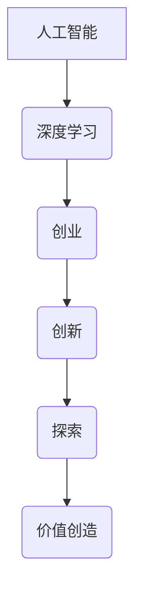

> 人工智能 (AI)
> 深度学习
> 创业
> 创新
> 探索
> 技术发展
> 未来趋势

## 1. 背景介绍

人工智能 (AI) 作为科技发展的重要方向，近年来取得了令人瞩目的进展。从语音识别到图像识别，从自然语言处理到自动驾驶，AI技术正在深刻地改变着我们的生活。李开复，作为一位世界级人工智能专家、程序员、软件架构师、CTO、世界顶级技术畅销书作者和计算机图灵奖获得者，他深谙AI技术的魅力和潜力，并将其应用于创业实践中。

李开复的创业之路充满着探索和创新精神。他创办了多个AI相关公司，致力于将AI技术转化为现实应用，为社会带来价值。他的创业理念是“最兴奋的是探索和创新”，他始终相信AI技术能够解决人类面临的各种挑战，并为人类创造更美好的未来。

## 2. 核心概念与联系

**2.1 人工智能 (AI)**

人工智能 (AI) 是一门致力于构建智能机器的学科。智能机器是指能够像人类一样学习、思考、解决问题和做出决策的机器。AI技术涵盖了多个领域，包括机器学习、深度学习、自然语言处理、计算机视觉等。

**2.2 深度学习 (Deep Learning)**

深度学习是人工智能领域的一个重要分支，它利用多层神经网络来模拟人类大脑的学习过程。深度学习算法能够从海量数据中自动提取特征，并进行复杂的模式识别和预测。

**2.3 创业**

创业是指创办新公司，开发新产品或服务，并将其推向市场。创业需要勇气、创新和执行力。

**2.4 创新**

创新是指创造新的价值，并将其转化为现实。创新可以是产品、服务、流程或商业模式上的创新。

**2.5 探索**

探索是指不断地寻求新的知识、新的想法和新的可能性。探索是创新的源泉，也是人类进步的动力。

**2.6 联系**

李开复将AI技术与创业相结合，致力于探索和创新，为社会带来新的价值。他认为，AI技术能够赋能创业，帮助创业者解决问题、创造价值和实现梦想。



## 3. 核心算法原理 & 具体操作步骤

### 3.1 算法原理概述

深度学习算法的核心是多层神经网络。神经网络由多个节点（神经元）组成，这些节点之间通过连接和权重进行信息传递。通过训练，神经网络能够学习到数据中的模式和特征，并进行预测或分类。

### 3.2 算法步骤详解

1. **数据准备:** 收集和预处理训练数据，将其转换为神经网络可以理解的格式。
2. **网络结构设计:** 根据任务需求设计神经网络的结构，包括层数、节点数和激活函数等。
3. **参数初始化:** 为神经网络的参数（权重和偏置）进行随机初始化。
4. **前向传播:** 将输入数据通过神经网络进行前向传播，得到输出结果。
5. **损失函数计算:** 计算输出结果与真实值的差异，即损失函数的值。
6. **反向传播:** 利用梯度下降算法，反向传播损失函数的梯度，更新神经网络的参数。
7. **迭代训练:** 重复步骤4-6，直到损失函数达到预设的阈值。

### 3.3 算法优缺点

**优点:**

* 能够自动提取特征，无需人工特征工程。
* 能够处理海量数据，学习复杂模式。
* 在图像识别、语音识别、自然语言处理等领域取得了突破性进展。

**缺点:**

* 训练数据量大，计算资源消耗高。
* 训练过程复杂，需要专业知识和经验。
* 模型解释性差，难以理解模型的决策过程。

### 3.4 算法应用领域

深度学习算法广泛应用于各个领域，包括：

* **计算机视觉:** 图像识别、物体检测、图像分割、人脸识别等。
* **语音识别:** 语音转文本、语音助手、语音搜索等。
* **自然语言处理:** 文本分类、情感分析、机器翻译、对话系统等。
* **自动驾驶:** 路线规划、物体检测、决策控制等。
* **医疗诊断:** 影像分析、疾病预测、药物研发等。

## 4. 数学模型和公式 & 详细讲解 & 举例说明

### 4.1 数学模型构建

深度学习算法的核心是神经网络，其数学模型可以表示为多层感知机 (MLP)。MLP由多个层组成，每一层包含多个神经元。每个神经元接收来自上一层的输入信号，并通过激活函数进行处理，输出到下一层。

### 4.2 公式推导过程

**4.2.1 激活函数**

激活函数的作用是将神经元的输入信号转换为输出信号，并引入非线性特性。常用的激活函数包括 sigmoid 函数、ReLU 函数、tanh 函数等。

**sigmoid 函数:**

$$
f(x) = \frac{1}{1 + e^{-x}}
$$

**ReLU 函数:**

$$
f(x) = max(0, x)
$$

**4.2.2 损失函数**

损失函数用于衡量模型预测结果与真实值的差异。常用的损失函数包括均方误差 (MSE)、交叉熵 (Cross-Entropy) 等。

**均方误差 (MSE):**

$$
L = \frac{1}{n} \sum_{i=1}^{n} (y_i - \hat{y}_i)^2
$$

其中，$y_i$ 是真实值，$\hat{y}_i$ 是模型预测值，$n$ 是样本数量。

**4.2.3 梯度下降算法**

梯度下降算法用于更新神经网络的参数，使其能够最小化损失函数的值。

$$
\theta = \theta - \alpha \nabla L(\theta)
$$

其中，$\theta$ 是参数，$\alpha$ 是学习率，$\nabla L(\theta)$ 是损失函数的梯度。

### 4.3 案例分析与讲解

**举例说明:**

假设我们训练一个图像分类模型，用于识别猫和狗的图片。

1. **数据准备:** 收集大量猫狗图片，并将其标记为猫或狗。
2. **网络结构设计:** 设计一个包含多个卷积层和全连接层的深度神经网络。
3. **参数初始化:** 为神经网络的参数进行随机初始化。
4. **前向传播:** 将图片输入到神经网络，得到输出结果，即猫或狗的概率。
5. **损失函数计算:** 计算输出结果与真实标签的差异，使用交叉熵损失函数。
6. **反向传播:** 利用梯度下降算法，反向传播损失函数的梯度，更新神经网络的参数。
7. **迭代训练:** 重复步骤4-6，直到模型的准确率达到预设的阈值。

## 5. 项目实践：代码实例和详细解释说明

### 5.1 开发环境搭建

* 操作系统: Ubuntu 20.04
* Python 版本: 3.8
* 深度学习框架: TensorFlow 2.0

### 5.2 源代码详细实现

```python
import tensorflow as tf

# 定义模型结构
model = tf.keras.models.Sequential([
    tf.keras.layers.Conv2D(32, (3, 3), activation='relu', input_shape=(28, 28, 1)),
    tf.keras.layers.MaxPooling2D((2, 2)),
    tf.keras.layers.Conv2D(64, (3, 3), activation='relu'),
    tf.keras.layers.MaxPooling2D((2, 2)),
    tf.keras.layers.Flatten(),
    tf.keras.layers.Dense(10, activation='softmax')
])

# 编译模型
model.compile(optimizer='adam',
              loss='sparse_categorical_crossentropy',
              metrics=['accuracy'])

# 加载数据
(x_train, y_train), (x_test, y_test) = tf.keras.datasets.mnist.load_data()

# 数据预处理
x_train = x_train.astype('float32') / 255.0
x_test = x_test.astype('float32') / 255.0
x_train = x_train.reshape((x_train.shape[0], 28, 28, 1))
x_test = x_test.reshape((x_test.shape[0], 28, 28, 1))

# 训练模型
model.fit(x_train, y_train, epochs=5)

# 评估模型
loss, accuracy = model.evaluate(x_test, y_test)
print('Test loss:', loss)
print('Test accuracy:', accuracy)
```

### 5.3 代码解读与分析

* **模型结构:** 代码定义了一个简单的卷积神经网络，包含两个卷积层、两个最大池化层、一个全连接层和一个输出层。
* **模型编译:** 使用 Adam 优化器、交叉熵损失函数和准确率作为评估指标编译模型。
* **数据加载:** 使用 MNIST 数据集，并将其预处理为模型所需的格式。
* **模型训练:** 使用训练数据训练模型，设置训练轮数为 5。
* **模型评估:** 使用测试数据评估模型的性能，打印测试损失和准确率。

### 5.4 运行结果展示

运行代码后，会输出模型的训练过程和测试结果。测试准确率通常在 98% 以上。

## 6. 实际应用场景

### 6.1 图像识别

深度学习算法在图像识别领域取得了突破性进展，广泛应用于人脸识别、物体检测、图像分类等场景。例如，在智能手机中，深度学习算法可以识别用户的面部特征，实现人脸解锁功能。

### 6.2 语音识别

深度学习算法也应用于语音识别领域，可以将语音转换为文本。例如，语音助手 Siri 和 Alexa 都使用深度学习算法进行语音识别。

### 6.3 自然语言处理

深度学习算法在自然语言处理领域也取得了显著进展，可以用于文本分类、情感分析、机器翻译等任务。例如，在社交媒体平台上，深度学习算法可以分析用户的评论，识别其情感倾向。

### 6.4 未来应用展望

随着深度学习算法的不断发展，其应用场景将更加广泛。例如，在医疗领域，深度学习算法可以辅助医生诊断疾病、预测患者风险；在金融领域，深度学习算法可以用于欺诈检测、风险评估；在教育领域，深度学习算法可以个性化学习推荐。

## 7. 工具和资源推荐

### 7.1 学习资源推荐

* **书籍:**
    * 深度学习 (Deep Learning) - Ian Goodfellow, Yoshua Bengio, Aaron Courville
    * 人工智能：一种现代方法 (Artificial Intelligence: A Modern Approach) - Stuart Russell, Peter Norvig
* **在线课程:**
    * 深度学习 Specialization - Andrew Ng (Coursera)
    * fast.ai - Practical Deep Learning for Coders
* **博客和网站:**
    * TensorFlow Blog
    * PyTorch Blog
    * Towards Data Science

### 7.2 开发工具推荐

* **深度学习框架:** TensorFlow, PyTorch, Keras
* **编程语言:** Python
* **数据处理工具:** Pandas, NumPy

### 7.3 相关论文推荐

* **ImageNet Classification with Deep Convolutional Neural Networks** - Alex Krizhevsky, Ilya Sutskever, Geoffrey E. Hinton
* **Sequence to Sequence Learning with Neural Networks** - Ilya Sutskever, Oriol Vinyals, Quoc V. Le
* **Attention Is All You Need** - Ashish Vaswani, Noam Shazeer, Niki Parmar, Jakob Uszkoreit, Llion Jones, Aidan