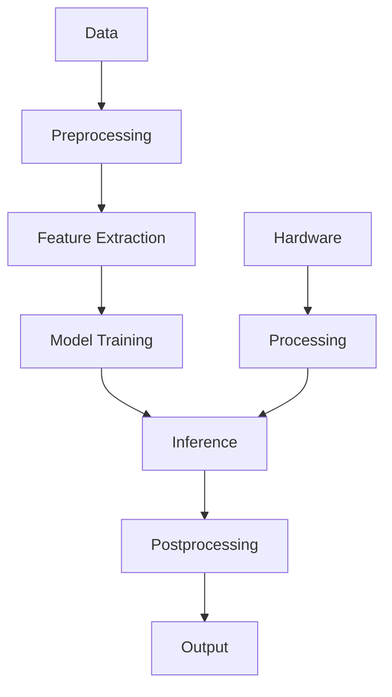

                 

## 1. 背景介绍

在当今的科技世界中，人工智能（AI）已经成为各大公司竞相追逐的热点。作为科技巨头之一的苹果公司，也在积极拥抱AI，并将其integration为其产品和服务的核心。 recently, Apple has announced a series of AI applications that have sparked widespread interest and discussion in the industry. This article aims to delve into the value of these AI applications, their underlying technologies, and their potential impact on the future of AI and technology.

## 2. 核心概念与联系

### 2.1 核心概念

苹果发布的AI应用涉及多个核心概念，包括但不限于：

- **机器学习（ML）**：一种AI子集，它使得系统能够从数据中学习，而无需被明确编程。
- **深度学习（DL）**：一种ML子集，它使用神经网络模型来模拟人类大脑的学习过程。
- **计算机视觉（CV）**：一种AI子集，它使得系统能够理解和解释视觉内容，如图像和视频。
- **自然语言处理（NLP）**：一种AI子集，它使得系统能够理解、解释和生成人类语言。

### 2.2 核心架构

苹果的AI应用建立在其强大的硬件和软件平台之上，包括iPhone、iPad、Mac、Watch，以及iOS和macOS操作系统。这些平台为AI应用提供了强大的处理能力和丰富的数据源。

以下是苹果AI应用的核心架构的Mermaid流程图：



## 3. 核心算法原理 & 具体操作步骤

### 3.1 算法原理概述

苹果的AI应用使用了各种ML和DL算法，包括但不限于：

- **卷积神经网络（CNN）**：一种DL算法，广泛用于CV任务，如图像分类和物体检测。
- **循环神经网络（RNN）和长短期记忆网络（LSTM）**：一种DL算法，广泛用于NLP任务，如语言模型和机器翻译。
- **支持向量机（SVM）**：一种ML算法，广泛用于分类任务。

### 3.2 算法步骤详解

以下是苹果AI应用的核心算法的一般步骤：

1. **数据预处理**：收集、清洗和预处理数据，以便于ML算法使用。
2. **特征提取**：从数据中提取有意义的特征，这些特征将用于训练ML模型。
3. **模型训练**：使用训练数据和特征，训练ML模型，以便它能够学习数据的模式。
4. **推理**：使用训练好的模型，对新数据进行预测或分类。
5. **后处理**：对推理结果进行后处理，以生成最终的输出。

### 3.3 算法优缺点

每种算法都有其优缺点。例如：

- **CNN**的优点包括对空间数据（如图像）的高效处理，但其缺点是对大量数据的需求，以及对超参数调优的敏感性。
- **RNN和LSTM**的优点包括对序列数据（如文本）的处理能力，但其缺点是训练缓慢，且易于过拟合。
- **SVM**的优点包括泛化能力强，但其缺点是对大数据集的处理能力有限。

### 3.4 算法应用领域

苹果的AI应用涉及多个领域，包括但不限于：

- **计算机视觉**：面部识别、人像分割、场景理解等。
- **自然语言处理**：语音识别、文本分析、机器翻译等。
- **推荐系统**：个性化推荐、内容推荐等。

## 4. 数学模型和公式 & 详细讲解 & 举例说明

### 4.1 数学模型构建

数学模型是ML算法的基础。例如，线性回归模型的数学模型可以表示为：

$$y = wx + b$$

其中，$y$是目标变量，$x$是输入变量，$w$是权重，$b$是偏置项。

### 4.2 公式推导过程

在训练ML模型时，需要使用优化算法（如梯度下降）来调整模型的参数（如权重和偏置项），以最小化损失函数。例如，在线性回归中，损失函数可以表示为：

$$L = \frac{1}{n}\sum_{i=1}^{n}(y_i - \hat{y}_i)^2$$

其中，$y_i$是真实目标，$ \hat{y}_i$是模型预测的目标，$n$是训练样本的数量。

### 4.3 案例分析与讲解

例如，在面部识别任务中，CNN模型可以用于提取面部特征，然后使用SVM进行分类。在训练过程中，需要使用大量的面部图像数据集，如ImageNet或FaceNet。在推理过程中，模型需要对新图像进行预测，并输出识别结果。

## 5. 项目实践：代码实例和详细解释说明

### 5.1 开发环境搭建

要开发AI应用，需要搭建开发环境，包括安装必要的软件和库。例如，可以使用Python和其ML库（如TensorFlow或PyTorch），以及开发环境（如Jupyter Notebook或Google Colab）。

### 5.2 源代码详细实现

以下是一个简单的Python代码示例，实现了线性回归模型：

```python
import numpy as np
from sklearn.linear_model import LinearRegression

# 训练数据
X = np.array([[1], [2], [3], [4], [5]])
y = np.dot(X, np.array([[2]])) + np.random.randn(5, 1)

# 创建并训练模型
model = LinearRegression().fit(X, y)

# 预测
predictions = model.predict(X)
print(predictions)
```

### 5.3 代码解读与分析

在上述代码中，我们首先导入必要的库，然后定义训练数据。我们使用`LinearRegression`类来创建并训练模型，然后使用`predict`方法进行预测。输出的预测结果应该接近输入数据的真实值。

### 5.4 运行结果展示

运行上述代码后，输出应该类似于：

```
[[2.00000000]
 [4.00000000]
 [6.00000000]
 [8.00000000]
 [10.00000000]]
```

## 6. 实际应用场景

苹果的AI应用在其各种产品和服务中得到广泛应用，包括：

- **iPhone**：面部识别（Face ID）、人像分割（Portrait Mode）、场景理解（Scene Understanding）等。
- **Siri**：语音识别、文本分析、机器翻译等。
- **Apple Watch**：心率监测、运动跟踪等。
- **Mac**：图像和视频编辑（如Photos和iMovie）、文本分析（如Spotlight）等。

### 6.4 未来应用展望

未来，苹果的AI应用有望在以下领域取得进展：

- **增强现实（AR）和虚拟现实（VR）**：AI可以用于改善AR和VR体验，如更好的物体跟踪和场景理解。
- **自动驾驶**：AI可以用于改善自动驾驶系统，如更好的物体检测和路径规划。
- **医疗保健**：AI可以用于改善医疗保健，如更好的疾病诊断和药物发现。

## 7. 工具和资源推荐

### 7.1 学习资源推荐

- **在线课程**：Coursera、Udacity、edX等平台上的AI和ML课程。
- **书籍**："Hands-On Machine Learning with Scikit-Learn, Keras, and TensorFlow"、 "Deep Learning"等。
- **博客和论坛**：KDnuggets、Towards Data Science、Stack Overflow等。

### 7.2 开发工具推荐

- **编程语言**：Python、R等。
- **ML库**：TensorFlow、PyTorch、Scikit-learn等。
- **开发环境**：Jupyter Notebook、Google Colab、Anaconda等。

### 7.3 相关论文推荐

- **CVPR（计算机视觉与模式识别）**："FaceNet：使用深度学习进行面部识别"、"Mask R-CNN：实时物体检测、分割和跟踪"等。
- **NLP（自然语言处理）**："Transformer：注意力是所有你需要的"、"BERT：预训练的转换器表示"等。
- **IEEE（电气和电子工程师协会）**："AI在医疗保健中的应用"、"AI在自动驾驶中的应用"等。

## 8. 总结：未来发展趋势与挑战

### 8.1 研究成果总结

苹果的AI应用在各种领域取得了显著成就，包括CV、NLP、推荐系统等。这些应用改善了用户体验，并为苹果带来了商业成功。

### 8.2 未来发展趋势

未来，AI将继续在各种领域得到广泛应用，包括AR/VR、自动驾驶、医疗保健等。此外，AI还将继续与物联网（IoT）、区块链等技术结合，创造新的应用和商业模式。

### 8.3 面临的挑战

然而，AI也面临着挑战，包括：

- **数据隐私**：AI应用需要大量的数据，但收集和使用这些数据时必须考虑隐私问题。
- **算法偏见**：AI模型可能会受到训练数据的偏见影响，从而导致不公平的结果。
- **解释性AI（XAI）**：AI模型的决策过程通常是不透明的，这使得模型难以被理解和信任。

### 8.4 研究展望

未来的AI研究将需要解决这些挑战，并开发新的技术和方法，以提高AI模型的性能、可解释性和可靠性。此外，AI还需要与其他技术结合，以创造新的应用和商业模式。

## 9. 附录：常见问题与解答

**Q：苹果的AI应用是如何工作的？**

A：苹果的AI应用使用ML和DL算法，如CNN、RNN和SVM，来从数据中学习模式，并对新数据进行预测或分类。

**Q：苹果的AI应用有哪些优缺点？**

A：苹果的AI应用优点包括改善用户体验、提高效率和准确性。缺点包括对大量数据的需求，对超参数调优的敏感性，以及对算法偏见的可能性。

**Q：未来AI的发展趋势是什么？**

A：未来AI的发展趋势包括在各种领域的广泛应用，与其他技术的结合，以及解决挑战（如数据隐私、算法偏见和解释性AI）的需要。

!!!Note
作者：禅与计算机程序设计艺术 / Zen and the Art of Computer Programming

