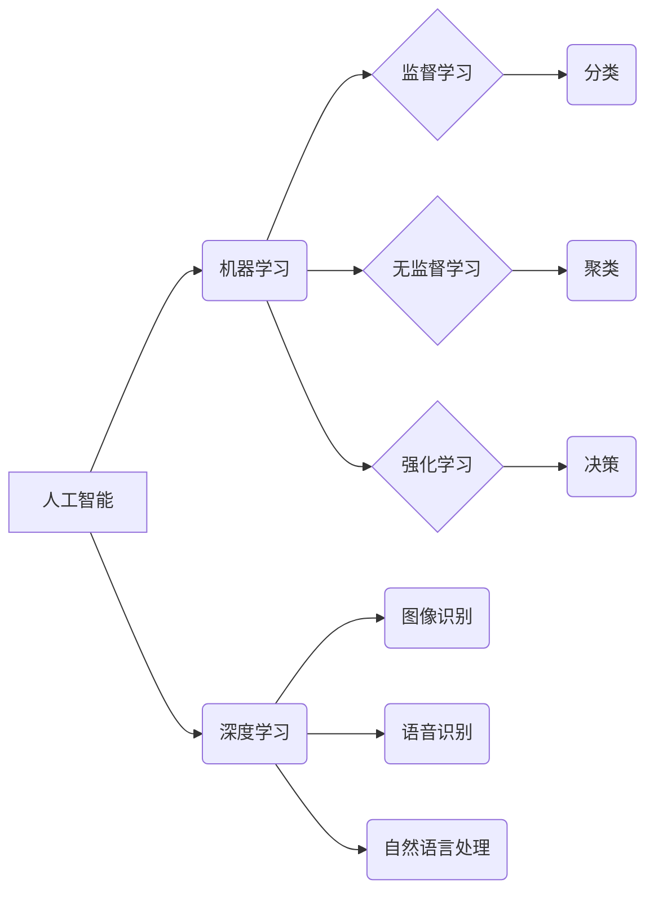

> 苹果、AI应用、机器学习、深度学习、自然语言处理、计算机视觉、科技发展趋势

## 1. 背景介绍

2023年，苹果公司在全球开发者大会上发布了一系列搭载人工智能技术的应用，引发了业界和公众的广泛关注。李开复，作为一位世界级人工智能专家，对苹果发布AI应用的意义进行了深入的分析和解读。他认为，苹果的这一举措标志着人工智能技术已经从实验室走向了现实生活，并将在未来深刻地改变我们的生活方式。

## 2. 核心概念与联系

### 2.1  人工智能 (AI)

人工智能是指模拟人类智能行为的计算机系统。它涵盖了广泛的领域，包括机器学习、深度学习、自然语言处理、计算机视觉等。

### 2.2  机器学习 (ML)

机器学习是人工智能的一个重要分支，它使计算机能够从数据中学习，并根据学习到的知识进行预测或决策。机器学习算法可以分为监督学习、无监督学习和强化学习三大类。

### 2.3  深度学习 (DL)

深度学习是机器学习的一个子领域，它利用多层神经网络来模拟人类大脑的学习过程。深度学习算法在图像识别、语音识别、自然语言处理等领域取得了突破性的进展。

**核心概念与联系流程图**



## 3. 核心算法原理 & 具体操作步骤

### 3.1  算法原理概述

深度学习算法的核心是多层神经网络。神经网络由许多相互连接的神经元组成，每个神经元接收来自其他神经元的输入信号，并根据这些信号进行计算，输出一个信号。神经网络的学习过程就是通过调整神经元之间的连接权重，使得网络能够准确地预测或决策。

### 3.2  算法步骤详解

1. **数据预处理:** 将原始数据转换为深度学习算法可以理解的格式。
2. **网络结构设计:** 根据具体任务选择合适的网络结构，例如卷积神经网络 (CNN) 用于图像识别，循环神经网络 (RNN) 用于自然语言处理。
3. **参数初始化:** 为网络中的神经元赋予初始权重。
4. **前向传播:** 将输入数据通过网络传递，计算输出结果。
5. **反向传播:** 计算输出结果与真实值的误差，并根据误差调整网络参数。
6. **迭代训练:** 重复前向传播和反向传播的过程，直到网络性能达到预期的水平。

### 3.3  算法优缺点

**优点:**

* 能够学习复杂的数据模式。
* 在图像识别、语音识别、自然语言处理等领域取得了突破性的进展。

**缺点:**

* 需要大量的训练数据。
* 训练过程耗时且耗能。
* 模型解释性较差。

### 3.4  算法应用领域

深度学习算法广泛应用于以下领域:

* **计算机视觉:** 图像识别、物体检测、图像分割、人脸识别等。
* **自然语言处理:** 文本分类、情感分析、机器翻译、对话系统等。
* **语音识别:** 语音转文本、语音助手等。
* **推荐系统:** 商品推荐、内容推荐等。
* **医疗诊断:** 病理图像分析、疾病预测等。

## 4. 数学模型和公式 & 详细讲解 & 举例说明

### 4.1  数学模型构建

深度学习算法的核心是多层神经网络，每个神经元接收来自其他神经元的输入信号，并根据这些信号进行计算，输出一个信号。神经元的计算过程可以用以下公式表示:

$$
y = f(w^T x + b)
$$

其中:

* $y$ 是神经元的输出值。
* $f$ 是激活函数，例如 sigmoid 函数、ReLU 函数等。
* $w$ 是神经元的权重向量。
* $x$ 是输入信号向量。
* $b$ 是神经元的偏置值。

### 4.2  公式推导过程

深度学习算法的训练过程是通过调整神经元之间的连接权重，使得网络能够准确地预测或决策。常用的优化算法包括梯度下降法、Adam 算法等。梯度下降法的核心思想是沿着梯度的负方向更新权重，以最小化损失函数。

损失函数衡量预测结果与真实值的差异。常用的损失函数包括均方误差 (MSE)、交叉熵损失 (Cross-Entropy Loss) 等。

### 4.3  案例分析与讲解

例如，在图像识别任务中，深度学习算法可以学习图像特征，并将其映射到不同的类别。训练过程中，算法会使用大量的标记图像数据，通过调整网络参数，使得网络能够准确地识别图像中的物体。

## 5. 项目实践：代码实例和详细解释说明

### 5.1  开发环境搭建

深度学习开发环境通常需要安装 Python 语言、深度学习框架 (例如 TensorFlow、PyTorch) 和必要的库。

### 5.2  源代码详细实现

以下是一个使用 TensorFlow 实现图像分类的简单代码示例:

```python
import tensorflow as tf

# 定义模型结构
model = tf.keras.models.Sequential([
  tf.keras.layers.Conv2D(32, (3, 3), activation='relu', input_shape=(28, 28, 1)),
  tf.keras.layers.MaxPooling2D((2, 2)),
  tf.keras.layers.Conv2D(64, (3, 3), activation='relu'),
  tf.keras.layers.MaxPooling2D((2, 2)),
  tf.keras.layers.Flatten(),
  tf.keras.layers.Dense(10, activation='softmax')
])

# 编译模型
model.compile(optimizer='adam',
              loss='sparse_categorical_crossentropy',
              metrics=['accuracy'])

# 训练模型
model.fit(x_train, y_train, epochs=5)

# 评估模型
loss, accuracy = model.evaluate(x_test, y_test)
print('Test loss:', loss)
print('Test accuracy:', accuracy)
```

### 5.3  代码解读与分析

这段代码定义了一个简单的卷积神经网络模型，用于图像分类任务。模型包含两层卷积层、两层最大池化层、一层全连接层和一层输出层。

### 5.4  运行结果展示

训练完成后，可以评估模型的性能，例如准确率。

## 6. 实际应用场景

### 6.1  智能助手

深度学习算法可以用于构建智能助手，例如 Siri、Alexa 等。智能助手可以理解用户的语音指令，并执行相应的操作，例如播放音乐、设置闹钟、查询天气等。

### 6.2  图像识别

深度学习算法可以用于图像识别，例如人脸识别、物体检测、场景理解等。图像识别技术广泛应用于安防监控、医疗诊断、自动驾驶等领域。

### 6.3  自然语言处理

深度学习算法可以用于自然语言处理，例如文本分类、情感分析、机器翻译、对话系统等。自然语言处理技术可以帮助我们更好地理解和处理人类语言，并应用于搜索引擎、聊天机器人、文本摘要等领域。

### 6.4  未来应用展望

随着深度学习算法的不断发展，其应用场景将更加广泛。例如，深度学习可以用于个性化推荐、药物研发、金融风险控制等领域。

## 7. 工具和资源推荐

### 7.1  学习资源推荐

* **书籍:**
    * 深度学习 (Deep Learning) - Ian Goodfellow, Yoshua Bengio, Aaron Courville
    * 构建深度学习模型 (Hands-On Machine Learning with Scikit-Learn, Keras & TensorFlow) - Aurélien Géron
* **在线课程:**
    * 深度学习 Specialization - Andrew Ng (Coursera)
    * fast.ai - Practical Deep Learning for Coders
* **博客和网站:**
    * TensorFlow Blog
    * PyTorch Blog
    * Towards Data Science

### 7.2  开发工具推荐

* **深度学习框架:** TensorFlow, PyTorch, Keras
* **编程语言:** Python
* **数据处理工具:** Pandas, NumPy

### 7.3  相关论文推荐

* **ImageNet Classification with Deep Convolutional Neural Networks** - Alex Krizhevsky, Ilya Sutskever, Geoffrey E. Hinton
* **Attention Is All You Need** - Ashish Vaswani, Noam Shazeer, Niki Parmar, Jakob Uszkoreit, Llion Jones, Aidan N. Gomez, Łukasz Kaiser, Illia Polosukhin

## 8. 总结：未来发展趋势与挑战

### 8.1  研究成果总结

近年来，深度学习算法取得了显著的进展，在图像识别、语音识别、自然语言处理等领域取得了突破性的成果。

### 8.2  未来发展趋势

* **模型规模和复杂度提升:** 未来深度学习模型将更加庞大，包含更多的参数和层数，以学习更加复杂的模式。
* **数据效率提升:** 研究者将探索更加高效的数据利用方法，使得深度学习模型能够在更少的数据下取得良好的性能。
* **解释性和可解释性增强:** 研究者将致力于提高深度学习模型的解释性和可解释性，使得模型的决策过程更加透明。
* **边缘计算和部署:** 深度学习模型将更加广泛地部署在边缘设备上，例如智能手机、物联网设备等，以实现更低延迟和更高效率的应用。

### 8.3  面临的挑战

* **数据获取和标注:** 深度学习算法需要大量的训练数据，而获取和标注高质量的数据仍然是一个挑战。
* **计算资源需求:** 训练大型深度学习模型需要大量的计算资源，这对于资源有限的机构和个人来说是一个障碍。
* **模型安全性与可靠性:** 深度学习模型容易受到攻击和操纵，其安全性与可靠性需要得到进一步保障。
* **伦理问题:** 深度学习技术的应用可能会带来一些伦理问题，例如隐私泄露、算法偏见等，需要得到妥善的解决。

### 8.4  研究展望

未来，深度学习研究将继续朝着更强大、更智能、更安全的方向发展。

## 9. 附录：常见问题与解答

### 9.1  深度学习和机器学习有什么区别？

深度学习是机器学习的一个子领域，它利用多层神经网络来模拟人类大脑的学习过程。

### 9.2  如何选择合适的深度学习框架？

选择深度学习框架需要考虑项目需求、开发经验、社区支持等因素。

### 9.3  如何评估深度学习模型的性能？

常用的评估指标包括准确率、召回率、F1-score 等。

### 9.4  如何解决深度学习模型的过拟合问题？

常用的方法包括正则化、数据增强、Dropout 等。

### 9.5  深度学习的未来发展趋势是什么？

深度学习的未来发展趋势包括模型规模和复杂度提升、数据效率提升、解释性和可解释性增强、边缘计算和部署等。


作者：禅与计算机程序设计艺术 / Zen and the Art of Computer Programming 
<end_of_turn>