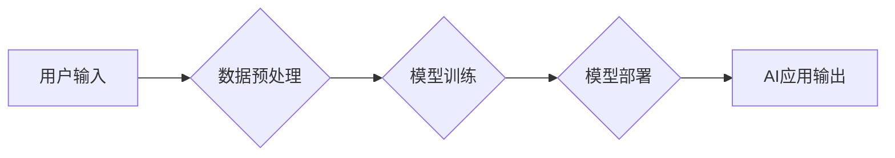

> 苹果、AI应用、机器学习、深度学习、自然语言处理、计算机视觉、Transformer模型、模型压缩、高效推理

## 1. 背景介绍

近年来，人工智能（AI）技术飞速发展，已渗透到生活的方方面面。苹果公司作为科技巨头，也积极布局AI领域，并将其融入到产品和服务中。2023年，苹果发布了一系列搭载AI技术的应用，引发了业界和消费者的广泛关注。

苹果此次发布的AI应用，主要集中在以下几个方面：

* **自然语言处理（NLP）：** 提升语音助手Siri的智能化水平，支持更自然、更流畅的对话交互。
* **计算机视觉（CV）：** 增强相机功能，提供更精准的图像识别、物体检测和场景理解。
* **个性化推荐：** 基于用户行为和偏好，提供更精准的应用推荐和内容推送。

这些AI应用的发布，标志着苹果在AI领域的布局已进入新的阶段，也为用户带来了更智能、更便捷的体验。

## 2. 核心概念与联系

苹果发布的AI应用，主要基于机器学习（ML）和深度学习（DL）技术。

**2.1 机器学习（ML）**

机器学习是一种人工智能技术，它通过算法学习数据中的模式和规律，从而实现对未知数据的预测和分类。

**2.2 深度学习（DL）**

深度学习是机器学习的一个子集，它利用多层神经网络来模拟人类大脑的学习过程，能够学习更复杂、更抽象的特征。

**2.3 AI应用架构**



**2.3.1 数据预处理**

AI模型的训练需要大量的数据，这些数据需要经过预处理，例如清洗、转换和特征工程，才能被模型理解和学习。

**2.3.2 模型训练**

模型训练是AI模型学习的过程，通过训练数据，模型会不断调整自己的参数，以达到更高的预测精度。

**2.3.3 模型部署**

训练好的模型需要部署到实际应用场景中，以便为用户提供服务。

**2.3.4 AI应用输出**

AI模型根据输入数据进行处理，并输出预测结果或分类结果，为用户提供智能化服务。

## 3. 核心算法原理 & 具体操作步骤

### 3.1  算法原理概述

苹果发布的AI应用，采用了多种先进的算法，例如Transformer模型、模型压缩技术和高效推理算法。

**3.1.1 Transformer模型**

Transformer模型是一种新型的神经网络架构，它能够处理序列数据，例如文本和语音。Transformer模型的特点是其强大的并行能力和长距离依赖建模能力，使其在自然语言处理任务中取得了优异的性能。

**3.1.2 模型压缩技术**

模型压缩技术旨在减小AI模型的大小，以降低部署成本和功耗。常见的模型压缩技术包括量化、剪枝和知识蒸馏。

**3.1.3 高效推理算法**

高效推理算法旨在加速AI模型的推理速度，以提高应用的实时性。常见的推理加速技术包括模型并行、算子融合和硬件加速。

### 3.2  算法步骤详解

**3.2.1 Transformer模型训练步骤**

1. **数据预处理:** 将文本数据转换为数字表示，例如词嵌入。
2. **模型构建:** 根据Transformer模型架构搭建模型结构。
3. **模型训练:** 使用训练数据训练模型，并通过反向传播算法更新模型参数。
4. **模型评估:** 使用验证数据评估模型性能，并调整超参数以提高性能。
5. **模型保存:** 保存训练好的模型参数。

**3.2.2 模型压缩技术步骤**

1. **选择压缩方法:** 根据模型结构和应用场景选择合适的压缩方法。
2. **进行压缩:** 使用选择的压缩方法对模型进行压缩，例如量化模型权重。
3. **评估压缩效果:** 使用验证数据评估压缩后的模型性能，并调整压缩参数以平衡性能和压缩率。

**3.2.3 高效推理算法步骤**

1. **选择加速方法:** 根据硬件平台和模型结构选择合适的加速方法。
2. **进行加速:** 使用选择的加速方法加速模型推理，例如使用GPU加速推理。
3. **评估加速效果:** 使用测试数据评估加速后的推理速度，并调整加速参数以提高效率。

### 3.3  算法优缺点

**3.3.1 Transformer模型**

* **优点:** 强大的并行能力、长距离依赖建模能力、在自然语言处理任务中取得了优异的性能。
* **缺点:** 模型规模较大，训练成本高，推理速度相对较慢。

**3.3.2 模型压缩技术**

* **优点:** 可以减小模型大小，降低部署成本和功耗。
* **缺点:** 压缩可能会导致模型性能下降。

**3.3.3 高效推理算法**

* **优点:** 可以加速模型推理速度，提高应用的实时性。
* **缺点:** 加速可能会增加硬件成本。

### 3.4  算法应用领域

**3.4.1 Transformer模型**

* 自然语言处理：机器翻译、文本摘要、问答系统、聊天机器人等。
* 语音识别：语音转文本、语音助手等。
* 图像识别：图像分类、物体检测、场景理解等。

**3.4.2 模型压缩技术**

* 移动设备：由于移动设备的资源有限，模型压缩技术可以帮助部署更小的AI模型。
* 边缘计算：模型压缩技术可以帮助在边缘设备上进行高效的AI推理。

**3.4.3 高效推理算法**

* 实时应用：例如自动驾驶、医疗诊断等，需要快速进行AI推理。
* 大规模部署：例如云计算平台，需要高效地处理大量的数据请求。

## 4. 数学模型和公式 & 详细讲解 & 举例说明

### 4.1  数学模型构建

Transformer模型的核心是自注意力机制，它通过计算词之间的相关性来理解文本的语义关系。

**4.1.1 自注意力机制**

自注意力机制可以计算每个词与所有其他词之间的相关性，并生成一个权重矩阵。

**4.1.2 权重矩阵计算**

权重矩阵的计算公式如下：

$$
Attention(Q, K, V) = softmax(\frac{QK^T}{\sqrt{d_k}})V
$$

其中：

* $Q$：查询矩阵
* $K$：键矩阵
* $V$：值矩阵
* $d_k$：键向量的维度
* $softmax$：softmax函数

**4.1.3 举例说明**

假设我们有一个句子“我爱学习编程”，其词嵌入表示为：

* 我：[0.1, 0.2, 0.3]
* 爱：[0.4, 0.5, 0.6]
* 学习：[0.7, 0.8, 0.9]
* 编程：[1.0, 1.1, 1.2]

我们可以使用自注意力机制计算每个词与所有其他词之间的相关性，并生成一个权重矩阵。

### 4.2  公式推导过程

自注意力机制的权重矩阵计算公式可以推导如下：

1. 计算查询矩阵 $Q$、键矩阵 $K$ 和值矩阵 $V$。
2. 计算 $QK^T$，得到一个矩阵，其每个元素表示两个词之间的相关性。
3. 对 $QK^T$ 进行归一化，使用 softmax 函数将每个元素转换为概率分布。
4. 将概率分布与值矩阵 $V$ 进行加权求和，得到每个词的最终表示。

### 4.3  案例分析与讲解

在机器翻译任务中，Transformer模型可以利用自注意力机制来理解源语言和目标语言之间的语义关系，从而生成更准确的翻译结果。

## 5. 项目实践：代码实例和详细解释说明

### 5.1  开发环境搭建

* 操作系统：macOS、Linux 或 Windows
* Python 版本：3.7 或更高版本
* 深度学习框架：TensorFlow 或 PyTorch

### 5.2  源代码详细实现

```python
# 使用 TensorFlow 实现 Transformer 模型

import tensorflow as tf

# 定义 Transformer 模型
class Transformer(tf.keras.Model):
    def __init__(self, vocab_size, embedding_dim, num_heads, num_layers):
        super(Transformer, self).__init__()
        self.embedding = tf.keras.layers.Embedding(vocab_size, embedding_dim)
        self.transformer_layers = tf.keras.layers.StackedRNNCells([
            tf.keras.layers.MultiHeadAttention(num_heads=num_heads, key_dim=embedding_dim)
            for _ in range(num_layers)
        ])
        self.fc = tf.keras.layers.Dense(vocab_size)

    def call(self, inputs):
        x = self.embedding(inputs)
        x = self.transformer_layers(x)
        x = self.fc(x)
        return x

# 实例化 Transformer 模型
model = Transformer(vocab_size=10000, embedding_dim=512, num_heads=8, num_layers=6)

# 训练模型
model.compile(optimizer='adam', loss='sparse_categorical_crossentropy', metrics=['accuracy'])
model.fit(train_data, train_labels, epochs=10)

```

### 5.3  代码解读与分析

* **模型定义:** Transformer 模型由嵌入层、多头注意力层和全连接层组成。
* **嵌入层:** 将词转换为向量表示。
* **多头注意力层:** 计算每个词与所有其他词之间的相关性。
* **全连接层:** 将注意力输出转换为预测概率。
* **模型训练:** 使用 Adam 优化器、交叉熵损失函数和准确率指标训练模型。

### 5.4  运行结果展示

训练完成后，可以使用测试数据评估模型的性能，例如计算准确率和困惑度。

## 6. 实际应用场景

### 6.1  语音助手

苹果的语音助手 Siri，已经利用 Transformer 模型进行升级，能够理解更复杂的语音指令，并提供更自然、更流畅的对话交互。

### 6.2  图像识别

苹果的相机应用，已经利用 Transformer 模型进行图像识别，能够识别物体、场景和人脸，并提供相关信息。

### 6.3  个性化推荐

苹果的 App Store 和 Apple Music，已经利用 Transformer 模型进行个性化推荐，能够根据用户的行为和偏好，推荐更符合用户兴趣的应用和音乐。

### 6.4  未来应用展望

未来，Transformer 模型将在更多领域得到应用，例如：

* **机器翻译:** 提高机器翻译的准确性和流畅度。
* **文本摘要:** 自动生成文本摘要，节省时间和精力。
* **问答系统:** 开发更智能的问答系统，能够理解复杂的问题并提供准确的答案。
* **代码生成:** 自动生成代码，提高开发效率。

## 7. 工具和资源推荐

### 7.1  学习资源推荐

* **书籍:**
    * 《深度学习》
    * 《Transformer 详解》
* **在线课程:**
    * Coursera 上的深度学习课程
    * fast.ai 上的深度学习课程

### 7.2  开发工具推荐

* **深度学习框架:** TensorFlow、PyTorch
* **编程语言:** Python
* **云计算平台:** Google Cloud Platform、Amazon Web Services、Microsoft Azure

### 7.3  相关论文推荐

* 《Attention Is All You Need》
* 《BERT: Pre-training of Deep Bidirectional Transformers for Language Understanding》
* 《GPT-3: Language Models are Few-Shot Learners》

## 8. 总结：未来发展趋势与挑战

### 8.1  研究成果总结

苹果发布的AI应用，展示了Transformer模型在自然语言处理、计算机视觉和个性化推荐领域的应用潜力。模型压缩