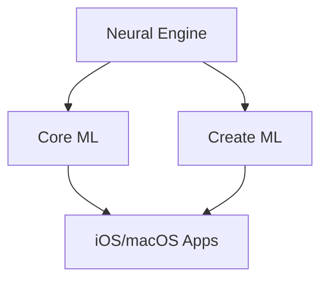

                 

## 1. 背景介绍

在当今的数字时代，人工智能（AI）已经渗透到我们的日常生活中，从语音助手到自动驾驶汽车，再到智能家居，AI无处不在。作为全球科技巨头之一，苹果公司也在积极拥抱AI，并将其视为未来的关键技术之一。 recent apple event, the company unveiled a range of new AI applications and features, showcasing its commitment to this rapidly evolving field. This article will delve into the key concepts and technologies behind these AI applications, explore their underlying algorithms, and discuss their potential impact on various industries.

## 2. 核心概念与联系

苹果的AI应用建立在其自研的AI芯片和软件框架之上。这些技术包括Neural Engine、Core ML、和Create ML。Neural Engine是一种专门为AI任务而设计的硬件加速器，它可以在设备上快速执行复杂的AI模型。Core ML是一个软件框架，它允许开发人员将其AI模型集成到iOS和macOS应用程序中。Create ML则是一个简单易用的工具，它允许开发人员构建和训练自己的AI模型。



## 3. 核心算法原理 & 具体操作步骤

### 3.1 算法原理概述

苹果的AI应用主要基于深度学习算法，其中包括卷积神经网络（CNN）和循环神经网络（RNN）。CNN通常用于图像和视频分析，而RNN则用于处理序列数据，如文本和语音。

### 3.2 算法步骤详解

1. **数据收集与预处理**：首先，需要收集大量的数据，并对其进行预处理，如清洗、标记和归一化。
2. **模型构建**：使用Create ML或其他工具构建AI模型。这涉及到选择合适的网络架构，设置超参数，并选择损失函数和优化算法。
3. **模型训练**：使用收集的数据训练模型。这通常涉及到反向传播算法和梯度下降优化。
4. **模型评估**：评估模型的性能，通常使用验证集和测试集。这可能需要调整模型参数或重新训练模型。
5. **模型部署**：使用Core ML将模型集成到iOS或macOS应用程序中。模型可以在设备上运行，无需连接到互联网。

### 3.3 算法优缺点

**优点**：深度学习算法可以自动学习特征，无需人工特征工程。它们可以处理大量数据，并提供高精度的预测。此外，苹果的AI芯片和软件框架可以提供高速、低功耗的AI处理。

**缺点**：深度学习模型需要大量的数据和计算资源。它们也可能受到过拟合和模型解释性差的问题的影响。

### 3.4 算法应用领域

苹果的AI应用涉及多个领域，包括图像和视频分析（如人脸识别和物体检测）、自然语言处理（如语音识别和文本分析）、推荐系统（如App Store推荐），以及自动驾驶和机器人技术。

## 4. 数学模型和公式 & 详细讲解 & 举例说明

### 4.1 数学模型构建

深度学习模型通常由多个神经元组成的层组成。每个神经元接收输入，执行一些计算，并产生输出。这些计算通常是线性函数加上一个非线性激活函数。

### 4.2 公式推导过程

给定输入向量$x$和权重向量$w$，神经元的输出可以表示为：

$$y = f(w^T x + b)$$

其中$f$是激活函数，$b$是偏置项。常用的激活函数包括sigmoid、tanh、ReLU等。

### 4.3 案例分析与讲解

例如，在图像分类任务中，输入向量$x$可以是图像的像素值，权重向量$w$可以是卷积核，输出$y$可以是图像中物体的类别概率。通过训练模型，网络可以学习到合适的权重和偏置，从而正确地分类图像。

## 5. 项目实践：代码实例和详细解释说明

### 5.1 开发环境搭建

要构建和训练AI模型，需要设置开发环境。这通常包括安装Python、TensorFlow或PyTorch等深度学习框架，以及设置Create ML或其他模型构建工具。

### 5.2 源代码详细实现

以下是一个简单的使用TensorFlow构建图像分类模型的示例：

```python
import tensorflow as tf
from tensorflow.keras import datasets, layers, models

# Load and split dataset
(train_images, train_labels), (test_images, test_labels) = datasets.cifar10.load_data()

# Normalize pixel values to be between 0 and 1
train_images, test_images = train_images / 255.0, test_images / 255.0

# Create the convolutional base
model = models.Sequential()
model.add(layers.Conv2D(32, (3, 3), activation='relu', input_shape=(32, 32, 3)))
model.add(layers.MaxPooling2D((2, 2)))
model.add(layers.Conv2D(64, (3, 3), activation='relu'))
model.add(layers.MaxPooling2D((2, 2)))
model.add(layers.Conv2D(64, (3, 3), activation='relu'))

# Add dense layers on top
model.add(layers.Flatten())
model.add(layers.Dense(64, activation='relu'))
model.add(layers.Dense(10))

# Compile and train the model
model.compile(optimizer='adam',
              loss=tf.keras.losses.SparseCategoricalCrossentropy(from_logits=True),
              metrics=['accuracy'])

history = model.fit(train_images, train_labels, epochs=10,
                    validation_data=(test_images, test_labels))
```

### 5.3 代码解读与分析

这段代码使用TensorFlow构建了一个简单的卷积神经网络（CNN）模型。它首先加载并预处理CIFAR-10数据集，然后构建模型。模型由三个卷积层和两个全连接层组成。最后，它编译并训练模型。

### 5.4 运行结果展示

运行这段代码后，模型的准确性应该会在训练集和验证集上都有所提高。可以使用`history.history`查看训练过程中的准确性和损失。

## 6. 实际应用场景

### 6.1 当前应用

苹果的AI应用已经广泛应用于其各种产品中。例如，iPhone的Face ID功能使用AI进行人脸识别，Siri使用AI进行语音识别和语义理解，而Apple Watch的心率检测功能则使用AI进行数据分析。

### 6.2 未来应用展望

未来，苹果的AI应用可能会扩展到更多领域。例如，AI可以用于改善自动驾驶汽车的安全性和舒适性，或用于开发更智能的家居设备。AI还可以用于改善数字健康，如疾病诊断和药物发现。

## 7. 工具和资源推荐

### 7.1 学习资源推荐

- **书籍**："Deep Learning" by Ian Goodfellow, Yoshua Bengio, and Aaron Courville
- **在线课程**：Coursera的"Deep Learning Specialization"和Udacity的"Intro to AI"课程
- **论坛**：Stack Overflow和Kaggle

### 7.2 开发工具推荐

- **编程语言**：Python
- **深度学习框架**：TensorFlow和PyTorch
- **模型构建工具**：Create ML和Kubeflow

### 7.3 相关论文推荐

- "ImageNet Classification with Deep Convolutional Neural Networks" by Krizhevsky et al.
- "Attention Is All You Need" by Vaswani et al.
- "Generative Adversarial Networks" by Goodfellow et al.

## 8. 总结：未来发展趋势与挑战

### 8.1 研究成果总结

苹果的AI应用展示了深度学习在各种领域的强大能力。它们还展示了苹果在AI芯片和软件框架方面的领先地位。

### 8.2 未来发展趋势

未来，AI将继续渗透到我们的日常生活中。我们将看到AI在自动驾驶、数字健康、智能家居等领域的更多应用。此外，边缘AI和联邦学习等技术将使AI更加分布式和隐私保护。

### 8.3 面临的挑战

然而，AI也面临着挑战。这些挑战包括数据隐私和安全、模型解释性差、和算法偏见等。此外，AI还需要大量的计算资源和能源。

### 8.4 研究展望

未来的研究将需要解决这些挑战，并开发出更智能、更安全、更可解释的AI模型。此外，研究人员还需要开发出更有效的AI训练方法，以节省计算资源和能源。

## 9. 附录：常见问题与解答

**Q：苹果的AI芯片和软件框架有什么优势？**

A：苹果的AI芯片和软件框架可以提供高速、低功耗的AI处理。它们还可以在设备上运行模型，无需连接到互联网。

**Q：深度学习模型需要大量的数据吗？**

A：是的，深度学习模型通常需要大量的数据来训练。数据的质量和多样性也很重要。

**Q：AI会取代人类的工作吗？**

A：AI可以自动化和优化许多任务，但它也会创造新的工作岗位。未来的关键是帮助人们适应AI，而不是被AI取代。

!!!Note
作者：禅与计算机程序设计艺术 / Zen and the Art of Computer Programming

