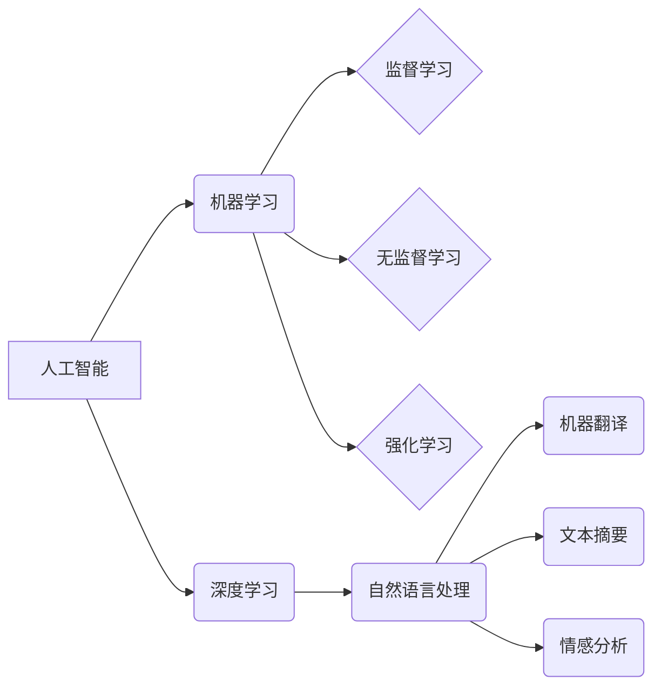

> 苹果, AI应用, 科技价值, 深度学习, 自然语言处理, 人工智能, 机器学习, 计算机视觉

## 1. 背景介绍

近年来，人工智能（AI）技术飞速发展，已渗透到生活的方方面面。从智能手机的语音助手到自动驾驶汽车，AI正在改变着我们的世界。苹果公司作为科技巨头，也积极布局AI领域，并将其融入到其产品和服务中。2023年，苹果发布了一系列AI应用，引发了业界和消费者的广泛关注。

李开复，作为一位享誉全球的人工智能专家，对苹果发布的AI应用给予了高度评价，并认为其具有重要的科技价值。他指出，苹果在AI领域的布局并非仅仅是追赶潮流，而是基于其对用户体验的深刻理解和对未来科技发展的预见。

## 2. 核心概念与联系

### 2.1  人工智能（AI）

人工智能是指模拟人类智能行为的计算机系统。它涵盖了多个领域，包括机器学习、深度学习、自然语言处理、计算机视觉等。

### 2.2  机器学习（ML）

机器学习是人工智能的一个重要分支，它使计算机能够从数据中学习，并根据学习到的知识进行预测或决策。机器学习算法可以分为监督学习、无监督学习和强化学习三种类型。

### 2.3  深度学习（DL）

深度学习是机器学习的一种更高级形式，它利用多层神经网络来模拟人类大脑的学习过程。深度学习算法在图像识别、语音识别、自然语言处理等领域取得了突破性的进展。

### 2.4  自然语言处理（NLP）

自然语言处理是指使计算机能够理解和处理人类语言的技术。NLP应用广泛，包括机器翻译、文本摘要、情感分析等。

**核心概念与联系流程图**



## 3. 核心算法原理 & 具体操作步骤

### 3.1  算法原理概述

深度学习算法的核心是多层神经网络。神经网络由多个节点（神经元）组成，每个节点都连接到其他节点，并通过权重来传递信息。通过训练神经网络，可以调整权重，使网络能够学习数据中的模式。

### 3.2  算法步骤详解

1. **数据预处理:** 将原始数据转换为深度学习算法可以理解的格式。
2. **网络结构设计:** 根据任务需求设计神经网络的结构，包括层数、节点数、激活函数等。
3. **参数初始化:** 为神经网络的参数（权重和偏置）进行随机初始化。
4. **前向传播:** 将输入数据通过神经网络进行传递，得到输出结果。
5. **损失函数计算:** 计算输出结果与真实值的差异，即损失函数的值。
6. **反向传播:** 根据损失函数的梯度，调整神经网络的参数，使损失函数值减小。
7. **迭代训练:** 重复步骤4-6，直到损失函数值达到预设的阈值。

### 3.3  算法优缺点

**优点:**

* 能够学习复杂的数据模式。
* 性能优于传统机器学习算法。
* 在图像识别、语音识别、自然语言处理等领域取得了突破性进展。

**缺点:**

* 需要大量的训练数据。
* 训练时间长，计算资源消耗大。
* 模型解释性差，难以理解模型的决策过程。

### 3.4  算法应用领域

深度学习算法广泛应用于各个领域，包括：

* **计算机视觉:** 图像识别、物体检测、图像分割、人脸识别等。
* **语音识别:** 语音转文本、语音助手、语音搜索等。
* **自然语言处理:** 机器翻译、文本摘要、情感分析、问答系统等。
* **推荐系统:** 商品推荐、内容推荐、用户画像等。
* **医疗诊断:** 病理图像分析、疾病预测、药物研发等。

## 4. 数学模型和公式 & 详细讲解 & 举例说明

### 4.1  数学模型构建

深度学习算法的核心是多层神经网络。每个神经元接收多个输入信号，并通过加权求和和激活函数进行处理，输出一个信号。

**神经元模型:**

$$
y = f(w_1x_1 + w_2x_2 + ... + w_nx_n + b)
$$

其中：

* $y$ 是神经元的输出信号。
* $x_1, x_2, ..., x_n$ 是输入信号。
* $w_1, w_2, ..., w_n$ 是权重。
* $b$ 是偏置。
* $f$ 是激活函数。

### 4.2  公式推导过程

深度学习算法的训练过程是通过反向传播算法来实现的。反向传播算法的核心是计算损失函数的梯度，并根据梯度更新神经网络的参数。

**损失函数:**

$$
L = \frac{1}{N}\sum_{i=1}^{N} (y_i - \hat{y}_i)^2
$$

其中：

* $L$ 是损失函数的值。
* $N$ 是样本数量。
* $y_i$ 是真实值。
* $\hat{y}_i$ 是预测值。

**梯度下降算法:**

$$
\theta = \theta - \alpha \nabla L(\theta)
$$

其中：

* $\theta$ 是参数。
* $\alpha$ 是学习率。
* $\nabla L(\theta)$ 是损失函数的梯度。

### 4.3  案例分析与讲解

**图像识别案例:**

假设我们训练一个深度学习模型来识别猫和狗的图像。

1. **数据预处理:** 将猫和狗的图像数据进行裁剪、缩放、归一化等处理。
2. **网络结构设计:** 设计一个卷积神经网络（CNN）来提取图像特征。
3. **参数初始化:** 为神经网络的参数进行随机初始化。
4. **前向传播:** 将图像数据通过CNN进行传递，得到输出结果。
5. **损失函数计算:** 计算输出结果与真实标签的差异，即损失函数的值。
6. **反向传播:** 根据损失函数的梯度，更新神经网络的参数。
7. **迭代训练:** 重复步骤4-6，直到损失函数值达到预设的阈值。

经过训练，CNN模型能够识别猫和狗的图像。

## 5. 项目实践：代码实例和详细解释说明

### 5.1  开发环境搭建

* 操作系统：Windows/macOS/Linux
* Python版本：3.6+
* 深度学习框架：TensorFlow/PyTorch

### 5.2  源代码详细实现

```python
# 使用TensorFlow框架实现一个简单的图像分类模型

import tensorflow as tf

# 定义模型结构
model = tf.keras.models.Sequential([
    tf.keras.layers.Conv2D(32, (3, 3), activation='relu', input_shape=(28, 28, 1)),
    tf.keras.layers.MaxPooling2D((2, 2)),
    tf.keras.layers.Conv2D(64, (3, 3), activation='relu'),
    tf.keras.layers.MaxPooling2D((2, 2)),
    tf.keras.layers.Flatten(),
    tf.keras.layers.Dense(10, activation='softmax')
])

# 编译模型
model.compile(optimizer='adam',
              loss='sparse_categorical_crossentropy',
              metrics=['accuracy'])

# 训练模型
model.fit(x_train, y_train, epochs=5)

# 评估模型
loss, accuracy = model.evaluate(x_test, y_test)
print('Test loss:', loss)
print('Test accuracy:', accuracy)
```

### 5.3  代码解读与分析

* **模型结构:** 代码定义了一个简单的卷积神经网络（CNN）模型，包含两个卷积层、两个最大池化层、一个全连接层和一个输出层。
* **编译模型:** 使用Adam优化器、稀疏类别交叉熵损失函数和准确率作为评估指标来编译模型。
* **训练模型:** 使用训练数据训练模型，训练epochs设置为5。
* **评估模型:** 使用测试数据评估模型的性能，打印测试损失和测试准确率。

### 5.4  运行结果展示

运行代码后，会输出测试损失和测试准确率。

## 6. 实际应用场景

### 6.1  智能语音助手

苹果的Siri语音助手就是深度学习技术的应用案例。Siri能够理解用户的语音指令，并执行相应的操作，例如设置闹钟、发送短信、播放音乐等。

### 6.2  图像识别

苹果的iPhone手机内置了强大的图像识别功能，能够识别物体、场景、人脸等。用户可以通过拍照或扫描二维码来获取信息。

### 6.3  机器翻译

苹果的iCloud翻译功能利用深度学习技术实现实时机器翻译，支持多种语言。

### 6.4  未来应用展望

随着深度学习技术的不断发展，苹果将在更多领域应用AI技术，例如：

* **个性化推荐:** 基于用户的行为数据，提供更精准的商品、内容和服务推荐。
* **增强现实:** 利用AR技术，为用户提供更沉浸式的体验。
* **自动驾驶:** 开发自动驾驶汽车，提高交通安全和效率。

## 7. 工具和资源推荐

### 7.1  学习资源推荐

* **书籍:**
    * 深度学习
    * 人工智能：一种现代方法
* **在线课程:**
    * Coursera深度学习课程
    * Udacity深度学习工程师课程

### 7.2  开发工具推荐

* **深度学习框架:** TensorFlow, PyTorch
* **编程语言:** Python
* **云计算平台:** AWS, Google Cloud, Azure

### 7.3  相关论文推荐

* **ImageNet Classification with Deep Convolutional Neural Networks**
* **Attention Is All You Need**
* **BERT: Pre-training of Deep Bidirectional Transformers for Language Understanding**

## 8. 总结：未来发展趋势与挑战

### 8.1  研究成果总结

苹果在AI领域取得了显著的成果，其AI应用已经融入到其产品和服务中，为用户带来了更好的体验。

### 8.2  未来发展趋势

未来，苹果将在以下方面继续深耕AI技术：

* **模型规模和性能提升:** 开发更大型、更强大的深度学习模型。
* **算法创新:** 研究新的AI算法，例如强化学习、生成对抗网络等。
* **跨模态学习:** 融合文本、图像、语音等多模态数据，实现更智能的应用。

### 8.3  面临的挑战

苹果在AI领域也面临着一些挑战：

* **数据获取和隐私保护:** 深度学习算法需要大量的训练数据，如何获取高质量数据并保护用户隐私是一个重要问题。
* **模型解释性和可信度:** 深度学习模型的决策过程难以解释，如何提高模型的可信度是一个关键挑战。
* **伦理和社会影响:** AI技术的应用可能带来一些伦理和社会问题，例如算法偏见、就业影响等，需要引起重视和探讨。

### 8.4  研究展望

苹果将继续加大对AI技术的投入，并与学术界、产业界合作，推动AI技术的创新发展，为用户创造更多价值。

## 9. 附录：常见问题与解答

**Q1: 深度学习算法需要多少数据才能训练？**

**A1:** 深度学习算法需要大量的训练数据，通常需要百万甚至数百万个样本才能达到较好的效果。

**Q2: 深度学习模型的决策过程难以解释，如何解决这个问题？**

**A2:** 这个问题是一个重要的研究方向，目前有一些方法可以帮助解释深度学习模型的决策过程，例如可解释