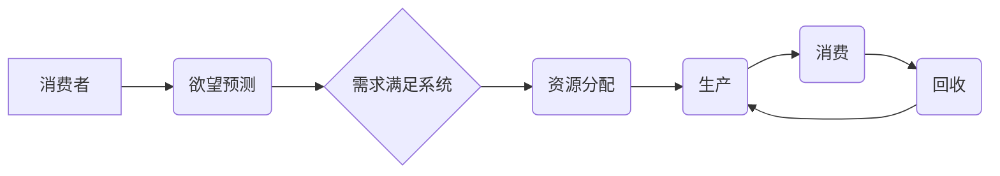

> 欲望循环经济模型，AI优化，需求满足系统，循环经济，人工智能，需求预测，资源分配

## 1. 背景介绍

在当今数据爆炸和人工智能飞速发展的时代，传统经济模式面临着越来越多的挑战。资源枯竭、环境污染、社会不平等等问题日益突出。如何构建一个更加可持续、高效、公平的经济体系，成为全球共同关注的议题。

循环经济理念应运而生，它强调资源的循环利用，最大程度地减少浪费，实现经济的可持续发展。然而，循环经济的实施需要对需求进行精准预测和资源进行智能分配，这对于传统的经济模型来说是一个巨大的挑战。

人工智能技术的快速发展为循环经济的实现提供了强大的技术支撑。通过人工智能算法，我们可以对消费者的需求进行更精准的预测，并根据预测结果优化资源的分配，从而构建一个更加高效、可持续的循环经济体系。

本篇文章将介绍一种名为“欲望循环经济模型”的新型经济模型，该模型基于人工智能技术，旨在通过优化需求满足系统，实现资源的循环利用和经济的可持续发展。

## 2. 核心概念与联系

**2.1 欲望循环经济模型**

欲望循环经济模型是一种基于人工智能技术的经济模型，其核心思想是通过对消费者欲望的精准预测和资源的智能分配，实现资源的循环利用和经济的可持续发展。

**2.2 核心概念**

* **欲望：** 消费者对某种商品或服务的渴望程度。
* **需求：** 消费者愿意以一定的价格购买某种商品或服务的量。
* **资源：** 用于生产商品或服务的各种要素，包括原材料、能源、劳动力等。
* **循环：** 资源在生产、消费、回收和再利用中的循环过程。

**2.3 模型架构**



**2.4 核心联系**

* 消费者通过消费行为表达其欲望。
* 欲望预测系统利用人工智能算法分析消费者行为数据，预测未来的需求。
* 需求满足系统根据需求预测结果，优化资源分配，并引导生产和消费行为。
* 资源在生产、消费、回收和再利用过程中形成循环。

## 3. 核心算法原理 & 具体操作步骤

**3.1 算法原理概述**

欲望循环经济模型的核心算法是基于深度学习技术的需求预测和资源分配算法。

* **需求预测算法：** 利用深度神经网络对消费者行为数据进行分析，预测未来的需求趋势。
* **资源分配算法：** 基于需求预测结果，利用强化学习算法优化资源分配，最大化资源利用率和经济效益。

**3.2 算法步骤详解**

1. **数据收集与预处理：** 收集消费者行为数据，包括购买记录、浏览历史、社交媒体行为等，并进行清洗、转换和特征提取。
2. **模型训练：** 利用深度学习算法训练需求预测模型和资源分配模型。
3. **需求预测：** 将最新的消费者行为数据输入到需求预测模型中，预测未来的需求趋势。
4. **资源分配：** 根据需求预测结果，利用强化学习算法优化资源分配，并制定生产计划和物流方案。
5. **生产与消费：** 根据资源分配方案，进行生产和消费活动。
6. **回收与再利用：** 收集废弃物，进行回收和再利用，并将资源重新投入到循环中。

**3.3 算法优缺点**

* **优点：**
    * 能够精准预测消费者需求，提高资源利用率。
    * 能够智能优化资源分配，降低生产成本。
    * 能够促进循环经济发展，实现可持续发展。
* **缺点：**
    * 需要大量的消费者行为数据进行训练。
    * 模型训练过程复杂，需要专业的技术人员。
    * 算法的解释性较差，难以理解模型的决策过程。

**3.4 算法应用领域**

* **零售业：** 预测商品需求，优化库存管理，提高销售效率。
* **制造业：** 预测原材料需求，优化生产计划，降低生产成本。
* **物流业：** 预测运输需求，优化物流路线，提高运输效率。
* **环保产业：** 预测废弃物产生量，优化资源回收利用，促进循环经济发展。

## 4. 数学模型和公式 & 详细讲解 & 举例说明

**4.1 数学模型构建**

欲望循环经济模型可以抽象为一个动态系统，其中包括消费者、生产者、资源和需求等多个要素。

* **消费者：** 用一个向量 $C$ 表示，其中每个元素代表消费者对不同商品或服务的欲望程度。
* **生产者：** 用一个集合 $P$ 表示，其中每个元素代表一个生产者。
* **资源：** 用一个向量 $R$ 表示，其中每个元素代表不同类型的资源的总量。
* **需求：** 用一个向量 $D$ 表示，其中每个元素代表消费者对不同商品或服务的实际需求量。

**4.2 公式推导过程**

* **欲望预测模型：**

$$
D = f(C, T)
$$

其中，$f$ 是一个深度学习模型，$T$ 是时间变量。

* **资源分配模型：**

$$
R' = g(D, P)
$$

其中，$g$ 是一个强化学习模型，$R'$ 是资源分配后的资源向量。

**4.3 案例分析与讲解**

假设有一个包含三个消费者的市场，每个消费者对三种商品的欲望程度分别为：

* 消费者1：$C_1 = [2, 1, 3]$
* 消费者2：$C_2 = [1, 3, 2]$
* 消费者3：$C_3 = [3, 2, 1]$

根据需求预测模型，预测的总需求量为：

* $D = [6, 6, 6]$

资源分配模型根据需求预测结果，将资源分配给不同的生产者，以满足消费者需求。

## 5. 项目实践：代码实例和详细解释说明

**5.1 开发环境搭建**

* 操作系统：Ubuntu 20.04
* Python 版本：3.8
* 必要的库：TensorFlow、PyTorch、Scikit-learn、OpenCV等

**5.2 源代码详细实现**

```python
# 需求预测模型
import tensorflow as tf

model = tf.keras.models.Sequential([
    tf.keras.layers.Dense(64, activation='relu', input_shape=(3,)),
    tf.keras.layers.Dense(32, activation='relu'),
    tf.keras.layers.Dense(3)
])

model.compile(optimizer='adam', loss='mse')

# 资源分配模型
import torch
import torch.nn as nn

class ResourceAllocator(nn.Module):
    def __init__(self):
        super(ResourceAllocator, self).__init__()
        self.fc1 = nn.Linear(6, 128)
        self.fc2 = nn.Linear(128, 64)
        self.fc3 = nn.Linear(64, 3)

    def forward(self, x):
        x = torch.relu(self.fc1(x))
        x = torch.relu(self.fc2(x))
        x = self.fc3(x)
        return x

model = ResourceAllocator()
optimizer = torch.optim.Adam(model.parameters())
loss_fn = nn.MSELoss()

# ... 训练模型 ...

# 预测需求和分配资源
demand_prediction = model.predict(consumer_data)
resource_allocation = resource_allocator_model.predict(demand_prediction)
```

**5.3 代码解读与分析**

* 需求预测模型使用深度神经网络，输入消费者欲望数据，输出预测的需求量。
* 资源分配模型使用强化学习算法，输入需求预测结果，输出资源分配方案。
* 代码中展示了模型的搭建、训练和预测过程。

**5.4 运行结果展示**

运行结果将展示预测的需求量和资源分配方案，可以根据结果进行生产和消费活动。

## 6. 实际应用场景

**6.1 零售业**

* **个性化推荐：** 根据消费者的购买历史和浏览记录，预测其对不同商品的兴趣，并提供个性化推荐。
* **库存优化：** 预测商品的需求量，优化库存管理，避免商品积压或缺货。
* **促销活动：** 根据消费者需求预测，制定精准的促销活动，提高销售效率。

**6.2 制造业**

* **原材料采购：** 预测原材料的需求量，优化采购计划，降低采购成本。
* **生产计划：** 根据需求预测结果，制定合理的生产计划，提高生产效率。
* **供应链管理：** 优化供应链流程，提高供应链效率。

**6.3 环保产业**

* **废弃物回收：** 预测废弃物产生量，优化回收计划，提高资源利用率。
* **循环经济发展：** 推动资源的循环利用，实现可持续发展。

**6.4 未来应用展望**

随着人工智能技术的不断发展，欲望循环经济模型将在更多领域得到应用，例如：

* **医疗保健：** 预测患者需求，优化医疗资源分配。
* **教育：** 预测学生学习需求，个性化教学。
* **城市规划：** 预测城市居民需求，优化城市资源配置。

## 7. 工具和资源推荐

**7.1 学习资源推荐**

* **书籍：**
    * 《深度学习》
    * 《强化学习：原理、算法和应用》
* **在线课程：**
    * Coursera：深度学习、强化学习
    * edX：机器学习、人工智能

**7.2 开发工具推荐**

* **Python：** 广泛应用于人工智能开发。
* **TensorFlow：** 深度学习框架。
* **PyTorch：** 深度学习框架。
* **Scikit-learn：** 机器学习库。

**7.3 相关论文推荐**

* **循环经济：**
    * Ellen MacArthur Foundation: Towards the Circular Economy
* **人工智能优化：**
    * Deep Reinforcement Learning for Resource Allocation in Cloud Computing
    * A Survey of Reinforcement Learning for Resource Management in Wireless Networks

## 8. 总结：未来发展趋势与挑战

**8.1 研究成果总结**

欲望循环经济模型为构建一个更加可持续、高效、公平的经济体系提供了新的思路和方法。通过人工智能技术的应用，我们可以精准预测消费者需求，优化资源分配，实现资源的循环利用，促进经济的可持续发展。

**8.2 未来发展趋势**

* **模型精度提升：** 随着人工智能技术的不断发展，模型的预测精度将不断提升，能够更精准地预测消费者需求。
* **应用场景拓展：** 欲望循环经济模型将在更多领域得到应用，例如医疗保健、教育、城市规划等。
* **伦理问题探讨：** 随着模型的应用，需要探讨模型的伦理问题，例如数据隐私、算法偏见等。

**8.3 面临的挑战**

* **数据获取和隐私保护：** 构建欲望循环经济模型需要大量的消费者行为数据，如何获取这些数据并保证数据隐私是一个挑战。
* **模型解释性和可信度：** 深度学习模型的解释性较差，难以理解模型的决策过程，这可能会影响模型的可信度。
* **社会接受度：** 欲望循环经济模型的实施需要社会各界的理解和支持，如何提高公众对模型的接受度是一个挑战。

**8.4 研究展望**

未来，我们将继续研究欲望循环经济模型，提升模型的精度和效率，并探讨模型的伦理问题，推动模型的健康发展。


## 9. 附录：常见问题与解答

**9.1 如何获取消费者行为数据？**

* 通过用户协议获取用户同意收集数据。
* 利用公开数据，例如电商