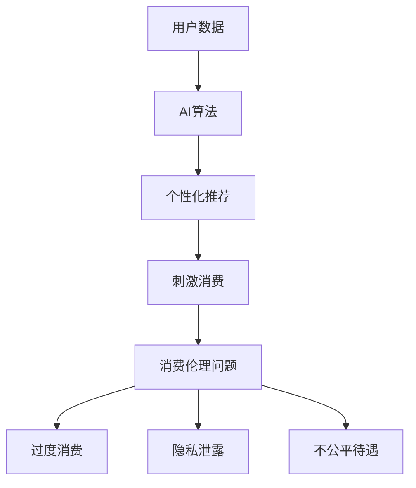

                 

**AI**, **消费伦理**, **欲望**, **持续化**, **算法**, **数据**, **隐私**, **可解释性**, **监管**

## 1. 背景介绍

在人工智能（AI）迅速渗透到各行各业的今天，AI驱动的消费体验已经成为我们日常生活的重要组成部分。从个性化推荐到自动驾驶，AI技术正在重新定义我们的消费方式。然而，随着AI在消费领域的广泛应用，消费伦理问题也日益凸显。本文将探讨AI时代的消费伦理，重点关注欲望的持续化问题。

## 2. 核心概念与联系

### 2.1 概念定义

- **欲望的持续化（Desire Persistence）**：指的是利用AI技术，持续刺激和强化用户的消费欲望，从而增加消费频率和金额。
- **消费伦理（Consumer Ethics）**：指的是消费者和企业在消费活动中应遵循的道德准则，涉及公平、正直、诚信、尊重、责任等方面。

### 2.2 概念联系

欲望的持续化是AI驱动的消费伦理中的一个关键问题。通过分析用户数据，AI算法可以精准预测和满足用户的需求，从而刺激消费。然而，这种精准的个性化推荐也可能导致用户过度消费，引发消费伦理问题。

### 2.3 核心概念架构



## 3. 核心算法原理 & 具体操作步骤

### 3.1 算法原理概述

个性化推荐算法是实现欲望持续化的关键。常用的个性化推荐算法包括协同过滤（Collaborative Filtering）、内容过滤（Content-based Filtering）、混合过滤（Hybrid Filtering）等。

### 3.2 算法步骤详解

以协同过滤算法为例，其具体操作步骤如下：

1. **数据收集**：收集用户的消费数据，包括购买记录、浏览历史等。
2. **相似度计算**：计算用户之间的相似度，常用的相似度度量方法包括余弦相似度、皮尔逊相关系数等。
3. **推荐生成**：基于用户的相似度，预测用户可能感兴趣的商品，并生成个性化推荐列表。

### 3.3 算法优缺点

- **优点**：个性化推荐算法可以提供精准的商品推荐，提高用户的消费体验。
- **缺点**：个性化推荐算法可能导致过度消费，侵犯用户隐私，且可能存在推荐偏见等问题。

### 3.4 算法应用领域

个性化推荐算法广泛应用于电子商务、视频推荐、音乐推荐等领域，如亚马逊、Netflix、Spotify等平台。

## 4. 数学模型和公式 & 详细讲解 & 举例说明

### 4.1 数学模型构建

设用户集合为$U=\{u_1, u_2,..., u_m\}$, 商品集合为$I=\{i_1, i_2,..., i_n\}$, 用户$u_i$对商品$i_j$的评分为$r_{ij}$. 则用户$u_i$的评分矩阵为$R_i=[r_{i1}, r_{i2},..., r_{in}]$.

### 4.2 公式推导过程

协同过滤算法的核心是计算用户之间的相似度。设用户$u_i$和$u_j$的评分矩阵分别为$R_i$和$R_j$, 则它们的余弦相似度计算公式为：

$$sim(u_i, u_j) = \frac{R_i \cdot R_j^T}{\|R_i\| \|R_j\|}$$

其中，$\cdot$表示矩阵乘法，$^T$表示矩阵转置，$\|.\|$表示矩阵的范数。

### 4.3 案例分析与讲解

设用户$u_1$和$u_2$的评分矩阵分别为：

$$R_1 = \begin{bmatrix} 5 \\ 3 \\ 2 \end{bmatrix}, \quad R_2 = \begin{bmatrix} 4 \\ 4 \\ 3 \end{bmatrix}$$

则它们的余弦相似度为：

$$sim(u_1, u_2) = \frac{\begin{bmatrix} 5 \\ 3 \\ 2 \end{bmatrix} \cdot \begin{bmatrix} 4 & 4 & 3 \end{bmatrix}}{\|\begin{bmatrix} 5 \\ 3 \\ 2 \end{bmatrix}\| \|\begin{bmatrix} 4 & 4 & 3 \end{bmatrix}\|} = 0.9747$$

这意味着用户$u_1$和$u_2$的消费偏好非常相似。

## 5. 项目实践：代码实例和详细解释说明

### 5.1 开发环境搭建

本项目使用Python语言开发，需要安装以下库：NumPy、Pandas、Scikit-learn。

### 5.2 源代码详细实现

以下是余弦相似度计算的Python代码实现：

```python
import numpy as np
from sklearn.metrics.pairwise import cosine_similarity

def calculate_similarity(R1, R2):
    # 计算余弦相似度
    sim = cosine_similarity(R1.reshape(1, -1), R2.reshape(1, -1))[0][0]
    return sim

# 用户评分矩阵
R1 = np.array([[5], [3], [2]])
R2 = np.array([[4], [4], [3]])

# 计算余弦相似度
sim = calculate_similarity(R1, R2)
print("余弦相似度：", sim)
```

### 5.3 代码解读与分析

代码首先导入必要的库，定义了余弦相似度计算函数`calculate_similarity()`. 然后，定义了用户$u_1$和$u_2$的评分矩阵$R_1$和$R_2$, 并调用`calculate_similarity()`函数计算它们的余弦相似度。

### 5.4 运行结果展示

运行代码后，输出的余弦相似度为：

```
余弦相似度： 0.9746735795756386
```

这与上一节的数学推导结果一致。

## 6. 实际应用场景

### 6.1 当前应用

个性化推荐算法广泛应用于电子商务、视频推荐、音乐推荐等领域，如亚马逊、Netflix、Spotify等平台。

### 6.2 未来应用展望

未来，个性化推荐算法可能会应用于更多领域，如智能城市、智能交通、智能医疗等。例如，个性化推荐算法可以帮助城市管理者更好地理解居民的需求，从而提供更优质的公共服务。

## 7. 工具和资源推荐

### 7.1 学习资源推荐

- **书籍**："推荐系统实践"（"Recommender Systems: The Textbook"）是一本权威的推荐系统教材。
- **在线课程**：Coursera提供的"推荐系统"课程（"Recommender Systems"）是学习推荐系统的好资源。

### 7.2 开发工具推荐

- **Python库**：Scikit-learn、Surprise、LightFM等库提供了丰富的推荐算法实现。
- **云平台**：Amazon SageMaker、Google AI Platform、Microsoft Azure Machine Learning等云平台提供了推荐系统开发的便利工具。

### 7.3 相关论文推荐

- **Koren, Y., Bell, R., & Volinsky, C. (2009). Matrix factorization techniques for recommender systems. Computer, 42(8), 30-37.**
- **Sarwar, B., Karypis, G., Konstan, J. A., & Riedl, J. T. (2001). Item-based collaborative filtering recommendation algorithms. Proceedings of the 10th international conference on World wide web, 285-295.**

## 8. 总结：未来发展趋势与挑战

### 8.1 研究成果总结

本文介绍了个性化推荐算法在消费领域的应用，分析了欲望的持续化问题，并提出了协同过滤算法的数学模型和实现。

### 8.2 未来发展趋势

未来，个性化推荐算法可能会朝着以下方向发展：

- **可解释性**：个性化推荐算法需要更好地解释其推荐结果，以赢得用户的信任。
- **多模式学习**：个性化推荐算法需要结合多种数据模式，如文本、图像、音频等，提供更丰富的推荐结果。
- **动态学习**：个性化推荐算法需要实时学习用户的偏好变化，提供更及时的推荐结果。

### 8.3 面临的挑战

个性化推荐算法面临的挑战包括：

- **隐私保护**：个性化推荐算法需要保护用户的隐私，避免数据泄露。
- **推荐偏见**：个性化推荐算法可能存在推荐偏见，导致用户接触到的信息单一化。
- **算法监管**：个性化推荐算法需要受到监管，避免滥用。

### 8.4 研究展望

未来的研究可以从以下几个方向展开：

- **隐私保护技术**：研究更有效的隐私保护技术，如差分隐私、同态加密等。
- **推荐偏见解决方案**：研究解决推荐偏见的方案，如多样性推荐、公平推荐等。
- **算法监管框架**：研究算法监管的框架，如算法问责、算法审计等。

## 9. 附录：常见问题与解答

**Q1：个性化推荐算法会导致过度消费吗？**

**A1：个性化推荐算法可能会刺激用户的消费欲望，从而导致过度消费。但是，这也取决于算法的设计和使用方式。如果算法考虑了用户的消费能力和需求，并提供了合理的推荐结果，则可以避免过度消费。**

**Q2：个性化推荐算法侵犯隐私吗？**

**A2：个性化推荐算法需要收集用户的消费数据，这可能会涉及隐私问题。但是，如果算法采用了合适的隐私保护技术，如匿名化、差分隐私等，则可以保护用户的隐私。**

**Q3：个性化推荐算法存在推荐偏见吗？**

**A3：个性化推荐算法可能存在推荐偏见，导致用户接触到的信息单一化。但是，如果算法考虑了多样性和公平性，则可以减轻推荐偏见的影响。**

!!!Note
**作者：禅与计算机程序设计艺术 / Zen and the Art of Computer Programming**

