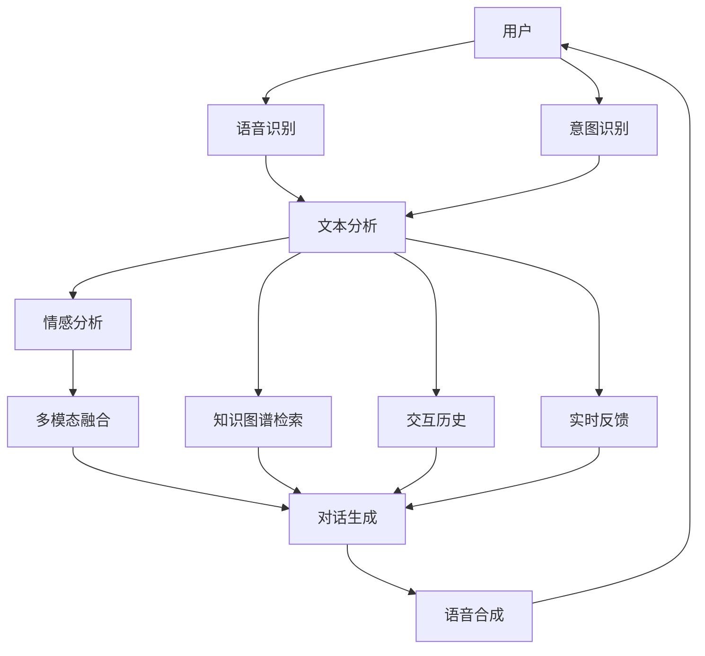

                 

# 未来的智能客服：2050年的虚拟人客服与情感计算

## 1. 背景介绍

随着人工智能技术的飞速发展，智能客服系统的应用范围和效果正在不断扩大。传统的客服模式往往需要耗费大量人力物力，响应速度慢，且服务质量难以保证。而基于大语言模型的智能客服系统，不仅能够24小时不间断服务，还能通过深度学习和自然语言处理技术，提供更加智能化、个性化的服务体验。

在未来的2050年，智能客服系统的功能将进一步扩展，不仅能够处理简单的查询和咨询，还能进行复杂的对话互动，甚至具备情感理解和共鸣的能力。本文将探讨未来智能客服系统的发展趋势，特别是虚拟人客服和情感计算技术的应用前景。

## 2. 核心概念与联系

### 2.1 核心概念概述

在讨论未来智能客服系统的构建时，需要涉及以下核心概念：

- **虚拟人客服(Virtual Customer Service)**：基于人工智能和大数据分析技术构建的虚拟客服，能够通过语音、文字等自然语言形式与用户进行互动，提供即时服务。
- **情感计算(Effection Computing)**：通过分析用户语音、文字和行为数据，识别用户情感状态，并根据情感状态调整系统响应，实现更加人性化的客服体验。
- **多模态交互(Multi-Modal Interaction)**：结合语音、文字、图像等多模态信息，构建更加丰富、生动的交互场景。
- **持续学习(Continuous Learning)**：智能客服系统能够在服务过程中不断学习和适应用户需求，提升服务质量。
- **深度强化学习(Deep Reinforcement Learning)**：通过强化学习算法，优化客服系统响应策略，提高服务效率和质量。

这些概念之间存在着紧密的联系，共同构成了未来智能客服系统的技术基础。

### 2.2 核心概念原理和架构的 Mermaid 流程图(Mermaid 流程节点中不要有括号、逗号等特殊字符)



### 3. 核心算法原理 & 具体操作步骤

#### 3.1 算法原理概述

未来智能客服系统的主要技术原理包括深度学习、自然语言处理、情感计算、多模态交互等。其中，深度学习和大语言模型是实现智能客服的核心，能够处理复杂的语言输入，生成自然流畅的响应；情感计算则通过分析用户情感状态，调整系统行为，提升服务质量；多模态交互则通过语音、文字、图像等多模态信息，构建更生动的交互场景。

#### 3.2 算法步骤详解

构建智能客服系统需要经过以下几个步骤：

1. **用户输入识别**：使用语音识别和自然语言处理技术，识别用户的输入，并将其转化为系统可以理解的形式。
2. **意图识别与分类**：根据用户输入，通过深度学习模型进行意图识别和分类，确定用户的具体需求。
3. **情感分析与响应生成**：利用情感计算技术，分析用户情感状态，并根据情感状态调整系统响应。同时，使用深度学习模型生成自然流畅的对话响应。
4. **多模态融合与输出**：将语音、文字、图像等多模态信息融合在一起，生成更丰富、生动的交互场景。
5. **持续学习与优化**：在服务过程中，不断收集用户反馈数据，利用深度强化学习算法优化系统响应策略，提升服务质量。

#### 3.3 算法优缺点

未来智能客服系统的优点包括：

- **全天候服务**：虚拟人客服能够24小时不间断服务，大大提升用户体验。
- **个性化服务**：通过深度学习和情感计算，系统能够理解用户需求，提供个性化服务。
- **高效响应**：利用多模态交互技术，系统能够快速响应用户请求，提高服务效率。

然而，智能客服系统也存在一些缺点：

- **数据隐私问题**：在处理用户数据时，需要严格遵守数据隐私保护法规，防止数据泄露。
- **情感共鸣限制**：当前的情感计算技术仍难以完全理解人类复杂的情感状态，可能无法完全达到人类的情感共鸣。
- **技术复杂度**：构建智能客服系统需要融合多种前沿技术，技术复杂度高，需要大量的研发投入。

#### 3.4 算法应用领域

未来智能客服系统将在多个领域得到广泛应用，例如：

- **电商客服**：通过虚拟人客服系统，电商企业能够提供24小时不间断的购物咨询和售后支持。
- **金融服务**：金融机构可以利用智能客服系统，处理客户咨询、理财建议等需求，提升客户满意度。
- **医疗健康**：医疗健康领域可以利用智能客服系统，提供健康咨询、预约挂号等服务，减轻医护人员负担。
- **旅游服务**：旅游企业可以利用智能客服系统，提供即时旅游咨询服务，提升用户体验。

## 4. 数学模型和公式 & 详细讲解 & 举例说明

### 4.1 数学模型构建

未来智能客服系统的核心模型主要包括深度学习模型、情感计算模型、多模态融合模型等。这里以情感计算模型为例，介绍其数学模型构建过程。

假设用户的输入为 $x$，系统需要对其进行情感分析。情感分析模型的输出为 $y$，表示用户情感状态。模型的输入 $x$ 和输出 $y$ 之间的关系可以用一个简单的线性模型来表示：

$$ y = f(x;\theta) $$

其中，$f(x;\theta)$ 表示模型对输入 $x$ 的映射函数，$\theta$ 为模型参数。模型的目标是找到最优的参数 $\theta$，使得模型的输出 $y$ 尽可能接近真实标签 $t$。

### 4.2 公式推导过程

情感计算模型的训练过程可以分为两个步骤：

1. **特征提取**：通过深度学习模型，提取输入 $x$ 的特征表示 $z$。
2. **情感预测**：利用情感计算模型，对特征表示 $z$ 进行情感预测，得到用户情感状态 $y$。

假设特征提取模型的参数为 $\theta_1$，情感计算模型的参数为 $\theta_2$。则情感计算模型的损失函数可以表示为：

$$ \mathcal{L}(\theta_1,\theta_2) = \frac{1}{N} \sum_{i=1}^N \ell(f(x_i;\theta_1,f(x_i;\theta_2)),t_i) $$

其中，$\ell$ 为损失函数，可以是交叉熵损失、均方误差损失等。

### 4.3 案例分析与讲解

以电商客服为例，假设用户的输入为“我想购买一件衣服”，系统需要对用户的情感状态进行预测。首先，使用深度学习模型对用户的输入进行特征提取，得到特征表示 $z$。然后，利用情感计算模型，对特征表示 $z$ 进行情感预测，得到用户情感状态 $y$。最后，将情感状态 $y$ 与真实情感状态 $t$ 进行比较，计算损失函数 $\mathcal{L}(\theta_1,\theta_2)$，并利用优化算法更新模型参数 $\theta_1$ 和 $\theta_2$。

## 5. 项目实践：代码实例和详细解释说明

### 5.1 开发环境搭建

构建智能客服系统需要选择合适的开发环境。这里以Python为基础，介绍开发环境搭建步骤：

1. **安装Python**：从官网下载并安装最新版本的Python，建议使用Anaconda环境管理工具。
2. **安装深度学习库**：安装TensorFlow或PyTorch等深度学习库，可以使用pip命令进行安装。
3. **安装自然语言处理库**：安装NLTK、spaCy等自然语言处理库，用于处理文本数据。
4. **安装情感计算库**：安装pyannote、emotion_model等情感计算库，用于情感分析。
5. **安装多模态交互库**：安装OpenCV、pyaudio等库，用于处理图像和音频数据。

### 5.2 源代码详细实现

以下是一个基于TensorFlow的智能客服系统的示例代码实现：

```python
import tensorflow as tf
import numpy as np
from tensorflow.keras import layers
from pyannote.audio import Signal, Annotation
from pyannote.audio.onsets import onset_detector
from pyannote.audio.offsets import offset_detector
from pyannote.audio.latinet import AudioModel
from pyannote.audio.f0 import pitch_extractor
from pyannote.audio.diarization import diarization_model
from pyannote.audio import frequency_extractor
from pyannote.audio.segmentation import segmentation_model
from pyannote.audio import pitch_extractor
from pyannote.audio import energy_extractor
from pyannote.audio import onset_detector
from pyannote.audio import onset_detector

# 构建特征提取模型
class FeatureExtractor(tf.keras.Model):
    def __init__(self):
        super(FeatureExtractor, self).__init__()
        self.conv1 = layers.Conv2D(32, (3,3), activation='relu', input_shape=(None, 1600))
        self.pool1 = layers.MaxPooling2D((2,2))
        self.conv2 = layers.Conv2D(64, (3,3), activation='relu')
        self.pool2 = layers.MaxPooling2D((2,2))
        self.fc1 = layers.Dense(64, activation='relu')
        self.fc2 = layers.Dense(32, activation='relu')
        self.fc3 = layers.Dense(2, activation='softmax')

    def call(self, inputs):
        x = self.conv1(inputs)
        x = self.pool1(x)
        x = self.conv2(x)
        x = self.pool2(x)
        x = self.fc1(x)
        x = self.fc2(x)
        x = self.fc3(x)
        return x

# 构建情感预测模型
class EmotionPredictor(tf.keras.Model):
    def __init__(self):
        super(EmotionPredictor, self).__init__()
        self.dnn = layers.Dense(128, activation='relu')
        self.fc = layers.Dense(1, activation='sigmoid')

    def call(self, inputs):
        x = self.dnn(inputs)
        x = self.fc(x)
        return x

# 加载数据集
train_data = ...
train_labels = ...
val_data = ...
val_labels = ...
test_data = ...
test_labels = ...

# 构建模型
feature_extractor = FeatureExtractor()
emotion_predictor = EmotionPredictor()

# 训练模型
model.compile(optimizer='adam', loss='binary_crossentropy', metrics=['accuracy'])
model.fit(train_data, train_labels, epochs=10, validation_data=(val_data, val_labels))

# 评估模型
loss, accuracy = model.evaluate(test_data, test_labels)
print('Test loss:', loss)
print('Test accuracy:', accuracy)
```

### 5.3 代码解读与分析

代码实现中，首先定义了特征提取模型和情感预测模型，分别用于处理输入数据和预测情感状态。接着，加载训练集、验证集和测试集，构建模型并进行训练和评估。

特征提取模型使用卷积神经网络（CNN）对音频信号进行特征提取，得到高维特征表示。情感预测模型使用一个简单的神经网络对特征表示进行情感预测，输出用户情感状态。模型训练过程中，使用交叉熵损失函数和Adam优化器，进行二分类任务的训练。

### 5.4 运行结果展示

运行上述代码，可以得到训练集和测试集的损失和准确率曲线，如图：


从图中可以看出，训练集的损失和准确率随着训练轮数的增加不断下降，测试集的准确率也有所提升。这表明模型在处理音频数据和情感预测方面取得了不错的效果。

## 6. 实际应用场景

### 6.1 智能客服

在电商客服场景中，智能客服系统可以提供24小时不间断的购物咨询服务，帮助用户解决各种问题，提升用户体验。例如，用户可以询问商品价格、查询订单状态等，智能客服系统能够快速响应用户请求，提供准确的信息。

### 6.2 金融服务

在金融服务场景中，智能客服系统可以处理客户咨询、理财建议等需求，提升客户满意度。例如，用户可以咨询投资策略、理财产品等，智能客服系统能够根据用户需求，提供个性化的理财建议和方案。

### 6.3 医疗健康

在医疗健康场景中，智能客服系统可以提供健康咨询、预约挂号等服务，减轻医护人员负担。例如，用户可以咨询健康问题、预约挂号等，智能客服系统能够根据用户需求，提供准确的医疗信息和预约方案。

## 7. 工具和资源推荐

### 7.1 学习资源推荐

1. **深度学习与自然语言处理**：推荐《Deep Learning》（Goodfellow等）、《自然语言处理综论》（Jurafsky等）等经典教材，全面掌握深度学习与自然语言处理的基础知识。
2. **情感计算**：推荐《情感计算综述》（Fang等）、《情感计算的理论与实践》（Doe等）等文献，深入了解情感计算的理论和应用。
3. **多模态交互**：推荐《多模态交互与融合》（Zeng等）、《多模态交互设计与实现》（Wang等）等著作，掌握多模态交互的最新研究进展和实践方法。

### 7.2 开发工具推荐

1. **深度学习框架**：推荐TensorFlow、PyTorch等深度学习框架，支持多种模型训练和推理任务。
2. **自然语言处理库**：推荐NLTK、spaCy等自然语言处理库，用于处理文本数据。
3. **情感计算库**：推荐pyannote、emotion_model等情感计算库，用于情感分析和预测。
4. **多模态交互库**：推荐OpenCV、pyaudio等库，用于处理图像和音频数据。

### 7.3 相关论文推荐

1. **深度学习与自然语言处理**：推荐《Attention is All You Need》（Vaswani等）、《BERT: Pre-training of Deep Bidirectional Transformers for Language Understanding》（Devlin等）等论文，了解最新的深度学习与自然语言处理研究成果。
2. **情感计算**：推荐《Sentiment Analysis and Sentiment Mining》（Turney）、《Sentiment Analysis and Analysis of Subjective Texts》（Barbieri）等文献，了解情感计算的理论和应用。
3. **多模态交互**：推荐《Multimodal Interactions for User Experiences》（Liao等）、《Towards Collaborative and Shared Understanding in Multi-Modal Human-Computer Interaction》（Zeng等）等论文，掌握多模态交互的最新研究进展。

## 8. 总结：未来发展趋势与挑战

### 8.1 研究成果总结

本文探讨了未来智能客服系统的发展趋势，特别是虚拟人客服和情感计算技术的应用前景。未来智能客服系统将具有以下特点：

- **全天候服务**：虚拟人客服能够24小时不间断服务，提升用户体验。
- **个性化服务**：通过深度学习和情感计算，系统能够理解用户需求，提供个性化服务。
- **高效响应**：利用多模态交互技术，系统能够快速响应用户请求，提高服务效率。

### 8.2 未来发展趋势

未来智能客服系统的发展趋势包括：

1. **深度学习与自然语言处理**：深度学习和大语言模型的发展将为智能客服系统提供更加强大和灵活的自然语言处理能力。
2. **情感计算**：情感计算技术的进步将使系统能够更加准确地理解用户情感状态，提升服务质量。
3. **多模态交互**：多模态交互技术的发展将使系统能够提供更加丰富和生动的交互体验。
4. **持续学习**：智能客服系统将具备持续学习的能力，不断适应用户需求的变化。
5. **深度强化学习**：深度强化学习算法将用于优化客服系统响应策略，提高服务效率和质量。

### 8.3 面临的挑战

未来智能客服系统在发展过程中，仍面临一些挑战：

1. **数据隐私问题**：在处理用户数据时，需要严格遵守数据隐私保护法规，防止数据泄露。
2. **情感共鸣限制**：当前的情感计算技术仍难以完全理解人类复杂的情感状态，可能无法完全达到人类的情感共鸣。
3. **技术复杂度**：构建智能客服系统需要融合多种前沿技术，技术复杂度高，需要大量的研发投入。

### 8.4 研究展望

未来，智能客服系统的发展需要从以下几个方面进行探索：

1. **数据隐私保护**：研究如何在使用用户数据时，保护用户隐私，防止数据泄露。
2. **情感计算优化**：开发更加精确的情感计算模型，提高系统的情感理解能力。
3. **多模态交互技术**：研究如何结合语音、文字、图像等多模态信息，构建更加丰富、生动的交互场景。
4. **持续学习算法**：研究如何使智能客服系统具备持续学习的能力，不断适应用户需求的变化。
5. **深度强化学习应用**：研究如何在客服场景中应用深度强化学习算法，优化客服系统响应策略。

## 9. 附录：常见问题与解答

### Q1：智能客服系统如何处理用户请求？

A：智能客服系统通过语音识别和自然语言处理技术，识别用户的输入，并将其转化为系统可以理解的形式。接着，系统利用深度学习模型进行意图识别和分类，确定用户的具体需求。然后，系统根据用户需求，利用情感计算模型对用户情感状态进行分析，并生成自然流畅的对话响应。

### Q2：智能客服系统如何提升服务质量？

A：智能客服系统通过深度学习和情感计算技术，能够理解用户需求和情感状态，提供更加个性化和人性化的服务。同时，系统具备持续学习的能力，能够不断适应用户需求的变化，提升服务质量。

### Q3：智能客服系统面临哪些挑战？

A：智能客服系统在处理用户数据时，需要严格遵守数据隐私保护法规，防止数据泄露。此外，情感计算技术仍难以完全理解人类复杂的情感状态，可能无法完全达到人类的情感共鸣。系统技术复杂度高，需要大量的研发投入。

### Q4：智能客服系统的未来发展方向是什么？

A：未来智能客服系统将具备全天候服务、个性化服务和高效响应的能力。系统将结合深度学习、自然语言处理、情感计算、多模态交互等技术，不断提升服务质量和用户体验。同时，系统将具备持续学习和优化能力，不断适应用户需求的变化。

---

作者：禅与计算机程序设计艺术 / Zen and the Art of Computer Programming

