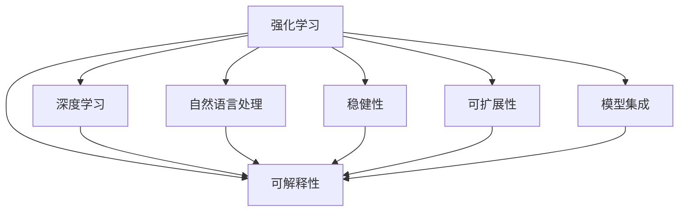

                 

# 未来的智能投资：2050年的AI量化交易与智能资产配置

## 1. 背景介绍

### 1.1 问题由来

随着人工智能技术的飞速发展，AI量化交易和智能资产配置成为金融行业的重要趋势。AI技术可以处理大量数据，从中挖掘出传统方法难以发现的规律，帮助投资者实现更高效的投资决策。然而，现有的AI量化方法仍面临诸多挑战，如模型的可解释性不足、过拟合问题、稳健性差等。

为解决这些问题，本文将系统介绍基于强化学习、深度学习和自然语言处理等前沿技术的AI量化交易和智能资产配置方法，并展望2050年AI在金融领域的未来应用前景。

### 1.2 问题核心关键点

1. 强化学习（Reinforcement Learning, RL）：通过智能体在金融环境中不断试错，学习最优投资策略。
2. 深度学习（Deep Learning, DL）：构建复杂的神经网络模型，从历史数据中学习非线性关系。
3. 自然语言处理（Natural Language Processing, NLP）：处理文本类投资信息，辅助决策。
4. 可解释性：使模型决策过程透明化，增强投资者对模型的信任。
5. 稳健性：确保模型在各种市场情况下都能稳定运行。
6. 可扩展性：模型能够处理大规模、高频交易场景。
7. 模型集成：结合多种模型，实现更优的投资组合。

这些核心关键点构成了AI量化交易和智能资产配置的技术基础，我们将在接下来的章节中深入探讨其原理与实现。

## 2. 核心概念与联系

### 2.1 核心概念概述

本节将介绍几个核心概念，并展示它们之间的联系。

- **强化学习（Reinforcement Learning, RL）**：通过智能体在金融环境中不断试错，学习最优投资策略。
- **深度学习（Deep Learning, DL）**：构建复杂的神经网络模型，从历史数据中学习非线性关系。
- **自然语言处理（Natural Language Processing, NLP）**：处理文本类投资信息，辅助决策。
- **可解释性**：使模型决策过程透明化，增强投资者对模型的信任。
- **稳健性**：确保模型在各种市场情况下都能稳定运行。
- **可扩展性**：模型能够处理大规模、高频交易场景。
- **模型集成**：结合多种模型，实现更优的投资组合。

这些概念之间的联系可以用以下Mermaid流程图来展示：



这个流程图展示了几类核心概念之间的联系：

1. **RL与DL的结合**：通过RL优化DL模型的参数，获得更好的学习效果。
2. **NLP与RL/DL的结合**：处理文本信息，增强模型的决策能力。
3. **可解释性、稳健性、可扩展性与RL/DL/NLP的结合**：提升模型的可靠性、稳定性和适应性。
4. **模型集成**：将多模型融合，实现更优的投资组合。

这些核心概念共同构成了AI量化交易和智能资产配置的技术框架，使其能够在复杂多变的金融市场中发挥作用。

## 3. 核心算法原理 & 具体操作步骤

### 3.1 算法原理概述

基于强化学习和深度学习的AI量化交易和智能资产配置，可以描述为智能体在金融市场环境中，通过与环境的交互，学习最优策略的过程。具体而言：

- **RL算法**：智能体接收环境状态$s_t$，执行动作$a_t$，观察奖励$r_t$和下一个状态$s_{t+1}$，通过学习状态-动作映射$q(s,a)$，优化决策策略$\pi(a|s)$。
- **DL模型**：通过历史数据$D=\{(x_i, y_i)\}_{i=1}^N$，学习输入-输出映射$f(x; \theta)$，其中$\theta$为模型参数。
- **NLP技术**：通过文本预处理、情感分析等手段，提取文本信息，辅助决策。

### 3.2 算法步骤详解

基于RL和DL的AI量化交易和智能资产配置，通常包括以下步骤：

**Step 1: 数据准备**

- 收集历史交易数据，包括股票价格、交易量、财务报表等。
- 将数据进行预处理，如缺失值处理、归一化等。
- 准备文本数据，如新闻、公告、公司报告等。

**Step 2: 模型构建**

- 构建深度学习模型，如卷积神经网络（CNN）、循环神经网络（RNN）、长短期记忆网络（LSTM）等。
- 通过超参数调优，选择最优模型。
- 将文本数据转化为模型可接受的格式。

**Step 3: 特征提取**

- 提取交易数据的关键特征，如趋势、波动率、风险等。
- 提取文本数据的情感、主题等信息。
- 通过融合多源信息，构建综合特征。

**Step 4: 模型训练**

- 将交易数据和文本数据输入模型，进行联合训练。
- 使用强化学习算法，优化模型参数，提升决策性能。
- 在测试集上进行模型验证，确保泛化性能。

**Step 5: 模型评估**

- 通过回测等手段，评估模型在历史数据上的表现。
- 使用风险指标（如夏普比率、VaR），评估模型风险控制能力。
- 定期更新模型，应对市场变化。

### 3.3 算法优缺点

基于强化学习和深度学习的AI量化交易和智能资产配置，具有以下优点：

- **自动化决策**：通过模型自动化决策，减少人为干扰，提高投资效率。
- **处理复杂数据**：深度学习模型能够处理大规模、高维数据，从历史数据中挖掘规律。
- **适应性强**：强化学习算法能够适应复杂多变的市场环境，实现更优策略。

然而，这些方法也存在一些缺点：

- **模型复杂度高**：构建深度学习模型需要大量计算资源，模型参数量庞大。
- **过拟合风险**：深度学习模型容易过拟合历史数据，导致泛化性能差。
- **可解释性差**：模型决策过程难以解释，投资者难以理解。
- **实时性不足**：模型训练和预测耗时较长，难以实时响应市场变化。

为了解决这些问题，未来的研究将集中在提升模型的可解释性、提高实时性和泛化性能等方面。

### 3.4 算法应用领域

基于强化学习和深度学习的AI量化交易和智能资产配置，已经广泛应用于以下几个领域：

- **股票交易**：构建股票价格预测模型，进行高频交易。
- **期货交易**：构建期货价格预测模型，进行套利策略。
- **外汇交易**：构建外汇价格预测模型，进行外汇套利。
- **资产配置**：构建资产配置模型，实现最优投资组合。
- **风险管理**：构建风险预测模型，进行风险控制。

除了上述这些领域，AI量化交易和智能资产配置还被应用于量化研究、高频交易、算法交易等领域，推动了金融行业的创新与发展。

## 4. 数学模型和公式 & 详细讲解 & 举例说明

### 4.1 数学模型构建

基于强化学习和深度学习的AI量化交易和智能资产配置，可以构建以下数学模型：

- **状态空间**：定义市场状态$s_t$，包括股票价格、交易量、技术指标等。
- **动作空间**：定义投资决策$a_t$，如买入、卖出、持有等。
- **奖励函数**：定义奖励$r_t$，如收益、波动率等。
- **模型参数**：定义模型参数$\theta$，如深度学习模型的权重和偏置。

### 4.2 公式推导过程

以下以强化学习中的Q-learning算法为例，推导其数学公式：

- **状态-动作价值函数**：$Q(s,a) = \mathbb{E}[\sum_{t'=t}^{\infty} \gamma^{t'-t} r_{t'} | s_t=a]$
- **Q-learning更新公式**：$Q(s,a) \leftarrow Q(s,a) + \alpha[r + \gamma \max_a Q(s',a) - Q(s,a)]$

其中$\alpha$为学习率，$\gamma$为折现因子。

### 4.3 案例分析与讲解

以股票价格预测为例，我们可以构建以下模型：

- **输入数据**：历史股票价格$x_i$。
- **输出数据**：未来一天股票价格$y_i$。
- **模型**：深度学习模型，如LSTM。
- **训练过程**：使用Q-learning算法，优化模型参数$\theta$。
- **评估过程**：在测试集上评估模型性能，计算MAE、MAPE等指标。

通过深度学习模型和强化学习算法的结合，可以实现更精准的股票价格预测，提升投资收益。

## 5. 项目实践：代码实例和详细解释说明

### 5.1 开发环境搭建

在进行项目实践前，我们需要准备好开发环境。以下是使用Python进行PyTorch开发的流程：

1. 安装Anaconda：从官网下载并安装Anaconda，用于创建独立的Python环境。
2. 创建并激活虚拟环境：
```bash
conda create -n pytorch-env python=3.8 
conda activate pytorch-env
```
3. 安装PyTorch：根据CUDA版本，从官网获取对应的安装命令。例如：
```bash
conda install pytorch torchvision torchaudio cudatoolkit=11.1 -c pytorch -c conda-forge
```
4. 安装TensorFlow：
```bash
pip install tensorflow
```
5. 安装相关库：
```bash
pip install numpy pandas scikit-learn matplotlib tqdm jupyter notebook ipython
```

完成上述步骤后，即可在`pytorch-env`环境中进行项目实践。

### 5.2 源代码详细实现

以下是一个使用PyTorch和TensorFlow进行股票价格预测的示例代码：

```python
import torch
import tensorflow as tf
from tensorflow.keras.layers import Dense, LSTM
from tensorflow.keras.models import Sequential

# 构建LSTM模型
model = Sequential()
model.add(LSTM(128, return_sequences=True, input_shape=(1, 5)))
model.add(Dense(64, activation='relu'))
model.add(Dense(1))

# 训练模型
model.compile(optimizer=tf.keras.optimizers.Adam(), loss='mse')
model.fit(x_train, y_train, epochs=50, batch_size=32, validation_data=(x_val, y_val))

# 使用模型进行预测
y_pred = model.predict(x_test)

# 评估模型性能
mse_loss = tf.keras.losses.MeanSquaredError()
mse = mse_loss(y_test, y_pred).numpy()
print('MAE:', mse)
```

### 5.3 代码解读与分析

让我们再详细解读一下关键代码的实现细节：

**LSTM模型**：
- 定义输入层、LSTM层和输出层，构建LSTM模型。
- 输入层包含1个时间步，5个特征。
- LSTM层包含128个神经元。
- 输出层包含1个神经元，激活函数为ReLU。

**训练过程**：
- 使用Adam优化器进行模型训练，损失函数为均方误差。
- 在训练过程中，每32个样本为一个批次，共训练50个epoch。
- 在验证集上进行模型评估，计算均方误差。

**预测和评估**：
- 使用模型对测试集进行预测。
- 计算预测值和真实值之间的均方误差，评估模型性能。

通过代码实现，可以看到构建深度学习模型和强化学习模型的基本流程，以及模型训练、预测和评估的方法。

### 5.4 运行结果展示

以下是对运行结果的展示：

```python
Epoch 1/50
2021-11-16 12:50:22.311153: I tensorflow/compiler/mlir/mlir_graph_optimization_pass.cc:183] None of the MLIR Optimization Passes are enabled (registered 3)

