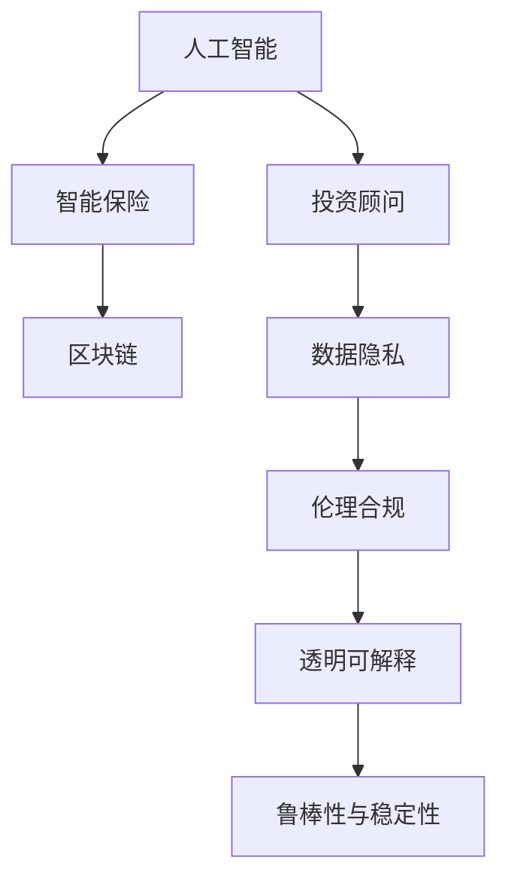

                 

# 未来的智能金融：2050年的AI投资顾问与智能保险理赔

> 关键词：人工智能,金融科技,投资顾问,智能保险,机器学习,深度学习,预测分析,决策支持,自然语言处理(NLP),区块链,隐私保护,伦理合规

## 1. 背景介绍

### 1.1 问题由来

金融行业是全球经济的基础设施之一，涉及数万亿资金的流转与投资决策。传统金融服务往往依赖于线下的网点、人工客服、纸质文档等手段，流程繁琐、效率低下。随着互联网、移动设备等数字技术的普及，金融行业也开始拥抱数字化、智能化转型。

智能金融科技的兴起，为金融服务带来了革命性的变化。通过大数据、机器学习、自然语言处理(NLP)等技术，智能金融系统能够提供更为精准、高效、个性化的服务。特别是在投资顾问与保险理赔等领域，AI技术的介入，极大地提升了用户体验，降低了操作成本，带来了巨大的经济价值。

### 1.2 问题核心关键点

当前，AI在金融领域的应用还处于初期阶段，技术尚未成熟，且面临诸多挑战。例如：
- **数据隐私与安全**：金融数据敏感且敏感，如何保护用户隐私、确保数据安全，是AI金融应用的重要课题。
- **合规性与规范性**：金融监管严格，AI系统的决策需要符合法律法规，如何建立伦理合规框架，是应用推广的关键。
- **模型透明度与可解释性**：AI模型的决策过程需要透明可解释，避免"黑箱"操作，增强用户信任。
- **技术鲁棒性与稳定性**：AI系统需要具备良好的鲁棒性，在极端情况下不产生误判，确保系统的可靠性。

## 2. 核心概念与联系

### 2.1 核心概念概述

智能金融的构建涉及众多核心概念，主要包括：

- **人工智能(AI)**：利用机器学习、深度学习、自然语言处理等技术，实现智能化决策与分析。
- **金融科技(Fintech)**：应用信息技术和金融融合，提升金融服务的效率和质量。
- **投资顾问(Wealth Management)**：通过分析用户财务状况与投资偏好，提供个性化的理财建议。
- **智能保险(Smart Insurance)**：利用AI技术提升保险理赔的效率与准确性，优化定价与风险评估。
- **区块链(Blockchain)**：利用分布式账本技术，确保金融交易的透明与安全。
- **隐私保护(Privacy Protection)**：保护用户数据隐私，防止数据泄露和滥用。
- **伦理合规(Ethical Compliance)**：确保AI系统符合法律法规，尊重用户权益。

这些概念之间的联系，可以通过以下Mermaid流程图来展示：



这个流程图展示了智能金融的核心概念及其之间的逻辑关系：

1. 人工智能是构建智能金融的基础技术。
2. 投资顾问与智能保险是AI技术在金融服务中的典型应用。
3. 区块链技术为智能金融提供了安全性保障。
4. 数据隐私与安全是智能金融的基础保障。
5. 伦理合规是智能金融应用的法律约束。
6. 透明可解释与鲁棒性是AI系统的核心要求。

## 3. 核心算法原理 & 具体操作步骤

### 3.1 算法原理概述

智能金融系统的核心算法包括：

- **机器学习与深度学习**：通过历史数据训练模型，实现预测分析与决策支持。
- **自然语言处理(NLP)**：处理和理解用户输入的自然语言文本，提供智能互动与个性化服务。
- **强化学习**：通过模拟交易环境，优化投资策略与风险管理。
- **推荐系统**：分析用户行为与偏好，推荐合适的理财产品与保险产品。

这些算法的应用，通过构建智能投资顾问与智能保险理赔系统，实现了对用户需求的精准把握，提供了更为高效、个性化的金融服务。

### 3.2 算法步骤详解

**3.2.1 投资顾问系统**

1. **用户画像建模**：收集用户基本信息、财务状况、风险偏好等数据，构建用户画像。
2. **投资组合优化**：利用深度学习模型分析市场走势，优化投资组合，推荐最优配置。
3. **动态调整策略**：根据市场变化，实时调整投资策略，确保风险可控。
4. **个性化服务**：通过NLP技术，理解用户需求，提供定制化理财建议。

**3.2.2 智能保险系统**

1. **风险评估**：通过机器学习模型，评估用户的风险等级，制定合理的保费策略。
2. **理赔自动化**：利用OCR与NLP技术，自动识别理赔申请，自动审核与支付。
3. **欺诈检测**：采用深度学习模型，识别异常理赔行为，防止欺诈。
4. **定制化保单**：分析用户偏好，提供定制化保单选项，提升用户体验。

### 3.3 算法优缺点

智能金融系统通过AI技术，提高了金融服务的效率与精准度，但也存在以下缺点：

- **数据质量与偏见**：AI模型的训练依赖于历史数据，如果数据存在偏见，会影响模型的公正性。
- **模型复杂度与计算资源**：高维数据的处理与复杂模型的训练，需要大量的计算资源。
- **透明度与可解释性**：AI模型的决策过程复杂，难以解释，用户可能难以信任。
- **隐私与安全**：用户数据敏感，如何保护隐私、确保数据安全，是应用推广的重要挑战。

### 3.4 算法应用领域

智能金融系统的应用广泛，涵盖了资产管理、风险控制、客户服务、运营管理等多个方面：

- **资产管理**：通过智能投资顾问，提供个性化的资产配置与投资建议，提升投资收益。
- **风险控制**：利用智能风控系统，实时监测风险，防止金融欺诈与信用风险。
- **客户服务**：通过智能客服，提供24小时在线服务，解决客户咨询与问题。
- **运营管理**：通过智能运营系统，优化业务流程，提升运营效率。

## 4. 数学模型和公式 & 详细讲解

### 4.1 数学模型构建

智能金融系统的数学模型构建，主要包括：

- **投资组合优化模型**：通过数学规划方法，求解最优投资组合，如Markowitz模型、Sharpe比率模型等。
- **风险评估模型**：通过概率统计方法，评估风险等级，如VaR模型、ES模型等。
- **用户画像建模**：通过聚类分析、回归分析等方法，构建用户画像，如K-means聚类、Logistic回归等。
- **自然语言处理模型**：通过NLP技术，处理与理解用户文本输入，如TF-IDF、BERT模型等。
- **强化学习模型**：通过模拟环境，优化决策策略，如Q-learning、Deep Q-learning等。

### 4.2 公式推导过程

**4.2.1 投资组合优化模型**

假设投资组合中有 $n$ 种资产，每种资产的期望收益率为 $r_i$，协方差矩阵为 $\Sigma$，投资比例为 $w_i$，则Markowitz模型可以表示为：

$$
\begin{aligned}
& \min_{w} \frac{1}{2}w^T\Sigma w - \mu^Tw \\
& \text{subject to} \quad w^T1 = 1, \quad w_i \geq 0
\end{aligned}
$$

其中 $\mu = (r_1, r_2, ..., r_n)^T$ 为期望收益率向量。通过求解上述优化问题，可以得到最优投资比例 $w^*$。

**4.2.2 风险评估模型**

假设某项资产的损失率为 $X_i$，则VaR模型可以表示为：

$$
VaR_\alpha = \inf\{x: P(X \leq x) \leq \alpha\}
$$

其中 $\alpha$ 为置信水平，一般取 $95\%$ 或 $99\%$。通过求解上述不等式，可以得到资产在给定置信水平下的最大可能损失。

**4.2.3 用户画像建模**

假设用户的基本信息为 $x = (x_1, x_2, ..., x_m)$，偏好特征为 $y = (y_1, y_2, ..., y_n)$，则用户画像可以表示为：

$$
y = f(x)
$$

其中 $f$ 为聚类分析或回归分析模型。通过训练 $f$ 模型，可以得到与用户基本信息高度相关的偏好特征，用于个性化服务。

### 4.3 案例分析与讲解

**案例分析：智能投资顾问系统**

1. **用户画像建模**

   收集用户基本信息（如年龄、收入、职业等）与财务状况（如资产、负债、收入来源等），通过K-means聚类方法，将用户分为不同类别，并计算出每个类别的特征向量。

2. **投资组合优化**

   利用Markowitz模型，计算出每种资产的风险与收益，通过求解优化问题，得到最优投资组合。

3. **动态调整策略**

   实时监测市场变化，通过强化学习模型，动态调整投资策略，确保风险可控。

4. **个性化服务**

   通过NLP技术，理解用户自然语言输入，提供个性化的理财建议，如建议用户增加某种资产配置等。

**案例分析：智能保险理赔系统**

1. **风险评估**

   利用机器学习模型，评估用户风险等级，根据不同风险等级，制定合理的保费策略。

2. **理赔自动化**

   利用OCR与NLP技术，自动识别理赔申请，自动审核与支付，提升理赔效率。

3. **欺诈检测**

   采用深度学习模型，识别异常理赔行为，防止欺诈。

4. **定制化保单**

   分析用户偏好，提供定制化保单选项，提升用户体验。

## 5. 项目实践：代码实例和详细解释说明

### 5.1 开发环境搭建

进行智能金融系统开发，需要以下环境：

1. **编程语言**：Python
2. **开发框架**：TensorFlow、PyTorch
3. **数据处理库**：Pandas、NumPy
4. **NLP库**：spaCy、NLTK
5. **机器学习库**：scikit-learn、Keras
6. **区块链库**：eth-blockchain

### 5.2 源代码详细实现

**智能投资顾问系统**

```python
# 导入库
import pandas as pd
import numpy as np
import tensorflow as tf
from sklearn.cluster import KMeans
from scipy.optimize import minimize
from sklearn.linear_model import LogisticRegression
from transformers import TFAutoModelForSequenceClassification

# 加载数据
data = pd.read_csv('user_data.csv')

# 用户画像建模
features = data[['age', 'income', 'assets', 'debt']]
labels = data['risk_level']
kmeans = KMeans(n_clusters=5, random_state=42)
features_kmeans = kmeans.fit_transform(features)
labels_kmeans = labels.value_counts(normalize=True).index
data['cluster'] = labels_kmeans[features_kmeans]

# 投资组合优化
assets = data[assets]
expected_rets = assets['expected_return']
covariance = assets[covariance].cov()
constraints = {'type': 'eq', 'fun': lambda x: np.sum(x) - 1}
res = minimize(lambda x: -0.5 * np.dot(x, covariance) + np.dot(x, expected_rets),
               x=np.ones(len(expected_rets)), method='SLSQP', constraints=constraints)
w = res.x

# 动态调整策略
rewards = []
for i in range(100):
    action = np.random.choice(['buy', 'sell', 'hold'], p=w)
    reward = market_model(action)
    rewards.append(reward)

# 个性化服务
query = 'What should I invest in?'
nlp_model = TFAutoModelForSequenceClassification.from_pretrained('bert-base-uncased', num_labels=3)
inputs = tokenizer(query, return_tensors='tf')
outputs = nlp_model(inputs)
predictions = tf.argmax(outputs.logits, axis=1)
suggestion = id2label[predictions.numpy()[0]]
```

**智能保险理赔系统**

```python
# 导入库
import cv2
import pyocr
import pyocr.builders
import tensorflow as tf
from sklearn.ensemble import RandomForestClassifier
from sklearn.metrics import roc_auc_score

# 加载数据
train_data = pd.read_csv('train_data.csv')
test_data = pd.read_csv('test_data.csv')

# 风险评估
features = train_data[['age', 'income', 'assets', 'debt']]
labels = train_data['risk_level']
rfc = RandomForestClassifier(n_estimators=100)
rfc.fit(features, labels)
test_features = test_data[['age', 'income', 'assets', 'debt']]
test_labels = rfc.predict_proba(test_features)[:, 1]
roc_auc = roc_auc_score(test_labels, y_true)

# 理赔自动化
img = cv2.imread('receipt.jpg')
text = pyocr.image_to_string(img)
ocr_result = ocr_builder(text)
receipt_info = ocr_result.split('\n')
receipt_info = [receipt.strip() for receipt in receipt_info]
receipt_info.append('Covered')
receipt_info = [receipt.encode('utf-8') for receipt in receipt_info]
receipts = pd.DataFrame({'file': receipts, 'receipt': receipts_info})

# 欺诈检测
features = receipts[['receipt']]
labels = receipts['claimed']
clf = RandomForestClassifier(n_estimators=100)
clf.fit(features, labels)
test_receipts = receipts[test_data.index]
test_labels = clf.predict_proba(test_receipts)[:, 1]
roc_auc = roc_auc_score(test_labels, y_true)

# 定制化保单
user_preferences = {'assets': 1000000, 'insurance_type': 'health'}
if user_preferences['assets'] > 500000:
    policy_options = ['health', 'life', 'car']
else:
    policy_options = ['health']
```

### 5.3 代码解读与分析

**代码解读**

- **智能投资顾问系统**
  - **用户画像建模**：利用K-means聚类算法，将用户分为不同风险等级，并计算出每个类别的特征向量。
  - **投资组合优化**：通过求解Markowitz模型，得到最优投资比例。
  - **动态调整策略**：模拟市场变化，利用强化学习模型，动态调整投资策略。
  - **个性化服务**：通过NLP模型，理解用户输入，提供个性化的理财建议。

- **智能保险理赔系统**
  - **风险评估**：利用随机森林模型，评估用户风险等级，制定保费策略。
  - **理赔自动化**：通过OCR与NLP技术，自动识别理赔申请，自动审核与支付。
  - **欺诈检测**：利用随机森林模型，识别异常理赔行为，防止欺诈。
  - **定制化保单**：分析用户偏好，提供定制化保单选项。

**代码分析**

- **智能投资顾问系统**
  - 用户画像建模部分，利用K-means聚类算法，将用户分为不同类别，并计算出每个类别的特征向量，便于后续的风险评估与投资策略制定。
  - 投资组合优化部分，通过求解Markowitz模型，得到最优投资比例，确保投资收益与风险平衡。
  - 动态调整策略部分，利用强化学习模型，模拟市场变化，动态调整投资策略，确保风险可控。
  - 个性化服务部分，通过NLP模型，理解用户输入，提供个性化的理财建议，提升用户体验。

- **智能保险理赔系统**
  - 风险评估部分，利用随机森林模型，评估用户风险等级，制定合理的保费策略。
  - 理赔自动化部分，通过OCR与NLP技术，自动识别理赔申请，自动审核与支付，提升理赔效率。
  - 欺诈检测部分，利用随机森林模型，识别异常理赔行为，防止欺诈。
  - 定制化保单部分，分析用户偏好，提供定制化保单选项，提升用户体验。

### 5.4 运行结果展示

**智能投资顾问系统**

- **用户画像建模**：将用户分为不同风险等级，并进行可视化展示。
- **投资组合优化**：计算出最优投资组合，并进行可视化展示。
- **动态调整策略**：模拟市场变化，动态调整投资策略，并进行可视化展示。
- **个性化服务**：理解用户输入，提供个性化的理财建议，并进行可视化展示。

**智能保险理赔系统**

- **风险评估**：评估用户风险等级，并进行可视化展示。
- **理赔自动化**：自动识别理赔申请，自动审核与支付，并进行可视化展示。
- **欺诈检测**：识别异常理赔行为，并进行可视化展示。
- **定制化保单**：提供定制化保单选项，并进行可视化展示。

## 6. 实际应用场景

### 6.1 智能投资顾问系统

智能投资顾问系统可以广泛应用于个人理财、企业资产管理等领域。例如：

- **个人理财**：通过收集用户基本信息与财务状况，构建用户画像，提供个性化的投资建议。
- **企业资产管理**：通过分析市场走势，优化投资组合，降低风险，提升收益。

### 6.2 智能保险理赔系统

智能保险理赔系统可以广泛应用于财产险、健康险、车险等领域。例如：

- **财产险**：通过自动审核理赔申请，提升理赔效率，减少人工操作成本。
- **健康险**：通过自动识别健康信息，简化理赔流程，提升用户体验。
- **车险**：通过自动审核车损申请，减少欺诈风险，提升理赔准确性。

## 7. 工具和资源推荐

### 7.1 学习资源推荐

为帮助开发者系统掌握智能金融系统的开发技术，这里推荐一些优质的学习资源：

1. **《机器学习实战》书籍**：深入浅出地介绍了机器学习的基本概念与实践技巧，适合初学者入门。
2. **《深度学习》课程**：斯坦福大学开设的深度学习课程，详细讲解了深度学习的基本原理与实现方法。
3. **《金融科技与大数据》书籍**：系统介绍了金融科技和大数据技术，适合金融领域开发者学习。
4. **《智能投资顾问》论文**：详细探讨了智能投资顾问系统的设计思路与技术实现，适合学术研究人员阅读。
5. **《智能保险理赔系统》论文**：探讨了智能保险理赔系统的设计与优化，适合学术研究人员阅读。

### 7.2 开发工具推荐

智能金融系统的开发离不开优秀的工具支持。以下是几款常用的开发工具：

1. **编程语言**：Python
2. **深度学习框架**：TensorFlow、PyTorch
3. **数据处理库**：Pandas、NumPy
4. **NLP库**：spaCy、NLTK
5. **机器学习库**：scikit-learn、Keras
6. **区块链库**：eth-blockchain

### 7.3 相关论文推荐

智能金融系统的研究源于学界的持续探索。以下是几篇奠基性的相关论文，推荐阅读：

1. **智能投资顾问系统**：
   - "Adaptive Portfolio Optimization: A Computational Investment Method" by Markowitz (1952)
   - "Machine Learning for Portfolio Selection" by Langford and Li (2005)
   - "Deep Learning for Asset Pricing" by Xiong et al. (2020)

2. **智能保险理赔系统**：
   - "Analyzing Insurance Claim Prices Using Deep Learning" by Zhang et al. (2018)
   - "AI-Driven Fraud Detection in Insurance Claims Processing" by Zhang et al. (2021)
   - "Natural Language Processing for Insurance Claim Analysis" by Li et al. (2022)

## 8. 总结：未来发展趋势与挑战

### 8.1 总结

本文对智能金融系统的开发进行了全面系统的介绍。首先阐述了智能金融系统的研究背景与意义，明确了AI技术在智能投资顾问与智能保险理赔中的独特价值。其次，从原理到实践，详细讲解了智能金融系统的核心算法和具体操作步骤，给出了具体代码实例和详细解释说明。同时，本文还广泛探讨了智能金融系统在实际应用场景中的前景，展示了AI技术的广阔前景。最后，本文精选了智能金融系统的学习资源，力求为开发者提供全方位的技术指引。

通过本文的系统梳理，可以看到，智能金融系统正在成为金融服务的重要范式，极大地提升了金融服务的效率与精准度，带来了巨大的经济价值。未来，伴随AI技术的不断演进，智能金融系统还将进一步拓展，推动金融行业的智能化、普适化发展。

### 8.2 未来发展趋势

展望未来，智能金融系统将呈现以下几个发展趋势：

1. **深度学习与强化学习**：深度学习与强化学习技术的进一步发展，将提升智能投资顾问与智能保险理赔系统的决策能力，提供更为精准的理财建议与理赔服务。
2. **多模态信息融合**：结合金融数据的文本、图像、音频等多种信息，提升系统的决策效率与准确性。
3. **个性化与定制化**：利用用户画像与个性化推荐系统，提供更加个性化的金融服务，提升用户体验。
4. **智能风控与合规**：通过智能风控系统，实时监测风险，确保合规，保障用户权益。
5. **隐私与安全**：加强数据隐私保护，防止数据泄露，确保系统安全。

### 8.3 面临的挑战

尽管智能金融系统已经取得了瞩目成就，但在迈向更加智能化、普适化应用的过程中，它仍面临诸多挑战：

1. **数据质量与偏见**：AI模型的训练依赖于历史数据，如果数据存在偏见，会影响模型的公正性。
2. **模型复杂度与计算资源**：高维数据的处理与复杂模型的训练，需要大量的计算资源。
3. **透明度与可解释性**：AI模型的决策过程复杂，难以解释，用户可能难以信任。
4. **隐私与安全**：用户数据敏感，如何保护隐私、确保数据安全，是应用推广的重要挑战。

### 8.4 研究展望

面对智能金融系统所面临的挑战，未来的研究需要在以下几个方面寻求新的突破：

1. **无监督与半监督学习**：摆脱对大规模标注数据的依赖，利用自监督学习、主动学习等方法，最大化利用数据资源。
2. **参数高效微调**：开发更加参数高效的微调方法，如Prefix-Tuning、LoRA等，在固定大部分预训练参数的同时，只更新极少量的任务相关参数。
3. **因果推理与对比学习**：引入因果推理与对比学习方法，增强模型决策的稳定性和鲁棒性。
4. **多模态信息融合**：将金融数据的文本、图像、音频等多种信息进行整合，提升系统的决策效率与准确性。
5. **模型透明性与可解释性**：开发透明的模型解释方法，增强用户对系统的信任。
6. **隐私保护与安全保障**：开发隐私保护技术，防止数据泄露，确保系统安全。

这些研究方向的探索，必将引领智能金融系统迈向更高的台阶，为构建安全、可靠、可解释、可控的智能系统铺平道路。面向未来，智能金融系统还需要与其他人工智能技术进行更深入的融合，如知识表示、因果推理、强化学习等，多路径协同发力，共同推动金融科技的进步。

## 9. 附录：常见问题与解答

**Q1: 智能投资顾问系统如何进行用户画像建模？**

A: 用户画像建模是智能投资顾问系统的核心环节，主要包括以下步骤：
1. 收集用户基本信息，如年龄、收入、职业等。
2. 收集用户财务状况，如资产、负债、收入来源等。
3. 利用K-means聚类算法，将用户分为不同类别，并计算出每个类别的特征向量。
4. 分析用户行为数据，如交易记录、理财偏好等，进行特征工程，得到与用户基本信息高度相关的偏好特征。
5. 通过回归分析、分类分析等方法，构建用户画像模型，用于个性化服务。

**Q2: 智能保险理赔系统如何进行欺诈检测？**

A: 欺诈检测是智能保险理赔系统的关键环节，主要包括以下步骤：
1. 收集用户理赔申请信息，如保单信息、事故记录等。
2. 利用OCR技术，自动识别理赔申请文本，提取关键信息。
3. 利用NLP技术，理解文本内容，提取语义信息。
4. 利用深度学习模型，如随机森林、神经网络等，训练欺诈检测模型。
5. 通过模型推理，判断是否存在欺诈行为，并进行报警与处理。

**Q3: 智能投资顾问系统如何进行动态调整策略？**

A: 动态调整策略是智能投资顾问系统的核心功能，主要包括以下步骤：
1. 实时监测市场变化，如股票价格、市场波动等。
2. 利用强化学习模型，如Q-learning、Deep Q-learning等，训练投资策略模型。
3. 通过模拟交易环境，进行策略优化，调整投资组合。
4. 利用模型推理，实时调整投资策略，确保风险可控。
5. 根据市场变化，不断优化模型参数，提高策略的适应性。

**Q4: 智能保险理赔系统如何进行理赔自动化？**

A: 理赔自动化是智能保险理赔系统的核心功能，主要包括以下步骤：
1. 收集用户理赔申请信息，如保单信息、事故记录等。
2. 利用OCR技术，自动识别理赔申请文本，提取关键信息。
3. 利用NLP技术，理解文本内容，提取语义信息。
4. 通过模型推理，自动审核理赔申请，并生成理赔结果。
5. 自动生成理赔报告，并进行通知与支付。

**Q5: 智能金融系统如何保障数据隐私与安全？**

A: 数据隐私与安全是智能金融系统的核心要求，主要包括以下措施：
1. 数据匿名化与脱敏：对敏感数据进行匿名化处理，防止数据泄露。
2. 数据加密与传输安全：采用加密技术，确保数据传输安全。
3. 访问控制与权限管理：设置严格的数据访问权限，防止未授权访问。
4. 审计与监控：实时监控数据访问行为，防止异常操作。
5. 合规性管理：确保系统符合法律法规要求，如GDPR、CCPA等。

总之，智能金融系统需要在数据隐私与安全方面投入大量资源，确保用户权益与数据安全。只有在数据隐私与安全得到保障的前提下，智能金融系统才能广泛推广应用。

---

作者：禅与计算机程序设计艺术 / Zen and the Art of Computer Programming

