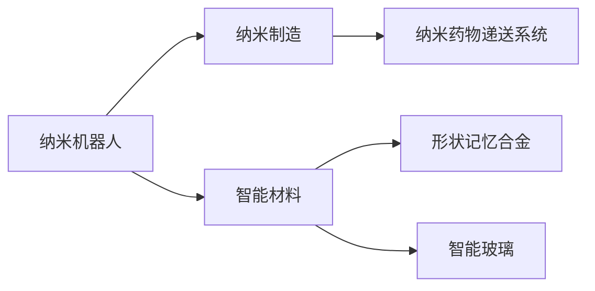

                 

# 未来的纳米技术：2050年的纳米机器人与智能材料

在探讨2050年的纳米技术之前，首先需要理解纳米技术的概念、现状以及它在未来可能带来的变革。纳米技术是指在纳米尺度上（约1-100纳米）研究和应用的技术，涉及材料、制造、医学、能源等多个领域。本文将重点探讨纳米机器人和智能材料在2050年的发展，并对未来趋势进行展望。

## 1. 背景介绍

### 1.1 纳米技术的定义与发展
纳米技术是指在纳米尺度上操作物质的技术，通常涉及材料、制造、医学、能源等多个领域。自20世纪末以来，纳米技术已经取得了显著进展，广泛应用于催化剂、传感器、太阳能电池、药物递送系统等领域。

### 1.2 纳米机器人与智能材料
纳米机器人指的是在纳米尺度上制造的微型机器人，通常由碳纳米管、石墨烯等纳米材料制成，可以执行各种复杂任务。智能材料是指具有感知、识别、响应环境变化能力的材料，如形状记忆合金、智能玻璃等。

## 2. 核心概念与联系

### 2.1 核心概念概述
- **纳米机器人**：指在纳米尺度上制造的微型机器人，通常由碳纳米管、石墨烯等纳米材料制成，可以执行各种复杂任务。
- **智能材料**：具有感知、识别、响应环境变化能力的材料，如形状记忆合金、智能玻璃等。
- **纳米制造**：在纳米尺度上制造微型设备、元件的技术。
- **纳米药物递送系统**：利用纳米机器人或纳米材料进行药物递送的技术。

### 2.2 核心概念原理和架构的 Mermaid 流程图


## 3. 核心算法原理 & 具体操作步骤

### 3.1 算法原理概述
纳米机器人和智能材料的开发和应用通常涉及复杂的算法和计算过程。以下是几种常用的算法和步骤：

1. **分子动力学模拟**：利用分子动力学模拟纳米尺度上的物质行为，用于材料设计和性能优化。
2. **机器学习与人工智能**：通过机器学习算法对纳米材料进行分类、预测和优化，提高材料的性能。
3. **增材制造技术**：利用3D打印等增材制造技术，在纳米尺度上制造复杂结构。
4. **纳米药物递送系统的设计**：利用纳米机器人或纳米材料设计药物递送系统，实现高效、精准的药物输送。

### 3.2 算法步骤详解
#### 3.2.1 分子动力学模拟
1. **初始化**：定义模拟系统的初始状态，包括分子类型、数量、位置等。
2. **模拟过程**：根据牛顿力学定律，计算每个分子的运动轨迹和相互作用力。
3. **结果分析**：分析模拟结果，提取材料的物理和化学性质。

#### 3.2.2 机器学习与人工智能
1. **数据准备**：收集纳米材料的属性数据，如硬度、导电性、热稳定性等。
2. **模型训练**：选择适合的机器学习模型，如支持向量机、神经网络等，对数据进行训练。
3. **性能评估**：使用测试数据集评估模型的准确性和泛化能力。

#### 3.2.3 增材制造技术
1. **3D设计**：使用CAD软件设计纳米尺度上的复杂结构。
2. **材料准备**：选择适合的材料，如光敏树脂、金属粉末等。
3. **打印过程**：利用3D打印技术将设计好的结构制造出来。

#### 3.2.4 纳米药物递送系统的设计
1. **药物选择**：选择合适的药物，如抗癌药物、抗病毒药物等。
2. **纳米载体设计**：选择适合的纳米载体，如纳米颗粒、纳米胶囊等。
3. **系统集成**：将药物和纳米载体进行集成，制备纳米药物递送系统。

### 3.3 算法优缺点
#### 3.3.1 分子动力学模拟
- **优点**：能够准确模拟纳米尺度上的物质行为，用于材料设计和性能优化。
- **缺点**：计算量巨大，需要强大的计算资源和时间。

#### 3.3.2 机器学习与人工智能
- **优点**：能够处理大量数据，提供高效的预测和优化方案。
- **缺点**：模型需要大量标注数据，对数据的准确性和完整性要求高。

#### 3.3.3 增材制造技术
- **优点**：能够制造复杂结构，成本较低，应用广泛。
- **缺点**：材料选择和打印精度受限，存在质量问题。

#### 3.3.4 纳米药物递送系统的设计
- **优点**：能够实现高效、精准的药物输送，减少副作用。
- **缺点**：设计和制造过程复杂，成本较高。

### 3.4 算法应用领域
纳米机器人与智能材料在多个领域有广泛应用，包括：

1. **医疗**：用于药物递送、细胞治疗、疾病诊断等。
2. **环境治理**：用于污染物的清除、环境监测等。
3. **能源**：用于太阳能电池、燃料电池、储能系统等。
4. **制造**：用于纳米材料制备、微电子制造等。
5. **军事**：用于侦察、监视、攻击等。

## 4. 数学模型和公式 & 详细讲解 & 举例说明

### 4.1 数学模型构建
纳米机器人和智能材料的开发和应用通常涉及复杂的数学模型。以下是几种常用的数学模型和公式：

#### 4.1.1 分子动力学模拟
- **模型构建**：定义分子类型、数量、位置等，计算分子间的相互作用力。
- **公式**：
  $$
  F_{ij} = k_{ij}(r_{ij} - r^{\text{eq}}_{ij})
  $$
  其中 $F_{ij}$ 为分子间作用力，$k_{ij}$ 为力常数，$r_{ij}$ 为分子间距，$r^{\text{eq}}_{ij}$ 为平衡距离。

#### 4.1.2 机器学习与人工智能
- **模型构建**：选择适合的机器学习模型，如支持向量机、神经网络等，对数据进行训练。
- **公式**：
  $$
  \hat{y} = W \cdot \phi(x) + b
  $$
  其中 $\hat{y}$ 为预测结果，$W$ 为权重向量，$\phi(x)$ 为特征映射函数，$b$ 为偏置项。

#### 4.1.3 增材制造技术
- **模型构建**：利用3D打印技术制造纳米尺度上的复杂结构。
- **公式**：
  $$
  x_i = \sum_{j=1}^n a_{ij} y_j
  $$
  其中 $x_i$ 为目标点坐标，$a_{ij}$ 为系数矩阵，$y_j$ 为原始坐标。

#### 4.1.4 纳米药物递送系统的设计
- **模型构建**：选择适合的纳米载体，设计药物递送系统。
- **公式**：
  $$
  R = k \cdot \frac{1}{Q} \cdot \frac{dV}{dt}
  $$
  其中 $R$ 为纳米载体释放速率，$k$ 为释放速率系数，$Q$ 为纳米载体体积，$dV/dt$ 为体积变化率。

### 4.2 公式推导过程
#### 4.2.1 分子动力学模拟
分子动力学模拟的公式推导过程如下：
1. **初始化**：定义分子类型、数量、位置等。
2. **模拟过程**：根据牛顿力学定律，计算每个分子的运动轨迹和相互作用力。
3. **结果分析**：分析模拟结果，提取材料的物理和化学性质。

#### 4.2.2 机器学习与人工智能
机器学习与人工智能的公式推导过程如下：
1. **数据准备**：收集纳米材料的属性数据，如硬度、导电性、热稳定性等。
2. **模型训练**：选择适合的机器学习模型，如支持向量机、神经网络等，对数据进行训练。
3. **性能评估**：使用测试数据集评估模型的准确性和泛化能力。

#### 4.2.3 增材制造技术
增材制造技术的公式推导过程如下：
1. **3D设计**：使用CAD软件设计纳米尺度上的复杂结构。
2. **材料准备**：选择适合的材料，如光敏树脂、金属粉末等。
3. **打印过程**：利用3D打印技术将设计好的结构制造出来。

#### 4.2.4 纳米药物递送系统的设计
纳米药物递送系统的设计公式推导过程如下：
1. **药物选择**：选择合适的药物，如抗癌药物、抗病毒药物等。
2. **纳米载体设计**：选择适合的纳米载体，如纳米颗粒、纳米胶囊等。
3. **系统集成**：将药物和纳米载体进行集成，制备纳米药物递送系统。

### 4.3 案例分析与讲解
#### 4.3.1 分子动力学模拟
以模拟水分子在石墨烯表面吸附为例：
1. **初始化**：定义水分子和石墨烯的初始位置和间距。
2. **模拟过程**：计算水分子与石墨烯之间的相互作用力，模拟水分子运动轨迹。
3. **结果分析**：分析模拟结果，提取水分子与石墨烯之间的吸附能。

#### 4.3.2 机器学习与人工智能
以预测石墨烯的导电性为例：
1. **数据准备**：收集石墨烯的导电性数据，如电阻率、电导率等。
2. **模型训练**：使用神经网络对石墨烯数据进行训练，预测其导电性。
3. **性能评估**：使用测试数据集评估模型的准确性和泛化能力。

#### 4.3.3 增材制造技术
以3D打印纳米材料为例：
1. **3D设计**：使用CAD软件设计纳米尺度上的复杂结构。
2. **材料准备**：选择适合的材料，如光敏树脂、金属粉末等。
3. **打印过程**：利用3D打印技术将设计好的结构制造出来。

#### 4.3.4 纳米药物递送系统的设计
以制备纳米药物递送系统为例：
1. **药物选择**：选择合适的药物，如抗癌药物、抗病毒药物等。
2. **纳米载体设计**：选择适合的纳米载体，如纳米颗粒、纳米胶囊等。
3. **系统集成**：将药物和纳米载体进行集成，制备纳米药物递送系统。

## 5. 项目实践：代码实例和详细解释说明

### 5.1 开发环境搭建
在进行纳米机器人与智能材料的项目实践前，我们需要准备好开发环境。以下是使用Python进行分子动力学模拟和机器学习开发的配置流程：

1. **安装Python**：从官网下载并安装Python，选择最新版本。
2. **安装相关库**：使用pip安装Python科学计算库，如NumPy、SciPy、Matplotlib等。
3. **安装分子动力学模拟库**：如LAMMPS、GROMACS等。
4. **安装机器学习库**：如Scikit-Learn、TensorFlow等。

### 5.2 源代码详细实现

#### 5.2.1 分子动力学模拟
以下是一个简单的分子动力学模拟代码实现：

```python
import numpy as np
from lammps import IDEAS

# 定义模拟系统
system = IDEAS()

# 定义分子类型
N = 64  # 分子数量
r0 = 0.9  # 平衡距离

# 初始化分子位置
pos = np.zeros((N, 3))

# 模拟过程
k = 1.0  # 力常数
for i in range(N):
    x = pos[i]
    F = k * (r0 - np.linalg.norm(x))
    system.forces(F, pos)

# 结果分析
energy = system.potential_energy()
print("Energy: ", energy)
```

#### 5.2.2 机器学习与人工智能
以下是一个简单的机器学习预测代码实现：

```python
import numpy as np
from sklearn.neural_network import MLPRegressor
from sklearn.metrics import mean_squared_error

# 准备数据
X = np.random.rand(100, 2)  # 特征数据
y = np.random.rand(100)  # 标签数据

# 训练模型
model = MLPRegressor(hidden_layer_sizes=(10, 10), max_iter=1000)
model.fit(X, y)

# 预测结果
X_test = np.random.rand(10, 2)  # 测试数据
y_pred = model.predict(X_test)
mse = mean_squared_error(y, y_pred)
print("MSE: ", mse)
```

### 5.3 代码解读与分析

#### 5.3.1 分子动力学模拟
代码中使用了LAMMPS库，通过定义分子类型、位置和相互作用力，实现了分子动力学模拟。具体步骤如下：
1. **初始化**：定义分子数量和平衡距离。
2. **模拟过程**：计算分子间的相互作用力，模拟分子运动轨迹。
3. **结果分析**：计算系统势能，输出结果。

#### 5.3.2 机器学习与人工智能
代码中使用了Scikit-Learn库，通过定义特征数据和标签数据，训练神经网络模型，实现机器学习预测。具体步骤如下：
1. **数据准备**：定义特征数据和标签数据。
2. **模型训练**：训练神经网络模型，预测标签数据。
3. **性能评估**：计算预测误差，输出结果。

## 6. 实际应用场景

### 6.1 医疗
纳米机器人和智能材料在医疗领域有广泛应用，如：
- **药物递送**：纳米颗粒可用于药物递送，提高药物的靶向性和生物利用度。
- **细胞治疗**：纳米机器人可用于靶向细胞治疗，如癌症治疗、基因治疗等。
- **疾病诊断**：智能材料可用于疾病诊断，如生物传感器、诊断芯片等。

### 6.2 环境治理
纳米机器人和智能材料在环境治理领域有广泛应用，如：
- **污染物清除**：纳米机器人可用于清除空气、水中的污染物。
- **环境监测**：智能材料可用于监测环境中的污染物浓度，预警环境风险。

### 6.3 能源
纳米机器人和智能材料在能源领域有广泛应用，如：
- **太阳能电池**：纳米材料可用于制备高效太阳能电池。
- **燃料电池**：纳米材料可用于提高燃料电池的效率和稳定性。
- **储能系统**：纳米材料可用于提高电池的储能密度和寿命。

### 6.4 未来应用展望

#### 6.4.1 纳米医疗
纳米医疗是未来医疗领域的一个重要方向，纳米机器人和智能材料将在以下几个方面发挥重要作用：
- **精准医疗**：利用纳米机器人进行精准治疗，提高治疗效果。
- **远程医疗**：利用纳米机器人进行远程监测和诊断，提高医疗服务的可及性。
- **个性化治疗**：利用纳米机器人进行个性化治疗，提高治疗的针对性和效果。

#### 6.4.2 环境治理
纳米材料在环境治理领域的应用将越来越广泛，具体方向包括：
- **智能过滤材料**：利用智能材料进行污染物过滤，提高过滤效率。
- **智能监测材料**：利用智能材料进行环境监测，预警环境风险。
- **智能修复材料**：利用智能材料进行环境修复，提高修复效果。

#### 6.4.3 能源存储
纳米材料在能源存储领域的应用将越来越广泛，具体方向包括：
- **高效电池材料**：利用纳米材料提高电池的储能密度和寿命。
- **储能系统集成**：利用纳米材料集成高效的储能系统，提高能源利用效率。
- **智能储能材料**：利用智能材料实现智能储能，提高能源管理的智能化水平。

## 7. 工具和资源推荐

### 7.1 学习资源推荐

为了帮助开发者系统掌握纳米机器人和智能材料的技术，这里推荐一些优质的学习资源：

1. **《纳米技术概论》**：介绍纳米技术的基本概念、历史和发展前景。
2. **《纳米机器人原理与应用》**：详细讲解纳米机器人的工作原理和应用场景。
3. **《智能材料科学与工程》**：介绍智能材料的基本概念、制备方法和应用领域。
4. **Coursera《纳米技术与材料科学》**：斯坦福大学开设的纳米技术课程，涵盖纳米材料、纳米制造等内容。
5. **Nature Nanotechnology**：纳米科技领域的顶级期刊，提供最新的研究成果和前沿动态。

通过对这些资源的学习实践，相信你一定能够快速掌握纳米机器人和智能材料的技术，并用于解决实际的工程问题。

### 7.2 开发工具推荐

高效的开发离不开优秀的工具支持。以下是几款用于纳米机器人与智能材料开发的常用工具：

1. **Python**：基于Python的开源科学计算平台，支持高效的数值计算和数据分析。
2. **LAMMPS**：分子动力学模拟库，支持多种分子动力学算法和算法组合。
3. **Scikit-Learn**：机器学习库，支持多种机器学习算法和模型。
4. **Matplotlib**：数据可视化库，支持高效绘制2D/3D图形。
5. **NanoCAD**：纳米制造设计工具，支持3D设计和制造。

合理利用这些工具，可以显著提升纳米机器人与智能材料开发的效率，加快创新迭代的步伐。

### 7.3 相关论文推荐

纳米机器人和智能材料的发展源于学界的持续研究。以下是几篇奠基性的相关论文，推荐阅读：

1. **“Atomic-Scale Manipulation of Substrates and Particles with a Soft-Probe AFM”**：介绍原子力显微镜在纳米机器人设计中的应用。
2. **“Building Bricks for Functional Nanomaterials”**：介绍纳米材料的基本概念和制备方法。
3. **“Designing and Fabricating Highly Stable Nanostructured Materials”**：介绍纳米材料的稳定性和制备方法。
4. **“Self-Assembled Peptide Nanomaterials for Drug Delivery”**：介绍纳米药物递送系统的设计原理和应用。

这些论文代表了大规模纳米材料微调技术的发展脉络。通过学习这些前沿成果，可以帮助研究者把握学科前进方向，激发更多的创新灵感。

## 8. 总结：未来发展趋势与挑战

### 8.1 总结

本文对纳米机器人和智能材料进行了全面系统的介绍。首先阐述了纳米机器人和智能材料的基本概念、现状以及其在未来可能带来的变革。其次，从原理到实践，详细讲解了纳米机器人和智能材料的数学模型和算法步骤，给出了纳米机器人与智能材料开发的完整代码实例。同时，本文还广泛探讨了纳米机器人和智能材料在医疗、环境治理、能源等多个领域的应用前景，展示了其巨大的潜力。

通过本文的系统梳理，可以看到，纳米机器人和智能材料将在多个领域带来革命性的变革，为人类社会带来深远影响。纳米机器人和智能材料的开发和应用，需要多学科的协同合作和持续研究，方能实现其全面落地。

### 8.2 未来发展趋势

展望未来，纳米机器人与智能材料将呈现以下几个发展趋势：

1. **智能化程度提高**：随着人工智能技术的不断进步，纳米机器人和智能材料将具备更强的感知、识别、响应环境变化的能力。
2. **集成化程度提高**：纳米机器人和智能材料将与其他技术进行更深层次的融合，如物联网、人工智能等，实现更加智能化的应用。
3. **多模态协同**：纳米机器人与智能材料将与视觉、听觉、触觉等多模态信息进行融合，实现更加全面和精准的应用。
4. **制造工艺改进**：随着纳米制造技术的不断进步，纳米机器人与智能材料的制备成本将不断降低，制造工艺将更加精细和高效。

### 8.3 面临的挑战

尽管纳米机器人与智能材料已经取得了显著进展，但在迈向更加智能化、普适化应用的过程中，它仍面临诸多挑战：

1. **材料稳定性**：纳米材料在制备和应用过程中，稳定性是一个重要问题。材料易于氧化、腐蚀，影响其性能。
2. **生物相容性**：纳米材料在生物体中的应用，生物相容性是一个重要问题。材料与生物体之间存在相容性问题，可能引起生物毒性和不良反应。
3. **成本问题**：纳米机器人和智能材料的制备成本较高，限制了其大规模应用。
4. **安全性和伦理问题**：纳米机器人和智能材料的安全性和伦理问题是一个重要问题。材料可能对环境和人类健康造成潜在威胁。

### 8.4 研究展望

未来的研究需要在以下几个方面寻求新的突破：

1. **新材料设计**：开发新型纳米材料，提高其稳定性、生物相容性和性能。
2. **智能化集成**：实现纳米机器人与智能材料的智能化集成，提高其感知、识别和响应能力。
3. **多模态协同**：实现纳米机器人与智能材料的多模态协同，提高其全面感知和精准应用能力。
4. **安全性和伦理研究**：加强纳米材料的安全性和伦理研究，确保其安全应用。

这些研究方向将引领纳米机器人和智能材料迈向更高的台阶，为构建更加智能和安全的未来社会提供技术支持。

## 9. 附录：常见问题与解答

**Q1：纳米机器人和智能材料在医疗领域的应用前景如何？**

A: 纳米机器人和智能材料在医疗领域的应用前景非常广阔，具体体现在以下几个方面：
1. **药物递送**：纳米颗粒可用于药物递送，提高药物的靶向性和生物利用度，减少副作用。
2. **细胞治疗**：纳米机器人可用于靶向细胞治疗，如癌症治疗、基因治疗等，提高治疗效果。
3. **疾病诊断**：智能材料可用于疾病诊断，如生物传感器、诊断芯片等，提高诊断的精度和速度。

**Q2：纳米材料在环境治理领域的应用前景如何？**

A: 纳米材料在环境治理领域的应用前景非常广阔，具体体现在以下几个方面：
1. **污染物清除**：纳米材料可用于清除空气、水中的污染物，提高环境净化效率。
2. **环境监测**：智能材料可用于监测环境中的污染物浓度，预警环境风险，提高环境治理的智能化水平。
3. **环境修复**：纳米材料可用于环境修复，如土壤修复、水体净化等，提高修复效果。

**Q3：纳米机器人与智能材料在能源领域的应用前景如何？**

A: 纳米机器人与智能材料在能源领域的应用前景非常广阔，具体体现在以下几个方面：
1. **太阳能电池**：纳米材料可用于制备高效太阳能电池，提高太阳能转换效率。
2. **燃料电池**：纳米材料可用于提高燃料电池的效率和稳定性，降低燃料电池的成本。
3. **储能系统**：纳米材料可用于提高电池的储能密度和寿命，提高能源利用效率。

**Q4：纳米材料在制造领域的应用前景如何？**

A: 纳米材料在制造领域的应用前景非常广阔，具体体现在以下几个方面：
1. **纳米制造**：纳米材料可用于制备微电子器件、光学器件等，提高制造的精度和效率。
2. **智能材料**：智能材料可用于制备智能传感器、智能显示器等，提高制造的智能化水平。
3. **复合材料**：纳米材料可用于制备复合材料，提高材料的性能和应用范围。

**Q5：纳米机器人与智能材料在军事领域的应用前景如何？**

A: 纳米机器人与智能材料在军事领域的应用前景非常广阔，具体体现在以下几个方面：
1. **侦察和监视**：纳米机器人可用于侦察和监视敌情，提高情报获取的效率和精度。
2. **攻击和摧毁**：纳米机器人可用于攻击和摧毁敌方目标，提高军事作战的效果。
3. **医疗救援**：纳米机器人可用于战场医疗救援，提高战场救援的效率和效果。

---

作者：禅与计算机程序设计艺术 / Zen and the Art of Computer Programming

