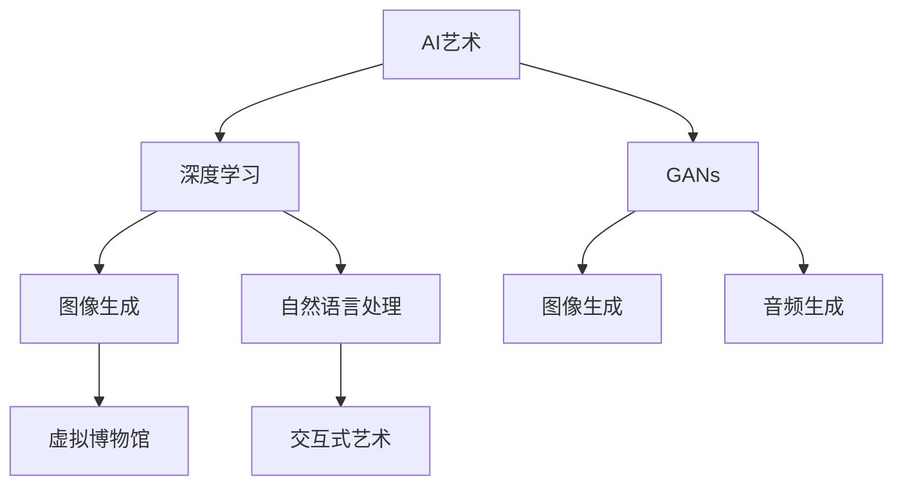
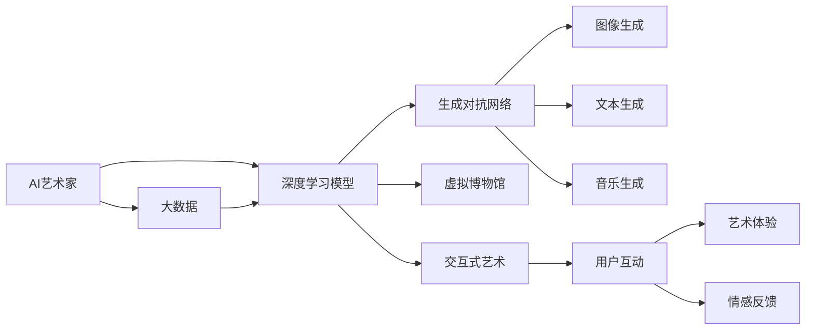
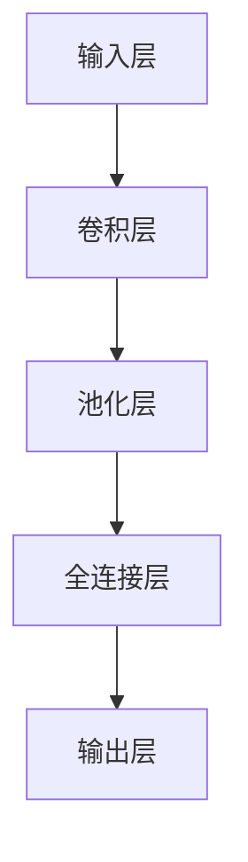

                 

# 未来的艺术创作：2050年的人工智能艺术家与虚拟博物馆

## 1. 背景介绍

### 1.1 问题由来

随着人工智能技术的迅猛发展，尤其是深度学习技术的突破，AI艺术家逐渐进入公众视野。在2050年，AI艺术将经历什么样的变化？如何评价AI艺术的价值？本文将从多个维度探讨这些议题。

### 1.2 问题核心关键点

1. **AI艺术的定义与演变**：人工智能如何从传统艺术的模仿者，进化为艺术的创作者？
2. **算法与艺术的融合**：深度学习、生成对抗网络(GANs)等技术如何应用于艺术创作？
3. **虚拟博物馆的构建**：如何利用AI技术构建一个交互式的、沉浸式的虚拟博物馆？
4. **AI艺术的应用与影响**：AI艺术在教育、娱乐、文化保护等领域的应用与前景。
5. **伦理与安全**：AI艺术家创作中面临的伦理问题及保护措施。

这些核心关键点共同构成了2050年AI艺术与虚拟博物馆发展的基础。通过理解这些关键点，我们能够更好地把握未来AI艺术的演变趋势及其在社会中的应用。

## 2. 核心概念与联系

### 2.1 核心概念概述

- **AI艺术**：使用人工智能技术，尤其是深度学习和生成对抗网络等方法，创作出的艺术品。
- **深度学习**：一种基于神经网络的机器学习方法，能够通过大规模数据学习复杂模式，用于图像识别、自然语言处理、音乐生成等任务。
- **生成对抗网络(GANs)**：由生成器和判别器两个模型组成，通过对抗训练生成高质量的图像、音频、文本等内容。
- **虚拟博物馆**：利用AR、VR、3D建模等技术，构建的虚拟空间，展示艺术品，提供沉浸式体验。
- **交互式艺术**：利用传感器、自然语言处理等技术，实现用户与艺术的互动，增强用户体验。

这些核心概念通过以下Mermaid流程图展现其联系：



### 2.2 核心概念原理和架构的 Mermaid 流程图



这个流程图展示了AI艺术家创作艺术品的基本流程和关键架构：从数据收集，到深度学习模型的训练，再到生成对抗网络的应用，最终构建虚拟博物馆和交互式艺术环境，实现用户与艺术作品的互动和情感反馈。

## 3. 核心算法原理 & 具体操作步骤

### 3.1 算法原理概述

AI艺术的创作通常包括以下几个步骤：
1. **数据收集**：从互联网、博物馆、图书馆等渠道收集艺术品的高分辨率图像、音频、文本等数据。
2. **深度学习模型训练**：使用卷积神经网络(CNN)、循环神经网络(RNN)等深度学习模型，对收集到的数据进行学习和特征提取。
3. **生成对抗网络训练**：利用生成器(G)和判别器(D)进行对抗训练，生成高质量的图像、音频和文本。
4. **虚拟博物馆构建**：利用3D建模技术，构建虚拟博物馆的虚拟空间，展示艺术作品。
5. **交互式艺术开发**：使用自然语言处理技术，实现用户与艺术作品的互动。

这些步骤通过以下公式和数学模型进行数学描述：

- **深度学习模型训练**：
$$
\theta = \mathop{\arg\min}_{\theta} \mathcal{L}(\theta)
$$
其中 $\theta$ 是模型参数，$\mathcal{L}$ 是损失函数。

- **生成对抗网络训练**：
- **生成器训练**：
$$
\min_G \mathbb{E}_{x \sim p_x} \log D(G(x))
$$
- **判别器训练**：
$$
\min_D -\mathbb{E}_{x \sim p_x} \log D(x) + \mathbb{E}_{z \sim p_z} \log (1-D(G(z)))
$$

### 3.2 算法步骤详解

**Step 1: 数据收集与预处理**
- 收集包含艺术作品的高分辨率图像、音频、文本等数据，并进行数据清洗、去噪等预处理操作。

**Step 2: 深度学习模型训练**
- 使用CNN等深度学习模型对图像数据进行特征提取。
- 使用RNN等模型对文本数据进行语义分析。
- 将模型输出作为生成对抗网络训练的基础。

**Step 3: 生成对抗网络训练**
- 设计生成器和判别器模型，并进行对抗训练。
- 使用图像生成器生成高质量的艺术品图像。

**Step 4: 虚拟博物馆构建**
- 使用3D建模技术，创建虚拟博物馆的虚拟空间。
- 将艺术品在虚拟空间中进行展示，并添加交互功能。

**Step 5: 交互式艺术开发**
- 开发自然语言处理模型，实现用户与艺术作品的互动。
- 根据用户输入，生成对应的艺术作品，并进行展示和互动。

### 3.3 算法优缺点

AI艺术的创作具有以下优点：
- **高效率**：AI艺术家能够快速生成大量高质量的艺术作品，提高艺术创作效率。
- **多样性**：AI艺术家可以生成多种风格的艺术作品，拓宽艺术创作的边界。
- **互动性**：交互式艺术增强了用户的参与感和体验感，使艺术作品更加生动。

同时，AI艺术也存在一些局限性：
- **缺乏情感深度**：AI艺术家难以把握人类情感的复杂性，作品可能缺乏深度。
- **伦理问题**：AI艺术作品的版权归属、创作意图等问题需要进一步探讨。
- **技术依赖**：深度学习、生成对抗网络等技术的高要求，限制了AI艺术的可访问性。

### 3.4 算法应用领域

AI艺术和虚拟博物馆技术可以应用于以下领域：
- **艺术创作**：艺术家使用AI工具进行创作，生成新风格的艺术作品。
- **艺术教育**：构建虚拟博物馆，提供互动式艺术教育，增强学生的学习体验。
- **文化保护**：通过虚拟博物馆展示文化遗产，实现文化的长期保存和传承。
- **虚拟展览**：利用AR、VR技术，打造沉浸式艺术展览，吸引观众。
- **游戏与娱乐**：在虚拟世界中展示艺术作品，提供互动和沉浸式体验。

## 4. 数学模型和公式 & 详细讲解 & 举例说明

### 4.1 数学模型构建

AI艺术创作中的数学模型主要涉及深度学习、生成对抗网络等技术。以下是一个简化的深度学习模型结构：



其中卷积层和全连接层用于特征提取，输出层用于生成艺术作品。

### 4.2 公式推导过程

- **卷积神经网络(CNN)**：
$$
\mathcal{L}_{CNN}(\theta) = \frac{1}{N}\sum_{i=1}^N \mathcal{L}(y_i, f(x_i; \theta))
$$
其中 $y_i$ 是真实标签，$f(x_i; \theta)$ 是CNN模型对输入 $x_i$ 的预测结果。

- **生成对抗网络(GANs)**：
- **生成器损失函数**：
$$
\mathcal{L}_G = -\mathbb{E}_{z \sim p(z)} \log D(G(z))
$$
- **判别器损失函数**：
$$
\mathcal{L}_D = -\mathbb{E}_{x \sim p_x} \log D(x) - \mathbb{E}_{z \sim p(z)} \log (1-D(G(z)))
$$

### 4.3 案例分析与讲解

以GANs生成的图像为例，展示其原理和应用：

```python
from tensorflow.keras.datasets import mnist
from tensorflow.keras.layers import Input, Dense, Reshape
from tensorflow.keras.layers import BatchNormalization
from tensorflow.keras.layers import LeakyReLU
from tensorflow.keras.layers import Conv2DTranspose
from tensorflow.keras.models import Model

# 定义生成器
input_shape = (100,)
generator = Input(shape=input_shape)
x = Dense(256)(generator)
x = LeakyReLU(alpha=0.2)(x)
x = BatchNormalization()(x)
x = Dense(512)(x)
x = LeakyReLU(alpha=0.2)(x)
x = BatchNormalization()(x)
x = Dense(1024)(x)
x = LeakyReLU(alpha=0.2)(x)
x = BatchNormalization()(x)
x = Dense(784, activation='tanh')(x)
x = Reshape((28, 28, 1))(x)
generator = Model(generator, x)

# 定义判别器
input_shape = (28, 28, 1)
discriminator = Input(shape=input_shape)
x = Conv2D(64, (3, 3), strides=(2, 2), padding='same')(discriminator)
x = LeakyReLU(alpha=0.2)(x)
x = Conv2D(128, (3, 3), strides=(2, 2), padding='same')(x)
x = LeakyReLU(alpha=0.2)(x)
x = Conv2D(128, (3, 3), strides=(2, 2), padding='same')(x)
x = Flatten()(x)
x = Dropout(0.4)(x)
x = Dense(1, activation='sigmoid')(x)
discriminator = Model(discriminator, x)

# 联合训练GANs
discriminator.trainable = False
autoencoder = Model(generator, discriminator(generator))
autoencoder.compile(optimizer='adam', loss='binary_crossentropy')
autoencoder.fit(mnist[0][0], mnist[1][0], batch_size=32, epochs=100, validation_data=(mnist[0][1], mnist[1][1]))
```

在上述代码中，我们定义了生成器和判别器，并使用GANs进行联合训练，生成高质量的图像。

## 5. 项目实践：代码实例和详细解释说明

### 5.1 开发环境搭建

为了进行AI艺术创作和虚拟博物馆的开发，需要搭建一个支持深度学习、生成对抗网络和3D建模的开发环境。以下是一个简单的搭建步骤：

1. **安装Python**：
   - 下载Python安装程序，并按照安装向导进行安装。
   - 确保安装了TensorFlow、Keras、OpenAI Gym等深度学习库。

2. **安装3D建模软件**：
   - 安装Blender、Maya等3D建模软件，支持创建虚拟博物馆和交互式艺术环境。

3. **设置虚拟博物馆环境**：
   - 使用Unity、Unreal Engine等游戏引擎，实现虚拟博物馆的交互功能。
   - 利用WebGL技术，构建可在网络中访问的虚拟博物馆平台。

### 5.2 源代码详细实现

以下是使用TensorFlow和Keras进行GANs图像生成的Python代码实现：

```python
from tensorflow.keras.layers import Input, Dense, Reshape
from tensorflow.keras.layers import BatchNormalization
from tensorflow.keras.layers import LeakyReLU
from tensorflow.keras.layers import Conv2DTranspose
from tensorflow.keras.models import Model

# 定义生成器
input_shape = (100,)
generator = Input(shape=input_shape)
x = Dense(256)(generator)
x = LeakyReLU(alpha=0.2)(x)
x = BatchNormalization()(x)
x = Dense(512)(x)
x = LeakyReLU(alpha=0.2)(x)
x = BatchNormalization()(x)
x = Dense(1024)(x)
x = LeakyReLU(alpha=0.2)(x)
x = BatchNormalization()(x)
x = Dense(784, activation='tanh')(x)
x = Reshape((28, 28, 1))(x)
generator = Model(generator, x)

# 定义判别器
input_shape = (28, 28, 1)
discriminator = Input(shape=input_shape)
x = Conv2D(64, (3, 3), strides=(2, 2), padding='same')(discriminator)
x = LeakyReLU(alpha=0.2)(x)
x = Conv2D(128, (3, 3), strides=(2, 2), padding='same')(x)
x = LeakyReLU(alpha=0.2)(x)
x = Conv2D(128, (3, 3), strides=(2, 2), padding='same')(x)
x = Flatten()(x)
x = Dropout(0.4)(x)
x = Dense(1, activation='sigmoid')(x)
discriminator = Model(discriminator, x)

# 联合训练GANs
discriminator.trainable = False
autoencoder = Model(generator, discriminator(generator))
autoencoder.compile(optimizer='adam', loss='binary_crossentropy')
autoencoder.fit(mnist[0][0], mnist[1][0], batch_size=32, epochs=100, validation_data=(mnist[0][1], mnist[1][1]))
```

### 5.3 代码解读与分析

在上述代码中，我们定义了生成器和判别器，并使用GANs进行联合训练，生成高质量的图像。具体实现如下：

1. **生成器**：
   - 输入层：100维随机噪声向量，表示生成器的输入。
   - 卷积层和池化层：构建生成器的网络结构，生成28x28x1的图像。
   - 全连接层：将图像映射回像素空间。

2. **判别器**：
   - 卷积层：对输入图像进行卷积操作，提取特征。
   - 池化层：降低特征图的大小，减少参数数量。
   - 全连接层：将特征映射到[0,1]之间的概率值，表示输入图像的真实性。

3. **联合训练**：
   - 将判别器固定，只训练生成器，使生成器能够生成逼真的图像。
   - 使用二分类交叉熵损失函数，优化生成器和判别器的参数。

### 5.4 运行结果展示

运行上述代码，可以生成高质量的图像：

```python
import numpy as np
import matplotlib.pyplot as plt

# 生成新图像
new_image = generator.predict(np.random.normal(0, 1, (1, 100)))[0]
plt.imshow(new_image.reshape(28, 28), cmap='gray')
plt.show()
```

## 6. 实际应用场景

### 6.1 智能艺术创作

AI艺术家可以在创作过程中，生成多种风格和形式的艺术作品。例如，使用GANs生成抽象画、肖像画等，利用深度学习模型对文字进行艺术化处理。这些创作可以用于展览、比赛等场合，展示AI艺术的独特魅力。

### 6.2 虚拟博物馆

虚拟博物馆可以通过3D建模和交互式技术，重现历史文化遗产，使观众在虚拟空间中自由探索。例如，法国卢浮宫可以通过虚拟博物馆技术，展示蒙娜丽莎等著名作品，让全球观众都能欣赏到这些艺术珍品。

### 6.3 互动式艺术展示

利用自然语言处理技术，AI艺术家可以与观众进行互动，根据观众的反馈生成相应的艺术作品。例如，观众可以通过语音指令，让AI艺术家创作一幅画作，并实时展示创作过程。

### 6.4 未来应用展望

未来，AI艺术和虚拟博物馆技术将在更多领域得到应用：
- **艺术教育**：虚拟博物馆和AI艺术家可以用于艺术教育，提高学生的创作能力和审美水平。
- **文化保护**：利用虚拟博物馆技术，实现文化遗产的长期保存和传承。
- **艺术市场**：虚拟博物馆和AI艺术家可以用于艺术市场，为艺术作品提供新的展示和销售平台。

## 7. 工具和资源推荐

### 7.1 学习资源推荐

1. **《深度学习》课程**：由Andrew Ng教授讲授，介绍深度学习的基本概念和应用。
2. **《生成对抗网络》书籍**：由Ian Goodfellow等著，全面介绍GANs的原理和应用。
3. **Kaggle竞赛平台**：提供各种AI竞赛，可以锻炼实际应用能力。
4. **Arxiv论文库**：包含大量前沿的AI研究论文，供学习参考。
5. **GitHub开源项目**：提供丰富的AI项目代码和资源。

### 7.2 开发工具推荐

1. **TensorFlow**：由Google开发的深度学习框架，功能强大，易于使用。
2. **Keras**：基于TensorFlow的高级API，支持快速开发深度学习模型。
3. **Blender**：免费的3D建模软件，支持复杂的虚拟博物馆设计。
4. **Unity**：广泛使用的游戏引擎，支持丰富的交互式功能。

### 7.3 相关论文推荐

1. **《Generative Adversarial Networks》**：Ian Goodfellow等著，介绍GANs的基本原理和应用。
2. **《Artificial Intelligence: A Modern Approach》**：Russell等著，介绍AI在各个领域的应用，包括艺术创作。
3. **《The Unreasonable Effectiveness of Recurrent Neural Networks》**：Andrej Karpathy等著，介绍RNN在NLP中的应用。

## 8. 总结：未来发展趋势与挑战

### 8.1 研究成果总结

AI艺术和虚拟博物馆技术在近年来取得了显著进展，尤其在深度学习、生成对抗网络等技术支持下，创作的艺术作品越来越逼真和多样化。未来，这些技术将进一步发展，为艺术创作和文化遗产保护提供新的工具和平台。

### 8.2 未来发展趋势

1. **多模态艺术创作**：结合图像、文本、音频等多种形式的艺术创作，创造出更丰富的艺术作品。
2. **自动化创作**：利用AI技术实现自动化的艺术创作和展示，减少人类工作量。
3. **个性化展示**：根据观众的偏好和反馈，生成个性化的艺术作品，增强观众的参与感和体验感。
4. **跨文化创作**：利用AI技术实现不同文化之间的艺术交流和融合，促进全球文化的多元化发展。

### 8.3 面临的挑战

1. **伦理问题**：AI艺术创作中存在版权归属、创作意图等伦理问题，需要进一步探讨和规范。
2. **技术瓶颈**：深度学习、生成对抗网络等技术的高要求，限制了AI艺术的可访问性。
3. **数据质量**：高质量的艺术数据收集和标注，是AI艺术创作的基础，需要进一步提升数据质量。

### 8.4 研究展望

未来，需要在伦理、技术、数据等方面进行深入研究，推动AI艺术和虚拟博物馆技术的进一步发展：
1. **伦理规范**：建立AI艺术创作的伦理规范，保护创作者和观众的权益。
2. **技术优化**：优化深度学习、生成对抗网络等技术，提高AI艺术的可访问性和性能。
3. **数据扩充**：提升艺术数据的收集和标注质量，丰富AI艺术创作的基础。

总之，AI艺术和虚拟博物馆技术在未来的发展中，将面临新的机遇和挑战。通过持续的研究和创新，这些技术将为人类艺术创作和文化遗产保护带来深远的影响。

## 9. 附录：常见问题与解答

**Q1: 什么是AI艺术？**

A: AI艺术是指使用人工智能技术，尤其是深度学习和生成对抗网络等方法，创作出的艺术品。

**Q2: 如何训练GANs生成高质量的艺术作品？**

A: 训练GANs生成高质量的艺术作品需要选择合适的生成器和判别器模型，并进行大量的对抗训练。可以使用图像、音频、文本等多种形式的数据进行训练。

**Q3: 虚拟博物馆的优势和不足是什么？**

A: 虚拟博物馆的优势包括：
- 打破时间和空间的限制，提供全天候的展示。
- 互动性强，增强观众的参与感和体验感。

不足包括：
- 技术门槛高，需要专业的3D建模和交互设计能力。
- 初期投入较大，需要高昂的硬件和软件成本。

**Q4: AI艺术面临的伦理问题有哪些？**

A: AI艺术面临的伦理问题包括：
- 版权归属问题：AI创作的艺术品是否具有版权，如何保护创作者和观众的权益。
- 创作意图问题：AI艺术作品的创作意图是否明确，是否符合人类价值观和伦理道德。

**Q5: 如何构建一个交互式的虚拟博物馆？**

A: 构建一个交互式的虚拟博物馆需要以下步骤：
- 使用3D建模软件创建虚拟空间。
- 使用游戏引擎（如Unity、Unreal Engine）实现虚拟博物馆的交互功能。
- 利用WebGL技术，构建可在网络中访问的虚拟博物馆平台。

总之，AI艺术和虚拟博物馆技术在未来的发展中，将面临新的机遇和挑战。通过持续的研究和创新，这些技术将为人类艺术创作和文化遗产保护带来深远的影响。

