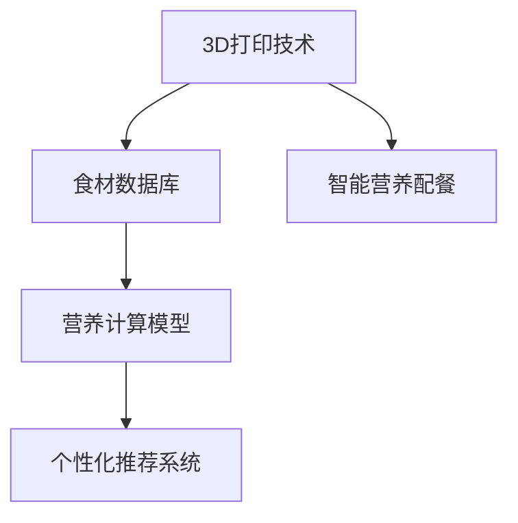

                 

# 未来的食品科技：2050年的3D打印食品与智能营养配餐

在21世纪，技术创新极大地改变了我们的生活方式。从智能手机到自动驾驶汽车，技术的前沿不断引领着社会进步。当我们站在未来与现在交界的节点，展望2050年的食品科技，可以预见一系列颠覆性变化即将到来。本文将聚焦于3D打印食品与智能营养配餐两大领域，探讨它们如何塑造未来的食品行业，以及我们如何从中受益。

## 1. 背景介绍

### 1.1 问题由来

随着全球人口增长和城市化进程的加速，食品安全和营养均衡问题愈发凸显。传统食品产业面临诸多挑战：
- 资源有限。水、土地和粮食资源的紧张限制了传统农业的扩展能力。
- 生产效率低。传统农业的生产周期长、效率低，难以满足快速增长的人口需求。
- 营养失衡。过度加工食品导致普遍的营养失衡，如糖尿病、肥胖等慢性病高发。

面对这些挑战，食品科技正逐步向智能化和个性化方向发展。3D打印食品和智能营养配餐作为未来食品科技的前沿，为解决上述问题提供了全新的思路。

### 1.2 问题核心关键点

3D打印食品与智能营养配餐的核心关键点包括：
- **3D打印食品**：利用3D打印技术，将食材通过精确的层叠和成型，制造出形状复杂、营养丰富的食品。
- **智能营养配餐**：结合营养学知识和大数据分析，根据个体需求，智能生成个性化营养餐单。

### 1.3 问题研究意义

研究和应用3D打印食品与智能营养配餐，对于提升食品安全、效率、个性化和营养均衡具有重要意义：

1. **食品安全提升**：减少食品在加工、运输、存储过程中的污染和变质风险，提高食品安全性。
2. **生产效率提高**：减少浪费和损失，降低生产成本，提高生产效率。
3. **营养均衡保障**：根据个体需求定制餐单，保障营养均衡，预防慢性病。
4. **个性化服务**：满足不同人群的需求，提升消费者满意度。

## 2. 核心概念与联系

### 2.1 核心概念概述

为了更好地理解3D打印食品与智能营养配餐，本节将介绍几个密切相关的核心概念：

- **3D打印技术**：利用逐层堆积的原理，将数字模型转化为实体物体。应用于食品行业，可制造出形状复杂、营养丰富的食品。
- **食材数据库**：收集不同食材的物理属性和营养成分，为3D打印和智能配餐提供数据支持。
- **营养计算模型**：基于营养学知识，设计模型计算食谱的营养价值和平衡性。
- **个性化推荐系统**：根据用户健康数据和偏好，智能生成个性化营养餐单。

这些核心概念之间的逻辑关系可以通过以下Mermaid流程图来展示：



这个流程图展示了大食品科技的核心概念及其之间的关系：

1. 3D打印技术为智能营养配餐提供原材料。
2. 食材数据库为3D打印和智能配餐提供食材信息。
3. 营养计算模型用于分析食谱的营养价值。
4. 个性化推荐系统根据用户需求生成餐单。
5. 智能营养配餐整合上述各环节，最终实现3D打印食品。

## 3. 核心算法原理 & 具体操作步骤
### 3.1 算法原理概述

3D打印食品与智能营养配餐的核心算法原理主要包括以下几个方面：

- **3D打印算法**：利用计算机辅助设计（CAD）或数字建模软件，将食材的物理属性转化为3D打印路径。
- **营养计算算法**：基于营养学知识和食材数据库，计算食谱的营养价值和平衡性。
- **个性化推荐算法**：利用用户健康数据和偏好，通过机器学习生成个性化营养餐单。

### 3.2 算法步骤详解

以下是对3D打印食品与智能营养配餐的核心算法步骤进行详细讲解：

**Step 1: 3D打印算法设计**
- 收集食材的物理属性，如密度、粘度等。
- 使用CAD软件或数字建模工具，将食材转化为3D打印模型。
- 设计打印路径和参数，包括打印头温度、打印速度、层厚等。

**Step 2: 食材数据库构建**
- 收集不同食材的营养成分和物理属性。
- 将食材信息进行结构化处理，建立食材数据库。
- 使用数据库查询和匹配功能，为3D打印和营养计算提供支持。

**Step 3: 营养计算模型开发**
- 确定食谱所需的营养指标，如蛋白质、脂肪、碳水化合物等。
- 结合食材数据库，设计营养计算模型。
- 计算食谱的营养成分和平衡性，生成营养报告。

**Step 4: 个性化推荐系统实现**
- 收集用户健康数据，如年龄、体重、饮食偏好等。
- 设计个性化推荐算法，结合营养计算模型生成餐单。
- 根据用户反馈和行为数据，不断优化推荐模型。

### 3.3 算法优缺点

3D打印食品与智能营养配餐的核心算法具有以下优点：
1. **生产效率高**：3D打印技术可以快速制造复杂形状的食品，减少生产周期。
2. **营养成分精准**：通过营养计算模型，可精确控制食谱的营养成分和平衡性。
3. **个性化定制**：个性化推荐系统可根据用户需求，生成个性化营养餐单，满足不同人群的饮食偏好。

同时，这些算法也存在一些局限性：
1. **技术门槛高**：3D打印和营养计算需要较高的技术门槛，初期成本较高。
2. **数据依赖性强**：需要大量精确的食材和营养数据，数据的准确性直接影响结果。
3. **模型复杂度**：个性化推荐系统涉及多个维度数据，模型复杂度较高，需要高效的算法支持。
4. **用户体验问题**：用户习惯和偏好的多样性，增加了个性化推荐的难度。

### 3.4 算法应用领域

3D打印食品与智能营养配餐的算法已在多个领域得到应用，例如：

- **健康饮食**：为慢性病患者设计低盐、低糖、低脂肪的个性化餐单，帮助控制病情。
- **环保餐饮**：使用3D打印技术制造低浪费、环保的食品，减少环境污染。
- **旅游餐饮**：根据旅游地的食材资源和当地文化，设计地方特色美食，提升游客体验。
- **航天食品**：为宇航员制造营养均衡、便于携带的食品，满足长期太空任务的营养需求。

除了上述这些经典应用外，3D打印食品与智能营养配餐还被创新性地应用到更多场景中，如医疗食品、教育餐饮、物流配送等，为不同领域带来新的变革和机遇。

## 4. 数学模型和公式 & 详细讲解 & 举例说明

### 4.1 数学模型构建

本节将使用数学语言对3D打印食品与智能营养配餐的核心算法进行严格的刻画。

假设3D打印食品的体积为 $V$，所需食材的物理属性为 $\rho_i, \eta_i$，其中 $\rho_i$ 为密度，$\eta_i$ 为粘度。假设食材的厚度为 $h$，则3D打印所需材料的总体积为 $V = Ah$，其中 $A$ 为食材的横截面积。

营养计算模型假设食谱中包含 $n$ 种食材，每种食材的营养成分为 $C_i$，其营养成分占比为 $w_i$，则食谱的总营养成分为：

$$
N = \sum_{i=1}^n w_iC_i
$$

个性化推荐系统使用用户健康数据 $H$ 和饮食偏好 $P$，设计推荐算法 $R$，生成个性化餐单 $C$。其中 $H$ 和 $P$ 包括用户基本信息、健康状况和饮食喜好，$R$ 为机器学习模型，$C$ 为生成的餐单。

### 4.2 公式推导过程

以下我们以个性化推荐系统为例，推导推荐算法的基本流程。

假设用户健康数据为 $H = (A, B, C)$，饮食偏好为 $P = (D, E, F)$，其中 $A, B, C$ 为用户基本信息，$D, E, F$ 为用户饮食喜好。设计机器学习模型 $R$，根据 $H$ 和 $P$ 生成餐单 $C$。

推荐算法的目标函数为：

$$
\min_{C} \mathcal{L}(R(H, P), C)
$$

其中 $\mathcal{L}$ 为损失函数，衡量推荐结果与用户实际选择的餐单之间的差异。推荐算法步骤如下：

1. 收集用户健康数据和饮食偏好。
2. 使用机器学习模型 $R$，根据 $H$ 和 $P$ 生成候选餐单 $C$。
3. 计算损失函数 $\mathcal{L}(R(H, P), C)$。
4. 根据损失函数结果，调整模型参数。
5. 重复步骤2-4，直至达到预设的收敛条件。

### 4.3 案例分析与讲解

假设某位用户希望控制血糖，其健康数据为 $H = (BMI = 25, Glucose Level = 120, Age = 40)$，饮食偏好为 $P = (PrefLowCarb = True, PrefHighFiber = True, PrefVegetarian = False)$。根据这些数据，使用个性化推荐系统生成个性化餐单。

步骤如下：
1. 收集用户健康数据和饮食偏好。
2. 设计推荐模型 $R$，根据 $H$ 和 $P$ 生成候选餐单 $C$。
3. 计算损失函数 $\mathcal{L}(R(H, P), C)$。
4. 根据损失函数结果，调整模型参数。
5. 重复步骤2-4，直至达到预设的收敛条件。

最终生成的个性化餐单为：
- 早餐：全麦面包、鸡蛋、低糖豆浆。
- 午餐：烤鸡胸肉、糙米、蔬菜沙拉。
- 晚餐：蒸鱼、全麦面条、蔬菜。
- 零食：坚果、酸奶。

## 5. 项目实践：代码实例和详细解释说明
### 5.1 开发环境搭建

在进行项目实践前，我们需要准备好开发环境。以下是使用Python进行PyTorch开发的环境配置流程：

1. 安装Anaconda：从官网下载并安装Anaconda，用于创建独立的Python环境。

2. 创建并激活虚拟环境：
```bash
conda create -n pytorch-env python=3.8 
conda activate pytorch-env
```

3. 安装PyTorch：根据CUDA版本，从官网获取对应的安装命令。例如：
```bash
conda install pytorch torchvision torchaudio cudatoolkit=11.1 -c pytorch -c conda-forge
```

4. 安装TensorFlow：
```bash
conda install tensorflow tensorflow-gpu
```

5. 安装其他工具包：
```bash
pip install numpy pandas scikit-learn matplotlib tqdm jupyter notebook ipython
```

完成上述步骤后，即可在`pytorch-env`环境中开始项目实践。

### 5.2 源代码详细实现

这里我们以个性化推荐系统的实现为例，给出使用PyTorch进行模型开发的代码实现。

```python
import torch
import torch.nn as nn
import torch.optim as optim

# 定义模型
class RecommendationModel(nn.Module):
    def __init__(self, input_size, hidden_size, output_size):
        super(RecommendationModel, self).__init__()
        self.fc1 = nn.Linear(input_size, hidden_size)
        self.fc2 = nn.Linear(hidden_size, output_size)

    def forward(self, x):
        x = torch.relu(self.fc1(x))
        x = self.fc2(x)
        return x

# 准备数据
inputs = torch.tensor([...])  # 用户健康数据和饮食偏好
targets = torch.tensor([...])  # 候选餐单

# 定义模型和优化器
model = RecommendationModel(input_size=100, hidden_size=50, output_size=1000)
optimizer = optim.Adam(model.parameters(), lr=0.001)

# 训练模型
for epoch in range(100):
    optimizer.zero_grad()
    outputs = model(inputs)
    loss = nn.functional.mse_loss(outputs, targets)
    loss.backward()
    optimizer.step()
    print(f"Epoch {epoch+1}, loss: {loss.item()}")

# 预测餐单
inputs_test = torch.tensor([...])  # 新用户健康数据和饮食偏好
outputs_test = model(inputs_test)
predictions = outputs_test.argmax(dim=1)
```

以上代码实现了基于MSE损失的个性化推荐系统模型训练。通过收集用户健康数据和饮食偏好，模型自动学习生成候选餐单，并通过损失函数衡量推荐结果的准确性，不断调整模型参数，最终得到最优的餐单推荐。

### 5.3 代码解读与分析

让我们再详细解读一下关键代码的实现细节：

**RecommendationModel类**：
- `__init__`方法：初始化模型结构，包括两个全连接层。
- `forward`方法：定义模型的前向传播过程。

**训练模型**：
- 定义模型结构、优化器和损失函数。
- 循环训练100次，每次计算损失函数并更新模型参数。
- 输出每个epoch的损失值。

**预测餐单**：
- 使用训练好的模型，输入新用户健康数据和饮食偏好，预测出餐单。

可以看到，通过使用PyTorch，我们能够便捷地构建和训练个性化推荐系统模型，快速实现食品科技的前沿应用。

## 6. 实际应用场景
### 6.1 健康饮食

基于3D打印和智能营养配餐技术，健康饮食应用场景可以极大地提升用户体验和效果。例如，针对糖尿病患者，可以利用3D打印技术生产低糖、低脂肪的餐盒，再通过智能推荐系统提供个性化的饮食计划。

### 6.2 环保餐饮

3D打印食品与智能营养配餐技术的结合，为环保餐饮提供了新的可能。例如，使用3D打印技术生产低浪费、环保的餐盒和餐具，再通过智能推荐系统优化食材选择和餐单设计，减少食品生产和消费过程中的环境影响。

### 6.3 旅游餐饮

在旅游场景中，可以根据当地食材资源和文化特色，设计地方特色美食，并通过智能推荐系统生成个性化餐单，提升游客的饮食体验。

### 6.4 未来应用展望

随着3D打印食品与智能营养配餐技术的不断进步，未来将在更多领域得到应用，为食品行业带来革命性影响。

在智慧农业领域，可以通过3D打印技术制造精准农业设备，如可定制的种子容器，提高种植效率和作物质量。

在智能家居领域，可以设计3D打印食品机，根据用户需求快速制作个性化餐单，提升居家生活便利性。

在医疗领域，可以通过3D打印技术生产定制化药物和营养补充剂，满足特殊病患的营养需求。

此外，在教育、娱乐、物流等领域，3D打印食品与智能营养配餐技术也将发挥重要作用，推动食品科技的全面升级。

## 7. 工具和资源推荐
### 7.1 学习资源推荐

为了帮助开发者系统掌握3D打印食品与智能营养配餐的理论基础和实践技巧，这里推荐一些优质的学习资源：

1. 《3D打印技术》系列书籍：详细介绍了3D打印的基本原理、技术实现和应用场景，是入门学习的好帮手。

2. 《智能营养配餐》课程：介绍智能营养配餐的算法和应用，涵盖营养学基础、算法设计、系统实现等。

3. 《深度学习在食品科技中的应用》书籍：介绍了深度学习在食品科技中的最新应用，包括3D打印食品、智能配餐等。

4. 《食品3D打印与智能配餐》学术期刊：收录了最新的研究成果和应用案例，是跟踪技术进展的重要来源。

5. 《食品科技前沿》网站：提供行业新闻、技术分享和案例分析，是了解食品科技动态的良好平台。

通过对这些资源的学习实践，相信你一定能够快速掌握3D打印食品与智能营养配餐的精髓，并用于解决实际的食品问题。

### 7.2 开发工具推荐

高效的开发离不开优秀的工具支持。以下是几款用于3D打印食品与智能营养配餐开发的常用工具：

1. Tinkercad：免费的三维设计软件，易于上手，适合初学者使用。

2. Blender：功能强大的开源3D建模软件，支持多种文件格式，适合高级用户使用。

3. OpenCTM：开源的3D打印格式，支持多种3D打印设备，适合开发者实现自定义打印。

4. Scikit-learn：Python机器学习库，提供了多种机器学习算法和工具，适合实现个性化推荐系统。

5. TensorFlow：谷歌主导的深度学习框架，支持分布式计算和高效模型训练，适合大规模工程应用。

合理利用这些工具，可以显著提升3D打印食品与智能营养配餐的开发效率，加快创新迭代的步伐。

### 7.3 相关论文推荐

3D打印食品与智能营养配餐的发展源于学界的持续研究。以下是几篇奠基性的相关论文，推荐阅读：

1. 3D Printing of Food Materials for Space Exploration（3D打印食品用于太空探索）：讨论了3D打印食品在太空任务中的潜在应用。

2. Smart Nutritional Planning and Dietary Behavior Modification Using IoT and AI（基于IoT和AI的智能营养规划和饮食行为修正）：介绍了智能营养配餐的算法和应用案例。

3. 3D Food Printing and the Future of the Food Industry（3D打印食品与食品行业未来）：探讨了3D打印食品技术对食品行业的革命性影响。

4. Nutrition Design for 3D Food Printing: Considerations and Challenges（3D打印食品的营养设计考量与挑战）：讨论了3D打印食品的营养设计问题和解决方案。

5. Nutritional Control of 3D-Printed Foods: A Review（3D打印食品的营养控制综述）：提供了3D打印食品营养控制的最新研究进展和应用案例。

这些论文代表了大食品科技的发展脉络。通过学习这些前沿成果，可以帮助研究者把握学科前进方向，激发更多的创新灵感。

## 8. 总结：未来发展趋势与挑战
### 8.1 研究成果总结

本文对3D打印食品与智能营养配餐的原理和操作步骤进行了全面系统的介绍。首先阐述了3D打印食品与智能营养配餐的研究背景和意义，明确了技术在提升食品安全、效率、个性化和营养均衡方面的独特价值。其次，从原理到实践，详细讲解了3D打印和智能推荐的核心算法步骤，给出了模型实现的代码实例。同时，本文还探讨了3D打印食品与智能营养配餐在健康饮食、环保餐饮、旅游餐饮等实际场景中的应用，展示了技术的前景和潜力。最后，本文精选了学习资源和工具推荐，力求为开发者提供全方位的技术指引。

通过本文的系统梳理，可以看到，3D打印食品与智能营养配餐技术正逐步成为食品科技的前沿方向，有望解决传统食品产业的诸多问题，推动食品行业的智能化、个性化发展。

### 8.2 未来发展趋势

展望未来，3D打印食品与智能营养配餐技术将呈现以下几个发展趋势：

1. **技术成熟度提升**：随着技术的不断成熟和迭代，3D打印食品将更加普及，智能营养配餐系统将更加精准和智能化。

2. **多模态融合**：结合物联网、人工智能、区块链等技术，实现食品的智能化、可追溯性和个性化。

3. **食品安全保障**：通过区块链技术实现食品生产、加工和流通过程的全程追溯，提升食品安全水平。

4. **跨领域应用**：3D打印食品与智能营养配餐技术将拓展到更多领域，如智慧农业、智能家居、智慧医疗等，带来更多创新应用。

5. **伦理和安全考量**：随着技术的发展，伦理和安全问题将愈发重要。如何保障数据隐私、食品安全，将是未来的重要研究方向。

### 8.3 面临的挑战

尽管3D打印食品与智能营养配餐技术在多个领域得到了应用，但在迈向更加智能化、普适化应用的过程中，仍面临诸多挑战：

1. **技术复杂度**：3D打印和营养计算技术需要较高的技术门槛，初期成本较高。

2. **数据依赖性强**：需要大量精确的食材和营养数据，数据的准确性直接影响结果。

3. **模型复杂度**：个性化推荐系统涉及多个维度数据，模型复杂度较高，需要高效的算法支持。

4. **用户体验问题**：用户习惯和偏好的多样性，增加了个性化推荐的难度。

5. **伦理和安全问题**：数据的隐私和安全问题，如用户健康数据泄露风险，将是未来的重要研究课题。

### 8.4 研究展望

面对3D打印食品与智能营养配餐技术所面临的挑战，未来的研究需要在以下几个方面寻求新的突破：

1. **降低技术门槛**：通过技术进步和工具优化，降低3D打印和营养计算的技术门槛，降低初期成本。

2. **提升数据质量**：建立精确的食材和营养数据库，提高数据的质量和可用性。

3. **优化推荐模型**：引入更多维度的数据和更高效的算法，提升个性化推荐系统的准确性和用户体验。

4. **加强隐私保护**：设计隐私保护机制，确保用户数据的保密性和安全性。

5. **探索新应用场景**：探索更多领域的3D打印食品与智能营养配餐应用，推动技术在更多场景中的落地应用。

这些研究方向的探索，必将引领3D打印食品与智能营养配餐技术迈向更高的台阶，为食品科技的发展注入新的动力。面向未来，我们相信3D打印食品与智能营养配餐技术将在食品行业中发挥更大的作用，推动食品科技的全面升级。

## 9. 附录：常见问题与解答

**Q1：3D打印食品技术是否适用于所有食材？**

A: 目前3D打印食品技术已经应用于多种食材，如巧克力、蛋糕、冰淇淋等。但对于含水量较高的食材，如蔬菜、水果等，仍存在一些技术挑战。需要进一步研究和改进3D打印材料和打印技术，以适应更多类型的食材。

**Q2：智能营养配餐系统如何保证推荐的准确性？**

A: 智能营养配餐系统通过机器学习算法实现推荐，其准确性依赖于数据的丰富性和算法的合理性。需要建立精确的食材数据库，收集大量的用户健康数据和饮食偏好，设计高效的推荐算法。同时，定期更新模型，根据用户反馈进行调整优化，以提升推荐准确性。

**Q3：3D打印食品技术在食品生产中会带来哪些成本？**

A: 3D打印食品技术初期投入较大，主要成本集中在设备购置、材料采购和软件开发上。但随着技术的成熟和规模化生产，3D打印的边际成本将逐渐下降，有望实现成本效益。

**Q4：智能营养配餐系统如何处理多样化的用户需求？**

A: 智能营养配餐系统通过收集用户健康数据和饮食偏好，设计个性化的推荐算法。用户可以通过系统界面填写基本信息和偏好，系统自动生成个性化的餐单。同时，系统可以根据用户反馈和行为数据，不断调整和优化推荐模型，提升用户体验。

**Q5：3D打印食品技术对环境有哪些影响？**

A: 3D打印食品技术在制造过程中减少了对环境的污染和资源的消耗，具有环保优势。但材料的选择和生产过程仍需考虑环境影响，如3D打印材料的可降解性和生产过程中的能源消耗。

---

作者：禅与计算机程序设计艺术 / Zen and the Art of Computer Programming

