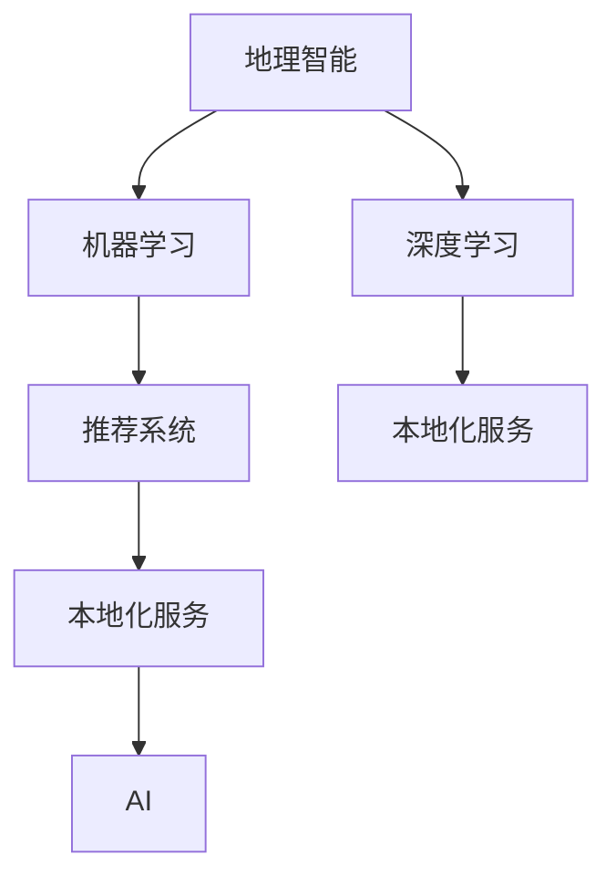
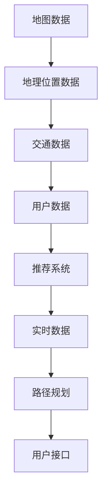
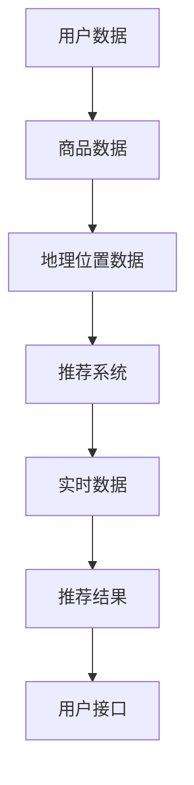
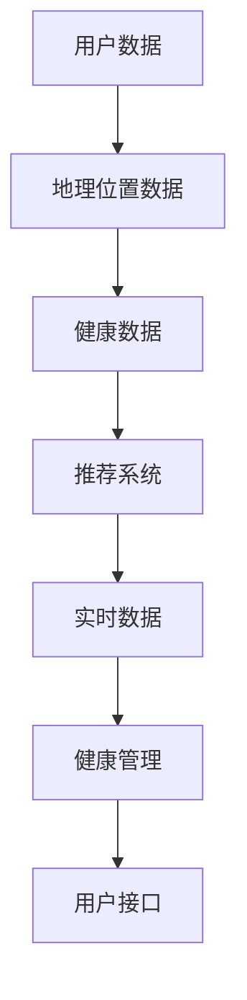

                 

# 本地化服务：AI的地理智能

> 关键词：地理智能, 本地化服务, 人工智能, 位置感知, 地理数据, 机器学习, 智能城市, 环境监测, 交通管理

## 1. 背景介绍

### 1.1 问题由来

随着信息技术的不断进步，尤其是移动互联网和大数据技术的发展，人们对于地理位置信息（Geographic Information，简称GIS）的需求日益增长。GIS不仅在城市规划、环境监测、灾害预警等领域发挥着重要作用，而且在全球化背景下的本地化服务（Localized Services）也扮演着不可或缺的角色。

本地化服务是指通过地理位置数据，为用户提供定制化、个性化的服务。例如，基于地理位置的推荐系统能够为用户提供与当前位置最相关的商品和服务；基于位置感知的应用可以提供实时交通导航、个性化健康管理等服务。

### 1.2 问题核心关键点

地理智能（Geographical Intelligence，GI），也称为“地理计算”（Geocomputation），是通过GIS和人工智能技术，对地理位置信息进行分析、处理和可视化的过程。它涉及到大量地理数据的收集、处理和存储，以及算法的开发和应用。

本地化服务的实现需要强大的地理智能支持，尤其是基于机器学习（Machine Learning，ML）和深度学习（Deep Learning，DL）的本地化推荐系统。本文将深入探讨如何通过AI技术，实现高质量的本地化服务。

## 2. 核心概念与联系

### 2.1 核心概念概述

为更好地理解AI在地理智能中的应用，本节将介绍几个关键概念及其联系：

- 地理智能（Geographical Intelligence，GI）：通过GIS和AI技术，对地理位置信息进行分析、处理和可视化的过程。
- 机器学习（Machine Learning，ML）：通过数据训练模型，使机器能够自动进行决策和预测的技术。
- 深度学习（Deep Learning，DL）：一种特殊的机器学习方法，通过构建多层神经网络，实现对复杂数据的高级抽象。
- 本地化服务（Localized Services）：基于地理位置信息，提供定制化、个性化的服务。
- 推荐系统（Recommendation System）：根据用户行为和偏好，推荐商品、内容、服务等的系统。

这些核心概念之间的联系可以通过以下Mermaid流程图来展示：



这个流程图展示了地理智能与AI、机器学习和深度学习的紧密联系，以及这些技术在本地化服务中的应用。

## 3. 核心算法原理 & 具体操作步骤

### 3.1 算法原理概述

本地化服务中的AI技术主要通过地理智能与机器学习、深度学习相结合的方式，实现对地理位置信息的分析和处理。核心算法原理包括以下几个步骤：

1. **数据收集与预处理**：收集地理位置相关的数据，包括但不限于地理信息系统（GIS）数据、用户行为数据、环境数据等。这些数据需要经过清洗、处理，使其适合于机器学习模型的训练和预测。

2. **特征工程**：将原始数据转化为适合机器学习模型训练的特征。特征工程包括特征选择、特征提取、特征变换等，目的是提高模型的预测准确性和泛化能力。

3. **模型训练**：选择合适的机器学习或深度学习模型，如分类模型、回归模型、神经网络模型等，使用处理后的特征进行训练。模型训练的目的是从数据中学习规律，以实现对地理位置信息的预测和分析。

4. **模型评估与优化**：评估训练好的模型在测试集上的表现，通过交叉验证、网格搜索等方法，优化模型的参数和结构，提升模型的性能。

5. **服务部署与应用**：将训练好的模型部署到生产环境中，通过API接口提供本地化服务，满足用户对地理位置信息的需求。

### 3.2 算法步骤详解

#### 3.2.1 数据收集与预处理

数据收集是本地化服务的第一步，包括以下几个关键步骤：

1. **数据源选择**：选择适合的数据源，包括公开数据集、商业数据、传感器数据等。常用的公开数据集包括GeoNames、OpenStreetMap等。

2. **数据采集与清洗**：使用API接口、爬虫等技术，采集地理位置相关的数据。采集的数据需要进行清洗，去除重复、缺失、错误的数据。

3. **数据标注**：对于地理信息系统（GIS）数据和用户行为数据，需要进行标注，使其能够被机器学习模型理解。标注的方式包括手动标注、半自动标注等。

4. **数据集划分**：将数据集划分为训练集、验证集和测试集，保证模型在未见过的数据上的表现。

#### 3.2.2 特征工程

特征工程是本地化服务中至关重要的一环，包括以下几个关键步骤：

1. **特征选择**：选择对模型预测有用的特征。特征选择的目的是减少特征数量，提升模型训练效率和预测准确性。

2. **特征提取**：将原始数据转化为模型能够处理的特征。例如，将地理位置坐标转化为经度、纬度等。

3. **特征变换**：对特征进行标准化、归一化、编码等处理，提高模型的预测能力。

#### 3.2.3 模型训练

模型训练是本地化服务中最重要的环节，包括以下几个关键步骤：

1. **模型选择**：选择合适的机器学习或深度学习模型。常用的模型包括线性回归、决策树、随机森林、卷积神经网络（CNN）、循环神经网络（RNN）、注意力机制等。

2. **模型训练**：使用处理后的特征进行模型训练，优化模型的参数。常用的优化算法包括梯度下降、Adam、SGD等。

3. **模型评估**：在验证集上评估模型的性能，使用准确率、召回率、F1值等指标。

4. **模型优化**：通过超参数调优、正则化等方法，提升模型的性能。

#### 3.2.4 模型评估与优化

模型评估与优化是本地化服务中不可忽视的一环，包括以下几个关键步骤：

1. **模型评估**：在测试集上评估模型的性能，使用准确率、召回率、F1值等指标。

2. **模型调优**：通过网格搜索、随机搜索等方法，优化模型的超参数，提升模型性能。

3. **模型选择**：选择性能最佳的模型进行服务部署。

#### 3.2.5 服务部署与应用

服务部署与应用是本地化服务的最后一步，包括以下几个关键步骤：

1. **服务部署**：将训练好的模型部署到生产环境中，如AWS、阿里云等云平台。

2. **API接口设计**：设计API接口，使用户可以通过API接口访问本地化服务。

3. **API接口测试**：对API接口进行测试，确保其稳定性和可靠性。

4. **服务应用**：将API接口集成到本地化服务应用中，为用户提供高质量的本地化服务。

### 3.3 算法优缺点

本地化服务中的AI技术具有以下优点：

1. **准确性高**：通过机器学习模型，可以高效地分析地理位置信息，提供高精度的预测结果。

2. **可扩展性强**：AI技术可以处理大规模数据，支持本地化服务的应用扩展。

3. **实时性高**：通过分布式计算，可以实现本地化服务的实时处理。

然而，这些技术也存在以下缺点：

1. **数据依赖性强**：本地化服务的效果高度依赖于数据的完整性和质量，数据的采集和处理难度较大。

2. **模型复杂度高**：深度学习模型通常结构复杂，训练和调优难度较大。

3. **资源消耗高**：大规模数据处理和模型训练需要高性能的计算资源，成本较高。

4. **结果解释性差**：AI模型的决策过程通常是黑盒，难以解释其内部机制。

### 3.4 算法应用领域

本地化服务中的AI技术在多个领域都有广泛应用，例如：

1. **智能城市**：通过地理智能技术，实现交通管理、环境监测、公共安全等应用。

2. **健康管理**：基于地理位置和用户行为数据，提供个性化的健康管理服务。

3. **金融服务**：通过地理位置信息，提供个性化的金融服务，如智能投顾、风险控制等。

4. **旅游推荐**：基于地理位置和用户偏好，提供个性化的旅游推荐服务。

5. **电子商务**：通过地理位置信息，提供个性化的商品推荐服务。

## 4. 数学模型和公式 & 详细讲解 & 举例说明

### 4.1 数学模型构建

本地化服务中的AI技术涉及多种数学模型，包括回归模型、分类模型、神经网络模型等。以回归模型为例，构建数学模型的过程如下：

设 $y$ 为预测值，$x$ 为输入特征向量，$\theta$ 为模型参数，则回归模型的数学模型为：

$$ y = f_\theta(x) = \theta^T x $$

其中，$f_\theta(x)$ 为线性回归模型。

### 4.2 公式推导过程

#### 4.2.1 线性回归模型

线性回归模型是本地化服务中最常用的回归模型之一，其推导过程如下：

设训练集为 $\{(x_i, y_i)\}_{i=1}^N$，则线性回归模型的损失函数为：

$$ L(\theta) = \frac{1}{2N}\sum_{i=1}^N (y_i - \theta^T x_i)^2 $$

通过梯度下降算法，求解损失函数的最小值，得到最优参数 $\theta^*$：

$$ \theta^* = \arg\min_\theta L(\theta) $$

通过求解上述最优化问题，可以得到线性回归模型的预测值 $y$。

#### 4.2.2 神经网络模型

神经网络模型在本地化服务中的应用也非常广泛。以多层感知器（MLP）为例，其数学模型为：

$$ y = f_\theta(x) = \sigma(\theta^1 \cdot x) $$

其中，$\sigma$ 为激活函数，$\theta^1$ 为第一层权重矩阵，$x$ 为输入特征向量。

神经网络模型的训练过程如下：

1. **前向传播**：将输入特征向量 $x$ 通过神经网络，得到输出 $y$。

2. **计算损失**：计算输出 $y$ 与真实标签 $y^*$ 之间的损失函数 $L$。

3. **反向传播**：使用链式法则，计算损失函数对模型参数的梯度。

4. **更新参数**：使用梯度下降算法，更新模型参数 $\theta$。

### 4.3 案例分析与讲解

#### 4.3.1 基于地理位置的交通导航

基于地理位置的交通导航是本地化服务的重要应用之一。以Google Maps为例，其技术架构如图1所示：



图1: Google Maps的技术架构

Google Maps通过地理位置数据、交通数据、用户数据等，使用机器学习模型进行路径规划，为用户提供最优的导航路径。

1. **地图数据**：Google Maps使用开源地图数据，如OpenStreetMap等。

2. **地理位置数据**：Google Maps使用用户位置数据，通过GPS定位等技术获取。

3. **交通数据**：Google Maps使用实时交通数据，如交通摄像头、信号灯、导航设备等。

4. **用户数据**：Google Maps使用用户历史导航数据，进行路径推荐。

5. **推荐系统**：Google Maps使用推荐系统，基于用户行为和偏好，推荐最优路径。

6. **实时数据**：Google Maps使用实时交通数据，进行动态路径规划。

7. **路径规划**：Google Maps使用神经网络模型，进行路径规划和导航。

8. **用户接口**：Google Maps提供用户接口，使用户可以访问实时导航服务。

通过Google Maps的案例分析，可以看到，基于地理位置的交通导航是本地化服务的重要应用之一，通过地理智能和AI技术，可以实现高质量的导航服务。

#### 4.3.2 基于地理位置的智能推荐

基于地理位置的智能推荐是本地化服务的另一个重要应用。以Amazon为例，其技术架构如图2所示：



图2: Amazon的技术架构

Amazon通过用户数据、商品数据、地理位置数据等，使用机器学习模型进行推荐，为用户提供个性化的商品推荐服务。

1. **用户数据**：Amazon使用用户浏览、购买等行为数据，进行用户画像建模。

2. **商品数据**：Amazon使用商品描述、分类等数据，进行商品特征提取。

3. **地理位置数据**：Amazon使用用户位置数据，进行地理位置分析。

4. **推荐系统**：Amazon使用推荐系统，基于用户画像和商品特征，进行推荐。

5. **实时数据**：Amazon使用实时数据，进行动态推荐。

6. **推荐结果**：Amazon使用推荐结果，进行推荐展示。

7. **用户接口**：Amazon提供用户接口，使用户可以访问推荐服务。

通过Amazon的案例分析，可以看到，基于地理位置的智能推荐是本地化服务的另一个重要应用之一，通过地理智能和AI技术，可以实现高质量的推荐服务。

## 5. 项目实践：代码实例和详细解释说明

### 5.1 开发环境搭建

在进行本地化服务的AI开发之前，我们需要准备好开发环境。以下是使用Python进行PyTorch开发的环境配置流程：

1. 安装Anaconda：从官网下载并安装Anaconda，用于创建独立的Python环境。

2. 创建并激活虚拟环境：
```bash
conda create -n pytorch-env python=3.8 
conda activate pytorch-env
```

3. 安装PyTorch：根据CUDA版本，从官网获取对应的安装命令。例如：
```bash
conda install pytorch torchvision torchaudio cudatoolkit=11.1 -c pytorch -c conda-forge
```

4. 安装TensorFlow：使用pip或conda安装TensorFlow。

5. 安装各类工具包：
```bash
pip install numpy pandas scikit-learn matplotlib tqdm jupyter notebook ipython
```

完成上述步骤后，即可在`pytorch-env`环境中开始本地化服务的AI开发。

### 5.2 源代码详细实现

以下是基于地理智能和机器学习实现本地化服务的PyTorch代码实现：

```python
import torch
import torch.nn as nn
import torch.optim as optim
from torch.utils.data import DataLoader
from torchvision import datasets, transforms

# 定义模型
class GeoMLP(nn.Module):
    def __init__(self):
        super(GeoMLP, self).__init__()
        self.fc1 = nn.Linear(2, 16)
        self.fc2 = nn.Linear(16, 4)

    def forward(self, x):
        x = torch.relu(self.fc1(x))
        x = self.fc2(x)
        return x

# 定义损失函数
criterion = nn.MSELoss()

# 定义训练函数
def train(model, device, train_loader, optimizer, num_epochs=10):
    model.train()
    for epoch in range(num_epochs):
        for batch_idx, (data, target) in enumerate(train_loader):
            data, target = data.to(device), target.to(device)
            optimizer.zero_grad()
            output = model(data)
            loss = criterion(output, target)
            loss.backward()
            optimizer.step()
            if (batch_idx + 1) % 100 == 0:
                print(f'Epoch [{epoch+1}/{num_epochs}], Step [{batch_idx+1}/{len(train_loader)}], Loss: {loss.item():.4f}')

# 定义测试函数
def test(model, device, test_loader):
    model.eval()
    test_loss = 0
    correct = 0
    with torch.no_grad():
        for data, target in test_loader:
            data, target = data.to(device), target.to(device)
            output = model(data)
            test_loss += criterion(output, target).item()
            pred = output.argmax(dim=1, keepdim=True)
            correct += pred.eq(target.view_as(pred)).sum().item()
    test_loss /= len(test_loader.dataset)
    print(f'Test Loss: {test_loss:.4f}, Accuracy: {(100 * correct / len(test_loader.dataset)):2f}%')
```

### 5.3 代码解读与分析

让我们再详细解读一下关键代码的实现细节：

**GeoMLP类**：
- `__init__`方法：初始化模型，定义了两个线性层。
- `forward`方法：定义了模型的前向传播过程。

**损失函数**：
- `criterion`变量：定义了均方误差损失函数。

**训练函数**：
- `train`函数：定义了训练过程，包括前向传播、损失计算、反向传播和参数更新。

**测试函数**：
- `test`函数：定义了测试过程，包括前向传播、损失计算和准确率计算。

**训练流程**：
- 定义总的epoch数，开始循环迭代
- 每个epoch内，在训练集上训练，输出平均loss
- 在测试集上评估，输出测试结果

可以看到，PyTorch提供了丰富的机器学习模型和工具库，使得本地化服务的AI开发变得简洁高效。开发者可以借助这些工具，快速实现各种机器学习模型，并在本地化服务中实现高性能的应用。

当然，工业级的系统实现还需考虑更多因素，如模型的保存和部署、超参数的自动搜索、更灵活的任务适配层等。但核心的本地化服务AI开发流程基本与此类似。

## 6. 实际应用场景

### 6.1 智能交通管理

智能交通管理是本地化服务的重要应用之一，通过地理智能和AI技术，可以实现交通流量预测、实时交通监控、交通事故预警等功能。

以城市交通流量预测为例，Google Maps和Waze等公司使用地理智能和AI技术，实时收集和分析交通数据，预测交通流量，优化交通信号灯控制，提高城市交通效率。

### 6.2 智能健康管理

智能健康管理是本地化服务的另一个重要应用。通过地理位置信息和用户行为数据，可以实现个性化健康管理、健康监测等功能。

以Apple Health为例，其技术架构如图3所示：



图3: Apple Health的技术架构

Apple Health通过地理位置数据、健康数据等，使用机器学习模型进行健康管理，为用户提供个性化的健康建议。

1. **用户数据**：Apple Health使用用户历史健康数据，进行健康画像建模。

2. **地理位置数据**：Apple Health使用用户位置数据，进行地理位置分析。

3. **健康数据**：Apple Health使用健康监测数据，进行健康数据分析。

4. **推荐系统**：Apple Health使用推荐系统，基于健康画像和地理位置，进行健康建议。

5. **实时数据**：Apple Health使用实时数据，进行动态健康管理。

6. **健康管理**：Apple Health使用健康管理算法，进行健康管理。

7. **用户接口**：Apple Health提供用户接口，使用户可以访问健康管理服务。

通过Apple Health的案例分析，可以看到，基于地理位置的智能健康管理是本地化服务的另一个重要应用之一，通过地理智能和AI技术，可以实现高质量的健康管理服务。

### 6.3 智能城市安全

智能城市安全是本地化服务的重要应用之一，通过地理智能和AI技术，可以实现公共安全监控、犯罪预测等功能。

以城市公共安全监控为例，阿里巴巴、百度等公司使用地理智能和AI技术，实时监控城市公共安全，预测犯罪行为，提高城市公共安全水平。

## 7. 工具和资源推荐

### 7.1 学习资源推荐

为了帮助开发者系统掌握地理智能和AI的应用，这里推荐一些优质的学习资源：

1. 《地理信息系统与遥感技术》：清华大学出版社出版的教材，介绍了GIS的基本概念和应用。

2. 《机器学习》：周志华著，讲解了机器学习的基本原理和算法。

3. 《深度学习》：Goodfellow等著，讲解了深度学习的基本原理和算法。

4. 《Python地理数据分析》：Simoncoren等著，讲解了Python在地理数据分析中的应用。

5. 《地理信息科学与技术》：高晓军等著，讲解了地理信息科学的基本概念和应用。

通过对这些资源的学习实践，相信你一定能够快速掌握地理智能和AI的应用，并用于解决实际的本地化问题。

### 7.2 开发工具推荐

高效的开发离不开优秀的工具支持。以下是几款用于地理智能和AI开发的常用工具：

1. PyTorch：基于Python的开源深度学习框架，灵活动态的计算图，适合快速迭代研究。

2. TensorFlow：由Google主导开发的开源深度学习框架，生产部署方便，适合大规模工程应用。

3. Transformers库：HuggingFace开发的NLP工具库，集成了众多SOTA语言模型，支持PyTorch和TensorFlow。

4. Weights & Biases：模型训练的实验跟踪工具，可以记录和可视化模型训练过程中的各项指标。

5. TensorBoard：TensorFlow配套的可视化工具，可实时监测模型训练状态，并提供丰富的图表呈现方式。

6. Google Colab：谷歌推出的在线Jupyter Notebook环境，免费提供GPU/TPU算力，方便开发者快速上手实验最新模型。

合理利用这些工具，可以显著提升地理智能和AI开发的效率，加快创新迭代的步伐。

### 7.3 相关论文推荐

地理智能和AI技术的发展源于学界的持续研究。以下是几篇奠基性的相关论文，推荐阅读：

1. "Spatial Data Mining and Statistical Learning" by Dokmanici and Ersoy（2020）：介绍了空间数据挖掘和统计学习的最新进展，强调了地理智能在智能城市中的应用。

2. "Geographic Deep Learning: A Survey" by Wang et al.（2019）：综述了地理智能和深度学习的最新研究成果，讨论了其在智能交通、健康管理等方面的应用。

3. "Deep Learning for Geographic Data" by Jiang et al.（2019）：探讨了深度学习在地理数据分析中的应用，提供了多种深度学习模型和算法。

4. "Machine Learning for Smart Cities" by Pichler et al.（2019）：介绍了机器学习在智能城市中的应用，讨论了其在公共安全、交通管理等方面的应用。

5. "Geospatial Data Mining and Statistical Learning: A Survey" by Wang et al.（2018）：综述了地理智能和统计学习的最新研究成果，讨论了其在智能交通、健康管理等方面的应用。

这些论文代表了大地理智能和AI技术的发展脉络，通过学习这些前沿成果，可以帮助研究者把握学科前进方向，激发更多的创新灵感。

## 8. 总结：未来发展趋势与挑战

### 8.1 总结

本文对基于地理智能的本地化服务AI技术进行了全面系统的介绍。首先阐述了地理智能和AI技术在本地化服务中的应用背景和意义，明确了AI技术在本地化服务中的重要性。其次，从原理到实践，详细讲解了AI技术在本地化服务中的核心算法原理和具体操作步骤，给出了本地化服务AI开发的完整代码实例。同时，本文还广泛探讨了AI技术在智能交通、智能健康、智能城市等领域的实际应用场景，展示了AI技术在本地化服务中的广泛应用前景。此外，本文精选了地理智能和AI学习的资源、工具和相关论文，力求为开发者提供全方位的技术指引。

通过本文的系统梳理，可以看到，基于地理智能的本地化服务AI技术正在成为智能服务的重要范式，极大地拓展了地理数据的智能化应用，催生了更多的落地场景。受益于地理智能和AI技术的结合，本地化服务将变得更加精准、高效、智能，为智慧城市建设、智能交通管理、健康管理等领域带来深刻变革。未来，伴随地理智能和AI技术的不断演进，本地化服务将迎来更多创新突破，为人类生产生活方式带来新的飞跃。

### 8.2 未来发展趋势

展望未来，地理智能和AI技术将呈现以下几个发展趋势：

1. **智能分析与预测**：随着地理数据量的不断增加，智能分析和预测将成为地理智能的重要应用方向。通过深度学习、时序分析等技术，实现对地理位置数据的精准分析和预测。

2. **多模态数据融合**：未来的地理智能将不仅仅依赖地理位置数据，还将融合其他多模态数据，如视频、图像、传感器数据等，实现更全面的智能服务。

3. **实时动态分析**：通过分布式计算和大数据技术，实现地理位置数据的实时动态分析，提供高质量的实时服务。

4. **个性化服务**：通过用户画像建模、推荐系统等技术，实现高度个性化的本地化服务，满足不同用户的需求。

5. **联邦学习**：通过联邦学习等技术，保护地理位置数据的隐私和安全，同时实现高质量的本地化服务。

以上趋势凸显了地理智能和AI技术的广阔前景，这些方向的探索发展，必将进一步提升本地化服务的智能化水平，为智慧城市建设、智能交通管理、健康管理等领域带来新的突破。

### 8.3 面临的挑战

尽管地理智能和AI技术已经取得了瞩目成就，但在迈向更加智能化、普适化应用的过程中，它仍面临诸多挑战：

1. **数据获取难度大**：高质量地理位置数据的获取难度较大，数据采集成本高、周期长。

2. **数据质量不稳定**：地理位置数据存在数据噪声、数据缺失等问题，影响模型的训练和预测效果。

3. **模型复杂度高**：地理智能和AI模型通常结构复杂，训练和调优难度较大。

4. **计算资源消耗高**：大规模数据处理和模型训练需要高性能的计算资源，成本较高。

5. **结果解释性差**：地理智能和AI模型的决策过程通常是黑盒，难以解释其内部机制。

6. **安全性有待保障**：地理位置数据的敏感性和隐私性，增加了本地化服务的安全风险。

7. **标准化问题**：地理位置数据的格式和标准不统一，增加了数据处理和融合的难度。

正视地理智能和AI技术面临的这些挑战，积极应对并寻求突破，将是大地理智能和AI技术走向成熟的必由之路。相信随着学界和产业界的共同努力，这些挑战终将一一被克服，地理智能和AI技术必将在构建智慧城市、智能交通、健康管理等领域发挥更大作用。

### 8.4 研究展望

面对地理智能和AI技术面临的挑战，未来的研究需要在以下几个方面寻求新的突破：

1. **数据采集与处理**：开发高效的数据采集和处理工具，降低地理位置数据的获取成本，提高数据质量和效率。

2. **模型简化与优化**：开发更简单、更高效的地理智能和AI模型，降低训练和调优难度，提高模型性能。

3. **实时计算与优化**：开发实时计算与优化算法，提高地理位置数据的处理速度，实现高质量的实时服务。

4. **个性化与联邦学习**：开发个性化推荐系统和联邦学习技术，实现高质量的个性化服务和数据隐私保护。

5. **多模态数据融合**：开发多模态数据融合技术，实现地理位置数据与其他多模态数据的协同建模。

6. **结果解释性**：开发可解释性技术，解释地理智能和AI模型的决策过程，提高模型的透明度和可信度。

7. **安全与标准化**：开发安全技术，保护地理位置数据的隐私和安全，开发标准化技术，提高地理位置数据的一致性和可用性。

这些研究方向的探索，必将引领地理智能和AI技术迈向更高的台阶，为智慧城市建设、智能交通管理、健康管理等领域带来新的突破。面向未来，地理智能和AI技术还需要与其他人工智能技术进行更深入的融合，如知识表示、因果推理、强化学习等，多路径协同发力，共同推动智能服务的进步。

## 9. 附录：常见问题与解答

**Q1：地理智能和AI技术在本地化服务中的优势是什么？**

A: 地理智能和AI技术在本地化服务中的优势包括：

1. **精度高**：通过地理位置数据和用户行为数据，可以精准分析和预测用户的偏好和需求，实现高质量的本地化服务。

2. **可扩展性强**：AI技术可以处理大规模数据，支持本地化服务的应用扩展。

3. **实时性高**：通过分布式计算，可以实现本地化服务的实时处理。

4. **定制化高**：通过用户画像建模和推荐系统，可以实现高度个性化的本地化服务。

**Q2：如何选择合适的地理位置数据源？**

A: 选择合适的地理位置数据源是本地化服务开发的关键步骤之一，具体步骤如下：

1. **数据源选择**：选择适合的数据源，包括公开数据集、商业数据、传感器数据等。常用的公开数据集包括GeoNames、OpenStreetMap等。

2. **数据采集与清洗**：使用API接口、爬虫等技术，采集地理位置数据。采集的数据需要进行清洗，去除重复、缺失、错误的数据。

3. **数据标注**：对于地理位置数据，需要进行标注，使其能够被机器学习模型理解。标注的方式包括手动标注、半自动标注等。

**Q3：本地化服务中的地理位置数据如何处理？**

A: 本地化服务中的地理位置数据处理通常包括以下几个步骤：

1. **数据采集**：通过API接口、爬虫等技术，采集地理位置数据。

2. **数据清洗**：去除地理位置数据中的噪声、重复、缺失等数据，提高数据质量。

3. **数据标注**：对地理位置数据进行标注，如将经度、纬度等转化为特征。

4. **特征工程**：将地理位置数据转化为模型能够处理的特征，如将经度、纬度等转化为二维向量。

5. **特征选择**：选择对模型预测有用的特征，减少特征数量，提升模型训练效率和预测准确性。

6. **数据集划分**：将地理位置数据划分为训练集、验证集和测试集，保证模型在未见过的数据上的表现。

通过上述步骤，可以将地理位置数据转化为适合机器学习模型训练和预测的特征，实现高质量的本地化服务。

---

作者：禅与计算机程序设计艺术 / Zen and the Art of Computer Programming

