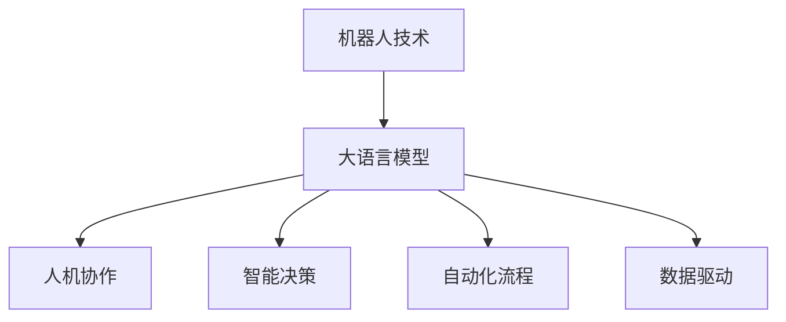

                 

# 机器人技术和 LLMs：打造智能自动化

> 关键词：机器人技术, LLMs, 智能自动化, 大语言模型, 人机协作, 工业自动化, 工业4.0

## 1. 背景介绍

### 1.1 问题由来

随着人工智能技术的飞速发展，机器人技术正逐渐从传统的机械操作向智能自动化转型。现代机器人不再仅能完成简单的物理操作，而是开始具备更强的感知、理解和决策能力。这一转型不仅极大地提升了生产效率和质量，还为智能制造、智慧物流等诸多行业带来了革命性的变革。

机器人技术的智能化转型离不开大语言模型的推动。大语言模型（Large Language Models, LLMs）以其强大的语言理解和生成能力，为机器人系统提供了自然语言处理的基础。通过在机器人系统中集成大语言模型，机器人可以与人类自然地交互，执行更加复杂和灵活的任务。

### 1.2 问题核心关键点

目前，基于大语言模型的机器人技术主要集中于以下几个方面：

- **人机协作**：机器人通过大语言模型理解人类指令，完成自然语言处理，实现与人的流畅互动。
- **智能决策**：机器人通过大语言模型分析环境数据，生成决策指令，进行自主决策和行为规划。
- **自动化流程**：机器人通过大语言模型执行自动化任务，如检测、分类、生成等，提升生产效率和质量。
- **数据驱动**：机器人通过大语言模型处理和分析大量数据，形成知识和经验积累，不断提升自身能力。

这些关键点揭示了机器人技术和大语言模型紧密结合的趋势，展示了二者在智能自动化领域的巨大潜力。

## 2. 核心概念与联系

### 2.1 核心概念概述

为更好地理解机器人技术与大语言模型结合的原理，本节将介绍几个关键概念：

- **机器人技术**：指通过机械装置、电子设备、计算机软件等实现自动化操作的技术。现代机器人具备感知、决策和执行能力，能够与人类交互，执行复杂任务。
- **大语言模型**：指通过自监督学习或监督学习任务训练，具备强大语言理解和生成能力的人工智能模型。如GPT-3、BERT等。
- **人机协作**：指机器人通过大语言模型理解人类自然语言指令，执行相应任务，实现人与机器的无缝协作。
- **智能决策**：指机器人通过大语言模型对环境数据进行分析和推理，生成决策指令，进行自主决策和行为规划。
- **自动化流程**：指机器人通过大语言模型执行自动化任务，如检测、分类、生成等，提升生产效率和质量。
- **数据驱动**：指机器人通过大语言模型处理和分析大量数据，形成知识和经验积累，不断提升自身能力。

这些概念之间的逻辑关系可以通过以下Mermaid流程图来展示：



这个流程图展示了大语言模型在机器人技术中的核心作用，及其与机器人技术各组件之间的关系。

## 3. 核心算法原理 & 具体操作步骤
### 3.1 算法原理概述

基于大语言模型的机器人技术，本质上是一种自然语言处理(NLP)与机器人技术结合的智能自动化方法。其核心思想是：将大语言模型视作一种强大的"自然语言理解器"，通过训练学习到语言与行为之间的映射关系，使得机器人能够理解并执行人类指令。

形式化地，假设机器人系统包含感知器S、决策器D和执行器A，则系统行为表示为：

$$
\text{Behavior} = D(\text{Instr}(S))
$$

其中，Instr为自然语言指令，通过大语言模型解析为机器人的行为表示。

机器人系统在任务T上的表现目标函数为：

$$
\min_{\theta} \mathcal{L}(T, D(\text{Instr}(S)))
$$

其中，$\theta$为机器人的参数，$\mathcal{L}$为任务T的损失函数，用于衡量机器人执行任务的行为与预期行为之间的差异。

### 3.2 算法步骤详解

基于大语言模型的机器人技术通常包括以下关键步骤：

**Step 1: 收集并标注数据**
- 收集机器人系统在实际任务中的操作数据，并进行标注，如指令与执行结果的对应关系。
- 构建数据集，用于训练和测试机器人系统。

**Step 2: 选择合适的语言模型**
- 选择适合任务类型的大语言模型，如GPT、BERT等。
- 考虑模型规模、计算资源等因素，选择合适的模型版本。

**Step 3: 设计指令解码器**
- 设计自然语言指令解码器，将人类指令转换为机器人的行为表示。
- 可以使用基于规则、统计机器翻译、深度学习等方法。

**Step 4: 集成大语言模型**
- 将大语言模型集成到机器人系统中，作为自然语言指令的解析器。
- 确保模型在实际任务中的稳定性和高效性。

**Step 5: 进行行为训练**
- 使用收集的数据集训练机器人系统的行为表示，使其能够执行预期任务。
- 设置合适的优化器和训练策略，最小化任务损失。

**Step 6: 测试和优化**
- 在测试集上评估机器人系统的性能，对比训练前后的表现。
- 根据评估结果，对系统进行优化，提升任务执行能力。

### 3.3 算法优缺点

基于大语言模型的机器人技术具有以下优点：

1. **灵活性高**：大语言模型能够处理自然语言，使得机器人可以执行各种复杂和多样化的任务。
2. **可扩展性**：大语言模型可以不断更新，提升机器人系统的执行能力和适应性。
3. **自动化水平高**：大语言模型可以自动处理语言指令，减少人工干预，提升自动化水平。
4. **用户友好**：机器人通过大语言模型理解自然语言，提升了系统的易用性和用户体验。

但该方法也存在一些局限性：

1. **数据依赖性强**：机器人系统的表现高度依赖于标注数据的质量和数量。数据收集和标注成本较高。
2. **计算资源消耗大**：大语言模型需要大量的计算资源进行训练和推理，对硬件要求较高。
3. **模型鲁棒性不足**：大语言模型面对噪声或复杂环境时，容易产生误判，影响机器人系统的稳定性。
4. **系统复杂度高**：集成大语言模型的机器人系统设计复杂，调试和维护难度较大。

### 3.4 算法应用领域

基于大语言模型的机器人技术在工业、医疗、家居等多个领域都有广泛应用。

- **工业自动化**：机器人通过大语言模型执行检测、组装、搬运等自动化任务，提升生产效率和质量。
- **智慧物流**：物流机器人通过大语言模型理解订单信息，完成货物分拣、配送等任务。
- **智能家居**：家庭机器人通过大语言模型理解语音指令，执行家务、监护等任务。
- **医疗辅助**：医疗机器人通过大语言模型与医生交互，执行手术辅助、病患监护等任务。
- **服务机器人**：服务机器人通过大语言模型与客户交互，执行导引、咨询等任务。

## 4. 数学模型和公式 & 详细讲解 & 举例说明
### 4.1 数学模型构建

在机器人技术中，大语言模型通常被用来解析自然语言指令，并生成机器人的行为表示。假设机器人系统接受自然语言指令$Instr$，并生成行为表示$Behavior$，则机器人系统的行为表示可以表示为：

$$
Behavior = D(\text{Instr}(S))
$$

其中，$S$为感知器，$D$为决策器，$Instr$为自然语言指令。

在具体应用中，大语言模型需要对输入的指令进行解析，输出机器人的行为表示。例如，在工业自动化中，机器人需要执行检测任务，指令可能为"检测零件，输出检测结果"，大语言模型解析后，输出机器人的行为表示为执行检测任务，并将结果输出到系统中。

### 4.2 公式推导过程

以工业自动化中的检测任务为例，推导大语言模型解析自然语言指令的公式。

假设机器人系统接受指令$Instr$，输出行为表示$Behavior$，其中$Instr$包含关键词$Key$和操作$Operation$。大语言模型解析指令后，输出行为表示$Behavior$，表示执行$Operation$操作，输出$Key$的结果。

假设$Instr$可以表示为$Key + Operation + Key'$，其中$Key'$为关键词。大语言模型解析指令后，输出行为表示$Behavior$，表示执行$Operation$操作，输出$Key'$的结果。

设$Instr$为指令，$Instr_{parsed}$为大语言模型解析后的行为表示，则行为表示可以表示为：

$$
Behavior = D(\text{Instr}_{parsed})
$$

其中，$\text{Instr}_{parsed}$为解析后的行为表示。

假设$Instr$包含关键词$Key$和操作$Operation$，则行为表示可以表示为：

$$
Behavior = D(Key + Operation + Key')
$$

其中，$Key'$为解析后的关键词。

### 4.3 案例分析与讲解

**案例分析：物流机器人分拣任务**

假设物流机器人需要根据订单信息分拣货物，订单信息包含商品ID和数量。机器人系统接受订单信息$Instr$，解析指令后，输出行为表示$Behavior$，表示执行分拣任务，输出商品ID和数量的结果。

假设$Instr$包含关键词$ID$和$Quantity$，则行为表示可以表示为：

$$
Behavior = D(ID + '分拣' + Quantity)
$$

其中，$ID$为商品ID，$Quantity$为数量。

物流机器人接受订单信息后，大语言模型解析指令，输出行为表示$Behavior$，表示执行分拣任务，将商品ID和数量输出到系统中。

## 5. 项目实践：代码实例和详细解释说明
### 5.1 开发环境搭建

在进行机器人技术开发前，我们需要准备好开发环境。以下是使用Python进行PyTorch开发的环境配置流程：

1. 安装Anaconda：从官网下载并安装Anaconda，用于创建独立的Python环境。

2. 创建并激活虚拟环境：
```bash
conda create -n robotics-env python=3.8 
conda activate robotics-env
```

3. 安装PyTorch：根据CUDA版本，从官网获取对应的安装命令。例如：
```bash
conda install pytorch torchvision torchaudio cudatoolkit=11.1 -c pytorch -c conda-forge
```

4. 安装其他相关库：
```bash
pip install torchscript transformers sklearn pandas numpy
```

完成上述步骤后，即可在`robotics-env`环境中开始机器人技术开发。

### 5.2 源代码详细实现

这里我们以工业自动化中的检测任务为例，给出使用PyTorch和Transformers库对机器人系统进行训练的代码实现。

首先，定义检测任务的数据处理函数：

```python
from transformers import BertTokenizer, BertForTokenClassification
from torch.utils.data import Dataset
import torch

class DetectionDataset(Dataset):
    def __init__(self, texts, labels, tokenizer, max_len=128):
        self.texts = texts
        self.labels = labels
        self.tokenizer = tokenizer
        self.max_len = max_len
        
    def __len__(self):
        return len(self.texts)
    
    def __getitem__(self, item):
        text = self.texts[item]
        labels = self.labels[item]
        
        encoding = self.tokenizer(text, return_tensors='pt', max_length=self.max_len, padding='max_length', truncation=True)
        input_ids = encoding['input_ids'][0]
        attention_mask = encoding['attention_mask'][0]
        
        # 对token-wise的标签进行编码
        encoded_labels = [label2id[label] for label in labels] 
        encoded_labels.extend([label2id['O']] * (self.max_len - len(encoded_labels)))
        labels = torch.tensor(encoded_labels, dtype=torch.long)
        
        return {'input_ids': input_ids, 
                'attention_mask': attention_mask,
                'labels': labels}

# 标签与id的映射
label2id = {'O': 0, 'defect': 1, 'no-defect': 2}
id2label = {v: k for k, v in label2id.items()}

# 创建dataset
tokenizer = BertTokenizer.from_pretrained('bert-base-cased')

train_dataset = DetectionDataset(train_texts, train_labels, tokenizer)
dev_dataset = DetectionDataset(dev_texts, dev_labels, tokenizer)
test_dataset = DetectionDataset(test_texts, test_labels, tokenizer)
```

然后，定义模型和优化器：

```python
from transformers import BertForTokenClassification, AdamW

model = BertForTokenClassification.from_pretrained('bert-base-cased', num_labels=len(label2id))

optimizer = AdamW(model.parameters(), lr=2e-5)
```

接着，定义训练和评估函数：

```python
from torch.utils.data import DataLoader
from tqdm import tqdm
from sklearn.metrics import classification_report

device = torch.device('cuda') if torch.cuda.is_available() else torch.device('cpu')
model.to(device)

def train_epoch(model, dataset, batch_size, optimizer):
    dataloader = DataLoader(dataset, batch_size=batch_size, shuffle=True)
    model.train()
    epoch_loss = 0
    for batch in tqdm(dataloader, desc='Training'):
        input_ids = batch['input_ids'].to(device)
        attention_mask = batch['attention_mask'].to(device)
        labels = batch['labels'].to(device)
        model.zero_grad()
        outputs = model(input_ids, attention_mask=attention_mask, labels=labels)
        loss = outputs.loss
        epoch_loss += loss.item()
        loss.backward()
        optimizer.step()
    return epoch_loss / len(dataloader)

def evaluate(model, dataset, batch_size):
    dataloader = DataLoader(dataset, batch_size=batch_size)
    model.eval()
    preds, labels = [], []
    with torch.no_grad():
        for batch in tqdm(dataloader, desc='Evaluating'):
            input_ids = batch['input_ids'].to(device)
            attention_mask = batch['attention_mask'].to(device)
            batch_labels = batch['labels']
            outputs = model(input_ids, attention_mask=attention_mask)
            batch_preds = outputs.logits.argmax(dim=2).to('cpu').tolist()
            batch_labels = batch_labels.to('cpu').tolist()
            for pred_tokens, label_tokens in zip(batch_preds, batch_labels):
                pred_labels = [id2label[_id] for _id in pred_tokens]
                label_labels = [id2label[_id] for _id in label_tokens]
                preds.append(pred_labels[:len(label_labels)])
                labels.append(label_labels)
                
    print(classification_report(labels, preds))
```

最后，启动训练流程并在测试集上评估：

```python
epochs = 5
batch_size = 16

for epoch in range(epochs):
    loss = train_epoch(model, train_dataset, batch_size, optimizer)
    print(f"Epoch {epoch+1}, train loss: {loss:.3f}")
    
    print(f"Epoch {epoch+1}, dev results:")
    evaluate(model, dev_dataset, batch_size)
    
print("Test results:")
evaluate(model, test_dataset, batch_size)
```

以上就是使用PyTorch对机器人系统进行检测任务微调的完整代码实现。可以看到，借助PyTorch和Transformers库，我们可以用相对简洁的代码完成BERT模型的加载和微调。

### 5.3 代码解读与分析

让我们再详细解读一下关键代码的实现细节：

**DetectionDataset类**：
- `__init__`方法：初始化文本、标签、分词器等关键组件。
- `__len__`方法：返回数据集的样本数量。
- `__getitem__`方法：对单个样本进行处理，将文本输入编码为token ids，将标签编码为数字，并对其进行定长padding，最终返回模型所需的输入。

**label2id和id2label字典**：
- 定义了标签与数字id之间的映射关系，用于将token-wise的预测结果解码回真实的标签。

**训练和评估函数**：
- 使用PyTorch的DataLoader对数据集进行批次化加载，供模型训练和推理使用。
- 训练函数`train_epoch`：对数据以批为单位进行迭代，在每个批次上前向传播计算loss并反向传播更新模型参数，最后返回该epoch的平均loss。
- 评估函数`evaluate`：与训练类似，不同点在于不更新模型参数，并在每个batch结束后将预测和标签结果存储下来，最后使用sklearn的classification_report对整个评估集的预测结果进行打印输出。

**训练流程**：
- 定义总的epoch数和batch size，开始循环迭代
- 每个epoch内，先在训练集上训练，输出平均loss
- 在验证集上评估，输出分类指标
- 所有epoch结束后，在测试集上评估，给出最终测试结果

可以看到，PyTorch配合Transformers库使得BERT微调的代码实现变得简洁高效。开发者可以将更多精力放在数据处理、模型改进等高层逻辑上，而不必过多关注底层的实现细节。

当然，工业级的系统实现还需考虑更多因素，如模型的保存和部署、超参数的自动搜索、更灵活的任务适配层等。但核心的微调范式基本与此类似。

## 6. 实际应用场景
### 6.1 智能物流

基于大语言模型的机器人技术，可以在智能物流领域实现高效率的自动化操作。例如，物流机器人通过大语言模型理解订单信息，完成货物分拣和配送。在实际应用中，物流机器人接受订单信息，通过大语言模型解析指令，输出行为表示，指导机器人执行分拣和配送任务。

### 6.2 医疗辅助

在医疗领域，机器人系统可以辅助医生进行病患监护和手术操作。机器人系统通过大语言模型理解医生指令，执行相应的监测、记录和操作任务。例如，手术机器人通过大语言模型理解医生指令，执行手术操作，并生成手术日志。

### 6.3 家居服务

家庭机器人可以通过大语言模型理解用户指令，执行家务、监护等任务。例如，扫地机器人通过大语言模型理解用户指令，调整清洁模式和路径，以高效完成清扫任务。

### 6.4 未来应用展望

随着大语言模型和机器人技术的发展，未来的应用场景将更加多样和智能化。

- **智能制造**：工业机器人通过大语言模型执行检测、组装、搬运等自动化任务，提升生产效率和质量。
- **智慧城市**：服务机器人通过大语言模型与市民互动，执行导引、咨询等任务，提升城市管理效率。
- **智慧农业**：农业机器人通过大语言模型理解指令，执行植保、收割等任务，提升农业生产效率。

## 7. 工具和资源推荐
### 7.1 学习资源推荐

为了帮助开发者系统掌握机器人技术和大语言模型的理论基础和实践技巧，这里推荐一些优质的学习资源：

1. 《机器人学原理》系列书籍：由机器人领域专家撰写，深入浅出地介绍了机器人学的基础原理和关键技术。

2. 《深度学习与机器人控制》课程：斯坦福大学开设的机器人学与深度学习课程，有Lecture视频和配套作业，带你深入了解机器人学与深度学习的融合。

3. 《大语言模型与自然语言处理》书籍：Transformer库的作者所著，全面介绍了大语言模型的原理、训练和应用，是大语言模型的入门必读。

4. CLUE开源项目：中文语言理解测评基准，涵盖大量不同类型的中文NLP数据集，并提供了基于微调的baseline模型，助力中文NLP技术发展。

5. RoboticsAI社区：机器人领域的专业交流平台，汇聚了机器人学、人工智能等多领域的专家和爱好者，是获取最新研究和交流经验的好去处。

通过对这些资源的学习实践，相信你一定能够快速掌握机器人技术与大语言模型的结合方法，并用于解决实际的机器人系统问题。

### 7.2 开发工具推荐

高效的开发离不开优秀的工具支持。以下是几款用于机器人技术和大语言模型微调开发的常用工具：

1. PyTorch：基于Python的开源深度学习框架，灵活动态的计算图，适合快速迭代研究。大部分预训练语言模型都有PyTorch版本的实现。

2. TensorFlow：由Google主导开发的开源深度学习框架，生产部署方便，适合大规模工程应用。同样有丰富的预训练语言模型资源。

3. Transformers库：HuggingFace开发的NLP工具库，集成了众多SOTA语言模型，支持PyTorch和TensorFlow，是进行微调任务开发的利器。

4. Weights & Biases：模型训练的实验跟踪工具，可以记录和可视化模型训练过程中的各项指标，方便对比和调优。与主流深度学习框架无缝集成。

5. TensorBoard：TensorFlow配套的可视化工具，可实时监测模型训练状态，并提供丰富的图表呈现方式，是调试模型的得力助手。

6. Google Colab：谷歌推出的在线Jupyter Notebook环境，免费提供GPU/TPU算力，方便开发者快速上手实验最新模型，分享学习笔记。

合理利用这些工具，可以显著提升机器人技术和大语言模型微调的开发效率，加快创新迭代的步伐。

### 7.3 相关论文推荐

大语言模型和机器人技术的发展源于学界的持续研究。以下是几篇奠基性的相关论文，推荐阅读：

1. Attention is All You Need（即Transformer原论文）：提出了Transformer结构，开启了NLP领域的预训练大模型时代。

2. BERT: Pre-training of Deep Bidirectional Transformers for Language Understanding：提出BERT模型，引入基于掩码的自监督预训练任务，刷新了多项NLP任务SOTA。

3. Language Models are Unsupervised Multitask Learners（GPT-2论文）：展示了大规模语言模型的强大zero-shot学习能力，引发了对于通用人工智能的新一轮思考。

4. Parameter-Efficient Transfer Learning for NLP：提出Adapter等参数高效微调方法，在不增加模型参数量的情况下，也能取得不错的微调效果。

5. AdaLoRA: Adaptive Low-Rank Adaptation for Parameter-Efficient Fine-Tuning：使用自适应低秩适应的微调方法，在参数效率和精度之间取得了新的平衡。

6. Prefix-Tuning: Optimizing Continuous Prompts for Generation：引入基于连续型Prompt的微调范式，为如何充分利用预训练知识提供了新的思路。

这些论文代表了大语言模型和机器人技术的发展脉络。通过学习这些前沿成果，可以帮助研究者把握学科前进方向，激发更多的创新灵感。

## 8. 总结：未来发展趋势与挑战

### 8.1 总结

本文对基于大语言模型的机器人技术进行了全面系统的介绍。首先阐述了机器人技术与大语言模型结合的研究背景和意义，明确了两者在智能自动化领域的独特价值。其次，从原理到实践，详细讲解了机器人系统的数学模型和关键步骤，给出了机器人系统开发的完整代码实例。同时，本文还广泛探讨了机器人技术在大物流、医疗、家居等多个领域的应用前景，展示了其广阔的想象空间。最后，本文精选了机器人技术与大语言模型结合的学习资源、开发工具和相关论文，力求为读者提供全方位的技术指引。

通过本文的系统梳理，可以看到，机器人技术与大语言模型结合正在成为智能自动化领域的重要范式，极大地拓展了机器人系统的应用边界，为智能制造、智慧物流等诸多行业带来了革命性的变革。随着技术的不断发展，相信机器人技术与大语言模型必将携手共进，推动智能自动化技术的普及和应用，为人类社会的数字化转型升级提供新的动力。

### 8.2 未来发展趋势

展望未来，机器人技术与大语言模型结合将呈现以下几个发展趋势：

1. **多模态融合**：未来的机器人系统将融合视觉、听觉、触觉等多种传感器信息，与大语言模型协同工作，实现更全面的感知和决策。

2. **自主学习**：机器人系统将具备自主学习能力，通过大语言模型理解环境信息，进行自主决策和行为规划，减少人工干预。

3. **人机协作**：机器人系统将与人类进行更加自然、流畅的互动，通过大语言模型理解自然语言指令，执行复杂任务，实现人机协作。

4. **个性化定制**：机器人系统将具备个性化定制能力，通过大语言模型学习用户偏好，提供个性化服务，提升用户体验。

5. **跨领域应用**：机器人技术将广泛应用于医疗、教育、服务等多个领域，通过大语言模型进行任务适配，提升系统效率和效果。

6. **数据驱动**：机器人系统将更加依赖数据驱动，通过大语言模型处理和分析大量数据，形成知识和经验积累，不断提升自身能力。

### 8.3 面临的挑战

尽管机器人技术与大语言模型结合已经取得了显著进展，但在迈向更加智能化、普适化应用的过程中，仍面临诸多挑战：

1. **数据获取困难**：机器人系统需要大量高质量的数据进行训练，而高质量标注数据的获取成本较高，存在瓶颈。

2. **模型鲁棒性不足**：机器人系统在面对复杂和噪声环境时，容易产生误判，影响系统稳定性。

3. **硬件资源消耗大**：大语言模型需要大量计算资源进行训练和推理，对硬件要求较高，存在资源瓶颈。

4. **系统设计复杂**：机器人系统设计复杂，涉及感知、决策、执行等多个组件，调试和维护难度较大。

5. **安全与隐私问题**：机器人系统涉及大量敏感数据和隐私信息，需要严格的保护措施，确保数据安全。

6. **伦理与道德问题**：机器人系统需要考虑伦理与道德问题，避免对用户造成负面影响，确保系统的公平性和透明性。

### 8.4 研究展望

面对机器人技术与大语言模型结合所面临的挑战，未来的研究需要在以下几个方面寻求新的突破：

1. **数据增强与自监督学习**：探索无监督和半监督学习范式，利用自监督学习、主动学习等方法，降低对标注数据的需求，提升机器人系统的泛化能力和鲁棒性。

2. **模型压缩与优化**：开发更加参数高效和计算高效的微调方法，使用自适应低秩适应等技术，减小模型参数量和计算资源消耗，实现轻量级部署。

3. **多模态融合与协同建模**：引入视觉、听觉等多种传感器信息，与大语言模型协同建模，提升机器人系统的感知和决策能力。

4. **数据驱动与知识图谱**：将知识图谱等外部知识与神经网络模型进行融合，通过大语言模型生成知识图谱，提升机器人系统的知识推理能力。

5. **人机协作与增强学习**：通过大语言模型理解人机交互，实现机器人系统的自主决策和行为规划，提升人机协作的效率和质量。

6. **伦理与道德约束**：在模型训练和应用中引入伦理导向的评估指标，过滤和惩罚有害输出，确保机器人系统的公平性和透明性。

这些研究方向的探索，必将引领机器人技术与大语言模型结合技术迈向更高的台阶，为构建安全、可靠、可解释、可控的智能系统铺平道路。面向未来，机器人技术与大语言模型需要与其他人工智能技术进行更深入的融合，如知识表示、因果推理、强化学习等，多路径协同发力，共同推动自然语言理解和智能交互系统的进步。只有勇于创新、敢于突破，才能不断拓展机器人系统的边界，让智能技术更好地造福人类社会。

## 9. 附录：常见问题与解答

**Q1：机器人技术与大语言模型结合有什么优势？**

A: 机器人技术与大语言模型结合的优势主要体现在以下几个方面：

1. **灵活性高**：大语言模型能够处理自然语言，使得机器人可以执行各种复杂和多样化的任务。

2. **可扩展性**：大语言模型可以不断更新，提升机器人系统的执行能力和适应性。

3. **自动化水平高**：大语言模型可以自动处理语言指令，减少人工干预，提升自动化水平。

4. **用户友好**：机器人通过大语言模型理解自然语言，提升了系统的易用性和用户体验。

5. **智能化程度高**：大语言模型使得机器人具备较强的感知、理解和决策能力，能够执行复杂的智能任务。

**Q2：在机器人系统中如何进行数据标注？**

A: 机器人系统的数据标注主要包括以下几个步骤：

1. **数据收集**：收集机器人系统在实际任务中的操作数据，如指令、执行结果等。

2. **数据预处理**：对数据进行清洗、格式转换等预处理，确保数据质量。

3. **数据标注**：标注数据的输入和输出，如指令和执行结果的对应关系。

4. **构建数据集**：将标注好的数据构建为机器人系统的训练集、验证集和测试集，供训练和评估使用。

5. **数据增强**：通过回译、近义替换等方式扩充训练集，提升数据多样性和泛化能力。

6. **标注工具**：使用标注工具如LabelBox、VGG Image Annotator等，提高标注效率和质量。

通过以上步骤，可以构建高质量的标注数据集，为机器人系统的训练和评估提供坚实基础。

**Q3：机器人系统中的大语言模型如何与任务适配？**

A: 机器人系统中的大语言模型与任务适配主要通过以下步骤实现：

1. **选择模型**：根据任务类型，选择合适的预训练语言模型，如BERT、GPT等。

2. **设计解码器**：设计自然语言指令解码器，将人类指令转换为机器人的行为表示。可以使用基于规则、统计机器翻译、深度学习等方法。

3. **微调模型**：使用收集的数据集对模型进行微调，使其能够执行预期任务。

4. **集成模型**：将微调后的模型集成到机器人系统中，作为自然语言指令的解析器。

5. **测试评估**：在测试集上评估机器人系统的性能，对比训练前后的表现。

6. **优化调整**：根据评估结果，对系统进行优化，提升任务执行能力。

通过以上步骤，可以将大语言模型与特定任务相结合，实现机器人在实际任务中的高效执行。

**Q4：机器人系统在实际应用中需要注意哪些问题？**

A: 机器人系统在实际应用中需要注意以下几个问题：

1. **数据隐私保护**：机器人系统涉及大量敏感数据和隐私信息，需要严格的保护措施，确保数据安全。

2. **系统稳定性**：在面对复杂和噪声环境时，机器人系统容易产生误判，影响系统稳定性。需要优化模型和算法，提升鲁棒性。

3. **硬件资源消耗**：大语言模型需要大量计算资源进行训练和推理，对硬件要求较高。需要合理配置硬件资源，优化模型和算法。

4. **系统设计复杂**：机器人系统设计复杂，涉及感知、决策、执行等多个组件，调试和维护难度较大。需要综合考虑各组件的协同工作，确保系统稳定高效。

5. **伦理与道德问题**：机器人系统需要考虑伦理与道德问题，避免对用户造成负面影响，确保系统的公平性和透明性。

6. **多模态融合**：未来的机器人系统将融合视觉、听觉、触觉等多种传感器信息，与大语言模型协同工作，实现更全面的感知和决策。

通过以上措施，可以确保机器人系统在实际应用中的稳定性和高效性，提升用户体验和系统价值。

---

作者：禅与计算机程序设计艺术 / Zen and the Art of Computer Programming

