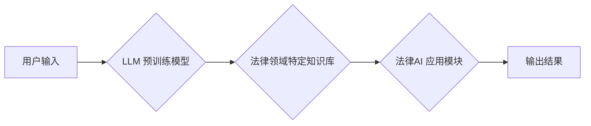

>  法律AI, LLM, 合同分析, 案例研究, 自然语言处理, 机器学习, 深度学习, 法律科技

## 1. 背景介绍

法律领域一直以来都以其复杂性、庞大的数据量和高度的专业性而著称。传统的法律工作流程往往耗时费力，依赖于人工阅读、分析和解读大量的法律文件，例如合同、判决书和法规。随着人工智能技术的快速发展，特别是大型语言模型（LLM）的出现，法律领域迎来了前所未有的变革机遇。

LLM 是一种强大的深度学习模型，能够理解和生成人类语言。其强大的文本处理能力赋予其在法律领域广泛的应用潜力，例如合同分析、法律研究、诉讼支持等。

## 2. 核心概念与联系

**2.1  LLM 简介**

大型语言模型（LLM）是一种基于Transformer架构的深度学习模型，通过训练海量文本数据，学习语言的语法、语义和上下文关系。其核心特点包括：

* **规模庞大:** LLM 通常拥有数十亿甚至数千亿个参数，使其能够捕捉复杂的语言模式。
* **多任务学习:** LLM 可以进行多种自然语言处理任务，例如文本分类、文本生成、机器翻译等。
* **上下文感知:** LLM 能够理解文本中的上下文关系，从而生成更准确、更自然的文本。

**2.2  法律AI 的应用场景**

法律AI 利用 LLM 的强大能力，在法律领域实现自动化和智能化，主要应用场景包括：

* **合同分析:** 自动识别合同条款、提取关键信息、识别潜在风险和违约可能性。
* **法律研究:** 自动搜索相关法律法规、判例案例，并进行文本摘要和分析。
* **诉讼支持:** 自动生成法律文件、分析证据材料、预测诉讼结果。

**2.3  LLM 在法律AI 中的架构**



**2.4  LLM 与传统法律工作流程的对比**

| 特征 | 传统法律工作流程 | 法律AI |
|---|---|---|
| **效率** | 低效，耗时费力 | 高效，自动化 |
| **准确性** | 容易出现人为错误 | 高准确率，减少误判 |
| **成本** | 高昂 | 降低成本，提高资源利用率 |
| **可扩展性** | 有限 | 可扩展，处理海量数据 |

## 3. 核心算法原理 & 具体操作步骤

**3.1  算法原理概述**

LLM 的核心算法原理是基于 Transformer 架构的深度学习模型。Transformer 模型通过自注意力机制（Self-Attention）和多头注意力机制（Multi-Head Attention）学习文本中的上下文关系，从而实现更准确的文本理解和生成。

**3.2  算法步骤详解**

1. **数据预处理:** 将法律文本数据进行清洗、格式化和分词等预处理操作。
2. **模型训练:** 使用预训练的 LLM 模型，在法律文本数据上进行微调训练，使其能够理解法律领域的特定语言和知识。
3. **模型评估:** 使用测试数据评估模型的性能，例如准确率、召回率和F1-score等指标。
4. **模型部署:** 将训练好的模型部署到实际应用场景中，例如合同分析系统或法律研究平台。

**3.3  算法优缺点**

**优点:**

* **强大的文本理解能力:** LLM 可以理解复杂的法律语言和上下文关系。
* **自动化处理:** 可以自动化完成合同分析、法律研究等任务，提高效率。
* **可扩展性:** 可以处理海量法律数据，满足大规模法律工作需求。

**缺点:**

* **数据依赖:** LLM 的性能依赖于训练数据的质量和数量。
* **解释性差:** LLM 的决策过程难以解释，缺乏透明度。
* **伦理风险:** LLM 可能存在偏见和歧视问题，需要谨慎使用。

**3.4  算法应用领域**

* **合同分析:** 自动识别合同条款、提取关键信息、识别潜在风险和违约可能性。
* **法律研究:** 自动搜索相关法律法规、判例案例，并进行文本摘要和分析。
* **诉讼支持:** 自动生成法律文件、分析证据材料、预测诉讼结果。
* **法律咨询:** 提供基于法律数据的智能化法律咨询服务。

## 4. 数学模型和公式 & 详细讲解 & 举例说明

**4.1  数学模型构建**

LLM 的数学模型通常基于 Transformer 架构，其核心是自注意力机制和多头注意力机制。

**4.2  公式推导过程**

* **自注意力机制:**

$$
Attention(Q, K, V) = \frac{exp(Q \cdot K^T / \sqrt{d_k})}{exp(Q \cdot K^T / \sqrt{d_k})} \cdot V
$$

其中：

* $Q$：查询矩阵
* $K$：键矩阵
* $V$：值矩阵
* $d_k$：键向量的维度

* **多头注意力机制:**

$$
MultiHead(Q, K, V) = Concat(head_1, head_2, ..., head_h) \cdot W_o
$$

其中：

* $head_i$：第 $i$ 个注意力头的输出
* $h$：注意力头的数量
* $W_o$：最终线性变换矩阵

**4.3  案例分析与讲解**

假设我们有一个法律文本数据，包含多个合同条款。使用 LLM 的自注意力机制，可以计算每个词与其他词之间的相关性，从而理解合同条款之间的语义关系。例如，如果一个词是“违约”，另一个词是“赔偿”，则它们之间的相关性较高，表明这两个词可能出现在同一个法律概念中。

## 5. 项目实践：代码实例和详细解释说明

**5.1  开发环境搭建**

* Python 3.7+
* PyTorch 或 TensorFlow
* NLTK 或 SpaCy

**5.2  源代码详细实现**

```python
import torch
from transformers import AutoModelForSequenceClassification, AutoTokenizer

# 加载预训练模型和词典
model_name = "bert-base-uncased"
tokenizer = AutoTokenizer.from_pretrained(model_name)
model = AutoModelForSequenceClassification.from_pretrained(model_name)

# 预处理文本数据
text = "This contract is valid for one year."
inputs = tokenizer(text, return_tensors="pt")

# 进行模型预测
outputs = model(**inputs)
predicted_class = torch.argmax(outputs.logits).item()

# 输出预测结果
print(f"Predicted class: {predicted_class}")
```

**5.3  代码解读与分析**

* 使用 Hugging Face Transformers 库加载预训练的 BERT 模型和词典。
* 对输入文本进行预处理，转换为模型可识别的格式。
* 使用模型进行预测，获取预测结果。
* 输出预测结果，例如合同的有效期。

**5.4  运行结果展示**

运行上述代码，可以得到预测结果，例如“Predicted class: 0”，表示文本属于某个特定的类别。

## 6. 实际应用场景

**6.1  合同分析系统**

法律AI 可以用于构建合同分析系统，自动识别合同条款、提取关键信息、识别潜在风险和违约可能性。例如，可以自动识别合同中的付款条款、交付期限和违约责任等关键信息，并提醒律师关注潜在的风险。

**6.2  法律研究平台**

法律AI 可以用于构建法律研究平台，自动搜索相关法律法规、判例案例，并进行文本摘要和分析。例如，可以自动搜索与特定法律问题相关的判例案例，并生成案例摘要和分析报告，帮助律师进行法律研究。

**6.3  诉讼支持工具**

法律AI 可以用于构建诉讼支持工具，自动生成法律文件、分析证据材料、预测诉讼结果。例如，可以自动生成起诉状、答辩状等法律文件，并分析证据材料的有效性，帮助律师进行诉讼准备。

**6.4  未来应用展望**

随着人工智能技术的不断发展，法律AI 将在未来发挥更广泛的作用，例如：

* **智能化法律咨询:** 提供基于法律数据的智能化法律咨询服务，帮助公众解决法律问题。
* **法律风险预测:** 利用机器学习算法预测法律风险，帮助企业规避法律风险。
* **法律合规自动化:** 自动化法律合规流程，提高企业合规性。

## 7. 工具和资源推荐

**7.1  学习资源推荐**

* **书籍:**
    * 《深度学习》
    * 《自然语言处理》
    * 《Transformer模型》
* **在线课程:**
    * Coursera: 深度学习
    * edX: 自然语言处理
    * fast.ai: 深度学习

**7.2  开发工具推荐**

* **Python:** 广泛使用的编程语言，用于开发法律AI应用程序。
* **PyTorch:** 深度学习框架，用于训练和部署 LLMs。
* **TensorFlow:** 深度学习框架，用于训练和部署 LLMs。
* **Hugging Face Transformers:** 用于加载和使用预训练的 LLMs 的库。

**7.3  相关论文推荐**

* **BERT: Pre-training of Deep Bidirectional Transformers for Language Understanding**
* **GPT-3: Language Models are Few-Shot Learners**
* **T5: Text-to-Text Transfer Transformer**

## 8. 总结：未来发展趋势与挑战

**8.1  研究成果总结**

法律AI 领域取得了显著的进展，LLM 在合同分析、法律研究和诉讼支持等方面展现出强大的应用潜力。

**8.2  未来发展趋势**

* **模型规模和性能提升:** LLMs 将继续朝着更大规模、更高性能的方向发展，能够处理更复杂、更精细的法律问题。
* **领域特定知识融入:** 将法律领域特定知识融入 LLMs，提高其在法律领域的理解和应用能力。
* **解释性增强:** 研究 LLMs 的决策过程，提高其解释性，增强用户对法律AI 的信任。

**8.3  面临的挑战**

* **数据质量和可用性:** LLMs 的性能依赖于高质量的法律数据，但法律数据往往难以获取和标注。
* **伦理风险:** LLMs 可能存在偏见和歧视问题，需要谨慎使用，并制定相应的伦理规范。
* **法律法规监管:** 法律AI 的应用需要遵守相关的法律法规，需要制定相应的监管政策。

**8.4  研究展望**

未来，法律AI 将继续朝着更智能化、更自动化、更可解释的方向发展，为法律行业带来革命性的变革。


## 9. 附录：常见问题与解答

**9.1  法律AI 是否会取代律师？**

法律AI 不会取代律师，而是会成为律师的强大助手，帮助律师提高效率、降低成本，并专注于更高级别的法律工作，例如战略决策和客户沟通。

**9.2  法律AI 的安全性如何保证？**

法律AI 的安全性需要通过多种措施来保证，例如数据加密、模型安全评估、伦理审查等。

**9.3  如何学习法律AI？**

学习法律AI 需要掌握人工智能、自然语言处理和法律知识。可以通过学习相关书籍、在线课程、参加培训等方式进行学习。


作者：禅与计算机程序设计艺术 / Zen and the Art of Computer Programming 
<end_of_turn>