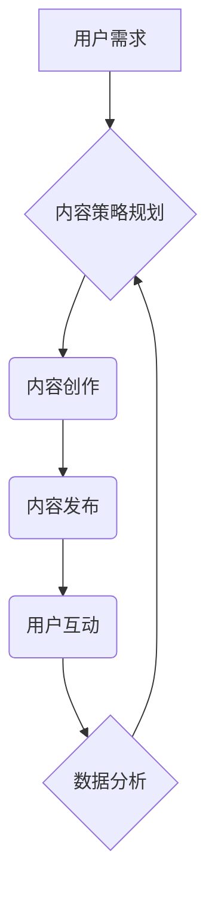

> 内容策略，注意力经济，用户体验，内容创作，数据分析，算法优化，影响力营销

## 1. 背景介绍

在当今信息爆炸的时代，人们每天面临着海量的资讯和信息流。如何才能在众多信息中脱颖而出，吸引用户的注意力，并传递有效的信息，成为了内容创作者和营销者面临的重大挑战。

注意力经济的概念应运而生，它强调了在信息过载的时代，人们对信息的筛选和选择能力越来越重要。注意力本身成为了稀缺资源，而能够有效获取和利用用户注意力的内容，则拥有着巨大的价值。

## 2. 核心概念与联系

**2.1 注意力经济**

注意力经济是指在信息时代，人们对信息的获取和处理能力有限，而注意力成为了稀缺资源的经济学理论。

**2.2 内容策略**

内容策略是指围绕目标受众，明确内容目标，并制定内容规划、创作、发布和推广的整体方案。

**2.3 联系**

注意力经济为内容策略提供了重要的理论基础。在注意力经济的框架下，内容策略需要更加注重用户体验，精准定位目标受众，并通过高质量、有价值的内容，吸引和留住用户的注意力。

**2.4 流程图**



## 3. 核心算法原理 & 具体操作步骤

**3.1 算法原理概述**

内容推荐算法是基于用户行为数据和内容特征，预测用户对特定内容的兴趣，并推荐相关内容的算法。常见的算法包括协同过滤、内容过滤和混合推荐算法。

**3.2 算法步骤详解**

1. **数据收集:** 收集用户行为数据，例如浏览记录、点击记录、评分记录等，以及内容特征数据，例如标题、关键词、类别等。
2. **数据预处理:** 对收集到的数据进行清洗、转换和特征提取，以便于算法训练和使用。
3. **模型训练:** 选择合适的推荐算法，并利用训练数据训练模型。
4. **模型评估:** 使用测试数据评估模型的性能，例如准确率、召回率、覆盖率等。
5. **模型部署:** 将训练好的模型部署到线上环境，并实时推荐内容给用户。

**3.3 算法优缺点**

* **协同过滤:**
    * 优点: 可以发现用户之间的潜在关联，推荐个性化内容。
    * 缺点: 数据稀疏性问题，冷启动问题。
* **内容过滤:**
    * 优点: 不需要用户行为数据，可以推荐基于内容相似性的内容。
    * 缺点: 难以捕捉用户隐性需求。
* **混合推荐:**
    * 优点: 结合协同过滤和内容过滤的优势，提高推荐效果。
    * 缺点: 模型复杂度较高，需要更多数据和计算资源。

**3.4 算法应用领域**

* **电商平台:** 商品推荐
* **视频网站:** 视频推荐
* **音乐平台:** 音乐推荐
* **社交媒体:** 内容推荐

## 4. 数学模型和公式 & 详细讲解 & 举例说明

**4.1 数学模型构建**

协同过滤算法的核心是计算用户之间和内容之间的相似度。常用的相似度度量方法包括余弦相似度和皮尔逊相关系数。

**4.2 公式推导过程**

* **余弦相似度:**

$$
\text{相似度} = \frac{\mathbf{u} \cdot \mathbf{v}}{\|\mathbf{u}\| \|\mathbf{v}\|}
$$

其中，$\mathbf{u}$ 和 $\mathbf{v}$ 分别表示两个向量的特征向量，$\cdot$ 表示点积，$\|\mathbf{u}\|$ 和 $\|\mathbf{v}\|$ 分别表示两个向量的模长。

* **皮尔逊相关系数:**

$$
\text{相似度} = \frac{\sum_{i=1}^{n}(u_i - \bar{u})(v_i - \bar{v})}{\sqrt{\sum_{i=1}^{n}(u_i - \bar{u})^2} \sqrt{\sum_{i=1}^{n}(v_i - \bar{v})^2}}
$$

其中，$u_i$ 和 $v_i$ 分别表示两个向量的第 $i$ 个元素，$\bar{u}$ 和 $\bar{v}$ 分别表示两个向量的平均值。

**4.3 案例分析与讲解**

假设有两个用户 A 和 B，他们对以下三部电影的评分如下：

| 电影 | 用户 A | 用户 B |
|---|---|---|
| 电影 1 | 5 | 4 |
| 电影 2 | 3 | 2 |
| 电影 3 | 4 | 5 |

我们可以使用余弦相似度或皮尔逊相关系数计算用户 A 和 B 之间的相似度。

## 5. 项目实践：代码实例和详细解释说明

**5.1 开发环境搭建**

* Python 3.x
* Pandas
* Scikit-learn
* TensorFlow/PyTorch

**5.2 源代码详细实现**

```python
import pandas as pd
from sklearn.metrics.pairwise import cosine_similarity

# 加载用户评分数据
ratings_data = pd.read_csv('ratings.csv')

# 计算用户之间的余弦相似度
user_similarity = cosine_similarity(ratings_data.T)

# 获取用户 A 和用户 B 之间的相似度
user_a_similarity = user_similarity[0]
user_b_similarity = user_similarity[1]

# 打印相似度
print(f'用户 A 和用户 B 的相似度: {user_a_similarity[1]}')
```

**5.3 代码解读与分析**

* 使用 Pandas 库加载用户评分数据。
* 使用 Scikit-learn 库的 `cosine_similarity` 函数计算用户之间的余弦相似度。
* 获取用户 A 和用户 B 的相似度值。

**5.4 运行结果展示**

运行代码后，会输出用户 A 和用户 B 的相似度值。

## 6. 实际应用场景

**6.1 内容推荐系统**

* 根据用户的浏览历史、点赞记录等行为数据，推荐用户可能感兴趣的内容。
* 个性化推荐，提高用户粘性和转化率。

**6.2 内容营销策略**

* 分析用户对不同类型内容的偏好，制定更精准的营销策略。
* 针对不同用户群体，创作不同类型的优质内容。

**6.3 社交媒体平台**

* 推荐用户可能关注的账号或话题。
* 提高用户活跃度和参与度。

**6.4 未来应用展望**

* 结合人工智能技术，例如自然语言处理和机器学习，实现更智能化的内容推荐和营销。
* 利用大数据分析，深入挖掘用户需求，提供更个性化和精准的内容服务。

## 7. 工具和资源推荐

**7.1 学习资源推荐**

* 书籍: 《推荐系统实践》
* 在线课程: Coursera 上的《推荐系统》课程

**7.2 开发工具推荐**

* Python
* Scikit-learn
* TensorFlow/PyTorch

**7.3 相关论文推荐**

* 《Collaborative Filtering for Implicit Feedback Datasets》
* 《Matrix Factorization Techniques for Recommender Systems》

## 8. 总结：未来发展趋势与挑战

**8.1 研究成果总结**

注意力经济与内容策略规划与实践的研究取得了显著成果，为内容创作者和营销者提供了新的思路和方法。

**8.2 未来发展趋势**

* 人工智能技术将进一步推动内容推荐和营销的智能化发展。
* 大数据分析将帮助我们更深入地了解用户需求，提供更精准的内容服务。
* 内容形式将更加多样化，例如视频、音频、虚拟现实等。

**8.3 面临的挑战**

* 数据隐私保护问题
* 内容质量控制问题
* 用户注意力持续下降的问题

**8.4 研究展望**

未来，我们需要继续探索更有效的注意力获取和留存方法，并开发更智能、更个性化的内容推荐和营销系统。

## 9. 附录：常见问题与解答

**9.1 如何提高内容的吸引力？**

* 了解目标受众的兴趣和需求。
* 使用高质量的图片、视频和音频素材。
* 撰写简洁、易懂、有价值的内容。
* 使用引人入胜的标题和副标题。

**9.2 如何评估内容策略的有效性？**

* 跟踪用户行为数据，例如浏览量、点击率、停留时间等。
* 进行用户调查和问卷调查，了解用户对内容的反馈。
* 分析内容的传播效果，例如分享量、评论量等。

**9.3 如何应对用户注意力持续下降的问题？**

* 创作更短、更精炼的内容。
* 使用更具互动性的内容形式，例如问答、投票等。
* 定期更新内容，保持用户新鲜感。


作者：禅与计算机程序设计艺术 / Zen and the Art of Computer Programming 
<end_of_turn>