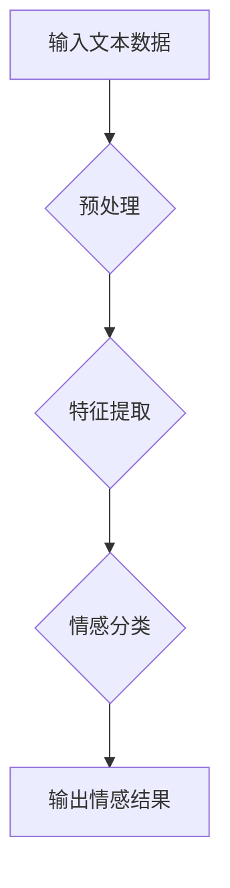

> 用户情感分析，自然语言处理，机器学习，深度学习，情感分类，文本挖掘，AI服务改进

## 1. 背景介绍

在当今数据爆炸的时代，用户生成的内容（UGC）如评论、帖子、社交媒体对话等，为企业提供了宝贵的洞察用户需求、态度和体验的窗口。然而，这些文本数据往往是海量且结构化的，直接分析难以获取有效信息。用户情感分析（User Sentiment Analysis，简称：SA）应运而生，它利用自然语言处理（NLP）和机器学习（ML）技术，从文本数据中识别和理解用户的情感倾向，为企业提供数据驱动的决策支持。

用户情感分析在各个领域都具有广泛的应用价值：

* **市场营销:** 了解用户对产品、服务和品牌的评价，及时调整营销策略，提升客户满意度。
* **客户服务:** 自动识别客户反馈中的问题和情绪，快速响应并提供个性化服务，提升客户体验。
* **品牌管理:** 监测用户对品牌形象的感知，及时发现潜在危机，维护品牌声誉。
* **舆情监测:** 分析用户对事件、话题和人物的评价，了解社会舆论走向，为决策提供参考。

## 2. 核心概念与联系

用户情感分析的核心是识别和分类文本中的情感倾向。情感倾向可以分为正面、负面和中性三种类型。

**2.1 情感分析流程**



**2.2 核心概念**

* **自然语言处理 (NLP):**  处理和理解人类语言的技术，包括文本分析、语音识别、机器翻译等。
* **机器学习 (ML):**  让计算机从数据中学习，并根据学习到的知识进行预测或分类的技术。
* **深度学习 (DL):**  一种更高级的机器学习方法，利用多层神经网络模拟人类大脑的学习过程。
* **情感词典:**  包含情感倾向的词语及其对应的情感标签的词典。
* **情感分类模型:**  用于识别文本情感倾向的机器学习模型。

## 3. 核心算法原理 & 具体操作步骤

### 3.1  算法原理概述

用户情感分析算法主要分为以下几种类型：

* **基于规则的方法:**  根据预先定义的规则和情感词典，对文本进行情感分类。
* **基于机器学习的方法:**  利用机器学习算法，从训练数据中学习情感分类模型。
* **基于深度学习的方法:**  利用深度学习算法，构建更复杂的模型，提高情感分类的准确率。

### 3.2  算法步骤详解

以基于机器学习的方法为例，其具体操作步骤如下：

1. **数据收集:**  收集包含文本和情感标签的训练数据。
2. **数据预处理:**  对文本数据进行清洗、去停用词、分词等预处理操作，以便于模型训练。
3. **特征提取:**  从预处理后的文本数据中提取特征，例如词频、词向量、情感词得分等。
4. **模型训练:**  利用机器学习算法，例如支持向量机（SVM）、朴素贝叶斯（NB）、随机森林（RF）等，训练情感分类模型。
5. **模型评估:**  使用测试数据评估模型的性能，例如准确率、召回率、F1-score等。
6. **模型部署:**  将训练好的模型部署到实际应用场景中，用于对新文本数据进行情感分类。

### 3.3  算法优缺点

**基于机器学习的方法**

* **优点:**  能够自动学习情感分类规则，无需人工标注大量数据。
* **缺点:**  模型训练需要大量数据，对数据质量要求较高。

**基于深度学习的方法**

* **优点:**  能够学习更复杂的特征，提高情感分类的准确率。
* **缺点:**  模型训练需要更多计算资源，对数据量要求更高。

### 3.4  算法应用领域

用户情感分析算法广泛应用于以下领域：

* **电商:**  分析用户对商品的评价，改进产品设计和营销策略。
* **金融:**  分析用户对金融产品的评价，提升客户服务和风险管理。
* **医疗:**  分析患者对医疗服务的评价，改进医疗服务质量和患者体验。
* **教育:**  分析学生对课程的评价，改进教学方法和学习效果。

## 4. 数学模型和公式 & 详细讲解 & 举例说明

### 4.1  数学模型构建

用户情感分析模型通常采用分类模型，例如逻辑回归、支持向量机等。这些模型的目标是将文本数据映射到情感类别，例如正面、负面或中性。

**4.1.1 逻辑回归模型**

逻辑回归模型是一种常用的二分类模型，其输出是一个概率值，表示文本属于正向情感的概率。

**公式:**

$$
P(y=1|x) = \frac{1}{1 + e^{-(w^T x + b)}}
$$

其中：

* $P(y=1|x)$ 是文本属于正向情感的概率。
* $x$ 是文本特征向量。
* $w$ 是模型参数向量。
* $b$ 是模型偏置项。

**4.1.2 支持向量机模型**

支持向量机模型试图找到一个最佳的分隔超平面，将文本数据分成不同的情感类别。

**公式:**

$$
\max_{w,b} \frac{1}{2} ||w||^2 - C \sum_{i=1}^{n} \xi_i
$$

其中：

* $w$ 是模型参数向量。
* $b$ 是模型偏置项。
* $C$ 是惩罚参数。
* $\xi_i$ 是松弛变量，用于容忍分类错误。

### 4.2  公式推导过程

逻辑回归模型和支持向量机模型的公式推导过程较为复杂，需要涉及到概率论、线性代数等数学知识。

### 4.3  案例分析与讲解

假设我们有一个文本数据集，包含以下文本和情感标签：

* 文本1: “这个电影太棒了！”，情感标签: 正向
* 文本2: “这部电影很无聊。”，情感标签: 负向
* 文本3: “电影还可以。”，情感标签: 中性

我们可以使用逻辑回归模型或支持向量机模型对这些文本进行情感分类。模型训练完成后，我们可以使用新的文本进行预测，例如：

* 文本4: “我非常喜欢这部电影。”，模型预测: 正向

## 5. 项目实践：代码实例和详细解释说明

### 5.1  开发环境搭建

用户情感分析项目可以使用Python语言进行开发。需要安装以下软件包：

* NLTK: 自然语言处理工具包
* Scikit-learn: 机器学习库
* TensorFlow或PyTorch: 深度学习库

### 5.2  源代码详细实现

以下是一个使用Scikit-learn库进行用户情感分析的简单代码示例：

```python
import nltk
from sklearn.feature_extraction.text import TfidfVectorizer
from sklearn.linear_model import LogisticRegression
from sklearn.model_selection import train_test_split

# 数据集
texts = [
    "这个电影太棒了！",
    "这部电影很无聊。",
    "电影还可以。",
    "我非常喜欢这部电影。",
    "这部电影让我很失望。"
]
labels = [1, 0, 0, 1, 0]

# 数据预处理
nltk.download('stopwords')
stop_words = nltk.corpus.stopwords.words('english')
texts = [
    ' '.join([word for word in nltk.word_tokenize(text) if word.lower() not in stop_words])
    for text in texts
]

# 特征提取
vectorizer = TfidfVectorizer()
features = vectorizer.fit_transform(texts)

# 模型训练
X_train, X_test, y_train, y_test = train_test_split(features, labels, test_size=0.2)
model = LogisticRegression()
model.fit(X_train, y_train)

# 模型评估
accuracy = model.score(X_test, y_test)
print(f"模型准确率: {accuracy}")

# 预测新文本
new_text = "我非常喜欢这部电影"
new_features = vectorizer.transform([new_text])
prediction = model.predict(new_features)
print(f"新文本情感预测: {prediction}")
```

### 5.3  代码解读与分析

这段代码首先使用NLTK库对文本数据进行预处理，例如去除停用词。然后使用TfidfVectorizer将文本数据转换为特征向量。接着使用Scikit-learn库中的LogisticRegression模型训练情感分类模型。最后使用测试数据评估模型性能，并对新文本进行情感预测。

### 5.4  运行结果展示

运行这段代码后，会输出模型的准确率和对新文本的情感预测结果。

## 6. 实际应用场景

### 6.1  电商平台

电商平台可以利用用户情感分析技术，分析用户对商品的评价，了解用户对产品功能、设计、价格等方面的满意度。根据分析结果，电商平台可以改进产品设计，优化营销策略，提升用户体验。

### 6.2  社交媒体平台

社交媒体平台可以利用用户情感分析技术，监测用户对平台内容、品牌和事件的情感倾向。例如，可以分析用户对新发布的广告的评价，及时调整广告内容和投放策略。

### 6.3  客户服务

客户服务部门可以利用用户情感分析技术，自动识别客户反馈中的问题和情绪。例如，可以识别客户投诉、抱怨或赞扬的文本，并根据情感倾向，提供相应的服务和解决方案。

### 6.4  未来应用展望

随着人工智能技术的不断发展，用户情感分析技术将有更广泛的应用场景：

* **个性化推荐:**  根据用户的喜好和情感倾向，提供更精准的商品、服务和内容推荐。
* **情感机器人:**  开发能够理解和回应用户情感的机器人，提供更人性化的服务体验。
* **医疗诊断:**  分析患者的语言表达，识别潜在的疾病和心理问题，辅助医生进行诊断和治疗。

## 7. 工具和资源推荐

### 7.1  学习资源推荐

* **书籍:**
    * 自然语言处理与情感分析
    * 深度学习
* **在线课程:**
    * Coursera: 自然语言处理
    * edX: 深度学习
* **博客:**
    * NLP Progress
    * Machine Learning Mastery

### 7.2  开发工具推荐

* **Python:**  Python语言是用户情感分析开发的常用语言，拥有丰富的库和工具。
* **NLTK:**  自然语言处理工具包，提供文本预处理、词性标注、情感分析等功能。
* **Scikit-learn:**  机器学习库，提供各种分类算法和评估指标。
* **TensorFlow或PyTorch:**  深度学习库，用于构建更复杂的模型。

### 7.3  相关论文推荐

* **Sentiment Analysis and Opinion Mining**
* **Deep Learning for Sentiment Analysis**
* **A Survey of Transfer Learning for Sentiment Analysis**

## 8. 总结：未来发展趋势与挑战

### 8.1  研究成果总结

用户情感分析技术近年来取得了显著进展，模型准确率不断提高，应用场景也越来越广泛。

### 8.2  未来发展趋势

* **多模态情感分析:**  结合文本、图像、音频等多模态数据进行情感分析，提高分析的准确性和全面性。
* **跨语言情感分析:**  实现不同语言之间的情感分析，打破语言障碍，拓展应用范围。
* **解释性情感分析:**  解释模型的决策过程，提高模型的可解释性和信任度。

### 8.3  面临的挑战

* **数据标注问题:**  高质量的标注数据是训练情感分析模型的关键，但数据标注成本高，效率低。
* **情感表达的多