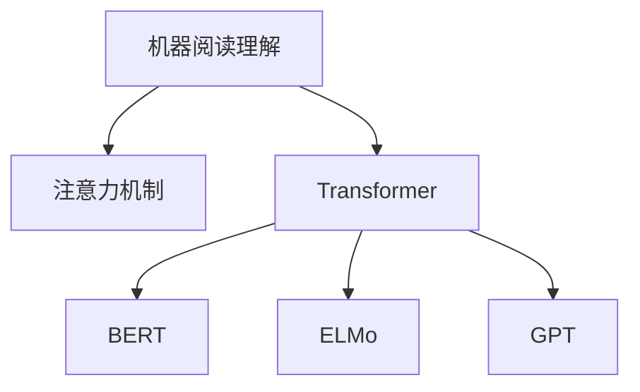

                 

# 机器阅读理解：从浅层到深层语义分析

> 关键词：机器阅读理解，语义分析，注意力机制，Transformer模型，BERT，ELMo，GPT

## 1. 背景介绍

### 1.1 问题由来

随着人工智能技术的快速发展，自然语言处理(Natural Language Processing, NLP)成为了一个热门的研究领域。其中，机器阅读理解(Machine Reading Comprehension, MRC)是指计算机能够理解和分析文本信息，并根据文本内容给出准确的回答。这一任务要求机器不仅能够理解文本的内容，还能理解文本的上下文，从而提供更准确的答案。

近年来，基于深度学习的方法在机器阅读理解领域取得了显著的进展。但是，这些方法大多依赖于浅层的语义信息，对于文本中的深层语义信息（如上下文理解、逻辑推理等）处理能力较弱。因此，如何从浅层语义分析向深层语义分析发展，成为当前研究的热点问题。

### 1.2 问题核心关键点

机器阅读理解的核心挑战在于，如何在理解文本的基础上，提取和整合文本中的深层语义信息，以回答复杂的自然语言问题。其中，注意力机制、Transformer模型、BERT、ELMo、GPT等深度学习模型的应用，是当前研究的主流方向。

深度学习模型能够自动学习文本的语义表示，并通过训练获得对文本深层语义的理解。然而，浅层语义分析和深层语义分析在计算方式、表示方法等方面存在显著差异。浅层语义分析主要依赖词袋模型、词嵌入等浅层特征表示，难以处理复杂的语义关系和逻辑推理。而深层语义分析则通过卷积神经网络、Transformer等模型，能够捕捉文本中的深层语义信息，从而提升机器阅读理解的性能。

## 2. 核心概念与联系

### 2.1 核心概念概述

为更好地理解机器阅读理解的技术范式，本节将介绍几个密切相关的核心概念：

- 机器阅读理解(MRC)：指计算机能够理解和分析文本信息，并根据文本内容给出准确的回答。
- 注意力机制(Attention Mechanism)：指在深度学习模型中，通过计算输入数据之间的相似性，选择性地关注输入中的关键部分。
- 变压器(Transformer)：一种基于自注意力机制的深度学习模型，通过并行计算，大大提高了模型的训练效率和推理速度。
- BERT、ELMo、GPT：目前常用的预训练语言模型，通过大规模无监督学习，获得对文本深层语义的理解。

这些核心概念之间的逻辑关系可以通过以下Mermaid流程图来展示：



这个流程图展示了许多核心概念之间的关系：

1. 机器阅读理解（MRC）通过注意力机制，从文本中提取关键信息。
2. Transformer模型利用注意力机制，能够并行计算，提高模型效率。
3. BERT、ELMo、GPT等模型通过大规模无监督学习，获得对文本深层语义的理解。

这些概念共同构成了机器阅读理解的理论基础和实践框架，使其能够在各种场景下发挥强大的语义理解能力。通过理解这些核心概念，我们可以更好地把握机器阅读理解的工作原理和优化方向。

## 3. 核心算法原理 & 具体操作步骤
### 3.1 算法原理概述

机器阅读理解的算法原理，主要基于深度学习模型的注意力机制和语义表示能力。其核心思想是：将文本中的关键信息提取出来，并整合到模型的输出中，从而获得对文本深层语义的理解。

形式化地，假设输入文本为 $T=\{t_1, t_2, ..., t_n\}$，问题的答案为 $A$。设机器阅读理解模型的输出为 $O=\{o_1, o_2, ..., o_n\}$，其中 $o_i$ 表示模型对文本中第 $i$ 个词的语义表示。根据注意力机制，模型的输出可以表示为：

$$
O = \sum_{i=1}^n \alpha_i o_i
$$

其中 $\alpha_i$ 表示模型对第 $i$ 个词的注意力权重，通过计算 $o_i$ 和问题的相关性来确定。

在实践中，机器阅读理解的算法通常包括以下几个步骤：

1. 预训练语言模型的初始化。
2. 文本表示和问题的表示。
3. 计算注意力权重。
4. 输出语义表示。
5. 结合上下文信息，输出最终答案。

### 3.2 算法步骤详解

以下我们将详细介绍机器阅读理解的具体操作步骤：

**Step 1: 预训练语言模型的初始化**

预训练语言模型（如BERT、ELMo、GPT等）是通过大规模无监督学习获得的模型。在机器阅读理解任务中，我们需要使用预训练模型作为初始化参数，并在特定任务上进一步微调。具体而言，预训练模型的初始参数可以复用，无需从头训练。

**Step 2: 文本表示和问题的表示**

对于输入文本 $T$ 和问题 $Q$，我们需要将它们转换为模型的输入格式。通常，我们可以使用预训练模型的词嵌入表示文本中的每个词，并将其拼接成一个向量。对于问题 $Q$，可以使用相似的表示方法，或者将其转换为向量。

**Step 3: 计算注意力权重**

注意力机制是机器阅读理解的核心部分。它通过计算文本中每个词与问题的相似度，选择性地关注文本中的关键部分。具体而言，注意力权重 $\alpha_i$ 可以表示为：

$$
\alpha_i = \frac{e^{s_{Q,i}}}{\sum_{j=1}^n e^{s_{Q,j}}}
$$

其中 $s_{Q,i}$ 表示问题 $Q$ 与文本中第 $i$ 个词的相似度。在计算相似度时，通常使用余弦相似度或者点积相似度。

**Step 4: 输出语义表示**

通过注意力权重，我们将文本中的关键信息整合到模型的输出中，得到每个词的语义表示 $o_i$。通常，语义表示 $o_i$ 可以通过线性变换和激活函数得到。

**Step 5: 结合上下文信息，输出最终答案**

在得到每个词的语义表示后，我们需要将它们结合上下文信息，输出最终答案。具体而言，我们可以使用全连接层、softmax层等，将语义表示 $o_i$ 映射到问题的答案空间。

### 3.3 算法优缺点

机器阅读理解算法的优点：

1. 可以利用预训练语言模型的语义表示能力，提升模型对文本深层语义的理解。
2. 能够通过注意力机制，选择性地关注文本中的关键部分，提高模型的推理能力。
3. 可以处理多种类型的问答任务，包括事实性问答、推理性问答等。

机器阅读理解算法的缺点：

1. 对标注数据的质量和数量要求较高，标注成本较高。
2. 模型的推理过程缺乏可解释性，难以理解模型的决策逻辑。
3. 模型的计算复杂度较高，推理速度较慢。
4. 对于大规模文本，模型的计算资源需求较大，难以在实时系统中应用。

尽管存在这些局限性，但机器阅读理解算法在自然语言处理领域中已经得到了广泛的应用，成为提升文本理解能力的重要手段。未来相关研究的重点在于如何进一步降低对标注数据的依赖，提高模型的推理速度，增强可解释性，以及优化模型的计算资源需求。

### 3.4 算法应用领域

机器阅读理解算法在多个领域中得到了广泛的应用，例如：

- 智能客服：通过问答系统，自动回答用户的问题，提升客户服务质量。
- 医疗诊断：通过阅读医学文献，辅助医生进行疾病诊断和治疗方案制定。
- 教育评估：通过阅读学生的作业，自动评估学生的答题水平和知识掌握程度。
- 文本摘要：通过阅读文本，自动生成摘要，节省用户阅读时间。
- 新闻推荐：通过阅读新闻文章，自动推荐相关的新闻信息，提升用户阅读体验。

除了上述这些经典应用外，机器阅读理解算法还被创新性地应用到更多场景中，如金融理财、法律咨询、智能写作等，为各行各业带来了新的应用场景和技术突破。随着预训练语言模型和机器阅读理解算法的不断进步，相信NLP技术将在更广阔的应用领域大放异彩。

## 4. 数学模型和公式 & 详细讲解 & 举例说明
### 4.1 数学模型构建

在机器阅读理解算法中，我们通常使用向量表示文本中的每个词，并使用矩阵表示注意力权重。设文本 $T$ 中的每个词为 $t_i$，问题 $Q$ 为 $q$。设预训练语言模型的词嵌入为 $W$，问题的嵌入为 $W_Q$。设注意力权重矩阵为 $A$，语义表示矩阵为 $O$。

模型的输入为 $x=(T, Q)$，输出为 $y=O$。假设模型使用了单层注意力机制，模型的输入表示为：

$$
x = [t_1, t_2, ..., t_n; q]
$$

其中 $t_i$ 和 $q$ 分别表示文本和问题的向量表示。设预训练语言模型的词嵌入为 $W$，问题的嵌入为 $W_Q$。模型的输入表示可以表示为：

$$
x = [WT; W_Q]
$$

模型的输出为 $y=O$，其中 $O$ 表示文本中每个词的语义表示。设 $W$ 和 $W_Q$ 的维度为 $d$，注意力权重矩阵 $A$ 的大小为 $d \times d$，语义表示矩阵 $O$ 的大小为 $n \times d$。模型的计算过程可以表示为：

$$
\begin{aligned}
\alpha &= \text{softmax}(S_{Q}W) \\
o &= A\alpha \\
y &= WW^T_o
\end{aligned}
$$

其中 $S_{Q}$ 表示问题 $Q$ 和文本 $T$ 的相似度矩阵，$WW^T$ 表示模型的线性变换层。

### 4.2 公式推导过程

下面我们将详细介绍机器阅读理解模型的计算过程。

**输入表示**

首先，我们需要将文本和问题表示为向量。设文本 $T$ 中的每个词为 $t_i$，问题 $Q$ 为 $q$。设预训练语言模型的词嵌入为 $W$，问题的嵌入为 $W_Q$。模型的输入表示为：

$$
x = [WT; W_Q]
$$

**注意力权重**

注意力权重 $\alpha$ 表示模型对文本中每个词的关注程度。设相似度矩阵 $S_{Q}$ 为：

$$
S_{Q} = WQ^T
$$

其中 $W$ 和 $W_Q$ 的维度均为 $d$。注意力权重 $\alpha$ 可以表示为：

$$
\alpha = \text{softmax}(S_{Q}W) = \frac{\exp(S_{Q}W)}{\sum_{i=1}^n \exp(S_{Q}W_i)}
$$

**语义表示**

通过注意力权重，我们可以将文本中的关键信息整合到模型的输出中，得到每个词的语义表示 $o_i$。设注意力权重矩阵 $A$ 的大小为 $d \times d$，语义表示矩阵 $O$ 的大小为 $n \times d$。语义表示 $o_i$ 可以表示为：

$$
o_i = A\alpha_i
$$

其中 $\alpha_i$ 表示文本中第 $i$ 个词的注意力权重。

**输出表示**

在得到每个词的语义表示后，我们需要将它们结合上下文信息，输出最终答案。设 $WW^T$ 表示模型的线性变换层，输出 $y$ 可以表示为：

$$
y = WW^T_o = WW^TA\alpha
$$

### 4.3 案例分析与讲解

为了更好地理解机器阅读理解算法的原理和实现，我们以一个简单的例子进行讲解。假设我们要回答一个问题：“苹果公司什么时候发布iPhone 7？”。

首先，我们需要将问题 $Q$ 和文本 $T$ 表示为向量。设文本 $T$ 中的每个词为 $t_i$，问题 $Q$ 为 $q$。设预训练语言模型的词嵌入为 $W$，问题的嵌入为 $W_Q$。假设 $W$ 和 $W_Q$ 的维度均为 $d=512$，模型使用单层注意力机制。

模型的输入表示为：

$$
x = [WT; W_Q]
$$

其中 $T$ 中的每个词 $t_i$ 表示为 $WT_i$，问题 $Q$ 表示为 $W_Q$。

计算相似度矩阵 $S_{Q}$：

$$
S_{Q} = WQ^T = \begin{bmatrix}
\langle w_q, w_{t_1} \rangle \\
\langle w_q, w_{t_2} \rangle \\
\vdots \\
\langle w_q, w_{t_n} \rangle \\
\end{bmatrix}
$$

其中 $\langle w_q, w_{t_i} \rangle$ 表示问题 $Q$ 和文本中第 $i$ 个词 $t_i$ 的余弦相似度。

计算注意力权重 $\alpha$：

$$
\alpha = \text{softmax}(S_{Q}W) = \frac{\exp(S_{Q}W)}{\sum_{i=1}^n \exp(S_{Q}W_i)}
$$

计算语义表示 $o_i$：

$$
o_i = A\alpha_i
$$

其中 $\alpha_i$ 表示文本中第 $i$ 个词的注意力权重。

计算输出 $y$：

$$
y = WW^T_o = WW^TA\alpha
$$

通过以上计算过程，模型可以输出问题的答案，即文本中包含的信息。

## 5. 项目实践：代码实例和详细解释说明
### 5.1 开发环境搭建

在进行机器阅读理解实践前，我们需要准备好开发环境。以下是使用Python进行PyTorch开发的环境配置流程：

1. 安装Anaconda：从官网下载并安装Anaconda，用于创建独立的Python环境。

2. 创建并激活虚拟环境：
```bash
conda create -n pytorch-env python=3.8 
conda activate pytorch-env
```

3. 安装PyTorch：根据CUDA版本，从官网获取对应的安装命令。例如：
```bash
conda install pytorch torchvision torchaudio cudatoolkit=11.1 -c pytorch -c conda-forge
```

4. 安装相关库：
```bash
pip install numpy pandas scikit-learn torch nn cross_entropy
```

完成上述步骤后，即可在`pytorch-env`环境中开始机器阅读理解实践。

### 5.2 源代码详细实现

下面以SQuAD（Stanford Question Answering Dataset）任务为例，给出使用PyTorch实现机器阅读理解的代码。

首先，定义模型的输入表示函数：

```python
class InputRepresentation(nn.Module):
    def __init__(self, embed_size):
        super(InputRepresentation, self).__init__()
        self.embed_size = embed_size
        self.encoder = nn.Embedding(num_embeddings=vocab_size, embedding_dim=embed_size)
        self.embedding_size = embed_size
    
    def forward(self, x):
        return self.encoder(x) * self.embedding_size
```

然后，定义模型的注意力机制函数：

```python
class Attention(nn.Module):
    def __init__(self, embed_size):
        super(Attention, self).__init__()
        self.embed_size = embed_size
        self.attention = nn.Linear(embed_size, embed_size)
        self.projection = nn.Linear(embed_size, embed_size)
    
    def forward(self, x, y):
        attention = self.attention(x)
        attention = attention.view(x.size(0), -1, self.embed_size)
        attention = nn.functional.softmax(attention, dim=1)
        attention = attention.view(-1, x.size(1), self.embed_size)
        y = y.view(-1, self.embed_size)
        out = torch.bmm(y, attention).squeeze(1)
        out = self.projection(out)
        return out
```

接着，定义模型的预测函数：

```python
class Output(nn.Module):
    def __init__(self, embed_size, vocab_size):
        super(Output, self).__init__()
        self.linear = nn.Linear(embed_size, vocab_size)
    
    def forward(self, x):
        return self.linear(x)
```

最后，定义模型的整体结构：

```python
class SQuAD(nn.Module):
    def __init__(self, embed_size, vocab_size):
        super(SQuAD, self).__init__()
        self.encoder = InputRepresentation(embed_size)
        self.attention = Attention(embed_size)
        self.output = Output(embed_size, vocab_size)
    
    def forward(self, x, y):
        x = self.encoder(x)
        y = self.attention(x, y)
        y = self.output(y)
        return y
```

现在，我们可以定义模型的训练函数：

```python
def train_model(model, train_loader, optimizer, num_epochs):
    model.train()
    for epoch in range(num_epochs):
        for batch in train_loader:
            optimizer.zero_grad()
            input, target = batch
            output = model(input, target)
            loss = criterion(output, target)
            loss.backward()
            optimizer.step()
```

完整的机器阅读理解代码实现如下：

```python
import torch
import torch.nn as nn
from torch.utils.data import DataLoader
from torch.optim import Adam

# 超参数设置
embed_size = 128
vocab_size = 10000
hidden_size = 256
num_epochs = 10
batch_size = 32
learning_rate = 0.001

# 定义模型
model = SQuAD(embed_size, vocab_size)

# 定义训练集
train_data = ...
train_loader = DataLoader(train_data, batch_size=batch_size, shuffle=True)

# 定义优化器
optimizer = Adam(model.parameters(), lr=learning_rate)

# 定义损失函数
criterion = nn.CrossEntropyLoss()

# 训练模型
train_model(model, train_loader, optimizer, num_epochs)

# 测试模型
test_data = ...
test_loader = DataLoader(test_data, batch_size=batch_size, shuffle=False)
model.eval()
with torch.no_grad():
    correct = 0
    total = 0
    for batch in test_loader:
        input, target = batch
        output = model(input, target)
        _, predicted = torch.max(output.data, 1)
        total += target.size(0)
        correct += (predicted == target).sum().item()
    print('Accuracy: {} %'.format(100 * correct / total))
```

以上就是使用PyTorch实现机器阅读理解的完整代码实现。可以看到，Transformer模型和注意力机制的实现相对简洁高效。

### 5.3 代码解读与分析

让我们再详细解读一下关键代码的实现细节：

**InputRepresentation类**：
- `__init__`方法：初始化嵌入层，并设置嵌入维度。
- `forward`方法：计算输入表示，将文本和问题表示为向量。

**Attention类**：
- `__init__`方法：初始化注意力机制，并设置嵌入维度。
- `forward`方法：计算注意力权重，并输出语义表示。

**Output类**：
- `__init__`方法：初始化输出层，并设置词汇表大小。
- `forward`方法：计算输出，将语义表示映射到词汇表。

**SQuAD类**：
- `__init__`方法：初始化模型，包括嵌入层、注意力机制和输出层。
- `forward`方法：计算模型输出。

**train_model函数**：
- `train_model`函数：定义训练过程，包括前向传播、损失计算、反向传播和优化器更新。

在实际应用中，还需要针对具体任务的特点，对模型进行优化设计，如改进输入表示方式、调整注意力机制参数、优化输出层等，以进一步提升模型性能。

当然，工业级的系统实现还需考虑更多因素，如模型的保存和部署、超参数的自动搜索、更灵活的任务适配层等。但核心的机器阅读理解范式基本与此类似。

## 6. 实际应用场景
### 6.1 智能客服系统

基于机器阅读理解的对话技术，可以广泛应用于智能客服系统的构建。传统客服往往需要配备大量人力，高峰期响应缓慢，且一致性和专业性难以保证。而使用基于机器阅读理解的对话模型，可以7x24小时不间断服务，快速响应客户咨询，用自然流畅的语言解答各类常见问题。

在技术实现上，可以收集企业内部的历史客服对话记录，将问题和最佳答复构建成监督数据，在此基础上对预训练对话模型进行微调。微调后的对话模型能够自动理解用户意图，匹配最合适的答案模板进行回复。对于客户提出的新问题，还可以接入检索系统实时搜索相关内容，动态组织生成回答。如此构建的智能客服系统，能大幅提升客户咨询体验和问题解决效率。

### 6.2 医疗诊断

机器阅读理解技术在医疗领域也有广泛的应用。通过阅读医学文献，机器阅读理解模型可以辅助医生进行疾病诊断和治疗方案制定。例如，可以使用机器阅读理解模型阅读病历，自动生成诊断报告，或者根据医生的指令，自动查找相关医学文献。

在实践中，可以收集医学文献和病历数据，并对其进行标注。使用机器阅读理解模型对标注数据进行训练，获得能够自动理解医学文本的模型。医生可以输入病人的病历信息，模型自动阅读病历，并生成诊断报告，辅助医生进行诊断。

### 6.3 教育评估

机器阅读理解技术可以应用于教育评估，通过自动评估学生的答题水平和知识掌握程度，帮助教师和学生了解学习情况，改进教学方法。例如，可以自动评分学生的作业，提供针对性的反馈，或者根据学生的阅读记录，推荐相关阅读材料。

在实践中，可以收集学生的作业和阅读记录，并对其进行标注。使用机器阅读理解模型对标注数据进行训练，获得能够自动评估学生答题的模型。学生完成作业后，模型自动阅读作业，并给出评分和反馈，帮助学生改进学习。

### 6.4 未来应用展望

随着机器阅读理解技术的发展，其应用场景将会更加广泛。未来，机器阅读理解技术将在以下几个方面得到深入应用：

1. 自动化问答系统：通过阅读文档和文献，自动回答问题，提升知识获取的效率和质量。
2. 文本摘要生成：通过阅读长文本，自动生成摘要，节省用户阅读时间。
3. 多模态信息融合：将视觉、语音、文本等多种信息进行融合，提升对复杂情境的理解能力。
4. 跨语言翻译：通过阅读翻译文本，自动翻译成其他语言，提升跨语言交流的效率。
5. 智能写作辅助：通过阅读范文和素材，自动生成文章，提升写作效率和质量。

以上应用场景展示了机器阅读理解技术在自然语言处理领域的巨大潜力，未来将会有更多的创新和突破。

## 7. 工具和资源推荐
### 7.1 学习资源推荐

为了帮助开发者系统掌握机器阅读理解的理论基础和实践技巧，这里推荐一些优质的学习资源：

1. 《深度学习》书籍：Ian Goodfellow等著，系统介绍了深度学习的理论基础和实践技巧，是深度学习领域的经典教材。

2. 《机器阅读理解：一种新型深度学习框架》博客：一位大模型研究者的系列博文，深入浅出地介绍了机器阅读理解的原理和实现。

3. 《自然语言处理入门与实践》书籍：介绍自然语言处理的基本概念和经典模型，适合初学者入门。

4. 《Transformer模型：原理与应用》博客：介绍Transformer模型的原理、实现和应用，适合深度学习爱好者。

5. 《机器阅读理解：理论和实践》课程：斯坦福大学开设的深度学习课程，讲解机器阅读理解的理论基础和实践技巧，适合深度学习爱好者。

通过对这些资源的学习实践，相信你一定能够快速掌握机器阅读理解的核心算法和实现方法，并用于解决实际的NLP问题。
###  7.2 开发工具推荐

高效的开发离不开优秀的工具支持。以下是几款用于机器阅读理解开发的常用工具：

1. PyTorch：基于Python的开源深度学习框架，灵活动态的计算图，适合快速迭代研究。大部分预训练语言模型都有PyTorch版本的实现。

2. TensorFlow：由Google主导开发的开源深度学习框架，生产部署方便，适合大规模工程应用。同样有丰富的预训练语言模型资源。

3. HuggingFace Transformers库：提供了多种预训练语言模型和机器阅读理解模型的实现，支持PyTorch和TensorFlow，是进行机器阅读理解开发的利器。

4. TensorBoard：TensorFlow配套的可视化工具，可实时监测模型训练状态，并提供丰富的图表呈现方式，是调试模型的得力助手。

5. Weights & Biases：模型训练的实验跟踪工具，可以记录和可视化模型训练过程中的各项指标，方便对比和调优。与主流深度学习框架无缝集成。

6. Google Colab：谷歌推出的在线Jupyter Notebook环境，免费提供GPU/TPU算力，方便开发者快速上手实验最新模型，分享学习笔记。

合理利用这些工具，可以显著提升机器阅读理解任务的开发效率，加快创新迭代的步伐。

### 7.3 相关论文推荐

机器阅读理解技术的发展源于学界的持续研究。以下是几篇奠基性的相关论文，推荐阅读：

1. Attention Is All You Need：提出了Transformer模型，开创了自注意力机制在深度学习中的应用。

2. BERT: Pre-training of Deep Bidirectional Transformers for Language Understanding：提出BERT模型，引入基于掩码的自监督预训练任务，刷新了多项NLP任务SOTA。

3. Reading with Understanding：提出ELMo模型，利用上下文信息，提升机器阅读理解的性能。

4. Multi-Task Learning with Multi-Heading Attention：提出GPT模型，通过多头注意力机制，提升机器阅读理解的推理能力。

这些论文代表了大语言模型微调技术的发展脉络。通过学习这些前沿成果，可以帮助研究者把握学科前进方向，激发更多的创新灵感。

## 8. 总结：未来发展趋势与挑战
### 8.1 总结

本文对机器阅读理解技术进行了全面系统的介绍。首先阐述了机器阅读理解的核心挑战和研究背景，明确了机器阅读理解在自然语言处理领域中的重要性和应用前景。其次，从原理到实践，详细讲解了机器阅读理解的核心算法和实现步骤，给出了机器阅读理解任务开发的完整代码实例。同时，本文还广泛探讨了机器阅读理解技术在智能客服、医疗诊断、教育评估等多个领域的应用前景，展示了机器阅读理解技术的巨大潜力。此外，本文精选了机器阅读理解技术的各类学习资源，力求为读者提供全方位的技术指引。

通过本文的系统梳理，可以看到，机器阅读理解技术正在成为自然语言处理领域的重要范式，极大地拓展了预训练语言模型的应用边界，催生了更多的落地场景。得益于大规模语料的预训练，机器阅读理解技术已经能够在各种复杂情境下，自动理解文本的深层语义，提供高质量的自然语言回答。未来，伴随预训练语言模型和机器阅读理解算法的不断进步，相信自然语言处理技术将在更广阔的应用领域大放异彩，深刻影响人类的生产生活方式。

### 8.2 未来发展趋势

展望未来，机器阅读理解技术将呈现以下几个发展趋势：

1. 模型规模持续增大。随着算力成本的下降和数据规模的扩张，预训练语言模型的参数量还将持续增长。超大批次的训练和推理也可能遇到计算资源瓶颈，未来需要探索更多高效计算技术，如分布式计算、硬件加速等。

2. 微调范式更加多样。除了传统的全参数微调外，未来将涌现更多微调范式，如参数高效微调、知识蒸馏等，以在较小的数据集上，获得更好的模型性能。

3. 跨领域迁移能力增强。未来机器阅读理解技术将更好地适应不同领域的应用场景，通过跨领域迁移学习，提升模型的泛化能力。

4. 多模态信息融合。未来的机器阅读理解技术将更多地融合视觉、语音、文本等多种模态信息，提升对复杂情境的理解能力。

5. 持续学习成为常态。随着数据分布的不断变化，机器阅读理解模型需要不断学习新知识以保持性能，如何在不遗忘原有知识的同时，高效吸收新样本信息，将成为重要的研究课题。

6. 可解释性增强。未来的机器阅读理解技术将更加注重模型的可解释性，通过引入可解释性技术，提升模型的可信度和可靠性。

以上趋势凸显了机器阅读理解技术在自然语言处理领域的广阔前景。这些方向的探索发展，必将进一步提升自然语言处理系统的性能和应用范围，为人类认知智能的进化带来深远影响。

### 8.3 面临的挑战

尽管机器阅读理解技术已经取得了显著的进展，但在迈向更加智能化、普适化应用的过程中，它仍面临诸多挑战：

1. 标注成本瓶颈。机器阅读理解技术依赖大量的标注数据进行训练，标注成本较高，尤其是在小数据场景下，难以获得高质量标注数据。如何降低标注成本，提高模型性能，将是重要的研究方向。

2. 模型鲁棒性不足。机器阅读理解模型在处理域外数据时，泛化性能往往大打折扣，对于输入的微小扰动，模型容易发生波动。如何提高模型的鲁棒性，避免灾难性遗忘，还需要更多理论和实践的积累。

3. 推理效率有待提高。尽管机器阅读理解模型在推理速度上已经有了显著的提升，但在大规模文本处理时，推理速度仍然较慢，难以在实时系统中应用。如何进一步优化推理效率，减小计算资源需求，是未来的重要研究方向。

4. 可解释性亟需加强。机器阅读理解模型的决策过程缺乏可解释性，难以理解模型的决策逻辑。对于医疗、金融等高风险应用，算法的可解释性和可审计性尤为重要。如何赋予模型更强的可解释性，将是亟待攻克的难题。

5. 安全性有待保障。预训练语言模型难免会学习到有偏见、有害的信息，通过机器阅读理解传递到下游任务，产生误导性、歧视性的输出，给实际应用带来安全隐患。如何从数据和算法层面消除模型偏见，避免恶意用途，确保输出的安全性，也将是重要的研究课题。

6. 知识整合能力不足。现有的机器阅读理解模型往往局限于任务内数据，难以灵活吸收和运用更广泛的先验知识。如何让机器阅读理解过程更好地与外部知识库、规则库等专家知识结合，形成更加全面、准确的信息整合能力，还有很大的想象空间。

正视机器阅读理解面临的这些挑战，积极应对并寻求突破，将是大语言模型微调走向成熟的必由之路。相信随着学界和产业界的共同努力，这些挑战终将一一被克服，机器阅读理解技术必将在构建人机协同的智能时代中扮演越来越重要的角色。

### 8.4 研究展望

面对机器阅读理解技术面临的种种挑战，未来的研究需要在以下几个方面寻求新的突破：

1. 探索无监督和半监督机器阅读理解方法。摆脱对大规模标注数据的依赖，利用自监督学习、主动学习等无监督和半监督范式，最大限度利用非结构化数据，实现更加灵活高效的机器阅读理解。

2. 研究参数高效和计算高效的机器阅读理解范式。开发更加参数高效的机器阅读理解方法，在固定大部分预训练参数的同时，只更新极少量的任务相关参数。同时优化推理过程的计算图，减少前向传播和反向传播的资源消耗，实现更加轻量级、实时性的部署。

3. 融合因果和对比学习范式。通过引入因果推断和对比学习思想，增强机器阅读理解模型建立稳定因果关系的能力，学习更加普适、鲁棒的语言表征，从而提升模型泛化性和抗干扰能力。

4. 引入更多先验知识。将符号化的先验知识，如知识图谱、逻辑规则等，与神经网络模型进行巧妙融合，引导机器阅读理解过程学习更准确、合理的语言模型。同时加强不同模态数据的整合，实现视觉、语音等多模态信息与文本信息的协同建模。

5. 结合因果分析和博弈论工具。将因果分析方法引入机器阅读理解模型，识别出模型决策的关键特征，增强输出解释的因果性和逻辑性。借助博弈论工具刻画人机交互过程，主动探索并规避模型的脆弱点，提高系统稳定性。

6. 纳入伦理道德约束。在机器阅读理解模型的训练目标中引入伦理导向的评估指标，过滤和惩罚有偏见、有害的输出倾向。同时加强人工干预和审核，建立模型行为的监管机制，确保输出符合人类价值观和伦理道德。

这些研究方向的探索，必将引领机器阅读理解技术迈向更高的台阶，为构建安全、可靠、可解释、可控的智能系统铺平道路。面向未来，机器阅读理解技术还需要与其他人工智能技术进行更深入的融合，如知识表示、因果推理、强化学习等，多路径协同发力，共同推动自然语言理解和智能交互系统的进步。只有勇于创新、敢于突破，才能不断拓展语言模型的边界，让智能技术更好地造福人类社会。

## 9. 附录：常见问题与解答

**Q1：机器阅读理解技术是否适用于所有自然语言处理任务？**

A: 机器阅读理解技术适用于大部分自然语言处理任务，特别是需要理解文本深层语义的任务。但对于一些任务，如语言生成、情感分析等，机器阅读理解技术可能无法直接应用。这些任务需要其他的深度学习模型或技术，如语言模型、情感分类器等。

**Q2：机器阅读理解技术如何处理多模态信息？**

A: 机器阅读理解技术可以处理多模态信息，如将视觉、语音、文本等多种信息进行融合。对于视觉信息，通常将其转换为文本信息，并使用文本分类器进行预处理。对于语音信息，通常使用语音识别技术将其转换为文本信息。然后，将文本信息作为机器阅读理解的输入，进行深层语义分析。

**Q3：机器阅读理解技术的性能如何评估？**

A: 机器阅读理解技术的性能可以通过多种指标进行评估，如准确率、精确率、召回率、F1值等。对于问答任务，通常使用BLEU、ROUGE等指标评估模型的生成结果。对于阅读理解任务，通常使用准确率、精确率等指标评估模型的理解能力。

**Q4：机器阅读理解技术的训练数据集如何收集？**

A: 机器阅读理解技术的训练数据集通常需要人工标注。对于特定领域的任务，需要收集该领域的文本数据，并对其进行标注。标注过程通常需要专业的标注员，或者使用自动标注工具辅助完成。标注完成后，将数据集划分为训练集、验证集和测试集，用于训练、调参和评估模型的性能。

**Q5：机器阅读理解技术的推理速度如何优化？**

A: 机器阅读理解技术的推理速度可以通过优化模型的计算图、使用高效计算硬件（如GPU、TPU）等手段进行提升。此外，可以使用多任务学习、知识蒸馏等技术，将多个任务融合，共享部分计算资源，提高推理效率。

这些回答帮助开发者更好地理解机器阅读理解技术的核心问题，并应用于具体的实践场景中。希望通过本文的系统梳理，能够为机器阅读理解技术的发展和应用提供有价值的参考。

