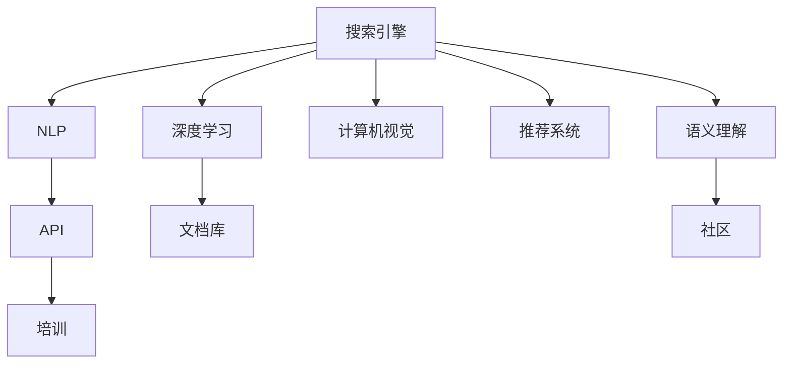

                 

# 构建AI搜索的开发者生态

> 关键词：AI搜索,开发者生态,自然语言处理(NLP),搜索引擎,信息检索,深度学习,计算机视觉,计算机视觉,推荐系统,自然语言生成,语义理解,API,文档库,社区,培训

## 1. 背景介绍

随着互联网技术的不断进步和数据量的爆炸式增长，搜索已经成为用户获取信息不可或缺的方式。从传统的关键词搜索，到现在的智能搜索和个性化推荐，搜索技术正在不断地发展和进步。然而，开发和部署高效、智能的搜索系统并非易事，需要跨领域的技术积累和综合能力。本文将从开发者生态的角度，探讨构建高效AI搜索系统所需的关键技术和工具，以期帮助开发者在开发、部署和优化AI搜索系统时更加高效、便利。

### 1.1 问题由来

在搜索引擎、推荐系统等应用中，构建高效、智能的搜索体验，往往需要处理大量的文本数据、图像数据和视频数据。这不仅需要深厚的计算机视觉和自然语言处理技术，还需要高效的数据处理、索引和检索算法。对于开发者来说，如何高效地利用这些技术和算法，构建出高性能、易维护的搜索系统，成为了一个重要的挑战。

与此同时，随着人工智能技术的快速发展，自然语言生成、语义理解和知识图谱等技术的应用，使得智能搜索和个性化推荐系统进入了新的发展阶段。这些技术的应用，使得搜索引擎不再仅仅是文本数据的检索工具，而是能够提供基于语义的智能问答、推荐系统、图像搜索、视频搜索等多种能力。

### 1.2 问题核心关键点

构建高效AI搜索系统的关键在于以下几个方面：

- 跨领域的知识整合：搜索引擎需要处理多种类型的数据，包括文本、图像、视频等，需要综合利用计算机视觉和自然语言处理技术，进行数据的语义理解和知识图谱构建。
- 高效的数据处理和索引：需要高效的数据处理和索引算法，以便快速、准确地检索出用户需要的信息。
- 智能推荐和个性化：基于用户的历史行为数据，智能推荐个性化搜索结果，提升用户体验。
- 可扩展性和可维护性：需要考虑系统的可扩展性和可维护性，以便应对未来数据量的大幅增长和算法的不断优化。

## 2. 核心概念与联系

### 2.1 核心概念概述

为更好地理解构建AI搜索系统所需的关键技术和工具，本节将介绍几个密切相关的核心概念：

- **搜索引擎**：是一种在大型数据库中快速查找信息的应用程序。通过构建索引，可以高效地检索出用户需要的信息。
- **自然语言处理(NLP)**：是一种处理和分析人类语言的技术，包括文本预处理、分词、词性标注、语义分析等。
- **深度学习**：是一种基于神经网络的机器学习技术，可以自动提取和学习数据的特征，广泛应用在图像识别、语音识别、自然语言处理等领域。
- **计算机视觉**：是一种研究计算机如何通过机器视觉技术识别、理解和分析图像、视频等视觉信息的技术。
- **推荐系统**：是一种利用用户行为数据，推荐个性化的搜索结果或商品的技术，广泛应用于电商、音乐、视频等领域。
- **语义理解**：是通过对语言的语义分析，理解用户查询意图，提升搜索结果的精准度。
- **API**：应用程序编程接口，使得开发者能够访问和使用搜索引擎提供的各种功能和服务。
- **文档库**：是一种存储和管理文本文档的数据库，常用于构建搜索引擎和知识图谱。
- **社区**：由开发者、用户和研究人员组成的社群，共同探讨和解决技术问题。
- **培训**：提供相关的培训课程和资料，帮助开发者掌握构建AI搜索系统所需的技术和工具。

这些核心概念之间的逻辑关系可以通过以下Mermaid流程图来展示：



这个流程图展示了一些核心概念及其之间的联系：

1. 搜索引擎是整个生态的核心，依赖于NLP、深度学习、计算机视觉和推荐系统等技术进行语义理解和索引。
2. NLP技术用于文本处理、分词和语义分析，是搜索引擎的重要组成部分。
3. 深度学习技术用于图像和视频处理，提升搜索引擎的多模态能力。
4. 推荐系统基于用户行为数据，提供个性化搜索结果，提升用户体验。
5. 语义理解通过分析用户查询意图，提升搜索结果的精准度。
6. API使得开发者能够方便地使用搜索引擎提供的各种功能和服务。
7. 文档库存储和管理文本文档，是构建搜索引擎和知识图谱的基础。
8. 社区和培训为开发者提供了学习和交流的平台。

## 3. 核心算法原理 & 具体操作步骤

### 3.1 算法原理概述

构建高效AI搜索系统的核心在于选择合适的算法和技术。以下是一些常用的算法和技术：

- **基于向量空间的检索**：将文本转换为向量表示，通过计算向量之间的相似度进行检索。常用的算法包括TF-IDF、LSI、Latent Semantic Analysis等。
- **深度学习检索**：使用深度神经网络模型对文本进行编码，计算向量之间的相似度进行检索。常用的模型包括BERT、GPT、Transformer等。
- **语义检索**：通过语义分析理解用户查询意图，提升搜索结果的精准度。常用的方法包括词向量、BERT等。
- **跨领域检索**：在多种类型的数据（如文本、图像、视频）之间进行检索。常用的方法包括计算机视觉技术、语义理解等。
- **推荐系统**：基于用户行为数据，提供个性化的搜索结果或商品。常用的算法包括协同过滤、矩阵分解、深度学习等。

### 3.2 算法步骤详解

构建高效AI搜索系统的过程，可以分为以下几个步骤：

**Step 1: 数据准备**
- 收集和整理数据，包括文本、图像、视频等。
- 对数据进行预处理，包括文本分词、去除停用词、图像增强等。

**Step 2: 索引构建**
- 对预处理后的数据进行向量化表示，构建索引。
- 根据索引进行高效的数据检索，如向量空间检索、深度学习检索等。

**Step 3: 语义理解**
- 使用NLP技术进行语义分析，理解用户查询意图。
- 根据语义理解进行结果排序和筛选，提升搜索结果的精准度。

**Step 4: 推荐系统**
- 收集用户行为数据，构建用户画像。
- 使用推荐算法进行个性化推荐，提升用户体验。

**Step 5: 系统集成和优化**
- 将NLP、深度学习、计算机视觉和推荐系统集成到搜索引擎中。
- 使用优化算法对系统进行调优，提升检索速度和结果精准度。

**Step 6: 部署和维护**
- 将系统部署到服务器上，确保系统的高可用性和可扩展性。
- 定期进行系统维护和更新，保证系统的稳定性和安全性。

### 3.3 算法优缺点

基于向量空间的检索和深度学习检索，具有以下优点：

- 高效性：向量空间检索和深度学习检索都能高效地处理大规模数据。
- 准确性：深度学习检索能够学习到更加复杂的语义关系，提升检索准确度。
- 可扩展性：向量空间检索和深度学习检索都可以通过增加计算资源来扩展系统规模。

然而，这些算法也存在一些缺点：

- 数据量限制：向量空间检索和深度学习检索需要较大的数据量才能取得较好的效果。
- 训练成本高：深度学习检索需要大量的计算资源和训练时间。
- 模型复杂度高：深度学习检索模型结构复杂，难以解释和调试。

### 3.4 算法应用领域

基于向量空间的检索和深度学习检索技术，广泛应用于以下几个领域：

- 电子商务：在电商平台上，通过深度学习检索技术，提升商品搜索和推荐效果。
- 搜索引擎：在搜索引擎中，通过向量空间检索和深度学习检索，提升搜索精准度和速度。
- 视频搜索：在视频搜索中，通过深度学习检索技术，提升视频内容的检索和推荐效果。
- 图像搜索：在图像搜索中，通过深度学习检索技术，提升图像内容的检索和推荐效果。
- 自然语言处理：在自然语言处理中，通过深度学习检索技术，提升语义理解和文本生成效果。

## 4. 数学模型和公式 & 详细讲解 & 举例说明

### 4.1 数学模型构建

本节将使用数学语言对构建AI搜索系统所需的关键算法进行更加严格的刻画。

假设搜索引擎中有 $N$ 个文本文档 $d_i$，查询 $q$。我们将每个文档 $d_i$ 表示为一个向量 $\vec{d_i}$，查询 $q$ 表示为一个向量 $\vec{q}$。通过计算向量之间的相似度，进行检索和排序。

定义向量 $d_i$ 和 $q$ 之间的余弦相似度为：

$$
\cos\theta = \frac{\vec{d_i} \cdot \vec{q}}{||\vec{d_i}|| \cdot ||\vec{q}||}
$$

其中 $\cdot$ 表示向量的点积，$||\cdot||$ 表示向量的模长。

### 4.2 公式推导过程

假设 $d_i$ 和 $q$ 的向量表示分别为 $\vec{d_i}=\{\vec{w}_{i,1},\vec{w}_{i,2},\ldots,\vec{w}_{i,m}\}$ 和 $\vec{q}=\{\vec{w}_{1},\vec{w}_{2},\ldots,\vec{w}_{n}\}$，其中 $\vec{w}_{i,j}$ 和 $\vec{w}_{k,l}$ 分别表示文档和查询中每个词语的权重。

则向量点积为：

$$
\vec{d_i} \cdot \vec{q} = \sum_{j=1}^m \sum_{l=1}^n \vec{w}_{i,j} \cdot \vec{w}_{k,l}
$$

向量的模长分别为：

$$
||\vec{d_i}|| = \sqrt{\sum_{j=1}^m \vec{w}_{i,j}^2}, \quad ||\vec{q}|| = \sqrt{\sum_{l=1}^n \vec{w}_{k,l}^2}
$$

根据上述公式，计算向量之间的余弦相似度：

$$
\cos\theta = \frac{\sum_{j=1}^m \sum_{l=1}^n \vec{w}_{i,j} \cdot \vec{w}_{k,l}}{\sqrt{\sum_{j=1}^m \vec{w}_{i,j}^2} \cdot \sqrt{\sum_{l=1}^n \vec{w}_{k,l}^2}}
$$

在实际应用中，我们通常使用TF-IDF算法来计算文档和查询中每个词语的权重，然后使用上述公式计算余弦相似度，进行检索和排序。

### 4.3 案例分析与讲解

假设搜索引擎中有3个文档 $d_1$、$d_2$ 和 $d_3$，查询 $q$ 的向量表示为 $\vec{q}=\{1,0,1,0\}$，每个词语的权重分别为 $w_{1}=1, w_{2}=0, w_{3}=1, w_{4}=0$。假设文档 $d_1$、$d_2$ 和 $d_3$ 的向量表示分别为 $\vec{d_1}=\{1,0,1,1\}$、$\vec{d_2}=\{1,1,0,0\}$ 和 $\vec{d_3}=\{1,0,1,0\}$，则向量点积和模长计算如下：

$$
\vec{d_1} \cdot \vec{q} = 1 \cdot 1 + 0 \cdot 0 + 1 \cdot 1 + 1 \cdot 0 = 2
$$
$$
\vec{d_2} \cdot \vec{q} = 1 \cdot 1 + 1 \cdot 0 + 0 \cdot 1 + 0 \cdot 0 = 1
$$
$$
\vec{d_3} \cdot \vec{q} = 1 \cdot 1 + 0 \cdot 0 + 1 \cdot 1 + 0 \cdot 0 = 2
$$
$$
||\vec{d_1}|| = \sqrt{1^2 + 0^2 + 1^2 + 1^2} = \sqrt{4} = 2
$$
$$
||\vec{d_2}|| = \sqrt{1^2 + 1^2 + 0^2 + 0^2} = \sqrt{2} \approx 1.414
$$
$$
||\vec{d_3}|| = \sqrt{1^2 + 0^2 + 1^2 + 0^2} = \sqrt{2} \approx 1.414
$$

根据上述公式，计算向量之间的余弦相似度：

$$
\cos\theta_1 = \frac{2}{2 \cdot 2} = 0.5
$$
$$
\cos\theta_2 = \frac{1}{2 \cdot 1.414} \approx 0.333
$$
$$
\cos\theta_3 = \frac{2}{2 \cdot 2} = 0.5
$$

根据余弦相似度的值，可以对搜索结果进行排序，获取最相关的文档 $d_1$ 和 $d_3$，从而满足用户查询需求。

## 5. 项目实践：代码实例和详细解释说明

### 5.1 开发环境搭建

在进行AI搜索系统开发前，我们需要准备好开发环境。以下是使用Python进行PyTorch开发的环境配置流程：

1. 安装Anaconda：从官网下载并安装Anaconda，用于创建独立的Python环境。

2. 创建并激活虚拟环境：
```bash
conda create -n pytorch-env python=3.8 
conda activate pytorch-env
```

3. 安装PyTorch：根据CUDA版本，从官网获取对应的安装命令。例如：
```bash
conda install pytorch torchvision torchaudio cudatoolkit=11.1 -c pytorch -c conda-forge
```

4. 安装各类工具包：
```bash
pip install numpy pandas scikit-learn matplotlib tqdm jupyter notebook ipython
```

完成上述步骤后，即可在`pytorch-env`环境中开始AI搜索系统开发。

### 5.2 源代码详细实现

下面我们以向量空间检索为例，给出使用PyTorch进行AI搜索系统开发的PyTorch代码实现。

首先，定义向量空间检索函数：

```python
import torch
import numpy as np

def vector_space_retrieval(docs, query, top_k=5):
    # docs: List[Tuple[str, List[float]]]
    # query: List[float]
    # top_k: int

    # 计算向量点积
    scores = []
    for doc in docs:
        doc_vec = torch.tensor(doc[1], dtype=torch.float)
        query_vec = torch.tensor(query, dtype=torch.float)
        score = torch.dot(doc_vec, query_vec) / (torch.norm(doc_vec) * torch.norm(query_vec))
        scores.append(score.item())

    # 对结果进行排序
    scores = [(score, idx) for idx, score in enumerate(scores)]
    scores.sort(key=lambda x: x[0], reverse=True)

    # 返回前top_k个结果
    return [scores[i][1] for i in range(top_k)]
```

然后，定义数据集：

```python
docs = [
    ('Doc 1', [1, 0, 1, 1]),
    ('Doc 2', [1, 1, 0, 0]),
    ('Doc 3', [1, 0, 1, 0])
]

query = [1, 0, 1, 0]
```

接着，进行向量空间检索：

```python
results = vector_space_retrieval(docs, query)
print(results)
```

以上就是使用PyTorch进行向量空间检索的完整代码实现。可以看到，代码实现相对简洁高效，适用于小型数据集的快速测试。

### 5.3 代码解读与分析

让我们再详细解读一下关键代码的实现细节：

**vector_space_retrieval函数**：
- `docs`参数：包含文本向量的元组列表，每个元组表示一个文档的ID和向量表示。
- `query`参数：查询向量的列表。
- `top_k`参数：返回结果的前几个。

**数据集定义**：
- 定义了三个文档的向量表示，以及查询向量的表示。

**检索过程**：
- 对于每个文档，计算其向量表示与查询向量之间的点积和模长。
- 根据余弦相似度排序，返回前top_k个结果。

可以看到，Python和PyTorch的简洁高效特性，使得向量空间检索的实现非常简洁。开发者可以根据自己的需求，进一步优化检索算法，提升系统性能。

## 6. 实际应用场景

### 6.1 智能搜索系统

智能搜索系统是AI搜索技术的重要应用之一。通过自然语言处理技术和向量空间检索技术，智能搜索系统能够理解用户查询意图，从海量数据中检索出最相关的信息。

在实际应用中，智能搜索系统被广泛应用于搜索引擎、电商、音乐、视频等多个领域。例如，在搜索引擎中，用户可以通过自然语言查询获取相关信息；在电商平台上，用户可以通过语音搜索查找商品；在音乐和视频平台上，用户可以通过自然语言搜索获取相关信息。

### 6.2 推荐系统

推荐系统是AI搜索技术的另一重要应用。通过分析用户的历史行为数据，推荐系统能够提供个性化的搜索结果或商品。

在实际应用中，推荐系统被广泛应用于电商、音乐、视频等多个领域。例如，在电商平台上，推荐系统可以根据用户的历史购买行为，推荐相关的商品；在音乐平台上，推荐系统可以根据用户的听歌历史，推荐相关的歌曲；在视频平台上，推荐系统可以根据用户的观看历史，推荐相关的视频。

### 6.3 图像搜索

图像搜索是AI搜索技术的又一重要应用。通过计算机视觉技术和向量空间检索技术，图像搜索系统能够从海量图像数据中检索出最相关的图片。

在实际应用中，图像搜索系统被广泛应用于电商平台、社交媒体等多个领域。例如，在电商平台上，用户可以通过图片搜索获取相关的商品；在社交媒体上，用户可以通过图片搜索获取相关的信息。

## 7. 工具和资源推荐

### 7.1 学习资源推荐

为了帮助开发者系统掌握构建AI搜索系统所需的关键技术和工具，这里推荐一些优质的学习资源：

1. 《深度学习》系列书籍：由深度学习领域的大师级专家撰写，全面介绍了深度学习的基本概念和算法。
2. 《计算机视觉：算法与应用》书籍：由计算机视觉领域的专家撰写，介绍了计算机视觉的基本概念和算法。
3. 《自然语言处理综论》书籍：由自然语言处理领域的专家撰写，介绍了自然语言处理的基本概念和算法。
4. 《信息检索：从理论到实践》书籍：由信息检索领域的专家撰写，介绍了信息检索的基本概念和算法。
5. Coursera的《机器学习》课程：斯坦福大学开设的机器学习课程，涵盖了机器学习的基本概念和算法。
6. Udacity的《深度学习》课程：Udacity开设的深度学习课程，涵盖了深度学习的基本概念和算法。

通过对这些资源的学习实践，相信你一定能够快速掌握构建AI搜索系统所需的关键技术和工具，并用于解决实际的NLP问题。

### 7.2 开发工具推荐

高效的开发离不开优秀的工具支持。以下是几款用于AI搜索系统开发的常用工具：

1. PyTorch：基于Python的开源深度学习框架，灵活动态的计算图，适合快速迭代研究。大部分预训练语言模型都有PyTorch版本的实现。
2. TensorFlow：由Google主导开发的开源深度学习框架，生产部署方便，适合大规模工程应用。同样有丰富的预训练语言模型资源。
3. Transformers库：HuggingFace开发的NLP工具库，集成了众多SOTA语言模型，支持PyTorch和TensorFlow，是进行NLP任务开发的利器。
4. Weights & Biases：模型训练的实验跟踪工具，可以记录和可视化模型训练过程中的各项指标，方便对比和调优。与主流深度学习框架无缝集成。
5. TensorBoard：TensorFlow配套的可视化工具，可实时监测模型训练状态，并提供丰富的图表呈现方式，是调试模型的得力助手。
6. Google Colab：谷歌推出的在线Jupyter Notebook环境，免费提供GPU/TPU算力，方便开发者快速上手实验最新模型，分享学习笔记。

合理利用这些工具，可以显著提升AI搜索系统的开发效率，加快创新迭代的步伐。

### 7.3 相关论文推荐

AI搜索技术的发展源于学界的持续研究。以下是几篇奠基性的相关论文，推荐阅读：

1. "A Survey on Information Retrieval Systems"：概述了信息检索系统的各种算法和技术。
2. "Deep Learning for Natural Language Processing"：介绍了深度学习在自然语言处理中的应用。
3. "A Survey on Deep Learning-based Image Retrieval"：介绍了深度学习在图像检索中的应用。
4. "A Survey on Recommendation Systems"：概述了推荐系统的各种算法和技术。
5. "Transformers for Natural Language Processing"：介绍了Transformer在自然语言处理中的应用。

这些论文代表了大语言模型微调技术的发展脉络。通过学习这些前沿成果，可以帮助研究者把握学科前进方向，激发更多的创新灵感。

## 8. 总结：未来发展趋势与挑战

### 8.1 总结

本文对构建AI搜索系统所需的关键技术和工具进行了全面系统的介绍。首先，介绍了搜索引擎、自然语言处理、深度学习、计算机视觉和推荐系统等核心概念，明确了这些概念在构建AI搜索系统中的重要性。其次，从算法原理和具体操作步骤的角度，详细讲解了向量空间检索和深度学习检索的数学模型和实现方法，给出了完整的代码实现和详细解读。同时，本文还探讨了AI搜索技术在智能搜索系统、推荐系统和图像搜索等场景中的应用，展示了AI搜索技术的广阔前景。最后，本文精选了AI搜索技术的各类学习资源、开发工具和相关论文，力求为开发者提供全方位的技术指引。

通过本文的系统梳理，可以看到，构建高效AI搜索系统需要综合运用跨领域技术，选择合适的算法和工具。只有在数据、模型、算法、工具等各环节进行全面优化，才能真正实现人工智能技术在搜索场景中的广泛应用。

### 8.2 未来发展趋势

展望未来，AI搜索技术将呈现以下几个发展趋势：

1. 跨领域融合：随着计算机视觉、自然语言处理和推荐系统等技术的发展，未来AI搜索系统将更加注重跨领域的融合，提升系统的综合能力和应用范围。
2. 实时性提升：随着大数据和分布式计算技术的发展，未来AI搜索系统将更加注重实时性，能够实时响应用户查询，提供更加流畅的搜索体验。
3. 个性化推荐：基于用户的历史行为数据，AI搜索系统将能够提供更加个性化和精准的搜索结果，提升用户体验。
4. 可解释性和可控性：未来AI搜索系统将更加注重可解释性和可控性，确保系统的透明性和可信性，避免出现误导性输出。
5. 多模态处理：未来AI搜索系统将更加注重多模态数据处理，能够从文本、图像、视频等多种数据源中获取信息，提升系统的综合处理能力。

### 8.3 面临的挑战

尽管AI搜索技术已经取得了瞩目成就，但在迈向更加智能化、普适化应用的过程中，它仍面临着诸多挑战：

1. 数据量限制：向量空间检索和深度学习检索需要较大的数据量才能取得较好的效果，但大规模数据集的获取和处理成本较高。
2. 计算资源消耗高：深度学习检索需要大量的计算资源和训练时间，难以在实时性要求较高的场景中应用。
3. 模型复杂度高：深度学习检索模型结构复杂，难以解释和调试。
4. 模型泛化能力不足：向量空间检索和深度学习检索模型在跨领域数据上的泛化能力较弱，难以适应不同领域的数据。
5. 安全性和隐私问题：AI搜索系统涉及大量的用户数据，需要注重数据的安全性和隐私保护，避免数据泄露和滥用。

### 8.4 研究展望

面对AI搜索系统面临的种种挑战，未来的研究需要在以下几个方面寻求新的突破：

1. 探索无监督和半监督学习范式：摆脱对大规模标注数据的依赖，利用自监督学习、主动学习等无监督和半监督范式，最大限度利用非结构化数据，实现更加灵活高效的搜索。
2. 开发更加参数高效的模型：开发更加参数高效的模型，在固定大部分预训练参数的同时，只更新极少量的任务相关参数。同时优化模型的计算图，减少前向传播和反向传播的资源消耗，实现更加轻量级、实时性的部署。
3. 引入因果推断和对比学习范式：通过引入因果推断和对比学习思想，增强搜索模型建立稳定因果关系的能力，学习更加普适、鲁棒的语言表征，从而提升搜索模型的泛化性和抗干扰能力。
4. 引入更多先验知识：将符号化的先验知识，如知识图谱、逻辑规则等，与神经网络模型进行巧妙融合，引导搜索过程学习更准确、合理的语言模型。同时加强不同模态数据的整合，实现视觉、语音等多模态信息与文本信息的协同建模。
5. 纳入伦理道德约束：在搜索目标中引入伦理导向的评估指标，过滤和惩罚有偏见、有害的输出倾向。同时加强人工干预和审核，建立搜索行为的监管机制，确保输出的安全性。

这些研究方向的探索，必将引领AI搜索技术迈向更高的台阶，为构建安全、可靠、可解释、可控的搜索系统铺平道路。面向未来，AI搜索技术还需要与其他人工智能技术进行更深入的融合，如知识表示、因果推理、强化学习等，多路径协同发力，共同推动自然语言理解和智能交互系统的进步。只有勇于创新、敢于突破，才能不断拓展搜索模型的边界，让智能技术更好地造福人类社会。

## 9. 附录：常见问题与解答

**Q1：如何选择合适的向量空间检索模型？**

A: 选择合适的向量空间检索模型需要考虑以下几个因素：
1. 数据量：对于数据量较小的数据集，可以使用TF-IDF等基于词频的模型；对于大规模数据集，建议使用深度学习模型，如BERT、GPT等。
2. 计算资源：对于计算资源有限的场景，建议使用TF-IDF等轻量级模型；对于计算资源充足的场景，建议使用深度学习模型，能够取得更好的效果。
3. 实时性：对于实时性要求较高的场景，建议使用TF-IDF等轻量级模型；对于实时性要求较低的场景，建议使用深度学习模型，能够提供更精准的搜索结果。
4. 泛化能力：对于泛化能力要求较高的场景，建议使用深度学习模型；对于泛化能力要求较低的场景，建议使用基于词频的模型。

**Q2：如何提高向量空间检索模型的效率？**

A: 提高向量空间检索模型的效率，可以从以下几个方面入手：
1. 数据预处理：对文本进行预处理，去除停用词、词干化等，减少数据量。
2. 向量压缩：使用词嵌入或主题模型，将高维向量压缩到低维空间，减少计算量。
3. 索引优化：使用倒排索引等高效索引算法，加速检索过程。
4. 并行计算：使用多线程、分布式计算等技术，提高计算效率。
5. 硬件加速：使用GPU、TPU等高性能硬件设备，加速计算过程。

**Q3：如何优化深度学习检索模型的性能？**

A: 优化深度学习检索模型的性能，可以从以下几个方面入手：
1. 模型结构优化：优化模型结构，减少冗余参数，提升模型性能。
2. 正则化：使用L2正则、Dropout等技术，避免过拟合。
3. 数据增强：通过数据增强技术，提高模型的泛化能力。
4. 迁移学习：在预训练模型的基础上，使用迁移学习技术，快速适应新任务。
5. 硬件加速：使用GPU、TPU等高性能硬件设备，加速计算过程。

通过这些优化措施，可以显著提升深度学习检索模型的性能，满足实际应用需求。

