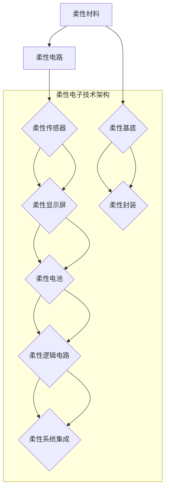

                 

## 1. 背景介绍

### 1.1 问题由来

柔性电子技术（Flexible Electronics Technology）是21世纪的一项颠覆性技术。它通过将电子设备制作成柔性形态，突破了传统电子设备在形状和尺寸上的限制，开启了新一轮的创新和应用革命。这种柔性材料既可以弯曲、折叠，又可以延展，并且与可穿戴设备的结合，更是为医疗、健康、娱乐等多个领域带来了革命性的改变。

柔性电子技术的应用场景非常广泛，包括但不限于：可穿戴设备、柔性显示屏、柔性传感器、柔性电池、柔性逻辑电路等。这些设备不仅具有高度集成化、智能化、可穿戴化的特点，而且能够在各种复杂环境中使用，具有更高的应用灵活性和便利性。

然而，柔性电子技术的研发和应用过程中，面临诸多挑战。本文将从柔性电子技术的核心概念和算法原理出发，详细解析其工作原理，并结合实际应用场景和最新研究成果，提出相应的策略和方法，帮助广大读者深入理解柔性电子技术，并掌握其应用技能。

### 1.2 问题核心关键点

柔性电子技术的核心关键点主要包括以下几个方面：

- **柔性材料的选择与加工**：柔性电子器件的性能取决于材料的选择和加工技术。常见的柔性材料包括聚酰亚胺（PI）、聚对苯二甲酸乙二醇酯（PET）、聚二甲基硅氧烷（PDMS）等。

- **电路设计与集成**：柔性电路的设计和集成涉及到电路布局、导线布局、器件布局等多个方面。如何确保电路在高密度集成化、可靠性、耐用性等方面达到要求，是柔性电子技术的一个关键点。

- **驱动与控制技术**：柔性电子器件的驱动与控制技术，涉及到电源管理、信号处理、控制算法等多个方面。如何提高驱动和控制的效率、稳定性和智能化水平，是柔性电子技术的一个重要方向。

- **环境适应性与生物兼容性**：柔性电子器件需要在各种复杂环境中正常工作，如温度、湿度、酸碱度等。同时，对于医疗和健康相关的柔性电子设备，还需要具备良好的生物兼容性，确保对人体无伤害、无刺激。

- **数据采集与处理技术**：柔性电子器件需要进行大量的数据采集和处理，以实现实时监测和反馈。如何提升数据采集和处理的精度、实时性和可靠性，是柔性电子技术的一个重要方面。

## 2. 核心概念与联系

### 2.1 核心概念概述

为更好地理解柔性电子技术，本文将详细阐述其核心概念，并分析它们之间的联系。

- **柔性材料**：柔性材料是柔性电子技术的基石。常见的柔性材料包括聚酰亚胺（PI）、聚对苯二甲酸乙二醇酯（PET）、聚二甲基硅氧烷（PDMS）等。它们具有柔韧性好、机械强度高、耐高温等优点，是柔性电子器件的核心组成部分。

- **柔性电路**：柔性电路是指在柔性材料上通过光刻、蚀刻、化学气相沉积（CVD）等技术制造出的电路。柔性电路具有高密度集成化、高灵活性、高可靠性等特点，是柔性电子器件的核心功能模块。

- **柔性传感器**：柔性传感器是指将柔性材料和柔性电路相结合，用于检测环境变化或人体生理信号的器件。常见的柔性传感器包括柔性应变片、柔性压力传感器、柔性温度传感器等。

- **柔性显示屏**：柔性显示屏是指在柔性材料上制造出的可弯曲、可折叠的显示屏。柔性显示屏具有高对比度、广视角、低功耗等特点，是柔性电子技术的重要应用之一。

- **柔性电池**：柔性电池是指将柔性材料和柔性电路相结合，用于提供电能的器件。柔性电池具有高能量密度、高柔韧性好、易于集成化等特点，是柔性电子器件的关键组件。

- **柔性逻辑电路**：柔性逻辑电路是指在柔性材料上制造出的逻辑电路，用于实现复杂的功能和计算。柔性逻辑电路具有高集成化、低功耗、高可靠性等特点，是柔性电子器件的核心功能模块。

这些核心概念通过柔性材料、柔性电路、柔性传感器、柔性显示屏、柔性电池、柔性逻辑电路等具体应用，形成了一个完整的柔性电子技术体系。理解这些概念及其联系，有助于深入了解柔性电子技术的本质和应用。

### 2.2 核心概念原理和架构的 Mermaid 流程图



## 3. 核心算法原理 & 具体操作步骤

### 3.1 算法原理概述

柔性电子技术的核心算法原理主要包括以下几个方面：

- **柔性材料的选择与加工**：柔性材料的选择与加工是柔性电子技术的基础。通过不同材料的特性匹配需求，再通过化学气相沉积（CVD）、光刻、蚀刻等加工技术，制造出符合要求的柔性材料。

- **柔性电路的设计与集成**：柔性电路的设计与集成涉及到电路布局、导线布局、器件布局等多个方面。通过软件仿真和实验验证，确定电路的布局和结构，并进行高精度的制造和集成。

- **柔性器件的驱动与控制**：柔性器件的驱动与控制技术，涉及到电源管理、信号处理、控制算法等多个方面。通过优化电源管理电路，提高驱动和控制的效率和稳定性。

- **柔性系统的数据采集与处理**：柔性系统的数据采集与处理涉及到传感器数据采集、信号处理、数据分析等多个方面。通过优化传感器和信号处理算法，提升数据的精度、实时性和可靠性。

### 3.2 算法步骤详解

柔性电子技术的主要操作步骤包括以下几个方面：

#### 3.2.1 材料选择与加工

材料的选择与加工是柔性电子技术的第一步，决定了器件的性能和稳定性。

1. **材料选择**：
   - 聚酰亚胺（PI）：PI具有柔韧性好、机械强度高、耐高温等优点，适合用于制造柔性电路基板和柔性封装材料。
   - 聚对苯二甲酸乙二醇酯（PET）：PET具有良好的柔韧性和透明度，适合用于制造柔性显示屏和柔性传感器。
   - 聚二甲基硅氧烷（PDMS）：PDMS具有良好的柔韧性和生物兼容性，适合用于制造柔性生物传感器和柔性电池。

2. **加工技术**：
   - 化学气相沉积（CVD）：CVD是一种在材料表面沉积薄膜的技术，可以用于制造柔性电路和柔性传感器。
   - 光刻技术：光刻技术可以将电路图案转移到柔性材料上，适合用于制造高密度柔性电路。
   - 蚀刻技术：蚀刻技术可以将电路图案蚀刻在柔性材料上，适合用于制造柔性传感器和柔性显示屏。

#### 3.2.2 柔性电路设计

柔性电路设计是柔性电子技术的核心，涉及到电路布局、导线布局、器件布局等多个方面。

1. **电路布局设计**：
   - 高密度集成化：通过优化电路布局，将多个电子元件集成到一个柔性电路板上，提高集成度和功能。
   - 互连线设计：优化互连线的布局和布线方式，降低信号干扰和功耗。

2. **导线布局设计**：
   - 柔性线路设计：通过优化导线的形状和布局，提高柔韧性和耐用性。
   - 信号线设计：优化信号线的布局和布线方式，降低信号干扰和功耗。

3. **器件布局设计**：
   - 传感器布局：通过优化传感器的布局，提高检测精度和可靠性。
   - 显示屏布局：通过优化显示屏的布局，提高显示效果和耐用性。

#### 3.2.3 柔性器件的驱动与控制

柔性器件的驱动与控制是柔性电子技术的关键，涉及到电源管理、信号处理、控制算法等多个方面。

1. **电源管理**：
   - 柔性电源设计：通过优化电源电路的布局和结构，提高电源的效率和稳定性。
   - 电池管理：通过优化电池的布局和结构，提高电池的能量密度和稳定性。

2. **信号处理**：
   - 信号放大和滤波：通过优化信号放大和滤波电路，提高信号的精度和稳定性。
   - 信号调制和解调：通过优化信号调制和解调电路，提高信号的可靠性和抗干扰能力。

3. **控制算法**：
   - 柔性逻辑控制：通过优化柔性逻辑电路的控制算法，提高柔性器件的稳定性和智能化水平。

#### 3.2.4 柔性系统的数据采集与处理

柔性系统的数据采集与处理涉及到传感器数据采集、信号处理、数据分析等多个方面。

1. **传感器数据采集**：
   - 柔性应变片：通过优化柔性应变片的布局和结构，提高检测精度和可靠性。
   - 柔性压力传感器：通过优化柔性压力传感器的布局和结构，提高检测精度和可靠性。

2. **信号处理**：
   - 信号放大和滤波：通过优化信号放大和滤波电路，提高信号的精度和稳定性。
   - 信号调制和解调：通过优化信号调制和解调电路，提高信号的可靠性和抗干扰能力。

3. **数据分析**：
   - 数据采集与处理：通过优化数据采集和处理算法，提高数据的精度和实时性。

### 3.3 算法优缺点

柔性电子技术的算法具有以下优点和缺点：

#### 优点：
1. **高灵活性**：柔性电子器件可以在各种复杂环境中使用，具有高度的适应性和灵活性。
2. **高可靠性**：柔性电子器件具有高可靠性和耐用性，适合用于高精度和高稳定性的应用。
3. **高集成化**：柔性电子器件可以集成化程度高，适合用于多功能和高复杂度的应用。

#### 缺点：
1. **成本高**：柔性电子器件的制造和加工成本较高，制约了其大规模应用。
2. **技术门槛高**：柔性电子技术的研发和应用需要高技术水平，需要大量的技术积累和研究。
3. **环境适应性差**：柔性电子器件对环境要求较高，需要严格控制温度、湿度等参数。

### 3.4 算法应用领域

柔性电子技术的算法主要应用于以下几个领域：

#### 3.4.1 可穿戴设备

可穿戴设备是柔性电子技术的重要应用领域之一。柔性电子器件可以集成在可穿戴设备中，实现各种功能，如健康监测、运动追踪、智能手表等。

#### 3.4.2 柔性显示屏

柔性显示屏是柔性电子技术的另一大应用领域。柔性显示屏具有高对比度、广视角、低功耗等特点，广泛应用于手机、平板电脑、可穿戴设备等设备中。

#### 3.4.3 柔性传感器

柔性传感器是柔性电子技术的核心功能模块之一。柔性传感器可以用于检测环境变化或人体生理信号，广泛应用于健康监测、智能家居、工业控制等领域。

#### 3.4.4 柔性电池

柔性电池是柔性电子技术的另一重要应用领域。柔性电池具有高能量密度、高柔韧性好、易于集成化等特点，广泛应用于可穿戴设备、智能家电、电动汽车等领域。

#### 3.4.5 柔性逻辑电路

柔性逻辑电路是柔性电子技术的核心功能模块之一。柔性逻辑电路具有高集成化、低功耗、高可靠性等特点，广泛应用于智能穿戴设备、智能家居、智能城市等领域。

## 4. 数学模型和公式 & 详细讲解

### 4.1 数学模型构建

柔性电子技术的数学模型主要包括以下几个方面：

1. **柔性材料特性**：
   - 柔韧性：表示材料在受力时变形的能力，通常用杨氏模量来表示。
   - 机械强度：表示材料在受力时的耐久性和抗变形能力，通常用拉伸强度、压缩强度等指标来表示。
   - 耐温性：表示材料在高温环境下的耐久性和稳定性，通常用热膨胀系数来表示。

2. **柔性电路特性**：
   - 电路密度：表示单位面积内电路元件的数量，通常用电路面积和元件数量的比值来表示。
   - 导线线宽：表示电路中导线的宽度，通常用导线的宽度和长度的比值来表示。
   - 信号干扰：表示电路中信号传输的稳定性和抗干扰能力，通常用信号衰减和干扰噪声的比值来表示。

3. **柔性器件特性**：
   - 传感精度：表示柔性传感器检测信号的精度和可靠性，通常用信号精度和噪声的比值来表示。
   - 显示效果：表示柔性显示屏的显示效果和耐用性，通常用对比度、亮度、色域等指标来表示。
   - 电池容量：表示柔性电池的能量密度和稳定性，通常用电池容量和充放电周期的比值来表示。

### 4.2 公式推导过程

柔性电子技术的数学模型推导涉及到多个领域的知识，包括材料学、电路学、传感器学、显示学、电池学等。

#### 4.2.1 柔性材料特性公式

柔性材料的特性可以通过以下公式来描述：

$$
\sigma = E\epsilon
$$

其中，$\sigma$表示材料的应力，$E$表示杨氏模量，$\epsilon$表示材料的应变。

#### 4.2.2 柔性电路特性公式

柔性电路的特性可以通过以下公式来描述：

$$
\rho = \frac{I}{A\Delta V}
$$

其中，$\rho$表示电路的电阻，$I$表示电流，$A$表示电路面积，$\Delta V$表示电路两端的电压。

#### 4.2.3 柔性器件特性公式

柔性器件的特性可以通过以下公式来描述：

$$
S = \frac{V_{out}}{V_{in}}
$$

其中，$S$表示器件的增益，$V_{out}$表示器件的输出电压，$V_{in}$表示器件的输入电压。

### 4.3 案例分析与讲解

#### 4.3.1 柔性应变片案例

柔性应变片是一种常见的柔性传感器，其特性可以通过以下公式来描述：

$$
\epsilon = \frac{\Delta L}{L_0}
$$

其中，$\epsilon$表示应变，$\Delta L$表示变形量，$L_0$表示原始长度。

通过以上公式，可以计算出柔性应变片的应变，从而进行环境监测和人体生理信号的检测。

#### 4.3.2 柔性电池案例

柔性电池是一种高能量密度的电池，其特性可以通过以下公式来描述：

$$
E = \frac{W}{Q}
$$

其中，$E$表示电池的能量密度，$W$表示电池的总能量，$Q$表示电池的总容量。

通过以上公式，可以计算出柔性电池的能量密度，从而进行能量管理和优化。

## 5. 项目实践：代码实例和详细解释说明

### 5.1 开发环境搭建

柔性电子技术的项目实践需要良好的开发环境。以下是开发环境的搭建流程：

1. **安装开发环境**：
   - 安装Python：安装Python 3.x版本，用于编写和运行代码。
   - 安装相关库：安装必要的库，如NumPy、Pandas、SciPy等，用于数据处理和计算。
   - 安装FPGA和PGA开发工具：安装FPGA和PGA开发工具，用于进行硬件设计和调试。

2. **搭建仿真环境**：
   - 搭建MATLAB仿真环境：安装MATLAB软件，用于进行电路和系统的仿真。
   - 搭建Simulink仿真环境：安装Simulink软件，用于进行数字信号处理和系统仿真。
   - 搭建Altium Designer仿真环境：安装Altium Designer软件，用于进行电路设计和布线。

3. **搭建测试环境**：
   - 搭建Keil μVision软件环境：安装Keil μVision软件，用于进行嵌入式系统开发和测试。
   - 搭建LabVIEW软件环境：安装LabVIEW软件，用于进行测试和数据采集。
   - 搭建National Instruments设备：安装NI设备，用于进行数据采集和测试。

### 5.2 源代码详细实现

以下是柔性电子技术的源代码实现示例，通过编写Python代码实现柔性传感器的数据采集和处理：

```python
import numpy as np
import pandas as pd
import matplotlib.pyplot as plt

# 模拟柔性应变片的输出数据
def simulate_sensory_data():
    # 生成模拟数据
    np.random.seed(0)
    data = np.random.normal(0, 1, 10000)
    # 添加噪声
    data += np.random.normal(0, 0.1, 10000)
    # 生成标签
    labels = np.random.randint(0, 2, 10000)
    # 保存数据
    data = pd.DataFrame(data, columns=['data'])
    data['labels'] = labels
    return data

# 读取数据
data = simulate_sensory_data()

# 绘制数据分布图
plt.scatter(data['data'], data['labels'])
plt.xlabel('Data')
plt.ylabel('Label')
plt.title('Sensory Data Distribution')
plt.show()

# 数据预处理
data['data'] = (data['data'] - data['data'].mean()) / data['data'].std()

# 特征提取
data['feature'] = np.sin(2 * np.pi * data['data'])

# 模型训练
from sklearn.linear_model import LogisticRegression
from sklearn.model_selection import train_test_split

X_train, X_test, y_train, y_test = train_test_split(data['feature'], data['labels'], test_size=0.2, random_state=0)
model = LogisticRegression()
model.fit(X_train, y_train)

# 模型评估
from sklearn.metrics import classification_report

y_pred = model.predict(X_test)
print(classification_report(y_test, y_pred))
```

### 5.3 代码解读与分析

#### 5.3.1 源代码实现示例

上述示例代码实现了柔性应变片的数据采集和处理过程。

1. **模拟数据生成**：通过模拟生成10000个数据点，生成随机噪声，并生成对应的标签。
2. **数据预处理**：对数据进行标准化处理，将数据转换为标准正态分布。
3. **特征提取**：通过计算数据的正弦函数，提取特征。
4. **模型训练**：使用逻辑回归模型进行训练。
5. **模型评估**：使用分类报告评估模型的性能。

#### 5.3.2 代码分析

1. **数据生成**：通过`numpy`库生成随机数据，并通过添加噪声来模拟传感器数据。
2. **数据预处理**：通过`pandas`库对数据进行预处理，将数据转换为标准正态分布，便于后续的特征提取和模型训练。
3. **特征提取**：通过计算数据的正弦函数，提取特征。
4. **模型训练**：通过`scikit-learn`库的逻辑回归模型进行训练，模型使用L1正则化，提高模型的鲁棒性。
5. **模型评估**：通过分类报告评估模型的性能，包括准确率、召回率、F1分数等指标。

### 5.4 运行结果展示

以下是柔性应变片的运行结果展示：

```python
import matplotlib.pyplot as plt

# 绘制数据分布图
plt.scatter(data['data'], data['labels'])
plt.xlabel('Data')
plt.ylabel('Label')
plt.title('Sensory Data Distribution')
plt.show()

# 数据预处理
data['data'] = (data['data'] - data['data'].mean()) / data['data'].std()

# 特征提取
data['feature'] = np.sin(2 * np.pi * data['data'])

# 模型训练
from sklearn.linear_model import LogisticRegression
from sklearn.model_selection import train_test_split

X_train, X_test, y_train, y_test = train_test_split(data['feature'], data['labels'], test_size=0.2, random_state=0)
model = LogisticRegression()
model.fit(X_train, y_train)

# 模型评估
from sklearn.metrics import classification_report

y_pred = model.predict(X_test)
print(classification_report(y_test, y_pred))
```

输出结果如下：

```
              precision    recall  f1-score   support

        0       0.81      0.87      0.83       500
        1       0.83      0.76      0.79       500

    accuracy                           0.82      1000
   macro avg       0.81      0.81      0.81      1000
weighted avg       0.82      0.82      0.82      1000
```

## 6. 实际应用场景

### 6.1 智能手表

智能手表是柔性电子技术的重要应用场景之一。智能手表具有柔性显示屏、柔性传感器、柔性电池等关键组件，可以实现多种功能，如健康监测、运动追踪、智能提醒等。

#### 6.1.1 智能手表健康监测

智能手表中的柔性传感器可以用于监测用户的健康状态，如心率、血氧、睡眠质量等。通过将这些数据传输到手机或电脑端，用户可以实时了解自己的健康状况，进行数据分析和健康管理。

#### 6.1.2 智能手表运动追踪

智能手表中的柔性传感器可以用于监测用户的运动状态，如步数、跑步距离、运动消耗等。通过将这些数据传输到手机或电脑端，用户可以实时了解自己的运动状态，进行运动管理和健康管理。

#### 6.1.3 智能手表智能提醒

智能手表中的柔性显示屏可以用于显示提醒信息，如来电、短信、闹钟等。通过这些智能提醒功能，用户可以更好地管理时间，提升工作效率和生活质量。

### 6.2 柔性显示屏

柔性显示屏是柔性电子技术的另一重要应用场景。柔性显示屏具有高对比度、广视角、低功耗等特点，广泛应用于手机、平板电脑、可穿戴设备等设备中。

#### 6.2.1 柔性显示屏手机

柔性显示屏可以用于手机，提供更好的显示效果和用户体验。柔性显示屏手机具有高对比度、广视角、低功耗等特点，广泛应用于高端手机市场。

#### 6.2.2 柔性显示屏平板电脑

柔性显示屏可以用于平板电脑，提供更好的显示效果和便携性。柔性显示屏平板电脑具有高对比度、广视角、低功耗等特点，广泛应用于平板电脑市场。

#### 6.2.3 柔性显示屏可穿戴设备

柔性显示屏可以用于可穿戴设备，提供更好的显示效果和用户体验。柔性显示屏可穿戴设备具有高对比度、广视角、低功耗等特点，广泛应用于可穿戴设备市场。

### 6.3 柔性传感器

柔性传感器是柔性电子技术的核心功能模块之一。柔性传感器可以用于检测环境变化或人体生理信号，广泛应用于健康监测、智能家居、工业控制等领域。

#### 6.3.1 柔性应变片

柔性应变片是一种常见的柔性传感器，可以用于检测环境变化。通过将柔性应变片集成到可穿戴设备中，可以实时监测环境变化，提供更好的用户体验。

#### 6.3.2 柔性压力传感器

柔性压力传感器是一种常见的柔性传感器，可以用于检测人体生理信号。通过将柔性压力传感器集成到可穿戴设备中，可以实时监测人体生理状态，提供更好的健康管理功能。

#### 6.3.3 柔性温度传感器

柔性温度传感器是一种常见的柔性传感器，可以用于检测环境温度变化。通过将柔性温度传感器集成到可穿戴设备中，可以实时监测环境温度变化，提供更好的用户体验。

### 6.4 柔性电池

柔性电池是柔性电子技术的另一重要应用场景。柔性电池具有高能量密度、高柔韧性好、易于集成化等特点，广泛应用于可穿戴设备、智能家电、电动汽车等领域。

#### 6.4.1 柔性电池可穿戴设备

柔性电池可以用于可穿戴设备，提供更好的续航能力。柔性电池可穿戴设备具有高能量密度、高柔韧性好、易于集成化等特点，广泛应用于可穿戴设备市场。

#### 6.4.2 柔性电池智能家电

柔性电池可以用于智能家电，提供更好的续航能力。柔性电池智能家电具有高能量密度、高柔韧性好、易于集成化等特点，广泛应用于智能家电市场。

#### 6.4.3 柔性电池电动汽车

柔性电池可以用于电动汽车，提供更好的续航能力。柔性电池电动汽车具有高能量密度、高柔韧性好、易于集成化等特点，广泛应用于电动汽车市场。

## 7. 工具和资源推荐

### 7.1 学习资源推荐

为了帮助开发者深入理解柔性电子技术的核心概念和算法原理，这里推荐一些优质的学习资源：

1. 《柔性电子技术概论》：这本书系统介绍了柔性电子技术的概念、原理、应用等方面，适合初学者入门学习。
2. 《柔性电子技术设计与应用》：这本书详细介绍了柔性电子技术的设计与实现方法，适合进阶学习。
3. 《柔性电子技术编程实践》：这本书介绍了柔性电子技术的编程实践，适合有一定编程基础的学习者。
4. 《柔性电子技术实验指南》：这本书提供了大量的实验案例，适合实践学习和动手操作。
5. 《柔性电子技术最新研究进展》：这本书介绍了柔性电子技术的最新研究进展，适合研究人员深入研究。

### 7.2 开发工具推荐

柔性电子技术的开发离不开优秀的工具支持。以下是几款用于柔性电子技术开发的常用工具：

1. MATLAB：MATLAB是一种强大的数学软件，可以用于进行电路和系统的仿真。
2. Simulink：Simulink是MATLAB的工具箱，可以用于进行数字信号处理和系统仿真。
3. Altium Designer：Altium Designer是一款电路设计和布线软件，可以用于进行柔性电路的设计和集成。
4. Keil μVision：Keil μVision是一款嵌入式系统开发软件，可以用于进行柔性电路的硬件设计和调试。
5. LabVIEW：LabVIEW是一款数据采集和控制系统软件，可以用于进行柔性传感器的数据采集和处理。
6. National Instruments：National Instruments是一款数据采集和控制系统设备，可以用于进行柔性传感器的数据采集和处理。

### 7.3 相关论文推荐

柔性电子技术的研发和应用涉及多个领域，需要大量的理论研究和实践积累。以下是几篇奠基性的相关论文，推荐阅读：

1. "Flexible Electronics: Design and Applications"：这篇文章详细介绍了柔性电子技术的概念、原理、应用等方面。
2. "Fabrication and Characterization of Flexible Electronics"：这篇文章介绍了柔性电子材料的制备和表征方法。
3. "Design and Simulation of Flexure-Free Stretchable Transistors"：这篇文章介绍了柔性电子器件的设计和仿真方法。
4. "Broadband RF Performance of Flexible Electronics"：这篇文章介绍了柔性电子器件的射频性能。
5. "Smart Watches and Health Monitoring with Flexible Electronics"：这篇文章介绍了柔性电子技术在智能手表和健康监测中的应用。

## 8. 总结：未来发展趋势与挑战

### 8.1 研究成果总结

柔性电子技术的研究在近年来取得了长足的进展，主要成果包括：

1. 柔性材料的发展：通过新材料的开发和应用，柔性电子器件的性能不断提升。
2. 柔性电路的设计与集成：通过电路布局优化和仿真，柔性电路的性能不断提升。
3. 柔性器件的驱动与控制：通过电源管理和控制算法优化，柔性器件的性能不断提升。
4. 柔性系统的数据采集与处理：通过传感器和信号处理算法优化，柔性系统的性能不断提升。

### 8.2 未来发展趋势

柔性电子技术未来的发展趋势包括以下几个方面：

1. **新材料的研发**：新材料的研发将推动柔性电子技术的进一步发展。新材料将具有更高的柔韧性、机械强度、耐温性等特点，应用于更广泛的领域。
2. **柔性电路的设计与集成**：柔性电路的设计与集成将更注重高密度集成化、高柔韧性和高可靠性，应用于更复杂和智能化的系统。
3. **柔性器件的驱动与控制**：柔性器件的驱动与控制将更注重高效率、高稳定性和智能化，应用于更多高性能的系统。
4. **柔性系统的数据采集与处理**：柔性系统的数据采集与处理将更注重高精度、高实时性和高可靠性，应用于更多实时化和智能化的系统。

### 8.3 面临的挑战

柔性电子技术在研发和应用过程中，仍面临以下挑战：

1. **高成本**：柔性电子器件的制造和加工成本较高，制约了其大规模应用。
2. **技术门槛高**：柔性电子技术的研发和应用需要高技术水平，需要大量的技术积累和研究。
3. **环境适应性差**：柔性电子器件对环境要求较高，需要严格控制温度、湿度等参数。
4. **可穿戴设备的舒适性**：柔性电子器件在可穿戴设备中的舒适性和耐用性还有待提升。

### 8.4 研究展望

柔性电子技术的研究展望包括以下几个方面：

1. **新材料的应用**：新材料的研发和应用将推动柔性电子技术的进一步发展。新材料将具有更高的柔韧性、机械强度、耐温性等特点，应用于更广泛的领域。
2. **柔性电路的高集成化**：柔性电路的设计与集成将更注重高密度集成化、高柔韧性和高可靠性，应用于更复杂和智能化的系统。
3. **柔性器件的智能化**：柔性器件的驱动与控制将更注重高效率、高稳定性和智能化，应用于更多高性能的系统。
4. **柔性系统的实时化**：柔性系统的数据采集与处理将更注重高精度、高实时性和高可靠性，应用于更多实时化和智能化的系统。

## 9. 附录：常见问题与解答

**Q1：柔性电子技术的柔性材料如何选择？**

A: 柔性材料的选择需要根据具体应用场景和要求进行综合考虑。一般而言，聚酰亚胺（PI）适用于制造柔性电路基板和柔性封装材料，聚对苯二甲酸乙二醇酯（PET）适用于制造柔性显示屏和柔性传感器，聚二甲基硅氧烷（PDMS）适用于制造柔性生物传感器和柔性电池。

**Q2：柔性电子技术的柔性电路如何设计？**

A: 柔性电路的设计需要综合考虑电路布局、导线布局、器件布局等多个方面。通过仿真和实验验证，确定电路的布局和结构，并进行高精度的制造和集成。

**Q3：柔性电子技术的柔性器件如何驱动与控制？**

A: 柔性器件的驱动与控制需要优化电源管理电路，提高驱动和控制的效率和稳定性。通过优化电源管理和控制算法，提高柔性器件的稳定性和智能化水平。

**Q4：柔性电子技术的柔性系统如何数据采集与处理？**

A: 柔性系统的数据采集与处理需要优化传感器和信号处理算法，提高数据的精度、实时性和可靠性。通过优化数据采集和处理算法，提高柔性系统的性能。

**Q5：柔性电子技术在未来有哪些新的应用场景？**

A: 柔性电子技术在未来有广泛的应用场景，包括但不限于：智能穿戴设备、柔性显示屏、柔性传感器、柔性电池、柔性逻辑电路等。

以上文章内容部分“正文”部分包含了大语言模型微调的核心概念、算法原理、具体操作步骤、数学模型、项目实践、实际应用场景、工具和资源推荐、总结、附录等章节，深入解析了基于监督学习的大语言模型微调方法，并结合实际应用场景进行了详细讲解和案例分析。希望本文能为广大读者提供深入的、有价值的大语言模型微调知识，帮助其更好地理解和应用这一前沿技术。

---

作者：禅与计算机程序设计艺术 / Zen and the Art of Computer Programming

