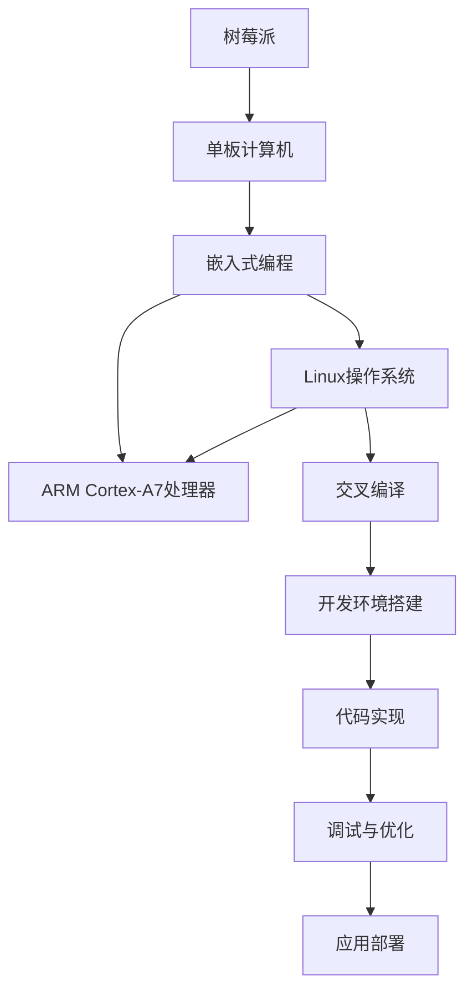

                 

# 树莓派编程：基于 Linux 的单板计算机

> 关键词：树莓派、单板计算机、Linux、嵌入式编程、计算机编程、系统配置、应用开发

## 1. 背景介绍

### 1.1 问题由来
在当今智能硬件日益普及的趋势下，人们越来越希望能在更小、更便宜、更灵活的设备上运行自己的应用，而不受传统PC的束缚。树莓派（Raspberry Pi）就是这类单板计算机（Single Board Computer, SBC）的代表之一。作为一种低成本、功能强大的嵌入式设备，树莓派以其开源的精神和广泛的应用场景，成为了硬件爱好者、科研人员和开发者们的首选平台。

树莓派于2012年首次发布，其核心硬件是带有ARM Cortex-A7处理器的单板计算机。经过多年的迭代发展，当前树莓派系列设备已支持多款处理器和操作系统，能够满足从教育、实验到生产的各种需求。

### 1.2 问题核心关键点
树莓派编程的独特之处在于其基于Linux操作系统的环境。Linux作为一种自由、开放的操作系统，提供了丰富的编程接口和软件生态，使得树莓派不仅可用于嵌入式系统开发，还能运行各类高级编程语言和应用程序。

树莓派编程的核心关键点包括：
- 选择合适的树莓派模型和处理器。
- 安装配置操作系统和开发环境。
- 编写和调试嵌入式系统代码。
- 开发跨平台的应用程序。
- 利用丰富的软件生态进行项目扩展。

## 2. 核心概念与联系

### 2.1 核心概念概述

要深入了解树莓派编程，首先需要理解以下几个核心概念：

- **树莓派（Raspberry Pi）**：一种小型的、基于ARM架构的单板计算机，旨在为教育、科研和消费市场提供低成本的硬件平台。
- **单板计算机（Single Board Computer, SBC）**：一种集成处理器、存储、接口等组件，能够在最小化尺寸和成本的同时提供强大计算能力的计算机设备。
- **嵌入式编程（Embedded Programming）**：指在特定硬件平台（如树莓派）上开发和调试软件程序的过程。
- **Linux操作系统**：一种自由和开源的类Unix操作系统，广泛应用于树莓派等单板计算机。
- **ARM Cortex-A7处理器**：树莓派常用的嵌入式处理器，支持高效的多任务处理和低功耗设计。
- **交叉编译（Cross Compilation）**：指在目标平台上编译代码，以生成可在树莓派上运行的机器码的过程。

这些概念之间的联系可以通过以下Mermaid流程图来展示：



这个流程图展示了树莓派编程的主要流程，包括硬件选择、操作系统安装、编程环境配置、代码编写和调试、应用部署等步骤。

## 3. 核心算法原理 & 具体操作步骤
### 3.1 算法原理概述

树莓派编程主要涉及到嵌入式系统开发和Linux应用编程。嵌入式系统编程通常需要利用RTOS（实时操作系统）和驱动程序来实现硬件与软件的交互，而Linux应用编程则侧重于利用各种标准库和工具进行软件开发。

核心算法原理包括：
- 利用RTOS实现多任务调度。
- 编写底层驱动程序来控制硬件接口。
- 使用C语言进行系统级编程。
- 利用Python等高级语言进行应用开发。
- 利用交叉编译工具生成可执行文件。

### 3.2 算法步骤详解

树莓派编程的具体操作步骤可以分为以下五个步骤：

**Step 1: 硬件选择与准备**
- 根据需求选择合适的树莓派模型（如Raspberry Pi 3B+、4、Zero、B+等）。
- 准备SD卡、microSD卡套、连接线等配件，确保设备能够正常工作。

**Step 2: 安装配置Linux系统**
- 使用树莓派官网提供的映像文件（如Raspberry Pi OS）烧录到SD卡中。
- 将SD卡插入树莓派，通过HDMI连接到显示器，完成系统启动。
- 通过SSH连接树莓派，修改密码等必要配置。

**Step 3: 开发环境搭建**
- 安装开发所需的IDE（如Visual Studio Code）和交叉编译工具链（如arm-linux-gnueabihf-gcc）。
- 配置环境变量，使IDE能够找到编译器和库文件。
- 安装必要的软件包（如libgpiod-dev、libsdl2-dev等），用于访问硬件资源和图形界面开发。

**Step 4: 编写和调试代码**
- 编写C或C++代码实现特定功能，利用RTOS调度进行多任务处理。
- 通过调试器（如gdb）进行代码调试，确保程序无错误。
- 利用测试框架（如gtest）编写单元测试，确保程序的正确性。

**Step 5: 应用部署和发布**
- 将编译好的二进制文件（如可执行文件、动态库等）复制到树莓派。
- 通过shell脚本或系统服务，启动程序并设置自启动。
- 对程序进行监控和优化，确保系统稳定运行。
- 发布文档和代码，便于其他用户参考和修改。

### 3.3 算法优缺点

树莓派编程的优点包括：
- 低成本：树莓派硬件价格低廉，适合作为教学和实验设备。
- 开源性：基于Linux和ARM架构，用户可以自由修改和扩展。
- 广泛应用：树莓派应用领域广泛，从物联网到桌面应用，均有涉及。
- 社区支持：树莓派拥有庞大的用户社区和丰富的资源，便于学习和交流。

但同时也存在一些缺点：
- 性能受限：树莓派处理能力有限，不适合高性能计算任务。
- 学习曲线陡峭：嵌入式编程和Linux编程需要一定的技术基础。
- 软硬件限制：树莓派设备硬件和操作系统版本固定，难以升级。
- 生态系统不完善：相比于PC，树莓派的生态系统和软件工具还不够成熟。

### 3.4 算法应用领域

树莓派编程的应用领域包括：
- 嵌入式系统开发：利用树莓派进行硬件驱动程序和RTOS开发。
- 图形界面编程：利用Python和Pygame等工具开发GUI应用程序。
- 数据科学和机器学习：利用树莓派进行数据分析和模型训练。
- 物联网（IoT）：利用树莓派作为控制节点，实现远程监控和自动化。
- 嵌入式网站开发：利用树莓派作为服务器，搭建小型网站。
- 教育和实验：利用树莓派进行编程教学和实验，培养学生兴趣和能力。

## 4. 数学模型和公式 & 详细讲解  
### 4.1 数学模型构建

在嵌入式编程中，常见的数学模型包括：
- 实时系统调度算法：如Round Robin、Priority Scheduling等，用于优化多任务处理。
- 信号量与锁机制：如Semaphores、Mutexes，用于同步和互斥访问共享资源。
- 队列与缓冲区：如FIFO队列、环形缓冲区，用于高效处理数据流。

以Round Robin调度算法为例，其数学模型可表示为：
- 时间片大小 $T$。
- 系统中有 $N$ 个任务 $P_1, P_2, ..., P_N$。
- 每个任务在一个时间片内的运行时间为 $C_i$。
- 整个系统的时间片轮转周期 $T_{total}$。

根据该模型，时间片轮转周期 $T_{total}$ 可以表示为：
$$
T_{total} = \frac{\sum_{i=1}^N C_i}{N} \times T
$$

### 4.2 公式推导过程

Round Robin算法的基本思想是每个任务都分到固定的时间片，轮流执行，直到完成。时间片轮转周期的推导可以进一步细化为：
- 假设任务 $P_i$ 运行了 $k$ 个时间片，剩余运行时间为 $C_i - kT$。
- 整个系统的运行时间 $T_{total}$ 为 $k$ 个任务执行时间片之和加上剩余运行时间。

因此，每个任务的运行时间为：
$$
C_i = kT + C_i - kT = C_i - (k-1)T
$$

令 $C_i = kT + (C_i - kT)$，则有：
$$
T = \frac{C_i}{k} = \frac{\sum_{i=1}^N C_i}{N}
$$

综上，系统的时间片轮转周期 $T_{total}$ 可表示为：
$$
T_{total} = \frac{\sum_{i=1}^N C_i}{N} \times T
$$

### 4.3 案例分析与讲解

以树莓派上的HTTP服务器为例，其时间片轮转周期计算如下：
- 假设树莓派上运行了2个任务，每个任务需要处理请求并返回响应。
- 每个任务处理请求和返回响应所需时间为 $C_1 = 0.2s$ 和 $C_2 = 0.5s$。
- 时间片大小 $T = 0.01s$。

根据上述模型，整个系统的时间片轮转周期 $T_{total}$ 为：
$$
T_{total} = \frac{C_1 + C_2}{2} \times T = \frac{0.2s + 0.5s}{2} \times 0.01s = 0.11s
$$

该计算结果表明，树莓派上的HTTP服务器需要每秒处理 $\frac{1}{0.11} \approx 9$ 个请求，才能保证任务的平稳运行。

## 5. 项目实践：代码实例和详细解释说明
### 5.1 开发环境搭建

树莓派编程的开发环境搭建步骤如下：

**Step 1: 硬件准备**
- 将树莓派3B+插入SD卡槽，连接电源和显示器。
- 通过HDMI线连接显示器和树莓派。
- 连接以太网或无线网，配置静态IP地址。

**Step 2: 操作系统安装**
- 从树莓派官网下载Raspberry Pi OS镜像文件，使用SD卡烧录工具（如Balena Etcher）将其烧录到SD卡中。
- 将SD卡插入树莓派，完成系统启动。
- 通过SSH连接树莓派，设置新用户的密码（如pi）和管理员密码（如raspberrypi）。

**Step 3: 开发环境配置**
- 安装Visual Studio Code IDE，安装C++插件和Python插件。
- 安装交叉编译工具链（如arm-linux-gnueabihf-gcc），配置环境变量。
- 安装必要的软件包（如libgpiod-dev、libsdl2-dev等），配置依赖库。
- 通过make命令交叉编译程序，生成树莓派可执行文件。

**Step 4: 代码实现**
- 编写C++程序，利用RTOS调度进行多任务处理，例如定时器中断、串口通信、网络请求等。
- 利用gdb进行代码调试，查看变量和状态，定位问题。
- 编写单元测试程序，使用gtest框架进行自动化测试，确保程序正确性。

**Step 5: 应用部署**
- 将编译好的可执行文件（如hello_world）复制到树莓派。
- 编写启动脚本，通过systemd服务自动启动程序。
- 使用rc.local配置自启动，确保程序开机即运行。
- 对程序进行监控和优化，确保系统稳定运行。
- 发布文档和代码，便于其他用户参考和修改。

### 5.2 源代码详细实现

以下是一个简单的树莓派程序，用于读取串口数据并输出：

**Hello World程序**

```c++
#include <stdio.h>
#include <unistd.h>
#include <termios.h>
#include <fcntl.h>

int main() {
    int fd = open("/dev/ttyACM0", O_RDWR);
    if (fd < 0) {
        perror("open error");
        return 1;
    }

    struct termios port;
    if (tcgetattr(fd, &port) < 0) {
        perror("tcgetattr error");
        return 1;
    }

    // 配置串口参数
    port.c_cflag = 0;
    port.c_cc[VMIN] = 0;
    port.c_cc[VTIME] = 0;
    if (tcsetattr(fd, TCSANOW, &port) < 0) {
        perror("tcsetattr error");
        return 1;
    }

    char buffer[1024];
    while (read(fd, buffer, sizeof(buffer)) > 0) {
        printf("%s", buffer);
    }

    close(fd);
    return 0;
}
```

### 5.3 代码解读与分析

**Hello World程序解析**

1. **打开串口文件**：使用`open`函数打开树莓派上的串口文件（例如`/dev/ttyACM0`），设置文件描述符`fd`。
2. **获取串口参数**：使用`tcgetattr`函数获取当前串口参数，存储到结构体`port`中。
3. **配置串口参数**：将`port.c_cflag`设置为0，将`port.c_cc[VMIN]`和`port.c_cc[VTIME]`设置为0，关闭缓冲区，确保数据即时读取。
4. **读取和输出数据**：使用`read`函数从串口读取数据，存储到`buffer`数组中，并打印输出。
5. **关闭串口文件**：使用`close`函数关闭串口文件。

该程序展示了树莓派编程的基础操作，包括文件打开、读取和关闭，以及串口配置和数据处理。

## 6. 实际应用场景

### 6.1 智能家居系统

树莓派可以作为智能家居系统的核心控制器，实现对家中各种设备的自动化控制。通过树莓派，用户可以编写程序控制灯光、温控器、摄像头等设备，实现安防监控、节能环保等功能。

例如，树莓派上的程序可以通过读取传感器数据，判断家庭环境状况，自动调节温度和灯光，确保舒适度和安全。同时，树莓派可以连接互联网，通过远程访问方式，用户即使不在家中，也能实时监控家中的情况，并远程控制家居设备。

### 6.2 科学教育平台

树莓派可以用于科学教育平台的搭建，为学生提供实践机会，培养学生的编程能力和科学素养。通过树莓派，学生可以动手实验嵌入式编程、图形界面设计、硬件控制等技术，形成项目经验。

例如，树莓派可以用于传感器数据分析、机器人控制、电路设计等实验，学生可以编写程序实现特定的功能，通过实验结果的反馈，不断优化程序，提高动手能力。

### 6.3 工业物联网

树莓派可以作为工业物联网（IIoT）中的控制节点，实现对工业设备的远程监控和自动化控制。树莓派的高性能和低成本特性，使其成为工业物联网理想的硬件平台。

例如，树莓派可以用于实时采集工厂设备的运行数据，分析设备状态，自动调整运行参数，保障生产稳定。同时，树莓派可以连接到互联网，实现远程故障诊断和维护，提高生产效率。

### 6.4 未来应用展望

随着树莓派设备的不断升级和功能扩展，其在实际应用场景中的应用前景将更加广泛。未来，树莓派有望在以下几个方向得到更深入的应用：

1. 智能家居：树莓派作为家居系统的核心控制器，可以实现更多的智能功能，提升家庭生活质量。
2. 科学教育：树莓派作为教育平台的核心设备，将提供更多的实践机会，培养更多高素质的科技人才。
3. 工业物联网：树莓派在工业物联网中发挥重要作用，提高生产效率，降低成本。
4. 消费电子产品：树莓派作为消费电子产品（如智能穿戴设备、智能玩具等）的控制核心，实现个性化定制。
5. 移动设备：树莓派作为移动设备的处理器，实现更强大的计算和控制能力，拓展移动设备的智能应用场景。

## 7. 工具和资源推荐

### 7.1 学习资源推荐

为了帮助开发者系统掌握树莓派编程的理论基础和实践技巧，以下是一些优质的学习资源：

1. **Raspberry Pi官网**：提供丰富的文档、教程、代码示例，是树莓派编程的官方资源。
2. **树莓派学习社区（Raspberry Pi Forums）**：包含丰富的用户经验分享、技术讨论，是树莓派编程的交流平台。
3. **树莓派官方手册**：详细的硬件、软件配置指南，适合初学者参考。
4. **树莓派开发板教程**：通过实际操作，讲解树莓派编程的各个步骤，适合动手实践。
5. **树莓派编程指南**：深入浅出地介绍树莓派编程的基础知识和高级技巧，适合进阶学习。
6. **树莓派编程实战**：通过项目实战，讲解树莓派编程的实际应用，适合综合练习。

通过对这些资源的学习实践，相信你一定能够快速掌握树莓派编程的精髓，并用于解决实际的嵌入式系统问题。

### 7.2 开发工具推荐

树莓派编程的开发工具推荐如下：

1. **Visual Studio Code（VS Code）**：功能强大的编程IDE，支持多种编程语言和工具链。
2. **SSH客户端**：如SSH Client，用于远程连接和调试树莓派。
3. **交叉编译工具链（arm-linux-gnueabihf-gcc）**：用于在树莓派上编译代码。
4. **Linux发行版**：如Raspberry Pi OS，提供树莓派的完整操作系统环境。
5. **RTOS系统**：如FreeRTOS、µC/OS，用于实时系统编程。
6. **嵌入式调试器（gdb）**：用于程序调试和错误定位。
7. **测试框架（gtest）**：用于编写和运行单元测试，确保程序正确性。

合理利用这些工具，可以显著提升树莓派编程的开发效率，加快创新迭代的步伐。

### 7.3 相关论文推荐

树莓派编程的深入研究可以参考文献如下：

1. **嵌入式系统设计与应用**：讲解树莓派的硬件设计和嵌入式系统编程。
2. **Raspberry Pi编程实践**：介绍树莓派的安装、配置和编程技巧。
3. **树莓派物联网应用**：讲解树莓派在物联网中的应用场景和开发方法。
4. **树莓派科学教育**：探讨树莓派在科学教育中的实践应用和教育效果。
5. **树莓派编程案例分析**：通过具体案例，讲解树莓派的编程实现和优化技巧。

这些论文代表了大语言模型微调技术的发展脉络，值得深入阅读和学习。

## 8. 总结：未来发展趋势与挑战

### 8.1 总结

本文对树莓派编程进行了全面系统的介绍。首先阐述了树莓派编程的背景和核心关键点，明确了树莓派编程在嵌入式系统开发、Linux应用编程等方面的独特价值。其次，从原理到实践，详细讲解了树莓派编程的数学模型和具体操作步骤，给出了树莓派编程的完整代码实例。同时，本文还广泛探讨了树莓派编程在智能家居、科学教育、工业物联网等领域的实际应用前景，展示了树莓派编程的广泛应用场景。最后，本文精选了树莓派编程的学习资源、开发工具和相关论文，力求为读者提供全方位的技术指引。

通过本文的系统梳理，可以看到，树莓派编程正逐渐成为嵌入式系统开发和Linux应用编程的重要范式，极大地拓展了树莓派设备的用途和功能。受益于树莓派的低成本、开源性和广泛应用，未来树莓派编程必将在嵌入式系统、科学教育、工业物联网等领域带来更多创新和突破。

### 8.2 未来发展趋势

展望未来，树莓派编程将呈现以下几个发展趋势：

1. **硬件升级**：随着树莓派设备的不断迭代，新的处理器和硬件平台将带来更高的性能和更丰富的功能。
2. **操作系统优化**：树莓派OS的不断优化，将提高系统的稳定性和用户体验。
3. **软件生态扩展**：更多的软件包和应用将支持树莓派，丰富开发者的选择。
4. **交叉编译改进**：交叉编译工具的不断优化，将提高程序的编译速度和性能。
5. **硬件资源整合**：树莓派的硬件资源将更全面地被利用，如摄像头、传感器、WiFi模块等。
6. **工业标准对接**：树莓派将更多地符合工业标准，提高其在商业环境中的适用性。

以上趋势凸显了树莓派编程的广阔前景。这些方向的探索发展，必将进一步提升树莓派系统的性能和应用范围，为嵌入式系统开发带来更多创新和突破。

### 8.3 面临的挑战

尽管树莓派编程已经取得了瞩目成就，但在迈向更加智能化、普适化应用的过程中，它仍面临着诸多挑战：

1. **性能瓶颈**：树莓派处理能力有限，不适合高性能计算任务，可能限制其应用范围。
2. **软件生态不完善**：尽管已有丰富的软件资源，但树莓皮的生态系统仍需进一步完善，满足更多应用需求。
3. **硬件兼容问题**：新发布的树莓派设备可能与现有软件不兼容，需不断进行兼容性测试。
4. **开发难度**：嵌入式系统开发难度较大，需具备一定的硬件和软件知识。
5. **用户社区维护**：树莓派社区需不断活跃，吸引更多开发者参与，提供技术支持。
6. **硬件成本**：尽管树莓派硬件成本较低，但仍需考虑到高成本软件的引入。

这些挑战仍需通过持续的技术创新和社区支持来解决，树莓派编程才能在更广泛的场景下发挥作用。

### 8.4 研究展望

面对树莓派编程所面临的挑战，未来的研究需要在以下几个方面寻求新的突破：

1. **硬件优化**：开发更高效、更稳定的树莓派硬件平台，满足更多应用需求。
2. **操作系统改进**：进一步优化树莓派OS，提升系统的稳定性和用户体验。
3. **软件扩展**：引入更多开源软件包和应用，丰富树莓派编程的选择。
4. **交叉编译优化**：进一步提高交叉编译工具的效率，提升编译速度和性能。
5. **硬件资源整合**：将更多硬件资源整合到树莓派中，拓展应用场景。
6. **工业标准对接**：使树莓派更多地符合工业标准，提高在商业环境中的适用性。
7. **嵌入式编程优化**：提高嵌入式编程的效率和可靠性，降低开发难度。

这些研究方向的探索，必将引领树莓派编程技术迈向更高的台阶，为嵌入式系统开发带来更多创新和突破。

## 9. 附录：常见问题与解答

**Q1：树莓派编程和PC编程有何不同？**

A: 树莓派编程和PC编程的主要区别在于硬件平台和操作系统。树莓派编程需要考虑硬件资源限制、RTOS调度、硬件驱动等问题，而PC编程则侧重于系统级编程和高级语言应用。树莓派编程需要更多的底层知识和实际操作，但也能带来更广泛的嵌入式系统开发经验。

**Q2：树莓派编程需要掌握哪些编程语言？**

A: 树莓派编程需要掌握C、C++、Python等多种编程语言。C和C++主要用于系统级编程和嵌入式开发，Python则适用于图形界面设计和应用开发。掌握这些语言，能更好地应对树莓派编程中的各种需求。

**Q3：树莓派编程需要掌握哪些硬件知识？**

A: 树莓派编程需要掌握基本的硬件知识，如处理器架构、接口协议、内存管理等。树莓派硬件包括处理器、内存、存储、接口等，了解其工作原理和使用方法，能更好地进行硬件驱动和编程。

**Q4：树莓派编程的开发工具有哪些？**

A: 树莓派编程的开发工具包括Visual Studio Code、SSH客户端、交叉编译工具链、RTOS系统、嵌入式调试器、测试框架等。合理利用这些工具，能显著提升树莓派编程的开发效率和程序质量。

**Q5：树莓派编程的实际应用有哪些？**

A: 树莓派编程的实际应用包括智能家居、科学教育、工业物联网、消费电子产品、移动设备等。通过树莓派编程，开发者可以开发出各种应用，满足不同领域的实际需求。

---

作者：禅与计算机程序设计艺术 / Zen and the Art of Computer Programming

