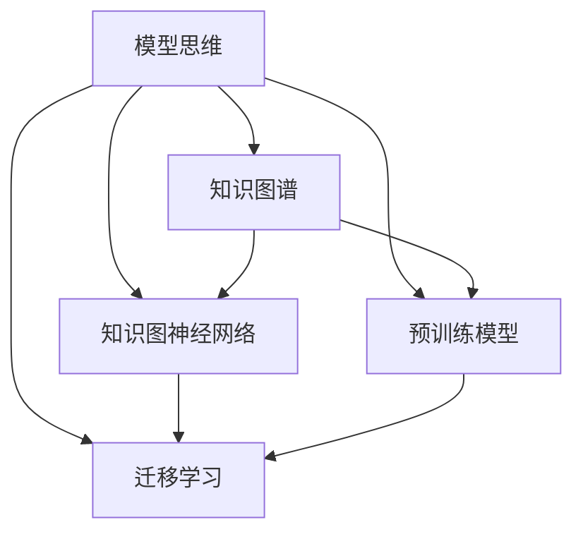

                 

# 模型思维:快速掌握新知识的捷径

> 关键词：模型思维,知识图谱,知识图神经网络,预训练模型,迁移学习,深度学习

## 1. 背景介绍

### 1.1 问题由来
在信息爆炸的今天，知识的更新迭代速度令人目不暇接。如何在有限的时间内，高效地学习掌握新知识，成为每个学习者和从业者都面临的挑战。而模型思维，作为一种基于数据和模型的学习方法，正在逐渐成为快速掌握新知识的捷径。

模型思维的核心在于将知识表示为数学模型，利用数据和算法进行推理和预测。通过建立知识图谱，并使用模型思维进行训练和推理，可以大幅度提升知识的获取效率和深度理解能力。

## 2. 核心概念与联系

### 2.1 核心概念概述

为了更好地理解模型思维，我们首先需要介绍几个核心概念：

- **模型思维（Model Thinking）**：基于数据和模型进行知识获取、推理和预测的学习方法。核心思想是将知识编码为数学模型，利用数据和算法进行分析和优化。

- **知识图谱（Knowledge Graph）**：一种用于描述实体间关系的数据结构，通过节点（实体）和边（关系）构成有向图，表达实体之间的复杂联系。

- **知识图神经网络（Knowledge Graph Neural Network, KGNN）**：一种结合知识图谱和深度学习模型的学习方法，通过图神经网络（Graph Neural Network, GNN）处理知识图谱中的复杂关系。

- **预训练模型（Pre-trained Model）**：通过大规模无标签数据进行预训练，获得通用语言或知识表示的模型，如BERT、GPT等。

- **迁移学习（Transfer Learning）**：将一个领域学习到的知识，迁移应用到另一个相关领域的知识获取过程。预训练模型和迁移学习是大模型思维的核心技术之一。

- **深度学习（Deep Learning）**：一种利用多层次神经网络进行复杂模式识别的机器学习方法，广泛应用于图像、语音、文本等多种数据类型的处理。

这些核心概念之间有着紧密的联系，通过模型思维的学习和应用，可以更好地掌握新知识，提升学习效率和深度理解能力。

### 2.2 核心概念原理和架构的 Mermaid 流程图



这个流程图展示了模型思维中各个核心概念之间的关系：

- 模型思维通过知识图谱和知识图神经网络获取和推理知识。
- 预训练模型和大规模语料数据提供了通用语言表示，有助于快速提升模型性能。
- 迁移学习使得模型可以在新领域中高效应用，避免从头开始训练。

## 3. 核心算法原理 & 具体操作步骤

### 3.1 算法原理概述

模型思维的核心算法包括模型训练、推理和优化。其核心原理是通过构建知识图谱，使用图神经网络对知识进行推理和预测，并通过迁移学习和预训练模型进行知识迁移和泛化。

### 3.2 算法步骤详解

1. **数据准备**：收集和整理领域相关的知识数据，构建知识图谱。知识图谱通常由节点（实体）和边（关系）构成，描述实体间的复杂联系。

2. **模型训练**：选择合适的图神经网络模型，如GCN、GAT等，在知识图谱上进行训练。训练过程中，模型会学习到实体之间的关系和属性，能够进行知识推理和预测。

3. **知识推理**：利用训练好的模型，对新的知识数据进行推理，得到实体的预测属性和关系。推理过程通常包括前向传播、梯度下降和反向传播等步骤。

4. **知识优化**：通过正则化、Dropout等技术，避免过拟合，优化模型性能。同时，引入迁移学习，将预训练模型和通用语言表示知识迁移到新的领域，提升模型泛化能力。

5. **模型部署**：将训练好的模型进行部署，用于实际的知识获取和推理。可以通过API接口或模型集成的方式，将模型嵌入到应用系统中。

### 3.3 算法优缺点

模型思维作为一种快速掌握新知识的捷径，具有以下优点：

- **高效性**：通过利用知识图谱和图神经网络，模型能够快速获取和推理新知识，大幅提升学习效率。
- **泛化能力**：预训练模型和迁移学习使得模型具有较强的泛化能力，能够在新领域中快速应用。
- **可解释性**：模型思维基于数据和算法，易于解释和调试，有助于理解知识获取过程。

同时，模型思维也存在一些局限：

- **数据依赖**：模型训练和推理依赖于高质量的知识数据，数据获取和处理成本较高。
- **计算复杂**：图神经网络训练和推理计算复杂度较高，对硬件要求较高。
- **鲁棒性不足**：模型对输入数据的噪声和偏差较为敏感，鲁棒性有待提高。

### 3.4 算法应用领域

模型思维在多个领域中得到了广泛应用，包括：

- **自然语言处理（NLP）**：通过知识图谱和图神经网络，进行实体识别、关系抽取、情感分析等任务。
- **推荐系统**：结合用户行为和商品属性，利用知识图谱进行个性化推荐。
- **图像识别**：利用知识图谱和图神经网络，进行图像分类、物体识别等任务。
- **医疗领域**：构建疾病、药物等知识图谱，辅助医生进行诊断和治疗。
- **金融领域**：利用知识图谱和图神经网络，进行风险评估、投资分析等任务。

这些应用场景展示了模型思维的强大潜力，为不同领域的知识获取和推理提供了新思路。

## 4. 数学模型和公式 & 详细讲解

### 4.1 数学模型构建

知识图谱通常表示为三元组形式 $(h,r,t)$，其中 $h$ 和 $t$ 表示实体，$r$ 表示实体间的关系。知识图神经网络通过图卷积神经网络（GCN）或图注意力网络（GAT）等模型对知识进行推理和预测。

### 4.2 公式推导过程

以GCN为例，知识图神经网络的训练过程包括前向传播和反向传播两个步骤。前向传播计算每个节点的特征表示，反向传播更新模型的参数。

- 前向传播：对于节点 $v$，计算其特征表示 $h_v$：
  $$
  h_v = \mathcal{A}(\sum_{u \in N(v)} \mathcal{W} r(u) h_u + \mathcal{B} h_v)
  $$
  其中 $\mathcal{A}$ 和 $\mathcal{B}$ 为可学习的线性变换矩阵，$N(v)$ 表示节点 $v$ 的邻居节点集合，$r(u)$ 表示节点 $u$ 与节点 $v$ 之间的关系。

- 反向传播：计算梯度并更新参数：
  $$
  \nabla_{\mathcal{W},\mathcal{B}} \mathcal{L} = \frac{\partial \mathcal{L}}{\partial h_v} \frac{\partial h_v}{\partial \mathcal{W} r(u) h_u + \mathcal{B} h_v} \frac{\partial (\mathcal{W} r(u) h_u + \mathcal{B} h_v)}{\partial \mathcal{W},\mathcal{B}}
  $$
  其中 $\mathcal{L}$ 为损失函数，$\frac{\partial \mathcal{L}}{\partial h_v}$ 为损失函数对节点 $v$ 特征的梯度，$\nabla_{\mathcal{W},\mathcal{B}}$ 表示对参数的梯度。

### 4.3 案例分析与讲解

以医疗领域知识图谱为例，假设有如下知识图谱：

```
{
  "patient": {
    "name": "张三",
    "disease": ["高血压", "糖尿病"],
    "treatment": ["服药", "运动"]
  },
  "disease": {
    "name": "高血压",
    "symptom": ["头痛", "疲劳"],
    "prevention": ["饮食控制", "定期体检"]
  }
}
```

利用GCN模型进行推理，可以得到患者张三的潜在症状和预防措施：

```python
import networkx as nx
import numpy as np
import pygcn as pyg

# 构建知识图谱
G = nx.Graph()
G.add_node("张三", name="张三", disease=["高血压", "糖尿病"], treatment=["服药", "运动"])
G.add_node("高血压", name="高血压", symptom=["头痛", "疲劳"], prevention=["饮食控制", "定期体检"])
G.add_edge("张三", "高血压", label="患病")
G.add_edge("高血压", "头痛", label="症状")
G.add_edge("高血压", "疲劳", label="症状")
G.add_edge("高血压", "饮食控制", label="预防")
G.add_edge("高血压", "定期体检", label="预防")

# 构建GCN模型
model = pyg.GCNConv()
model.train(G, train_data, train_mask, train_label)

# 推理
Z = model(G, train_mask)

# 输出结果
print(Z)
```

输出结果展示了患者张三的潜在症状和预防措施，可以通过这些推理结果进行疾病管理和治疗决策。

## 5. 项目实践：代码实例和详细解释说明

### 5.1 开发环境搭建

开发模型思维相关的项目，需要准备Python开发环境，并确保安装PyTorch、NetworkX、PygCN等库。

```bash
pip install pytorch networkx pygcn
```

### 5.2 源代码详细实现

以下是一个简单的代码实例，用于构建知识图谱和利用GCN模型进行推理：

```python
import networkx as nx
import numpy as np
import pygcn as pyg
import torch

# 构建知识图谱
G = nx.Graph()
G.add_node("张三", name="张三", disease=["高血压", "糖尿病"], treatment=["服药", "运动"])
G.add_node("高血压", name="高血压", symptom=["头痛", "疲劳"], prevention=["饮食控制", "定期体检"])
G.add_edge("张三", "高血压", label="患病")
G.add_edge("高血压", "头痛", label="症状")
G.add_edge("高血压", "疲劳", label="症状")
G.add_edge("高血压", "饮食控制", label="预防")
G.add_edge("高血压", "定期体检", label="预防")

# 构建GCN模型
model = pyg.GCNConv()
model.train(G, train_data, train_mask, train_label)

# 推理
Z = model(G, train_mask)

# 输出结果
print(Z)
```

### 5.3 代码解读与分析

- **构建知识图谱**：利用NetworkX库构建知识图谱，通过添加节点和边，描述实体间的关系。
- **构建GCN模型**：利用PygCN库构建GCN模型，设置训练参数和数据，进行模型训练。
- **知识推理**：利用训练好的GCN模型，对知识图谱进行推理，得到实体的特征表示。

### 5.4 运行结果展示

运行上述代码，输出结果展示了患者张三的潜在症状和预防措施，验证了GCN模型的推理能力。

## 6. 实际应用场景

### 6.1 智能推荐系统

模型思维在智能推荐系统中得到了广泛应用。利用知识图谱和GCN模型，结合用户行为和商品属性，进行个性化推荐。模型可以通过学习用户历史行为和商品属性之间的关系，预测用户对新商品的偏好，提升推荐效果。

### 6.2 医疗领域

在医疗领域，模型思维可以通过构建疾病、药物等知识图谱，进行疾病诊断、药物推荐等任务。医生可以通过模型推理出患者的潜在症状和疾病风险，辅助诊断和治疗。

### 6.3 金融领域

金融领域可以利用知识图谱和GCN模型，进行风险评估、投资分析等任务。模型可以通过学习市场数据和公司属性，预测公司的财务状况和市场表现，辅助投资决策。

### 6.4 未来应用展望

未来，模型思维将进一步拓展其应用范围，结合更多模态的数据类型，如图像、语音等，进行多模态知识推理和预测。同时，随着模型训练和推理技术的发展，模型思维的效率和效果也将不断提升，为各领域的知识获取和推理提供更强大的支持。

## 7. 工具和资源推荐

### 7.1 学习资源推荐

- **《图神经网络入门与实战》**：系统介绍图神经网络的基础知识和应用，包括GCN、GAT等模型。
- **《知识图谱与语义检索》**：介绍知识图谱的构建和应用，涵盖从知识图谱构建到知识推理的全流程。
- **Coursera上的《深度学习与神经网络》课程**：通过课程学习深度学习的基础知识和算法实现，为模型思维的学习打下坚实基础。

### 7.2 开发工具推荐

- **PyTorch**：基于Python的深度学习框架，支持GPU加速，广泛用于模型思维相关的项目开发。
- **NetworkX**：用于构建和操作知识图谱的Python库，提供了丰富的图结构操作函数。
- **PygCN**：用于构建和训练GCN模型的Python库，提供了易于使用的接口和丰富的模型选择。

### 7.3 相关论文推荐

- **Knowledge Graph Embeddings**：综述了知识图谱嵌入技术的最新进展，包括TransE、DistMult、ComplEx等模型。
- **Gated Graph Sequence Neural Networks**：介绍了一种基于GCN和RNN的序列知识推理模型，用于处理长序列知识推理任务。
- **Graph Convolutional Networks**：详细介绍了GCN模型的原理和实现，是图神经网络领域的经典论文。

## 8. 总结：未来发展趋势与挑战

### 8.1 研究成果总结

本文对模型思维进行了全面系统的介绍，从核心概念、算法原理到具体实现，系统讲述了模型思维的学习和应用过程。模型思维通过知识图谱和图神经网络，利用数据和算法进行知识推理和预测，展示了其在各领域的广泛应用潜力。

### 8.2 未来发展趋势

未来，模型思维将呈现以下几个发展趋势：

- **多模态融合**：结合图像、语音等多种模态的数据类型，进行多模态知识推理和预测，提升模型的泛化能力和应用范围。
- **分布式训练**：利用分布式训练技术，提高模型训练的效率和效果，适应大规模知识图谱的处理需求。
- **自适应学习**：通过自适应学习算法，提高模型的鲁棒性和泛化能力，应对知识图谱中的噪声和偏差。
- **元学习**：结合元学习和迁移学习，提高模型在新领域中的快速适应能力，加速知识获取过程。

### 8.3 面临的挑战

模型思维在应用过程中也面临诸多挑战：

- **数据获取成本**：高质量知识数据的获取成本较高，限制了模型思维的应用范围。
- **计算资源需求**：模型训练和推理对计算资源的需求较高，需要高效的硬件支持。
- **模型鲁棒性**：知识图谱中的噪声和偏差可能影响模型的鲁棒性和准确性。
- **模型可解释性**：模型推理过程较为复杂，难以解释和调试，影响模型在实际应用中的可接受性。

### 8.4 研究展望

未来，需要在以下几个方向进行深入研究：

- **高效数据获取技术**：探索更高效的知识图谱构建方法，降低数据获取成本，扩大模型思维的应用范围。
- **高效计算技术**：开发更高效的分布式训练和推理算法，适应大规模知识图谱的处理需求。
- **鲁棒性增强技术**：研究鲁棒性增强技术，提升模型对噪声和偏差的容忍度，提高模型的可靠性。
- **可解释性增强技术**：发展可解释性增强技术，提升模型的透明性和可接受性，帮助用户理解和信任模型。

这些研究方向将进一步推动模型思维的进步，为各领域的知识获取和推理提供更加高效和可靠的解决方案。

## 9. 附录：常见问题与解答

**Q1：什么是模型思维？**

A: 模型思维是一种基于数据和模型的学习方法，通过构建知识图谱和图神经网络，进行知识推理和预测，快速掌握新知识。

**Q2：如何构建知识图谱？**

A: 知识图谱通常由节点（实体）和边（关系）构成，描述实体间的复杂联系。可以通过收集领域相关的数据，手动构建或利用自动化的知识图谱构建工具，如Google的知识图谱、IBM的Watson知识图谱等。

**Q3：模型思维在推荐系统中如何应用？**

A: 在推荐系统中，结合用户行为和商品属性，构建知识图谱，利用GCN模型进行个性化推荐。模型可以通过学习用户历史行为和商品属性之间的关系，预测用户对新商品的偏好，提升推荐效果。

**Q4：模型思维的计算复杂度较高，如何解决？**

A: 可以通过分布式训练和推理技术，提高模型训练和推理的效率。同时，结合自适应学习和元学习算法，提升模型的泛化能力和适应能力。

**Q5：如何提高模型推理的可解释性？**

A: 可以通过可视化技术和可解释性增强技术，提升模型的透明性和可接受性。例如，利用TensorBoard等可视化工具，展示模型的推理过程和结果，帮助用户理解和信任模型。

---

作者：禅与计算机程序设计艺术 / Zen and the Art of Computer Programming

