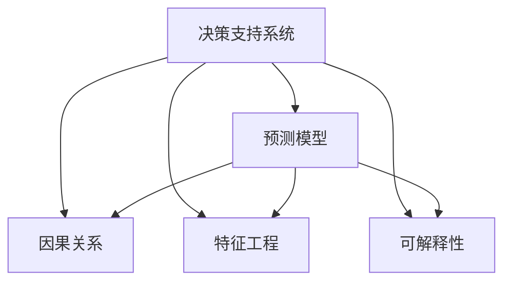

                 

# 模型思维在决策中的应用

> 关键词：模型思维, 决策支持系统, 预测模型, 因果关系, 决策树, 随机森林, 神经网络, 特征工程, 可解释性, 实际应用

## 1. 背景介绍

在现代社会，决策者面对的复杂性日增。无论在企业运营、金融投资、科学研究，还是日常生活中，都需要做出快速、精准、有依据的决策。传统的决策方式往往依赖直觉和经验，但在数据驱动、信息爆炸的时代，这种“拍脑袋”式的决策方式已经无法适应时代要求。为此，模型思维应运而生，通过构建和应用各类预测模型，为决策者提供可靠的数据支持和依据，帮助他们做出更为明智的选择。

### 1.1 问题由来

随着大数据和人工智能技术的飞速发展，模型思维在决策支持中的作用日益凸显。传统的决策过程往往缺乏系统化、数据化的支持，导致决策过程存在主观性和不确定性。而模型思维通过构建数学模型和数据模型，将决策问题转化为数学表达式，使决策过程更加科学、客观。在金融、医疗、交通、电商等多个领域，模型思维已经成为决策支持的重要工具。

### 1.2 问题核心关键点

模型思维在决策中的应用，主要包括以下几个核心关键点：

1. **数据驱动**：决策应基于大量实际数据，而非单凭经验。数据是模型思维的基础，数据的数量和质量直接影响模型效果的优劣。

2. **模型构建**：将决策问题转化为可量化的数学或统计模型，通过建模得出决策依据。模型构建过程中，要考虑模型选择、参数优化、数据预处理等多方面的技术细节。

3. **预测与评估**：利用构建的模型进行预测，评估不同决策路径下的可能结果。预测结果为决策提供量化依据，帮助决策者做出最优选择。

4. **决策实施与反馈**：将模型应用于实际决策，并根据实施结果进行反馈，不断调整和优化模型，以提升决策效果。

5. **可解释性与透明度**：模型的预测结果和决策依据应具有足够的可解释性，使决策者能够理解和信任模型输出。

通过明确这些关键点，可以更好地理解模型思维在决策中的应用流程和技巧。

## 2. 核心概念与联系

### 2.1 核心概念概述

为了更好地理解模型思维在决策中的应用，本节将介绍几个密切相关的核心概念：

- **决策支持系统(Decision Support System, DSS)**：一种基于计算机技术，集成数据、模型和专业知识，支持决策过程的信息系统。DSS通过自动化的数据处理和模型分析，辅助决策者做出科学决策。

- **预测模型(Prediction Model)**：用于预测未来事件或结果的数学模型。常见的预测模型包括线性回归、决策树、随机森林、神经网络等。

- **因果关系(Causal Relationship)**：指两个或多个变量之间存在的一种引发与被引发关系。因果关系在模型构建中尤为重要，能够帮助模型理解变量之间的内在联系。

- **特征工程(Feature Engineering)**：指对原始数据进行处理和转换，以生成更有用的特征。特征工程是模型构建的重要步骤，直接影响模型的预测效果。

- **可解释性(Interpretability)**：指模型输出应具备的易于理解和解释的特性。可解释性强的模型能够帮助决策者更好地理解决策依据，增强信任度。

这些核心概念之间的逻辑关系可以通过以下Mermaid流程图来展示：



这个流程图展示了一些关键概念及其之间的联系：

1. 决策支持系统集成了预测模型、因果关系、特征工程、可解释性等多个组件，为决策者提供全面的支持。
2. 预测模型基于因果关系和特征工程，帮助决策者理解变量之间的内在联系，预测未来事件。
3. 特征工程是预测模型的重要组成部分，通过处理和转换数据，生成更有用的特征。
4. 可解释性强的模型能够更好地解释预测结果，增强决策者的信任度。

这些概念共同构成了模型思维在决策中的应用框架，使决策过程更加科学、客观。

## 3. 核心算法原理 & 具体操作步骤
### 3.1 算法原理概述

模型思维在决策中的应用，本质上是通过构建和应用各类预测模型，辅助决策者做出科学决策。其核心思想是：

1. **数据收集与预处理**：收集和整理决策相关的数据，并进行数据清洗、归一化等预处理操作。
2. **模型构建与训练**：选择合适的模型架构，利用训练数据拟合模型参数，生成预测模型。
3. **预测与评估**：利用预测模型对新数据进行预测，并评估预测结果的准确性和可靠性。
4. **模型应用与调整**：将预测模型应用于实际决策，并根据反馈结果不断调整和优化模型。

### 3.2 算法步骤详解

基于模型思维的决策支持系统通常包括以下几个关键步骤：

**Step 1: 数据收集与预处理**
- 收集与决策问题相关的数据，包括历史数据、实时数据、预测数据等。
- 对数据进行清洗、去重、归一化、标准化等预处理操作，以提升数据质量。
- 根据数据特性选择合适的特征表示方法，如独热编码、词向量等。

**Step 2: 模型构建与训练**
- 选择合适的预测模型，如线性回归、决策树、随机森林、神经网络等。
- 根据模型架构和数据特性设计合适的损失函数和优化算法。
- 利用训练数据拟合模型参数，生成预测模型。

**Step 3: 预测与评估**
- 将预测模型应用于实际决策，生成预测结果。
- 利用测试数据评估预测结果的准确性和可靠性，如MAE、RMSE等指标。
- 对预测结果进行可视化展示，帮助决策者理解预测结果。

**Step 4: 模型应用与调整**
- 将预测模型应用于实际决策，进行业务测试。
- 根据反馈结果调整模型参数，优化模型性能。
- 定期更新训练数据，保持模型适应新数据的能力。

### 3.3 算法优缺点

模型思维在决策中的应用，具有以下优点：

1. **科学性**：模型思维通过数据和模型，使决策过程具有科学依据，减少主观性和不确定性。
2. **客观性**：模型预测结果基于数据和模型，能够客观反映决策结果。
3. **可重复性**：模型构建和应用过程可以重复进行，提升决策的可靠性和稳定性。
4. **灵活性**：根据不同决策需求，选择合适的模型架构和预测方法，灵活应对各种决策场景。

同时，模型思维在决策中也可能存在一些局限性：

1. **数据质量要求高**：模型的预测结果依赖于数据的质量，数据质量不高可能影响预测效果。
2. **模型复杂性高**：复杂的模型结构可能增加模型构建和维护的难度。
3. **可解释性不足**：一些复杂模型（如深度学习）难以解释其内部机制和预测依据，影响决策者的信任度。
4. **过拟合风险**：模型参数过多可能导致过拟合，泛化能力下降。
5. **实时性差**：部分模型计算量大，实时性较差，难以满足快速决策的需求。

尽管存在这些局限性，但模型思维在决策中的应用已经取得了显著成果，成为了决策支持的重要工具。

### 3.4 算法应用领域

模型思维在决策中的应用已经深入到多个领域，包括但不限于：

- **金融投资**：利用预测模型评估股票价格、市场趋势，辅助投资决策。
- **医疗健康**：基于预测模型诊断疾病、预测病情发展，辅助医疗决策。
- **零售电商**：利用预测模型分析用户行为、优化库存管理，提升销售效率。
- **智能交通**：基于预测模型优化交通流量、提高交通效率，辅助交通管理。
- **智能制造**：利用预测模型优化生产计划、降低成本，提升制造效率。

除了以上应用领域，模型思维还可以用于各类管理决策、社会治理等多个方面，展现出广阔的应用前景。

## 4. 数学模型和公式 & 详细讲解  
### 4.1 数学模型构建

在模型思维的决策支持系统中，常见的数学模型包括线性回归模型、决策树模型、随机森林模型、神经网络模型等。本节以线性回归模型为例，详细讲解其构建过程。

线性回归模型的目标是通过拟合数据，找到最优的线性函数关系，用于预测连续型目标变量。设模型为 $y=f(x;\theta)$，其中 $x$ 为自变量向量，$y$ 为目标变量向量，$\theta$ 为模型参数向量。

模型的损失函数为均方误差（Mean Squared Error, MSE），定义为：

$$
\mathcal{L}(\theta) = \frac{1}{2N}\sum_{i=1}^N (y_i - f(x_i;\theta))^2
$$

其中 $y_i$ 为目标变量，$f(x_i;\theta)$ 为模型预测值，$N$ 为样本数量。

模型的目标是最小化损失函数，即：

$$
\theta^* = \mathop{\arg\min}_{\theta} \mathcal{L}(\theta)
$$

### 4.2 公式推导过程

线性回归模型的参数优化通常使用梯度下降算法，其更新公式为：

$$
\theta \leftarrow \theta - \eta \nabla_{\theta}\mathcal{L}(\theta)
$$

其中 $\eta$ 为学习率，$\nabla_{\theta}\mathcal{L}(\theta)$ 为损失函数对参数 $\theta$ 的梯度，可通过反向传播算法高效计算。

线性回归模型的梯度更新公式为：

$$
\frac{\partial \mathcal{L}(\theta)}{\partial \theta_k} = -\frac{1}{N}\sum_{i=1}^N (y_i - f(x_i;\theta))x_{ik}
$$

其中 $x_{ik}$ 为自变量向量 $x_i$ 的第 $k$ 个元素，$f(x_i;\theta)$ 为模型预测值。

通过迭代更新参数 $\theta$，使模型能够拟合数据，生成预测值。

### 4.3 案例分析与讲解

假设某电商平台利用线性回归模型预测用户购买概率，其数据集为 $(x_i,y_i)$，其中 $x_i$ 为历史浏览、购买、评价等行为特征，$y_i$ 为是否购买（0或1）。

设线性回归模型为 $y_i = \theta_0 + \theta_1 x_{i1} + \theta_2 x_{i2} + \cdots + \theta_n x_{in}$。

利用梯度下降算法优化模型参数，步骤如下：

1. 初始化参数 $\theta$，设定学习率 $\eta$。
2. 对数据集进行分批次处理，计算每个批次的数据梯度。
3. 根据梯度更新参数 $\theta$，计算当前批次的目标函数值。
4. 重复步骤2-3，直到损失函数收敛。

通过不断迭代优化，模型能够拟合数据，生成准确的购买预测概率，辅助电商平台优化营销策略。

## 5. 项目实践：代码实例和详细解释说明
### 5.1 开发环境搭建

在进行模型思维的决策支持系统开发前，我们需要准备好开发环境。以下是使用Python进行Scikit-learn开发的环境配置流程：

1. 安装Anaconda：从官网下载并安装Anaconda，用于创建独立的Python环境。

2. 创建并激活虚拟环境：
```bash
conda create -n sklearn-env python=3.8 
conda activate sklearn-env
```

3. 安装Scikit-learn：
```bash
conda install scikit-learn
```

4. 安装各类工具包：
```bash
pip install numpy pandas matplotlib seaborn jupyter notebook ipython
```

完成上述步骤后，即可在`sklearn-env`环境中开始模型构建和测试。

### 5.2 源代码详细实现

下面我们以线性回归模型为例，给出使用Scikit-learn进行回归预测的Python代码实现。

首先，定义线性回归模型并进行数据处理：

```python
from sklearn.linear_model import LinearRegression
from sklearn.metrics import mean_squared_error
import numpy as np
import pandas as pd
import matplotlib.pyplot as plt

# 加载数据集
data = pd.read_csv('data.csv')

# 分离自变量和目标变量
X = data.drop('y', axis=1)
y = data['y']

# 标准化数据
X_scaled = (X - X.mean()) / X.std()

# 划分训练集和测试集
from sklearn.model_selection import train_test_split
X_train, X_test, y_train, y_test = train_test_split(X_scaled, y, test_size=0.2, random_state=42)

# 训练模型
model = LinearRegression()
model.fit(X_train, y_train)

# 预测并评估
y_pred = model.predict(X_test)
mse = mean_squared_error(y_test, y_pred)
print(f"MSE: {mse:.2f}")
```

然后，评估模型性能并进行可视化展示：

```python
# 绘制散点图和回归线
plt.scatter(X_test, y_test)
plt.plot(X_test, y_pred, color='red')
plt.xlabel('X')
plt.ylabel('y')
plt.show()

# 绘制残差图
residuals = y_test - y_pred
plt.hist(residuals, bins=20, color='blue')
plt.xlabel('Residuals')
plt.ylabel('Frequency')
plt.show()
```

最后，进行预测并输出结果：

```python
# 对新样本进行预测
new_data = np.array([[0.5, 1.2]])
new_data_scaled = (new_data - X.mean()) / X.std()
prediction = model.predict(new_data_scaled)
print(f"Prediction: {prediction:.2f}")
```

以上就是使用Scikit-learn进行线性回归模型预测的完整代码实现。可以看到，Scikit-learn提供了丰富的预测模型和评估工具，使得模型构建和测试变得简洁高效。

### 5.3 代码解读与分析

让我们再详细解读一下关键代码的实现细节：

**数据处理**：
- 加载数据集：使用`pd.read_csv`方法从文件中读取数据。
- 分离自变量和目标变量：使用`drop`方法去除目标变量，保留其他自变量。
- 标准化数据：使用`(X - X.mean()) / X.std()`方法对数据进行标准化处理。

**模型训练**：
- 训练模型：使用`LinearRegression`方法创建线性回归模型，并调用`fit`方法进行训练。
- 评估模型：使用`mean_squared_error`方法计算均方误差。

**可视化展示**：
- 绘制散点图和回归线：使用`plt.scatter`和`plt.plot`方法绘制散点图和回归线。
- 绘制残差图：使用`plt.hist`方法绘制残差图。

**预测和输出**：
- 对新样本进行预测：先将新样本进行标准化处理，再使用`predict`方法进行预测。
- 输出预测结果：打印预测值。

通过对这些代码的解读，可以更好地理解线性回归模型的实现过程和应用细节。

## 6. 实际应用场景
### 6.1 智能投资顾问

基于模型思维的决策支持系统，可以广泛应用于智能投资顾问的构建。传统投资顾问往往依赖个人经验和市场预测，存在主观性和不确定性。而使用模型思维，通过构建和应用预测模型，可以提供更为科学和客观的投资建议。

在实践中，可以收集历史市场数据、企业财务数据、宏观经济指标等，训练投资预测模型，如线性回归、随机森林等。利用构建的模型，智能投资顾问能够根据市场趋势、企业状况等因素，预测股票价格、市场波动等，辅助用户做出投资决策。

### 6.2 医疗疾病预测

医疗健康领域需要快速准确地预测疾病风险、病情发展等，帮助医生做出科学诊断和治疗决策。传统的医疗诊断依赖经验和直觉，难以应对复杂多变的病情。而模型思维通过构建和应用预测模型，可以提供更为科学和准确的诊断依据。

具体而言，可以收集病人的病史、实验室检查结果、基因信息等数据，训练预测模型，如决策树、神经网络等。利用构建的模型，医生能够预测病人的疾病风险、病情发展等，辅助制定治疗方案。例如，利用模型预测肺癌风险，提示高风险人群进行早期筛查。

### 6.3 交通流量优化

智能交通系统需要实时预测交通流量，优化交通信号灯设置，提升交通效率。传统的交通管理依赖人工监控和经验判断，难以应对大规模数据和动态变化。而模型思维通过构建和应用预测模型，可以提供更为科学和精确的交通管理方案。

在实践中，可以收集历史交通数据、天气、节假日等信息，训练交通流量预测模型，如随机森林、神经网络等。利用构建的模型，交通管理中心能够预测不同时间段的交通流量，优化信号灯设置，减少交通拥堵，提高交通效率。

### 6.4 未来应用展望

随着模型思维和预测模型的不断发展，其在决策中的应用前景将更加广阔。

1. **智能制造**：利用预测模型优化生产计划、减少库存浪费，提升制造效率。
2. **智慧农业**：通过预测模型监测天气变化、农作物生长，优化种植方案，提升农业产出。
3. **智能物流**：利用预测模型优化运输路线、配送时间，提高物流效率。
4. **智能家居**：通过预测模型预测用户行为、优化家居设备，提升居住体验。

此外，模型思维还将与其他人工智能技术进行更深入的融合，如自然语言处理、计算机视觉、增强现实等，多路径协同发力，共同推动决策支持的智能化、协同化发展。相信在未来的智慧社会中，模型思维将成为决策支持的重要工具，助力人类决策过程的科学化和智能化。

## 7. 工具和资源推荐
### 7.1 学习资源推荐

为了帮助开发者系统掌握模型思维在决策中的应用，这里推荐一些优质的学习资源：

1. 《数据科学基础》系列博文：由数据科学专家撰写，深入浅出地介绍了数据科学的基础理论和实践技巧，涵盖数据预处理、模型构建、评估等多个方面。

2. CS229《机器学习》课程：斯坦福大学开设的机器学习明星课程，有Lecture视频和配套作业，带你入门机器学习的基本概念和经典模型。

3. 《Python机器学习实战》书籍：通过实战案例，详细讲解了机器学习模型的构建、训练和评估，包括线性回归、决策树、随机森林等。

4. Kaggle竞赛平台：提供了大量的数据集和竞赛题目，通过参与竞赛，可以帮助你快速提升模型构建和评估能力。

5. Scikit-learn官方文档：Scikit-learn官方文档，提供了丰富的预测模型和评估工具，是模型构建和测试的必备资料。

通过对这些资源的学习实践，相信你一定能够快速掌握模型思维在决策中的应用，并用于解决实际的决策问题。

### 7.2 开发工具推荐

高效的开发离不开优秀的工具支持。以下是几款用于模型思维决策支持系统开发的常用工具：

1. Scikit-learn：Python的数据科学库，提供了丰富的预测模型和评估工具，适合快速迭代研究。

2. TensorFlow：由Google主导开发的开源深度学习框架，生产部署方便，适合大规模工程应用。

3. PyTorch：基于Python的开源深度学习框架，灵活动态的计算图，适合快速迭代研究。

4. Weights & Biases：模型训练的实验跟踪工具，可以记录和可视化模型训练过程中的各项指标，方便对比和调优。

5. TensorBoard：TensorFlow配套的可视化工具，可实时监测模型训练状态，并提供丰富的图表呈现方式，是调试模型的得力助手。

6. Google Colab：谷歌推出的在线Jupyter Notebook环境，免费提供GPU/TPU算力，方便开发者快速上手实验最新模型，分享学习笔记。

合理利用这些工具，可以显著提升模型思维在决策支持系统开发中的效率，加快创新迭代的步伐。

### 7.3 相关论文推荐

模型思维在决策中的应用源于学界的持续研究。以下是几篇奠基性的相关论文，推荐阅读：

1. Regression Analysis by Example（《回归分析实例》）：介绍了线性回归的基本概念和应用方法，是回归模型的经典教材。

2. CART：Classification and Regression Trees（《分类与回归树》）：介绍了决策树的基本原理和应用方法，是决策树模型的经典教材。

3. Random Forests: A Unified Framework for Classification and Regression（《随机森林：分类与回归的统一框架》）：介绍了随机森林的基本原理和应用方法，是随机森林模型的经典教材。

4. Deep Learning（《深度学习》）：由深度学习专家撰写，全面介绍了深度学习模型的构建、训练和应用，是深度学习模型的经典教材。

5. The Elements of Statistical Learning（《统计学习基础》）：介绍了统计学习的基本理论和应用方法，是统计学习模型的经典教材。

这些论文代表了大模型思维和预测模型的发展脉络。通过学习这些前沿成果，可以帮助研究者把握学科前进方向，激发更多的创新灵感。

## 8. 总结：未来发展趋势与挑战

### 8.1 总结

本文对基于模型思维的决策支持系统进行了全面系统的介绍。首先阐述了模型思维在决策中的应用背景和意义，明确了模型思维在科学决策中的独特价值。其次，从原理到实践，详细讲解了决策支持系统的数学模型构建和实际应用过程，给出了模型构建和测试的完整代码实现。同时，本文还广泛探讨了模型思维在智能投资、医疗健康、交通优化等多个行业领域的应用前景，展示了模型思维的广阔应用空间。此外，本文精选了模型思维的学习资源，力求为读者提供全方位的技术指引。

通过本文的系统梳理，可以看到，模型思维在决策中的应用已经成为决策支持的重要工具，显著提升了决策的科学性和可靠性。未来，伴随模型思维和预测模型的持续演进，基于模型思维的决策支持系统必将在更多领域得到应用，为决策过程提供更为全面、可靠的数据支持和依据。

### 8.2 未来发展趋势

展望未来，模型思维在决策中的应用将呈现以下几个发展趋势：

1. **多模态融合**：未来的模型思维将更多地融合多模态数据，如文本、图像、语音等，提升决策支持系统的综合分析能力。

2. **深度学习应用**：深度学习模型在决策中的应用将更加广泛，能够处理更为复杂的数据结构和关系，提升决策支持系统的智能化水平。

3. **实时化优化**：未来的模型思维将更多地应用于实时决策场景，如智能交通、金融交易等，提升决策支持的实时性和效率。

4. **可解释性提升**：未来的模型思维将更加注重可解释性，通过模型解释工具和可视化手段，增强决策者的理解和信任度。

5. **自动化优化**：未来的模型思维将更多地采用自动化优化方法，如自动调参、模型压缩等，提升模型构建和维护的效率。

6. **跨领域应用**：未来的模型思维将更多地应用于跨领域决策支持系统，如智慧城市、社会治理等，提升决策支持系统的普适性和应用范围。

以上趋势凸显了模型思维在决策中的应用前景和潜力。这些方向的探索发展，必将进一步提升决策支持系统的性能和应用范围，为决策过程提供更为科学、可靠的数据支持和依据。

### 8.3 面临的挑战

尽管模型思维在决策中的应用已经取得了显著成果，但在迈向更加智能化、普适化应用的过程中，它仍面临诸多挑战：

1. **数据质量和数量**：模型思维依赖高质量、大规模的数据，数据质量不高或数据量不足都会影响模型效果。

2. **模型复杂性**：复杂的模型结构可能增加模型构建和维护的难度，需要更多技术和资源支持。

3. **实时性和计算效率**：部分模型计算量大，实时性较差，难以满足快速决策的需求。

4. **可解释性和透明度**：一些复杂模型难以解释其内部机制和预测依据，影响决策者的信任度。

5. **安全性和隐私保护**：模型思维涉及大量敏感数据，需要确保数据安全和隐私保护，防止数据泄露和滥用。

6. **跨领域应用难度**：跨领域决策支持系统需要处理多种数据源和模型，增加了系统设计和维护的复杂性。

正视模型思维面临的这些挑战，积极应对并寻求突破，将是大模型思维和预测模型走向成熟的关键。

### 8.4 研究展望

面对模型思维在决策中所面临的挑战，未来的研究需要在以下几个方面寻求新的突破：

1. **数据增强和融合**：通过数据增强和跨模态融合，提升模型思维对复杂数据的处理能力，增强决策支持系统的鲁棒性和泛化能力。

2. **自动化模型构建**：开发自动化模型构建工具，减少模型构建和维护的复杂性，提升模型构建的效率和准确性。

3. **可解释性增强**：通过模型解释工具和可视化手段，增强模型的可解释性，提升决策者的理解和信任度。

4. **实时化优化**：开发实时化优化方法，如模型压缩、分布式计算等，提升模型构建和维护的效率，满足快速决策的需求。

5. **跨领域应用**：通过数据标准化和模型融合，提升跨领域决策支持系统的设计和管理水平，增强系统的普适性和应用范围。

这些研究方向将进一步推动模型思维在决策中的应用，提升决策支持系统的科学性和可靠性，为决策者提供更为全面、可靠的数据支持和依据。总之，模型思维必将在未来的决策支持过程中发挥更为重要的作用，推动决策过程的科学化和智能化发展。

## 9. 附录：常见问题与解答

**Q1：模型思维和数据科学有什么区别？**

A: 模型思维和数据科学是密不可分的。模型思维侧重于构建和应用预测模型，为决策提供数据支持和依据。而数据科学则更广泛，包括数据收集、数据清洗、数据可视化、模型构建、模型评估等多个方面。可以说，模型思维是数据科学的一部分，是数据科学中最为核心的应用场景之一。

**Q2：模型思维在决策中的应用有哪些局限性？**

A: 模型思维在决策中的应用虽然取得了显著成果，但也存在一些局限性：

1. **数据依赖性强**：模型思维依赖高质量、大规模的数据，数据质量不高或数据量不足都会影响模型效果。

2. **模型复杂度高**：复杂的模型结构可能增加模型构建和维护的难度，需要更多技术和资源支持。

3. **实时性较差**：部分模型计算量大，实时性较差，难以满足快速决策的需求。

4. **可解释性不足**：一些复杂模型难以解释其内部机制和预测依据，影响决策者的信任度。

5. **安全性和隐私保护**：模型思维涉及大量敏感数据，需要确保数据安全和隐私保护，防止数据泄露和滥用。

6. **跨领域应用难度大**：跨领域决策支持系统需要处理多种数据源和模型，增加了系统设计和维护的复杂性。

**Q3：如何选择适合的模型进行预测？**

A: 选择适合的模型进行预测，需要考虑以下几个因素：

1. **数据类型**：不同类型的数据适合不同的模型。如连续型数据适合线性回归、神经网络等，离散型数据适合决策树、逻辑回归等。

2. **数据规模**：数据量大的适合深度学习模型，如神经网络、随机森林等，数据量小的适合线性回归、逻辑回归等。

3. **预测目标**：预测连续型目标变量适合线性回归、神经网络等，预测离散型目标变量适合逻辑回归、决策树等。

4. **预测精度**：对于精度要求高的预测任务，适合使用复杂的模型，如深度学习、随机森林等，对于精度要求不高的预测任务，适合使用简单的模型，如线性回归、逻辑回归等。

5. **计算资源**：计算资源丰富的适合复杂模型，如深度学习、随机森林等，计算资源有限的适合简单模型，如线性回归、逻辑回归等。

通过综合考虑以上因素，可以选择适合的模型进行预测，提升预测效果的准确性和可靠性。

**Q4：模型思维在决策中的应用有哪些未来发展方向？**

A: 模型思维在决策中的应用将向以下几个方向发展：

1. **多模态融合**：未来的模型思维将更多地融合多模态数据，如文本、图像、语音等，提升决策支持系统的综合分析能力。

2. **深度学习应用**：深度学习模型在决策中的应用将更加广泛，能够处理更为复杂的数据结构和关系，提升决策支持系统的智能化水平。

3. **实时化优化**：未来的模型思维将更多地应用于实时决策场景，如智能交通、金融交易等，提升决策支持的实时性和效率。

4. **可解释性提升**：未来的模型思维将更加注重可解释性，通过模型解释工具和可视化手段，增强决策者的理解和信任度。

5. **自动化优化**：未来的模型思维将更多地采用自动化优化方法，如自动调参、模型压缩等，提升模型构建和维护的效率。

6. **跨领域应用**：未来的模型思维将更多地应用于跨领域决策支持系统，如智慧城市、社会治理等，提升决策支持系统的普适性和应用范围。

这些方向将进一步推动模型思维在决策中的应用，提升决策支持系统的科学性和可靠性，为决策者提供更为全面、可靠的数据支持和依据。

---

作者：禅与计算机程序设计艺术 / Zen and the Art of Computer Programming

