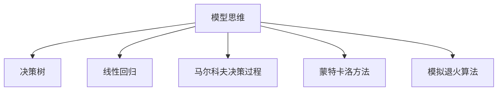

                 

# 模型思维在管理培训中的运用

> 关键词：管理培训, 模型思维, 决策分析, 组织行为, 人力资源管理, 案例研究, 应用场景

## 1. 背景介绍

### 1.1 问题由来
在当今复杂多变的商业环境中，企业的管理者和决策者面临着日益严峻的挑战，包括但不限于市场竞争加剧、技术变革加速、客户需求多变等。这些挑战要求管理者具备更强的数据分析能力、更敏锐的洞察力，以及更有效的决策能力。传统的管理培训方式难以满足这些需求，因此，采用更先进、更系统的模型思维培训成为了必然选择。

模型思维（Model Thinking），作为一门通过构建和应用数学模型来分析和解决问题的学科，已经成为现代管理培训中不可或缺的一部分。它帮助学员通过建立模型，理清问题的本质，从而更高效、更系统地进行决策和分析。

### 1.2 问题核心关键点
模型思维的核心在于利用数学模型来描述、分析和预测复杂系统。它强调从数据入手，通过构建模型，揭示系统行为和运行规律，从而制定有效的策略和决策。模型思维的关键点包括：
1. **数据驱动**：强调基于数据构建模型，而非依赖直觉或经验。
2. **系统视角**：关注系统的整体性和内部关系，而非孤立的局部。
3. **量化分析**：使用数学和统计方法，对系统进行定量分析和预测。
4. **迭代优化**：通过多次迭代，不断调整模型，直至达到最优解。

## 2. 核心概念与联系

### 2.1 核心概念概述

为更好地理解模型思维在管理培训中的应用，本节将介绍几个密切相关的核心概念：

- **模型思维**：通过构建和应用数学模型来分析和解决问题的思维方式。模型思维强调从数据入手，通过构建模型揭示系统行为和运行规律，从而制定有效的策略和决策。

- **决策树**：一种树形结构的模型，用于决策过程中的分类和预测。决策树通过一系列的判断节点（特征选择）和叶子节点（决策结果），实现对问题的分类和预测。

- **线性回归**：一种用于建立变量之间线性关系的统计模型。线性回归通过拟合数据，找到最佳的线性方程，用于预测和解释变量之间的关系。

- **马尔科夫决策过程**（MDP）：一种描述随机系统动态过程的模型，用于求解最优决策策略。MDP通过状态转移概率和奖励函数，计算出最优策略。

- **蒙特卡洛方法**：一种通过随机抽样和模拟实验来解决复杂问题的方法。蒙特卡洛方法通过大量随机模拟，求解概率问题或优化问题。

- **模拟退火算法**：一种基于物理退火过程的优化算法，用于求解组合优化问题。模拟退火算法通过随机扰动和接受劣解的策略，逐步寻找最优解。

这些核心概念之间的逻辑关系可以通过以下Mermaid流程图来展示：



这个流程图展示了大语言模型的核心概念及其之间的关系：

1. 模型思维作为方法论，覆盖了多种具体的建模技术。
2. 决策树、线性回归等模型是从数据入手，揭示变量间关系的统计方法。
3. 马尔科夫决策过程、蒙特卡洛方法、模拟退火算法等模型，则是更高级、更复杂的决策优化工具。

这些概念共同构成了管理培训中模型思维的框架，帮助学员系统掌握多种建模技术和应用场景。

## 3. 核心算法原理 & 具体操作步骤
### 3.1 算法原理概述

模型思维在管理培训中的应用，主要包括以下几个关键步骤：

1. **问题定义**：明确培训所要解决的问题，例如需求分析、供应链管理、市场预测等。
2. **数据准备**：收集相关数据，包括定量数据和定性数据，确保数据的准确性和完整性。
3. **模型选择**：根据问题特性和数据类型，选择合适的数学模型，如决策树、线性回归等。
4. **模型构建**：根据选定的模型，构建相应的数学表达式，并进行模型参数的求解。
5. **模型验证**：使用测试数据集验证模型的准确性和泛化能力，调整模型参数，优化模型性能。
6. **模型应用**：将优化后的模型应用于实际问题中，进行决策分析和预测。

### 3.2 算法步骤详解

以下将以一个简单的市场预测问题为例，详细讲解模型思维在管理培训中的应用步骤。

**Step 1: 问题定义**
假设某电子商务公司希望预测下一季度销售额，以便更好地安排库存和人力资源。

**Step 2: 数据准备**
收集历史销售数据、季节性因素、市场趋势、促销活动等相关信息，确保数据覆盖全面且真实。

**Step 3: 模型选择**
考虑到数据量较大且具有时间序列特征，选择时间序列分析中的线性回归模型。

**Step 4: 模型构建**
使用历史数据拟合线性回归方程，求解模型参数 $\beta_0, \beta_1, \beta_2, \ldots, \beta_n$，得到预测模型：
$$
\hat{y} = \beta_0 + \beta_1x_1 + \beta_2x_2 + \ldots + \beta_nx_n
$$

**Step 5: 模型验证**
使用未参与模型拟合的测试数据集，验证模型的预测准确度，调整模型参数，提高预测精度。

**Step 6: 模型应用**
将优化后的模型应用于新季度的销售预测，并根据预测结果调整库存和人力资源配置。

### 3.3 算法优缺点

模型思维在管理培训中的应用，具有以下优点：

1. **系统性**：通过系统构建模型，理清问题的本质和各变量间的关系，有助于形成科学的决策思路。
2. **量化分析**：利用数学模型进行定量分析和预测，提高了决策的准确性和可靠性。
3. **可操作性强**：模型思维提供了一系列具体的建模技术和应用方法，易于操作和实践。
4. **易于理解**：模型思维强调从数据入手，使用可视化图表解释模型结果，易于理解和接受。

同时，模型思维也存在一些局限性：

1. **假设限制**：模型构建需要基于一定的假设前提，这些假设可能与实际情况不符。
2. **数据要求高**：模型构建和验证需要大量的高质量数据，数据质量不足会影响模型效果。
3. **复杂度较高**：某些高级模型（如马尔科夫决策过程）可能需要较高的数学背景和计算资源。
4. **过度依赖模型**：过度依赖模型结果，忽视实际经验和直觉，可能导致决策偏差。

### 3.4 算法应用领域

模型思维在管理培训中的应用领域非常广泛，涵盖以下几个方面：

1. **决策分析**：通过构建决策树、线性回归等模型，对决策过程进行分析和优化。
2. **组织行为**：使用蒙特卡洛方法、模拟退火算法等模型，模拟员工行为和绩效，优化人力资源管理。
3. **供应链管理**：利用线性回归、马尔科夫决策过程等模型，预测需求和库存，优化供应链流程。
4. **财务管理**：构建时间序列模型，预测财务指标，进行财务风险评估和投资决策。
5. **市场营销**：通过构建回归模型和优化模型，预测市场趋势，制定市场营销策略。

## 4. 数学模型和公式 & 详细讲解 & 举例说明

### 4.1 数学模型构建

假设某公司的市场销售额可以表示为季节性因素、市场趋势和促销活动的线性组合，可以构建以下线性回归模型：

$$
y_t = \beta_0 + \beta_1x_{t1} + \beta_2x_{t2} + \beta_3x_{t3} + \epsilon_t
$$

其中，$y_t$ 表示第 $t$ 个月的销售额，$x_{t1}, x_{t2}, x_{t3}$ 分别表示季节性因素、市场趋势和促销活动的强度，$\epsilon_t$ 表示误差项。

### 4.2 公式推导过程

线性回归模型的参数估计通常使用最小二乘法。假设我们有 $n$ 个月的数据，模型参数可以通过求解以下优化问题得到：

$$
\hat{\beta} = \arg\min_{\beta} \sum_{t=1}^n (y_t - \beta_0 - \beta_1x_{t1} - \beta_2x_{t2} - \beta_3x_{t3})^2
$$

利用矩阵表示，可以转化为：

$$
\hat{\beta} = (X^TX)^{-1}X^Ty
$$

其中，$X$ 为自变量矩阵，$y$ 为因变量向量。

### 4.3 案例分析与讲解

以一家零售公司的季节性销售数据为例，构建线性回归模型。该公司的月销售额数据如下：

| 月份 | 季节性因素 | 市场趋势 | 促销活动 | 销售额 |
|------|----------|--------|--------|--------|
| 1    | 1        | 0      | 0      | 10,000 |
| 2    | 0        | 1      | 1      | 12,000 |
| 3    | 0        | 1      | 0      | 15,000 |
| 4    | 1        | 0      | 1      | 18,000 |
| ...  | ...      | ...    | ...    | ...    |

假设季节性因素为周期性的，市场趋势和促销活动强度均为非负整数。利用线性回归模型预测5月份的销售额。

## 5. 项目实践：代码实例和详细解释说明

### 5.1 开发环境搭建

在进行模型思维的培训项目实践前，我们需要准备好开发环境。以下是使用Python进行线性回归分析的环境配置流程：

1. 安装Anaconda：从官网下载并安装Anaconda，用于创建独立的Python环境。

2. 创建并激活虚拟环境：
```bash
conda create -n linear-regression python=3.8 
conda activate linear-regression
```

3. 安装相关库：
```bash
pip install pandas numpy matplotlib scikit-learn
```

完成上述步骤后，即可在`linear-regression`环境中开始模型思维的培训项目实践。

### 5.2 源代码详细实现

以下是一段使用Python实现线性回归模型的代码：

```python
import pandas as pd
import numpy as np
from sklearn.linear_model import LinearRegression
import matplotlib.pyplot as plt

# 读取数据
data = pd.read_csv('sales_data.csv')

# 数据处理
X = data[['seasonal_factor', 'market_trend', 'promotion_activity']]
y = data['sales_amount']

# 构建线性回归模型
model = LinearRegression()
model.fit(X, y)

# 预测5月份销售额
new_X = pd.DataFrame([[1, 0, 0]], columns=['seasonal_factor', 'market_trend', 'promotion_activity'])
pred_y = model.predict(new_X)

# 可视化结果
plt.scatter(X['seasonal_factor'], y)
plt.plot(new_X['seasonal_factor'], pred_y, color='red', label='Prediction')
plt.legend()
plt.show()
```

### 5.3 代码解读与分析

**数据准备**：
- `pd.read_csv('sales_data.csv')`：读取CSV格式的数据文件。
- `X = data[['seasonal_factor', 'market_trend', 'promotion_activity']]`：提取自变量数据。
- `y = data['sales_amount']`：提取因变量数据。

**模型构建**：
- `model = LinearRegression()`：创建线性回归模型对象。
- `model.fit(X, y)`：使用训练数据拟合模型。

**模型应用**：
- `new_X = pd.DataFrame([[1, 0, 0]], columns=['seasonal_factor', 'market_trend', 'promotion_activity'])`：创建新的自变量数据框，模拟5月份的数据。
- `pred_y = model.predict(new_X)`：使用模型进行预测。

**结果展示**：
- `plt.scatter(X['seasonal_factor'], y)`：绘制原始数据点。
- `plt.plot(new_X['seasonal_factor'], pred_y, color='red', label='Prediction')`：绘制预测线。
- `plt.legend()`：添加图例。
- `plt.show()`：显示图表。

**代码说明**：
- `pd.DataFrame`：创建Pandas数据框。
- `np.array`：创建NumPy数组。
- `model.predict`：使用模型进行预测。

## 6. 实际应用场景

### 6.1 公司财务分析

模型思维在财务分析中的应用非常广泛。例如，通过构建线性回归模型，可以预测公司未来的收入和利润，帮助财务部门制定合理的财务计划和预算。具体步骤如下：

1. **问题定义**：预测公司未来5年的收入和利润。
2. **数据准备**：收集历史财务数据，包括收入、成本、费用等。
3. **模型选择**：选择时间序列分析中的线性回归模型。
4. **模型构建**：使用历史数据拟合线性回归方程，求解模型参数。
5. **模型验证**：使用测试数据集验证模型的预测准确度，调整模型参数，提高预测精度。
6. **模型应用**：将优化后的模型应用于新一年的财务预测，并根据预测结果调整财务计划和预算。

### 6.2 产品生命周期管理

产品生命周期管理（Product Lifecycle Management, PLM）是企业项目管理的重要环节，通过模型思维可以优化产品生命周期各个阶段的资源配置和运营策略。例如，利用线性回归模型，可以预测产品各阶段的销售趋势，帮助企业制定合理的销售和市场策略。具体步骤如下：

1. **问题定义**：预测新产品在不同生命周期阶段的销售趋势。
2. **数据准备**：收集新产品的历史销售数据、市场推广费用、产品特性等。
3. **模型选择**：选择时间序列分析中的线性回归模型。
4. **模型构建**：使用历史数据拟合线性回归方程，求解模型参数。
5. **模型验证**：使用测试数据集验证模型的预测准确度，调整模型参数，提高预测精度。
6. **模型应用**：将优化后的模型应用于新产品各阶段的销售预测，并根据预测结果调整市场策略和资源配置。

### 6.3 供应链优化

在供应链管理中，通过模型思维可以优化供应链各环节的资源配置和运营策略。例如，利用线性回归模型，可以预测需求变化，优化库存管理和物流安排。具体步骤如下：

1. **问题定义**：预测某产品的需求变化趋势。
2. **数据准备**：收集历史销售数据、市场趋势、季节性因素等。
3. **模型选择**：选择时间序列分析中的线性回归模型。
4. **模型构建**：使用历史数据拟合线性回归方程，求解模型参数。
5. **模型验证**：使用测试数据集验证模型的预测准确度，调整模型参数，提高预测精度。
6. **模型应用**：将优化后的模型应用于需求预测，并根据预测结果优化库存管理和物流安排。

## 7. 工具和资源推荐

### 7.1 学习资源推荐

为了帮助学员系统掌握模型思维的理论基础和实践技巧，这里推荐一些优质的学习资源：

1. 《运筹学》系列书籍：经典的运筹学教材，详细介绍了线性规划、动态规划、优化模型等理论知识。

2. Coursera《运筹学与优化》课程：斯坦福大学开设的运筹学课程，涵盖了运筹学和优化模型的基础知识。

3. Kaggle竞赛平台：参与Kaggle竞赛，通过解决实际问题，学习模型的构建和应用。

4. DataCamp：提供丰富的数据科学和模型思维课程，涵盖Python编程、数据处理、模型构建等技能。

5. 《模型思维》系列文章：一系列深入浅出的模型思维文章，涵盖线性回归、决策树、蒙特卡洛方法等多种模型。

通过对这些资源的学习实践，相信学员可以系统掌握模型思维的核心概念和应用方法，并用于解决实际的商业问题。

### 7.2 开发工具推荐

高效的开发离不开优秀的工具支持。以下是几款用于模型思维培训开发的常用工具：

1. Python：Python是一种功能强大的编程语言，拥有丰富的第三方库和框架，支持模型构建和应用。

2. R：R是一种专门用于统计分析和数据可视化的语言，拥有丰富的数据处理和模型构建库。

3. Excel：Excel是一款强大的数据处理和分析工具，适合进行简单的数据处理和模型构建。

4. MATLAB：MATLAB是一种科学计算语言，拥有丰富的数学建模和仿真工具。

5. SPSS：SPSS是一种专业的统计分析软件，适合进行复杂的统计建模和数据分析。

合理利用这些工具，可以显著提升模型思维培训的开发效率，加快创新迭代的步伐。

### 7.3 相关论文推荐

模型思维的发展源于学界的持续研究。以下是几篇奠基性的相关论文，推荐阅读：

1. 《线性回归模型》（Linear Regression Model）：统计学经典论文，详细介绍了线性回归模型的构建和应用。

2. 《决策树》（Decision Trees）：机器学习经典论文，详细介绍了决策树的构建和应用。

3. 《蒙特卡洛方法》（Monte Carlo Methods）：计算机科学经典论文，详细介绍了蒙特卡洛方法的基本思想和应用。

4. 《模拟退火算法》（Simulated Annealing）：优化算法经典论文，详细介绍了模拟退火算法的基本思想和应用。

这些论文代表了大语言模型微调技术的发展脉络。通过学习这些前沿成果，可以帮助学员把握学科前进方向，激发更多的创新灵感。

## 8. 总结：未来发展趋势与挑战

### 8.1 总结

本文对模型思维在管理培训中的应用进行了全面系统的介绍。首先阐述了模型思维的研究背景和意义，明确了模型思维在提升管理决策和分析能力方面的独特价值。其次，从原理到实践，详细讲解了模型思维在财务分析、产品生命周期管理、供应链优化等多个实际问题中的应用步骤，提供了完整的代码实例和详细解释说明。同时，本文还广泛探讨了模型思维在更多商业场景中的应用前景，展示了模型思维的广泛适用性。

通过本文的系统梳理，可以看到，模型思维作为一种系统性的分析和决策方法，已经在现代管理培训中得到广泛应用，显著提升了管理者的决策能力和数据素养。未来，伴随模型思维的进一步发展，其在商业决策和管理中的应用将会更加广泛和深入。

### 8.2 未来发展趋势

展望未来，模型思维在管理培训中的应用将呈现以下几个发展趋势：

1. **多模型融合**：随着问题复杂度的增加，单一模型可能无法提供满意的解决方案。未来，模型思维将更多地关注模型之间的融合与互补，通过多模型协同优化，提升决策的全面性和准确性。

2. **数据驱动决策**：模型思维将进一步强调数据驱动的决策模式，通过构建大数据分析模型，帮助管理者从海量数据中提取有价值的洞察和信息，做出更加科学的决策。

3. **实时决策**：随着技术的发展，模型思维将逐步向实时决策方向发展。通过构建实时数据处理和分析模型，管理者可以实现即时决策和动态调整，更好地应对市场变化。

4. **模型自动化**：模型构建和优化的自动化将是大趋势。通过机器学习和自动化工具，管理者可以更加便捷地构建和优化模型，提升决策效率。

5. **跨学科融合**：模型思维将与更多学科融合，如经济学、心理学、社会学等，构建更加全面和系统化的分析框架。

以上趋势凸显了模型思维在管理培训中的巨大潜力和发展方向。这些方向的探索发展，必将进一步提升管理培训的科学性和实践性，为管理决策和运营提供更有力的支持。

### 8.3 面临的挑战

尽管模型思维在管理培训中已经取得了显著成效，但在迈向更加智能化、普适化应用的过程中，仍面临以下挑战：

1. **数据质量**：模型构建需要高质量的数据，数据缺失、异常和噪声等问题可能影响模型效果。如何获取和处理高质量的数据，将是模型思维面临的重要挑战。

2. **模型复杂度**：某些高级模型（如蒙特卡洛方法、模拟退火算法）可能需要较高的数学背景和计算资源。如何在复杂模型中找到平衡，简化模型结构，将是关键问题。

3. **模型解释性**：模型构建通常以数学公式为基础，难以解释模型内部的决策逻辑。如何提高模型的可解释性，增强模型的透明度，将是重要挑战。

4. **模型鲁棒性**：模型在面对异常数据和扰动时，容易产生预测偏差。如何提高模型的鲁棒性，增强模型的稳定性和泛化能力，将是重要课题。

5. **模型自动化**：虽然模型构建的自动化取得了一定进展，但仍需要依赖人工调参和优化。如何实现模型构建的自动化和智能化，提升模型构建效率，将是未来方向。

6. **模型伦理**：模型在决策过程中可能存在偏见和歧视，如何构建公平、公正的模型，避免模型偏见，将是重要挑战。

这些挑战凸显了模型思维在管理培训中的复杂性和现实性，需要进一步的研究和探索。只有不断克服这些挑战，模型思维才能更好地应用于管理决策和管理实践。

### 8.4 研究展望

面对模型思维面临的挑战，未来的研究需要在以下几个方面寻求新的突破：

1. **模型自动化**：开发更加智能化的模型构建工具，实现模型构建和优化的自动化。通过机器学习和自动化技术，简化模型构建和优化的过程，提升模型的构建效率。

2. **模型解释性**：引入模型解释性技术，如模型可视化、可解释性模型等，增强模型的透明度和可理解性。通过构建可解释性模型，帮助管理者理解和信任模型结果。

3. **模型鲁棒性**：引入模型鲁棒性技术，如对抗训练、噪声注入等，提高模型的泛化能力和稳定性。通过构建鲁棒性模型，减少异常数据对模型预测的影响。

4. **模型公平性**：引入模型公平性技术，如公平性约束、公平性评估等，确保模型决策的公平性和公正性。通过构建公平性模型，减少模型偏见和歧视。

5. **跨学科融合**：推动模型思维与更多学科的融合，如经济学、心理学、社会学等，构建更加全面和系统化的分析框架。通过跨学科研究，提升模型思维的应用广度和深度。

这些研究方向将进一步推动模型思维的发展和应用，为管理决策和管理实践提供更有力的支持。相信通过持续的研究和探索，模型思维必将在管理培训和商业决策中发挥更大的作用。

## 9. 附录：常见问题与解答

**Q1: 模型思维在管理培训中的作用是什么？**

A: 模型思维通过构建和应用数学模型，帮助管理者理清问题的本质，进行科学决策和分析。模型思维强调数据驱动，通过系统分析和定量预测，提升管理决策的准确性和可靠性。

**Q2: 模型思维在实际应用中需要注意哪些问题？**

A: 模型思维在实际应用中需要注意以下问题：
1. **数据质量**：模型构建需要高质量的数据，数据缺失、异常和噪声等问题可能影响模型效果。
2. **模型复杂度**：某些高级模型可能需要较高的数学背景和计算资源。
3. **模型解释性**：模型内部决策逻辑难以解释，可能影响管理者对模型的理解和信任。
4. **模型鲁棒性**：模型面对异常数据和扰动时可能产生预测偏差，需要提高模型的泛化能力和稳定性。
5. **模型自动化**：模型构建和优化的自动化水平较低，需要依赖人工调参和优化。

这些问题的解决，需要结合数据科学、人工智能、统计学等多学科知识，进行深入研究和实践。

**Q3: 模型思维在管理培训中的应用场景有哪些？**

A: 模型思维在管理培训中的应用场景包括：
1. **财务分析**：通过构建时间序列模型，预测公司未来的收入和利润，帮助财务部门制定合理的财务计划和预算。
2. **产品生命周期管理**：通过构建需求预测模型，优化产品生命周期各个阶段的资源配置和运营策略。
3. **供应链优化**：通过构建需求预测模型，优化库存管理和物流安排。
4. **市场营销**：通过构建回归模型和优化模型，预测市场趋势，制定市场营销策略。

通过模型思维的应用，管理者可以更加科学、系统地进行决策和分析，提升管理效率和运营效果。

**Q4: 如何提高模型思维的实践效果？**

A: 提高模型思维的实践效果需要以下措施：
1. **数据驱动**：通过构建和应用数据驱动的模型，提升决策的准确性和可靠性。
2. **模型融合**：通过多模型协同优化，提升决策的全面性和准确性。
3. **模型自动化**：通过机器学习和自动化工具，简化模型构建和优化的过程，提升模型构建效率。
4. **模型解释性**：通过模型可视化、可解释性模型等技术，增强模型的透明度和可理解性。
5. **模型鲁棒性**：通过对抗训练、噪声注入等技术，提高模型的泛化能力和稳定性。

通过综合应用以上措施，可以进一步提升模型思维的实践效果，帮助管理者做出更加科学、系统、可靠的决策。

**Q5: 模型思维在管理培训中面临哪些挑战？**

A: 模型思维在管理培训中面临以下挑战：
1. **数据质量**：模型构建需要高质量的数据，数据缺失、异常和噪声等问题可能影响模型效果。
2. **模型复杂度**：某些高级模型可能需要较高的数学背景和计算资源。
3. **模型解释性**：模型内部决策逻辑难以解释，可能影响管理者对模型的理解和信任。
4. **模型鲁棒性**：模型面对异常数据和扰动时可能产生预测偏差，需要提高模型的泛化能力和稳定性。
5. **模型自动化**：模型构建和优化的自动化水平较低，需要依赖人工调参和优化。

这些挑战需要结合数据科学、人工智能、统计学等多学科知识，进行深入研究和实践。

---

作者：禅与计算机程序设计艺术 / Zen and the Art of Computer Programming

