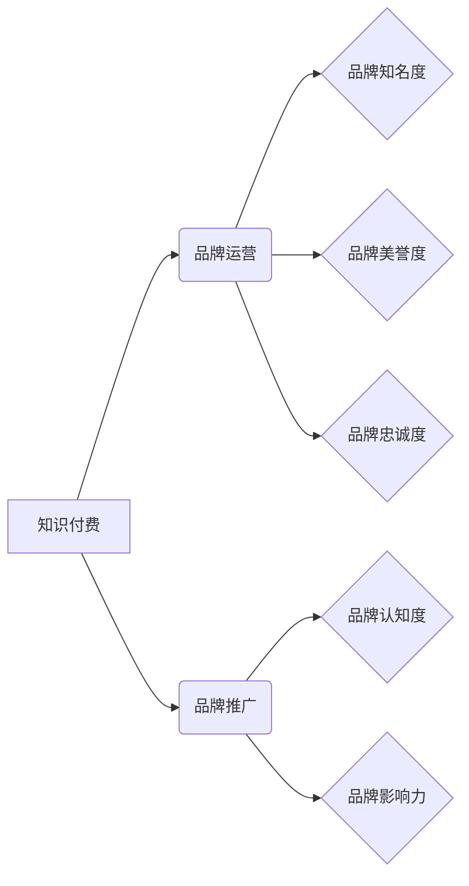

> 知识付费,品牌运营,品牌推广,策略,市场营销,内容营销,社区运营

## 1. 背景介绍

知识经济时代，知识成为最宝贵的资源。知识付费作为一种新型的商业模式，在近年来迅速发展，成为众多创作者和企业寻求变现的重要途径。 

知识付费的核心在于将个人或机构的专业知识、技能和经验以数字化形式打包，并通过线上平台向付费用户提供学习和获取价值的服务。 

从课程、电子书到咨询、会员体系，知识付费的形态多种多样，其发展也催生了一批成功的知识付费品牌，如罗辑思维、李开复的“李开复的课程”，以及“三分钟学英语”等。

然而，知识付费市场竞争激烈，想要在激烈的市场竞争中脱颖而出，建立一个成功的知识付费品牌，需要制定合理的品牌运营和推广策略。

## 2. 核心概念与联系

**2.1 品牌运营**

品牌运营是指企业围绕品牌价值，通过一系列的策略和行动，提升品牌知名度、美誉度和忠诚度，最终实现品牌价值最大化的过程。

**2.2 品牌推广**

品牌推广是指企业通过各种营销活动，向目标用户传播品牌信息，提升品牌认知度和影响力的过程。

**2.3 知识付费品牌运营与推广策略**

知识付费品牌运营与推广策略是指在知识付费市场中，通过品牌运营和品牌推广相结合的方式，打造一个具有独特价值和竞争力的知识付费品牌。

**2.4 核心概念关系图**



## 3. 核心算法原理 & 具体操作步骤

**3.1 算法原理概述**

知识付费品牌运营与推广策略的核心算法原理是基于用户需求和市场趋势进行数据分析，并根据分析结果制定精准的品牌运营和推广策略。

**3.2 算法步骤详解**

1. **用户需求分析:** 通过用户调研、数据分析等方式，了解目标用户的需求、痛点和兴趣。
2. **市场趋势分析:** 分析知识付费市场的发展趋势、竞争格局和用户行为，洞察市场机会。
3. **品牌定位:** 根据用户需求和市场趋势，确定品牌的核心价值、目标受众和差异化优势。
4. **内容策略:** 制定内容创作计划，根据用户需求和市场趋势，创作优质、有价值的内容。
5. **传播策略:** 选择合适的传播渠道和方式，将品牌信息和内容传播给目标用户。
6. **社区运营:** 建立线上线下社区，与用户互动交流，增强用户粘性。
7. **数据监测与优化:** 持续监测品牌运营和推广效果，根据数据反馈进行策略优化。

**3.3 算法优缺点**

* **优点:** 
    * 数据驱动，策略更精准。
    * 能够根据市场变化及时调整策略。
    * 提升品牌运营和推广效率。
* **缺点:** 
    * 需要投入大量时间和资源进行数据分析和策略制定。
    * 数据分析结果可能存在偏差，需要不断验证和优化。

**3.4 算法应用领域**

* 知识付费平台
* 教育机构
* 咨询公司
* 个人创作者

## 4. 数学模型和公式 & 详细讲解 & 举例说明

**4.1 数学模型构建**

知识付费品牌运营与推广策略可以构建一个数学模型，来衡量品牌运营和推广效果。

**4.2 公式推导过程**

* **品牌知名度 (Brand Awareness):** 
$$Brand Awareness = \frac{Number of Users Aware of Brand}{Total Target Audience}$$
* **品牌美誉度 (Brand Reputation):** 
$$Brand Reputation = \frac{Positive Reviews - Negative Reviews}{Total Reviews}$$
* **品牌忠诚度 (Brand Loyalty):** 
$$Brand Loyalty = \frac{Repeat Customers}{Total Customers}$$

**4.3 案例分析与讲解**

假设一个知识付费平台想要提升品牌知名度，可以采用以下策略：

* **内容营销:** 创作优质的知识付费内容，并通过社交媒体、博客等渠道进行推广。
* **付费广告:** 在目标用户聚集的平台上投放付费广告，提高品牌曝光率。
* **KOL 合作:** 与行业KOL合作，推广品牌知识付费产品。

通过以上策略，平台可以提高用户对品牌的认知度，从而提升品牌知名度。

## 5. 项目实践：代码实例和详细解释说明

**5.1 开发环境搭建**

* 操作系统: Windows/macOS/Linux
* 编程语言: Python
* 开发工具: Jupyter Notebook

**5.2 源代码详细实现**

```python
# 导入必要的库
import pandas as pd
import matplotlib.pyplot as plt

# 加载用户数据
user_data = pd.read_csv("user_data.csv")

# 计算品牌知名度
brand_awareness = len(user_data[user_data["brand_awareness"] == True]) / len(user_data)

# 计算品牌美誉度
brand_reputation = (user_data["positive_reviews"].sum() - user_data["negative_reviews"].sum()) / len(user_data)

# 计算品牌忠诚度
brand_loyalty = len(user_data[user_data["repeat_customers"] == True]) / len(user_data)

# 打印结果
print("品牌知名度:", brand_awareness)
print("品牌美誉度:", brand_reputation)
print("品牌忠诚度:", brand_loyalty)

# 绘制品牌运营指标趋势图
plt.plot(user_data["time"], user_data["brand_awareness"])
plt.plot(user_data["time"], user_data["brand_reputation"])
plt.plot(user_data["time"], user_data["brand_loyalty"])
plt.xlabel("时间")
plt.ylabel("指标值")
plt.title("品牌运营指标趋势图")
plt.show()
```

**5.3 代码解读与分析**

* 代码首先导入必要的库，包括 pandas 用于数据处理和 matplotlib 用于数据可视化。
* 然后，代码加载用户数据，并计算品牌知名度、品牌美誉度和品牌忠诚度。
* 最后，代码绘制品牌运营指标趋势图，直观地展示品牌运营效果。

**5.4 运行结果展示**

运行代码后，会输出品牌知名度、品牌美誉度和品牌忠诚度的数值，以及一个展示品牌运营指标趋势的图表。

## 6. 实际应用场景

**6.1 知识付费平台**

知识付费平台可以利用品牌运营和推广策略，提升平台知名度和用户粘性，从而吸引更多用户付费学习。

**6.2 教育机构**

教育机构可以利用品牌运营和推广策略，提升品牌形象和招生率，从而吸引更多学生报名学习。

**6.3 咨询公司**

咨询公司可以利用品牌运营和推广策略，提升品牌影响力和客户信任度，从而吸引更多客户咨询服务。

**6.4 个人创作者**

个人创作者可以利用品牌运营和推广策略，提升个人知名度和粉丝粘性，从而吸引更多粉丝付费支持。

**6.5 未来应用展望**

随着知识经济的不断发展，知识付费市场将迎来更大的发展空间。未来，品牌运营和推广策略将更加注重用户体验、个性化定制和数据驱动，并与人工智能、大数据等新技术深度融合，打造更加智能化、高效化的知识付费品牌。

## 7. 工具和资源推荐

**7.1 学习资源推荐**

* **书籍:**
    * 《品牌管理》
    * 《数字营销》
    * 《内容营销》
* **在线课程:**
    * Coursera: 品牌管理
    * Udemy: 数字营销
    * edX: 内容营销

**7.2 开发工具推荐**

* **数据分析工具:**
    * Python (Pandas, NumPy, Scikit-learn)
    * R
    * Tableau
* **可视化工具:**
    * Matplotlib
    * Seaborn
    * Power BI

**7.3 相关论文推荐**

* **品牌运营:**
    * Keller, K. L. (2013). Strategic brand management: Building, measuring, and managing brand equity. Pearson Education.
* **品牌推广:**
    * Kotler, P., & Keller, K. L. (2016). Marketing management. Pearson Education.
* **知识付费:**
    * Wang, Y., & Zhang, J. (2020). The impact of knowledge sharing on organizational innovation: A systematic review. Journal of Knowledge Management, 24(1), 1-22.

## 8. 总结：未来发展趋势与挑战

**8.1 研究成果总结**

本文探讨了知识付费品牌运营与推广策略的核心概念、算法原理、实践案例以及未来发展趋势。

**8.2 未来发展趋势**

* **用户体验至上:** 知识付费品牌将更加注重用户体验，提供更加个性化、定制化的学习服务。
* **数据驱动决策:** 品牌运营和推广策略将更加依赖数据分析，实现更加精准的决策。
* **人工智能应用:** 人工智能技术将被广泛应用于知识付费领域，例如智能推荐、个性化学习路径等。

**8.3 面临的挑战**

* **市场竞争激烈:** 知识付费市场竞争激烈，品牌需要不断创新，才能脱颖而出。
* **用户信任问题:** 用户对知识付费平台的信任度仍然较低，需要平台不断提升服务质量和品牌形象。
* **内容质量保证:** 知识付费内容质量参差不齐，需要平台加强内容审核和管理。

**8.4 研究展望**

未来，我们将继续深入研究知识付费品牌运营与推广策略，探索更加有效的品牌运营和推广方法，推动知识付费行业健康发展。

## 9. 附录：常见问题与解答

**9.1 如何提升品牌知名度？**

* 内容营销: 创作优质的知识付费内容，并通过社交媒体、博客等渠道进行推广。
* 付费广告: 在目标用户聚集的平台上投放付费广告，提高品牌曝光率。
* KOL 合作: 与行业KOL合作，推广品牌知识付费产品。

**9.2 如何提高用户粘性？**

* 社区运营: 建立线上线下社区，与用户互动交流，增强用户粘性。
* 个性化定制: 提供更加个性化、定制化的学习服务。
* 互动体验: 设计更加丰富的互动体验，例如直播、问答等。

**9.3 如何保证知识付费内容质量？**

* 内容审核: 建立严格的内容审核机制，确保内容质量和准确性。
* 作者资质: 邀请具有专业知识和经验的作者创作内容。
* 用户反馈: 收集用户反馈，不断改进内容质量。


作者：禅与计算机程序设计艺术 / Zen and the Art of Computer Programming 
<end_of_turn>