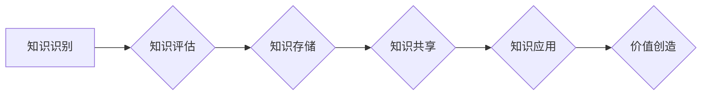

> 知识资产、知识资本化、知识管理、知识共享、知识经济、数据挖掘、人工智能、知识图谱

## 1. 背景介绍

在当今知识经济时代，知识已成为企业最宝贵的资产。知识的积累、传播和应用直接关系到企业的竞争力和发展。然而，传统的知识管理模式往往难以有效地捕捉、存储、共享和利用知识，导致知识资产难以转化为经济价值。

知识资产模式的提出，旨在解决这一问题。它将知识视为一种可量化、可管理的资产，并通过建立一套完整的知识管理体系，实现知识的资本化运作。

## 2. 核心概念与联系

**2.1 知识资产**

知识资产是指企业内部积累和拥有的各种知识，包括：

* **显性知识：** 可以被明确表达和记录的知识，例如文档、数据、代码等。
* **隐性知识：** 难以被明确表达和记录的知识，例如经验、技能、判断等。

**2.2 知识资本化**

知识资本化是指将知识资产转化为经济价值的过程，包括：

* **知识识别和评估：** 识别和评估企业内部的知识资产，确定其价值和潜力。
* **知识存储和管理：** 建立知识库和知识管理平台，有效地存储和管理知识资产。
* **知识共享和传播：** 促进知识的共享和传播，使知识能够被更多的人所利用。
* **知识应用和创新：** 将知识应用于产品开发、服务创新等领域，创造新的价值。

**2.3 知识资产模式**

知识资产模式是一种将知识资产视为企业核心资产的管理模式，它包括以下几个关键要素：

* **知识地图：** 建立知识地图，清晰地展示企业内部的知识结构和关系。
* **知识库：** 建立知识库，存储和管理企业内部的知识资产。
* **知识共享平台：** 建立知识共享平台，促进知识的共享和传播。
* **知识应用机制：** 建立知识应用机制，将知识应用于实际工作中。

**2.4 Mermaid 流程图**



## 3. 核心算法原理 & 具体操作步骤

**3.1 算法原理概述**

知识资产模式的实现需要依赖于一系列的算法和技术，例如：

* **数据挖掘算法：** 用于从海量数据中挖掘出潜在的知识。
* **机器学习算法：** 用于构建知识图谱和知识推荐系统。
* **自然语言处理算法：** 用于处理和分析文本数据，提取知识。

**3.2 算法步骤详解**

1. **数据收集和预处理：** 收集企业内部的各种数据，并进行清洗、转换和格式化等预处理工作。
2. **知识抽取：** 使用自然语言处理算法，从文本数据中抽取关键信息，例如概念、关系、事件等。
3. **知识表示：** 将抽取出的知识表示为结构化的知识图谱，例如 RDF 或 OWL 格式。
4. **知识推理：** 使用规则引擎或机器学习算法，对知识图谱进行推理，发现新的知识和关系。
5. **知识共享和应用：** 将知识图谱发布到知识共享平台，并将其应用于实际工作中，例如产品开发、客户服务等。

**3.3 算法优缺点**

* **优点：**

    * 可以有效地捕捉和利用企业内部的知识资产。
    * 可以促进知识的共享和传播，提高知识利用率。
    * 可以帮助企业发现新的知识和关系，推动创新。

* **缺点：**

    * 需要大量的技术投入和人力成本。
    * 需要建立完善的知识管理体系和文化。
    * 知识的质量和准确性取决于数据质量和算法精度。

**3.4 算法应用领域**

* **企业知识管理：** 建立企业知识库，促进知识共享和传播。
* **产品开发：** 利用知识图谱进行产品设计和创新。
* **客户服务：** 利用知识库和机器学习算法，提供智能客户服务。
* **医疗保健：** 利用知识图谱进行疾病诊断和治疗方案推荐。
* **教育培训：** 利用知识图谱进行个性化学习和知识发现。

## 4. 数学模型和公式 & 详细讲解 & 举例说明

**4.1 数学模型构建**

知识资产的价值可以被量化，并可以用数学模型来表示。一个简单的模型可以是：

$$
Value = f(Knowledge, Context, Application)
$$

其中：

* **Value:** 知识资产的价值
* **Knowledge:** 知识资产的数量和质量
* **Context:** 知识资产的应用环境和背景
* **Application:** 知识资产的应用方式和效果

**4.2 公式推导过程**

这个模型的推导过程可以基于以下几个假设：

* 知识资产的价值取决于其数量和质量。
* 知识资产的价值取决于其应用环境和背景。
* 知识资产的价值取决于其应用方式和效果。

**4.3 案例分析与讲解**

例如，一家科技公司拥有大量的专利技术，这是一种显性知识资产。

* **Knowledge:** 拥有大量的专利技术，质量较高。
* **Context:** 处于快速发展的科技行业，竞争激烈。
* **Application:** 将专利技术应用于新产品的开发，获得商业成功。

在这种情况下，知识资产的价值很高，因为知识的质量高，应用环境有利，应用效果显著。

## 5. 项目实践：代码实例和详细解释说明

**5.1 开发环境搭建**

* 操作系统：Ubuntu 20.04
* 编程语言：Python 3.8
* 开发工具：Jupyter Notebook

**5.2 源代码详细实现**

```python
# 知识图谱构建示例代码

import networkx as nx

# 创建知识图谱
graph = nx.Graph()

# 添加节点
graph.add_node("专利技术A")
graph.add_node("专利技术B")
graph.add_node("产品X")

# 添加边
graph.add_edge("专利技术A", "产品X")
graph.add_edge("专利技术B", "产品X")

# 打印知识图谱
print(graph.nodes())
print(graph.edges())
```

**5.3 代码解读与分析**

* 使用 `networkx` 库构建知识图谱。
* 添加节点代表知识资产，例如专利技术。
* 添加边代表知识资产之间的关系，例如专利技术应用于产品。
* 打印知识图谱的节点和边信息。

**5.4 运行结果展示**

```
['专利技术A', '专利技术B', '产品X']
[('专利技术A', '产品X'), ('专利技术B', '产品X')]
```

## 6. 实际应用场景

**6.1 企业知识管理**

知识资产模式可以帮助企业建立完善的知识管理体系，实现知识的共享和传播。例如，可以建立知识库，存储企业内部的文档、案例、经验等知识资产，并通过知识搜索引擎和推荐系统，帮助员工快速找到所需知识。

**6.2 产品开发**

知识资产模式可以帮助企业进行产品开发和创新。例如，可以利用知识图谱，分析市场需求、竞争对手的产品和技术，并发现新的产品开发机会。

**6.3 客户服务**

知识资产模式可以帮助企业提供更智能的客户服务。例如，可以利用知识库和机器学习算法，构建智能客服系统，自动回答客户常见问题，提高客户服务效率。

**6.4 未来应用展望**

随着人工智能和数据挖掘技术的不断发展，知识资产模式的应用场景将更加广泛。例如，可以利用知识图谱进行个性化学习和知识发现，帮助人们更有效地学习和掌握知识。

## 7. 工具和资源推荐

**7.1 学习资源推荐**

* **书籍：**
    * 《知识管理》
    * 《知识资本化》
    * 《数据挖掘》
* **在线课程：**
    * Coursera: Knowledge Management
    * edX: Data Mining
    * Udemy: Artificial Intelligence

**7.2 开发工具推荐**

* **知识图谱构建工具：**
    * Neo4j
    * RDF4J
    * Stardog
* **数据挖掘工具：**
    * Apache Spark
    * Weka
    * RapidMiner

**7.3 相关论文推荐**

* **Nonaka, I., & Takeuchi, H. (1995). The knowledge-creating company. Oxford University Press.**
* **Davenport, T. H., & Prusak, L. (1998). Working knowledge: How organizations manage what they know. Harvard Business School Press.**
* **Wang, R. Y., & Strong, D. M. (2009). Knowledge management: A review of the literature. Journal of Management Information Systems, 26(1), 1-31.**

## 8. 总结：未来发展趋势与挑战

**8.1 研究成果总结**

知识资产模式的提出和发展，为企业知识管理和资本化运作提供了新的思路和方法。通过构建知识图谱、利用数据挖掘和机器学习算法，可以有效地捕捉、存储、共享和利用知识资产，提高企业竞争力和创新能力。

**8.2 未来发展趋势**

* **知识资产的量化和评估：** 将知识资产的价值更加准确地量化和评估，为知识管理决策提供更科学的依据。
* **知识资产的动态管理：** 建立动态的知识管理体系，能够适应企业快速变化的环境和需求。
* **知识资产的跨组织共享：** 推动知识资产的跨组织共享，促进产业链和生态圈的协同创新。

**8.3 面临的挑战**

* **知识的隐性化和难以量化：** 隐性知识难以被明确表达和记录，其价值难以量化。
* **知识的共享和传播：** 知识的共享和传播需要克服组织文化和信息安全等方面的挑战。
* **知识资产的保护和管理：** 需要建立完善的知识资产保护和管理机制，防止知识泄露和滥用。

**8.4 研究展望**

未来，知识资产模式的研究将更加注重以下几个方面：

* **开发更有效的知识提取和表示方法。**
* **构建更智能的知识管理平台和系统。**
* **探索知识资产的跨组织共享和协同创新模式。**


## 9. 附录：常见问题与解答

**9.1 如何评估知识资产的价值？**

知识资产的价值评估是一个复杂的过程，需要考虑多种因素，例如知识的数量、质量、应用场景、市场需求等。可以使用定量和定性方法进行评估，例如成本-收益分析、市场调研、专家评估等。

**9.2 如何促进知识的共享和传播？**

* 建立知识共享平台，方便员工访问和分享知识。
* 鼓励员工进行知识交流和合作。
* 制定知识共享的奖励机制，激励员工积极参与。
* 建立知识文化，营造尊重知识、共享知识的氛围。

**9.3 如何保护知识资产的安全？**

* 建立知识资产管理制度，明确知识资产的归属和使用权限。
* 使用技术手段保护知识资产的安全，例如加密、访问控制等。
* 加强员工的知识安全意识培训，防止知识泄露。


作者：禅与计算机程序设计艺术 / Zen and the Art of Computer Programming 
<end_of_turn>