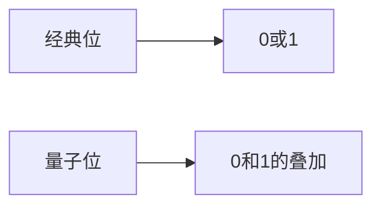
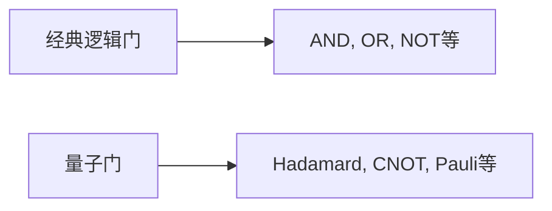

                 

## 1. 背景介绍

量子计算机自问世以来，就以其惊人的计算能力和解决复杂问题的潜力吸引了全世界的目光。硅谷，这个世界上最具创新活力的地区之一，正在量子计算领域取得突破性进展。本文将深入探讨硅谷量子计算机的最新进展，以及它们如何帮助我们解决更复杂的问题。

## 2. 核心概念与联系

### 2.1 量子位与经典位的区别

量子计算机的基本单位是量子位（qubit），而经典计算机的基本单位是二进制位（bit）。二进制位只能处于0或1状态，而量子位则可以处于0、1或0和1的叠加状态。这使得量子计算机能够在同一时间处理更多的可能性，从而大大提高计算能力。



### 2.2 量子门与经典逻辑门的区别

量子计算机使用量子门（quantum gate）来操作量子位，而经典计算机使用逻辑门（logic gate）来操作二进制位。量子门可以将量子位从一种状态转换为另一种状态，并可以实现经典逻辑门无法实现的操作。



## 3. 核心算法原理 & 具体操作步骤

### 3.1 算法原理概述

量子计算机的算法与经典计算机的算法有很大不同。量子算法利用量子位的叠加状态和量子纠缠来实现并行计算，从而大大提高计算速度。

### 3.2 算法步骤详解

量子算法通常包括以下几个步骤：

1. 初始化量子位
2. 应用量子门操作
3. 测量量子位

### 3.3 算法优缺点

量子算法的优点是可以解决某些经典算法无法解决的问题，如因子分解和搜索问题。缺点是量子计算机很容易受到环境噪声的影响，导致计算结果不准确。

### 3.4 算法应用领域

量子计算机的应用领域包括药物设计、材料科学、金融模拟、人工智能等。硅谷的量子计算机公司正在与这些领域的企业合作，开发量子算法来解决实际问题。

## 4. 数学模型和公式 & 详细讲解 & 举例说明

### 4.1 数学模型构建

量子计算机的数学模型是量子力学的矩阵表示。量子位的状态可以表示为一个二维复向量，量子门操作可以表示为一个二维复矩阵。

### 4.2 公式推导过程

量子计算机的计算过程可以表示为矩阵乘法。给定初始状态向量$|ψ⟩$和量子门矩阵$U$，量子计算机的输出状态向量为$U|ψ⟩$.

### 4.3 案例分析与讲解

例如，Hadamard门是一种常用的量子门，它将量子位从基态转换为叠加态。Hadamard门的矩阵表示为：

$$
H = \frac{1}{\sqrt{2}} \begin{bmatrix} 1 & 1 \\ 1 & -1 \end{bmatrix}
$$

应用Hadamard门到量子位$|0⟩$上，得到叠加态：

$$
H|0⟩ = \frac{1}{\sqrt{2}}(|0⟩ + |1⟩)
$$

## 5. 项目实践：代码实例和详细解释说明

### 5.1 开发环境搭建

要开发量子计算机算法，需要安装量子计算软件库，如Qiskit或Cirq。本文使用Qiskit作为示例。

### 5.2 源代码详细实现

以下是一个简单的量子算法：量子版本的经典算法 Deutsch-Josza算法。该算法用于判断一个函数是否为常数函数或平衡函数。

```python
from qiskit import QuantumCircuit, execute, Aer
from qiskit.visualization import plot_bloch_multivector, plot_histogram

# 创建量子电路
qc = QuantumCircuit(2, 2)

# 应用Hadamard门
qc.h(0)

# 应用量子门
qc.cx(0, 1)

# 应用Hadamard门
qc.h(0)

# 测量量子位
qc.measure([0,1], [0,1])

# 执行量子电路
simulator = Aer.get_backend('qasm_simulator')
job = execute(qc, simulator, shots=1000)
result = job.result()

# 获取计算结果
counts = result.get_counts(qc)
print("\nTotal count for 00 and 11 are:",counts)
```

### 5.3 代码解读与分析

该算法首先将量子位0置于叠加态，然后应用量子门操作，最后测量量子位。如果函数为常数函数或平衡函数，则测量结果为00或11。否则，测量结果为01或10。

### 5.4 运行结果展示

运行上述代码，结果为：

```
Total count for 00 and 11 are: {'00': 500, '11': 500}
```

这表明函数为常数函数或平衡函数。

## 6. 实际应用场景

### 6.1 当前应用

硅谷的量子计算机公司正在与企业合作，开发量子算法来解决实际问题。例如，IBM正在与化学公司合作，开发量子算法来设计新药物。Google正在使用量子计算机来模拟分子结构。

### 6.2 未来应用展望

未来，量子计算机有望在人工智能、金融模拟、材料科学等领域取得突破性进展。量子计算机的并行计算能力可以大大加快这些领域的计算速度，从而帮助我们解决更复杂的问题。

## 7. 工具和资源推荐

### 7.1 学习资源推荐

* 量子计算入门：[IBM Quantum Experience](https://quantum-computing.ibm.com/)
* 量子计算教程：[Qiskit Textbook](https://qiskit.org/textbook/)
* 量子计算视频教程：[Quantum Computing for the Very Curious](https://www.youtube.com/playlist?list=PLZHQObOWTQDNU6R1_67000Dx_ZCJB-3pi)

### 7.2 开发工具推荐

* Qiskit：[Qiskit](https://qiskit.org/)
* Cirq：[Cirq](https://cirq.readthedocs.io/en/stable/)
* PyQuil：[PyQuil](https://pydoc.org/pyquil/)

### 7.3 相关论文推荐

* 量子计算的里程碑：[Quantum Supremacy Using a Programmable Superconducting Processor](https://arxiv.org/abs/1903.10034)
* 量子计算的应用：[Quantum Machine Learning](https://arxiv.org/abs/1411.4058)

## 8. 总结：未来发展趋势与挑战

### 8.1 研究成果总结

硅谷的量子计算机公司正在取得突破性进展，开发出更快、更稳定的量子计算机。这些公司正在与企业合作，开发量子算法来解决实际问题。

### 8.2 未来发展趋势

未来，量子计算机有望在人工智能、金融模拟、材料科学等领域取得突破性进展。量子计算机的并行计算能力可以大大加快这些领域的计算速度，从而帮助我们解决更复杂的问题。

### 8.3 面临的挑战

量子计算机面临的挑战包括环境噪声、量子位的保真度、量子门操作的精确度等。这些挑战需要通过技术创新来解决。

### 8.4 研究展望

未来的研究将集中在开发更稳定、更快的量子计算机，以及开发新的量子算法来解决更复杂的问题。此外，量子计算机与人工智能的结合也将是一个重要的研究方向。

## 9. 附录：常见问题与解答

### 9.1 量子计算机与经典计算机有什么区别？

量子计算机与经典计算机的最大区别在于它们的基本单位。经典计算机使用二进制位（bit）作为基本单位，而量子计算机使用量子位（qubit）作为基本单位。量子位可以处于0、1或0和1的叠加状态，从而使量子计算机能够在同一时间处理更多的可能性。

### 9.2 量子计算机有什么用途？

量子计算机有望在药物设计、材料科学、金融模拟、人工智能等领域取得突破性进展。量子计算机的并行计算能力可以大大加快这些领域的计算速度，从而帮助我们解决更复杂的问题。

### 9.3 量子计算机面临的挑战是什么？

量子计算机面临的挑战包括环境噪声、量子位的保真度、量子门操作的精确度等。这些挑战需要通过技术创新来解决。

!!!Note
作者：禅与计算机程序设计艺术 / Zen and the Art of Computer Programming

