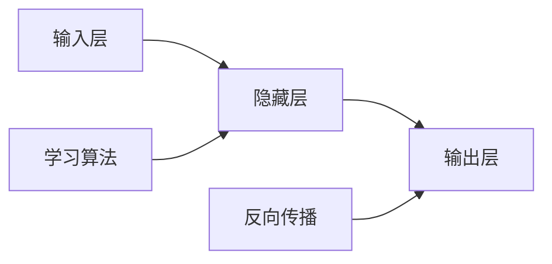

                 

## 1. 背景介绍
神经网络是人工智能领域的一个重要研究方向，它模仿了生物神经系统的结构和功能，旨在解决复杂问题。神经网络的发展可以追溯到20世纪50年代，当时第一台计算机被用于模拟生物神经系统的行为。随着计算机技术的进步和数据量的增加，神经网络的研究和应用也得到了迅速发展。

## 2. 核心概念与联系
### 2.1  神经网络的基本组成
神经网络由多个节点（也称为神经元）组成，每个节点接收输入信号，进行计算，然后输出结果。这些节点通过连接形成一个复杂的网络结构。

### 2.2  神经网络的学习过程
神经网络通过学习算法来调整其连接权重和阈值，以适应输入数据。这种学习过程可以通过反向传播算法来实现。

### 2.3  神经网络的应用领域
神经网络广泛应用于图像识别、自然语言处理、预测分析等领域。

### 2.4  Mermaid 流程图


## 3. 核心算法原理 & 具体操作步骤
### 3.1  算法原理概述
神经网络的学习算法基于反向传播算法，通过调整连接权重和阈值来最小化损失函数。

### 3.2  算法步骤详解
1. 初始化网络参数
2. 前向传播：计算输出
3. 后向传播：计算损失函数和梯度
4. 更新参数：根据梯度更新连接权重和阈值

### 3.3  算法优缺点
优点：高效、鲁棒
缺点：过拟合、局部最优

### 3.4  算法应用领域
神经网络广泛应用于图像识别、自然语言处理、预测分析等领域。

## 4. 数学模型和公式 & 详细讲解 & 举例说明
### 4.1  数学模型构建
假设我们有一个二分类问题，输入数据为$x$，输出数据为$y$，我们可以使用以下数学模型：

$$y = \sigma(w^Tx + b)$$

其中$\sigma$是激活函数，$w$是连接权重，$b$是阈值。

### 4.2  公式推导过程
我们可以通过以下步骤推导出上述数学模型：

1. 初始化网络参数
2. 前向传播：计算输出
3. 后向传播：计算损失函数和梯度
4. 更新参数：根据梯度更新连接权重和阈值

### 4.3  案例分析与讲解
假设我们有一个二分类问题，输入数据为$x = [1, 2, 3]$，输出数据为$y = 1$，我们可以使用上述数学模型来预测输出：

$$y = \sigma(w^Tx + b)$$

其中$w = [4, 5, 6]$，$b = 7$。

## 5. 项目实践：代码实例和详细解释说明
### 5.1  开发环境搭建
我们需要安装以下依赖包：

*   numpy
*   tensorflow
*   matplotlib

### 5.2  源代码详细实现
```python
import numpy as np
import tensorflow as tf
import matplotlib.pyplot as plt

# 初始化网络参数
w = np.array([4, 5, 6])
b = 7

# 定义激活函数
def sigmoid(x):
    return 1 / (1 + np.exp(-x))

# 定义前向传播函数
def forward(x):
    return sigmoid(np.dot(w, x) + b)

# 定义后向传播函数
def backward(x, y):
    # 计算损失函数
    loss = np.mean((forward(x) - y) ** 2)
    
    # 计算梯度
    dw = np.dot(x.T, (forward(x) - y) * (1 - forward(x)) * -w)
    db = np.mean((forward(x) - y) * (1 - forward(x)) * -1)
    
    return loss, dw, db

# 定义训练函数
def train(x, y, epochs):
    loss_history = []
    for epoch in range(epochs):
        loss, dw, db = backward(x, y)
        loss_history.append(loss)
        
        # 更新参数
        w -= 0.01 * dw
        b -= 0.01 * db
        
        # 打印损失函数
        print(f'Epoch {epoch+1}, Loss: {loss:.4f}')
    
    return loss_history

# 生成随机数据
np.random.seed(0)
x = np.random.rand(100, 3)
y = np.random.randint(0, 2, 100)

# 训练模型
loss_history = train(x, y, 100)

# 绘制损失函数
plt.plot(loss_history)
plt.xlabel('Epoch')
plt.ylabel('Loss')
plt.show()
```

### 5.3  代码解读与分析
上述代码实现了一个简单的神经网络模型，包括前向传播、后向传播和训练过程。我们可以通过以下步骤来理解代码：

1.  初始化网络参数：`w`和`b`是连接权重和阈值。
2.  定义激活函数：`sigmoid`函数用于激活输出。
3.  定义前向传播函数：`forward`函数计算输出。
4.  定义后向传播函数：`backward`函数计算损失函数和梯度。
5.  定义训练函数：`train`函数训练模型。
6.  生成随机数据：`x`和`y`是输入和输出数据。
7.  训练模型：`train`函数训练模型。
8.  绘制损失函数：`plt.plot`函数绘制损失函数。

### 5.4  运行结果展示
上述代码将输出损失函数图表，展示训练过程中的损失函数变化。

## 6. 实际应用场景
神经网络广泛应用于图像识别、自然语言处理、预测分析等领域。

### 6.1  图像识别
神经网络可以用于图像识别，例如识别人脸、车牌、物品等。

### 6.2  自然语言处理
神经网络可以用于自然语言处理，例如文本分类、情感分析、机器翻译等。

### 6.3  预测分析
神经网络可以用于预测分析，例如预测股票价格、天气、人口增长等。

## 7. 工具和资源推荐
### 7.1  学习资源推荐
*   Coursera：提供在线课程和证书。
*   edX：提供在线课程和证书。
*   Udemy：提供在线课程和证书。

### 7.2  开发工具推荐
*   TensorFlow：提供深度学习框架。
*   PyTorch：提供深度学习框架。
*   Keras：提供深度学习框架。

### 7.3  相关论文推荐
*   "Deep Learning" by Ian Goodfellow, Yoshua Bengio, and Aaron Courville。
*   "Neural Networks and Deep Learning" by Michael A. Nielsen。
*   "Pattern Recognition and Machine Learning" by Christopher M. Bishop。

## 8. 总结：未来发展趋势与挑战
神经网络将继续发展并应用于更多领域，包括图像识别、自然语言处理、预测分析等。然而，神经网络也面临着挑战，例如过拟合、局部最优等。

### 8.1  研究成果总结
神经网络的研究成果包括图像识别、自然语言处理、预测分析等领域的应用。

### 8.2  未来发展趋势
神经网络将继续发展并应用于更多领域，包括图像识别、自然语言处理、预测分析等。

### 8.3  面临的挑战
神经网络面临着挑战，例如过拟合、局部最优等。

### 8.4  研究展望
神经网络的研究将继续深入，包括图像识别、自然语言处理、预测分析等领域的应用。

## 9. 附录：常见问题与解答
### 9.1  Q：什么是神经网络？
A：神经网络是一种人工智能模型，模仿了生物神经系统的结构和功能。

### 9.2  Q：神经网络的应用领域有哪些？
A：神经网络广泛应用于图像识别、自然语言处理、预测分析等领域。

### 9.3  Q：神经网络的优缺点是什么？
A：神经网络的优点包括高效、鲁棒等，缺点包括过拟合、局部最优等。

### 9.4  Q：如何训练神经网络？
A：神经网络可以通过前向传播、后向传播和训练过程来训练。

### 9.5  Q：神经网络的挑战有哪些？
A：神经网络面临着挑战，例如过拟合、局部最优等。

### 9.6  Q：神经网络的未来发展趋势是什么？
A：神经网络将继续发展并应用于更多领域，包括图像识别、自然语言处理、预测分析等。

### 9.7  Q：神经网络的研究展望是什么？
A：神经网络的研究将继续深入，包括图像识别、自然语言处理、预测分析等领域的应用。

### 作者：禅与计算机程序设计艺术 / Zen and the Art of Computer Programming

