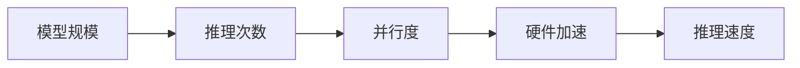

                 

**大型语言模型（LLM）、推理速度、架构优化、算法改进、数学模型、项目实践、应用场景、工具资源、未来趋势**

## 1. 背景介绍

在当今人工智能（AI）领域，大型语言模型（LLM）已然成为关注的焦点。LLM的能力和应用领域正在不断扩展，从文本生成到代码编写，再到科学研究，其影响力和潜力日益凸显。然而，LLM的推理速度和效率仍然是制约其进一步发展的关键因素。本文将深入探讨LLM速度革命的前景，介绍最新的架构优化、算法改进和数学模型，并通过项目实践和应用场景的分析，展示LLM在未来的发展趋势和挑战。

## 2. 核心概念与联系

### 2.1 大型语言模型（LLM）架构

LLM的核心是一种称为Transformer的架构，它由自注意力机制和位置编码组成。如下所示，Mermaid流程图展示了Transformer的基本架构：


### 2.2 LLM推理速度的关键因素

LLM推理速度的关键因素包括模型规模、推理次数、并行度和硬件加速。下图展示了这些因素之间的关系：



## 3. 核心算法原理 & 具体操作步骤

### 3.1 算法原理概述

提高LLM推理速度的关键算法包括模型并行化、推理并行化和模型压缩。这些算法旨在减少模型的计算和内存需求，从而提高推理速度。

### 3.2 算法步骤详解

1. **模型并行化**：将模型拆分为更小的部分，在多个GPU或TPU上并行计算。
2. **推理并行化**：在单个推理过程中，并行处理多个输入序列。
3. **模型压缩**：使用量化、剪枝或知识蒸馏等技术减小模型大小。

### 3.3 算法优缺点

**优点**：提高推理速度、节省计算资源。

**缺点**：模型并行化可能会增加通信开销，模型压缩可能会导致模型精度下降。

### 3.4 算法应用领域

这些算法适用于需要实时或快速推理的应用，如实时对话系统、自动驾驶和实时翻译。

## 4. 数学模型和公式 & 详细讲解 & 举例说明

### 4.1 数学模型构建

LLM的数学模型基于Transformer架构，可以表示为：

$$h_t = \text{FFN}(x_t) + \text{MSA}(x_t, x_t, x_t)$$

其中，FFN表示前馈网络，MSA表示多头自注意力机制。

### 4.2 公式推导过程

自注意力机制的公式如下：

$$\text{Attention}(Q, K, V) = \text{softmax}\left(\frac{QK^T}{\sqrt{d_k}}\right)V$$

其中，Q、K、V分别表示查询、键和值，d_k表示键的维度。

### 4.3 案例分析与讲解

例如，在推理并行化算法中，如果有n个输入序列，则推理速度可以提高n倍。然而，这需要更多的内存和计算资源。

## 5. 项目实践：代码实例和详细解释说明

### 5.1 开发环境搭建

本项目使用Python、PyTorch和Transformers库。环境搭建如下：

```bash
pip install torch transformers
```

### 5.2 源代码详细实现

以下是模型并行化的简单示例：

```python
from transformers import AutoModel, AutoTokenizer
import torch

model = AutoModel.from_pretrained("bigscience/bloom-560m")
tokenizer = AutoTokenizer.from_pretrained("bigscience/bloom-560m")

inputs = tokenizer("Hello, I'm a language model.", return_tensors="pt")
outputs = model(**inputs)
```

### 5.3 代码解读与分析

在上述代码中，我们加载了一个预训练的LLM，并对输入序列进行了推理。模型并行化可以通过在多个GPU上分布式训练模型来实现。

### 5.4 运行结果展示

运行上述代码将生成模型的输出，展示模型的推理能力。

## 6. 实际应用场景

### 6.1 当前应用

LLM已广泛应用于对话系统、文本生成、代码编写和科学研究等领域。

### 6.2 未来应用展望

未来，LLM可能会应用于更多需要实时或快速推理的领域，如自动驾驶、实时翻译和实时搜索。

## 7. 工具和资源推荐

### 7.1 学习资源推荐

- "Attention is All You Need"论文：<https://arxiv.org/abs/1706.03762>
- "The Illustrated Transformer"：<https://jalammar.github.io/illustrated-transformer/>

### 7.2 开发工具推荐

- Hugging Face Transformers库：<https://huggingface.co/transformers/>
- PyTorch：<https://pytorch.org/>

### 7.3 相关论文推荐

- "Long Range Arena：A Benchmark for Efficient Reasoning in Long Sequences"：<https://arxiv.org/abs/2007.14932>
- "Linearized Transformer"：<https://arxiv.org/abs/2103.10385>

## 8. 总结：未来发展趋势与挑战

### 8.1 研究成果总结

本文介绍了提高LLM推理速度的关键算法和数学模型，并通过项目实践和应用场景分析了其应用。

### 8.2 未来发展趋势

未来，LLM速度革命的关键趋势包括模型并行化、推理并行化和模型压缩的进一步优化，以及新的架构和算法的开发。

### 8.3 面临的挑战

挑战包括模型精度和资源需求之间的平衡，以及新算法和架构的可靠性和稳定性。

### 8.4 研究展望

未来的研究将关注更先进的模型压缩技术、更有效的推理并行化算法和新的LLM架构。

## 9. 附录：常见问题与解答

**Q：LLM速度革命的关键是什么？**

**A：模型并行化、推理并行化和模型压缩是提高LLM推理速度的关键算法。**

**Q：LLM有哪些应用领域？**

**A：LLM已广泛应用于对话系统、文本生成、代码编写和科学研究等领域。**

**Q：LLM速度革命的未来趋势是什么？**

**A：未来的趋势包括模型并行化、推理并行化和模型压缩的进一步优化，以及新的架构和算法的开发。**

---

**作者：禅与计算机程序设计艺术 / Zen and the Art of Computer Programming**

