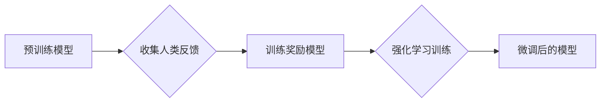

> 强化学习，RLHF，PPO，DPO，模型微调，自然语言处理，生成模型

## 1. 背景介绍

在上一章中，我们探讨了模型微调的基本概念和方法，并介绍了一些常用的微调技术，例如参数共享、知识蒸馏等。这些技术在提升预训练模型在特定任务上的性能方面取得了显著成果。然而，对于一些复杂的任务，例如对话系统、机器人控制等，传统的微调方法可能难以达到理想的效果。

强化学习（Reinforcement Learning，RL）作为一种能够学习复杂行为的机器学习方法，为模型微调提供了新的思路。RLHF（Reinforcement Learning from Human Feedback）是一种结合强化学习和人类反馈的模型微调方法，它能够有效地训练模型生成更符合人类期望的输出。

## 2. 核心概念与联系

RLHF的核心思想是利用人类反馈来指导模型的学习过程。具体来说，RLHF通常包含以下几个步骤：

1. **数据收集:** 收集人类对模型输出的反馈，例如评分、排名、修改建议等。
2. **奖励模型训练:** 利用收集到的反馈数据训练一个奖励模型，该模型能够预测人类对模型输出的满意程度。
3. **强化学习训练:** 将奖励模型作为奖励函数，利用强化学习算法训练模型，使其能够最大化奖励。

**Mermaid 流程图:**



## 3. 核心算法原理 & 具体操作步骤

### 3.1  算法原理概述

RLHF的核心算法是基于策略梯度的强化学习算法，例如Proximal Policy Optimization (PPO) 和 Deep Deterministic Policy Gradient (DDPG)。这些算法通过迭代更新模型的参数，使其能够最大化奖励函数的期望值。

### 3.2  算法步骤详解

1. **初始化模型参数:** 从预训练模型的参数开始，初始化强化学习模型的参数。
2. **收集环境状态和动作:** 将模型输入到环境中，收集环境的状态和模型的动作。
3. **计算奖励:** 根据环境的状态和动作，计算模型获得的奖励。
4. **更新模型参数:** 利用策略梯度算法，根据奖励信号更新模型的参数。
5. **重复步骤2-4:** 重复以上步骤，直到模型收敛。

### 3.3  算法优缺点

**优点:**

* 可以学习到更符合人类期望的行为。
* 可以处理复杂的任务，例如对话系统、机器人控制等。

**缺点:**

* 需要大量的训练数据和计算资源。
* 训练过程可能比较复杂，需要专业的知识和经验。

### 3.4  算法应用领域

RLHF在以下领域具有广泛的应用前景:

* **自然语言处理:** 训练更智能的聊天机器人、文本生成器等。
* **计算机视觉:** 训练更精准的图像识别、目标跟踪等模型。
* **游戏开发:** 训练更强大的游戏 AI。

## 4. 数学模型和公式 & 详细讲解 & 举例说明

### 4.1  数学模型构建

在RLHF中，我们通常使用策略梯度算法来更新模型的参数。策略梯度算法的目标是最大化奖励函数的期望值，即：

$$
J(\theta) = E_{\tau \sim \pi_{\theta}}[R(\tau)]
$$

其中：

* $\theta$ 是模型的参数。
* $\pi_{\theta}$ 是由模型参数 $\theta$ 决定的策略。
* $\tau$ 是一个轨迹，即一系列状态、动作和奖励。
* $R(\tau)$ 是轨迹 $\tau$ 的总奖励。

### 4.2  公式推导过程

策略梯度算法的基本思想是通过梯度上升来更新模型的参数，即：

$$
\theta = \theta + \alpha \nabla_{\theta} J(\theta)
$$

其中：

* $\alpha$ 是学习率。
* $\nabla_{\theta} J(\theta)$ 是奖励函数 $J(\theta)$ 对模型参数 $\theta$ 的梯度。

### 4.3  案例分析与讲解

假设我们有一个简单的强化学习任务，目标是训练一个模型学习玩一个简单的游戏。游戏环境的状态空间是有限的，动作空间也是有限的。模型的策略是一个概率分布，它决定了在每个状态下采取每个动作的概率。

在训练过程中，模型会与环境交互，收集环境的状态、动作和奖励信息。然后，模型会利用策略梯度算法更新其参数，使其能够最大化总奖励。

## 5. 项目实践：代码实例和详细解释说明

### 5.1  开发环境搭建

为了实现RLHF，我们需要搭建一个开发环境，包括以下软件：

* Python 3.x
* TensorFlow 或 PyTorch
* OpenAI Gym 或其他强化学习库

### 5.2  源代码详细实现

以下是一个简单的RLHF代码示例，使用TensorFlow和OpenAI Gym实现：

```python
import tensorflow as tf
import gym

# 定义环境
env = gym.make('CartPole-v1')

# 定义模型
model = tf.keras.Sequential([
    tf.keras.layers.Dense(128, activation='relu'),
    tf.keras.layers.Dense(env.action_space.n)
])

# 定义奖励函数
def reward_function(state, action):
    # 根据状态和动作计算奖励
    return ...

# 定义训练循环
for episode in range(num_episodes):
    state = env.reset()
    done = False
    total_reward = 0

    while not done:
        # 选择动作
        action = model.predict(state)[0]

        # 执行动作
        next_state, reward, done, _ = env.step(action)

        # 更新奖励函数
        reward_signal = reward_function(state, action)

        # 更新模型参数
        model.train_on_batch(state, reward_signal)

        # 更新状态
        state = next_state

    total_reward += reward

# 打印总奖励
print(f'Total reward: {total_reward}')
```

### 5.3  代码解读与分析

这段代码实现了RLHF的基本流程。首先，定义了环境和模型。然后，定义了奖励函数，该函数根据状态和动作计算奖励。最后，使用训练循环更新模型参数，使其能够最大化总奖励。

### 5.4  运行结果展示

运行这段代码后，模型将学习到玩CartPole-v1游戏的策略，并能够获得越来越高的总奖励。

## 6. 实际应用场景

RLHF在实际应用场景中具有广泛的应用前景，例如：

* **对话系统:** 训练更智能、更自然、更符合人类期望的聊天机器人。
* **文本生成:** 训练能够生成更流畅、更符合语义的文本生成模型。
* **机器人控制:** 训练能够执行更复杂、更精细的任务的机器人控制算法。

### 6.4  未来应用展望

随着强化学习和自然语言处理技术的不断发展，RLHF在未来将有更广泛的应用场景，例如：

* **个性化推荐:** 训练能够根据用户的喜好和行为推荐个性化内容的推荐系统。
* **自动驾驶:** 训练能够在复杂环境中安全驾驶的自动驾驶算法。
* **医疗诊断:** 训练能够辅助医生进行诊断的医疗诊断系统。

## 7. 工具和资源推荐

### 7.1  学习资源推荐

* **强化学习书籍:**
    * Reinforcement Learning: An Introduction by Richard S. Sutton and Andrew G. Barto
    * Deep Reinforcement Learning Hands-On by Maxim Lapan
* **在线课程:**
    * Deep Reinforcement Learning Specialization by DeepLearning.AI
    * Reinforcement Learning by David Silver (University of DeepMind)

### 7.2  开发工具推荐

* **TensorFlow:** https://www.tensorflow.org/
* **PyTorch:** https://pytorch.org/
* **OpenAI Gym:** https://gym.openai.com/

### 7.3  相关论文推荐

* **Proximal Policy Optimization Algorithms** by John Schulman et al.
* **Asynchronous Methods for Deep Reinforcement Learning** by Volodymyr Mnih et al.
* **Human Feedback Guided Reinforcement Learning** by Dario Amodei et al.

## 8. 总结：未来发展趋势与挑战

### 8.1  研究成果总结

RLHF在模型微调领域取得了显著成果，能够训练出更符合人类期望的模型。

### 8.2  未来发展趋势

未来，RLHF的研究将朝着以下方向发展:

* **更有效的奖励函数设计:** 设计更准确、更有效的奖励函数，能够更好地指导模型的学习过程。
* **更鲁棒的训练算法:** 开发更鲁棒的训练算法，能够应对更复杂的任务和环境。
* **更安全的模型部署:** 确保RLHF训练的模型在实际应用中安全可靠。

### 8.3  面临的挑战

RLHF仍然面临一些挑战，例如:

* **数据效率:** RLHF需要大量的训练数据，这在某些情况下可能难以获得。
* **可解释性:** RLHF训练的模型的决策过程可能难以解释，这可能会影响模型的信任度。
* **伦理问题:** RLHF训练的模型可能会产生一些不期望的行为，例如偏见、歧视等，需要谨慎考虑伦理问题。

### 8.4  研究展望

尽管面临挑战，但RLHF仍然是一个非常有前景的研究方向。随着技术的不断发展，RLHF将能够应用于更多领域，为人类社会带来更多价值。

## 9. 附录：常见问题与解答

### 9.1  Q1: RLHF和传统的微调方法有什么区别？

**A1:** RLHF和传统的微调方法的主要区别在于，RLHF利用人类反馈来指导模型的学习过程，而传统的微调方法则依赖于预先定义的损失函数。

### 9.2  Q2: RLHF的训练过程复杂吗？

**A2:** RLHF的训练过程确实比较复杂，需要一定的机器学习和强化学习知识。

### 9.3  Q3: RLHF有哪些应用场景？

**A3:** RLHF在对话系统、文本生成、机器人控制等领域都有广泛的应用场景。

### 9.4  Q4: RLHF有哪些挑战？

**A4:** RLHF面临的数据效率、可解释性和伦理问题等挑战。


作者：禅与计算机程序设计艺术 / Zen and the Art of Computer Programming 
<end_of_turn>