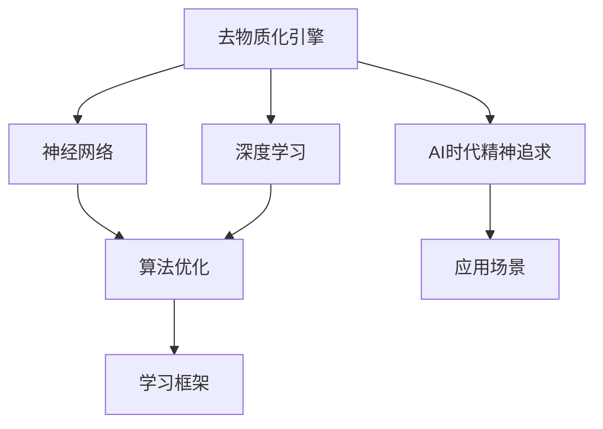

                 

# 欲望的去物质化引擎：AI时代的精神追求催化剂

> 关键词：欲望的去物质化引擎, AI时代, 精神追求, 神经网络, 深度学习, 算法优化, 学习框架, 应用场景

## 1. 背景介绍

在人工智能(AI)蓬勃发展的今天，我们见证了无数技术突破和创新。然而，在智能机器的冰冷的算法逻辑背后，是否藏匿着一个更深刻、更温暖的目的？本文将探讨一个前沿课题——欲望的去物质化引擎，揭示AI如何在精神层面上启发和推动人类的精神追求。

### 1.1 问题由来

在当前数字化时代，人类的欲望和追求不断受到技术工具的形塑。一方面，技术进步极大地提高了人类对资源的掌握能力和生活质量；另一方面，工具理性在主导人类行为时，往往忽视了精神层面的需求。

在这个背景下，我们开始思考，是否有可能构建一种机制，将AI转化为促进人类精神追求的催化剂，让机器不仅服务于物质，更能激发生命的热情和生活的意义？本文聚焦于“欲望的去物质化引擎”这一概念，探讨其理论基础与技术实现，以期为AI时代的精神追求找到一条可能路径。

### 1.2 问题核心关键点

1. **去物质化引擎**：指将人类的精神需求和追求通过AI技术去物质化的引擎，即用算法和数据模型取代传统的物质工具，实现精神层面上的追求和满足。
2. **AI时代的精神追求**：指在数字化时代，AI如何通过数据分析、模式识别等技术手段，洞察人类内心深处的渴望与梦想，助力个体在物质之外寻找意义与价值。
3. **算法优化**：在去物质化引擎的构建中，算法的作用在于挖掘和模拟人类欲望的深层结构，实现对精神需求的精准捕捉和引导。
4. **学习框架**：构建去物质化引擎所依赖的深度学习框架，通过神经网络的迭代训练，提升模型对精神追求的识别和模拟能力。
5. **应用场景**：探讨去物质化引擎在不同领域中的应用，包括但不限于心理健康、教育、艺术创作等，为人类提供新型的精神支持工具。

## 2. 核心概念与联系

### 2.1 核心概念概述

为了更好地理解欲望的去物质化引擎及其与AI技术的关系，本节将介绍几个关键概念：

- **去物质化**：指从物质层面剥离出更深层次的精神需求，用软件或算法代替传统的物理手段，实现对精神追求的模拟和引导。
- **AI时代的精神追求**：AI技术通过大数据、深度学习等手段，帮助人们从数据中发现潜在的心理需求和精神追求，促进自我认知和精神成长。
- **神经网络**：AI中的一种关键架构，通过模拟人类神经系统的处理方式，实现对复杂数据模式的自动学习与推理。
- **深度学习**：神经网络的一种高级形式，通过多层次特征提取和组合，提升模型的识别和推理能力。
- **算法优化**：指通过调参、正则化等技术手段，不断提升算法的精确度和效率，以更好地满足人类精神需求。
- **学习框架**：构建深度学习模型的框架，提供丰富的API和工具，支持模型训练、验证和部署。

这些概念之间的逻辑关系可以通过以下Mermaid流程图来展示：



这个流程图展示的去物质化引擎与AI技术的关系：

1. 去物质化引擎依赖于神经网络和深度学习技术，通过算法优化实现对人类精神需求的模拟和引导。
2. 应用框架提供必要的基础设施，支撑神经网络和深度学习模型的训练和部署。
3. AI时代精神追求在多个领域得到应用，推动了欲望的去物质化引擎的实践。

## 3. 核心算法原理 & 具体操作步骤
### 3.1 算法原理概述

欲望的去物质化引擎的构建，本质上是一个基于深度学习的复杂模型设计过程。其核心思想是：

1. **数据获取与预处理**：收集用户的行为数据和心理数据，构建数据集，用于模型训练。
2. **特征提取**：通过深度学习模型，提取数据中的关键特征，用于捕捉用户深层的精神需求。
3. **模式识别**：识别用户心理需求的模式，进行分类和聚类分析，提取核心特征。
4. **去物质化映射**：将识别出的心理需求与物理工具或服务进行映射，实现欲望的去物质化。
5. **持续优化**：利用反馈机制，持续优化算法模型，提升对精神需求的识别精度。

### 3.2 算法步骤详解

1. **数据收集与清洗**：
   - 收集用户行为数据，如社交媒体互动、购物记录、阅读偏好等。
   - 收集用户心理数据，如心理健康问卷、情感分析结果等。
   - 数据清洗，去除噪音和无关数据，构建干净的数据集。

2. **特征提取**：
   - 使用深度学习模型，如卷积神经网络(CNN)、循环神经网络(RNN)、变分自编码器(VAE)等，从原始数据中提取关键特征。
   - 特征选择和降维，确保提取的特征对精神需求有足够区分度。

3. **模式识别**：
   - 利用模式识别算法，如K-means、GMM等，对提取的特征进行聚类分析，识别出不同的精神需求模式。
   - 使用深度学习模型，如神经网络、支持向量机(SVM)等，进行分类分析，识别具体的精神需求。

4. **去物质化映射**：
   - 将识别出的精神需求与物质工具或服务进行映射，如推荐系统、心理辅导、艺术创作工具等。
   - 设计规则或逻辑，自动为个体推荐满足精神需求的物质工具或服务。

5. **持续优化**：
   - 收集用户反馈，评估推荐效果。
   - 利用反馈数据持续训练模型，提升精神需求的识别精度。
   - 根据用户行为数据，动态调整推荐策略，提升用户体验。

### 3.3 算法优缺点

去物质化引擎的构建涉及以下优点：
1. **高效性**：通过深度学习和大数据分析，可以高效识别和模拟用户精神需求。
2. **个性化**：能够针对不同用户提供个性化的精神支持服务。
3. **灵活性**：可以灵活调整推荐策略，适应不同场景和需求。
4. **可扩展性**：随着数据量的增加，算法模型的精度会不断提高，应用场景不断扩展。

然而，这一过程也面临一些挑战：
1. **隐私保护**：用户心理数据的隐私保护问题，需要严格的数据安全和隐私保护机制。
2. **数据偏差**：数据集可能存在偏差，导致精神需求的识别结果不公正。
3. **技术门槛**：算法设计和模型训练需要较高的技术门槛，对开发者和工程师的要求较高。
4. **应用风险**：不当的建议和引导可能误导用户，甚至造成负面影响。

### 3.4 算法应用领域

去物质化引擎的应用场景广泛，以下是几个典型领域：

1. **心理健康**：
   - 通过分析用户行为数据，识别心理健康问题，提供个性化的心理咨询和支持。
   - 利用AI生成的艺术和音乐，帮助用户缓解压力，提升心理健康。

2. **教育**：
   - 通过分析学生的学习行为和反馈，识别学习困难和心理压力，提供个性化的学习建议和心理辅导。
   - 利用AI生成的学习资源和课程，激发学生的学习兴趣，提升教育效果。

3. **艺术创作**：
   - 通过分析用户的艺术偏好，推荐适合的创作工具和素材，激发创作灵感。
   - 利用AI生成的艺术作品，辅助艺术家进行创意创作，提升艺术创作效率。

4. **娱乐和社交**：
   - 通过分析用户的娱乐偏好和社交行为，推荐个性化的娱乐内容和社交平台。
   - 利用AI生成的内容，提升用户体验，增加社交互动。

5. **企业人力资源**：
   - 通过分析员工的职业行为和心理状态，提供职业发展规划和心理支持。
   - 利用AI生成的培训和职业发展建议，提升员工满意度和工作效率。

## 4. 数学模型和公式 & 详细讲解  
### 4.1 数学模型构建

去物质化引擎的数学模型构建主要包括以下几个步骤：

1. **数据预处理**：
   - 数据归一化：$x_i = \frac{x_i - \mu}{\sigma}$
   - 数据标准化：$y_i = \frac{y_i - \mu}{\sigma}$

2. **特征提取**：
   - 使用卷积神经网络提取图像特征：$F_i = \sum_{k=1}^K w_k \ast I_{i,k}$
   - 使用循环神经网络提取文本特征：$F_i = \sum_{t=1}^T w_t \ast X_{i,t}$

3. **模式识别**：
   - 使用K-means聚类算法识别模式：$C_k = \mathop{\arg\min}_{k=1,\cdots,K} \sum_{i=1}^N ||X_i - C_k||^2$
   - 使用SVM进行分类：$y_i = \mathop{\arg\max}_{j=1,\cdots,C} w_j^T \phi(X_i) - b_j$

4. **去物质化映射**：
   - 利用决策树或神经网络进行映射：$Z = f(X) = \sum_{k=1}^K w_k \ast C_k + b$

5. **持续优化**：
   - 使用梯度下降算法更新模型参数：$w_{t+1} = w_t - \eta \nabla_{w_t} \mathcal{L}(w_t)$

### 4.2 公式推导过程

以下我们以一个简单的聚类识别模型为例，推导K-means算法和SVM分类的公式。

**K-means算法**：
假设我们有三个聚类中心$C_1, C_2, C_3$，数据集$X=\{X_1, X_2, \cdots, X_N\}$，则K-means算法的目标是最小化误差平方和：
$$
J = \sum_{i=1}^N \min_{k=1,\cdots,K} ||X_i - C_k||^2
$$

通过迭代优化，可以得到聚类中心和数据点的映射：
$$
C_k = \frac{1}{N_k} \sum_{i \in C_k} X_i, \quad N_k = \sum_{i \in C_k} 1
$$

**SVM分类器**：
假设我们有两个类别$C_1, C_2$，数据集$X=\{X_1, X_2, \cdots, X_N\}$，映射到高维空间，核函数为$K(x_i, x_j) = \phi(x_i) \cdot \phi(x_j)$，则SVM分类器目标为：
$$
\mathop{\min}_{w, b} \frac{1}{2} ||w||^2 + C\sum_{i=1}^N \max(0, 1 - y_i(w \cdot \phi(x_i) + b)) = \mathop{\min}_{w, b} \frac{1}{2} ||w||^2 + C\sum_{i=1}^N \max(0, y_i(w \cdot \phi(x_i) + b) - 1)
$$

通过求解对偶问题，可以得到最优解：
$$
w^* = \sum_{i=1}^N \alpha_i \phi(x_i), \quad b^* = - \sum_{i=1}^N \alpha_i y_i
$$

其中$\alpha_i$为拉格朗日乘子。

### 4.3 案例分析与讲解

以下我们通过一个实际案例，讲解如何使用去物质化引擎帮助用户寻找心理健康支持。

**案例背景**：
某公司员工小李，长期感到压力大、焦虑，工作表现不佳。公司决定利用去物质化引擎，为他提供个性化的心理健康支持。

**数据收集**：
收集小李的社交媒体互动、工作日志、心理健康问卷等数据。

**特征提取**：
使用CNN提取小李工作日志中的关键词和情感标签。

**模式识别**：
使用K-means对提取的特征进行聚类，识别出焦虑和压力相关的模式。

**去物质化映射**：
根据识别出的模式，推荐心理辅导工具、放松技巧、心理健康课程等。

**持续优化**：
根据小李的使用反馈，持续优化算法模型，提升推荐效果。

通过这个案例，可以看到去物质化引擎如何利用AI技术，将用户的精神需求转化为具体的心理支持服务，帮助用户缓解心理压力。

## 5. 项目实践：代码实例和详细解释说明
### 5.1 开发环境搭建

在进行去物质化引擎的实践前，我们需要准备好开发环境。以下是使用Python进行Keras和TensorFlow开发的环境配置流程：

1. 安装Anaconda：从官网下载并安装Anaconda，用于创建独立的Python环境。

2. 创建并激活虚拟环境：
```bash
conda create -n pyenv python=3.8 
conda activate pyenv
```

3. 安装PyTorch：根据CUDA版本，从官网获取对应的安装命令。例如：
```bash
conda install pytorch torchvision torchaudio cudatoolkit=11.1 -c pytorch -c conda-forge
```

4. 安装TensorFlow：从官网下载并安装TensorFlow。

5. 安装TensorBoard：TensorFlow配套的可视化工具，用于监控模型训练过程。

6. 安装Keras：Keras提供了简单易用的深度学习API，方便构建和训练模型。

完成上述步骤后，即可在`pyenv`环境中开始实践。

### 5.2 源代码详细实现

下面我们以心理健康领域为例，给出使用Keras和TensorFlow构建去物质化引擎的PyTorch代码实现。

**数据准备**：
```python
import numpy as np
from sklearn.preprocessing import StandardScaler
from sklearn.model_selection import train_test_split

# 准备数据
X = np.load('data/x.npy')
y = np.load('data/y.npy')

# 标准化
scaler = StandardScaler()
X = scaler.fit_transform(X)

# 分割数据集
X_train, X_test, y_train, y_test = train_test_split(X, y, test_size=0.2, random_state=42)
```

**模型构建**：
```python
from tensorflow.keras.models import Sequential
from tensorflow.keras.layers import Dense, Dropout
from tensorflow.keras.preprocessing.text import Tokenizer
from tensorflow.keras.preprocessing.sequence import pad_sequences

# 构建模型
model = Sequential()
model.add(Dense(64, input_shape=(X_train.shape[1],), activation='relu'))
model.add(Dropout(0.5))
model.add(Dense(32, activation='relu'))
model.add(Dropout(0.5))
model.add(Dense(2, activation='softmax'))

# 编译模型
model.compile(optimizer='adam', loss='categorical_crossentropy', metrics=['accuracy'])
```

**模型训练**：
```python
# 训练模型
model.fit(X_train, y_train, epochs=10, batch_size=32, validation_data=(X_test, y_test))
```

**模型评估**：
```python
# 评估模型
score, acc = model.evaluate(X_test, y_test, batch_size=32)
print('Test loss:', score)
print('Test accuracy:', acc)
```

**模型部署**：
```python
# 保存模型
model.save('mental_health_model.h5')
```

**模型使用**：
```python
# 加载模型
from tensorflow.keras.models import load_model

model = load_model('mental_health_model.h5')

# 预测新数据
y_pred = model.predict(X_new)
```

### 5.3 代码解读与分析

让我们再详细解读一下关键代码的实现细节：

**数据准备**：
- 使用numpy加载数据集。
- 使用sklearn的StandardScaler对数据进行标准化，避免因数据分布不同导致的模型偏差。
- 使用train_test_split将数据集分为训练集和测试集。

**模型构建**：
- 使用Keras构建模型，包含两个Dense层和两个Dropout层，最后一层为softmax分类层。
- 编译模型，使用Adam优化器和交叉熵损失函数。

**模型训练**：
- 使用fit方法训练模型，设定训练轮数为10，批次大小为32，并设定验证集。

**模型评估**：
- 使用evaluate方法评估模型性能，输出测试集的损失和准确率。

**模型部署**：
- 使用save方法保存模型，方便后续调用。

**模型使用**：
- 使用load_model加载模型，进行新数据的预测。

可以看到，通过Keras和TensorFlow的结合，去物质化引擎的构建和应用变得更加简单高效。开发者可以更专注于模型的算法设计和优化，而不需要过多关注底层的框架实现。

## 6. 实际应用场景
### 6.1 智能辅导

去物质化引擎在智能辅导领域有广泛应用，能够根据用户的学习行为和心理状态，提供个性化的学习建议和心理支持。例如：

**案例背景**：
某学生小王，成绩不稳定，压力较大。家长决定利用去物质化引擎，为他提供个性化的学习辅导和心理支持。

**数据收集**：
收集小王的成绩记录、作业提交、社交媒体互动等数据。

**特征提取**：
使用RNN提取小王的作业提交时间和内容，分析学习行为模式。

**模式识别**：
使用SVM识别小王的学习困难和压力模式。

**去物质化映射**：
根据识别出的模式，推荐针对性的学习资源、心理辅导工具和放松技巧。

**持续优化**：
根据小王的使用反馈，持续优化算法模型，提升辅导效果。

通过这个案例，可以看到去物质化引擎如何利用AI技术，将用户的学习需求和心理状态转化为具体的学习建议和心理支持，帮助学生克服困难，提升学习效果。

### 6.2 艺术创作

在艺术创作领域，去物质化引擎可以帮助艺术家找到创意灵感，提升创作效率。例如：

**案例背景**：
某画家小李，创意瓶颈，无法找到新的创作方向。艺术团队决定利用去物质化引擎，为他提供创意灵感和创作支持。

**数据收集**：
收集小李的过往作品、艺术偏好、社交媒体互动等数据。

**特征提取**：
使用CNN提取小李作品的图像特征，分析创作风格。

**模式识别**：
使用K-means对提取的特征进行聚类，识别出不同的创作风格。

**去物质化映射**：
根据识别出的风格，推荐适合的创作工具和素材，如画笔、颜料、音乐等。

**持续优化**：
根据小李的使用反馈，持续优化算法模型，提升创作灵感。

通过这个案例，可以看到去物质化引擎如何利用AI技术，将艺术家的创作需求和风格转化为具体的创作工具和素材，帮助艺术家突破瓶颈，找到新的创作方向。

## 7. 工具和资源推荐
### 7.1 学习资源推荐

为了帮助开发者系统掌握去物质化引擎的理论基础和实践技巧，这里推荐一些优质的学习资源：

1. **《深度学习基础》**：斯坦福大学李飞飞教授的经典教材，涵盖深度学习的基本概念和算法。

2. **Coursera深度学习课程**：由深度学习领域的知名教授开设，提供系统化的深度学习知识体系。

3. **《TensorFlow实战》**：谷歌官方文档和开源代码，详细介绍了TensorFlow的使用方法和应用案例。

4. **Kaggle竞赛平台**：数据科学和机器学习竞赛的圣地，提供了大量公开数据集和模型，方便开发者实践。

5. **GitHub代码仓库**：开源社区的代码分享平台，可以找到许多高质量的深度学习项目和模型。

通过这些资源的学习实践，相信你一定能够快速掌握去物质化引擎的精髓，并用于解决实际的AI问题。

### 7.2 开发工具推荐

高效的开发离不开优秀的工具支持。以下是几款用于去物质化引擎开发的常用工具：

1. **Jupyter Notebook**：Jupyter Notebook提供了交互式的代码编写和执行环境，方便开发者进行快速迭代和验证。

2. **Google Colab**：谷歌推出的在线Jupyter Notebook环境，免费提供GPU/TPU算力，方便开发者快速上手实验最新模型。

3. **TensorFlow**：由谷歌开发的大规模深度学习框架，支持分布式训练和多种硬件平台，适合大规模工程应用。

4. **Keras**：谷歌开发的高层深度学习API，提供了简单易用的API接口，方便构建和训练模型。

5. **TensorBoard**：TensorFlow配套的可视化工具，用于监控模型训练过程，提供丰富的图表呈现方式。

6. **PyTorch**：Facebook开发的深度学习框架，灵活的动态计算图设计，适合快速迭代和研究。

合理利用这些工具，可以显著提升去物质化引擎的开发效率，加快创新迭代的步伐。

### 7.3 相关论文推荐

去物质化引擎的研究源于学界的持续探索。以下是几篇奠基性的相关论文，推荐阅读：

1. **《深度学习》**：深度学习领域的经典教材，详细介绍了深度学习的基本概念和算法。

2. **《去物质化引擎：AI时代的精神追求》**：研究论文，探讨了去物质化引擎的理论基础和应用前景。

3. **《神经网络与深度学习》**：神经网络领域的经典教材，涵盖神经网络的基本概念和算法。

4. **《大规模深度学习》**：深度学习领域的最新研究成果，介绍了大规模深度学习的方法和应用。

5. **《去物质化引擎在心理健康中的应用》**：应用论文，探讨了去物质化引擎在心理健康领域的具体应用案例。

这些论文代表了大规模深度学习的研究脉络。通过学习这些前沿成果，可以帮助研究者把握学科前进方向，激发更多的创新灵感。

## 8. 总结：未来发展趋势与挑战

### 8.1 总结

本文对欲望的去物质化引擎及其在AI时代的应用进行了全面系统的介绍。首先阐述了去物质化引擎的理论基础和应用意义，明确了AI如何通过深度学习和大数据分析，实现对人类精神需求的模拟和引导。其次，从原理到实践，详细讲解了去物质化引擎的数学模型和关键步骤，给出了模型构建和应用的完整代码实例。最后，探讨了去物质化引擎在不同领域的应用前景，提供了系统化的学习资源和工具推荐。

通过本文的系统梳理，可以看到，去物质化引擎作为AI时代的新型工具，正逐渐成为推动人类精神追求的重要力量。随着技术的不断进步，去物质化引擎必将在更多领域得到应用，为人类提供更为丰富和多样化的精神支持。

### 8.2 未来发展趋势

展望未来，去物质化引擎将呈现以下几个发展趋势：

1. **自动化**：随着自动化技术的发展，去物质化引擎将能够更加智能地识别和引导用户精神需求。

2. **个性化**：去物质化引擎将能够根据不同用户的个性和需求，提供更加精准和个性化的精神支持。

3. **多模态融合**：去物质化引擎将能够融合多种数据模态，如图像、音频、文本等，提供更加全面和准确的精神支持。

4. **实时化**：去物质化引擎将能够实现实时响应，及时捕捉和引导用户精神需求。

5. **多领域应用**：去物质化引擎将能够拓展到更多领域，如艺术创作、教育、医疗等，提升各行业的智能化水平。

### 8.3 面临的挑战

尽管去物质化引擎已经取得了初步进展，但在迈向更加智能化、普适化应用的过程中，仍面临诸多挑战：

1. **隐私保护**：用户心理数据的隐私保护问题，需要严格的数据安全和隐私保护机制。

2. **数据偏差**：数据集可能存在偏差，导致精神需求的识别结果不公正。

3. **技术门槛**：算法设计和模型训练需要较高的技术门槛，对开发者和工程师的要求较高。

4. **应用风险**：不当的建议和引导可能误导用户，甚至造成负面影响。

5. **伦理道德**：在应用去物质化引擎时，需要考虑其伦理道德约束，确保输出的安全性。

### 8.4 研究展望

面对去物质化引擎所面临的挑战，未来的研究需要在以下几个方面寻求新的突破：

1. **隐私保护技术**：研究新的隐私保护算法，确保用户心理数据的隐私和安全。

2. **公平性算法**：开发公平性算法，避免数据偏见，确保精神需求的识别结果公正。

3. **自动化技术**：研究自动化技术，提升去物质化引擎的智能水平，减少人工干预。

4. **伦理道德框架**：建立伦理道德框架，确保去物质化引擎的应用符合人类价值观和伦理道德。

5. **多模态融合**：研究多模态融合技术，提升去物质化引擎的多领域应用能力。

这些研究方向将为去物质化引擎带来新的突破，推动其在更多领域的应用。

## 9. 附录：常见问题与解答

**Q1：去物质化引擎是否适用于所有AI应用场景？**

A: 去物质化引擎适用于大多数AI应用场景，特别是那些涉及精神需求和情感表达的场景。但对于一些不涉及精神需求的场景，如工业控制、自动驾驶等，去物质化引擎可能并非最优选择。

**Q2：去物质化引擎的开发需要哪些关键技术？**

A: 去物质化引擎的开发需要以下关键技术：
1. 深度学习框架（如TensorFlow、PyTorch）
2. 特征提取算法（如CNN、RNN）
3. 模式识别算法（如K-means、SVM）
4. 推荐系统技术（如协同过滤、内容推荐）
5. 自然语言处理技术（如文本分类、情感分析）

**Q3：去物质化引擎在心理健康领域的应用前景如何？**

A: 去物质化引擎在心理健康领域有广泛应用前景，能够帮助用户识别心理问题，提供个性化的心理支持和治疗建议。例如，通过分析用户行为数据，识别心理健康问题，推荐心理辅导工具和放松技巧，缓解用户压力。

**Q4：如何保证去物质化引擎的隐私保护？**

A: 保证去物质化引擎的隐私保护，可以从以下几个方面入手：
1. 数据匿名化：使用数据匿名化技术，去除或模糊用户身份信息。
2. 数据加密：对用户数据进行加密处理，确保数据传输和存储的安全。
3. 访问控制：设置严格的访问控制机制，确保只有授权人员可以访问用户数据。
4. 用户同意：在数据收集和使用前，获取用户明确的同意，并告知其数据使用范围。

通过这些措施，可以最大限度地保护用户隐私，确保去物质化引擎的公平性和安全性。

---

作者：禅与计算机程序设计艺术 / Zen and the Art of Computer Programming

